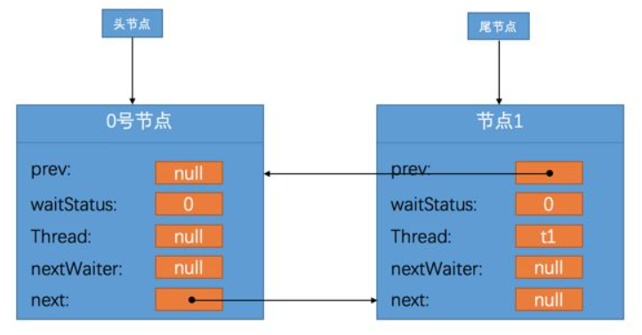
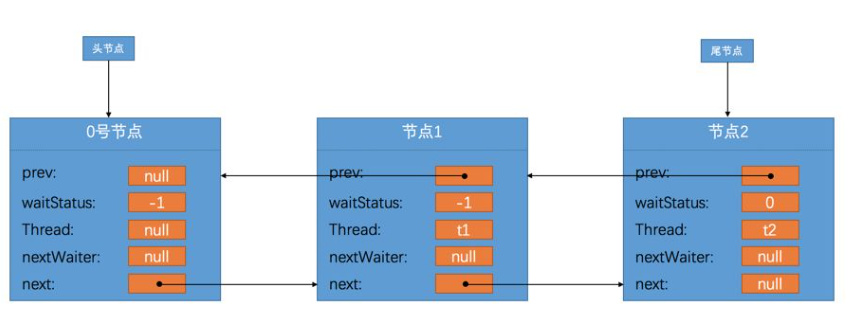
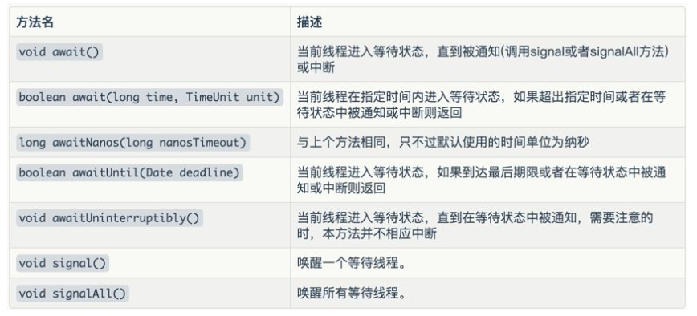
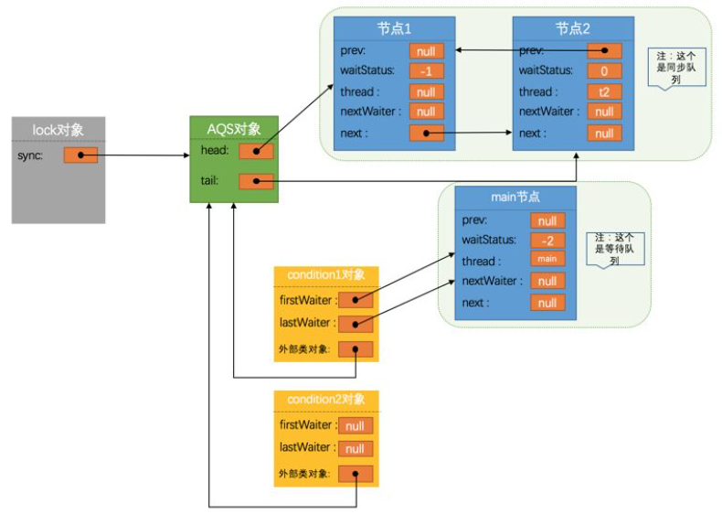
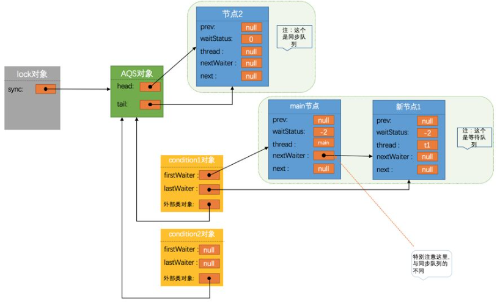
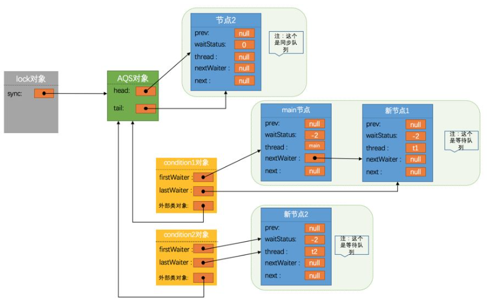
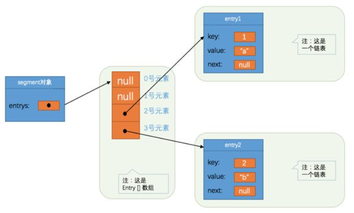

main方法是Java程序的入口，系统还会为我们创建一些辅助线程来帮助main线程的执行。

多线程面临的问题：安全性（原子性操作、内存可见性、指令重排序，锁都可以解决上面三个问题）、活跃性（死锁、饥饿、活锁）

# 线程执行的方式

1、new Thread的时候传入一个Runnable对象，调用它的start方法：

~~~java
public class PrintTask implements Runnable {

    @Override
    public void run() {
        System.out.println("输出一行字");
    }
}
~~~

~~~java
public class Test {

    public static void main(String[] args) {
        new Thread(new PrintTask()).start();
    }
}
~~~

2、继承Thread类并覆盖run方法，构造出这个类的实例后调用它的start方法：

~~~java
public class PrintThread extends Thread {

    @Override
    public void run() {
        System.out.println("输出一行字");
    }
}
~~~

~~~java
public class Test {

    public static void main(String[] args) {
        new PrintThread().start();
    }
}
~~~

Thread类本身就代表了一个Runnable任务，我们看Thread类的定义：

~~~java
public class Thread implements Runnable {

    private Runnable target;

    @Override
    public void run() {
        if (target != null) {
            target.run();
        }
    }

    // ... 为省略篇幅，省略其他方法和字段
}
~~~

其中的target就是在构造方法里传入的，如果构造方法不传这个字段的话，很显然run方法就是一个空实现

这种方式会导致业务类直接继承Thread类，造成了强耦合，所以并不好

# 线程状态

 Java 线程的状态：

其中特别需要注意的是“Blocking”和“Waiting”是两个不同的状态：

* Blocking 指的是一个线程因为等待临界区的锁（Lock 或者 synchronized 关键字）而被阻塞的状态，请你注意的是处于这个状态的线程还没有拿到锁
* Waiting 指的是一个线程拿到了锁，但是需要等待其他线程执行某些操作。比如调用了 Object.wait、Thread.join 或者 LockSupport.park 方法时，进入 Waiting 状态。也就是拿到了锁但是临时释放了，当等待条件满足，外部调用了 Object.notify 或者 LockSupport.unpark 方法，线程会重新竞争锁，成功获得锁后才能进入到 Runnable 状态继续执行

# 线程常用方法

Thread的构造方法：

* Thread(Runnable target, String name)：传入任务和线程名
* Thread(Runnable target)：传入任务
* Thread(String name)：只传入线程名
* Thread()：空参构造

成员方法：

* long getId()：获取线程ID
* setName和getName：设置和获取线程名
* void setPriority(int newPriority)：设置线程优先级，共1-10个等级，常用的有：
  - Thread.MIN_PRIORITY = 1
  - Thread.NORM_PRIORITY = 5;
  - Thread.MAX_PRIORITY = 10;
* int getPriority()：获取线程优先级
* isDaemon、setDaemon(boolean on)：判断线程是否是守护线程、将该线程设置为守护线程或普通线程。如果所有普通线程都停止了，守护线程也会停止，常见的守护线程是垃圾收集器。只有在线程未启动的时候才能设置该线程是否为守护线程，否则的话会抛出异常的。还有一点：从普通线程中生成的线程默认是普通线程，从守护线程中生成的线程默认是守护线程
* join、join(long millis)、join(long millis, int nanos)：等待该线程执行完成后，再向下执行。超时代表执行完成，或者超时后也可以继续执行

静态方法：

* 睡眠：sleep(long millis)、sleep(long millis, int nanos)，休眠其实就是将线程阻塞一段时间，放到阻塞队列里，等指定的时间一到，再从阻塞队列里出来
* 获取当前执行的线程：currentThread()
* 放弃本次时间片执行，等下次执行：yield。

# 异常处理器

一个线程中抛出的异常是不能被别的线程catch并处理的，比如说main线程中的异常最多能被抛到main方法，其他线程中的异常最多能被抛到run方法，再往上抛就是虚拟机了。如果没有对线程中的异常进行处理，线程就只能停止。

Thread类内部有一个异常处理器接口：

~~~java
public class Thread implements Runnable {
    // ... 为节省篇幅，省略其他字段和方法

    public interface UncaughtExceptionHandler {
        void uncaughtException(Thread t, Throwable e);
    }
}
~~~

自定义一个异常处理器，方法入参就是异常和抛出异常的线程：

~~~java
public class MyUncaughtExceptionHandler implements Thread.UncaughtExceptionHandler {

    @Override
    public void uncaughtException(Thread t, Throwable e) {
        System.out.println("抛出异常的线程名： " + t.getName());
        System.out.println("抛出的异常是： " + e);
    }
}
~~~

然后用void setUncaughtExceptionHandler(Thread.UncaughtExceptionHandler eh)可以为线程设置一个异常处理器。还可以用getUncaughtExceptionHandler()方法获取线程的异常处理器。

可以用Thread的静态方法setDefaultUncaughtExceptionHandler为所有线程设置一个默认的异常处理器，用getDefaultUncaughtExceptionHandler获取这个默认异常处理器。如果一个线程既设置了自己的异常处理器，而Thread类也设置了默认的异常处理器，则以线程自己的为准

# 原子性和同步方法

并发的风险就是，在多个线程间共享的变量会被多个线程同时访问、修改。可共享的包括对象、成员变量、静态变量；不可共享的包括栈，如方法参数、局部变量。

原子性操作：不可分割的操作。其中i++不是原子性操作，它相当于i=i+1，是三个原子性操作：

1. 读取变量i的值
2. 将变量i的值加1
3. 将结果写入i变量中

由于线程是基于处理器分配的时间片执行的，在这个过程中，这三个步骤可能让多个线程交叉执行，以两个线程交叉执行为例：

若两个线程以这样的顺序前进执行，那么两个线程执行i++的后果就是i只增加了1

为了解决原子性的问题，可以从下面几个方面解决：

1、使用局部变量

2、使用ThreadLocal

3、给变量加final

4、加锁解决，其中最基本的是同步代码块：

~~~java
    private int i;

    private Object lock = new Object();

    public void increase() {
        synchronized (lock) {
            i++;
        }
    }
~~~

lock就是一个锁，也称为内置锁。在获取锁的时候线程处于阻塞状态，线程获取锁的方式是同步执行，这种方法就被称为同步代码块。对象可以作为锁，因为每个对象都占用独一无二的内存，真实的对象在内存中的表示其实有对象头和数据区组成的，数据区就是我们声明的各种字段占用的内存部分，而对象头里存储了一系列的有用信息，其中就有几个位代表锁信息，也就是这个对象有没有作为某个线程的锁的信息

锁是可以重入的，一个线程持有一把锁的时候，它可以再次进入被这把锁保护的代码块。

同步方法就是以this或者类对象作为锁的同步代码块：

~~~java
public class Increment {

    private int i;

    public synchronized increase() {   //使用this作为锁
        i++;
    }

    public synchronized static void anotherStaticMethod() {   //使用Class对象作为锁
        // 此处填写需要同步的代码块
    }
}
~~~

# 指令重排序

分析下列代码：

~~~java
public class Reordering {

    private static boolean flag;
    private static int num;

    public static void main(String[] args) {
        Thread t1 = new Thread(new Runnable() {

            @Override
            public void run() {
                while (!flag) {
                    Thread.yield();
                }

                System.out.println(num);
            }
        }, "t1");
        t1.start();
        num = 5;
        flag = true;
    }
}
~~~

这段代码正常应该打印num值为5，但有可能运行结果是打印了0，这就说明最后两行的运行顺序并不是代码顺序，而是反过来的，这些代码最后都会变成机器能识别的二进制指令，我们把这种指令不按书写顺序执行的情况称为指令重排序。大多数现代处理器都会采用将指令乱序执行的方法，在条件允许的情况下，直接运行当前有能力立即执行的后续指令，避开获取下一条指令所需数据时造成的等待。通过乱序执行的技术，处理器可以大大提高执行效率

指令重排序不是随便排，它是需要遵循代码依赖情况的，比如下面几行代码：

~~~java
int i = 0, b = 0;
i = i + 5;  //指令1
i = i*2;  //指令2
b = b + 3;  //指令3
~~~

其中指令2不可能先于指令1执行，因为它们操作的都是同一个变量。而指令3和2和1都无关，因为它们操作的是不同的变量，所以指令3可能被排在指令1之前，也有可能排在其它任何位置，所以在单线程中执行这段代码的时候，最终结果和没有重排序的执行结果是一样的，所以这种重排序有Within-Thread As-If-Serial Semantics的含义，线程内表现为串行的语义，但多线程的时候就会有问题。

## 同步代码抑制指令重排序

同步代码块可以抑制指令重排序：

~~~java
public class Reordering {

    private static boolean flag;
    private static int num;

    public static void main(String[] args) {
        Thread t1 = new Thread(new Runnable() {

            @Override
            public void run() {
                while (!getFlag()) {
                    Thread.yield();
                }

                System.out.println(num);
            }
        }, "t1");
        t1.start();
        num = 5;
        setFlag(true);
    }

    public synchronized static void setFlag(boolean flag) {
        Reordering.flag = flag;
    }

    public synchronized static boolean getFlag() {
        return flag;
    }
}
~~~

锁的性质可以抑制指令重排序：

* 在获取锁的时候，它前面的操作必须已经执行完成
* 在释放锁的时候，同步代码块中的代码必须全部执行完成

加锁只能保证一部分代码顺序，在同步代码块之前的代码、之后的代码、之中的代码都可以进行重排序。它抑制了处理器对指令执行的优化，原来能并行执行的指令现在只能串行执行，会导致一定程度的性能下降。

## volatile变量抑制重排序

上面的程序可以改成这样：

~~~java
public class Reordering {

    private static volatile boolean flag;
    private static int num;

    public static void main(String[] args) {
        Thread t1 = new Thread(new Runnable() {

            @Override
            public void run() {
                while (!flag) {
                    Thread.yield();
                }

                System.out.println(num);
            }
        });
        t1.start();
        num = 5;
        flag = true;
    }
}
~~~

volatile变量拥有内存可见性，一个线程写入的数据对另一个线程立即可见。具体的volatile抑制重排序的作用：

1. volatile写之前的操作不会被重排序到volatile写之后。
2. volatile读之后的操作不会被重排序到volatile读之前。
3. 前边是volatile写，后边是volatile读，这两个操作不能重排序。

## final变量抑制重排序

final可以保证一旦变量被赋值成功，它的值在之后程序执行过程中都不会改变。

final字段被赋予了一些特殊的语义，它可以阻止某些重排序，具体的规则就这两条：

1. 在构造方法内对一个final字段的写入，与随后把这个被构造对象的引用赋值给一个引用变量，这两个操作之间不能重排序。
2. 初次读一个包含final字段对象的引用，与随后初次读这个final字段，这两个操作不能重排序。

具体看下面的代码示例：

~~~java
public class FinalReordering {

    int i;
    final int j;

    static FinalReordering obj;

    public FinalReordering() {
        i = 1;
        j = 2;
    }

    public static void write() {
        obj = new FinalReordering();
    }

    public static void read() {
        FinalReordering finalReordering = FinalReordering.obj;
        int a = finalReordering.i;
        int b = finalReordering.j;
    }
}
~~~

我们假设有一个线程执行write方法，另一个线程执行read方法。

1、执行write方法时，因为构造方法中要对final的成员变量进行赋值，所以此时用前面的第一个原则，一定会先对final字段j写入，然后再将FinalReordering对象赋值给obj，但对于普通变量可没有这种限制，普通的字段可能在构造方法完成之后才被真正的写入值，所以另一个线程在访问这个普通变量的时候可能读到了0：

2、执行read方法时，根据第二个原则，一定是先读obj对象，再读j，这两个指令不能重排序，但对于读取普通成员变量i来说，它有可能被指令重排序到构造对象赋值之前，导致出现空指针异常：

读取对象引用和读取该对象的字段是存在间接依赖关系的，一般来说一定是先读引用，再读取对象字段，但对于一些特殊的偏向性能的处理器，如alpha处理器，是有可能将这两个指令重排序的，所以这个规则就是为这种处理器设计的。

# 线程安全的类

让客户端程序员们不需要使用额外的同步操作就可以放心的在多线程环境下使用，这种类就是线程安全的类。如果类是线程不安全的，那么操作它的时候就必须额外考虑到同步的问题

## 找出共享可变的字段

如果一个字段是可以通过对外暴露的方法访问到，那这个字段就是共享的。

如果一个字段的类型是基本数据类型，且对外方法中可以对它操作，它就是可变的；

如果一个字段的类型是非基本数据类型的，那么字段可变就有两层意思：引用可变以及对象中的属性可变

尽量降低字段的共享性，或者让其不可变，就能减少安全性问题（原子性操作、内存可见性、指令重排序）的引入。将字段声明成final类型可以让基本类型的字段不可变，但对于非基本数据类型来说，它所有的属性都是final，才能让它不可变

## 用锁来保护访问

确定了共享可变的字段之后，需要在操作它们的对外方法中，对访问进行同步处理，保证访问共享可变字段是串行访问的。

不仅仅是对共享可变字段的写需要加锁，对共享可变字段的读也需要加锁，这是因为存在内存可见性的问题，读的时候有可能读到旧的值。

加锁时要注意：对于同一个字段来说，在多个访问位置需要使用同一个锁

## 不变性条件

有些时候，类的字段之间是由联系的，比如下面的类：

~~~java
public class SquareGetter {
    private int numberCache;    //数字缓存
    private int squareCache;    //平方值缓存

    public int getSquare(int i) {
        if (i == numberCache) {
            return squareCache;
        }
        int result = i*i;
        numberCache = i;
        squareCache = result;
        return result;
    }

    public int[] getCache() {
        return new int[] {numberCache, squareCache};
    }
}
~~~

当调用getSquare获取平方值时，会将计算结果缓存起来，下次有一样的入参时，直接返回。对于这个类来说，squareCache不论在任何情况下都是numberCache平方值，这就是SquareGetter类的一个不变性条件，如果违背了这个不变性条件的话，就可能会获得错误的结果。

在单线程下这个类的运行不会出现问题，但多线程就会有问题。此时就需要为了保持不变性条件，我们需要把保持不变性条件的多个操作定义为一个原子操作，即用锁给保护起来，我们可以这样修改getSquare方法，直接将它变成同步方法：

~~~java
public synchronized int getSquare(int i) {
    if (i == numberCache) {
        return squareCache;
    }
    int result = i*i;
    numberCache = i;
    squareCache = result;
    return result;
}
~~~

加锁时注意要遵守一个原则：尽可能减少同步代码的范围，减少不必要的阻塞，所以我们可以再优化以下上面的代码，把成员变量result的计算除外，将其余部分加上同步：

~~~java
public int getSquare(int i) {

    synchronized(this) {
        if (i == numberCache) {  // numberCache字段的读取需要进行同步
            return squareCache;
        }
    }

    int result = i*i;   //计算过程不需要同步

    synchronized(this) {   // numberCache和squareCache字段的写入需要进行同步
        numberCache = i;
        squareCache = result;
    }
    return result;
}
~~~

然后还需要确保访问不变性条件的相关字段加锁保护（同一把锁）：

~~~java
public synchronized int[] getCache() {
    return new int[] {numberCache, squareCache};
}
~~~

## volatile修饰状态

使用volatile来替换锁是一种改善性能的考虑方法，但是一定要记住volatile是不能保证一系列操作的原子性的，所以只有我们的业务场景符合下边这两个情况的话，才可以考虑：

- 对变量的写入操作不依赖当前值，或者保证只有单个线程进行更新。
- 该变量不需要和其他共享变量组成不变性条件

## 避免this引用溢出

在构造方法中就把this引用给赋值到了静态变量INSTANCE中，而别的线程是可以随时访问INSTANCE的，我们把这种在对象创建完成之前就把this引用赋值给别的线程可以访问的变量的这种情况称为 this引用逸出，这种方式是极其危险的：

~~~java
public class ExplicitThisEscape {

    private final int i;

    public static ThisEscape INSTANCE;

    public ThisEscape() {
        INSTANCE = this;
        i = 1;
    }
}
~~~

其他线程获取到一个没有初始化完成的对象，可能会出现意想不到的后果，比如读到一个还未初始化的final值i，读到0而不是1

this引用溢出还可以是隐式的，比如下面这个例子：

~~~java
public class ImplicitThisEscape {

    private final int i;

    private Thread t;

    public ThisEscape() {
        t = new Thread(new Runnable() {
            @Override
            public void run() {
                // ... 具体的任务
            }
        });
        i = 1;
    }
}
~~~

虽然在ImplicitThisEscape的构造方法中并没有显式的将this引用赋值，但是由于Runnable内部类的存在，作为外部类的ImplicitThisEscape，内部类对象可以轻松的获取到外部类的引用，这种情况下也算this引用逸出

# wait/notify

wait和notify都是Object类的方法

wait方法：在线程获取到锁后，调用锁对象的本方法，线程释放锁并且把该线程放置到与锁对象关联的等待队列。wait方法是可以待超时参数的，等待一段指定时间后，自动把该线程从等待队列中移出

notify方法：通知一个在与该锁对象关联的等待队列的线程，使它从wait()方法中返回继续往下执行

notifyAll方法：和上面的类似，只不过通知该等待队列中的所有线程

等待线程的用法：

~~~java
synchronized (对象) {
    处理逻辑（可选）
    while(条件不满足) {
        对象.wait();
    }
    处理逻辑（可选）
}
~~~

通知线程的用法：

~~~java
synchronized (对象) {
    完成条件
    对象.notifyAll();、
}
~~~

## wait是会释放锁的

因为wait会释放锁，所以可能会有多段代码同时在同步方法中执行，只不过必然有多个处于阻塞状态

例如下面的类：

~~~java
public class ShitTask implements Runnable {

    // ... 为节省篇幅，省略相关字段和构造方法

    @Override
    public void run() {
        synchronized (washroom.getLock()) {
            System.out.println(name + " 获取了厕所的锁");
            while (!washroom.isAvailable()) {
                try {
                    washroom.getLock().wait();  //调用锁对象的wait()方法，让出锁，并把当前线程放到与锁关联的等待队列
                } catch (InterruptedException e) {
                    throw new RuntimeException(e);
                }
            }
            System.out.println(name + " 上完了厕所");
        }
    }
}
~~~

当构造了多个ShitTask然后开始执行时，肯定会有多个方法先后进入synchronized代码块，这是因为一个线程调用wait后，就会将锁释放，此时就会有后面的线程获取锁然后继续运行，直到大家都进入阻塞状态，等待唤醒

## 必须在同步代码块中调用

必须在同步代码块中调用wait、 notify或者notifyAll方法。

这是因为执行wait方法前需要判断一下某个条件是否满足，如果不满足才会执行wait方法，这是一个先检查后执行的操作，不是一个原子性操作，所以如果不加锁的话，在多线程环境下等待线程和通知线程的执行顺序可能不符合预期，会出现先notify后wait的情况：

也就是说当等待线程已经判断条件不满足，正要执行wait方法，此时通知线程抢先把条件完成并且调用了notify方法，之后等待线程才执行到wait方法，这会导致等待线程永远停留在等待队列而没有人再去notify它

所以等待线程中的判断条件是否满足、调用wait方法和通知线程中完成条件、调用notify方法都应该是原子性操作，彼此之间是互斥的，所以用同一个锁来对这两个原子性操作进行同步，从而避免出现等待线程永久等待的尴尬局面

一个常见的问题是：如果通知线程先执行，等待线程后执行，为什么不会出现线程永久等待的局面？这是因为存在条件，当notify在同步代码块中执行完毕时，对应的条件状态一定是true，就算等待线程后执行，也会直接满足条件导致不会执行wait

如果不在同步代码块中调用wait、notify或者notifyAll方法，也就是说没有获取锁就调用wait方法，是会抛出IllegalMonitorStateException异常的

而且同步代码的锁，和调用wait或者notify的对象必须是一致的，否则也会抛出IllegalMonitorStateException异常

## while和if

在通常的模式中，我们一般用while来检查状态，而不是if，因为在多线程条件下，可能在一个线程调用notify之后立即又有一个线程把条件改成了不满足的状态，此时就会导致没有满足状态而继续运行出现错误。当仅有两个线程时，一般来说可以用if

## notify不会立即释放锁

在调用完锁对象的notify或者notifyAll方法后，等待线程并不会立即从wait()方法返回，需要调用notify()或者notifyAll()的线程释放锁之后，等待线程才从wait()返回继续执行。也就是说必须要执行完通知后的处理逻辑，才会让其他线程从wait处继续执行：

~~~
synchronized (对象) {
    完成条件
    对象.notifyAll();
    ... 通知后的处理逻辑
}
~~~

需要把通知后的处理逻辑执行完成后，把锁释放掉，其他线程才可以从wait状态恢复过来，重新竞争锁来执行代码（注意这里，还是需要竞争锁的，也就是说不会在同步代码块里有两个线程在同时执行，未破坏锁的语义）

## wait和sleep的区别

它们都能让线程暂停执行，区别如下：

* wait是Object的成员方法，而sleep是Thread的静态方法
* 调用wait方法需要先获得锁，而调用sleep方法是不需要的
* 调用wait方法的线程需要用notify来唤醒，而sleep必须设置超时值
* 线程在调用wait方法之后会先释放锁，而sleep不会释放锁

## 生产者-消费者模式

用wait/notify实现简单的生产者-消费者模式：厨师生产菜，服务员取菜，窗口中最多能同时有5个菜

首先实现生产元素菜

~~~java
public class Food {
    private static int counter = 0;

    private int i;  //代表生产的第几个菜

    public Food() {
        i = ++counter;
    }

    @Override
    public String toString() {
        return "第" + i + "个菜";
    }
}
~~~

定义生产者，也就是厨师：

~~~java
public class Cook extends Thread {

    private Queue<Food> queue;

    public Cook(Queue<Food> queue, String name) {
        super(name);
        this.queue = queue;
    }

    @Override
    public void run() {
        while (true) {
            SleepUtil.randomSleep();    //模拟厨师炒菜时间
            Food food = new Food();
            System.out.println(getName() + " 生产了" + food);
            synchronized (queue) {
                while (queue.size() > 4) {
                    try {
                        System.out.println("队列元素超过5个，为：" + queue.size() + " " + getName() + "抽根烟等待中");
                        queue.wait();
                    } catch (InterruptedException e) {
                        throw new RuntimeException(e);
                    }
                }
                queue.add(food);
                queue.notifyAll();
            }
        }
    }
}
~~~

当队列中元素大于4时，进入等待状态

定义消费者，也就是服务员：

~~~java
class Waiter extends Thread {

    private Queue<Food> queue;

    public Waiter(Queue<Food> queue, String name) {
        super(name);
        this.queue = queue;
    }

    @Override
    public void run() {
        while (true) {
            Food food;
            synchronized (queue) {
                while (queue.size() < 1) {
                    try {
                        System.out.println("队列元素个数为：" + queue.size() + "，" + getName() + "抽根烟等待中");
                        queue.wait();
                    } catch (InterruptedException e) {
                        throw new RuntimeException(e);
                    }
                }
                food = queue.remove();
                System.out.println(getName() + " 获取到：" + food);
                queue.notifyAll();
            }

            SleepUtil.randomSleep();    //模拟服务员端菜时间
        }
    }
}
~~~

当队列中没有菜的时候，进入等待状态。这两个线程互为等待线程和通知线程。

注意以下的点：

* 我们这里的厨师和服务员使用同一个锁queue，确保从队列取和放入队列是原子操作，是一个等待队列。队列虽然是一个，但同一时刻队列中只可能有厨师，或者只可能有服务员
* SleepUtil.randomSleep()是模拟真正的工作时间，它最好不要放在同步代码块中，否则就意味着一个厨师炒菜的同时不允许别的厨师炒菜，在一个服务员端菜的同时不允许别的服务员端菜

# 死锁

## 锁顺序死锁

因为多个线程试图以不同的顺序来获得相同的锁而造成的死锁也被称为锁顺序死锁，例如：

~~~java
public class DeadLockDemo {

    public static void main(String[] args) {
        Object lock1 = new Object();
        Object lock2 = new Object();

        new Thread(new Runnable() {

            @Override
            public void run() {

                while (true) {
                    synchronized (lock1) {
                        System.out.println("线程t1获取了 lock1锁");
                        LockUtil.sleep(1000L);

                        synchronized (lock2) {
                            System.out.println("线程t1获取了 lock2锁");
                        }
                    }
                }
            }
        }, "t1").start();

        new Thread(new Runnable() {
            @Override
            public void run() {

                while (true) {
                    synchronized (lock2) {
                        System.out.println("线程t2获取了 lock2锁");
                        LockUtil.sleep(1000L);

                        synchronized (lock1) {
                            System.out.println("线程t2获取了 lock1锁");
                        }
                    }
                }
            }
        }, "t2").start();
    }
}
~~~

不仅仅是同步代码块，只要有可能获取锁的地方，按照不正确的顺序获取都有可能产生死锁，例如使用同步方法时，看下面的例子，有一个学生类和一个老师类：

~~~java
public class Student {

    private Teacher teacher;

    private int process;    //答题进度

    public void setTeacher(Teacher teacher) {
        this.teacher = teacher;
    }

    public synchronized int getProcess() {
        return process;
    }

    public synchronized void setProcess(int process) {
        this.process = process;
        if (process == 100) {
            teacher.studentNotify(this);    //学生答完题，通知老师
        }
    }
}
~~~

~~~java
import java.util.List;

public class Teacher {

    List<Student> students;

    public void setStudents(List<Student> students) {
        this.students = students;
    }

    public synchronized void studentNotify(Student student) {
        students.remove(student);   //将已完成考试的学生从列表中移除
    }

    public synchronized void getAllStudentStatus() {
        for (Student student : students) {
            System.out.println(student.getProcess());
        }
    }
}
~~~

有两个方法的并发调用可能产生死锁，这就是Student的setProcess方法和Teacher的getAllStudentProcess方法：

* setProcess方法的线程需要先获得Student对象的锁，再获得Teacher对象的锁
* getAllStudentProcess方法的线程需要先获得Teacher对象的锁，再获得Student对象的锁

这样最终就有可能造成死锁，如果在持有锁的情况下调用了某个外部方法，那么就需要警惕死锁

## 预防死锁的建议

产生死锁的几个必要条件：

1. 互斥条件：一个资源每次只能被一个线程使用。
2. 请求与保持条件：一个线程因请求资源而阻塞时，对已获得的资源保持不放。
3. 不剥夺条件：线程已获得的资源，在未使用完之前，不能强行剥夺。
4. 循环等待条件：若干线程之间形成一种头尾相接的循环等待资源关系。

只有这4个条件全部成立，死锁的情况才有可能发生。一般情况下，一个线程持有资源的时间并不会太长，所以一般并不会发生死锁情况，但是如果并发程度很大，也就是非常多的线程在同时竞争资源，如果这四个条件都成立，那么发生死锁的概率将会很大，重要并且可怕的是：一旦系统进入死锁状态，将无法恢复，只能重新启动系统

预防死锁的建议：

1、线程在执行任务的过程中，最好进行开放调用。也就是尽量减少锁的作用范围，破坏循环等待条件

如果在调用某个方法的时候不需要持有锁，那么这种调用就称为开放调用。像上边Student类调用外部方法studentNotify的时候就已经持有锁了，我们可以让它对外部调用时不持有锁，锁只用来保护共享变量：

~~~java
public void setProcess(int process) {
    synchronized (this) {
        this.process = process;
    }
        if (process == 100) {
            teacher.studentNotify(this);    //学生答完题，通知老师
        }
}  
~~~

同样地，也可以这样改写getAllStudentProcess方法：

~~~java
public void getAllStudentStatus() {
    List<Student> copyOfStudents;
    synchronized (this) {
        copyOfStudents = new ArrayList(students);
    }
    for (Student student : copyOfStudents) {
        System.out.println(student.getProcess());
    }
}
~~~

2、各线程用固定的顺序来获取资源，破坏循环等待条件，如下面的例子，两个线程都是先请求lock1，后请求lock2：

~~~java
synchronized (lock1) {
    System.out.println("线程t1获取了 lock1锁");
    LockUtil.sleep(1000L);
    synchronized (lock2) {
        System.out.println("线程t1获取了 lock2锁");
    }
}
~~~

~~~java
synchronized (lock1) {
    System.out.println("线程t2获取了 lock1锁");
    LockUtil.sleep(1000L);
    synchronized (lock2) {
        System.out.println("线程t2获取了 lock2锁");
    }
}
~~~

3、可以让持有资源的时间有限

在死锁的情况下，一个线程是不会主动去释放锁的，如果我们让锁有了超时时间，就可以打破不剥夺条件

# 饥饿和活锁

如果一个线程因为处理器时间全部被其他线程抢走而得不到处理器运行时间，这种状态被称之为饥饿，一般是由高优先级线程吞噬所有的低优先级线程的处理器时间引起的。setPriority可以修改优先级，但依赖具体的操作系统实现，我们尽量不要修改线程的优先级，具体效果取决于具体的操作系统，并且可能导致某些线程饿死

活锁是不同线程相互谦让资源导致的，各自都无法获取到资源，无法向下执行的情况。为了解决这个问题，需要在遇到冲突重试时引入一定的随机性，如失败重试的等待时间随机到n秒，让两个线程减少冲突。

# 并发性能

一个程序受I/O读写速度的限制而不能更快的执行，就称为I/O密集型的程序，如果受处理器速度限制而不能更快的执行，就称为CPU密集型的程序

线程的提出主要是为了提高处理器的利用率。这主要是从两个方面考虑的：

* 处理器都是多核的，如果只有单线程程序在跑，会浪费处理器资源
* 处理器的速度远远超过内存、硬盘、网络的速度，对于非CPU密集型的程序来说，程序的大部分时间其实都是在与内存、硬盘、网络什么的通信，所以在它们通信的时候处理器可以转向执行其他线程，从而起到提高处理器利用率的目的

一个程序的性能可以从两个方面考虑：运行时间和吞吐量（运行时间和吞吐量不是简单的相乘为1的关系，因为有并发的存在，同时启动多个线程运行可以提高系统的吞吐量，但因为线程本身的开销增大，可能会提升单个线程的运行时间）

线程本身会存在着一些开销，如果引入线程的开销大于提升处理器利用率的开销，程序的性能是会降低的，所以我们需要分析一下线程有哪些开销，并且针对这些开销来做一些工作来提升并发程序的性能

## 线程开销

线程开销的组成：

1、上下文切换

操作系统在进行线程调度时，会为每个线程分配一个时间片，每当时间片用光了之后，就切换到下一个线程去执行。在切换过程中需要发生一些事情：

* 保存并恢复线程的某些运行信息(上下文信息)：如线程状态、线程的代码在内存中的位置、线程执行到了什么位置等
* 加载缓存数据：一个线程在首次被分配时间片的时候，需要从内存中加载它需要的数据到高速缓存中，高速缓存是处理器和内存之间的一层缓存

2、内存同步

同步机制影响性能的因素主要有两个：

* 强制刷新缓存到主内存中：意味着我们无法利用高速缓存快速的优点了
* 抑制编译器和处理器的优化，主要是抑制重排序，可能在底层硬件上并发执行的某些质量现在只能被迫的串行执行

竞争同步和非竞争同步：

* 竞争同步：如果在程序运行过程中对某个共享可变变量进行了并发操作，那么这些因为同步而牺牲的性能也就不那么可惜了，我们把这种情况叫做竞争同步
* 非竞争同步：如果程序运行过程中并没有进行对某个共享可变变量的并发操作，那这些同步机制的存在就没有了意义，只会引起性能的降低，我们把这种情况叫做非竞争同步

3、阻塞

线程的执行过程中有阻塞操作，如获取不到锁，sleep，或者I/O操作，可能会有下列影响性能的地方：

* 放弃剩余的时间片，造成上下文切换。如果各线程都经常阻塞，那么这种切换将变得非常频繁，从而降低性能
* 挂起线程会被临时的放到硬盘里：如果一个线程长时间被阻塞，那么操作系统可能选择把它放到硬盘里以节省内存，等阻塞事件完成之后再从硬盘加载到内存中来。这样加上了硬盘读写的操作，会更加的降低程序的性能
* 锁会造成竞争，导致其他获取不到锁的线程无法继续执行，使程序的整体执行效率降低

## 提高性能

在编写并发代码的时候就可以针对性的对于性能做一些调优处理。但是需要注意的是，大部分的并发问题都是在调整并发程序性能的时候发生的，所以除非程序的实际测试数据说明真的到了必须提高性能的时候，不然不要轻易的尝试性能调优的手段

如果多个线程对同一个锁的竞争非常激烈的话，那么会有很多线程因此而发生阻塞，从而使更多的线程挂起和导致更多的上下文切换，这都是对性能的损耗。而衡量一个锁竞争的激烈程度可以有两方面的考量：

1. 每次持有锁的时间
2. 锁的请求频率

所以对应的优化方法是：

1. 如何减少线程持有锁的时间
2. 如何降低锁的请求频率

可以尽量缩小锁的范围，例如上面优化setProcess方法的时候：

~~~java
public void setProcess(int process) {
    synchronized (this) {
        this.process = process;
    }

    if (process == 100) {
        teacher.studentNotify(this);    //学生答完题，通知老师
    }
}
~~~

把锁的保护范围缩小到只保护字段的赋值操作，从而减小锁之间的竞争程度，提升程序的性能

还可以减小锁的粒度，例如当我们保护的多个独立变量互相独立时，就应该用不同的锁；当我们保护的是一组独立的对象，还可以采用锁分段的方式，来保护每个独立的对象，例如对map中数据的一个简单保护：

~~~java
public class StripedMap<K, V> {

    private static class Node<K, V> {
        K key;
        V value;
        Node<K, V> next;
    }

    @SuppressWarnings("unchecked")
    private Node<K, V>[] nodes = new Node[16];

    private Object[] locks = new Object[nodes.length];  //将原来的1个锁拆分成16个锁

    public V get(K key) {
        int index = key.hashCode() / nodes.length;
        Node<K, V> node = nodes[index];
        synchronized (locks[index]) {   //使用分段锁来保护变量
            while (node != null) {
                if (node.equals(key)) {
                    return node.value;
                }
            }
        }
        return null;
    }

    // ... 省略其他方法
}
~~~

分段锁虽然提升了并发程序的性能，但是加大了编程复杂度，尤其是当数组扩容的时候，需要重新散列各个元素。

volatile虽然会抑制重排序以及刷新高速缓存，但是不会使线程切换，也就是不会发生线程的上下文切换，从而可以省掉这部分的性能损耗

使用synchronized的同步语句虽然有各种性能问题，但是语法简单，使用方便，而且java正在努力提升synchronized的性能

# 显式锁

synchronized被称为内置锁，它语法简单，语义明确，但它获取锁的方式比较死板。如果多个线程竞争一个锁的话，只有一个线程可以获取到锁，只要它不释放锁，其他线程就需要一直等待下去，无法停止等待锁的行为，所以造成死锁的时候系统将无法恢复，只能重启

## ReentrantLock基本用法

Lock接口的常用方法：

* lock()：获取锁
* tryLock()：尝试获取锁，获取成功返回true，失败返回false
* lockInterruptibly()：获取锁，若其他线程中断该线程，则立即中断获取锁并抛出InterruptedException
* tryLock(time)：尝试在指定的时间获取锁，若其他线程中断该线程，则立即中断获取锁并抛出InterruptedException
* unlock()：释放锁
* newCondition()：返回绑定到此Lock对象的新Condition对象

Lock接口的实现类就是显式锁，它加锁和释放锁的操作都需要显式的调用方法，而不像内置锁那样进入同步代码块就算是加锁，从同步代码块出来就算是释放锁

最常用的Lock实现类是ReentrantLock，它的基本用法：

~~~java
Lock lock = new ReentrantLock();
lock.lock();    //获取锁
try {
    // ... 具体代码
} finally {
    lock.unlock();  //释放锁
}
~~~

如果多个线程同时调用lock方法的时候，只有一个线程可以获得锁，其余线程都会在lock方法上阻塞，直到获取锁线程释放了锁

## 轮询锁

利用tryLock立即返回的特性，可以在获取锁失败的时候尝试重试，自己指定重试的策略，提升了编程的灵活性：

~~~java
Lock lock = new ReentrantLock();
Random random = new Random();

while (true) {
    boolean result = lock.tryLock(); //尝试获取锁的操作
    if (result) {
        try {
            // ... 具体代码
        } finally {
            lock.unlock();
        }
    }

    // 获取锁失败后随即休息一段时间后重试
    try {
        Thread.sleep(random.nextInt(1000)); //随机休眠1秒内的时间
    } catch (InterruptedException e) {
        throw new RuntimeException(e);
    }
}
~~~

这种tryLock的方式不会因为获取不到锁而一直阻塞，从而避免发生死锁的危险

## 可中断锁

每个线程都有一个中断状态，最初的时候线程的中断状态都是false，一个线程可以给另一个线程发送一个中断信号，接受到中断信号的线程中断状态就被设置为true，java中Thread类提供了下列方法来获取和修改线程的中断状态：

* void interrupt()：将线程的中断状态设置为true
* boolean isInterrupted()：返回该线程的中断状态，并不修改该中断状态
* static boolean interrupted()：静态方法，返回当前线程的中断状态，如果中断状态是true的话，调用该方法会清除当前线程的中断状态，也就是将中断状态设置为false

如调用t1.interrupt()就相当于给t1线程发送了一个中断信号，如果t1在检查自己的中断状态的话，就可以针对不同的状态做处理（也可以置之不理）。当t1处于阻塞状态时，如sleep、join或者wait时，一个线程在调用这些方法之前或者阻塞过程中都会监测自己的中断状态是否为true，如果为true，立即返回并且抛出一个InterruptedException的异常，而且还会清除该线程的中断状态，也就是把中断状态再次修改为false

可中断锁主要是依赖Lock接口的lockInterruptibly方法：

~~~java
Lock lock = new ReentrantLock();
try {   //第1个try块

    lock.lockInterruptibly();   //可中断的锁

    try {   //第2个try块
        // ... 具体代码
    } finally {
        lock.unlock();  //释放锁
    }

} catch (InterruptedException e) {
    // ... 在被中断的时候的处理代码
}
~~~

如果一个线程因为调用lockInterruptibly方法在等待获取锁的过程中发生阻塞，此时另一个线程向该线程发送中断信号的话，则lockInterruptibly方法会立即返回，并且抛出一个InterruptedException异常。这样通过可中断锁的机制，我们就可以随时在别的线程里让另一个线程从等待获取锁的阻塞状态中出来了。

## 定时锁

我们可以在指定时间内获取一个锁，如果在指定时间内获取到了锁，那么该方法就返回true，如果超过了这个指定的时间，那么就返回false，这主要是通过Lock接口的tryLock(time)方法实现的，与lockInterruptibly一样，这个定时获取锁的方法也可能因为别的线程发送中断信号而从阻塞状态中返回并且抛出InterruptedException异常，我们需要做好异常处理工作

## 公平锁

公平锁：不论此时有没有线程持有该锁，新来获取这个锁的线程都会被放到等待队列中统一排队等待

非公平锁：没有线程持有锁的情况下新来的线程可能会先于等待队列中的线程获取到锁

非公平锁在性能上的优势：如果一个线程因为获取不到锁而阻塞的话，它可能被操作系统给挂起，也就是从内存中踢出去放到硬盘上，如果要重新恢复这个线程的话需要从硬盘中重新读取进来，这样就造成了性能的损耗，而如果直接把锁分配给新来的线程，在新来的线程执行的过程中再叫醒等待队列的线程，那么可能新来的线程已经执行完它的任务把锁都释放了，正好把锁交给刚醒来的线程

因为非公平锁有性能上的优势，所以一般情况下，java的内置锁都是非公平锁，如果我们使用显式锁的话，比如ReentrantLock默认是非公平锁，但是如果我们非要把它定义成公平锁的话，我们可以通过它的构造方法来指定：

~~~java
public ReentrantLock(boolean fair)  // fair是true的话就是公平锁
~~~

## 读写锁

无论是内置锁还是ReentrantLock，在一个线程持有锁的时候别的线程是不能持有锁的，所以这种锁也叫做互斥锁。

有时我们想让多个线程并发读，而阻塞读的同时操作，即一个变量可以被多个读线程同时访问，或者被一个写线程访问，但是两者不能同时访问

对应的功能实现就是ReadWriteLock接口：

~~~java
public interface ReadWriteLock {
    Lock readLock();
    Lock writeLock();
}
~~~

一个实现类是ReentrantReadWriteLock，可以通过它来获得读锁和写锁，其实读锁和写锁都是一个Lock对象：

~~~java
public class ReadWriteLockDemo {
    private ReadWriteLock readWriteLock = new ReentrantReadWriteLock();

    private Lock readLock = readWriteLock.readLock();   //读锁

    private Lock writeLock = readWriteLock.writeLock(); //写锁

    private int i;

    public int getI() {
        readLock.lock();
        try {
            return i;
        } finally {
            readLock.unlock();
        }
    }

    public void setI(int i) {
        writeLock.lock();
        try {
            this.i = i;
        } finally {
            writeLock.unlock();
        }
    }
}
~~~

在实际情况中，只有某些变量的读取频率特别高，并且我们实际测试证明了使用读/写锁可以明显提升系统的性能，我们才考虑使用读/写锁来替代互斥锁

# 非阻塞操作

## 锁的劣势

锁的劣势：

* 没有获取到锁的时候，会发生阻塞从而发生线程的上下文切换，并且被阻塞的线程可能被操作系统挂起，也就是从内存中放到硬盘里。重新恢复执行的性能会变差
* 如果多个线程竞争一个锁的程度很激烈，而且每个线程持有锁的时间又很短，这很可能导致线程在因为阻塞导致的上下文切换和挂起浪费的时间已经大大超过了执行操作的时间
* 锁让多个线程相互依赖，如果持有锁的线程因为一些问题比如资源，延迟执行时，其他等待这个锁的线程同样需要延迟执行
* 优先级反转问题：如果一个低优先级的线程持有锁，高优先级的线程因为获取不到锁而长时间阻塞

所以有时会希望有一种机制即可以保证某些操作的原子性，其他线程又可以不用发生阻塞

## CompareAndSwap

内置锁和ReentrantLock都属于一种悲观的技术，也就是说使用锁来保护操作的话总是认为竞争一定会发生。而一种乐观的技术就觉得在同一时刻很可能多个线程并不会同时执行该操作，所以可以直接上去就执行操作，然后利用冲突检查机制来判断操作过程中是否收到了其他线程的干扰，如果没有干扰，则执行完操作返回true，否则就什么都不做直接返回false。

以i++来解释乐观锁的执行逻辑，两个线程同时执行i++操作，同时读到i的值为5：

* 乐观锁顺利执行的情况：先执行更新操作，这样i的值就为6了，这个过程中没有收到别的线程干扰
* 乐观锁执行失败的情况：执行更新操作，发现i的值已经不是之前读到的5了，所以放弃本次操作，等待下次重试

冲突检查机制在底层帮我们实现了更新一个值的时候比较一下实际值和给定值是否一致，如果一致则更新并返回true，不一致则不更新并返回false的操作。比较和更新两个操作的原子性是由底层硬件保证的

先比较再更新的英文原话是CompareAndSwap，简称是CAS，这个操作需要3个参数：

1、你要更新的变量V

2、原来的值A

3、即将更新的新值B

操作过程就是当V的值等于A时，将新值B赋值给V并且返回true，否则什么都不做，返回false。所以当多个线程使用CAS同时更新一个变量时，只有一个线程可以成功的更新，其他线程都将失败，但是失败的线程并不会被阻塞甚至挂起，而是被立即告知失败了，然后可以再次尝试更新

## 原子类型

根据CAS的原理，java中定义了很多原子变量类，这些类提供一些方法，可以用原子的方式去更新某种类型的变量

可以用原子的方式更新基本数据类型数据，定义了下边这么3个类：AtomicBoolean、AtomicInteger、AtomicLong

这些类内部都维护了一个volatile的变量，比如AtomicBoolean内部维护一个boolean类型的volatile变量，底层都是用CAS实现的。

以AtomicInteger为例查看这些类提供的构造方法：

构造方法：

* AtomicInteger(int initialValue)：指定对象代表的int值
* AtomicInteger()：默认的初始值为0

常用方法：get、set、compareAndSet、getAndSet、getAndAdd、addAndGet、getAndIncrement、incrementAndGet

其中compareAndSet是直接调用的native方法实现的，而getAndIncrement是基于compareAndSet实现的：

~~~java
public final int getAndIncrement() {
    for (;;) {
        int current = get();
        int next = current + 1;
        if (compareAndSet(current, next)) {
            return current;
        }
    }
}
~~~

基本思路就是失败了不断重试，直到成功了为止

除了原子基本类型以外，还有：

* 原子更新数组：可以通过原子的方式更新某个数组里的某个元素
* 原子更新引用类型：可以通过原子的方式更新某个引用类型的变量，例如atomicReference.compareAndSet(myObj, new MyObj(6))
* 原子更新字段类：可以通过原子的方式更新某个对象中的字段，如int型字段、long字段等，都有对应的类

## CAS实现非阻塞链表

如果一个原子性操作中要更新多个变量的值，CAS就会显得不那么方便，但有的时候我们还可以用一些小技巧来保证更新多个变量的过程是原子性的

一个由链表组成的队列的add方法实现：

~~~java
public class PlainQueue<E> {

    private Node<E> head;   //头节点引用
    private Node<E> tail;   //尾节点引用

    public boolean add(E e) {
        Node<E> node = new Node<>(e, null); //创建一个新的节点
        if (tail == null) {  //如果队列为空
            head = node;
        } else {    //队列不为空
            tail.next = node;
        }
        tail = node;
        return true;
    }
~~~

可以看到，这里面还需要对尾节点是否为空进行分类讨论，如果我们默认让尾结点和头节点指向一个没有业务意义的默认节点，就可以不进行判断了：

~~~java
public class PlainQueue<E> {

    private Node<E> sentinel = new Node<>(null, null); //哨兵节点

    private Node<E> head = sentinel;   //头节点引用
    private Node<E> tail = sentinel;   //尾节点引用

    public boolean add(E e) {
        Node<E> node = new Node<>(e, null); //创建一个新的节点
        tail.next = node;
        tail = node;
        return true;
    }
}    
~~~

这个节点就是哨兵节点，或者又叫哑节点。

在多线程下，add方法是由问题的，可能有多个线程执行到了tail = node;这一句，导致有的节点直接被跳过，尾节点指向了一个错误的位置。这个问题的难点在于如何处理中间状态：已经修改了最后一个节点的next字段，但是还没有修改tail的值

可以使用乐观锁的思想，找到一个条件，可以判断是否有其他线程正在插入，如果当前处于中间状态的话，tail.next 是不为null的，如果处于稳定状态，tail.next 是等于 null的。这样插入时首先检查是否在稳定状态，如果在稳定状态则执行插入；若处于中间状态，则帮助上一个线程设置tail的值，然后再继续重试：

~~~java
public class UnBlockedQueue<E> {

    private Node<E> sentinel = new Node<>(null, null);  //哨兵节点

    private AtomicReference<Node<E>> head = new AtomicReference<>(sentinel);    //头节点引用
    private AtomicReference<Node<E>> tail = new AtomicReference<>(sentinel);    //尾节点引用

    public boolean add(E e) {
        Node<E> node = new Node<>(e, null); //即将插入的节点

        while (true) {
            Node<E> tailNode = tail.get();  //当前的尾节点
            Node<E> tailNext = tailNode.next.get(); //尾节点的下一个节点

            if (tailNext == null) {     //处于稳定状态，尝试插入新节点
                if (tailNode.next.compareAndSet(tailNext, node)) {
                    tail.compareAndSet(tailNode, node);
                    return true;
                }

            } else {    //处于中间状态，帮助上一个线程设置tail的值
                tail.compareAndSet(tailNode, tailNext);
            }
        }
    }
}    
~~~

还需要把Node的next改为原子类型，以便使用原子类方便的更新它：

~~~java
public class Node<E> {
    E e;
    AtomicReference<Node<E>> next;

    public Node(E e, Node<E> next) {
        this.e = e;
        this.next = new AtomicReference<>(next);
    }
}
~~~

## CAS的缺点

1、ABA问题：

在一些使用场景下需要的是检测给定的变量的值是否发生变化，如果变量值变化情况是A-B-A的这种，虽然实际变化了，但是无法检测到。解决ABA问题的方案就是使用版本号，每一次操作都会记录一次操作的版本号，比如第一次将变量设置成A，则把操记录成A1，第二次操作记录成B2，第三次操作记录成A3，这样原来的A-B-A问题就转换成A1-B2-A3的问题，所以就避免了ABA问题的发生。java给我们提供了AtomicStampedReference这个原子变量来解决ABA问题

2、循环时间长开销大

如果在竞争非常激烈的多线程环境下使用CAS操作，会导致有的线程长时间的进行空循环，占用处理机的资源。此时就还不如用锁来隔离，至少会释放处理机资源。所以到底是CAS效率高，还是锁效率高，是取决于具体应用场景的

3、只能保证一个共享变量的原子操作

一个CAS操作只针对一个变量，如果需要保证更新多个共享变量过程的原子性，有得时候可以像处理链表add方法那样，多线程根据中间状态来协助完成最后的目标，不过复杂度显然远高于使用锁来保护这些操作。或者把这些变量都放在一个对象里，比如我们同时想更新i，j两个变量，那么可以新创建一个类，包含i，j两个字段，再使用AtomicReference来原子更新这个新对象，就达到了原子更新的目的了

# AQS

## 简介

AbstractQueuedSynchronizer是一个抽象类，简称AQS，抽象队列同步器。用它可以方便的实现自定义的同步工具，ReentrantLock的底层就是AQS

在AQS中维护了一个名叫state的字段，是由volatile修饰的，它就是所谓的同步状态：

~~~java
private volatile int state;
~~~

并且提供了几个访问字段的方法：

* protected final int getState() ：获取state的值
* protected final void setState(int newState)：设置state的值
* protected final boolean compareAndSetState(int expect, int update)：使用CAS方式更新state的值

我们可以通过修改state字段代表的同步状态来实现多线程的独占模式或者共享模式：

* 独占模式：一个线程在进行某些操作的时候其他的线程都不能执行该操作，比如持有锁时的操作，在同一时刻只能有一个线程持有锁
* 共享模式：可以同时允许多个线程同时进行某种操作

1、独占模式用state来实现：可以把state的初始值设置为0。当线程要进行独占操作前，都要判断state的值是否是0：

* 如果不是0的话意味着别的线程已经进入该操作，则本线程需要阻塞等待；
* 如果是0的话就把state的值设置成1，自己进入该操作，操作结束后释放同步状态，也就是把state的值设置为0，通知等待的线程

这里面涉及判断与设置的操作都通过CAS来保证原子性，等待和通知是由队列实现的

2、共享模式由state来实现：比如某项操作允许10个线程同时进行，超过这个数量的线程就需要阻塞等待，可以把state的值设置为10，当线程要进行操作前，需要判断state的值：

* 如果state<=0，说明当前已经有10个线程在同时操作，本线程需要阻塞等待
* 如果state>0，就将state减1然后进入该操作，完成后释放同步状态，将state的值再加1，通知等待的线程

需要继承AQS的子类实现的几个方法：

* boolean tryAcquire(int arg)：独占式的获取同步状态
* boolean tryRelease(int arg)：独占式的释放同步状态
* int tryAcquireShared(int arg)：共享式的获取同步状态
* boolean tryReleaseShared(int arg)：共享式的释放同步状态
* boolean isHeldExclusively()：在独占模式下，如果当前线程已经获取到同步状态，则返回true，否则返回false

如果我们自定义的同步工具需要在独占模式下工作，那么我们就重写tryAcquire、tryRelease和isHeldExclusively方法，如果是在共享模式下工作，那么我们就重写tryAcquireShared和tryReleaseShared方法。比如在独占模式下我们可以这样定义一个AQS子类：

~~~java
public class Sync extends AbstractQueuedSynchronizer {

    @Override
    protected boolean tryAcquire(int arg) {
        return compareAndSetState(0, 1);
    }

    @Override
    protected boolean tryRelease(int arg) {
        setState(0);
        return true;
    }

    @Override
    protected boolean isHeldExclusively() {
        return getState() == 1;
    }
}
~~~

尝试获取同步状态，这里就是尝试用CAS的方式将state设置为1；尝试释放同步状态，就是将state设置为0；判断当前线程是否获取到同步状态就是判断state是否为1

## 同步队列

AQS中还维护了一个所谓的同步队列，这个队列的节点类被定义成了一个静态内部类，它的主要字段如下：

~~~java
static final class Node {
    volatile int waitStatus;
    volatile Node prev;
    volatile Node next;
    volatile Thread thread;
    Node nextWaiter;

    static final int CANCELLED =  1;
    static final int SIGNAL    = -1;
    static final int CONDITION = -2;
    static final int PROPAGATE = -3;
}
~~~

Node类中有一个Thread类型的字段，这表明每一个节点都代表一个线程

AQS中定义一个头节点引用，一个尾节点引用：

~~~java
private transient volatile Node head;
private transient volatile Node tail;
~~~

通过这两个节点就可以控制到这个队列，也就是说可以在队列上进行诸如插入和移除操作。

AQS的线程等待和释放操作都是基于这个队列来完成的：

* 当一个线程获取同步状态失败之后，就把这个线程阻塞并包装成Node节点插入到这个同步队列中
* 当获取同步状态成功的线程释放同步状态的时候，同时通知在队列中下一个未获取到同步状态的节点，让该节点的线程再次去获取同步状态

## 独占模式下状态获取与释放

在独占模式下，同一个时刻只能有一个线程获取到同步状态，其他同时去获取同步状态的线程会被包装成一个Node节点放到同步队列中，直到获取到同步状态的线程释放掉同步状态才能继续执行，初始状态的同步队列是一个空队列

在独占模式需要自定义AQS的子类并重写下面这些方法：

~~~java
protected boolean tryAcquire(int arg)
protected boolean tryRelease(int arg)
protected boolean isHeldExclusively()
~~~

这些方法都由AQS的一些public方法来调用：

* void acquire(int arg)：独占式获取同步状态，如果获取成功则返回，如果失败则将当前线程包装成Node节点插入同步队列中
* void acquireInterruptibly(int arg)：与acquire相同，只不过它可以被其他线程中断，然后抛出异常
* boolean tryAcquireNanos(int arg, long nanos)：在acquireInterruptibly的基础上加了超时限制，给定时间内没有获取到同步状态，则返回false
* boolean release(int arg)：独占式的释放同步状态

1、分析acquire的源代码：

~~~java
public final void acquire(int arg) {

    if (!tryAcquire(arg) &&
        acquireQueued(addWaiter(Node.EXCLUSIVE), arg))
        selfInterrupt();
}
~~~

（1）调用tryAcquire方法来获取同步状态，如果获取成功则返回true，acquire方法执行结束，如果返回false则继续执行后续方法

（2）addWaiter方法：

~~~java
private Node addWaiter(Node mode) {

    Node node = new Node(Thread.currentThread(), mode);  //构造一个新节点
    Node pred = tail;
    if (pred != null) { //尾节点不为空，插入到队列最后
        node.prev = pred;
        if (compareAndSetTail(pred, node)) {       //更新tail，并且把新节点插入到列表最后
            pred.next = node;
            return node;
        }
    }
    enq(node);
    return node;
}

private Node enq(final Node node) {
    for (;;) {
        Node t = tail;
        if (t == null) {    //tail节点为空，初始化队列
            if (compareAndSetHead(new Node()))  //设置head节点
                tail = head;
        } else {    //tail节点不为空，开始真正插入节点
            node.prev = t;
            if (compareAndSetTail(t, node)) {
                t.next = node;
                return t;
            }
        }
    }
}
~~~

首先创建要插入的节点Node，它的thread字段就是当前的线程。如果tail节点不为空，直接把新节点插入到队列后边就返回了，如果tail节点为空，调用enq方法先初始化一下head和tail节点之后再把新节点插入到队列后边。

在enq方法中，初始化队列时，其实就是将head和tail引用指向同一个Node节点，这个节点是简单的空参构造。

当执行完addWaiter方法后，队列中的元素是这样的：

 节点1包含真正的线程信息，它是刚插入的代表本线程的节点，节点0是初始化队列时创建的节点，队列刚初始化完毕时，就只有0节点

（3）acquireQueued方法：

~~~java
final boolean acquireQueued(final Node node, int arg) {

    boolean failed = true;
    try {
        boolean interrupted = false;
        for (;;) {
            final Node p = node.predecessor();  //获取前一个节点
            if (p == head && tryAcquire(arg)) { 前一个节点是头节点再次尝试获取同步状态
                setHead(node);
                p.next = null; // help GC
                failed = false;
                return interrupted;
            }
            if (shouldParkAfterFailedAcquire(p, node) &&
                parkAndCheckInterrupt())
                interrupted = true;
        }
    } finally {
        if (failed)
            cancelAcquire(node);
    }
}
~~~

它的入参就是那个刚刚加入同步队列的节点1。如果新插入的节点的前一个节点是头节点的话，会再次调用tryAcquire尝试获取同步状态，这个主要是怕获取同步状态的线程很快就把同步状态给释放了，所以在当前线程阻塞之前抱着侥幸的心理再试试能不能成功获取到同步状态，如果侥幸可以获取，那就调用setHead方法把头节点换成自己：

~~~java
private void setHead(Node node) {
    head = node;
    node.thread = null;
    node.prev = null;
}
~~~

同时把本Node节点的thread字段设置为null，意味着自己成为了0号节点。此时成功获取到同步状态，且同步队列中有一个0号节点。

如果当前Node节点不是头节点或者已经获取到同步状态的线程并没有释放同步状态，那就乖乖的往下执行shouldParkAfterFailedAcquire方法：

~~~java
private static boolean shouldParkAfterFailedAcquire(Node pred, Node node) {
    int ws = pred.waitStatus;   //前一个节点的状态
    if (ws == Node.SIGNAL)  //Node.SIGNAL的值是-1
        return true;
    if (ws > 0) {   //当前线程已被取消操作，把处于取消状态的节点都移除掉
        do {
            node.prev = pred = pred.prev;
        } while (pred.waitStatus > 0);
        pred.next = node;
    } else {    //设置前一个节点的状态为-1
        compareAndSetWaitStatus(pred, ws, Node.SIGNAL);
    }
    return false;
}
~~~

这个方法和节点的状态有关，Node类里面有一些静态变量代表它的状态，其中这里面涉及的状态：

* Node.SIGNAL：-1，代表后面的节点对应的线程处于等待状态
* 0：代表初始状态

根据当前节点前一个节点的状态，区分不同的逻辑：

* 如果当前节点的前一个节点的waitStatus是Node.SIGNAL，也就是-1，那么意味着当前节点可以被阻塞
* 如果前一个节点的waitStatus大于0，意味着该节点代表的线程已经被取消操作了，需要把所有waitStatus大于0的节点都移除掉
* 如果前一个节点的waitStatus既不是-1，也不大于0，就把如果前一个节点的waitStatus设置成Node.SIGNAL

这里由于是初次获取状态并阻塞，前一个节点就是空的Node节点，所以会先将它的状态设置为-1，然后返回false，此时队列中节点的状态：

由于acquireQueued方法是个循环，等第二次执行到shouldParkAfterFailedAcquire方法时，由于0号节点的waitStatus已经为Node.SIGNAL了，所以shouldParkAfterFailedAcquire方法会返回true，然后继续执行parkAndCheckInterrupt方法：

~~~java
private final boolean parkAndCheckInterrupt() {
    LockSupport.park(this);
    return Thread.interrupted();
}

public static void park(Object blocker) {
    Thread t = Thread.currentThread();
    setBlocker(t, blocker);
    UNSAFE.park(false, 0L);     //调用底层方法阻塞线程
    setBlocker(t, null);
}
~~~

在UNSAFE.park方法中，将线程阻塞。至此，获取同步状态失败的线程就这样被插入到同步队列中，且线程被阻塞了。如果此时再新来一个线程t2调用acquire方法要求获取同步状态的话，它同样会被包装成Node插入同步队列的队尾，效果就像下图一样：

此时节点1的waitStauts已经变成-1了，别忘了waitStauts值为-1的时候，也就是Node.SIGNAL意味着它的下一个节点处于等待状态，因为0号节点和节点1的waitStauts值都为-1，也就意味着它们两个的后继节点，也就是节点1和节点2都处于等待状态。

2、分析release方法的源代码

当一个线程完成了独占操作，需要释放同步状态时，就要调用release了：

~~~java
public final boolean release(int arg) {
    if (tryRelease(arg)) {
        Node h = head;
        if (h != null && h.waitStatus != 0)
            unparkSuccessor(h);
        return true;
    }
    return false;
}
~~~

这里面会调用子类重写的tryRelease方法，如果成功的释放了同步状态，那就继续向下执行。如果头节点head不为null并且head的waitStatus不为0，就执行unparkSuccessor方法：

~~~java
private void unparkSuccessor(Node node) {
        int ws = node.waitStatus;   //节点的等待状态
        if (ws < 0)
            compareAndSetWaitStatus(node, ws, 0);
        Node s = node.next; 
        if (s == null || s.waitStatus > 0) {    //如果node为最后一个节点或者node的后继节点被取消了
            s = null;
            for (Node t = tail; t != null && t != node; t = t.prev)   
                if (t.waitStatus <= 0)  //找到离头节点最近的waitStatus为负数的节点
                    s = t;
        }
        if (s != null)
            LockSupport.unpark(s.thread);   //唤醒该节点对应的线程
    }
~~~

这里的入参node就是头节点，因为头节点处于等待状态，所以将它的状态改为0，然后找到不为空的后继节点，唤醒它对应的线程，把节点1的thread设置为null并把它设置为头节点

不懂的问题：没找到替换头节点的代码

## 独占式工具实例

自定义一个简单的独占式同步工具：

~~~java
import java.util.concurrent.locks.AbstractQueuedSynchronizer;

public class PlainLock {

    private static class Sync extends AbstractQueuedSynchronizer {

        @Override
        protected boolean tryAcquire(int arg) {
            return compareAndSetState(0, 1);
        }

        @Override
        protected boolean tryRelease(int arg) {
            setState(0);
            return true;
        }

        @Override
        protected boolean isHeldExclusively() {
            return getState() == 1;
        }
    }

    private Sync sync = new Sync();

    public void lock() {
        sync.acquire(1);
    }

    public void unlock() {
        sync.release(1);
    }
}
~~~

我们在PlainLock中定义了一个AQS子类Sync，重写了一些方法来自定义了在独占模式下获取和释放同步状态的方式，静态内部类就是AQS子类在我们自定义同步工具中最常见的定义方式，它的使用，通过调用lock和unlock来加锁和释放锁：

~~~java
public class Increment {

    private int i;

    private PlainLock lock = new PlainLock();

    public void increase() {
        lock.lock();
        i++;
        lock.unlock();
    }

    public int getI() {
        return i;
    }

    public static void test(int threadNum, int loopTimes) {
        Increment increment = new Increment();

        Thread[] threads = new Thread[threadNum];

        for (int i = 0; i < threads.length; i++) {
            Thread t = new Thread(new Runnable() {
                @Override
                public void run() {
                    for (int i = 0; i < loopTimes; i++) {
                        increment.increase();
                    }
                }
            });
            threads[i] = t;
            t.start();
        }

        for (Thread t : threads) {  //main线程等待其他线程都执行完成
            try {
                t.join();
            } catch (InterruptedException e) {
                throw new RuntimeException(e);
            }
        }

        System.out.println(threadNum + "个线程，循环" + loopTimes + "次结果：" + increment.getI());
    }

    public static void main(String[] args) {
        test(20, 1);
        test(20, 10);
        test(20, 100);
        test(20, 1000);
        test(20, 10000);
        test(20, 100000);
        test(20, 1000000);
    }
}
~~~

## 共享模型下状态获取与释放

共享式获取与独占式获取的最大不同就是在同一时刻是否有多个线程可以同时获取到同步状态。获取不到同步状态的线程也需要被包装成Node节点后阻塞的，而可以访问同步队列的方法就是下边这些，和独占模式类似，只不过多加了一个Shared：

* void acquireShared(int arg)
* void acquireSharedInterruptibly(int arg)
* boolean tryAcquireSharedNanos(int arg, long nanos)
* boolean releaseShared(int arg)

1、分析acquireShared方法：

~~~java
public final void acquireShared(int arg) {
    if (tryAcquireShared(arg) < 0)
        doAcquireShared(arg);
}
~~~

这个里面会调用自定义的tryAcquireShared方法，它的返回值是一个int，该值不小于0的时候表示获取同步状态成功，则acquireShared方法直接返回，什么都不做；如果该返回值大于0的时候，表示获取同步状态失败，则会把该线程包装成Node节点插入同步队列，插入过程和独占模式下的过程差不多

2、分析releaseShared方法：

~~~java
public final boolean releaseShared(int arg) {
    if (tryReleaseShared(arg)) {
        doReleaseShared();
        return true;
    }
    return false;
}
~~~

里面会调用自定义的tryReleaseShared去释放同步状态，如果释放成功的话会移除同步队列中的一个阻塞节点。与独占模式不同的一点是，可能同时会有多个线程释释放同步状态，也就是可能多个线程会同时移除同步队列中的阻塞节点

## 共享式工具实例

假设某个操作只能同时有两个线程操作，其他的线程需要处于等待状态，我们可以这么定义这个锁：

~~~java
import java.util.concurrent.locks.AbstractQueuedSynchronizer;

public class DoubleLock {

    private static class Sync extends AbstractQueuedSynchronizer {

        public Sync() {
            super();
            setState(2);    //设置同步状态的值
        }

        @Override
        protected int tryAcquireShared(int arg) {
            while (true) {
                int cur = getState();
                int next = getState() - arg;
                if (compareAndSetState(cur, next)) {
                    return next;
                }
            }
        }

        @Override
        protected boolean tryReleaseShared(int arg) {
            while (true) {
                int cur = getState();
                int next = cur + arg;
                if (compareAndSetState(cur, next)) {
                    return true;
                }
            }
        }
    }

    private Sync sync = new Sync();

    public void lock() {
        sync.acquireShared(1);     
    }

    public void unlock() {
        sync.releaseShared(1);
    }
}
~~~

## 其他方法

除了一系列acquire和release方法，AQS还提供了许多直接访问这个队列的方法，它们由都是public final修饰的：

## ReentrantLock的实现

显式锁的本质其实是通过AQS对象获取和释放同步状态，而内置锁的实现是被封装在java虚拟机里的

ReentrantLock内部定义了一个AQS的子类来辅助它实现锁的功能，ReentrantLock是工作在独占模式下的，所以它的lock方法其实是调用AQS对象的aquire方法去获取同步状态，unlock方法其实是调用AQS对象的release方法去释放同步状态：

~~~java
public class ReentrantLock implements Lock {

    private final Sync sync;    //AQS子类对象

    abstract static class Sync extends AbstractQueuedSynchronizer { 
        // ... 为节省篇幅，省略其他内容
    }

    // ... 为节省篇幅，省略其他内容
}
~~~

ReentrantLock初始化时，它内部的AQS对象就维护了同步队列的head节点和tail节点。

显式锁比起内置锁的一大好处就是，一个显式锁可以拥有很多个等待队列，这借助于Condition。在AQS中，有一个名为ConditionObject的成员内部类：

~~~java
public abstract class AbstractQueuedSynchronizer {

    public class ConditionObject implements Condition, java.io.Serializable {
        private transient Node firstWaiter;
        private transient Node lastWaiter;

        // ... 为省略篇幅，省略其他方法
    }
}
~~~

ConditionObject维护了一个队列，它的节点Node就是前面分析的AQS的静态内部类Node，AQS中的同步队列和自定义的等待队列使用的节点类是同一个。

因为显式锁需要持有多个等待队列，所以Lock接口提供了一个获取等待队列的方法：

~~~java
Condition newCondition();
~~~

ReentrantLock中newCondition的实现：

~~~java
public class ReentrantLock implements Lock {

    private final Sync sync;

    abstract static class Sync extends AbstractQueuedSynchronizer {
        final ConditionObject newCondition() {
            return new ConditionObject();
        }
        // ... 为节省篇幅，省略其他方法
    }

    public Condition newCondition() {
        return sync.newCondition();
    }

    // ... 为节省篇幅，省略其他方法
}
~~~

因为ConditionObject是AQS的内部成员类，所以它可以拿到AQS的引用，也就是说，通过ConditionObject可以访问到AQS中的同步队列。Condition接口的定义：

~~~java
public interface Condition {
    void await() throws InterruptedException;

    long awaitNanos(long nanosTimeout) throws InterruptedException;

    boolean await(long time, TimeUnit unit) throws InterruptedException;

    boolean awaitUntil(Date deadline) throws InterruptedException;

    void awaitUninterruptibly();

    void signal();

    void signalAll();
}
~~~

这些方法的含义：

由此可见，Condition中的await方法和内置锁对象的wait方法的作用是一样的，都会使当前线程进入等待状态，signal方法和内置锁对象的notify方法的作用是一样的，都会唤醒在等待队列中的线程。它的基本使用方式是：通过显式锁的 newCondition 方法产生Condition对象，线程在持有该显式锁的情况下可以调用生成的Condition对象的 await/signal 方法：

~~~java
Lock lock = new ReentrantLock();

Condition condition = lock.newCondition();

//等待线程的典型模式
public void conditionAWait() throws InterruptedException {
    lock.lock();    //获取锁
    try {
        while (条件不满足) {
            condition.await();  //使线程处于等待状态
        }
        条件满足后执行的代码;
    } finally {
        lock.unlock();    //释放锁
    }
}

//通知线程的典型模式
public void conditionSignal() throws InterruptedException {
    lock.lock();    //获取锁
    try {
        完成条件;
        condition.signalAll();  //唤醒处于等待状态的线程
    } finally {
        lock.unlock();    //释放锁
    }
}
~~~

假设现在有一个锁和两个等待队列：

~~~java
Lock lock = new ReentrantLock();
Condition condition1 = lock.newCondition();
Condition condition2 = lock.newCondition();
~~~

画图表示出来就是这样：

假设现在有3个线程main、t1、t2同时调用ReentrantLock对象的lock方法去竞争锁的话，只有线程main获取到了锁，所以会把线程t1、t2包装成Node节点插入同步队列，所以ReentrantLock对象、AQS对象和同步队列的示意图就是这样的：

如果main线程后续执行下列代码，该线程就会进入condition1等待队列：

~~~java
lock.lock();
try {
    contition1.await();
} finally {
    lock.unlock();
}
~~~

await方法做的事情：

1、在condition1等待队列中创建一个Node节点，这个节点的thread值就是main线程，而且waitStatus为-2，也就是静态变量Node.CONDITION，表示表示节点在等待队列中：

2、将该节点插入condition1等待队列中：

3、因为main线程还持有者锁，所以需要释放锁之后通知后边等待获取锁的线程t，所以同步队列里的0号节点被删除，线程t获取锁，节点1成为head节点，并且把thread字段设置为null：

如果，此时获得锁的t1线程也执行下面的代码：

~~~java
lock.lock();
try {
    contition1.await();
} finally {
    lock.unlock();
}
~~~

还是会执行上边的过程，把t1线程包装成Node节点插入到condition1等待队列中去，由于原来在等待队列中的节点1会被删除：

这里需要特别注意的是：同步队列是一个双向链表，prev表示前一个节点，next表示后一个节点，而等待队列是一个单向链表，使用nextWaiter表示下一个节点，这是它们不同的地方

如果t2线程要加入condition2队列中去：

~~~java
lock.lock();
try {
    contition2.await();
} finally {
    lock.unlock();
}
~~~

效果就是：

此时虽然现在没有线程获取锁，也没有线程在锁上等待，但是同步队列里仍旧有一个节点，同步队列只有初始时无任何线程因为锁而阻塞的时候才为空，只要曾经有线程因为获取不到锁而阻塞，这个队列就不为空了

如果线程t3调用condition2条件队列的线程唤醒：

~~~java
lock.lock();
try {
    contition2.signal();
} finally {
    lock.unlock();
}
~~~

因为在condition2等待队列的线程只有t2，所以t2会被唤醒，这个过程分两步进行：

1、将在condition2等待队列的代表线程t2的新节点2，从等待队列中移出。

2、将移出的节点2放在同步队列中等待获取锁，同时更改该节点的waitStauts为0。

这个过程的图示如下：

如果线程t3继续调用signalAll把condition1等待队列中的线程给唤醒也是差不多的意思，只不过会把condition1上的两个节点同时都移动到同步队列里：

~~~java
lock.lock();
try {
    contition1.signalAll();
} finally {
    lock.unlock();
}
~~~

此时的效果：

这样全部线程都从等待状态中恢复了过来，可以重新竞争锁进行下一步操作了。

## 使用ReentrantLock编写阻塞队列

把之前用内置锁编写的阻塞队列用显式锁实现：

~~~java
public class ConditionBlockedQueue<E> {

    private Lock lock = new ReentrantLock();

    private Condition notEmptyCondition = lock.newCondition();

    private Condition notFullCondition = lock.newCondition();

    private Queue<E> queue = new LinkedList<>();

    private int limit;

    public ConditionBlockedQueue(int limit) {
        this.limit = limit;
    }

    public int size() {
        lock.lock();
        try {
            return queue.size();
        } finally {
            lock.unlock();
        }
    }

    public boolean add(E e) throws InterruptedException {
        lock.lock();
        try {
            while (size() >= limit) {
                notFullCondition.await();
            }

            boolean result = queue.add(e);
            notEmptyCondition.signal();
            return result;
        } finally {
            lock.unlock();
        }
    }

    public E remove() throws InterruptedException{
        lock.lock();
        try {
            while (size() == 0) {
                notEmptyCondition.await();
            }
            E e = queue.remove();
            notFullCondition.signalAll();
            return e;
        } finally {
            lock.unlock();
        }
    }
}
~~~

注：经过实验，用一个Condition也是可以的。

每个显式锁对象又可以产生若干个Condition对象，每个Condition对象都会对应一个等待队列，所以就起到了一个显式锁对应多个等待队列的效果

## 其他Condition相关的方法

除了Condition对象的await和signal方法，AQS还提供了许多直接访问这个等待队列的方法，它们由都是public final修饰的：

~~~java
public abstract class AbstractQueuedSynchronizer {
    public final boolean owns(ConditionObject condition) { ... }
     public final boolean hasWaiters(ConditionObject condition) { ... }
     public final int getWaitQueueLength(ConditionObject condition) { ... }
     public final Collection<Thread> getWaitingThreads(ConditionObject condition) {}
}
~~~

## CountDownLatch

现实中我们常常将一个大任务拆成好多小任务，让每个线程都去执行一个小任务，待到所有小任务都执行完成之后，汇总个个小任务的执行结果。所以汇总线程就需要等待所有执行小任务的线程完成之后才能继续执行，我们可以用join来实现这一功能，调用所有线程的join方法，然后等小线程都执行完之后，再执行主线程：

~~~java
public class CountDownLatchDemo {

    public static void main(String[] args) {
        Thread[] threads = new Thread[5];
        for (int i = 0; i < threads.length; i++) {

            int num = i;
            Thread t = new Thread(new Runnable() {
                @Override
                public void run() {
                    try {
                        Thread.sleep(1000L);    //模拟耗时操作
                    } catch (InterruptedException e) {
                        throw new RuntimeException(e);
                    }

                    System.out.println("第" + num + "个小任务执行完成");
                }
            });
            threads[i] = t;
            t.start();
        }

        for (int i = 0; i < threads.length; i++) {  //等待所有线程执行完才可以执行main线程
            try {
                threads[i].join();
            } catch (InterruptedException e) {
                throw new RuntimeException(e);
            }
        }

        System.out.println("等待所有线程执行完成之后才执行");
    }
}
~~~

CountDownLatch类可以实现类似的功能，在构造对象时传入一个数字N，代表调用了N次的countDown之后，await方法才会继续执行，await还可以带超时参数，代表一定时间之后即使没有满足计数条件，也从阻塞状态恢复执行。N是计数器，countDown代表将计数器的数字减1：

~~~java
public class CountDownLatchDemo {

    public static void main(String[] args) {
        Thread[] threads = new Thread[5];
        CountDownLatch countDownLatch = new CountDownLatch(threads.length); //创建CountDownLatch对象

        for (int i = 0; i < threads.length; i++) {

            int num = i;
            Thread t = new Thread(new Runnable() {
                @Override
                public void run() {
                    try {
                        Thread.sleep(1000L);    //模拟耗时操作
                    } catch (InterruptedException e) {
                        throw new RuntimeException(e);
                    }

                    System.out.println("第" + num + "个小任务执行完成");
                    countDownLatch.countDown(); //每个线程在执行完任务后，都调用这个方法
                }
            });
            threads[i] = t;
            t.start();
        }

        try {
            countDownLatch.await(); //在threads中线程都执行完成之前，此方法将阻塞
        } catch (InterruptedException e) {
            throw new RuntimeException(e);
        }

        System.out.println("等待所有线程执行完成之后才执行");
    }
}
~~~

CountDownLatch和join相比有两个优点：

* Thread的成员方法join只能在一个线程中对另一个线程对象调用，而同一个CountDownLatch对象可以在多个线程中调用
* join方法返回的前提是线程执行结束，CountDownLatch可以控制调用countDown的时机

注意：

* CountDownLatch对象不能被重复利用，也就是不能修改计数器的值。
* CountDownLatch代表的计数器的大小可以为0，意味着在一个线程调用await方法时会立即返回。
* 如果某些线程中有阻塞操作的话，最好使用带有超时时间的await方法，以免该线程调用await方法之后永远得不到执行。

## CyclicBarrier

CyclicBarrier类来解决多个线程在某个地方相互等待，直到有规定数量的线程都执行到这个地方才能同时继续往下执行的场景

CyclicBarrier的意思就是循环利用的栅栏，CyclicBarrier对象内部也维护了一个计数器，我们可以通过它的构造方法把计数器的值给传进去。每个线程在调用CyclicBarrier对象的await方法的时候，就相当于到达了多个线程共享的一个栅栏，该线程会在这个栅栏前等待，直到调用await方法的线程数量和计数器的值一样，该栅栏将被移除，因为await方法而等待的线程都恢复执行：

~~~java
class Fighter extends Thread{

    private CyclicBarrier cyclicBarrier;

    public Fighter(CyclicBarrier cyclicBarrier, String name) {
        super(name);
        this.cyclicBarrier = cyclicBarrier;
    }

    @Override
    public void run() {
        try {
            Thread.sleep(1000L);    //模拟上学中过程
            System.out.println(getName() + "放学了，向学校门跑去");

            cyclicBarrier.await();  //到达校门后等待，直到5个线程都执行到了这里

            System.out.println("人聚齐了，一起打架去喽～");
        } catch (InterruptedException e) {
            throw new RuntimeException(e);
        } catch (BrokenBarrierException e) {
            throw new RuntimeException(e);
        }
    }
}

public class CyclicBarrierDemo {

    public static void main(String[] args) {

        CyclicBarrier cyclicBarrier = new CyclicBarrier(5);

        new Fighter(cyclicBarrier, "狗哥").start();
        new Fighter(cyclicBarrier, "猫爷").start();
        new Fighter(cyclicBarrier, "王尼妹").start();
        new Fighter(cyclicBarrier, "狗剩").start();
        new Fighter(cyclicBarrier, "张大嘴巴").start();
    }
}
~~~

上面的代码模拟了人聚齐去打架的场景。CyclicBarrier还有一个构造方法：CyclicBarrier(int parties, Runnable barrierAction)，它代表初始化指定计数器初始值的同时，指定一个线程，该线程在所有线程都运行到栅栏的时候优先开始执行。

CyclicBarrier中其他几个重要的成员方法：

其中一个比较重要的是reset方法，它是CyclicBarrier能重复利用的关键，调用reset会让等待在栅栏处的所有线程都抛出一个BrokenBarrierException，然后计数器清零，可以重新使用：

~~~java
public class CyclicBarrierDemo {

    public static void main(String[] args) {

        CyclicBarrier cyclicBarrier = new CyclicBarrier(2);

        Thread t = new Thread(new Runnable() {
            @Override
            public void run() {
                try {
                    cyclicBarrier.await();
                } catch (InterruptedException e) {
                    throw new RuntimeException(e);
                } catch (BrokenBarrierException e) {
                    System.out.println("原来的栅栏遭到了破坏，抛出了BrokenBarrierException异常");
                    return;
                }
                System.out.println("在线程t中输出一句话");
            }
        }, "t");
        t.start();

        try {
            Thread.sleep(1000L);    //确保线程t已经运行了await方法，实际操作中不鼓励使用sleep方法来控制执行顺序
        } catch (InterruptedException e) {
            throw new RuntimeException(e);
        }

        cyclicBarrier.reset();  //重置cyclicBarrier，弃用原来的栅栏

        new Thread(new Runnable() {
            @Override
            public void run() {
                try {
                    cyclicBarrier.await();  //线程t2调用重置后的cyclicBarrier的await方法
                } catch (Exception e) {
                    throw new RuntimeException(e);
                }
                System.out.println("在线程t2中输出一句话");
            }
        }, "t2").start();

        try {
            cyclicBarrier.await();  //线程main调用重置后的cyclicBarrier的await方法
        } catch (Exception e) {
            throw new RuntimeException(e);
        }
        System.out.println("在线程main中输出一句话");
    }
}
~~~

CyclicBarrier和CountDownLatch的区别：

* 它们内部都有一个计数器，CountDownLatch的countDown会使计数器递减直到0后触发恢复，CyclicBarrier的await会增加该计数器，直到给定值时触发所有线程的恢复
* CountDownLatch等待的是countDown，CyclicBarrier等待的是await
* CountDownLatch不能循环利用，CyclicBarrier依靠reset方法可以达到循环利用

## Semaphore

Semaphore用于限制并发执行线程的数量，多用于获取有限资源的场景，它的构造方法可以传入一个数字，代表允许并发执行的线程数量，第二个参数可以选择传入一个布尔值，该布尔值代表是否是公平的选取排队线程。

尝试进入的方法是acquire，释放退出的方法是release：

~~~java
public class SemaphoreDemo {

    public static void main(String[] args) {
        Semaphore semaphore = new Semaphore(5);
        for (int i = 0; i < 20; i++) {
            int num = i;
            new Thread(new Runnable() {
                @Override
                public void run() {
                    try {
                        semaphore.acquire();
                        System.out.println("第" + num + "个线程执行任务");
                        Thread.sleep(5000L);    //休眠5秒钟
                        semaphore.release();
                    } catch (InterruptedException e) {
                        throw new RuntimeException(e);
                    }

                }
            }).start();
        }
    }
}
~~~

## Exchanger

Exchanger用于两个线程间的数据交换。它的关键方法是exchange方法，它可以传入一个对象，代表要传递给另一个线程的数据是该对象，返回值是另一个线程交换过来的数据，在调用该方法后会进入阻塞状态，直到另一个线程也调用了该方法，才算完成了一次数据交换。exchange方法还可以带超时参数，代表超过一定时间后另一个线程还未调用exchange则立即返回不再等待。

~~~java
public class ExchangerDemo {

    public static void main(String[] args) {
        Exchanger<String> exchanger = new Exchanger<>();
        new Thread(new Runnable() {

            @Override
            public void run() {
                String manWords = "我爱你，si八婆";
                try {
                    String womanWords = exchanger.exchange(manWords);   //男方的誓言
                    System.out.println("在男方线程中获取到的女方誓言：" + womanWords);
                } catch (InterruptedException e) {
                    throw new RuntimeException(e);
                }
            }
        }, "男方").start();

        new Thread(new Runnable() {

            @Override
            public void run() {
                try {
                    Thread.sleep(5000L);    //女生先墨迹5秒中
                    String womanWords = "去吃屎吧";
                    String manWords = exchanger.exchange(womanWords);   //女方的誓言
                    System.out.println("在女方线程中获取到的男方誓言：" + manWords);
                } catch (InterruptedException e) {
                    throw new RuntimeException(e);
                }
            }
        }, "女方").start();

    }
}
~~~

# 线程池和任务

## Executor和Executors

Executor执行器可以方便的执行一个Runnable任务。它的定义和使用：

~~~java
public interface Executor {
    void execute(Runnable command);
}

public void process(List<Runnable> runnables) {
    Executor executor = Executors.newFixedThreadPool(10);      //创建包含10个线程的执行器

    for (Runnable r : runnables) {
        executor.execute(r);    //提交任务
    }
}
~~~

我们也可以自定义自己的执行策略，例如对串行执行的策略，可以定义这样一个子类：

~~~java
public class SerialExecutor implements Executor {
    @Override
    public void execute(Runnbale r) {
        r.run();
    }
}
~~~

对为每一个任务创建一个线程的策略，可以定义这样一个子类：

~~~java
public class ThreadPerRunnalbeExecutor implements Executor {
    @Override
    public void executor(Runnbale r) {
        new Thread(r).start();
    }
}
~~~

Executor的子类负责执行任务，所以它内部一般都包含一些线程，因此它的子类也被称为线程池。

Executors类里提供了创建适用于各种场景线程池的工具方法(静态方法)，常用的几个：

1、newFixedThreadPool(int nThreads)：固定线程数量的线程池。最开始该线程池中的线程数为0，之后每提交一个任务就会创建一个线程，直到线程数等于指定的nThreads参数，此后线程数量将不再变化

2、newCachedThreadPool()：创建一个可缓存的线程池。会为每个任务都分配一个线程，但是如果一个线程执行完任务后长时间(60秒)没有新的任务可执行，该线程将被回收

3、newSingleThreadExecutor()：创建单线程的线程池。被提交到该线程的任务将在一个线程中串行执行，并且能确保任务可以按照队列中的顺序串行执行

上面的三个方法返回值都是ExecutorService

4、newScheduledThreadPool(int corePoolSize)：创建固定线程数量的线程池，而且以延迟或定时的方式来执行任务，它的返回类型是ScheduledExecutorService，它是ExecutorService的子类，它提供的几个方法：

~~~java
public interface ScheduledExecutorService extends ExecutorService { 

    public ScheduledFuture<?> schedule(Runnable command, long delay, TimeUnit unit);

    public <V> ScheduledFuture<V> schedule(Callable<V> callable, long delay, TimeUnit unit);

    public ScheduledFuture<?> scheduleAtFixedRate(Runnable command, long initialDelay, long period, TimeUnit unit);

    public ScheduledFuture<?> scheduleWithFixedDelay(Runnable command, long initialDelay, long delay, TimeUnit unit);
}
~~~

其中的几个方法：

* schedule：延迟指定时间后开始执行任务
* scheduleAtFixedRate：在指定时间后开始执行一次任务，之后每隔一个时间周期都开启一次新任务，如果上次任务没有执行完，下一个任务会推迟执行
* scheduleWithFixedDelay：和上一个差不多，区别是任务必须结束之后，等待固定的时间后，才能开始执行新任务

## Callable与Future

Callable是一个接口，它代表一个任务，与Runnable不同的是，这个任务是有返回值的：

~~~java
public interface Callable<V> {
    V call() throws Exception;
}
~~~

使用Callable时，主线程可以知道线程的执行情况，是否运行完毕，能拿到线程的运行结果，可以把自定义的任务类继承Callable，重写call方法：

~~~java
public class AddTask implements Callable<Integer> {

    private int i;

    private int j;

    public AddTask(int i, int j) {
        this.i = i;
        this.j = j;
    }

    @Override
    public Integer call() throws Exception {
        int sum =  i + j;
        System.out.println("线程main的运算结果：" + sum);
        return sum;
    }
}
~~~

Executor的子接口ExecutorService可以使用submit提交Callable任务：

~~~java
public interface ExecutorService extends Executor {

    // 任务提交操作
    <T> Future<T> submit(Callable<T> task);
    Future<?> submit(Runnable task);
    <T> Future<T> submit(Runnable task, T result);

    // 生命周期管理
    void shutdown();
    List<Runnable> shutdownNow();
    boolean isShutdown();
    boolean isTerminated();
    boolean awaitTermination(long timeout, TimeUnit unit) throws InterruptedException;

    // ... 省略了各种方便提交任务的方法
}
~~~

提交示例：

~~~java
public class Test {
    public static void main(String[] args) {
        ExecutorService service = Executors.newCachedThreadPool();

        service.submit(new AddTask(1, 2));
    }
}
~~~

这里提交可以返回一个Future对象，它表示一个任务的实时执行状态，并提供了判断是否已经完成或取消的方法，也提供了取消任务和获取任务的运行结果的方法：

~~~java
public interface Future<V> { 
    V get() throws InterruptedException, ExecutionException;
    V get(long timeout, TimeUnit unit) throws InterruptedException, ExecutionException, TimeoutException;
    boolean isDone();
    boolean cancel(boolean mayInterruptIfRunning);
    boolean isCancelled();
}
~~~

其中：

* isDone：由于正常终止、异常或取消而完成，这个方法都会返回true，否则返回false
* cancel：视图取消该任务
* isCancelled：任务如果在正常完成前被取消了，就返回true

需要注意的是，如果该任务已经完成，那么get方法将会立即返回，如果任务正常完成的话，会返回执行结果，若是抛出异常完成的话，将会将该异常包装成ExecutionException后重新抛出，如果任务被取消，则调用get方法会抛出CancellationExection异常

ExecutorService接口在提交Runnable的时候也会返回Future：

~~~java
Future<?> submit(Runnable task);    //第1个重载方法
<T> Future<T> submit(Runnable task, T result);  //第2个重载方法
~~~

由于Runnable的run方法没有返回值，所以对Future执行get的结果总是null，虽然不能获得返回值，但是我们还是可以调用Future的其他方法，比如isDone表示任务是否已经完成，isCancelled表示任务是否已经被取消，cancel表示尝试取消一个任务

第二个重载方法可以指定Runnable的返回值。

## 自定义线程池

ThreadPoolExecutor类实现了ExecutorService接口，它可以通过不同的构造方法参数来自定义的配置我们需要的执行策略，它的构造方法：

~~~java
public ThreadPoolExecutor(int corePoolSize,
                          int maximumPoolSize,
                          long keepAliveTime,
                          TimeUnit unit,
                          BlockingQueue<Runnable> workQueue,
                          ThreadFactory threadFactory,
                          RejectedExecutionHandler handler) {
    // ... 省略具体实现                      
}     
~~~

参数的解释：

1、corePoolSize：核心线程数，初始状态线线程池里并没有线程，之后每提交一个任务就会分配一个线程，直到线程数到达corePoolSize指定的值。之后即使没有新任务到达，这些线程也不会被销毁

2、maximumPoolSize：最大线程数

~~如果任务添加的速度超过了处理速度的话，线程池里的线程数量可以继续增加到该值，之后便不再增加。如果线程数量已经到达最大值，但是任务的提交速度还是超过了处理速度，那么这些任务将会被暂时放到任务队列中，等待线程个执行完任务之后从任务队列中取走~~

当队列中存放的任务达到队列容量的时候，当前可以同时运行的线程数量变为最大线程数

线程数是非常重要的参数，最优的线程数量会使得各种资源的利用率处于最高水平。对于CPU密集型程序来说，一般将线程设置为处理器数量+1（这个1是为了防止某个线程因为某些原因而暂停，这个线程立即替换调被暂停的线程，从而最大限度的提升处理器利用率），在java中，我们可以通过Runtime对象来获取当前计算机的处理器数量：

~~~java
int numberOfCPUs = Runtime.getRuntime().availableProcessors(); //获取当前计算机处理器数量
~~~

对于别的密集型程序，我们通常能通过更多的线程来提升处理器利用率。

线程数一般不能太多又不能太少：

* 线程太多，会在线程切换上浪费过多时间，且容易导致内存溢出
* 线程太少，会导致整体执行效率降低。如果线程数太少，例如在单线程的线程池中，无法在线程1中再次向线程池提交任务，此时会永久阻塞下去。所以在有任务依赖的情况下最好不要使用线程池来执行这些任务，应该显式的去创建线程或者分散在不同的线程池中执行任务

3、keepAliveTime和unit：如果线程在该时间范围内都处于空闲状态，那这个线程将被标记为可回收的，但是此时并没有被终止，仅当当前线程池的线程数量超过了corePoolSize值时，该线程将被终止

之前用到的Executors.newCachedThreadPool方法创建的线程池基本大小为0，最大大小为最大的int值，空闲存活时间为1分钟；Executors.newFixedThreadPool方法创建的线程池基本大小和最大大小都是指定的参数值，空闲存活时间为0，表示线程不会因为长期空闲而终止

4、workQueue：管理任务队列

线程池内部维护了一个阻塞队列，这个队列是用来存储任务的，线程池的基本运行过程就是：线程调用阻塞队列的take方法，如果当前阻塞队列中没有任务的话，线程将一直阻塞，如果有任务提交到线程池的话，会调用该阻塞队列的put方法，并且唤醒阻塞的线程来执行任务

各种阻塞队列其实大致可以分为3类：

* 无界队列：队列容量很大很大，比如有界队列LinkedBlockingQueue的默认容量就是最大的int值，也就是2147483647，这个大小已经超级大了，所以也可以被看作是无界的。如果在线程池中使用无界队列，而且任务的提交速度大于处理速度时，将不断的往队列里塞任务，但是内存是有限的，在队列大到一定层度的时候，内存将被用光，抛出OutOfMemoryError的错误。

  只有确保任务的执行速度和提交速度的情况下，才能使用这种队列策略

* 有界队列：有界队列不会有内存溢出的问题，但要指定响应的拒绝策略。普通使用的LinkedBlockingQueue或者ArrayBlockingQueue这样的队列都是先到达的任务会先被执行，如果你的任务有优先级的话，可以考虑使用PriorityBlockingQueue作为阻塞队列

* 同步移交队列：SynchronousQueue，它名义上是一个队列，但底层并不维护链表也没有维护数组，执行它的put方法时会立即将传入的对象转交给调用take的线程，如果没有调用take的线程则put方法会阻塞。使用这种队列的线程池在提交任务后必须立即被一个线程执行，否则的话，后续的任务提交将失败。

  它适用于非常大或者说无界的线程池，因为任务会被直接移交给执行它的线程，而不用先放到底层的数组或链表中，线程再从底层数组或链表中获取，所以这种阻塞队列性能更好。Executors.newCachedThreadPool()就是采用SynchronousQueue作为底层的阻塞队列的

注意到workQueue的类型是BlockingQueue\<Runnable\>，对Callable任务来说，在底层也会将其转换为一个Runnable来交给线程执行。

5、threadFactory：线程工厂

它的定义是这样的：

~~~java
public interface ThreadFactory {
    Thread newThread(Runnable r);
}
~~~

如果我们指定了自己定义的ThreadFactory，线程池会调用我们自定义的ThreadFactory的newThread方法来创建线程。当希望给线程指定名字、或者为线程指定异常处理器的时候，会用到它。如果不指定该参数的话，线程池将为我们创建新的非守护线程

可以自定义一个线程工厂：

~~~java
public class MyThreadFactory implements ThreadFactory {

    private static int COUNTER = 0;

    private static String THREAD_PREFIX = "myThread";

    @Override
    public Thread newThread(Runnable r) {
        int i = COUNTER++;
        return new Thread(r, THREAD_PREFIX + i);
    }
}
~~~

6、RejectedExecutionHandler：拒绝策略。这个参数规定了当有界队列被任务填满之后，应该采取的措施。

在ThreadPoolExecutor里定义了四个实现了RejectedExecutionHandler接口的静态内部类以表示不同的应对措施：

* AbortPolicy：默认的策略，拒绝新提交的任务，并在提交任务的线程中抛出RejectedExecutionException
* CallerRunsPolicy：直接在提交任务的线程中运行该任务
* DiscardPolicy：把新提交的任务丢弃
* DiscardOldestPolicy：丢弃最旧的未处理任务

注意，因为线程池中的线程可能被重复利用，所以线程独立的ThreadLocal需要特殊处理，如果在一个线程某个任务中使用了ThreadLocal变量，那当该任务执行完之后，这个线程又开始执行别的任务，上一个任务遗留下的ThreadLocal变量对这个任务是没有意义的。一般会让该 ThreadLocal 变量的生命周期受限于任务的生命周期，也就是在任务执行过程中创建，在任务执行完成前销毁

应该使用多个线程池的情况：

* 有任务的相互依赖关系
* 任务运行处理时间差异较大，会导致需要时间短的任务很快被执行完，最后所有线程都运行着时间长的任务，阻塞短任务的执行。此时可以把需要时间长的任务和需要时间短的任务分开来处理

## 线程停止

可以使用线程Thread的stop方法直接终止这个线程，执行stop方法后，在该线程中会抛出ThreadDeath错误，它是一个Error：

~~~java
public class ThreadDeath extends Error {}
~~~

它会被抛到更底层的虚拟机，虚拟机收到该错误后会进行线程的销毁。在线程中任何一点都有可能抛出ThreadDeath，无法控制代码在哪一行停止

此外，调用stop方法会释放该线程持有的锁，会破坏正在执行的原子性操作。

所以不建议stop方法使用，综上所述，原因有：

* stop是从外部终止一个线程，正在运行的线程本身无法控制
* stop执行后无法控制代码在哪一行停止
* 破坏原子性操作，造成安全性问题

停止线程的正确方法是，在线程内部增加消息检测和处理的机制，当其他线程建议本线程停止运行时，完成必要的操作(可能是某些原子操作，也可能是关闭某些资源)后结束执行。例如下面的例子，通过一个volatile变量完成线程之间的通信，在线程中要一直去检查这个变量的值：

~~~java
public class VolatileStopDemo {

    private static class Task implements Runnable {

        private volatile boolean flag = false;

        public void cancel() {
            flag = false;
        }

        @Override
        public void run() {

            System.out.println("开始执行任务");
            int i = 0;
            while (!flag) {  //检查标识
                if (i % 10000 == 0) {
                    System.out.println(i);
                }
                i++;
            }
            System.out.println("任务执行完成");
        }
    }

    public static void main(String[] args)  throws InterruptedException {
        Runnable task = new Task();     //创建一个任务
        Thread t = new Thread(task, "t");  //创建一个线程

        t.start();  //开始运行线程t
        Thread.sleep(10L);

        task.cancel();   //建议执行task的任务停止执行
    }
}
~~~

之所以用volatile是因为它能保证内存可见性。

当线程处于阻塞状态时，就无法去检查这种终止标识了，此时就要使用线程的中断机制。中断不仅可以让阻塞状态的线程抛出InterruptedException，它也提供了主动检查中断状态的机制。

并不是所有阻塞都能抛出InterruptedException，如因为获取不到锁而发生的阻塞或者因为数据源或者接收端没准备好而造成很多I/O操作发生阻塞，这两种情况的解决方案：

* 对于因为获取不到锁而发生阻塞的情况，可以使用Lock接口提供的lockInterruptibly方法，该获取锁的方法是支持响应中断的
* 对于可能发生阻塞的I/O方法来说，虽然它们不会检查中断，但可以在另一个线程中关闭流或者链接，这样阻塞的方法就返回了，也起到了终止线程的作用

## 任务取消

任务通过调用线程池的submit方法提交之后都会得到一个Future对象，通过这个对象我们可以看到这个任务实时的执行状态，并且调用get方法还可以获得任务的执行结果。这个Future对象里还提供了两个关于取消任务的方法：

* boolean cancel(boolean mayInterruptIfRunning)：试图取消任务
* boolean isCancelled()：如果在任务正常完成前将其取消，则返回true

一个任务在线程池中执行有四种状态：创建、提交、执行中、完成。

如果任务在提交状态，也就是还停留在线程池的任务队列中，此时调用cancel会直接把任务从队列中移除

如果任务在执行中，就和传入的入参有关了，入参代表是否能在该任务运行的时候中断该任务所在的线程，如果传入的是false且在运行中，那就什么都做不了；如果传入的是true且在运行中，会将线程中断状态设置为true。如果我们的任务里定义了响应中断的策略，那就用true，否则用false就行了

为了防止线程重用的时候，之前设置的中断状态还会沿用到下一个任务，每次开始执行任务的时候都会把中断状态给设置成false的

## 线程池生命周期

一个线程池可以经历下边这3种状态：

* 运行状态：线程池对象创建之后，线程池便开始运行了。在这个状态里，线程池等待任务的提交，当有任务提交之后就开始分配线程执行任务。
* 关闭状态：在这个状态中，线程池将拒绝接受新的任务提交，并且把已有的线程一一终止掉
* 终止状态：线程池中所有的线程都已经被终止之后便会进入到这个状态

ExecutorService下列方法涉及到生命周期的管理：

~~~java
public interface ExecutorService extends Executor {
    // 生命周期管理

    void shutdown();

    List<Runnable> shutdownNow();

    boolean isShutdown();

    boolean isTerminated();

    boolean awaitTermination(long timeout, TimeUnit unit) throws InterruptedException;
}
~~~

方法的具体描述：

shutdown方法：平缓的关闭线程池，不再接受新的任务，同时等待已经提交的任务，也就是在阻塞队列中和正在执行的任务执行完成

shutdownNow方法：粗暴的关闭线程池，不再接受新的任务，尝试取消（设置线程中断状态）所有正在运行中的任务，不再执行还在任务队列中的方法，而是把它们放在一个List中返回给调用者

# 多线程下的集合

## LinkedList

LinkedList是线程不安全的，并发调用add方法，最后集合中的数据可能会丢失很多。

分析它的源码：

~~~java
public class LinkedList<E> {
    int size = 0;     //List中元素数量
    Node<E> first;    //表示头节点
    Node<E> last;     //表示尾节点

    private static class Node<E> {  //双向链表的节点
        E item;
        Node<E> next;
        Node<E> prev;

        Node(Node<E> prev, E element, Node<E> next) {
            this.item = element;
            this.next = next;
            this.prev = prev;
        }
    }

    public boolean add(E e) {
        final Node<E> tmp = last;     //操作1
        final Node<E> newNode = new Node<>(tmp, e, null);     //操作2
        last = newNode;     //操作3
        if (tmp == null)  //链表为空时的插入
            first = newNode;
        else  //链表不为空时的插入
            tmp.next = newNode;     //操作4
        size++;     //操作5
        return true;
    }
}
~~~

LinkedList内部其实是维护了一个双向链表，每次的add操作就是向链表尾部插入一个节点。假设有两个线程同时执行到操作4这一句，那么最后留在链表尾部的节点只会有一个，另一个就丢失了，而且size++并非原子操作，它也并不能反应链表中真实的节点数量。

## Vector

如果想将集合操作变成线程安全的，最简单的办法就是让它直接变成同步方法：

~~~java
synchronized (list) {
    list.add(increament.increaseAndGet());
}
~~~

Vector类就是将所有方法都变为同步方法，这样来实现了线程安全：

~~~java
public class Vector<E> extends AbstractList<E> implements List<E>, RandomAccess, Cloneable, java.io.Serializable {

    public synchronized int size() { ... 省略具体实现 }

    public synchronized boolean isEmpty() { ... 省略具体实现 }

    public synchronized boolean add(E e) { ... 省略具体实现 }

    public synchronized int indexOf(Object o, int index) { ... 省略具体实现 }

    ... 还有好多同步方法
}
~~~

类似的设计还有Map的同步容器Hashtable，它的各种方法也都是synchronized的。

Collections工具类里提供了一系列方法，用于将普通容器转为同步容器，相当于给容器的各种操作都加锁保护：

## ConcurrentHashMap

Hashtable一锁到底，性能不太好。为了解决这个问题，设计了ConcurrentHashMap。

一个ConcurrentHashMap对象里维护了一个Segment[]数组，每个Segment对象里又维护了一个HashEntry[]数组，每个HashEntry对象都是链表的一个节点：

~~~java
public class ConcurrentHashMap<K, V> {

    final Segment<K,V>[] segments;

    static final class HashEntry<K,V> {
        final K key;
        volatile V value;
        volatile HashEntry<K,V> next;
    }

    static final class Segment<K,V> extends ReentrantLock {
        transient volatile HashEntry<K,V>[] entrys;
    }
}
~~~

每个Segment对象其实都相当于是一个小的HashMap，都是由数组和链表组成的，相当于整个ConcurrentHashMap对象由若干个小的HashMap组成：

### 初始化

它的构造方法：

~~~java
public ConcurrentHashMap(int initialCapacity, float loadFactor, int concurrencyLevel)
~~~

几个参数：

* initialCapacity：容器初始容量，默认16
* loadFactor：加载因子，默认0.75，当某个Segment中存储的元素数量与对应的数组大小的比值大于该值时，Segment会扩大它的数组大小
* concurrencyLevel：并发更新的线程估计数，默认16，这个参数会决定建多少Segment

确定segments数组大小的代码：

~~~java
int sshift = 0;     //代表左移的次数

int ssize = 1;      //segments数组的大小

while (ssize < concurrencyLevel) {  //当segments数组的大小小于concurrencyLevel时，ssize左移翻倍

    ++sshift;   //左移次数加1
    ssize <<= 1;    //ssize左移一位，值扩大一倍
}

this.segmentShift = 32 - sshif;
this.segmentMask = ssize - 1;
~~~

当segments数组的大小小于concurrencyLevel时，ssize左移翻倍。由此可见，segments数组大小是比指定的concurrencyLevel大的最近的2的倍数

确定entry数组大小的代码：

~~~java
int c = initialCapacity / ssize;    //期望初始容量和segments数组大小比值
if (c * ssize < initialCapacity)
    ++c;
int cap = 2;    //cap代表entrys数组大小，最小为2
while (cap < c)     //保证entrys数组大小必须为2的倍数
    cap <<= 1;
~~~

如果我们初始时指定initialCapacity的值为33，segments计算结果为16，则最后c的值是3，代表每个segment对象里放3个键值对满足初始容量条件。cap是对c的值再处理一遍，取比c大的最小的2的倍数。

segmengs数组从创建ConcurrentHashMap对象后就不会再改变，扩容只涉及到Segment对象的entrys数组，扩容过程中不会影响其他Segment对象

### 定位元素

由此可见，entry数组大小和segments数组大小都是2的倍数，这是因为在定位一个哈希表的元素时：

* 首先通过hashCode/table.size()确定在数组中的位置
* 遍历在该数组元素处的链表，依次调用equals方法

当table的大小是2的倍数时，可以将除法改为移位运算，效率更高。

定位元素大致分为几步：定位到具体的segment、定位到具体的entrys数组，然后开始遍历链表

### put操作

put操作首先会根据指定的key定位到对应的Segment对象，因为segments数组在创建ConcurrentHashMap对象之后就不会再改动了，所以每个key对应的Segment对象是不会变的，所以这个过程是不需要加锁的。然后再在该Segment对应的entrys数组里进行插入或更新操作，这个过程需要加锁，不同的Segment的数据由不同的锁来保护

也就是说整个ConcurrentHashMap的数据被拆成若干个Segment，不同的Segment的数据由不同的锁来保护，这个就是所谓的分段锁，这样就减小了锁的粒度，从而减弱了锁的竞争，达到了提高性能的目的

### get操作

与 HashMap 不同的是，ConcurrentHashMap 的键和值都不允许为null，因为这会造成下边的get方法的歧义

get也需要首先根据指定的key定位到对应的Segment对象，然后再在该Segment对象对应的entrys数组里进行哈希查找操作。ConcurrentHashMap 的 get 操作并不需要加锁，只有在获取的 HashEntry 对象的 value 字段为 null 的情况下才会加锁重新读

在一个Segment中根据key查找节点大致是这么两步：

* 查找对应的entrys数组元素位置。
* 从该位置开始遍历链表，使用equals方法查看指定key是否与该节点匹配

如果不加锁的话，在一个线程执行get操作的时候，另一个线程可能对该Segment进行修改、扩容、插入、移除等操作，一个一个分析一下这些场景：

1、修改场景

观察HashEntry的源码：

~~~java
static final class HashEntry<K,V> {
    final K key;
    volatile V value;
    volatile HashEntry<K,V> next;
}
~~~

看到value是被volatile修饰的，所以任何线程的修改对其他线程是立即可见的，所以get操作会把修改后的值获取到，而不会拿到一个过期的值

2、扩容场景

假设某个Segment对象对应的entrys数组大小为2，然后只有一个节点，key是整数值1，value是字符串"a"，假设这个节点叫entry1，这个节点在0号元素所在的链表处：

当线程t1刚刚计算出，要找的值就在entrys数组的第一个位置的时候，另一个线程添加第二个元素的时候需要进行扩容了，扩容会将entrys数组的大小扩大一倍，并将所有节点重新散列：

此时线程t1继续去entrys[0]寻找元素，结果是没找到，所以在这种情况下，虽然节点在链表中，并不能立马能对get可见。

3、插入场景

当线程t1调用get获取对应元素时，刚找到entrys数组，并找到了链表的头结点entry1，正在此时，另一个线程t2视图在相同的位置插入一个entry3节点。由于HashEntry的next字段是被final修饰的，所以一旦创建对象后，next值就不能改了，所以不能直接插到链表尾节点后边，只能从头部替换，这个过程的图示是这样的：

如果线程t2执行完了插入操作，t1才开始继续执行链表遍历，虽然此时entry3节点已经插入到了链表，但是由于线程t1是从entry1开始遍历的，所以最后也每匹配不到entry3。所以插入过程中也可能产生往entrys数组中加入一个元素后，并不能立马能对get可见

另外，由于指令重排序的原因，在插入一个新节点的时候，有可能对该新节点已经插入到链表中了，可是该节点的value字段的赋值还没完成，所以如果调用get方法获取到了节点，还需要判断一下节点的value值是不是为null，如果为null的话，需要加锁重新获取。这也是为什么在添加键值对的时候，值不许为null的原因

4、移除操作

跟插入操作类似，移除操作也可能造成get方法获取的值不是最新的值，具体过程就不写了

综上所述，在调用get方法时，找到链表后进行遍历的时候，其他线程可能对链表结构做了调整，因此get方法返回的可能是过时的数据，由于这一点，ConcurrentHashMap也被称为具有弱一致性。如果要求强一致性，那么必须使用Collections.synchronizedMap()方法或者直接使用Hashtable

### size操作

由于整个ConcurrentHashMap的数据被划分到多个Segment中，不同的Segment用不同的锁来保护，所以size方法需要获取所有Segment的size数据。最简单的方法是执行size操作前把所有的Segment锁都获取到，把各个Segment中的Entry节点数量加起来返回之后再释放掉锁，但这样效率太低

设计者为了解决这个问题，在Segment中定义了一个叫modCount的字段，每当这个Segment中有增删操作进行的时候，都把这个字段加1。然后在进行size操作时，先以不获取锁的方式计算所有Segment中的Entry节点数量的和，并且计算所有modCount字段的和，之后再重复进行计算一次，如果两次的modCount字段的和一致，则认为在执行方法的过程中没有发生其他线程修改ConcurrentHashMap的情况，返回获得的值。如果不一致，加锁后进行操作

所以我们最好避免在多线程环境下使用size方法，因为它可能获取所有Segment的锁

## 写入时复制容器

如果多线程环境下遍历某个Collection容器的次数远比修改这个容器的次数多，可以尝试使用CopyOnWriteArrayList或者CopyOnWriteArraySet，它采用了一种所谓的写入时复制的技术。

对于普通的ArrayList，它底层是一个数组，add元素就是填充这个数组元素的过程。但对于CopyOnWriteArrayList则不同，每一次添加元素时，都会复制一个新的底层数组，然后添加操作在新数组中进行，添加结束后再将引用指向新数组：

它的优势就是即使在遍历过程中有新的元素插入，它会被插入的新数组中，对遍历不会影响产生影响，也就不会抛出ConcurrentModificationException异常。调用get方法也是针对当前的底层数组调用的，如果在调用期间有别的线程写入，get方法时不能获取到最新值的

## ConcurrentLinkedQueue

这种队列内部使用CAS操作实现入队和出队操作，可以保证安全性

## 阻塞队列

阻塞队列的接口是BlockingQueue，它的各个方法：

几种类型的方法解释：

* 抛出异常：当队列已满时调用add方法插入元素会抛出IllegalStateException异常，当队列为空时调用remove方法移出元素会抛出NoSuchElementException异常
* 返回特殊值：调用offer方法插入元素如果成功返回true，队列已满时返回false；调用poll方法移出元素如果成功返回该元素，队列为空时返回null

如果队列是无界的，就是有多少元素就插多少元素的那种，则调用put和offer方法永远不会被阻塞。

下面是它的实现类：

* ArrayBlockingQueue：底层是数组结构的有界阻塞队列
* LinkedBlockingQueue：底层是链表结构的有界阻塞队列，如果不指定容量那它的大小就是最大的int值
* PriorityBlockingQueue：支持优先级排序的无界阻塞队列
* DelayQueue：支持延时获取的无界阻塞队列
* SynchronousQueue：不存储元素的阻塞队列，这种队列内部并没有维护链表也没有维护数组，在一个线程调用put方法之后就会进入阻塞状态，直到另一个线程调用take方法把元素拿走或者响应中断才继续恢复执行
* LinkedTransferQueue：底层是链表结构的无界阻塞队列，它实现了普通阻塞队列方法的同时，提供了transfer方法，它可以直接将元素传递给因为取元素而阻塞的线程，如果没有线程阻塞等待，则将其插入队列中并阻塞，直到有别的线程取走元素，相当于实现了部分SynchronousQueue的功能
* LinkedBlockingDeque：底层是链表结构的双向阻塞队列，这个阻塞队列的两端都可以进行插入和阻塞操作，在原来队列的基础上增加了addFirst、addLast、offerFirst、offerLast、peekFirst、peekLast等方法

下面重点介绍DelayQueue，它是支持延时获取的无界阻塞队列

假如这个队列里有3个元素，第1个元素需要在8:10才能获取，第2个元素需要8:20才能获取，第3个元素需要在8:30才能获取。假设当前的时间是8:00，虽然此刻队列里有元素，但是现在调用take方法仍然会阻塞，直到10分钟后第1个元素获取时间到才可以恢复执行，获取完第1个元素后又开始阻塞，直到再过10分钟第2个元素获取时间到才恢复执行，获取第3个元素的过程也是这样。

DelayQueue中保存的元素需要实现Delayed接口，它实现了Comparable接口：

~~~java
public interface Delayed extends Comparable<Delayed> {
    long getDelay(TimeUnit unit);
}
~~~

在DelayQueue的take方法中，如果调用该对象的getDelay方法返回结果不大于0，说明这个节点可以获取，如果返回结果大于0，说明还没到获取该对象的时机，这个线程将处于限时等待状态：

~~~java
public E take() throws InterruptedException {
    // ... 为突出重点，省略其他代码

    E first = q.peek();  //获取但不移除
    long delay = first.getDelay(TimeUnit.NANOSECONDS);
    if (delay <= 0) //如果不大于0则移除
        return q.poll();
    // ... 为突出重点，省略其他代码    
}    
~~~

定义一个延迟队列的元素类，time代表节点可以获取的时间，单位：纳秒

~~~java
public class DelayedObject implements Delayed {

    private int time;   //节点可以获取的时间，单位：纳秒

    public DelayedObject(int time) {
        this.time = time;
    }

    @Override
    public long getDelay(TimeUnit unit) {
        long curNaos = System.nanoTime();   //获取以纳秒表示的当前时间
        return time - curNaos;
    }

    @Override
    public int compareTo(Delayed o) {
        if (this == o) {
            return 0;
        }

        if (o instanceof DelayedObject) {   //如果该对象是DelayedObject，直接比较获取时间
            int d = this.time - ((DelayedObject) o).time;
            return (d == 0) ? 0 : ((d < 0) ? -1 : 1);
        }

        //该对象不是DelayedObject，比较getDelay方法
        long d = getDelay(TimeUnit.NANOSECONDS) - o.getDelay(TimeUnit.NANOSECONDS);
        return (d == 0) ? 0 : ((d < 0) ? -1 : 1);
    }
}
~~~

