对于 Java 程序员来说，在虚拟机自动内存管理机制下，不再需要像 C/C++程序开发程序员这样为每一个 new 操作去写对应的 delete/free 操作，不容易出现内存泄漏和内存溢出问题。正是因为 Java 程序员把内存控制权利交给 Java 虚拟机，一旦出现内存泄漏和溢出方面的问题，如果不了解虚拟机是怎样使用内存的，那么排查错误将会是一个非常艰巨的任务。 

# 运行时数据区域

Java 虚拟机在执行 Java 程序的过程中会把它管理的内存划分成若干个不同的数据区域。 

JDK 1.8 之前 ： 

JDK 1.8 之后：

线程私有的：程序计数器、虚拟机栈、本地方法栈

线程共享的：堆、方法区、直接内存 (非运行时数据区的一部分，本地内存，JVM 内存只是Java进程空间的一部分，除此之外进程空间内还有代码段、数据段、内存映射区、内核空间等。从 JVM 的角度看，JVM 内存之外的部分叫作本地内存。)

Java 虚拟机规范对于运行时数据区域的规定是相当宽松的。以堆为例：堆可以是连续空间，也可以不连续。堆的大小可以固定，也可以在运行时按需扩展 。虚拟机实现者可以使用任何垃圾回收算法管理堆，甚至完全不进行垃圾收集也是可以的。 

## 程序计数器

程序计数器是一块较小的内存空间，可以看作是当前线程所执行的字节码的行号指示器。字节码解释器工作时通过改变这个计数器的值来选取下一条需要执行的字节码指令，分支、循环、跳转、异常处理、线程恢复等功能都需要依赖这个计数器来完成。

另外，为了线程切换后能恢复到正确的执行位置，每条线程都需要有一个独立的程序计数器，各线程之间计数器互不影响，独立存储，我们称这类内存区域为“线程私有”的内存。

程序计数器主要有两个作用： 

* 字节码解释器通过改变程序计数器来依次读取指令，从而实现代码的流程控制，如：顺序执行、选择、循环、异常处理。
* 在多线程的情况下，程序计数器用于记录当前线程执行的位置，从而当线程被切换回来的时候能够知道该线程上次运行到哪儿了。

程序计数器是唯一一个不会出现 OutOfMemoryError 的内存区域，它的生命周期随着线程的创建而创建，随着线程的结束而死亡。

## Java 虚拟机栈

与程序计数器一样，Java 虚拟机栈（后文简称栈）也是线程私有的，它的生命周期和线程相同，随着线程的创建而创建，随着线程的死亡而死亡。 

除了一些 Native 方法调用是通过本地方法栈实现的(后面会提到)，其他所有的 Java 方法调用都是通过栈来实现的（也需要和其他运行时数据区域比如程序计数器配合）。 

方法调用的数据需要通过栈进行传递，每一次方法调用都会有一个对应的栈帧被压入栈中，每一个方法调用结束后，都会有一个栈帧被弹出。 

栈由一个个栈帧组成，而每个栈帧中都拥有：局部变量表、操作数栈、动态链接、方法返回地址。和数据结构上的栈类似，两者都是先进后出的数据结构，只支持出栈和入栈两种操作。 

我们经常说的栈帧数据，说白了在JVM中叫栈帧，放到Java中其实就是方法，它也是存放在栈中的。

栈中的数据都是以栈帧的格式存在，它是一个关于方法和运行期数据的数据集。比如我们执行一个方法a，就会对应产生一个栈帧A1，然后A1会被压入栈中。同理方法b会有一个B1，方法c会有一个C1，等到这个线程执行完毕后，栈会先弹出C1，后B1,A1。它是一个先进后出，后进先出原则。

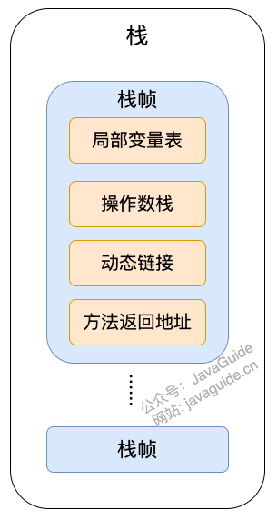

局部变量表：主要存放了编译期可知的各种数据类型（boolean、byte、char、short、int、float、long、double）、对象引用（reference 类型，它不同于对象本身，可能是一个指向对象起始地址的引用指针，也可能是指向一个代表对象的句柄或其他与此对象相关的位置）。它的容量是以Slot为最小单位，一个slot可以存放32位以内的数据类型。 

虚拟机通过索引定位的方式使用局部变量表，范围为[0,局部变量表的slot的数量]。方法中的参数就会按一定顺序排列在这个局部变量表中，至于怎么排的我们可以先不关心。而为了节省栈帧空间，这些slot是可以复用的，当方法执行位置超过了某个变量，那么这个变量的slot可以被其它变量复用。当然如果需要复用，那我们的垃圾回收自然就不会去动这些内存。 

操作数栈：主要作为方法调用的中转站使用，用于存放方法执行过程中产生的中间计算结果。另外，计算过程中产生的临时变量也会放在操作数栈中。

动态链接：主要服务一个方法需要调用其他方法的场景。在 Java 源文件被编译成字节码文件时，所有的变量和方法引用都作为符号引用（Symbilic Reference）保存在 Class 文件的常量池里。当一个方法要调用其他方法，需要将常量池中指向方法的符号引用转化为其在内存地址中的直接引用。动态链接的作用就是为了将符号引用转换为调用方法的直接引用。

栈空间虽然不是无限的，但一般正常调用的情况下是不会出现问题的。不过，如果函数调用陷入无限循环的话，就会导致栈中被压入太多栈帧而占用太多空间，导致栈空间过深。那么当线程请求栈的深度超过当前 Java 虚拟机栈的最大深度的时候，就抛出 StackOverFlowError 错误。

Java 方法有两种返回方式，一种是 return 语句正常返回，一种是抛出异常。不管哪种返回方式，都会导致栈帧被弹出。也就是说， 栈帧随着方法调用而创建，随着方法结束而销毁。无论方法正常完成还是异常完成都算作方法结束。

除了 StackOverFlowError 错误之外，栈还可能会出现OutOfMemoryError错误，这是因为如果栈的内存大小可以动态扩展， 如果虚拟机在动态扩展栈时无法申请到足够的内存空间，则抛出OutOfMemoryError异常。

如果虚拟机栈可以动态扩展，则当栈扩展时无法申请到足够的内存会抛出OutOfMemoryError；如果虚拟机栈容量不支持动态扩展，则只有申请栈的时候可能会抛出OutOfMemoryError。HotSpot虚拟机的栈容量是不可以动态扩展的。

简单总结一下程序运行中栈可能会出现两种错误：

* StackOverFlowError： 若栈的内存大小不允许动态扩展，那么当线程请求栈的深度超过当前 Java 虚拟机栈的最大深度的时候，就抛出 StackOverFlowError 错误。
* OutOfMemoryError： 如果栈的内存大小可以动态扩展， 如果虚拟机在动态扩展栈时无法申请到足够的内存空间，则抛出OutOfMemoryError异常。

对于栈来说，不存在垃圾回收。只要程序运行结束，栈的空间自然就会释放了。栈的生命周期和所处的线程是一致的。 

## 本地方法栈

和虚拟机栈所发挥的作用非常相似，区别是： 虚拟机栈为虚拟机执行 Java 方法 （也就是字节码）服务，而本地方法栈则为虚拟机使用到的 Native 方法服务。 在 HotSpot 虚拟机中和 Java 虚拟机栈合二为一。

本地方法被执行的时候，在本地方法栈也会创建一个栈帧，用于存放该本地方法的局部变量表、操作数栈、动态链接、出口信息。 

方法执行完毕后相应的栈帧也会出栈并释放内存空间，也会出现 StackOverFlowError 和 OutOfMemoryError 两种错误。

## 堆

Java 虚拟机所管理的内存中最大的一块，Java 堆是所有线程共享的一块内存区域，在虚拟机启动时创建。此内存区域的唯一目的就是存放对象实例，几乎所有的对象实例以及数组都在这里分配内存。

Java 世界中“几乎”所有的对象都在堆中分配，但是，随着 JIT 编译器的发展与逃逸分析技术逐渐成熟，栈上分配、标量替换优化技术将会导致一些微妙的变化，所有的对象都分配到堆上也渐渐变得不那么“绝对”了。从 JDK 1.7 开始已经默认开启逃逸分析，如果某些方法中的对象引用没有被返回或者未被外面使用（也就是未逃逸出去），那么对象可以直接在栈上分配内存。 

Java 堆是垃圾收集器管理的主要区域，因此也被称作 GC 堆（Garbage Collected Heap）。从垃圾回收的角度，由于现在收集器基本都采用分代垃圾收集算法，所以 Java 堆还可以细分为：新生代和老年代；再细致一点有：Eden、Survivor、Old 等空间。进一步划分的目的是更好地回收内存，或者更快地分配内存。

在 JDK 7 版本及 JDK 7 版本之前，堆内存被通常分为下面三部分：

1. 新生代内存(Young Generation)
2. 老生代(Old Generation)
3. 永久代(Permanent Generation)

下图所示的 Eden 区、两个 Survivor 区 S0 和 S1 都属于新生代，中间一层属于老年代，最下面一层属于永久代。 

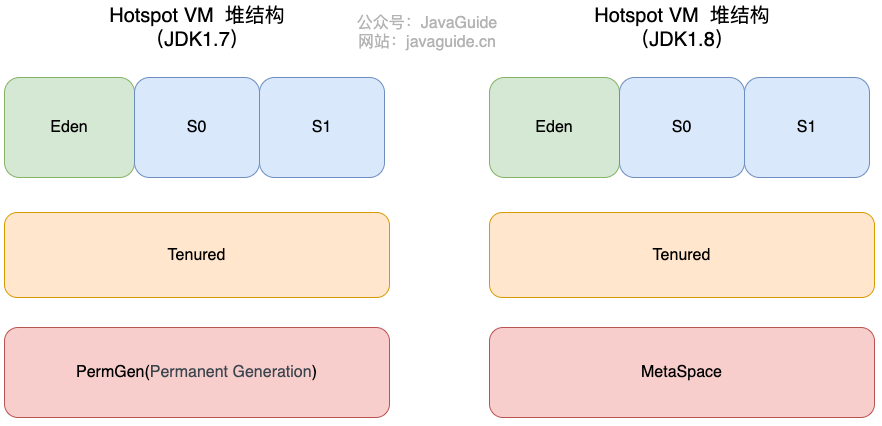

JDK 8 版本之后 PermGen(永久) 已被 Metaspace(元空间) 取代，元空间使用的是直接内存

大部分情况，对象都会首先在 Eden 区域分配，在一次新生代垃圾回收后，如果对象还存活，则会进入 S0 或者 S1，并且对象的年龄还会加 1(Eden 区->Survivor 区后对象的初始年龄变为 1)，Hotspot 遍历所有对象时，按照年龄从小到大对其所占用的大小进行累积，当累积的某个年龄大小超过了 survivor 区的一半时，取这个年龄和 MaxTenuringThreshold 中更小的一个值，作为新的晋升年龄阈值：

~~~c
uint ageTable::compute_tenuring_threshold(size_t survivor_capacity) {
    //survivor_capacity是survivor空间的大小
size_t desired_survivor_size = (size_t)((((double) survivor_capacity)*TargetSurvivorRatio)/100);
size_t total = 0;
uint age = 1;
while (age < table_size) {
total += sizes[age];//sizes数组是每个年龄段对象大小
if (total > desired_survivor_size) break;
age++;
}
uint result = age < MaxTenuringThreshold ? age : MaxTenuringThreshold;
    ...
}
~~~

之所以使用动态年龄计算算法，主要基于如下两点考虑： 

1. 如果固定按照MaxTenuringThreshold设定的阈值作为晋升条件： a）MaxTenuringThreshold设置的过大，原本应该晋升的对象一直停留在Survivor区，直到Survivor区溢出，一旦溢出发生，Eden+Svuvivor中对象将不再依据年龄全部提升到老年代，这样对象老化的机制就失效了。 b）MaxTenuringThreshold设置的过小，“过早晋升”即对象不能在新生代充分被回收，大量短期对象被晋升到老年代，老年代空间迅速增长，引起频繁的Major GC。分代回收失去了意义，严重影响GC性能。
2. 相同应用在不同时间的表现不同：特殊任务的执行或者流量成分的变化，都会导致对象的生命周期分布发生波动，那么固定的阈值设定，因为无法动态适应变化，会造成和上面相同的问题。

总结来说，为了更好的适应不同程序的内存情况，虚拟机并不总是要求对象年龄必须达到Maxtenuringthreshhold再晋级老年代。 

堆这里最容易出现的就是 OutOfMemoryError 错误，并且出现这种错误之后的表现形式还会有几种，比如：

* java.lang.OutOfMemoryError: GC Overhead Limit Exceeded ： 当 JVM 花太多时间执行垃圾回收并且只能回收很少的堆空间时，就会发生此错误。
* java.lang.OutOfMemoryError: Java heap space :假如在创建新的对象时, 堆内存中的空间不足以存放新创建的对象, 就会引发此错误。(和配置的最大堆内存有关，且受制于物理内存大小。最大堆内存可通过-Xmx参数配置，若没有特别配置，将会使用默认值

当代主流虚拟机（Hotspot VM）的垃圾回收都采用“分代回收”的算法。“分代回收”是基于这样一个事实：对象的生命周期不同，所以针对不同生命周期的对象可以采取不同的回收方式，以便提高回收效率。

## 方法区

方法区属于是 JVM 运行时数据区域的一块逻辑区域，是各个线程共享的内存区域。 《Java 虚拟机规范》只是规定了有方法区这么个概念和它的作用，方法区到底要如何实现那就是虚拟机自己要考虑的事情了。也就是说，在不同的虚拟机实现上，方法区的实现是不同的。 

当虚拟机要使用一个类时，它需要读取并解析 Class 文件获取相关信息，再将信息存入到方法区。 方法区会存储已被虚拟机加载的 类信息、字段信息、方法信息、常量、静态变量、即时编译器编译后的代码缓存等数据。

方法区和永久代、元空间的关系：方法区和永久代以及元空间的关系很像 Java 中接口和类的关系，类实现了接口，这里的类就可以看作是永久代和元空间，接口可以看作是方法区，也就是说永久代以及元空间是 HotSpot 虚拟机对虚拟机规范中方法区的两种实现方式。并且，永久代是 JDK 1.8 之前的方法区实现，JDK 1.8 及以后方法区的实现变成了元空间。 

在JDK6的时候HotSpot开发团队就有放弃永久代，逐步改为采用本地内存来实现方法区的计划，到了JDK7的HotSpot，已经把原本放在永久代的字符串常量池、静态变量等移出，而到了JDK8，终于完全放弃了永久代的概念，改用使用本地内存的元空间来代替，把JDK7中永久代剩余的内容（主要是类型信息）全部移到元空间中。

将永久代PermGen替换为元空间MetaSpace的原因：

1、整个永久代有一个 JVM 本身设置的固定大小上限，无法进行调整，而元空间使用的是直接内存，受本机可用内存的限制，虽然元空间仍旧可能溢出，但是比原来出现的几率会更小。 

当元空间溢出时会得到如下错误： java.lang.OutOfMemoryError: MetaSpace

可以使用 -XX：MaxMetaspaceSize 标志设置最大元空间大小，默认值为 unlimited，这意味着它只受系统内存的限制。

也可以使用-XX：MetaspaceSize 调整标志定义元空间的初始大小，如果未指定此标志，则 Metaspace 将根据运行时的应用程序需求动态地重新调整大小。 

2、元空间里面存放的是类的元数据，这样加载多少类的元数据就不由 MaxPermSize 控制了, 而由系统的实际可用空间来控制，这样能加载的类就更多了。

3、在 JDK8，合并 HotSpot 和 JRockit 的代码时, JRockit 从来没有一个叫永久代的东西, 合并之后就没有必要额外的设置这么一个永久代的地方了。 

方法区常用参数：

* JDK 1.8 之前永久代还没被彻底移除的时候通常通过下面这些参数来调节方法区大小：

  ~~~
  -XX:PermSize=N //方法区 (永久代) 初始大小
  -XX:MaxPermSize=N //方法区 (永久代) 最大大小,超过这个值将会抛出 OutOfMemoryError 异常:java.lang.OutOfMemoryError: PermGen
  ~~~

  相对而言，垃圾收集行为在这个区域是比较少出现的，但并非数据进入方法区后就“永久存在”了。 

* JDK 1.8 的时候，方法区（HotSpot 的永久代）被彻底移除了（JDK1.7 就已经开始了），取而代之是元空间，元空间使用的是直接内存。下面是一些常用参数： 

  ~~~
  -XX:MetaspaceSize=N //设置 Metaspace 的初始（和最小大小）
  -XX:MaxMetaspaceSize=N //设置 Metaspace 的最大大小
  ~~~

  与永久代很大的不同就是，如果不指定大小的话，随着更多类的创建，虚拟机会耗尽所有可用的系统内存。 

## 运行时常量池

Class 文件中除了有类的版本、字段、方法、接口等描述信息外，还有用于存放编译期生成的各种字面量（Literal）和符号引用（Symbolic Reference）的 常量池表(Constant Pool Table) 。（这一部分保存的其实也是引用，真正的对象还是保存在堆中）

字面量是源代码中的固定值的表示法，即通过字面我们就能知道其值的含义。字面量包括整数、浮点数和字符串字面量。

符号引用包括类符号引用、字段符号引用、方法符号引用和接口方法符号引用。 

常量池表会在类加载后存放到方法区的运行时常量池中。 

运行时常量池的功能类似于传统编程语言的符号表，尽管它包含了比典型符号表更广泛的数据。 

既然运行时常量池是方法区的一部分，自然受到方法区内存的限制，当常量池无法再申请到内存时会抛出 OutOfMemoryError 错误。

## 字符串常量池

字符串常量池 是 JVM 为了提升性能和减少内存消耗针对字符串（String 类）专门开辟的一块区域，主要目的是为了避免字符串的重复创建。

~~~java
// 在堆中创建字符串对象”ab“
// 将字符串对象”ab“的引用保存在字符串常量池中
String aa = "ab";
// 直接返回字符串常量池中字符串对象”ab“的引用
String bb = "ab";
System.out.println(aa==bb);// true
~~~

HotSpot 虚拟机中字符串常量池的实现是 src/hotspot/share/classfile/stringTable.cpp ,StringTable 本质上就是一个HashSet\<String> ,容量为 StringTableSize（可以通过 -XX:StringTableSize 参数来设置）。

StringTable 中保存的是字符串对象的引用，字符串对象的引用指向堆中的字符串对象。

JDK1.7 之前，字符串常量池存放在永久代。JDK1.7 字符串常量池和静态变量从永久代移动了 Java 堆中。 两个版本的方法区对比：

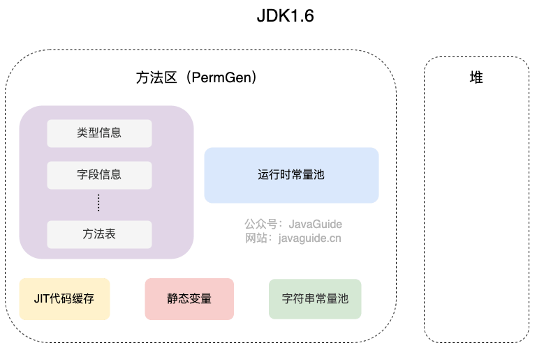

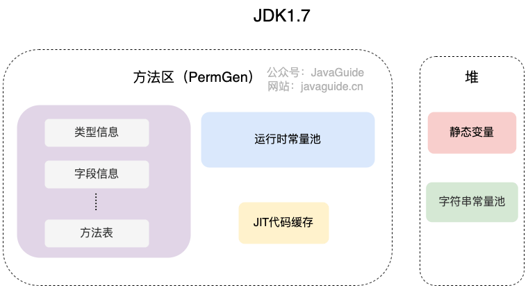

JDK 1.7 为什么要将字符串常量池移动到堆中？

主要是因为永久代（方法区实现）的 GC 回收效率太低，只有在整堆收集 (Full GC)的时候才会被执行 GC。Java 程序中通常会有大量的被创建的字符串等待回收，将字符串常量池放到堆中，能够更高效及时地回收字符串内存。

运行时常量池、方法区、字符串常量池这些都是不随虚拟机实现而改变的逻辑概念，是公共且抽象的，Metaspace、Heap 是与具体某种虚拟机实现相关的物理概念，是私有且具体的。

## 直接内存

直接内存并不是虚拟机运行时数据区的一部分，也不是虚拟机规范中定义的内存区域，但是这部分内存也被频繁地使用。而且也可能导致 OutOfMemoryError 错误出现。 

JDK1.4 中新加入的 NIO(New Input/Output) 类，引入了一种基于通道（Channel）与缓存区（Buffer）的 I/O 方式，它可以直接使用 Native 函数库直接分配堆外内存，然后通过一个存储在 Java 堆中的 DirectByteBuffer 对象作为这块内存的引用进行操作。这样就能在一些场景中显著提高性能，因为避免了在 Java 堆和 Native 堆之间来回复制数据。

本机直接内存的分配不会受到 Java 堆的限制，但是，既然是内存就会受到本机总内存大小以及处理器寻址空间的限制。 

## 运行案例

下面这段代码：

~~~java
public class App {
    public static void main(String[] args) {
        Student student = new Student("tellUrDream");
        student.sayName();
    }
}
~~~

执行main方法的步骤如下: 

* 编译好 App.java 后得到 App.class 后，执行 App.class，系统会启动一个 JVM 进程，从 classpath 路径中找到一个名为 App.class 的二进制文件，将 App 的类信息加载到运行时数据区的方法区内，这个过程叫做 App 类的加载
* JVM 找到 App 的主程序入口，执行main方法
* 这个main中的第一条语句为 Student student = new Student("tellUrDream") ，就是让 JVM 创建一个Student对象，但是这个时候方法区中是没有 Student 类的信息的，所以 JVM 马上加载 Student 类，把 Student 类的信息放到方法区中
* 加载完 Student 类后，JVM 在堆中为一个新的 Student 实例分配内存，然后调用构造函数初始化 Student 实例，这个 Student 实例持有 指向方法区中的 Student 类的类型信息 的引用
* 执行student.sayName();时，JVM 根据 student 的引用找到 student 对象，然后根据 student 对象持有的引用定位到方法区中 student 类的类型信息的方法表，获得 sayName() 的字节码地址。
* 执行sayName()

对象实例初始化时会去方法区中找类信息，完成后再到栈那里去运行方法。找方法就在方法表中找。 

# 对象

以下解析针对的是HotSpot 虚拟机在 Java 堆中的对象

## 对象的创建

### 类加载检查

虚拟机遇到一条 new 指令时，首先将去检查这个指令的参数是否能在常量池中定位到这个类的符号引用，并且检查这个符号引用代表的类是否已被加载过、解析和初始化过。如果没有，那必须先执行相应的类加载过程。 

### 分配内存

在类加载检查通过后，接下来虚拟机将为新生对象分配内存。对象所需的内存大小在类加载完成后便可确定，为对象分配空间的任务等同于把一块确定大小的内存从 Java 堆中划分出来。

分配方式有 “指针碰撞” 和 “空闲列表” 两种，选择哪种分配方式由 Java 堆是否规整决定，而 Java 堆是否规整又由所采用的垃圾收集器是否带有压缩整理功能决定。

内存分配的两种方式：

1、指针碰撞

- 适用场合 ：堆内存规整（即没有内存碎片）的情况下。
- 原理 ：用过的内存全部整合到一边，没有用过的内存放在另一边，中间有一个分界指针，只需要向着没用过的内存方向将该指针移动对象内存大小位置即可。
- 使用该分配方式的 GC 收集器：Serial, ParNew

2、空闲列表

* 适用场合 ： 堆内存不规整的情况下。
* 原理 ：虚拟机会维护一个列表，该列表中会记录哪些内存块是可用的，在分配的时候，找一块儿足够大的内存块儿来划分给对象实例，最后更新列表记录。
* 使用该分配方式的 GC 收集器：CMS

选择以上两种方式中的哪一种，取决于 Java 堆内存是否规整。而 Java 堆内存是否规整，取决于 GC 收集器的算法：

* 标记-整理、复制算法，内存是规整的
* 标记-清除算法，内存是不规整的

在创建对象的时候有一个很重要的问题，就是线程安全，因为在实际开发过程中，创建对象是很频繁的事情，作为虚拟机来说，必须要保证线程是安全的，通常来讲，虚拟机采用两种方式来保证线程安全： 

* CAS+失败重试： CAS 是乐观锁的一种实现方式。所谓乐观锁就是，每次不加锁而是假设没有冲突而去完成某项操作，如果因为冲突失败就重试，直到成功为止。虚拟机采用 CAS 配上失败重试的方式保证更新操作的原子性。
* TLAB： 为每一个线程预先在 Eden 区分配一块儿内存，JVM 在给线程中的对象分配内存时，首先在 TLAB 分配，当对象大于 TLAB 中的剩余内存或 TLAB 的内存已用尽时，再采用上述的 CAS 进行内存分配

### 初始化零值

内存分配完成后，虚拟机需要将分配到的内存空间都初始化为零值（不包括对象头），这一步操作保证了对象的实例字段在 Java 代码中可以不赋初始值就直接使用，程序能访问到这些字段的数据类型所对应的零值。 

### 设置对象头

初始化零值完成之后，虚拟机要对对象进行必要的设置，例如这个对象是哪个类的实例、如何才能找到类的元数据信息、对象的哈希码、对象的 GC 分代年龄等信息。 这些信息存放在对象头中。 另外，根据虚拟机当前运行状态的不同，如是否启用偏向锁等，对象头会有不同的设置方式。

### 执行init方法

在上面工作都完成之后，从虚拟机的视角来看，一个新的对象已经产生了，但从 Java 程序的视角来看，对象创建才刚开始，\<init> 方法还没有执行，所有的字段都还为零。所以一般来说，执行 new 指令之后会接着执行 \<init> 方法，把对象按照程序员的意愿进行初始化，这样一个真正可用的对象才算完全产生出来。

## 对象的内存布局

在 Hotspot 虚拟机中，对象在内存中的布局可以分为 3 块区域：对象头、实例数据和对齐填充

* Hotspot 虚拟机的对象头包括两部分信息，第一部分用于存储对象自身的运行时数据（哈希码、GC 分代年龄、锁状态标志等等），另一部分是类型指针，即对象指向它的类元数据的指针，虚拟机通过这个指针来确定这个对象是哪个类的实例。
* 实例数据部分是对象真正存储的有效信息，也是在程序中所定义的各种类型的字段内容。
* 对齐填充部分不是必然存在的，也没有什么特别的含义，仅仅起占位作用。 因为 Hotspot 虚拟机的自动内存管理系统要求对象起始地址必须是 8 字节的整数倍，换句话说就是对象的大小必须是 8 字节的整数倍。而对象头部分正好是 8 字节的倍数（1 倍或 2 倍），因此，当对象实例数据部分没有对齐时，就需要通过对齐填充来补全。

## 对象的访问定位

建立对象就是为了使用对象，我们的 Java 程序通过栈上的 reference 数据来操作堆上的具体对象。对象的访问方式由虚拟机实现而定，目前主流的访问方式有：使用句柄、直接指针。

### 句柄

如果使用句柄的话，那么 Java 堆中将会划分出一块内存来作为句柄池，reference 中存储的就是对象的句柄地址，而句柄中包含了对象实例数据与对象类型数据各自的具体地址信息：

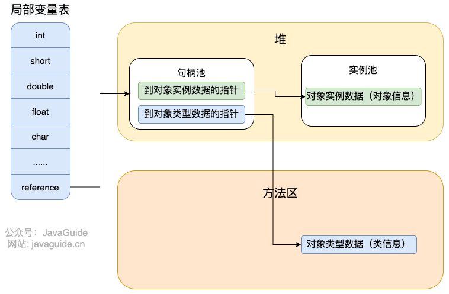

### 直接指针

如果使用直接指针访问，reference 中存储的直接就是对象的地址，对象中又包含对象实例数据和指向对象类型数据的指针：

这两种对象访问方式各有优势。使用句柄来访问的最大好处是 reference 中存储的是稳定的句柄地址，在对象被移动时只会改变句柄中的实例数据指针，而 reference 本身不需要修改。使用直接指针访问方式最大的好处就是速度快，它节省了一次指针定位的时间开销。 

HotSpot 虚拟机主要使用的就是这种方式来进行对象访问。 

# 垃圾回收

## 内存区域

程序计数器、虚拟机栈、本地方法栈，3个区域随着线程的生存而生存的。内存分配和回收都是确定的。随着线程的结束内存自然就被回收了，因此不需要考虑垃圾回收的问题。而Java堆和方法区则不一样，各线程共享，内存的分配和回收都是动态的。因此垃圾收集器所关注的都是堆和方法这部分内存。 

Hotspot VM将内存划分为不同的物理区，就是“分代”思想的体现。如图所示，JVM内存主要由新生代、老年代、永久代构成：

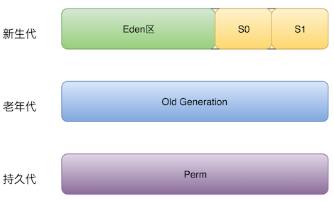

1、新生代（Young Generation）：大多数对象在新生代中被创建，其中很多对象的生命周期很短。每次新生代的垃圾回收（又称Minor GC）后只有少量对象存活，所以选用复制算法，只需要少量的复制成本就可以完成回收。 

新生代内又分三个区：一个Eden区，两个Survivor区（一般而言），大部分对象在Eden区中生成。当Eden区满时，还存活的对象将被复制到两个Survivor区（中的一个）。当这个Survivor区满时，此区的存活且不满足“晋升”条件的对象将被复制到另外一个Survivor区。对象每经历一次Minor GC，年龄加1，达到“晋升年龄阈值”后，被放到老年代，这个过程也称为“晋升”。显然，“晋升年龄阈值”的大小直接影响着对象在新生代中的停留时间，在Serial和ParNew GC两种回收器中，“晋升年龄阈值”通过参数MaxTenuringThreshold设定，默认值为15。

2、老年代（Old Generation）：在新生代中经历了N次垃圾回收后仍然存活的对象，就会被放到年老代，该区域中对象存活率高。老年代的垃圾回收（又称Major GC）通常使用“标记-清理”或“标记-整理”算法。整堆包括新生代和老年代的垃圾回收称为Full GC（HotSpot VM里，除了CMS之外，其它能收集老年代的GC都会同时收集整个GC堆，包括新生代）。 

3、永久代（Perm Generation）：主要存放元数据，例如Class、Method的元信息，与垃圾回收要回收的Java对象关系不大。相对于新生代和年老代来说，该区域的划分对垃圾回收影响比较小。 

## 内存分配与回收原则

1、对象优先在Eden区分配

大多数情况下，对象在新生代中 Eden 区分配。当 Eden 区没有足够空间进行分配时，虚拟机将发起一次 Minor GC。 

如果GC期间虚拟机发现对象无法存入Survivor 空间，所以只好通过 分配担保机制 把新生代的对象提前转移到老年代中去，老年代上的空间足够存放 allocation1，所以不会出现 Full GC。

执行 Minor GC 后，后面分配的对象如果能够存在 Eden 区的话，还是会在 Eden 区分配内存。 

2、大对象直接进入老年代

大对象就是需要大量连续内存空间的对象（比如：字符串、数组）。 

大对象直接进入老年代主要是为了避免为大对象分配内存时由于分配担保机制带来的复制而降低效率。 

3、长期存活的对象将进入老年代

虚拟机采用了分代收集的思想来管理内存，为了识别对象的生存时间，虚拟机给每个对象一个对象年龄（Age）计数器。 

大部分情况，对象都会首先在 Eden 区域分配。如果对象在 Eden 出生并经过第一次 Minor GC 后仍然能够存活，并且能被 Survivor 容纳的话，将被移动到 Survivor 空间（s0 或者 s1）中，并将对象年龄设为 1(Eden 区->Survivor 区后对象的初始年龄变为 1)。 

对象在 Survivor 中每熬过一次 MinorGC,年龄就增加 1 岁，当它的年龄增加到一定程度（默认为 15 岁），就会被晋升到老年代中。对象晋升到老年代的年龄阈值，可以通过参数 -XX:MaxTenuringThreshold 来设置。

实际上，晋升年龄阈值的计算更复杂，不一定会直接取MaxTenuringThreshold。Hotspot 遍历所有对象时，按照年龄从小到大对其所占用的大小进行累积，当累积的某个年龄大小超过了 survivor 区的 50% 时（默认值是 50%，可以通过 -XX:TargetSurvivorRatio=percent 来设置），取这个年龄和 MaxTenuringThreshold 中更小的一个值，作为新的晋升年龄阈值

动态年龄计算的代码如下：

~~~c
uint ageTable::compute_tenuring_threshold(size_t survivor_capacity) {
    //survivor_capacity是survivor空间的大小
    size_t desired_survivor_size = (size_t)((((double)survivor_capacity)*TargetSurvivorRatio)/100);
    size_t total = 0;
    uint age = 1;
    while (age < table_size) {
        //sizes数组是每个年龄段对象大小
        total += sizes[age];
        if (total > desired_survivor_size) {
        break;
    }
    age++;
    }
    uint result = age < MaxTenuringThreshold ? age : MaxTenuringThreshold;
    ...
}
~~~

关于默认的晋升年龄是 15，这个说法的来源大部分都是《深入理解 Java 虚拟机》这本书。在Oracle 的官网阅读相关的虚拟机参数说明，可以发现默认晋升年龄并不都是 15，这个是要区分垃圾收集器的，CMS 就是 6

4、GC的区域

针对 HotSpot VM 的实现，它里面的 GC 其实准确分类只有两大种： 

部分收集 (Partial GC)： 

- 新生代收集（Minor GC / Young GC）：只对新生代进行垃圾收集；
- 老年代收集（Major GC / Old GC）：只对老年代进行垃圾收集。需要注意的是 Major GC 在有的语境中也用于指代整堆收集；
- 混合收集（Mixed GC）：对整个新生代和部分老年代进行垃圾收集。

整堆收集 (Full GC)：收集整个 Java 堆和方法区。 

5、空间分配担保

空间分配担保是为了确保在 Minor GC 之前老年代本身还有容纳新生代所有对象的剩余空间。 

JDK 6 Update 24 之前，在发生 Minor GC 之前，虚拟机必须先检查老年代最大可用的连续空间是否大于新生代所有对象总空间，如果这个条件成立，那这一次 Minor GC 可以确保是安全的。如果不成立，则虚拟机会先查看 -XX:HandlePromotionFailure 参数的设置值是否允许担保失败(Handle Promotion Failure);如果允许，那会继续检查老年代最大可用的连续空间是否大于历次晋升到老年代对象的平均大小，如果大于，将尝试进行一次 Minor GC，尽管这次 Minor GC 是有风险的;如果小于，或者 -XX: HandlePromotionFailure 设置不允许冒险，那这时就要改为进行一次 Full GC。

JDK 6 Update 24 之后的规则变为只要老年代的连续空间大于新生代对象总大小或者历次晋升的平均大小，就会进行 Minor GC，否则将进行 Full GC。

## 死亡对象判断方法

堆中几乎放着所有的对象实例，对堆垃圾回收前的第一步就是要判断哪些对象已经死亡（即不能再被任何途径使用的对象）。 

### 引用计数法

给对象中添加一个引用计数器： 

- 每当有一个地方引用它，计数器就加 1；
- 当引用失效，计数器就减 1；
- 任何时候计数器为 0 的对象就是不可能再被使用的。

这个方法实现简单，效率高，但是目前主流的虚拟机中并没有选择这个算法来管理内存，其最主要的原因是它很难解决对象之间相互循环引用的问题。

所谓对象之间的相互引用问题，如下面代码所示：除了对象 objA 和 objB 相互引用着对方之外，这两个对象之间再无任何引用。但是他们因为互相引用对方，导致它们的引用计数器都不为 0，于是引用计数算法无法通知 GC 回收器回收他们。

~~~java
public class ReferenceCountingGc {
    Object instance = null;
    public static void main(String[] args) {
        ReferenceCountingGc objA = new ReferenceCountingGc();
        ReferenceCountingGc objB = new ReferenceCountingGc();
        objA.instance = objB;
        objB.instance = objA;
        objA = null;
        objB = null;
    }
}
~~~

### 可达性分析算法

这个算法的基本思想就是通过一系列的称为 “GC Roots” 的对象作为起点，从这些节点开始向下搜索，节点所走过的路径称为引用链，当一个对象到 GC Roots 没有任何引用链相连的话，则证明此对象是不可用的，需要被回收。

下图中的 Object 6 ~ Object 10 之间虽有引用关系，但它们到 GC Roots 不可达，因此为需要被回收的对象。

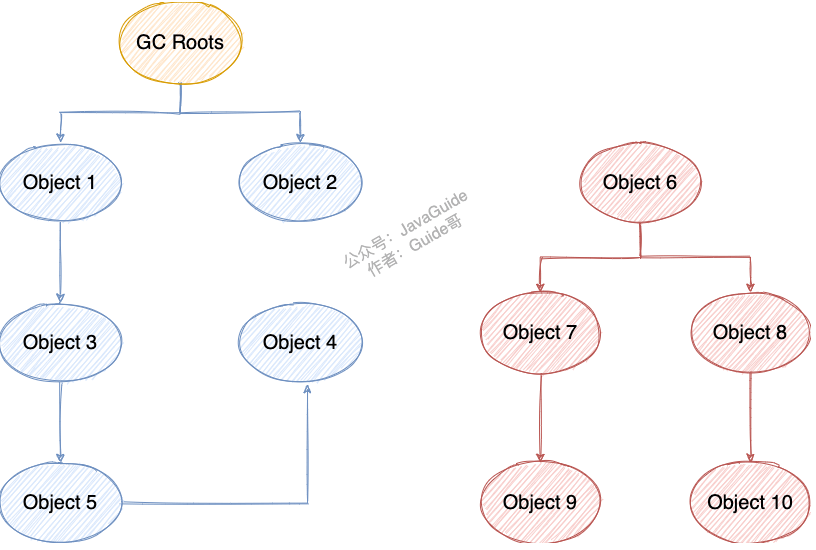

可以作为GC Roots的对象：

- 虚拟机栈(栈帧中的本地变量表)中引用的对象
- 本地方法栈(Native 方法)中JNI引用的对象（JNI是Java虚拟机调用对应的C函数的方式，通过JNI函数也可以创建新的Java对象。且JNI对于对象的局部引用或者全局引用都会把它们指向的对象都标记为不可回收）
- 方法区中类静态属性引用的对象
- 方法区中常量引用的对象
- 所有被同步锁持有的对象

### 回收与finalize

对象可以被回收，不代表一定会被回收

即使在可达性分析法中不可达的对象，也并非是“非死不可”的，这时候它们暂时处于“缓刑阶段”，要真正宣告一个对象死亡，至少要经历两次标记过程：

* 可达性分析法中不可达的对象被第一次标记并且进行一次筛选，筛选的条件是此对象是否有必要执行 finalize 方法。

  当对象没有覆盖 finalize 方法，或 finalize 方法已经被虚拟机调用过时，虚拟机将这两种情况视为没有必要执行。

* 被判定为需要执行的对象将会被放在一个队列中进行第二次标记，除非这个对象与引用链上的任何一个对象建立关联，否则就会被真的回收。 

Object的finalize方法已经逐渐退出历史的舞台。如果对象创建不由垃圾收集器管理的资源，则finalize非常有用。例如，文件描述符或本地分配内存，也就是堆外内存。垃圾收集器不会清理这些东西，所以这时候就只能用finalize来搞定。在Java早期，finalize是清理非堆资源的唯一机制。  

finalize方法的有个问题就是，它允许对象的“复活”。当一个对象的finalize方法被调用时，它可以引用this（即将被收集的对象）。这个时候就可以将this这个引用又挂载回对象图（object graph）中，从而逃过了对象收集。 

~~~java
/**
 * finalize的时候逃过gc
 */
public class Resurrection
{
    public static Resurrection obj;

    @Override
    protected void finalize() throws Throwable {
        super.finalize();
        System.out.println("Resurrection finalize called !!!");
        obj = this;//在finalize方法中复活对象
    }

    @Override
    public String toString() {
        return "I am Resurrection";
    }

    public static void main(String[] args) throws InterruptedException {
        obj = new Resurrection();
        obj = null; //将obj设为null
        System.gc();//垃圾回收

        Thread.sleep(1000);//
        if(obj == null) {
            System.out.println("obj is null");
        } else {
            System.out.println("obj is alive");
        }

        System.out.println("第2次调用gc后");
        obj = null;//由于obj被复活，此处再次将obj设为null
        System.gc();//再次gc
        Thread.sleep(1000);
        if(obj == null) {
            //对象的finalize方法仅仅会被调用一次，所以可以预见再次设置obj为null后，obj会被垃圾回收，该语句会被调用
            System.out.println("obj is null");
        } else {
            System.out.println("obj is alive");
        }
    }
}
~~~

并不鼓励用这种方法来拯救对象，应该尽量避免使用它，它是Java刚诞生时为了使C/C++程序员更容易接受它所作出的一个妥协。它的运行代价高昂，不确定性大，无法保证各个对象的调用顺序。有些教材中描述它适合做关闭外部资源之类的工作，这完全是对这个方法用途的一个自我安慰，finalize所做的所有工作，使用try-finally或者其他方式都可以做的更好、更及时。

### 引用类型总结

无论是通过引用计数法判断对象引用数量，还是通过可达性分析法判断对象的引用链是否可达，判定对象的存活都与“引用”有关。 

JDK1.2 之前，Java 中引用的定义很传统：如果 reference 类型的数据存储的数值代表的是另一块内存的起始地址，就称这块内存代表一个引用。

JDK1.2 以后，Java 对引用的概念进行了扩充，将引用分为强引用、软引用、弱引用、虚引用四种（引用强度逐渐减弱）

1、强引用（StrongReference）

以前我们使用的大部分引用实际上都是强引用，这是使用最普遍的引用。如果一个对象具有强引用，那就类似于必不可少的生活用品，垃圾回收器绝不会回收它。当内存空间不足，Java 虚拟机宁愿抛出 OutOfMemoryError 错误，使程序异常终止，也不会靠随意回收具有强引用的对象来解决内存不足问题。

2、软引用（SoftReference）

如果一个对象只具有软引用，那就类似于可有可无的生活用品。如果内存空间足够，垃圾回收器就不会回收它，如果内存空间不足了，就会回收这些对象的内存。只要垃圾回收器没有回收它，该对象就可以被程序使用。软引用可用来实现内存敏感的高速缓存。

软引用可以和一个引用队列（ReferenceQueue）联合使用，如果软引用所引用的对象被垃圾回收，JAVA 虚拟机就会把这个软引用加入到与之关联的引用队列中。

3、弱引用（WeakReference）

如果一个对象只具有弱引用，那就类似于可有可无的生活用品。弱引用与软引用的区别在于：只具有弱引用的对象拥有更短暂的生命周期。在垃圾回收器线程扫描它所管辖的内存区域的过程中，一旦发现了只具有弱引用的对象，不管当前内存空间足够与否，都会回收它的内存。不过，由于垃圾回收器是一个优先级很低的线程， 因此不一定会很快发现那些只具有弱引用的对象。

弱引用可以和一个引用队列（ReferenceQueue）联合使用，如果弱引用所引用的对象被垃圾回收，Java 虚拟机就会把这个弱引用加入到与之关联的引用队列中。 

4、虚引用（PhantomReference）

"虚引用"顾名思义，就是形同虚设，与其他几种引用都不同，虚引用并不会决定对象的生命周期。如果一个对象仅持有虚引用，那么它就和没有任何引用一样，在任何时候都可能被垃圾回收。

虚引用主要用来跟踪对象被垃圾回收的活动。

虚引用与软引用和弱引用的一个区别在于： 虚引用必须和引用队列（ReferenceQueue）联合使用。当垃圾回收器准备回收一个对象时，如果发现它还有虚引用，就会在回收对象的内存之前，把这个虚引用加入到与之关联的引用队列中。程序可以通过判断引用队列中是否已经加入了虚引用，来了解被引用的对象是否将要被垃圾回收。程序如果发现某个虚引用已经被加入到引用队列，那么就可以在所引用的对象的内存被回收之前采取必要的行动。

特别注意，在程序设计中一般很少使用弱引用与虚引用，使用软引用的情况较多，这是因为软引用可以加速 JVM 对垃圾内存的回收速度，可以维护系统的运行安全，防止内存溢出（OutOfMemory）等问题的产生。

### 废弃常量和类

运行时常量池主要回收的是废弃的常量。

在1.8后，字符串常量池在堆中，运行时常量池在元空间，元空间不涉及垃圾回收。字符串常量池中，是按照引用数量来判断的，假如在字符串常量池中存在字符串 "abc"，如果当前没有任何 String 对象引用该字符串常量的话，就说明常量 "abc" 就是废弃常量，如果这时发生内存回收的话而且有必要的话，"abc" 就会被系统清理出常量池了。 

方法区主要回收的是无用的类，判定一个常量是否是“废弃常量”比较简单，而要判定一个类是否是“无用的类”的条件则相对苛刻许多。类需要同时满足下面 3 个条件才能算是 “无用的类” ：

* 该类所有的实例都已经被回收，也就是 Java 堆中不存在该类的任何实例。
* 加载该类的 ClassLoader 已经被回收。
* 该类对应的 java.lang.Class 对象没有在任何地方被引用，无法在任何地方通过反射访问该类的方法。

虚拟机可以对满足上述 3 个条件的无用类进行回收，这里说的仅仅是“可以”，而并不是和对象一样不使用了就会必然被回收。 

## 垃圾回收算法

### 标记-清除算法

该算法分为“标记”和“清除”阶段：首先标记出所有不需要回收的对象，在标记完成后统一回收掉所有没有被标记的对象。它是最基础的收集算法，后续的算法都是对其不足进行改进得到。这种垃圾收集算法会带来两个明显的问题： 

* 效率问题
* 空间问题（标记清除后会产生大量不连续的碎片）

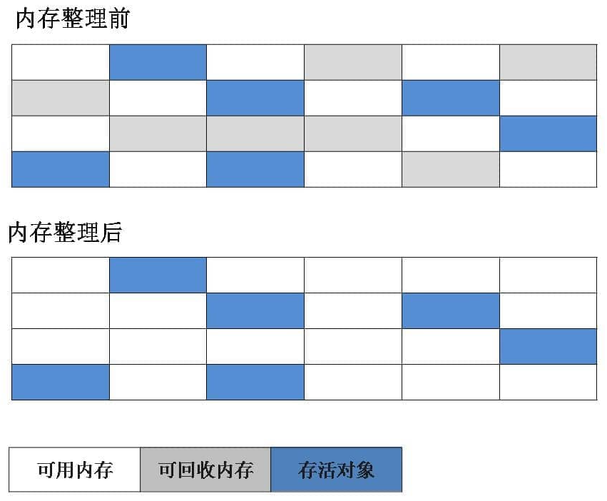

### 标记-复制算法

为了解决效率问题，“标记-复制”收集算法出现了。它可以将内存分为大小相同的两块，每次使用其中的一块。当这一块的内存使用完后，就将还存活的对象复制到另一块去，然后再把使用的空间一次清理掉。这样就使每次的内存回收都是对内存区间的一半进行回收。 

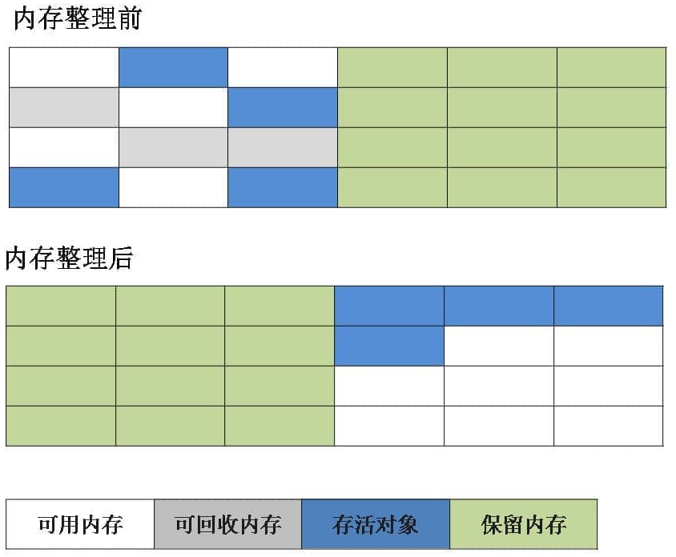

### 标记-整理算法

根据老年代的特点提出的一种标记算法，标记过程仍然与“标记-清除”算法一样，但后续步骤不是直接对可回收对象回收，而是让所有存活的对象向一端移动，然后直接清理掉端边界以外的内存。 

### 分代收集算法

当前虚拟机的垃圾收集都采用分代收集算法，这种算法没有什么新的思想，只是根据对象存活周期的不同将内存分为几块。一般将 java 堆分为新生代和老年代，这样我们就可以根据各个年代的特点选择合适的垃圾收集算法。 

比如在新生代中，每次收集都会有大量对象死去，所以可以选择”标记-复制“算法，只需要付出少量对象的复制成本就可以完成每次垃圾收集。而老年代的对象存活几率是比较高的，而且没有额外的空间对它进行分配担保，所以我们必须选择“标记-清除”或“标记-整理”算法进行垃圾收集。

## 垃圾收集器

如果说收集算法是内存回收的方法论，那么垃圾收集器就是内存回收的具体实现。

虽然我们对各个收集器进行比较，但并非要挑选出一个最好的收集器。因为直到现在为止还没有最好的垃圾收集器出现，更加没有万能的垃圾收集器，我们能做的就是根据具体应用场景选择适合自己的垃圾收集器。

### Serial 收集器

Serial（串行）收集器是最基本、历史最悠久的垃圾收集器了。大家看名字就知道这个收集器是一个单线程收集器了。它的 “单线程” 的意义不仅仅意味着它只会使用一条垃圾收集线程去完成垃圾收集工作，更重要的是它在进行垃圾收集工作的时候必须暂停其他所有的工作线程（ "Stop The World" ），直到它收集结束。

新生代采用标记-复制算法，老年代采用标记-整理算法。

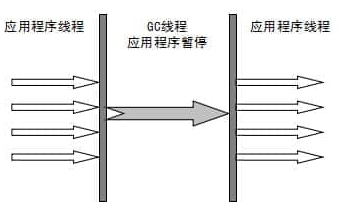

虚拟机的设计者们当然知道 Stop The World 带来的不良用户体验，所以在后续的垃圾收集器设计中停顿时间在不断缩短（仍然还有停顿，寻找最优秀的垃圾收集器的过程仍然在继续） 

Serial 收集器优点：简单而高效（与其他收集器的单线程相比）。Serial 收集器由于没有线程交互的开销，自然可以获得很高的单线程收集效率。Serial 收集器对于运行在 Client 模式下的虚拟机来说是个不错的选择。

### ParNew 收集器

ParNew 收集器其实就是 Serial 收集器的多线程版本，除了使用多线程进行垃圾收集外，其余行为（控制参数、收集算法、回收策略等等）和 Serial 收集器完全一样。

新生代采用标记-复制算法，老年代采用标记-整理算法。

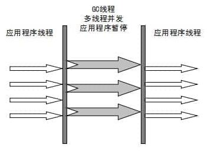

它是许多运行在 Server 模式下的虚拟机的首要选择，除了 Serial 收集器外，只有它能与 CMS 收集器（真正意义上的并发收集器，后面会介绍到）配合工作。 

### Parallel Scavenge 收集器

Parallel Scavenge 收集器也是使用标记-复制算法的多线程收集器。

新生代采用标记-复制算法，老年代采用标记-整理算法。

调整JVM参数可以设置它为收集器：

~~~
-XX:+UseParallelGC
    使用 Parallel 收集器+ 老年代串行
-XX:+UseParallelOldGC
    使用 Parallel 收集器+ 老年代并行
~~~

Parallel Scavenge 收集器关注点是吞吐量（高效率的利用 CPU）。CMS 等垃圾收集器的关注点更多的是用户线程的停顿时间（提高用户体验）。所谓吞吐量就是 CPU 中用于运行用户代码的时间与 CPU 总消耗时间的比值。 Parallel Scavenge 收集器提供了很多参数供用户找到最合适的停顿时间或最大吞吐量，如果对于收集器运作不太了解，手工优化存在困难的时候，使用 Parallel Scavenge 收集器配合自适应调节策略，把内存管理优化交给虚拟机去完成也是一个不错的选择。

这是 JDK1.8 默认收集器。JDK1.8 默认使用的是 Parallel Scavenge + Parallel Old 

### Serial Old 收集器

Serial 收集器的老年代版本，它同样是一个单线程收集器。它主要有两大用途：一种用途是在 JDK1.5 以及以前的版本中与 Parallel Scavenge 收集器搭配使用，另一种用途是作为 CMS 收集器的后备方案。

### Parallel Old 收集器

Parallel Scavenge 收集器的老年代版本。使用多线程和“标记-整理”算法。在注重吞吐量以及 CPU 资源的场合，都可以优先考虑 Parallel Scavenge 收集器和 Parallel Old 收集器。

### CMS 收集器

CMS（Concurrent Mark Sweep）收集器是一种以获取最短回收停顿时间为目标的收集器。它非常符合在注重用户体验的应用上使用。

CMS（Concurrent Mark Sweep）收集器是 HotSpot 虚拟机第一款真正意义上的并发收集器，它第一次实现了让垃圾收集线程与用户线程（基本上）同时工作。

从名字中的Mark Sweep这两个词可以看出，CMS 收集器是一种 “标记-清除”算法实现的，它的运作过程相比于前面几种垃圾收集器来说更加复杂一些。整个过程分为四个步骤：

* 初始标记： 暂停所有的其他线程，并记录下直接与 root 相连的对象，速度很快 ；
* 并发标记： 同时开启 GC 和用户线程，用一个闭包结构去记录可达对象。但在这个阶段结束，这个闭包结构并不能保证包含当前所有的可达对象。因为用户线程可能会不断的更新引用域，所以 GC 线程无法保证可达性分析的实时性。所以这个算法里会跟踪记录这些发生引用更新的地方。
* 重新标记： 重新标记阶段就是为了修正并发标记期间因为用户程序继续运行而导致标记产生变动的那一部分对象的标记记录，这个阶段的停顿时间一般会比初始标记阶段的时间稍长，远远比并发标记阶段时间短
* 并发清除： 开启用户线程，同时 GC 线程开始对未标记的区域做清扫。

从它的名字就可以看出它是一款优秀的垃圾收集器，主要优点：并发收集、低停顿。但是它有下面三个明显的缺点：

* 对 CPU 资源敏感；
* 无法处理浮动垃圾；
* 它使用的回收算法-“标记-清除”算法会导致收集结束时会有大量空间碎片产生。

下图展示了CMS各个阶段可以标记的对象，用不同颜色区分。 

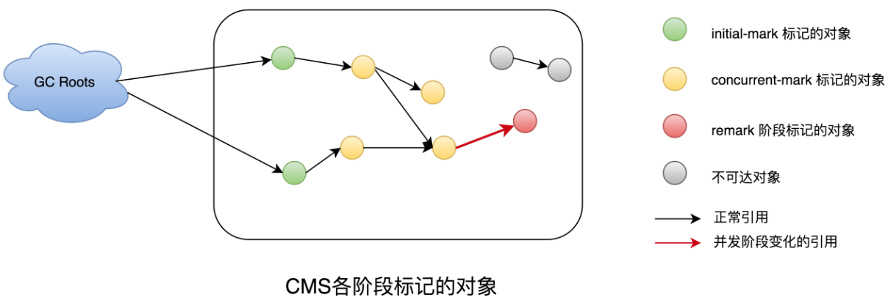

1. Init-mark初始标记(STW) ，该阶段进行可达性分析，标记GC ROOT能直接关联到的对象，所以很快。 
2. Concurrent-mark并发标记，由前阶段标记过的绿色对象出发，所有可到达的对象都在本阶段中标记。 
3. Remark重标记(STW) ，暂停所有用户线程，重新扫描堆中的对象，进行可达性分析，标记活着的对象。因为并发标记阶段是和用户线程并发执行的过程，所以该过程中可能有用户线程修改某些活跃对象的字段，指向了一个未标记过的对象，如下图中红色对象在并发标记开始时不可达，但是并行期间引用发生变化，变为对象可达，这个阶段需要重新标记出此类对象，防止在下一阶段被清理掉，这个过程也是需要STW的。特别需要注意一点，这个阶段是以新生代中对象为根来判断对象是否存活的。 
4. 并发清理，进行并发的垃圾清理。 

可见，Remark阶段主要是通过扫描堆来判断对象是否存活。那么准确判断对象是否存活，需要扫描哪些对象？CMS对老年代做回收，Remark阶段仅扫描老年代是否可行？结论是不可行，原因如下： 

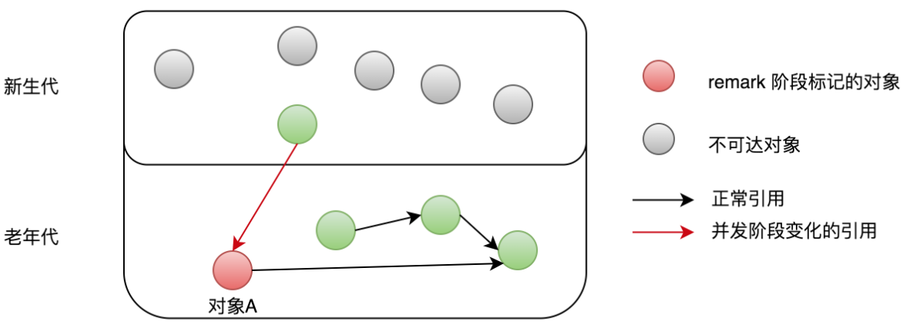

如果仅扫描老年代中对象，即以老年代中对象为根，判断对象是否存在引用，上图中，对象A因为引用存在新生代中，它在Remark阶段就不会被修正标记为可达，GC时会被错误回收。 新生代对象持有老年代中对象的引用，这种情况称为“跨代引用”。因它的存在，Remark阶段必须扫描整个堆来判断对象是否存活，包括图中灰色的不可达对象。

灰色对象已经不可达，但仍然需要扫描的原因：新生代GC和老年代的GC是各自分开独立进行的，只有Minor GC时才会使用根搜索算法，标记新生代对象是否可达，也就是说虽然一些对象已经不可达，但在Minor GC发生前不会被标记为不可达，CMS也无法辨认哪些对象存活，只能全堆扫描（新生代+老年代）。

同样的，新生代GC存在同样的问题，即老年代可能持有新生代对象引用，所以Minor GC时也必须扫描老年代。 

JVM是如何避免Minor GC时扫描全堆的？ 经过统计信息显示，老年代持有新生代对象引用的情况不足1%，根据这一特性JVM引入了卡表（card table）来实现这一目的。如下图所示：

卡表的具体策略是将老年代的空间分成大小为512B的若干张卡（card）。卡表本身是单字节数组，数组中的每个元素对应着一张卡，当发生老年代引用新生代时，虚拟机将该卡对应的卡表元素设置为适当的值。如上图所示，卡表3被标记为脏（卡表还有另外的作用，标识并发标记阶段哪些块被修改过），之后Minor GC时通过扫描卡表就可以很快的识别哪些卡中存在老年代指向新生代的引用。这样虚拟机通过空间换时间的方式，避免了全堆扫描。

总结来说，CMS的设计聚焦在获取最短的时延，为此它“不遗余力”地做了很多工作，包括尽量让应用程序和GC线程并发、增加可中断的并发预清理阶段、引入卡表等，虽然这些操作牺牲了一定吞吐量但获得了更短的回收停顿时间。

### G1收集器

G1 (Garbage-First) 是一款面向服务器的垃圾收集器,主要针对配备多颗处理器及大容量内存的机器. 以极高概率满足 GC 停顿时间要求的同时,还具备高吞吐量性能特征.

被视为 JDK1.7 中 HotSpot 虚拟机的一个重要进化特征。它具备以下特点： 

* 并行与并发：G1 能充分利用 CPU、多核环境下的硬件优势，使用多个 CPU（CPU 或者 CPU 核心）来缩短 Stop-The-World 停顿时间。部分其他收集器原本需要停顿 Java 线程执行的 GC 动作，G1 收集器仍然可以通过并发的方式让 java 程序继续执行。
* 分代收集：虽然 G1 可以不需要其他收集器配合就能独立管理整个 GC 堆，但是还是保留了分代的概念。
* 空间整合：与 CMS 的“标记-清理”算法不同，G1 从整体来看是基于“标记-整理”算法实现的收集器；从局部上来看是基于“标记-复制”算法实现的。
* 可预测的停顿：这是 G1 相对于 CMS 的另一个大优势，降低停顿时间是 G1 和 CMS 共同的关注点，但 G1 除了追求低停顿外，还能建立可预测的停顿时间模型，能让使用者明确指定在一个长度为 M 毫秒的时间片段内。

G1 收集器的运作大致分为以下几个步骤： 初始标记、并发标记、最终标记、筛选回收

G1 收集器在后台维护了一个优先列表，每次根据允许的收集时间，优先选择回收价值最大的 Region(这也就是它的名字 Garbage-First 的由来) 。这种使用 Region 划分内存空间以及有优先级的区域回收方式，保证了 G1 收集器在有限时间内可以尽可能高的收集效率（把内存化整为零）。

很多低延迟高可用Java服务的系统可用性经常受GC停顿的困扰。GC停顿指垃圾回收期间STW（Stop The World），当STW时，所有应用线程停止活动，等待GC停顿结束。 

G1是基于标记-复制算法的，标记-复制算法可以分为三个阶段： 

- 标记阶段，即从GC Roots集合开始，标记活跃对象；
- 转移阶段，即把活跃对象复制到新的内存地址上；
- 重定位阶段，因为转移导致对象的地址发生了变化，在重定位阶段，所有指向对象旧地址的指针都要调整到对象新的地址上。

通过G1中标记-复制算法过程（G1的Young GC和Mixed GC均采用该算法），分析G1停顿耗时的主要瓶颈。G1垃圾回收周期如下图所示： 

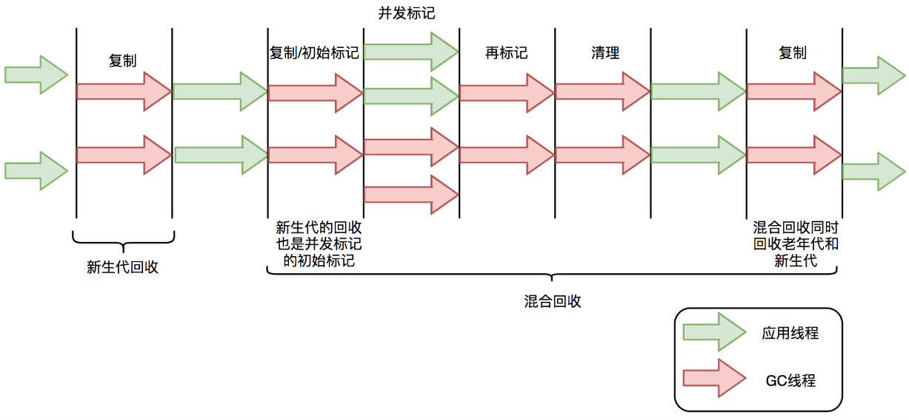

G1的混合回收过程可以分为标记阶段、清理阶段和复制阶段 ：

1、标记阶段停顿分析

- 初始标记阶段：初始标记阶段是指从GC Roots出发标记全部直接子节点的过程，该阶段是STW的。由于GC Roots数量不多，通常该阶段耗时非常短。
- 并发标记阶段：并发标记阶段是指从GC Roots开始对堆中对象进行可达性分析，找出存活对象。该阶段是并发的，即应用线程和GC线程可以同时活动。并发标记耗时相对长很多，但因为不是STW，所以我们不太关心该阶段耗时的长短。
- 再标记阶段：重新标记那些在并发标记阶段发生变化的对象。该阶段是STW的。

2、清理阶段停顿分析

- 清理阶段清点出有存活对象的分区和没有存活对象的分区，该阶段不会清理垃圾对象，也不会执行存活对象的复制。该阶段是STW的。

3、复制阶段停顿分析

* 复制算法中的转移阶段需要分配新内存和复制对象的成员变量。转移阶段是STW的，其中内存分配通常耗时非常短，但对象成员变量的复制耗时有可能较长，这是因为复制耗时与存活对象数量与对象复杂度成正比。对象越复杂，复制耗时越长。

四个STW过程中，初始标记因为只标记GC Roots，耗时较短。再标记因为对象数少，耗时也较短。清理阶段因为内存分区数量少，耗时也较短。转移阶段要处理所有存活的对象，耗时会较长。因此，G1停顿时间的瓶颈主要是标记-复制中的转移阶段STW。之所以转移阶段不能和标记阶段一样并发执行，是因为G1未能解决转移过程中准确定位对象地址的问题。

G1的Young GC和CMS的Young GC（ParNew是CMS默认的新生代垃圾回收器 ），其标记-复制全过程STW 

### ZGC收集器

ZGC（The Z Garbage Collector）是JDK 11中推出的一款低延迟垃圾回收器，它的设计目标包括： 

- 停顿时间不超过10ms；
- 停顿时间不会随着堆的大小，或者活跃对象的大小而增加；
- 支持8MB~4TB级别的堆（未来支持16TB）。

与CMS中的ParNew和G1类似，ZGC也采用标记-复制算法，不过ZGC对该算法做了重大改进：ZGC在标记、转移和重定位阶段几乎都是并发的，这是ZGC实现停顿时间小于10ms目标的最关键原因， 在 ZGC 中出现 Stop The World 的情况会更少 

ZGC垃圾回收周期如下图所示： 

ZGC只有三个STW阶段：初始标记，再标记，初始转移。其中，初始标记和初始转移分别都只需要扫描所有GC Roots，其处理时间和GC Roots的数量成正比，一般情况耗时非常短；再标记阶段STW时间很短，最多1ms，超过1ms则再次进入并发标记阶段。即，ZGC几乎所有暂停都只依赖于GC Roots集合大小，停顿时间不会随着堆的大小或者活跃对象的大小而增加。与ZGC对比，G1的转移阶段完全STW的，且停顿时间随存活对象的大小增加而增加。

ZGC通过着色指针和读屏障技术，解决了转移过程中准确访问对象的问题，实现了并发转移。大致原理描述如下：并发转移中“并发”意味着GC线程在转移对象的过程中，应用线程也在不停地访问对象。假设对象发生转移，但对象地址未及时更新，那么应用线程可能访问到旧地址，从而造成错误。而在ZGC中，应用线程访问对象将触发“读屏障”，如果发现对象被移动了，那么“读屏障”会把读出来的指针更新到对象的新地址上，这样应用线程始终访问的都是对象的新地址。 其中的关键是：JVM通过对象引用的地址，来判断对象是否被移动过，对象引用的地址，就是着色指针。

着色指针是一种将信息存储在指针中的技术。 ZGC仅支持64位系统，它把64位虚拟地址空间划分为多个子空间，如下图所示： 

其中，[0~4TB) 对应Java堆，[4TB ~ 8TB) 称为M0地址空间，[8TB ~ 12TB) 称为M1地址空间，[12TB ~ 16TB) 预留未使用，[16TB ~ 20TB) 称为Remapped空间。 当应用程序创建对象时，首先在堆空间申请一个虚拟地址，但该虚拟地址并不会映射到真正的物理地址。ZGC同时会为该对象在M0、M1和Remapped地址空间分别申请一个虚拟地址，且这三个虚拟地址对应同一个物理地址，但这三个空间在同一时间有且只有一个空间有效。ZGC之所以设置三个虚拟地址空间，是因为它使用“空间换时间”思想，去降低GC停顿时间。“空间换时间”中的空间是虚拟空间，而不是真正的物理空间。 

与上述地址空间划分相对应，ZGC实际仅使用64位地址空间的第0~41位，而第42~45位存储元数据，第47~63位固定为0：

ZGC将对象存活信息存储在42~45位中，这与传统的垃圾回收并将对象存活信息放在对象头中完全不同。 

读屏障是JVM向应用代码插入一小段代码的技术。当应用线程从堆中读取对象引用时，就会执行这段代码。需要注意的是，仅“从堆中读取对象引用”才会触发这段代码：

~~~c
Object o = obj.FieldA   // 从堆中读取引用，需要加入屏障
<Load barrier>
Object p = o  // 无需加入屏障，因为不是从堆中读取引用
o.dosomething() // 无需加入屏障，因为不是从堆中读取引用
int i =  obj.FieldB  //无需加入屏障，因为不是对象引用
~~~

ZGC中读屏障的代码作用：在对象标记和转移过程中，用于确定对象的引用地址是否满足条件，并作出相应动作。 

接下来详细介绍ZGC一次垃圾回收周期中地址视图的切换过程： 

* 初始化：ZGC初始化之后，整个内存空间的地址视图被设置为Remapped。程序正常运行，在内存中分配对象，满足一定条件后垃圾回收启动，此时进入标记阶段。
* 并发标记阶段：第一次进入标记阶段时视图为M0，如果对象被GC标记线程或者应用线程访问过，那么就将对象的地址视图从Remapped调整为M0。所以，在标记阶段结束之后，对象的地址要么是M0视图，要么是Remapped。如果对象的地址是M0视图，那么说明对象是活跃的；如果对象的地址是Remapped视图，说明对象是不活跃的。
* 并发转移阶段：标记结束后就进入转移阶段，此时地址视图再次被设置为Remapped。如果对象被GC转移线程或者应用线程访问过，那么就将对象的地址视图从M0调整为Remapped。

其实，在标记阶段存在两个地址视图M0和M1，上面的过程显示只用了一个地址视图。之所以设计成两个，是为了区别前一次标记和当前标记。也即，第二次进入并发标记阶段后，地址视图调整为M1，而非M0。

着色指针和读屏障技术不仅应用在并发转移阶段，还应用在并发标记阶段：将对象设置为已标记，传统的垃圾回收器需要进行一次内存访问，并将对象存活信息放在对象头中；而在ZGC中，只需要设置指针地址的第42~45位即可，并且因为是寄存器访问，所以速度比访问内存更快。

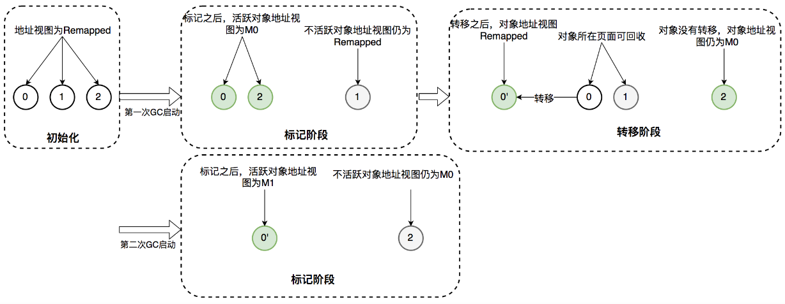

### 小结

HotSpot VM中的垃圾回收器，以及适用场景：

到jdk8为止，默认的垃圾收集器是Parallel Scavenge 和 Parallel Old

从jdk9开始，G1收集器成为默认的垃圾收集器 目前来看，G1回收器停顿时间最短而且没有明显缺点，非常适合Web应用。在jdk8中测试Web应用，堆内存6G，新生代4.5G的情况下，Parallel Scavenge 回收新生代停顿长达1.5秒。G1回收器回收同样大小的新生代只停顿0.2秒。

# 类文件结构

在 Java 中，JVM 可以理解的代码就叫做字节码（即扩展名为 .class 的文件），它不面向任何特定的处理器，只面向虚拟机。Java 语言通过字节码的方式，在一定程度上解决了传统解释型语言执行效率低的问题，同时又保留了解释型语言可移植的特点。所以 Java 程序运行时比较高效，而且，由于字节码并不针对一种特定的机器，因此，Java 程序无须重新编译便可在多种不同操作系统的计算机上运行。

Clojure（Lisp 语言的一种方言）、Groovy、Scala 等语言都是运行在 Java 虚拟机之上。下图展示了不同的语言被不同的编译器编译成.class文件最终运行在 Java 虚拟机之上。.class文件的二进制格式可以使用 WinHex 查看。

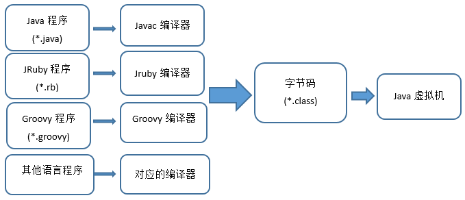

可以说.class文件是不同的语言在 Java 虚拟机之间的重要桥梁，同时也是支持 Java 跨平台很重要的一个原因。

根据 Java 虚拟机规范，Class 文件通过 ClassFile 定义，有点类似 C 语言的结构体。

~~~c
ClassFile {
    u4             magic; //Class 文件的标志
    u2             minor_version;//Class 的小版本号
    u2             major_version;//Class 的大版本号
    u2             constant_pool_count;//常量池的数量
    cp_info        constant_pool[constant_pool_count-1];//常量池
    u2             access_flags;//Class 的访问标记
    u2             this_class;//当前类
    u2             super_class;//父类
    u2             interfaces_count;//接口
    u2             interfaces[interfaces_count];//一个类可以实现多个接口
    u2             fields_count;//Class 文件的字段属性
    field_info     fields[fields_count];//一个类可以有多个字段
    u2             methods_count;//Class 文件的方法数量
    method_info    methods[methods_count];//一个类可以有个多个方法
    u2             attributes_count;//此类的属性表中的属性数
    attribute_info attributes[attributes_count];//属性表集合
}
~~~

通过分析 ClassFile 的内容，我们便可以知道 class 文件的组成：

下面这张图是通过 IDEA 插件 jclasslib 查看的，你可以更直观看到 Class 文件结构：

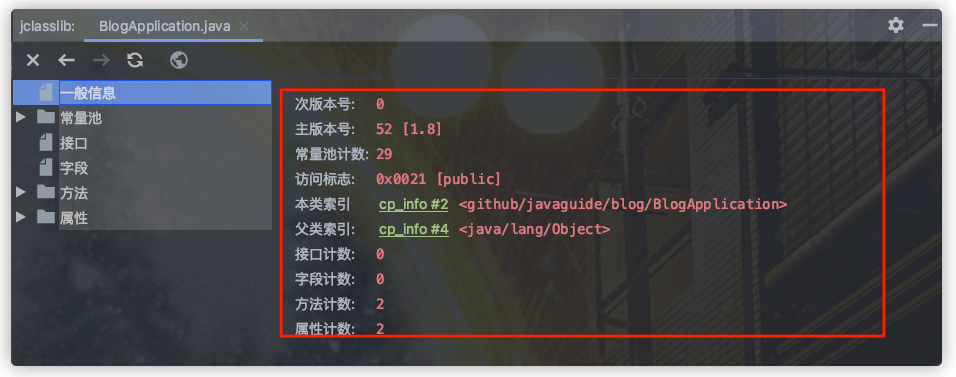

使用 jclasslib 不光可以直观地查看某个类对应的字节码文件，还可以查看类的基本信息、常量池、接口、属性、函数等信息。

## 魔数（Magic Number）

~~~java
    u4             magic; //Class 文件的标志
~~~

每个 Class 文件的头 4 个字节称为魔数（Magic Number）,它的唯一作用是确定这个文件是否为一个能被虚拟机接收的 Class 文件。

程序设计者很多时候都喜欢用一些特殊的数字表示固定的文件类型或者其它特殊的含义。

## Class 文件版本号（Minor&Major Version）

~~~java
    u2             minor_version;//Class 的小版本号
    u2             major_version;//Class 的大版本号
~~~

紧接着魔数的四个字节存储的是 Class 文件的版本号：第 5 和第 6 位是次版本号，第 7 和第 8 位是主版本号。

每当 Java 发布大版本（比如 Java 8，Java9）的时候，主版本号都会加 1。你可以使用 javap -v 命令来快速查看 Class 文件的版本号信息。

高版本的 Java 虚拟机可以执行低版本编译器生成的 Class 文件，但是低版本的 Java 虚拟机不能执行高版本编译器生成的 Class 文件。所以，我们在实际开发的时候要确保开发的的 JDK 版本和生产环境的 JDK 版本保持一致。

## 常量池（Constant Pool）

~~~java
    u2             constant_pool_count;//常量池的数量
    cp_info        constant_pool[constant_pool_count-1];//常量池
~~~

紧接着主次版本号之后的是常量池，常量池的数量是 constant_pool_count-1（常量池计数器是从 1 开始计数的，将第 0 项常量空出来是有特殊考虑的，索引值为 0 代表“不引用任何一个常量池项”）。

常量池主要存放两大常量：字面量和符号引用。字面量比较接近于 Java 语言层面的的常量概念，如文本字符串、声明为 final 的常量值等。而符号引用则属于编译原理方面的概念。包括下面三类常量： 

- 类和接口的全限定名
- 字段的名称和描述符
- 方法的名称和描述符

常量池中每一项常量都是一个表，这 14 种表有一个共同的特点：开始的第一位是一个 u1 类型的标志位 -tag 来标识常量的类型，代表当前这个常量属于哪种常量类型．

|                类型                | 标志（tag） |      描述      |
| :------------------------------: | :-----: | :----------: |
|        CONSTANT_utf8_info        |    1    | UTF-8 编码的字符串 |
|      CONSTANT_Integer_info       |    3    |    整形字面量     |
|       CONSTANT_Float_info        |    4    |    浮点型字面量    |
|        CONSTANT_Long_info        |    ５    |    长整型字面量    |
|       CONSTANT_Double_info       |    ６    |  双精度浮点型字面量   |
|       CONSTANT_Class_info        |    ７    |  类或接口的符号引用   |
|       CONSTANT_String_info       |    ８    |   字符串类型字面量   |
|      CONSTANT_Fieldref_info      |    ９    |   字段的符号引用    |
|     CONSTANT_Methodref_info      |   10    |  类中方法的符号引用   |
| CONSTANT_InterfaceMethodref_info |   11    |  接口中方法的符号引用  |
|    CONSTANT_NameAndType_info     |   12    |  字段或方法的符号引用  |
|     CONSTANT_MothodType_info     |   16    |    标志方法类型    |
|    CONSTANT_MethodHandle_info    |   15    |    表示方法句柄    |
|   CONSTANT_InvokeDynamic_info    |   18    | 表示一个动态方法调用点  |

.class 文件可以通过javap -v class类名 指令来看一下其常量池中的信息(javap -v class类名-> temp.txt ：将结果输出到 temp.txt 文件)。

## 访问标志(Access Flags)

在常量池结束之后，紧接着的两个字节代表访问标志，这个标志用于识别一些类或者接口层次的访问信息，包括：这个 Class 是类还是接口，是否为 public 或者 abstract 类型，如果是类的话是否声明为 final 等等。

类访问和属性修饰符: 

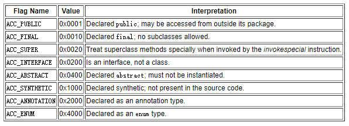

我们定义了一个 Employee 类：

~~~java
package top.snailclimb.bean;
public class Employee {
   ...
}
~~~

可以通过javap -v class类名 指令来看一下类的访问标志：

## 当前类（This Class）、父类（Super Class）、接口（Interfaces）索引集合

~~~java
    u2             this_class;//当前类
    u2             super_class;//父类
    u2             interfaces_count;//接口
    u2             interfaces[interfaces_count];//一个类可以实现多个接口
~~~

类索引用于确定这个类的全限定名，父类索引用于确定这个类的父类的全限定名，由于 Java 语言的单继承，所以父类索引只有一个，除了 java.lang.Object 之外，所有的 java 类都有父类，因此除了 java.lang.Object 外，所有 Java 类的父类索引都不为 0。

接口索引集合用来描述这个类实现了那些接口，这些被实现的接口将按 implements (如果这个类本身是接口的话则是extends) 后的接口顺序从左到右排列在接口索引集合中。

## 字段表集合（Fields）

~~~java
    u2             fields_count;//Class 文件的字段的个数
    field_info     fields[fields_count];//一个类会可以有个字段
~~~

字段表（field info）用于描述接口或类中声明的变量。字段包括类级变量以及实例变量，但不包括在方法内部声明的局部变量。 

field info(字段表) 的结构:

* access_flags: 字段的作用域（public ,private,protected修饰符），是实例变量还是类变量（static修饰符）,可否被序列化（transient 修饰符）,可变性（final）,可见性（volatile 修饰符，是否强制从主内存读写）。
* name_index: 对常量池的引用，表示的字段的名称；
* descriptor_index: 对常量池的引用，表示字段和方法的描述符；
* attributes_count: 一个字段还会拥有一些额外的属性，attributes_count 存放属性的个数；
* attributes[attributes_count]: 存放具体属性具体内容。

上述这些信息中，各个修饰符都是布尔值，要么有某个修饰符，要么没有，很适合使用标志位来表示。而字段叫什么名字、字段被定义为什么数据类型这些都是无法固定的，只能引用常量池中常量来描述。 

字段的 access_flag 的取值:

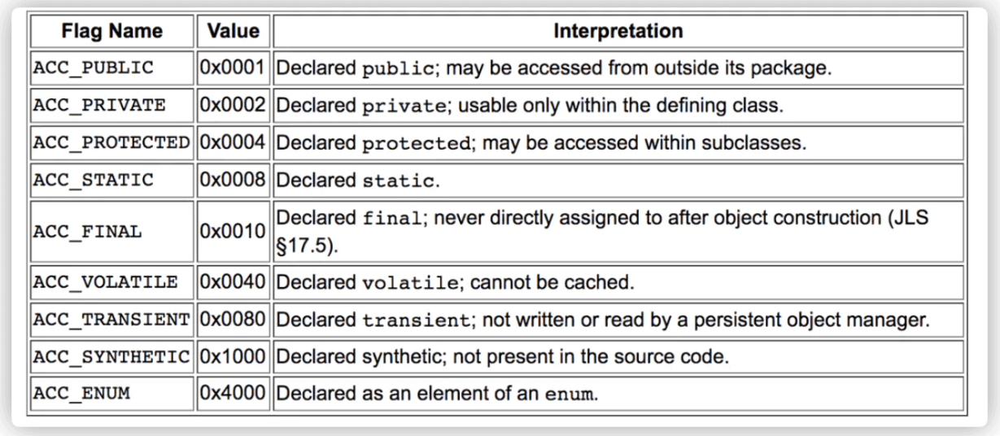

## 方法表集合（Methods）

~~~java
    u2             methods_count;//Class 文件的方法的数量
    method_info    methods[methods_count];//一个类可以有个多个方法
~~~

methods_count 表示方法的数量，而 method_info 表示方法表。

Class 文件存储格式中对方法的描述与对字段的描述几乎采用了完全一致的方式。方法表的结构如同字段表一样，依次包括了访问标志、名称索引、描述符索引、属性表集合几项。

method_info(方法表的) 结构:

方法表的 access_flag 取值：

注意：因为volatile修饰符和transient修饰符不可以修饰方法，所以方法表的访问标志中没有这两个对应的标志，但是增加了synchronized、native、abstract等关键字修饰方法，所以也就多了这些关键字对应的标志。

## 属性表集合（Attributes）

~~~java
   u2             attributes_count;//此类的属性表中的属性数
   attribute_info attributes[attributes_count];//属性表集合
~~~

在 Class 文件，字段表，方法表中都可以携带自己的属性表集合，以用于描述某些场景专有的信息。与 Class 文件中其它的数据项目要求的顺序、长度和内容不同，属性表集合的限制稍微宽松一些，不再要求各个属性表具有严格的顺序，并且只要不与已有的属性名重复，任何人实现的编译器都可以向属性表中写 入自己定义的属性信息，Java 虚拟机运行时会忽略掉它不认识的属性。

# 类加载

## 类的生命周期

一个类的完整生命周期如下： 

## 类加载过程

Class 文件需要加载到虚拟机中之后才能运行和使用，系统加载 Class 类型的文件主要三步：加载->连接->初始化。连接过程又可分为三步：验证->准备->解析。

### 加载

类加载过程的第一步，主要完成下面 3 件事情： 

* 通过全类名获取定义此类的二进制字节流
* 将字节流所代表的静态存储结构转换为方法区的运行时数据结构
* 在内存中生成一个代表该类的 Class 对象，作为方法区这些数据的访问入口

虚拟机规范上面这 3 点并不具体，因此是非常灵活的。比如："通过全类名获取定义此类的二进制字节流" 并没有指明具体从哪里获取、怎样获取。比如：比较常见的就是从 ZIP 包中读取（日后出现的 JAR、EAR、WAR 格式的基础）、其他文件生成（典型应用就是 JSP）等等。

一个非数组类的加载阶段（加载阶段获取类的二进制字节流的动作）是可控性最强的阶段，这一步我们可以去完成还可以自定义类加载器去控制字节流的获取方式（重写一个类加载器的 loadClass() 方法）。数组类型不通过类加载器创建，它由 Java 虚拟机直接创建。

加载阶段和连接阶段的部分内容是交叉进行的，加载阶段尚未结束，连接阶段可能就已经开始了。 

### 验证

验证包括几个部分：文件格式验证、元数据验证、字节码验证、符号引用验证

### 准备

准备阶段是正式为类变量分配内存并设置类变量初始值的阶段，这些内存都将在方法区中分配。对于该阶段有以下几点需要注意：

* 这时候进行内存分配的仅包括类变量（ Class Variables ，即静态变量，被 static 关键字修饰的变量，只与类相关，因此被称为类变量），而不包括实例变量。实例变量会在对象实例化时随着对象一块分配在 Java 堆中。
* 从概念上讲，类变量所使用的内存都应当在 方法区 中进行分配。不过有一点需要注意的是：JDK 7 之前，HotSpot 使用永久代来实现方法区的时候，实现是完全符合这种逻辑概念的。 而在 JDK 7 及之后，HotSpot 已经把原本放在永久代的字符串常量池、静态变量等移动到堆中，这个时候类变量则会随着 Class 对象一起存放在 Java 堆中。
* 这里所设置的初始值"通常情况"下是数据类型默认的零值（如 0、0L、null、false 等），比如我们定义了public static int value=111 ，那么 value 变量在准备阶段的初始值就是 0 而不是 111（初始化阶段才会赋值）。特殊情况：比如给 value 变量加上了 final 关键字public static final int value=111 ，那么准备阶段 value 的值就被赋值为 111。

基本数据类型的零值 ： 

### 解析

解析阶段是虚拟机将常量池内的符号引用替换为直接引用的过程。解析动作主要针对类或接口、字段、类方法、接口方法、方法类型、方法句柄和调用限定符 7 类符号引用进行。 

符号引用就是一组符号来描述目标，可以是任何字面量。直接引用就是直接指向目标的指针、相对偏移量或一个间接定位到目标的句柄。在程序实际运行时，只有符号引用是不够的，举个例子：在程序执行方法时，系统需要明确知道这个方法所在的位置。Java 虚拟机为每个类都准备了一张方法表来存放类中所有的方法。当需要调用一个类的方法的时候，只要知道这个方法在方法表中的偏移量就可以直接调用该方法了。通过解析操作符号引用就可以直接转变为目标方法在类中方法表的位置，从而使得方法可以被调用。

综上，解析阶段是虚拟机将常量池内的符号引用替换为直接引用的过程，也就是得到类或者字段、方法在内存中的指针或者偏移量。

### 初始化

初始化阶段是执行初始化方法 \<clinit> ()方法的过程，是类加载的最后一步，这一步 JVM 才开始真正执行类中定义的 Java 程序代码(字节码)。\<clinit> ()方法是编译之后自动生成的。

对于\<clinit> () 方法的调用，虚拟机会自己确保其在多线程环境中的安全性。因为 \<clinit> () 方法是带锁线程安全，所以在多线程环境下进行类初始化的话可能会引起多个线程阻塞，并且这种阻塞很难被发现。

对于初始化阶段，虚拟机严格规范了有且只有 5 种情况下，必须对类进行初始化(只有主动去使用类才会初始化类)： 

* 当遇到 new 、 getstatic、putstatic 或 invokestatic 这 4 条直接码指令时，比如 new 一个类，读取一个静态字段(未被 final 修饰)、或调用一个类的静态方法时。
  * 当 jvm 执行 new 指令时会初始化类。即当程序创建一个类的实例对象。
  * 当 jvm 执行 getstatic 指令时会初始化类。即程序访问类的静态变量(不是静态常量，常量会被加载到运行时常量池)。
  * 当 jvm 执行 putstatic 指令时会初始化类。即程序给类的静态变量赋值。
  * 当 jvm 执行 invokestatic 指令时会初始化类。即程序调用类的静态方法。
* 使用 java.lang.reflect 包的方法对类进行反射调用时如 Class.forname("..."), newInstance() 等等。如果类没初始化，需要触发其初始化。
* 初始化一个类，如果其父类还未初始化，则先触发该父类的初始化。
* 当虚拟机启动时，用户需要定义一个要执行的主类 (包含 main 方法的那个类)，虚拟机会先初始化这个类。
* MethodHandle 和 VarHandle 可以看作是轻量级的反射调用机制，而要想使用这 2 个调用， 就必须先使用 findStaticVarHandle 来初始化要调用的类。
* 当一个接口中定义了 JDK8 新加入的默认方法（被 default 关键字修饰的接口方法）时，如果有这个接口的实现类发生了初始化，那该接口要在其之前被初始化。

## 类卸载

卸载类即该类的 Class 对象被 GC。

卸载类需要满足 3 个要求:

1. 该类的所有的实例对象都已被 GC，也就是说堆不存在该类的实例对象。
2. 该类没有在其他任何地方被引用
3. 该类的类加载器的实例已被 GC

所以，在 JVM 生命周期内，由 jvm 自带的类加载器加载的类是不会被卸载的。但是由我们自定义的类加载器加载的类是可能被卸载的。 

jdk 自带的 BootstrapClassLoader, ExtClassLoader, AppClassLoader 负责加载 jdk 提供的类，所以它们(类加载器的实例)肯定不会被回收。而我们自定义的类加载器的实例是可以被回收的，所以使用我们自定义加载器加载的类是可以被卸载掉的。

## 类加载器

类加载器是在类的加载阶段起作用的。之前说过：一个非数组类的加载阶段（加载阶段获取类的二进制字节流的动作）是可控性最强的阶段，这一步我们可以去自定义类加载器去控制字节流的获取方式（重写一个类加载器的 loadClass() 方法）。数组类型不通过类加载器创建，它由 Java 虚拟机直接创建。

所有的类都由类加载器加载，加载的作用就是将 .class文件加载到内存。

JVM 中内置了三个重要的 ClassLoader，除了 BootstrapClassLoader 其他类加载器均由 Java 实现且全部继承自java.lang.ClassLoader：

* BootstrapClassLoader(启动类加载器) ：最顶层的加载类，由 C++实现，负责加载 %JAVA_HOME%/lib目录下的 jar 包和类或者被 -Xbootclasspath参数指定的路径中的所有类。
* ExtensionClassLoader(扩展类加载器) ：主要负责加载 %JRE_HOME%/lib/ext 目录下的 jar 包和类，或被 java.ext.dirs 系统变量所指定的路径下的 jar 包。
* AppClassLoader(应用程序类加载器) ：面向我们用户的加载器，负责加载当前应用 classpath 下的所有 jar 包和类。

### 双亲委派模型

每一个类都有一个对应它的类加载器。系统中的 ClassLoader 在协同工作的时候会默认使用 双亲委派模型 。即在类加载的时候，系统会首先判断当前类是否被加载过。已经被加载的类会直接返回，否则才会尝试加载。加载的时候，首先会把该请求委派给父类加载器的 loadClass() 处理，因此所有的请求最终都应该传送到顶层的启动类加载器 BootstrapClassLoader 中。当父类加载器无法处理时，才由自己来处理。当父类加载器为 null 时，会使用启动类加载器 BootstrapClassLoader 作为父类加载器。

每个类加载都有一个父类加载器，我们通过下面的程序来验证：

~~~java
public class ClassLoaderDemo {
    public static void main(String[] args) {
        System.out.println("ClassLodarDemo's ClassLoader is " + ClassLoaderDemo.class.getClassLoader());
        System.out.println("The Parent of ClassLodarDemo's ClassLoader is " + ClassLoaderDemo.class.getClassLoader().getParent());
        System.out.println("The GrandParent of ClassLodarDemo's ClassLoader is " + ClassLoaderDemo.class.getClassLoader().getParent().getParent());
    }
}
~~~

Output：

~~~
ClassLodarDemo's ClassLoader is sun.misc.Launcher$AppClassLoader@18b4aac2
The Parent of ClassLodarDemo's ClassLoader is sun.misc.Launcher$ExtClassLoader@1b6d3586
The GrandParent of ClassLodarDemo's ClassLoader is null
~~~

AppClassLoader的父类加载器为ExtClassLoader， ExtClassLoader的父类加载器为 null，null 并不代表ExtClassLoader没有父类加载器，而是 BootstrapClassLoader 。

双亲委派模型的实现代码非常简单，逻辑非常清晰，都集中在 java.lang.ClassLoader 的 loadClass() 中：

~~~java
private final ClassLoader parent;
protected Class<?> loadClass(String name, boolean resolve)
        throws ClassNotFoundException
    {
        synchronized (getClassLoadingLock(name)) {
            // 首先，检查请求的类是否已经被加载过
            Class<?> c = findLoadedClass(name);
            if (c == null) {
                long t0 = System.nanoTime();
                try {
                    if (parent != null) {//父加载器不为空，调用父加载器loadClass()方法处理
                        c = parent.loadClass(name, false);
                    } else {//父加载器为空，使用启动类加载器 BootstrapClassLoader 加载
                        c = findBootstrapClassOrNull(name);
                    }
                } catch (ClassNotFoundException e) {
                   //抛出异常说明父类加载器无法完成加载请求
                }

                if (c == null) {
                    long t1 = System.nanoTime();
                    //自己尝试加载
                    c = findClass(name);

                    // this is the defining class loader; record the stats
                    sun.misc.PerfCounter.getParentDelegationTime().addTime(t1 - t0);
                    sun.misc.PerfCounter.getFindClassTime().addElapsedTimeFrom(t1);
                    sun.misc.PerfCounter.getFindClasses().increment();
                }
            }
            if (resolve) {
                resolveClass(c);
            }
            return c;
        }
    }
~~~

双亲委派模型保证了 Java 程序的稳定运行，可以避免类的重复加载（JVM 区分不同类的方式不仅仅根据类名，相同的类文件被不同的类加载器加载产生的是两个不同的类），也保证了 Java 的核心 API 不被篡改。如果没有使用双亲委派模型，而是每个类加载器加载自己的话就会出现一些问题，比如我们编写一个称为 java.lang.Object 类的话，那么程序运行的时候，系统就会出现多个不同的 Object 类。

比如我现在自己定义一个 java.lang.String ：

~~~java
package java.lang;
public class String {
    public static void main(String[] args) {
        System.out.println();
    }
}
~~~

尝试运行当前类的 main 函数的时候，我们的代码肯定会报错。这是因为在加载的时候其实是找到了 rt.jar 中的java.lang.String，然而发现这个里面并没有 main 方法。

自定义加载器的话，需要继承 ClassLoader 。如果我们不想打破双亲委派模型，就重写 ClassLoader 类中的 findClass() 方法即可，无法被父类加载器加载的类最终会通过这个方法被加载。但是，如果想打破双亲委派模型则需要重写 loadClass() 方法。除了 BootstrapClassLoader 其他类加载器均由 Java 实现且全部继承自java.lang.ClassLoader。如果我们要自定义自己的类加载器，很明显需要继承 ClassLoader

# 参数调优

## 启动参数

java启动参数共分为三类：

其一是标准参数（-），所有的JVM实现都必须实现这些参数的功能，而且向后兼容，例如-server代表服务器模式

其二是非标准参数（-X），默认jvm实现这些参数的功能，但是并不保证所有jvm实现都满足，且不保证向后兼容；例如-Xms2g，它可以初始化堆内存大小

其三是非Stable参数（-XX），此类参数各个jvm实现会有所不同，将来可能会随时取消，需要慎重使用；这一类是手动调整参数时涉及最多的。此类参数的设置很容易引起JVM 性能上的差异，使JVM存在极大的不稳定性。如果此类参数设置合理将大大提高JVM的性能及稳定性。 

不稳定参数语法规则包含以下内容：

布尔类型参数值：

- -XX:+ ‘+’表示启用该选项
- -XX:- ‘-‘表示关闭该选项

数字类型参数值：

- -XX:=给选项设置一个数字类型值，可跟随单位，例如：’m’或’M’表示兆字节;’k’或’K’千字节;’g’或’G’千兆字节。32K与32768是相同大小的。

字符串类型参数值：

- -XX:=给选项设置一个字符串类型值，通常用于指定一个文件、路径或一系列命令列表。例如：-XX:HeapDumpPath=./dump.core

参数大全：https://segmentfault.com/a/1190000010603813

## 内存相关

Java 虚拟机所管理的内存中最大的一块，Java 堆是所有线程共享的一块内存区域，在虚拟机启动时创建。此内存区域的唯一目的就是存放对象实例，几乎所有的对象实例以及数组都在这里分配内存。

### 指定堆内存

与性能有关的最常见实践之一是根据应用程序要求初始化堆内存。如果我们需要指定最小和最大堆大小（推荐显示指定大小），以下参数可以帮助你实现： 

~~~
-Xms<heap size>[unit] 
-Xmx<heap size>[unit]
~~~

heap size 表示要初始化内存的具体大小。unit 表示要初始化内存的单位

如果我们要为JVM分配最小2 GB和最大5 GB的堆内存大小，我们的参数应该这样来写：

~~~
-Xms2G -Xmx5G
~~~

建议两个设置相同的值，Xms与Xmx配置相同的值，为了能够在GC后不需要重新分隔计算堆区的大小而浪费资源。 

### 新生代内存(Young Generation)

在堆总可用内存配置完成之后，第二大影响因素是为 Young Generation 在堆内存所占的比例。默认情况下，YG 的最小大小为 1310 MB，最大大小为无限制。

一共有两种指定 新生代内存(Young Ceneration)大小的方法： 

1、通过-XX:NewSize和-XX:MaxNewSize指定

~~~
-XX:NewSize=<young size>[unit] 
-XX:MaxNewSize=<young size>[unit]
~~~

例如，如果我们要为 新生代分配 最小256m 的内存，最大 1024m的内存我们的参数应该这样来写： 

~~~
-XX:NewSize=256m
-XX:MaxNewSize=1024m
~~~

2、通过-Xmn\<young size>[unit] 指定

如果我们要为 新生代分配256m的内存（NewSize与MaxNewSize设为一致），我们的参数应该这样来写： 

~~~
-Xmn256m
~~~

GC 调优策略中很重要的一点：将新对象预留在新生代，由于 Full GC 的成本远高于 Minor GC，因此尽可能将对象分配在新生代是明智的做法，实际项目中根据 GC 日志分析新生代空间大小分配是否合理，适当通过“-Xmn”命令调节新生代大小，最大限度降低新对象直接进入老年代的情况。 

另外，你还可以通过 -XX:NewRatio=\<int> 来设置老年代与新生代内存的比值。

比如下面的参数就是设置老年代与新生代内存的比值为1。也就是说老年代和新生代所占比值为1：1，新生代占整个堆栈的 1/2 ：

~~~
-XX:NewRatio=1
~~~

此外还可以调整Survivor区和Eden区的比值：

-XX:SurvivorRatio（幸存代）--- 设置两个Survivor区和eden的比值

例如：8，表示两个Survivor:eden=2:8，即一个Survivor占年轻代的1/10

官方的Eden和Survivor的占比为8:1:1 

### 永久代/元空间的大小

从Java 8开始，如果我们没有指定 Metaspace 的大小，随着更多类的创建，虚拟机会耗尽所有可用的系统内存（永久代并不会出现这种情况）

JDK 1.8 之前永久代还没被彻底移除的时候通常通过下面这些参数来调节方法区大小：

~~~
-XX:PermSize=N //方法区 (永久代) 初始大小
-XX:MaxPermSize=N //方法区 (永久代) 最大大小,超过这个值将会抛出 OutOfMemoryError 异常:java.lang.OutOfMemoryError: PermGen
~~~

相对而言，垃圾收集行为在这个区域是比较少出现的，但并非数据进入方法区后就“永久存在”了。 

JDK 1.8 的时候，方法区（HotSpot 的永久代）被彻底移除了（JDK1.7 就已经开始了），取而代之是元空间，元空间使用的是本地内存。

下面是一些常用参数： 

~~~
-XX:MetaspaceSize=N //设置 Metaspace 的初始（和最小大小）
-XX:MaxMetaspaceSize=N //设置 Metaspace 的最大大小，如果不指定大小的话，随着更多类的创建，虚拟机会耗尽所有可用的系统内存。
~~~

### 栈参数

可以通过-Xss：调整每个线程栈空间的大小

JDK5.0以后每个线程堆栈大小为1M，以前每个线程堆栈大小为256K。在相同物理内存下,减小这个值能生成更多的线程。但是操作系统对一个进程内的线程数还是有限制的，不能无限生成，经验值在3000~5000左右

还可以通过XXThreadStackSize设置线程栈的大小：

~~~
-XXThreadStackSize：
    设置线程栈的大小(0 means use default stack size)
~~~

## 垃圾收集

### 收集器选择

使用以下参数可以调整垃圾收集器：

~~~
-XX:+UseSerialGC
-XX:+UseParallelGC
-XX:+UseParNewGC
-XX:+UseG1GC
~~~

### GC记录

使用以下参数，我们可以记录GC活动：

~~~
-XX:+UseGCLogFileRotation 
-XX:NumberOfGCLogFiles=< number of log files > 
-XX:GCLogFileSize=< file size >[ unit ]
-Xloggc:/path/to/gc.log
~~~

### GC日志

每一种回收器的日志格式都是由其自身的实现决定的，换而言之，每种回收器的日志格式都可以不一样。但虚拟机设计者为了方便用户阅读，将各个回收器的日志都维持一定的共性。 

Java GC日志可以通过 +PrintGCDetails开启，以ParallelGC为例

1、YoungGC日志解释如下：

2、FullGC解释：

### 其他参数

CMS重要参数：

- CMSInitiatingOccupancyFraction：触发CMS收集器的内存比例。比如60%的意思就是说，当内存达到60%，就会开始进行CMS并发收集。
- UseCMSCompactAtFullCollection：用于在每一次CMS收集器清理垃圾后送一次内存整理。在FULL GC的时候对年老代的压缩，Full GC后会进行内存碎片整理，过程无法并发，空间碎片问题没有了，但提顿时间不得不变长了
- CMSFullGCsBeforeCompaction：设置在几次CMS垃圾收集后，触发一次内存整理。

## CMS GC默认新生代

JDK7中，如果设置如下JVM参数：

~~~
-Xmx2g -Xms2g -XX:+UseConcMarkSweepGC
~~~

NewRatio 默认为 2，也就是 YoungGen 与 OldGen（老年代）的比例是 1:2，那 YoungGen 大小应该是堆内存大小的1/3，实际却不是这样

用jmap -heap pid 来查看堆内存，可以看到新生代内存的大小只有332.75M ：

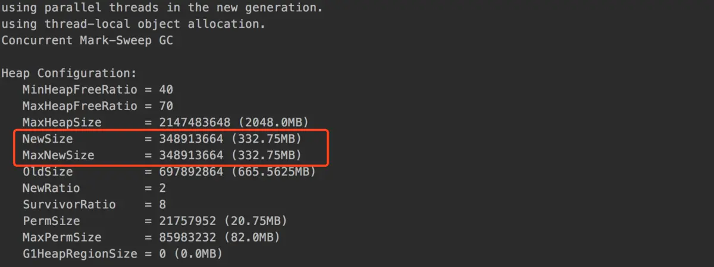

实际上新生代的内存是取两个值的较小值，其中一个是max_heap / (NewRatio+1)  =672M，另外一个公式比较复杂：

=young_gen_per_worker * parallel_gc_threads * 13 / 10  = 64M * 4 * 13 / 10 ＝ 332.8M 

young_gen_per_worker 和硬件有关，x86机器是64M；parallel_gc_threads和CPU核数有关。

所以在实际应用中，应该尽量显式设置YoungGen 的大小，最好还是通过 -XX:NewSize、-XX:MaxNewSize 或者 -xmn 参数设置下，免得遇到一些奇怪的 GC 

## GC优化

当Java程序性能达不到既定目标，且其他优化手段都已经穷尽时，通常需要调整垃圾回收器来进一步提高性能，称为GC优化。 

在进行GC优化之前，需要确认项目的架构和代码等已经没有优化空间。我们不能指望一个系统架构有缺陷或者代码层次优化没有穷尽的应用，通过GC优化令其性能达到一个质的飞跃。 虚拟机内部已有很多优化来保证应用的稳定运行，所以不要为了调优而调优，不当的调优可能适得其反。 

GC优化是一个系统而复杂的工作，没有万能的调优策略可以满足所有的性能指标。GC优化必须建立在我们深入理解各种垃圾回收器的基础上，才能有事半功倍的效果。 

### 基本策略

各分区的大小对GC的性能影响很大。如何将各分区调整到合适的大小，分析活跃数据的大小是很好的切入点。 

活跃数据的大小是指，应用程序稳定运行时长期存活对象在堆中占用的空间大小，也就是Full GC后堆中老年代占用空间的大小。可以通过GC日志中Full GC之后老年代数据大小得出，比较准确的方法是在程序稳定后，多次获取GC数据，通过取平均值的方式计算活跃数据的大小。活跃数据和各分区之间的比例关系如下：

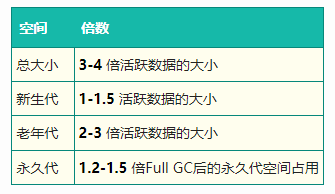

例如，根据GC日志获得老年代的活跃数据大小为300M，那么各分区大小可以设为： 

* 总堆：1200MB = 300MB × 4 
* 新生代：450MB = 300MB × 1.5 
* 老年代： 750MB = 1200MB - 450MB

这部分设置仅仅是堆大小的初始值，后面的优化中，可能会调整这些值，具体情况取决于应用程序的特性和需求。 

GC优化包括：

* 内存优化：设置堆内存、永久代、新生代和老年代的内存
* 延迟时间优化：主要关注MinorGC的持续时间、统计MinorGC的次数、FullGC的最差持续时间、最差情况下，FullGC的频率 
* 吞吐量调优：尽可能避免或者很少发生FullGC或者Stop-The-World压缩式垃圾收集（CMS） 、加大内存提升效率

在GC调优中，一个很重要的工具是GCViewer日志分析工具，它可以非常直观地分析出待调优点。可从以下几方面来分析： 

* Memory,分析Totalheap、Tenuredheap、Youngheap内存占用率及其他指标，理论上内存占用率越小越好；
* Pause，分析Gc pause、Fullgc pause、Total pause三个大项中各指标，理论上GC次数越少越好，GC时长越小越好；

### 优化步骤

GC优化一般步骤可以概括为：确定目标、优化参数、验收结果。 

1、确定目标

明确应用程序的系统需求是性能优化的基础，系统的需求是指应用程序运行时某方面的要求，譬如： - 高可用，可用性达到几个9。 - 低延迟，请求必须多少毫秒内完成响应。 - 高吞吐，每秒完成多少次事务。

明确系统需求之所以重要，是因为上述性能指标间可能冲突。比如通常情况下，缩小延迟的代价是降低吞吐量或者消耗更多的内存或者两者同时发生。

以关注高可用和低延迟为例，所以接下来分析，如何量化GC时间和频率对于响应时间和可用性的影响。通过这个量化指标，可以计算出当前GC情况对服务的影响，也能评估出GC优化后对响应时间的收益，这两点对于低延迟服务很重要。 

举例：假设单位时间T内发生一次持续25ms的GC，接口平均响应时间为50ms，且请求均匀到达，根据下图所示： 

那么有(50ms+25ms)/T比例的请求会受GC影响，其中GC前的50ms内到达的请求都会增加25ms，GC期间的25ms内到达的请求，会增加0-25ms不等，如果时间T内发生N次GC，受GC影响请求占比=(接口响应时间+GC时间)×N/T 。可见无论降低单次GC时间还是降低GC次数N都可以有效减少GC对响应时间的影响。

2、优化参数

通过收集GC信息（包括GC日志及dump文件），结合系统需求，确定优化方案，例如选用合适的GC回收器、重新设置内存比例、调整JVM参数等。

进行调整后，将不同的优化方案分别应用到多台机器上，然后比较这些机器上GC的性能差异，有针对性的做出选择，再通过不断的试验和观察，找到最合适的参数。

3、验收结果

将修改应用到所有服务器，判断优化结果是否符合预期，总结相关经验。 

### Major GC和Minor GC频繁

在本案例中，服务情况：Minor GC每分钟100次 ，Major GC每4分钟一次，单次Minor GC耗时25ms，单次Major GC耗时200ms，接口响应时间50ms。

由于这个服务要求低延时高可用，结合上文中提到的GC对服务响应时间的影响，计算可知由于Minor GC的发生，12.5%的请求响应时间会增加，其中8.3%的请求响应时间会增加25ms，可见当前GC情况对响应时间影响较大。

*（50ms+25ms）× 100次/60000ms = 12.5%，50ms × 100次/60000ms = 8.3%* 。

优化目标：降低TP99、TP90时间。

首先优化Minor GC频繁问题。通常情况下，由于新生代空间较小，Eden区很快被填满，就会导致频繁Minor GC，因此可以通过增大新生代空间来降低Minor GC的频率。例如在相同的内存分配率的前提下，新生代中的Eden区增加一倍，Minor GC的次数就会减少一半。 

这时很多人有这样的疑问，扩容Eden区虽然可以减少Minor GC的次数，但会增加单次Minor GC时间么？ 首先，单次Minor GC时间由以下两部分组成：T1（扫描新生代）和 T2（复制存活对象到Survivor区）如下图。 （这里为了简化问题，我们认为T1只扫描新生代判断对象是否存活的时间，其实该阶段还需要扫描部分老年代，后面案例中有详细描述。 ）

- 扩容前：新生代容量为R ，假设对象A的存活时间为750ms，Minor GC间隔500ms，那么本次Minor GC时间= T1（扫描新生代R）+T2（复制对象A到S）。
- 扩容后：新生代容量为2R ，对象A的生命周期为750ms，那么Minor GC间隔增加为1000ms，此时Minor GC对象A已不再存活，不需要把它复制到Survivor区，那么本次GC时间 = 2 × T1（扫描新生代R），没有T2复制时间。

可见，扩容后，Minor GC时增加了T1（扫描时间），但省去T2（复制对象）的时间，更重要的是对于虚拟机来说，复制对象的成本要远高于扫描成本，所以，单次Minor GC时间更多取决于GC后存活对象的数量，而非Eden区的大小。因此如果堆中短期对象很多，那么扩容新生代，单次Minor GC时间不会显著增加。下面需要确认下服务中对象的生命周期分布情况：

通过上图GC日志中两处红色框标记内容可知： 1. new threshold = 2（动态年龄判断，对象的晋升年龄阈值为2），对象仅经历2次Minor GC后就晋升到老年代，这样老年代会迅速被填满，直接导致了频繁的Major GC。 2. Major GC后老年代使用空间为300M+，意味着此时绝大多数(86% = 2G/2.3G)的对象已经不再存活，也就是说生命周期长的对象占比很小。 

由此可见，服务中存在大量短期临时对象，扩容新生代空间后，Minor GC频率降低，对象在新生代得到充分回收，只有生命周期长的对象才进入老年代。这样老年代增速变慢，Major GC频率自然也会降低。 

通过扩容新生代为为原来的三倍，单次Minor GC时间增加小于5ms，频率下降了60%，服务响应时间TP90，TP99都下降了10ms+，服务可用性得到提升。 

调整前后对比如下：

调整前：

调整后：

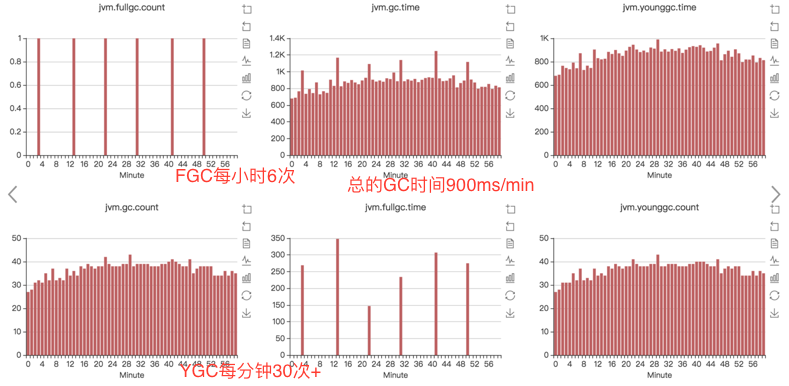

这个案例说明：选择各分区大小应该依赖应用程序中对象生命周期的分布情况：如果应用存在大量的短期对象，应该选择较大的年轻代；如果存在相对较多的持久对象，老年代应该适当增大。

### 请求高峰期发生GC

根据下面的GC日志显示，高峰期CMS在重标记（Remark）阶段耗时1.39s。Remark阶段是Stop-The-World（以下简称为STW）的，即在执行垃圾回收时，Java应用程序中除了垃圾回收器线程之外其他所有线程都被挂起，意味着在此期间，用户正常工作的线程全部被暂停下来，这是低延时服务不能接受的。本次优化目标是降低Remark时间。 

根据CMS收集过程的原理可知：堆中对象的数目影响了Remark阶段耗时。  分析GC日志可以得出同样的规律，Remark耗时>500ms时，新生代使用率都在75%以上。这样降低Remark阶段耗时问题转换成如何减少新生代对象数量。 

新生代中对象的特点是“朝生夕灭”，这样如果Remark前执行一次Minor GC，大部分对象就会被回收。CMS就采用了这样的方式，在Remark前增加了一个可中断的并发预清理（CMS-concurrent-abortable-preclean），该阶段主要工作仍然是并发标记对象是否存活，只是这个过程可被中断。此阶段在Eden区使用超过2M时启动，当然2M是默认的阈值，可以通过参数修改。如果此阶段执行时等到了Minor GC，那么上述灰色对象将被回收，Reamark阶段需要扫描的对象就少了。 

除此之外CMS为了避免这个阶段没有等到Minor GC而陷入无限等待，提供了参数CMSMaxAbortablePrecleanTime ，默认为5s，含义是如果可中断的预清理执行超过5s，不管发没发生Minor GC，都会中止此阶段，进入Remark。 根据GC日志红色标记2处显示，可中断的并发预清理执行了5.35s，超过了设置的5s被中断，期间没有等到Minor GC ，所以Remark时新生代中仍然有很多对象。 

对于这种情况，CMS提供CMSScavengeBeforeRemark参数，用来保证Remark前强制进行一次Minor GC。 

经过增加CMSScavengeBeforeRemark参数，单次执行时间>200ms的GC停顿消失，从监控上观察，GCtime和业务波动保持一致，不再有明显的毛刺：

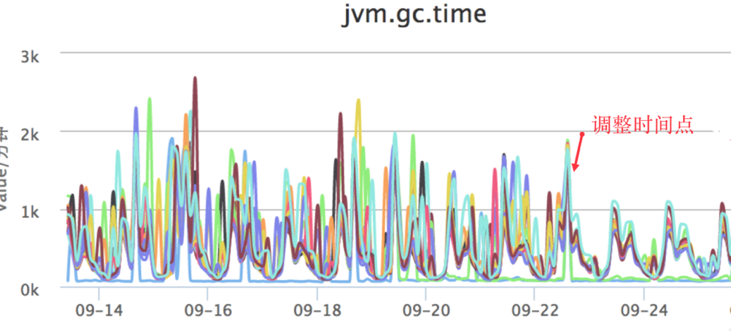

通过案例分析了解到，由于跨代引用的存在，CMS在Remark阶段必须扫描整个堆，同时为了避免扫描时新生代有很多对象，增加了可中断的预清理阶段用来等待Minor GC的发生。只是该阶段有时间限制，如果超时等不到Minor GC，Remark时新生代仍然有很多对象，我们的调优策略是，通过参数强制Remark前进行一次Minor GC，从而降低Remark阶段的时间。 

### 发生STW GC

GC日志如下图（在GC日志中，Full GC是用来说明这次垃圾回收的停顿类型，代表STW类型的GC，并不特指老年代GC），根据GC日志可知本次Full GC耗时1.23s。这个在线服务同样要求低时延高可用。本次优化目标是降低单次STW回收停顿时间，提高可用性。 

触发STW的Full GC的时机：

1. Perm空间不足； 
2. CMS GC时出现promotion failed和concurrent mode failure（concurrent mode failure发生的原因一般是CMS正在进行，但是由于老年代空间不足，需要尽快回收老年代里面的不再被使用的对象，这时停止所有的线程，同时终止CMS，直接进行Serial Old GC） 
3. 统计得到的Young GC晋升到老年代的平均大小大于老年代的剩余空间 
4. 主动触发Full GC（执行jmap -histo:live [pid]）来避免碎片问题。 

然后，我们来逐一分析一下： - 排除原因2：如果是原因2中两种情况，日志中会有特殊标识，目前没有。 - 排除原因3：根据GC日志，当时老年代使用量仅为20%，也不存在大于2G的大对象产生。 - 排除原因4：因为当时没有相关命令执行。 - 锁定原因1：根据日志发现Full GC后，Perm区变大了，推断是由于永久代空间不足容量扩展导致的。 

找到原因后解决方法有两种： 

        1. 通过把-XX:PermSize参数和-XX:MaxPermSize设置成一样，强制虚拟机在启动的时候就把永久代的容量固定下来，避免运行时自动扩容。 
        2. CMS默认情况下不会回收Perm区，通过参数CMSPermGenSweepingEnabled、CMSClassUnloadingEnabled ，可以让CMS在Perm区容量不足时对其回收。 

由于该服务没有生成大量动态类，回收Perm区收益不大，所以我们采用方案1，启动时将Perm区大小固定，避免进行动态扩容。 

调整参数后，服务不再有Perm区扩容导致的STW GC发生。 

总结：对于性能要求很高的服务，建议将MaxPermSize和MinPermSize设置成一致（JDK8开始，Perm区完全消失，转而使用元空间。而元空间是直接存在内存中，不在JVM中），Xms和Xmx也设置为相同，这样可以减少内存自动扩容和收缩带来的性能损失。虚拟机启动的时候就会把参数中所设定的内存全部化为私有，即使扩容前有一部分内存不会被用户代码用到，这部分内存在虚拟机中被标识为虚拟内存，也不会交给其他进程使用。 

# 监控工具

## 命令行工具

这些命令在 JDK 安装目录下的 bin 目录下：

* jps (JVM Process Status）: 类似 UNIX 的 ps 命令。用于查看所有 Java 进程的启动类、传入参数和 Java 虚拟机参数等信息；
* jstat（JVM Statistics Monitoring Tool）: 用于收集 HotSpot 虚拟机各方面的运行数据;
* jinfo (Configuration Info for Java) : Configuration Info for Java,显示虚拟机配置信息;
* jmap (Memory Map for Java) : 生成堆转储快照;
* jhat (JVM Heap Dump Browser) : 用于分析 heapdump 文件，它会建立一个 HTTP/HTML 服务器，让用户可以在浏览器上查看分析结果;
* jstack (Stack Trace for Java) : 生成虚拟机当前时刻的线程快照，线程快照就是当前虚拟机内每一条线程正在执行的方法堆栈的集合。

### jps: 查看所有 Java 进程

jps(JVM Process Status) 命令类似 UNIX 的 ps 命令。

jps：显示虚拟机执行主类名称以及这些进程的本地虚拟机唯一 ID（Local Virtual Machine Identifier,LVMID）。jps -q ：只输出进程的本地虚拟机唯一 ID。

~~~
C:\Users\SnailClimb>jps
7360 NettyClient2
17396
7972 Launcher
16504 Jps
17340 NettyServer
~~~

jps -l:输出主类的全名，如果进程执行的是 Jar 包，输出 Jar 路径。

~~~
C:\Users\SnailClimb>jps -l
7360 firstNettyDemo.NettyClient2
17396
7972 org.jetbrains.jps.cmdline.Launcher
16492 sun.tools.jps.Jps
17340 firstNettyDemo.NettyServer
~~~

jps -v：输出虚拟机进程启动时 JVM 参数。

jps -m：输出传递给 Java 进程 main() 函数的参数。

### jstat: 监视虚拟机信息

jstat（JVM Statistics Monitoring Tool） 使用于监视虚拟机各种运行状态信息的命令行工具。 它可以显示本地或者远程（需要远程主机提供 RMI 支持）虚拟机进程中的类信息、内存、垃圾收集、JIT 编译等运行数据，在没有 GUI，只提供了纯文本控制台环境的服务器上，它将是运行期间定位虚拟机性能问题的首选工具。 

jstat 命令使用格式：

~~~
jstat -<option> [-t] [-h<lines>] <vmid> [<interval> [<count>]]
~~~

比如 jstat -gc -h3 31736 1000 10表示分析进程 id 为 31736 的 gc 情况，每隔 1000ms 打印一次记录，打印 10 次停止，每 3 行后打印指标头部。

常见的 option 如下：

* jstat -class vmid ：显示 ClassLoader 的相关信息；
* jstat -compiler vmid ：显示 JIT 编译的相关信息；
* jstat -gc vmid ：显示与 GC 相关的堆信息；
* jstat -gccapacity vmid ：显示各个代的容量及使用情况；
* jstat -gcnew vmid ：显示新生代信息；
* jstat -gcnewcapcacity vmid ：显示新生代大小与使用情况；
* jstat -gcold vmid ：显示老年代和永久代的行为统计，从jdk1.8开始,该选项仅表示老年代，因为永久代被移除了；
* jstat -gcoldcapacity vmid ：显示老年代的大小；
* jstat -gcpermcapacity vmid ：显示永久代大小，从jdk1.8开始,该选项不存在了，因为永久代被移除了；
* jstat -gcutil vmid ：显示垃圾收集信息；

另外，加上 -t参数可以在输出信息上加一个 Timestamp 列，显示程序的运行时间。

### jinfo: 实时地查看和调整虚拟机各项参数

jinfo vmid :输出当前 jvm 进程的全部参数和系统属性 (第一部分是系统的属性，第二部分是 JVM 的参数)。

jinfo -flag name vmid :输出对应名称的参数的具体值。比如输出 MaxHeapSize、查看当前 jvm 进程是否开启打印 GC 日志 ( -XX:PrintGCDetails :详细 GC 日志模式，这两个都是默认关闭的)。

~~~
C:\Users\SnailClimb>jinfo  -flag MaxHeapSize 17340
-XX:MaxHeapSize=2124414976
C:\Users\SnailClimb>jinfo  -flag PrintGC 17340
-XX:-PrintGC
~~~

使用 jinfo 可以在不重启虚拟机的情况下，可以动态的修改 jvm 的参数。尤其在线上的环境特别有用,请看下面的例子： 

jinfo -flag [+|-]name vmid 开启或者关闭对应名称的参数。

~~~
C:\Users\SnailClimb>jinfo  -flag  PrintGC 17340
-XX:-PrintGC

C:\Users\SnailClimb>jinfo  -flag  +PrintGC 17340

C:\Users\SnailClimb>jinfo  -flag  PrintGC 17340
-XX:+PrintGC
~~~

### jmap:生成堆转储快照

jmap（Memory Map for Java）命令用于生成堆转储快照。 如果不使用 jmap 命令，要想获取 Java 堆转储，可以使用 “-XX:+HeapDumpOnOutOfMemoryError” 参数，可以让虚拟机在 OOM 异常出现之后自动生成 dump 文件，Linux 命令下可以通过 kill -3 发送进程退出信号也能拿到 dump 文件。

jmap 的作用并不仅仅是为了获取 dump 文件，它还可以查询 finalizer 执行队列、Java 堆和永久代的详细信息，如空间使用率、当前使用的是哪种收集器等。和jinfo一样，jmap有不少功能在 Windows 平台下也是受限制的。

示例：将指定应用程序的堆快照输出到桌面。后面，可以通过 jhat、Visual VM 等工具分析该堆文件。 

~~~
C:\Users\SnailClimb>jmap -dump:format=b,file=C:\Users\SnailClimb\Desktop\heap.hprof 17340
Dumping heap to C:\Users\SnailClimb\Desktop\heap.hprof ...
Heap dump file created
~~~

### jhat: 分析 heapdump 文件

jhat 用于分析 heapdump 文件，它会建立一个 HTTP/HTML 服务器，让用户可以在浏览器上查看分析结果：

~~~
C:\Users\SnailClimb>jhat C:\Users\SnailClimb\Desktop\heap.hprof
Reading from C:\Users\SnailClimb\Desktop\heap.hprof...
Dump file created Sat May 04 12:30:31 CST 2019
Snapshot read, resolving...
Resolving 131419 objects...
Chasing references, expect 26 dots..........................
Eliminating duplicate references..........................
Snapshot resolved.
Started HTTP server on port 7000
Server is ready.
~~~

然后访问 http://localhost:7000/即可

### jstack :生成虚拟机线程快照

jstack（Stack Trace for Java）命令用于生成虚拟机当前时刻的线程快照。线程快照就是当前虚拟机内每一条线程正在执行的方法堆栈的集合.

生成线程快照的目的主要是定位线程长时间出现停顿的原因，如线程间死锁、死循环、请求外部资源导致的长时间等待等都是导致线程长时间停顿的原因。线程出现停顿的时候通过jstack来查看各个线程的调用堆栈，就可以知道没有响应的线程到底在后台做些什么事情，或者在等待些什么资源。

下面是一个线程死锁的代码。我们下面会通过 jstack 命令进行死锁检查，输出死锁信息，找到发生死锁的线程。

~~~java
public class DeadLockDemo {
    private static Object resource1 = new Object();//资源 1
    private static Object resource2 = new Object();//资源 2

    public static void main(String[] args) {
        new Thread(() -> {
            synchronized (resource1) {
                System.out.println(Thread.currentThread() + "get resource1");
                try {
                    Thread.sleep(1000);
                } catch (InterruptedException e) {
                    e.printStackTrace();
                }
                System.out.println(Thread.currentThread() + "waiting get resource2");
                synchronized (resource2) {
                    System.out.println(Thread.currentThread() + "get resource2");
                }
            }
        }, "线程 1").start();

        new Thread(() -> {
            synchronized (resource2) {
                System.out.println(Thread.currentThread() + "get resource2");
                try {
                    Thread.sleep(1000);
                } catch (InterruptedException e) {
                    e.printStackTrace();
                }
                System.out.println(Thread.currentThread() + "waiting get resource1");
                synchronized (resource1) {
                    System.out.println(Thread.currentThread() + "get resource1");
                }
            }
        }, "线程 2").start();
    }
}
~~~

Output：

~~~
Thread[线程 1,5,main]get resource1
Thread[线程 2,5,main]get resource2
Thread[线程 1,5,main]waiting get resource2
Thread[线程 2,5,main]waiting get resource1
~~~

线程 A 通过 synchronized (resource1) 获得 resource1 的监视器锁，然后通过 Thread.sleep(1000);让线程 A 休眠 1s 为的是让线程 B 得到执行然后获取到 resource2 的监视器锁。线程 A 和线程 B 休眠结束了都开始企图请求获取对方的资源，然后这两个线程就会陷入互相等待的状态，这也就产生了死锁。

通过 jstack 命令分析：

~~~
C:\Users\SnailClimb>jps
13792 KotlinCompileDaemon
7360 NettyClient2
17396
7972 Launcher
8932 Launcher
9256 DeadLockDemo
10764 Jps
17340 NettyServer

C:\Users\SnailClimb>jstack 9256
~~~

输出的部分内容如下： 

~~~
Found one Java-level deadlock:
=============================
"线程 2":
  waiting to lock monitor 0x000000000333e668 (object 0x00000000d5efe1c0, a java.lang.Object),
  which is held by "线程 1"
"线程 1":
  waiting to lock monitor 0x000000000333be88 (object 0x00000000d5efe1d0, a java.lang.Object),
  which is held by "线程 2"

Java stack information for the threads listed above:
===================================================
"线程 2":
        at DeadLockDemo.lambda$main$1(DeadLockDemo.java:31)
        - waiting to lock <0x00000000d5efe1c0> (a java.lang.Object)
        - locked <0x00000000d5efe1d0> (a java.lang.Object)
        at DeadLockDemo$$Lambda$2/1078694789.run(Unknown Source)
        at java.lang.Thread.run(Thread.java:748)
"线程 1":
        at DeadLockDemo.lambda$main$0(DeadLockDemo.java:16)
        - waiting to lock <0x00000000d5efe1d0> (a java.lang.Object)
        - locked <0x00000000d5efe1c0> (a java.lang.Object)
        at DeadLockDemo$$Lambda$1/1324119927.run(Unknown Source)
        at java.lang.Thread.run(Thread.java:748)

Found 1 deadlock.
~~~

可以看到 jstack 命令已经帮我们找到发生死锁的线程的具体信息。

## JDK可视化工具

### JConsole

JConsole 是基于 JMX 的可视化监视、管理工具。可以很方便的监视本地及远程服务器的 java 进程的内存使用情况。你可以在控制台输出console命令启动或者在 JDK 目录下的 bin 目录找到jconsole.exe然后双击启动。

如果需要使用 JConsole 连接远程进程，可以在远程 Java 程序启动时加上下面这些参数: 

~~~
-Djava.rmi.server.hostname=外网访问 ip 地址 
-Dcom.sun.management.jmxremote.port=60001   //监控的端口号
-Dcom.sun.management.jmxremote.authenticate=false   //关闭认证
-Dcom.sun.management.jmxremote.ssl=false
~~~

在使用 JConsole 连接时，远程进程地址如下： 

~~~
外网访问 ip 地址:60001 
~~~

用JConsole可以查看 Java 程序概况：

JConsole 可以显示当前内存的详细信息。不仅包括堆内存/非堆内存的整体信息，还可以细化到 eden 区、survivor 区等的使用情况。点击右边的“执行 GC(G)”按钮可以强制应用程序执行一个 Full GC：

* 新生代 GC（Minor GC）:指发生新生代的的垃圾收集动作，Minor GC 非常频繁，回收速度一般也比较快。
* 老年代 GC（Major GC/Full GC）:指发生在老年代的 GC，出现了 Major GC 经常会伴随至少一次的 Minor GC（并非绝对），Major GC 的速度一般会比 Minor GC 的慢 10 倍以上。

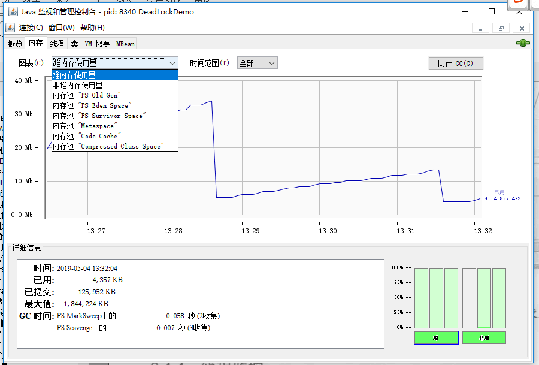

还可以进行线程监控，类似于jstack，不过这个是可视化的。最下面有一个"检测死锁 (D)"按钮，点击这个按钮可以自动为你找到发生死锁的线程以及它们的详细信息：

###Visual VM

VisualVM 提供在 Java 虚拟机 (Java Virutal Machine, JVM) 上运行的 Java 应用程序的详细信息。在 VisualVM 的图形用户界面中，您可以方便、快捷地查看多个 Java 应用程序的相关信息。Visual VM 官网：https://visualvm.github.io/ 。Visual VM 中文文档:https://visualvm.github.io/documentation.html。

VisualVM（All-in-One Java Troubleshooting Tool）是到目前为止随 JDK 发布的功能最强大的运行监视和故障处理程序，官方在 VisualVM 的软件说明中写上了“All-in-One”的描述字样，预示着他除了运行监视、故障处理外，还提供了很多其他方面的功能，如性能分析（Profiling）。VisualVM 的性能分析功能甚至比起 JProfiler、YourKit 等专业且收费的 Profiling 工具都不会逊色多少，而且 VisualVM 还有一个很大的优点：不需要被监视的程序基于特殊 Agent 运行，因此他对应用程序的实际性能的影响很小，使得他可以直接应用在生产环境中。这个优点是 JProfiler、YourKit 等工具无法与之媲美的。 

VisualVM 基于 NetBeans 平台开发，因此他一开始就具备了插件扩展功能的特性，通过插件扩展支持，VisualVM 可以做到： 

* 显示虚拟机进程以及进程的配置、环境信息（jps、jinfo）。
* 监视应用程序的 CPU、GC、堆、方法区以及线程的信息（jstat、jstack）。
* dump 以及分析堆转储快照（jmap、jhat）。
* 方法级的程序运行性能分析，找到被调用最多、运行时间最长的方法。
* 离线程序快照：收集程序的运行时配置、线程 dump、内存 dump 等信息建立一个快照，可以将快照发送开发者处进行 Bug 反馈。
* 其他 plugins 的无限的可能性......

# 补充

1、CMS收集器

CMS配合的新生代垃圾回收器是ParNew

CMS四大阶段中，初始标记和重新标记阶段是会停止工作线程的。最耗时的并发标记和并发清除阶段不需要暂停工作，所以整体的回收是低停顿的。

在重新标记阶段CMS只监控了对象的新增，这是为了避免这些新增的对象被删除，而不监控对象的删除。

concurrent mode failure是CMS收集器特有的错误，代表老年代的空间不足以容纳应用新产生的对象。如果CMS运行失败，则虚拟机启动兜底方案：临时启用Serial Old收集器来进行老年代的垃圾收集，停止所有应用线程，它采用的是标记-整理算法，对内存中的碎片进行整理

可能原因和方案：

- CMS触发太晚，可以将触发阈值调小
- 内存碎片太多，可以开启空间碎片整理（大对象无法分配会发起Full GC，在执行完后再对内存空间进行压缩整理，这个阶段是无法并行的），调整一个合适的整理周期，不要等到分配不了再去Full GC
- 垃圾产生速度超过清理速度，例如有大对象，新生代太小等情况

CMS回收垃圾时，用户线程并没有暂停，所以不能等到老年代几乎完全满了再开始工作，而是内存使用率到达一定阈值时就开始进行回收。这个内存阈值是可以调整的，CMS只有到达这个内存百分比了才会触发Major GC，内存阈值不能设置的太低，否则会偏保守；太高可能又会导致出现concurrent mode failure

因为CMS是基于标记-清理的，所以大量的内存碎片会导致提前触发Full GC，为了解决这个问题，jdk8默认是开启合并开关的，即当不得不进行Full GC的时候（因内存碎片的存在导致大对象无法分配）开启内存碎片的整理过程，它是无法并发的，另外还提供了一个参数，可以设置经历N次不整理空间的Full GC之后，下一次进入Full GC前会先进行碎片整理，这个N值默认是0，可以调高。

CMS的弊端中有一个是：对CPU资源敏感，因为并发阶段它虽然不会暂停用户线程，但是会因为占用了一部分线程，导致用户程序的总吞吐量变低

2、G1收集器

G1最大的特点就是建立可预测的停顿时间模型。

为了实现这个目标，G1将堆分为多个大小相等的region，每个region都可以根据需要扮演新生代的eden空间、survivor空间或者老年代空间，并且专门设置了一个区域存放大对象，G1就能根据各region的类型不同采用不同的策略进行收集。每次回收时以region为单位进行回收，在运行过程中去统计每个region回收后所获得的空间大小，维护一个优先级列表，优先处理回收价值最大的那些region，保证在有限的时间内获取尽可能高的收集效率。

对比CMS的优点：

- 建立可预测的停顿时间模型
- 它从整体上看是基于标记-整理算法的，从两个region之间看又是基于标记-复制算法的，它们都不会产生内存碎片

对比CMS的缺点：在可用内存较少的时候CMS的表现更好，因为G1为了维护跨region引用对象的关系，需要耗费大约10-20%的额外内存，而且执行负载也较高

3、常见的JVM参数：

- 堆内存相关：如最小和最大堆大小、新生代内存大小、老年代与新生代内存的比值、永久代的大小、元空间触发Full GC的阈值、eden/survivor 空间的比例
- 指定不同种类的垃圾回收器、GC日志打印选项，输出路径、打印内容等
- 指定OOM后将dump文件存储在一个路径

4、到底是采用指针碰撞分配对象，还是采用空闲列表方式分配对象，取决于堆是否是规整的，而堆是否规整取决于回收算法是怎样的，一般来说基于标记-整理算法回收，堆就是规整的；若是基于标记-清除回收，它就是不规整的。

5、如果对象是一个数组，那么对象头中还必须有一块用于记录数组长度的数据。

6、之所以Eden区和Survivor区的大小比例是8:1，是因为绝大多数对象都熬不过第一轮收集，所以被拷贝到Survivor区的对象是很少的，Survivor区不必设计的很大。即使Survivor区不够，也可以让老年代进行分配担保。

7、大对象直接进入老年代的理由：避免在Eden区和Survivor区之间来回复制。

8、分配担保：

在Minor GC之前，虚拟机必须先检查老年代最大可用连续空间是否大于新生代所有对象总空间，若大于则代表这一次Minor GC是安全的（最极端的情况就是所有对象都存活，此时Survivor空间肯定是不够的）。如果不成立就先查看是否允许担保失败，如果允许则会继续检查老年代最大可用连续空间是否大于历次晋升到老年代对象的平均大小，若大于则尝试一次Minor GC，如果小于，或者不允许冒险，则要进行一次Full GC。如果出现了担保失败，内存空间不够，则只能再进行一次Full GC。为了避免Full GC过于频繁，一般是开启允许担保失败的开关的。

9、垃圾回收时，如何让线程都跑到离它最近的安全点并且停顿下来，有两种方案：

- 抢占式中断：垃圾收集发生时，系统先把所有用户线程全部中断，然后如果发现有线程中断在不安全点上，就恢复这条线程执行，让他跑到安全点上。几乎没有虚拟机会采用该方案
- 主动式中断：需要中断线程的时候设置一个标志位，各线程去检查这个标志位，一旦发现标志为真就自己在最近的安全点上中断挂起

10、卡表是记忆集的一种实现，它是用于记录从非收集区指向收集区的信息集合

11、类加载

加载时机：调用一个类的静态方法的时候，也会加载这个类

加载类的时候，类的二进制字节流可以从多种地方获取：

- 从压缩包中获取，它就是JAR、WAR格式的基础
- 从网络中获取
- 运行时动态计算生成，如动态代理技术
- 由其他文件生成，如从JSP文件生成class文件
- 从数据库中读取
- 从加密文件中读取，可以防止反编译

加载类的时候，在初始化步骤会指向clinit方法，它是由所有类变量的赋值动作和静态代码块组合而成的。虚拟机保证总是父类的clinit方法先执行完，然后再执行子类的clinit。

12、双亲委派模型的缺陷：基础类型的加载器无法调用回用户的代码。简单的树状加载结构满足不了复杂的功能要求，如java模块化，模块化就是代码热替换、模块热部署，无需重新启动程序就能加载新的功能。

13、GC root有哪些？

- 虚拟机栈、本地方法栈中引用的对象
- 方法区中类静态属性引用的对象
- 方法区中常量引用的对象
- 所有被同步锁持有的对象

14、发生Full GC的时机：

- 老年代满了
- 分配担保发现老年代连续空间不够，或者禁止分配担保时
- 1.7前方法区满了

15、一个对象引用的大小：一般是4字节。它就是一个指针，指向对象的地址，表示地址一般在32位操作系统中需要32位，也就是4字节；在64位操作系统中需要64位，也就是8字节；在Java中情况比较特殊，当堆大小小于等于32G时，是4字节（Java压缩指针，其实一个指针是4字节）

一个对象的大小：

- 对象头：Mark Word（32位虚拟机占32位、64位虚拟机占64位）、类元指针（应该和引用一样）、如果是数组还要有数组长度（4字节）
- 实例数据
- 对齐填充：任何对象的大小都必须是8字节的整数倍

一个数组int[10]在JVM的内存：64（Mark Word） + 32 类元指针 + 数组长度8字节 + 实例数据（10个4字节）= 60字节

16、Hotspot中jdk1.6到jdk1.7的变化

把永久代中的字符串常量池和静态变量移除，保存在堆中。永久代中剩余内容是类型信息、方法信息、JIT代码缓存、运行时常量池

17、程序计数器什么时候为空？

如果线程正在执行一个 Java 方法，这个计数器记录的是正在执行的虚拟机字节码指令的地址；
如果正在执行的是 Native 方法，这个计数器的值则为空 (Undefined)

18、JDK版本和垃圾回收器

JDK1.5及以前：Parallel Scavenge + Serial Old

JDK8：Parallel Scavenge收集器和Parallel Old收集器

JDK9：G1回收器

垃圾回收器选择原则：先说调整垃圾回收器在绝大多数情况下是没有必要的，因为优化应用层，优化框架层大多数情况下已经足够，再说默认垃圾回收器，然后说下各种特点

19、三色标记法：它是可达性分析中用来标记对象的

会把垃圾收集器访问过的对象分为三种颜色：

- 白色：表示对象尚未被垃圾收集器访问过。在可达性分析刚开始的时候所有对象都是白色的，在分析结束的阶段，白色的对象代表不可达
- 黑色：表示对象已经被垃圾收集器访问过，且这个对象的所有引用都已经扫描过。它代表安全存活的对象，因为它的所有引用都是已经扫描过的，所以黑色对象不可能直接指向某个白色对象，必须途径灰色对象
- 灰色：表示对象已经被垃圾收集器访问过，但是这个对象至少还存在一个引用还没有被扫描过

可达性分析其实就是从黑向白推进的过程，最终所有的对象非黑即白

如果用户线程和收集器并发工作，那么在可达性分析的时候，对象之间的引用关系是可能发生变化的，这可能会出现两个后果：

- 本来应该被回收的对象，重新标记为存活。这个结果其实是可以容忍的，只不过产生了本次收集不到的浮动垃圾而已
- 本来应该存活的对象，误标记为已死亡。这个结果是非常致命的，程序可能因此发生错误

设想这样一种场景：本来A引用B，B引用C，A变成黑色后，要继续扫描B，再扫描C，将三者都标记为黑色。但是在A为黑色对象，B为灰色对象，C为白色对象时，用户线程对引用关系做了一点修改：变成了A引用C，A引用B，B不再引用C了。但是此时A已经是黑色了，所以不会重复扫描，B也不再持有C的引用，导致分析结束时C还是白色对象，C被误清理了。

当且仅当以下两个条件同时满足时，会发生误删除的问题：

- 工作线程增加了一条或多条从黑色到白色对象的新引用
- 工作线程删除了全部灰色对象到该白色对象的直接或者间接引用

要解决误删除问题，只需要破坏这两个条件其中之一即可：

- 增量更新法：当新增黑色对象到白色对象的引用时，记录该新增引用，在重新标记阶段取出该新引用，以黑色对象为根再重新扫描一次；CMS就是基于这种方法来做并发标记的
- 原始快照法：当灰色对象删除指向白色对象的引用时，记录下该删除的引用，在重新标记阶段再取出该引用，以灰色对象为根再扫描一次，也即按照刚刚的快照扫描；G1就是用这种方法做并发标记的