# 入门

使用数组存储对象存在一定的弊端，例如不能自动扩容

Java 集合， 也叫作容器，主要是由两大接口派生而来： 

* 一个是 Collection接口，主要用于存放单一元素。
* 另一个是 Map 接口，主要用于存放键值对。下面又有三个主要的子接口：List、Set 和 Queue

Java 集合类继承派生关系如下（并没有列举所有关系，省略了AbstractList，NavigableSet等抽象类以及其他的一些辅助类） ：

## 底层数据结构总结

List：

* ArrayList： Object[] 数组
* Vector：Object[] 数组
* LinkedList： 双向链表(JDK1.6 之前为循环链表，JDK1.7 取消了循环)

Set：

* HashSet(无序，唯一): 基于 HashMap 实现的，底层采用 HashMap 来保存元素
* LinkedHashSet: LinkedHashSet 是 HashSet 的子类，并且其内部是通过 LinkedHashMap 来实现的。LinkedHashMap 其内部是基于 HashMap 实现
* TreeSet(有序，唯一): 红黑树(自平衡的排序二叉树)

Queue：

* PriorityQueue: Object[] 数组来实现二叉堆
* ArrayQueue: Object[] 数组 + 双指针

Map：

* HashMap： JDK1.8 之前 HashMap 由数组+链表组成的，数组是 HashMap 的主体，链表则是主要为了解决哈希冲突而存在的（“拉链法”解决冲突）。JDK1.8 以后在解决哈希冲突时有了较大的变化，当链表长度大于阈值（默认为 8）（将链表转换成红黑树前会判断，如果当前数组的长度小于 64，那么会选择先进行数组扩容，而不是转换为红黑树）时，将链表转化为红黑树，以减少搜索时间
* LinkedHashMap： LinkedHashMap 继承自 HashMap，所以它的底层仍然是基于拉链式散列结构即由数组和链表或红黑树组成。另外，LinkedHashMap 在上面结构的基础上，增加了一条双向链表，使得上面的结构可以保持键值对的插入顺序。同时通过对链表进行相应的操作，实现了访问顺序相关逻辑。用于保证元素的插入和取出顺序满足 FIFO 的场景 
* Hashtable： 数组+链表组成的，数组是 Hashtable 的主体，链表则是主要为了解决哈希冲突而存在的
* TreeMap： 红黑树（自平衡的排序二叉树）

## List

### ArrayList 和 Vector 的区别

* ArrayList 是 List 的主要实现类，底层使用 Object[ ]存储，适用于频繁的查找工作，线程不安全 ；
* Vector 是 List 的古老实现类，底层使用Object[ ] 存储，线程安全的。

### ArrayList 与 LinkedList 区别

* 两者都是不能保证线程安全的

* 底层数据结构：ArrayList 底层使用的是 Object 数组；LinkedList 底层使用的是 双向链表 数据结构（JDK1.6 之前为循环链表，JDK1.7 取消了循环。）

* 插入删除元素时：对ArrayList，因为采用数组存储，将元素追加到列表末尾，复杂度是O1，如果要在指定位置i插入和删除元素，时间复杂度就是On-i，因为在进行上述操作的时候集合中第 i 和第 i 个元素之后的(n-i)个元素都要执行向后位/向前移一位的操作。 

  对LInkedList，因为采用链表存储，所以在头尾插入或删除元素时间复杂度是O1，如果要在指定位置i插入和删除元素，时间复杂度就是Oi，因为需要先移动到指定位置再插入 

* 快速随机访问：LinkedList 不支持高效的随机元素访问，而 ArrayList 支持。快速随机访问就是通过元素的序号快速获取元素对象(对应于get(int index)方法)。

* 内存空间占用：ArrayList 的空 间浪费主要体现在在 list 列表的结尾会预留一定的容量空间，而 LinkedList 的空间花费则体现在它的每一个元素都需要消耗比 ArrayList 更多的空间（因为要存放直接后继和直接前驱以及数据）

需要用到 LinkedList 的场景几乎都可以使用 ArrayList 来代替，并且，性能通常会更好

双向链表和双向循环链表顶的区别：

* 双向链表：包含两个指针，一个 prev 指向前一个节点，一个 next 指向后一个节点。 

  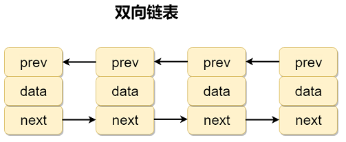

* 双向循环链表：在双向链表的基础上，最后一个节点的 next 指向 head，而 head 的 prev 指向最后一个节点，构成一个环。 

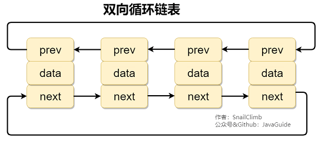

### RandomAccess接口

RandomAccess接口是一个标识接口，代表实现这个接口的类具有随机访问功能。

在 binarySearch（) 方法中，它要判断传入的 list 是否 RandomAccess 的实例，如果是，调用indexedBinarySearch()方法，如果不是，那么调用iteratorBinarySearch()方法

## Set

### Comparable 和 Comparator 的区别

两者都是用来排序的：

* 要对集合元素实现排序时，可以让元素实现Comparable接口，重写compareTo方法
* 可以在执行排序方法时，例如Collections.sort，传入一个排序器，这个排序器实现了Comparator接口，重写了compare方法

## Queue

### Queue 与 Deque 的区别

Queue 是单端队列，只能从一端插入元素，另一端删除元素，实现上一般遵循 先进先出（FIFO） 规则。

Deque 是双端队列，在队列的两端均可以插入或删除元素。Deque 还提供有 push() 和 pop() 等其他方法，可用于模拟栈。

两者因为容量问题而导致操作失败后处理方式的不同 可以分为两类方法: 一种在操作失败后会抛出异常，另一种则会返回特殊值。

| Queue 接口 | 抛出异常      | 返回特殊值      |
| -------- | --------- | ---------- |
| 插入队尾     | add(E e)  | offer(E e) |
| 删除队首     | remove()  | poll()     |
| 查询队首元素   | element() | peek()     |

| Deque 接口 | 抛出异常          | 返回特殊值           |
| -------- | ------------- | --------------- |
| 插入队首     | addFirst(E e) | offerFirst(E e) |
| 插入队尾     | addLast(E e)  | offerLast(E e)  |
| 删除队首     | removeFirst() | pollFirst()     |
| 删除队尾     | removeLast()  | pollLast()      |
| 查询队首元素   | getFirst()    | peekFirst()     |
| 查询队尾元素   | getLast()     | peekLast()      |

### ArrayDeque 与 LinkedList 的区别

ArrayDeque 和 LinkedList 都实现了 Deque 接口，两者都具有队列的功能，两者的区别：

* ArrayDeque 是基于可变长的数组和双指针来实现，而 LinkedList 则通过链表来实现。
* ArrayDeque 不支持存储 NULL 数据，但 LinkedList 支持。
* ArrayDeque 是在 JDK1.6 才被引入的，而LinkedList 早在 JDK1.2 时就已经存在。
* ArrayDeque 插入时可能存在扩容过程, 不过均摊后的插入操作依然为 O(1)。虽然 LinkedList 不需要扩容，但是每次插入数据时均需要申请新的堆空间，均摊性能相比更慢。

从性能的角度上，选用 ArrayDeque 来实现队列要比 LinkedList 更好。此外，ArrayDeque 也可以用于实现栈。

### PriorityQueue

PriorityQueue 是在 JDK1.5 中被引入的, 其与 Queue 的区别在于元素出队顺序是与优先级相关的，即总是优先级最高的元素先出队。

底层数据结构：PriorityQueue 利用了二叉堆的数据结构来实现的，底层使用可变长的数组来存储数据。PriorityQueue 通过堆元素的上浮和下沉，实现了在 O(logn) 的时间复杂度内插入元素和删除堆顶元素。

PriorityQueue 是非线程安全的，且不支持存储 NULL 。

PriorityQueue 默认是小顶堆，但可以接收一个 Comparator 作为构造参数，从而来自定义元素优先级的先后。

## Map

### HashMap 和 Hashtable 的区别

* 线程是否安全：HashMap 是非线程安全的，Hashtable 是线程安全的,因为 Hashtable 内部的方法基本都经过synchronized 修饰。

* 效率：因为线程安全的问题，HashMap 要比 Hashtable 效率高一点。另外，Hashtable 基本被淘汰，不要在代码中使用它；

* 对 Null key 和 Null value 的支持： HashMap 可以存储 null 的 key 和 value，但 null 作为键只能有一个，null 作为值可以有多个；Hashtable 不允许有 null 键和 null 值，否则会抛出 NullPointerException

* 初始化容量和扩充：

  Hashtable 默认的初始大小为 11，之后每次扩充，容量变为原来的 2n+1。创建时如果给定了容量初始值，那么 Hashtable 会直接使用你给定的大小

  HashMap 默认的初始化大小为 16。之后每次扩充，容量变为原来的 2 倍。创建时如果给定了容量初始值，HashMap 会将其扩充为 2 的幂次方大小（HashMap 中的tableSizeFor()方法保证），也就是说 HashMap 总是使用 2 的幂作为哈希表的大小

* 底层数据结构不同

HashMap 中带有初始容量的构造函数：

~~~java
public HashMap(int initialCapacity, float loadFactor) {
        if (initialCapacity < 0)
            throw new IllegalArgumentException("Illegal initial capacity: " +
                                               initialCapacity);
        if (initialCapacity > MAXIMUM_CAPACITY)
            initialCapacity = MAXIMUM_CAPACITY;
        if (loadFactor <= 0 || Float.isNaN(loadFactor))
            throw new IllegalArgumentException("Illegal load factor: " +
                                               loadFactor);
        this.loadFactor = loadFactor;
        this.threshold = tableSizeFor(initialCapacity);
    }
     public HashMap(int initialCapacity) {
        this(initialCapacity, DEFAULT_LOAD_FACTOR);
    }
~~~

下面这个方法保证了 HashMap 总是使用 2 的幂作为哈希表的大小：

~~~java
 /**
     * Returns a power of two size for the given target capacity.
     */
    static final int tableSizeFor(int cap) {
        int n = cap - 1;
        n |= n >>> 1;
        n |= n >>> 2;
        n |= n >>> 4;
        n |= n >>> 8;
        n |= n >>> 16;
        return (n < 0) ? 1 : (n >= MAXIMUM_CAPACITY) ? MAXIMUM_CAPACITY : n + 1;
    }
~~~

### HashMap 和 HashSet 区别

HashSet 底层就是基于 HashMap 实现的。HashSet 的源码非常非常少，因为除了 clone()、writeObject()、readObject()是 HashSet 自己不得不实现之外，其他方法都是直接调用 HashMap 中的方法。

|            `HashMap`            |                `HashSet`                 |
| :-----------------------------: | :--------------------------------------: |
|          实现了 `Map` 接口           |               实现 `Set` 接口                |
|              存储键值对              |                  仅存储对象                   |
|      调用 `put()`向 map 中添加元素      |        调用 `add()`方法向 `Set` 中添加元素         |
| `HashMap` 使用键（Key）计算 `hashcode` | `HashSet` 使用成员对象来计算 `hashcode` 值，对于两个对象来说 `hashcode` 可能相同，所以`equals()`方法用来判断对象的相等性 |

### HashMap 和 TreeMap 区别

TreeMap 和HashMap 都继承自AbstractMap ，TreeMap 主要多了对集合中的元素根据键排序的能力以及对集合内元素的搜索的能力

需要注意的是TreeMap它还实现了NavigableMap接口和SortedMap 接口：

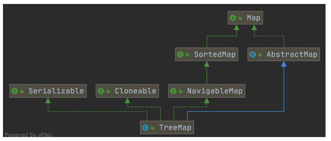

实现 NavigableMap 接口让 TreeMap 有了对集合内元素的搜索的能力。

实现SortedMap接口让 TreeMap 有了对集合中的元素根据键排序的能力。

TreeMap默认是按 key 的升序排序，不过我们也可以指定排序的比较器：

~~~java
TreeMap<Person, String> treeMap = new TreeMap<>(new Comparator<Person>() {
            @Override
            public int compare(Person person1, Person person2) {
                int num = person1.getAge() - person2.getAge();
                return Integer.compare(num, 0);
            }
        });
~~~

### HashMap  hash方法

HashMap 通过 key 的 hashcode 经过扰动函数处理过后得到 hash 值，然后通过 (n - 1) & hash 判断当前元素存放的位置（这里的 n 指的是数组的长度），如果当前位置存在元素的话，就判断该元素与要存入的元素的 hash 值以及 key 是否相同，如果相同的话，直接覆盖，不相同就解决冲突：

* 1.8前拉链法
* 1.8后当链表长度大于阈值（默认为 8）（将链表转换成红黑树前会判断，如果当前数组的长度小于 64，那么会选择先进行数组扩容，而不是转换为红黑树）时，将链表转化为红黑树，以减少搜索时间。 红黑树就是为了解决二叉查找树的缺陷，因为二叉查找树在某些情况下会退化成一个线性结构。 

所谓扰动函数指的就是 HashMap 的 hash 方法。使用 hash 方法也就是扰动函数是为了防止一些实现比较差的 hashCode() 方法 换句话说使用扰动函数之后可以减少碰撞。

DK 1.8 的 hash 方法 相比于 JDK 1.7 hash 方法更加简化，但是原理不变：

~~~java
    static final int hash(Object key) {
      int h;
      // key.hashCode()：返回散列值也就是hashcode
      // ^ ：按位异或
      // >>>:无符号右移，忽略符号位，空位都以0补齐
      return (key == null) ? 0 : (h = key.hashCode()) ^ (h >>> 16);
  }
~~~

对比一下 JDK1.7 的 HashMap 的 hash 方法源码：

~~~java
static int hash(int h) {
    // This function ensures that hashCodes that differ only by
    // constant multiples at each bit position have a bounded
    // number of collisions (approximately 8 at default load factor).

    h ^= (h >>> 20) ^ (h >>> 12);
    return h ^ (h >>> 7) ^ (h >>> 4);
}
~~~

相比于 JDK1.8 的 hash 方法 ，JDK 1.7 的 hash 方法的性能会稍差一点点，因为毕竟扰动了 4 次。 

###HashMap链表转红黑树

putVal 方法中执行链表转红黑树的判断逻辑：

链表的长度大于 8 的时候，就执行 treeifyBin （转换红黑树）的逻辑。

~~~java
// 遍历链表
for (int binCount = 0; ; ++binCount) {
    // 遍历到链表最后一个节点
    if ((e = p.next) == null) {
        p.next = newNode(hash, key, value, null);
        // 如果链表元素个数大于等于TREEIFY_THRESHOLD（8）
        if (binCount >= TREEIFY_THRESHOLD - 1) // -1 for 1st
            // 红黑树转换（并不会直接转换成红黑树）
            treeifyBin(tab, hash);
        break;
    }
    if (e.hash == hash &&
        ((k = e.key) == key || (key != null && key.equals(k))))
        break;
    p = e;
}
~~~

treeifyBin 方法中判断是否真的转换为红黑树：

~~~java
final void treeifyBin(Node<K,V>[] tab, int hash) {
    int n, index; Node<K,V> e;
    // 判断当前数组的长度是否小于 64
    if (tab == null || (n = tab.length) < MIN_TREEIFY_CAPACITY)
        // 如果当前数组的长度小于 64，那么会选择先进行数组扩容
        resize();
    else if ((e = tab[index = (n - 1) & hash]) != null) {
        // 否则才将列表转换为红黑树

        TreeNode<K,V> hd = null, tl = null;
        do {
            TreeNode<K,V> p = replacementTreeNode(e, null);
            if (tl == null)
                hd = p;
            else {
                p.prev = tl;
                tl.next = p;
            }
            tl = p;
        } while ((e = e.next) != null);
        if ((tab[index] = hd) != null)
            hd.treeify(tab);
    }
}
~~~

将链表转换成红黑树前会判断，如果当前数组的长度小于 64，那么会选择先进行数组扩容，而不是转换为红黑树。 

### HashMap的长度

HashMap 的长度为什么是 2 的幂次方？

散列值对数组的长度取模，得到的余数才能得到数组下标 

当length是2的n次方时，有这样的等式：hash%length==hash&(length-1)

采用二进制位操作 &，相对于%能够提高运算效率

### HashMap 多线程操作导致死循环问题

主要原因在于并发下的 Rehash 会造成元素之间会形成一个循环链表。不过，jdk 1.8 后解决了这个问题，但是还是不建议在多线程下使用 HashMap,因为多线程下使用 HashMap 还是会存在其他问题比如数据丢失。并发环境下推荐使用 ConcurrentHashMap 。 

当哈希表中元素很多时，超过了装填因子0.75，就会进行rehash，将全部元素散列到一个新的数组中。迁移的源代码：

~~~java
void transfer(Entry[] newTable)
{
    Entry[] src = table;
    int newCapacity = newTable.length;
    //下面这段代码的意思是：
    //  从OldTable里摘一个元素出来，然后放到NewTable中
    for (int j = 0; j < src.length; j++) {
        Entry<K,V> e = src[j];
        if (e != null) {
            src[j] = null;
            do {
                Entry<K,V> next = e.next;
                int i = indexFor(e.hash, newCapacity);
                e.next = newTable[i];
                newTable[i] = e;
                e = next;
            } while (e != null);
        }
    }
} 
~~~

观察上面这段代码，发现hashMap reHash时将新元素插入链表时，采用的是头插法，也就是新加入的节点作为链表的头部。

下图是rehash前后数据结构的对比：

并发下的reHash分析：

1、假设我们有两个线程。

假设线程1执行完下面这一句的时候，线程2已经完成rehash了：

~~~java
do {
    Entry<K,V> next = e.next; // <--假设线程一执行到这里就被调度挂起了
    int i = indexFor(e.hash, newCapacity);
    e.next = newTable[i];
    newTable[i] = e;
    e = next;
} while (e != null);
~~~

而我们的线程二执行完成了。于是我们有下面的这个样子：

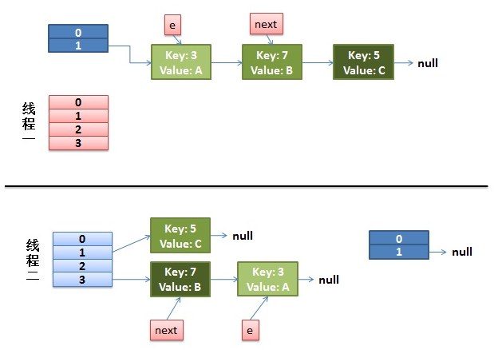

注意，因为Thread1的 e 指向了key(3)，而next指向了key(7)，其在线程二rehash后，指向了线程二重组后的链表。我们可以看到链表的指针顺序被反转。

2、线程一继续执行

* 先是执行 newTalbe[i] = e;
* 然后是e = next，导致了e指向了key(7)，
* 而下一次循环的next = e.next导致了next指向了key(3)

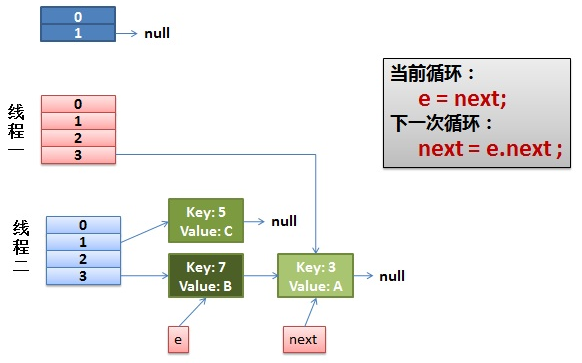

线程一接着工作。把key(7)摘下来，放到newTable[i]的第一个，然后把e和next往下移。

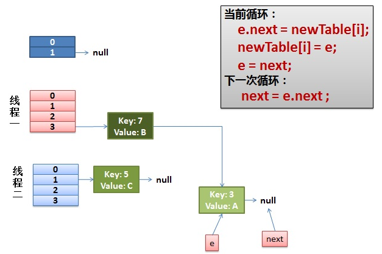

e.next = newTable[i] 导致  key(3).next 指向了 key(7)

注意：此时的key(7).next 已经指向了key(3)， 环形链表就这样出现了：

于是，当我们的线程一调用到，HashTable.get(11)时，悲剧就出现了——Infinite Loop。

### HashMap遍历

HashMap遍历的方式可以有好几种：

1、使用迭代器遍历 EntrySet：

~~~java
// 遍历
Iterator<Map.Entry<Integer, String>> iterator = map.entrySet().iterator();
while (iterator.hasNext()) {
    Map.Entry<Integer, String> entry = iterator.next();
    System.out.println(entry.getKey());
    System.out.println(entry.getValue());
}

// 在这种遍历方式中，是可以用iterator删除元素的
while (iterator.hasNext()) {
    Map.Entry<Integer, String> entry = iterator.next();
    if (entry.getKey() == 1) {
        // 删除
        System.out.println("del:" + entry.getKey());
        iterator.remove();
    } else {
        System.out.println("show:" + entry.getKey());
    }
}
~~~

和下面用增强for循环遍历是一样的，两种方法的字节码文件是相同的：

~~~java
// 遍历
for (Map.Entry<Integer, String> entry : map.entrySet()) {
    System.out.println(entry.getKey());
    System.out.println(entry.getValue());
}

// 但是在这种方式中，是不能删除元素的
for (Map.Entry<Integer, String> entry : map.entrySet()) {
    if (entry.getKey() == 1) {
        // 删除
        System.out.println("del:" + entry.getKey());
        map.remove(entry.getKey());
    } else {
        System.out.println("show:" + entry.getKey());
    }
}
~~~

2、还可以使用keyset来遍历集合：

~~~java
// 遍历
Iterator<Integer> iterator = map.keySet().iterator();
while (iterator.hasNext()) {
    Integer key = iterator.next();
    System.out.println(key);
    System.out.println(map.get(key));
}
~~~

使用keyset的速度没有使用EntrySet快，因为keyset遍历在取value的时候还要对集合进行get操作

3、使用lambda表达式或者Stream API：

~~~java
// Lambda
// 遍历
map.forEach((key, value) -> {
    System.out.println(key);
    System.out.println(value);
});

// Lambda中是不能调用集合的remove方法的
map.forEach((key, value) -> {
    if (key == 1) {
        System.out.println("del:" + key);
        map.remove(key);
    } else {
        System.out.println("show:" + key);
    }
});

// Lambda中正确删除元素的方式
map.keySet().removeIf(key -> key == 1);
map.forEach((key, value) -> {
    System.out.println("show:" + key);
});

// Stream API
// 遍历
map.entrySet().stream().forEach((entry) -> {
    System.out.println(entry.getKey());
    System.out.println(entry.getValue());
});

// Stream中正确删除元素的方式
map.entrySet().stream().filter(m -> 1 != m.getKey()).forEach((entry) -> {
    if (entry.getKey() == 1) {
        System.out.println("del:" + entry.getKey());
    } else {
        System.out.println("show:" + entry.getKey());
    }
});

// Streams API 多线程，这种是所有遍历中最快的
// 遍历
map.entrySet().parallelStream().forEach((entry) -> {
    System.out.println(entry.getKey());
    System.out.println(entry.getValue());
});
~~~

遍历中使用非法方式删除集合数据时，都会抛出并发修改异常

### ConcurrentHashMap 和 Hashtable 的区别

对比两者的底层数据结构：

* JDK1.7 的 ConcurrentHashMap 底层采用 分段的数组+链表 实现，JDK1.8 采用的数据结构跟 HashMap1.8 的结构一样，数组+链表/红黑二叉树
* Hashtable 和 JDK1.8 之前的 HashMap 的底层数据结构类似都是采用 数组+链表 的形式，数组是 HashMap 的主体，链表则是主要为了解决哈希冲突而存在的

实现线程安全的方式：

* 在 JDK1.7 的时候，ConcurrentHashMap 对整个桶数组进行了分割分段(Segment，分段锁)，每一把锁只锁容器其中一部分数据（下面有示意图），多线程访问容器里不同数据段的数据，就不会存在锁竞争，提高并发访问率。
* 到了 JDK1.8 的时候，ConcurrentHashMap 已经摒弃了 Segment 的概念，而是直接用 Node 数组+链表+红黑树的数据结构来实现，并发控制使用 synchronized 和 CAS 来操作。（JDK1.6 以后 synchronized 锁做了很多优化） 整个看起来就像是优化过且线程安全的 HashMap，虽然在 JDK1.8 中还能看到 Segment 的数据结构，但是已经简化了属性，只是为了兼容旧版本；
* Hashtable(同一把锁) :使用 synchronized 来保证线程安全，效率非常低下。当一个线程访问同步方法时，其他线程也访问同步方法，可能会进入阻塞或轮询状态，如使用 put 添加元素，另一个线程不能使用 put 添加元素，也不能使用 get，竞争会越来越激烈效率越低。

两者底层数据结构的对比图：

* Hashtable

  

* JDK1.7 的 ConcurrentHashMap ：

  

  ConcurrentHashMap 是由 Segment 数组结构和 HashEntry 数组结构组成。

  Segment 数组中的每个元素包含一个 HashEntry 数组，每个 HashEntry 数组属于链表结构。

  Segment 继承了 ReentrantLock,所以 Segment 是一种可重入锁，扮演锁的角色。HashEntry 用于存储键值对数据。

  ~~~java
  static class Segment<K,V> extends ReentrantLock implements Serializable {
  }
  ~~~

  一个 ConcurrentHashMap 里包含一个 Segment 数组，Segment 的个数一旦初始化就不能改变。 Segment 数组的大小默认是 16，也就是说默认可以同时支持 16 个线程并发写。

  每个 Segment 守护着一个 HashEntry 数组里的元素，当对 HashEntry 数组的数据进行修改时，必须首先获得对应的 Segment 的锁。

* JDK1.8 的 ConcurrentHashMap ：

  

  DK1.8 的 ConcurrentHashMap 不再是 Segment 数组 + HashEntry 数组 + 链表，而是 Node 数组 + 链表 / 红黑树。不过，Node 只能用于链表的情况，红黑树的情况需要使用 TreeNode。当冲突链表达到一定长度时，链表会转换成红黑树。

  TreeNode是存储红黑树节点，被TreeBin包装。TreeBin通过root属性维护红黑树的根结点，因为红黑树在旋转的时候，根结点可能会被它原来的子节点替换掉，在这个时间点，如果有其他线程要写这棵红黑树就会发生线程不安全问题，所以在 ConcurrentHashMap 中TreeBin通过waiter属性维护当前使用这棵红黑树的线程，来防止其他线程的进入：

  ~~~java
  static final class TreeBin<K,V> extends Node<K,V> {
          TreeNode<K,V> root;
          volatile TreeNode<K,V> first;
          volatile Thread waiter;
          volatile int lockState;
          // values for lockState
          static final int WRITER = 1; // set while holding write lock
          static final int WAITER = 2; // set when waiting for write lock
          static final int READER = 4; // increment value for setting read lock
  ...
  }
  ~~~

  ConcurrentHashMap 取消了 Segment 分段锁，采用 Node + CAS + synchronized 来保证并发安全。数据结构跟 HashMap 1.8 的结构类似，数组+链表/红黑二叉树。Java 8 在链表长度超过一定阈值（8）时将链表（寻址时间复杂度为 O(N)）转换为红黑树（寻址时间复杂度为 O(log(N))）。

  Java 8 中，锁粒度更细，synchronized 只锁定当前链表或红黑二叉树的首节点，这样只要 hash 不冲突，就不会产生并发，就不会影响其他 Node 的读写，效率大幅提升。

## Collections 工具类

Collections 工具类常用方法:

* 排序
* 查找,替换操作
* 同步控制(不推荐，需要线程安全的集合类型时请考虑使用 JUC 包下的并发集合)

排序，改变位置：

~~~java
void reverse(List list)//反转
void shuffle(List list)//随机排序
void sort(List list)//按自然排序的升序排序
void sort(List list, Comparator c)//定制排序，由Comparator控制排序逻辑
void swap(List list, int i , int j)//交换两个索引位置的元素
void rotate(List list, int distance)//旋转。当distance为正数时，将list后distance个元素整体移到前面。当distance为负数时，将 list的前distance个元素整体移到后面
~~~

查找，替换：

~~~java
int binarySearch(List list, Object key)//对List进行二分查找，返回索引，注意List必须是有序的
int max(Collection coll)//根据元素的自然顺序，返回最大的元素。 类比int min(Collection coll)
int max(Collection coll, Comparator c)//根据定制排序，返回最大元素，排序规则由Comparatator类控制。类比int min(Collection coll, Comparator c)
void fill(List list, Object obj)//用指定的元素代替指定list中的所有元素
int frequency(Collection c, Object o)//统计元素出现次数
int indexOfSubList(List list, List target)//统计target在list中第一次出现的索引，找不到则返回-1，类比int lastIndexOfSubList(List source, list target)
boolean replaceAll(List list, Object oldVal, Object newVal)//用新元素替换旧元素
~~~

同步控制：Collections 提供了多个synchronizedXxx()方法·，该方法可以将指定集合包装成线程同步的集合，从而解决多线程并发访问集合时的线程安全问题。

我们知道 HashSet，TreeSet，ArrayList,LinkedList,HashMap,TreeMap 都是线程不安全的。Collections 提供了多个静态方法可以把他们包装成线程同步的集合。

最好不要用下面这些方法，效率非常低，需要线程安全的集合类型时请考虑使用 JUC 包下的并发集合。

~~~java
synchronizedCollection(Collection<T>  c) //返回指定 collection 支持的同步（线程安全的）collection。
synchronizedList(List<T> list)//返回指定列表支持的同步（线程安全的）List。
synchronizedMap(Map<K,V> m) //返回由指定映射支持的同步（线程安全的）Map。
synchronizedSet(Set<T> s) //返回指定 set 支持的同步（线程安全的）set。
~~~

## 集合转数组

使用集合转数组的方法，必须使用集合的 toArray(T[] array)，传入的是类型完全一致、长度为 0 的空数组：

~~~java
String [] s= new String[]{
    "dog", "lazy", "a", "over", "jumps", "fox", "brown", "quick", "A"
};
List<String> list = Arrays.asList(s);
Collections.reverse(list);
//没有指定类型的话会报错
s=list.toArray(new String[0]);
~~~

new String[0]就是起一个模板的作用，指定了返回数组的类型，0 是为了节省空间，因为它只是为了说明返回的类型。

## 数组转集合

使用工具类 Arrays.asList() 把数组转换成集合时，不能使用其修改集合相关的方法， 它的 add/remove/clear 方法会抛出 UnsupportedOperationException 异常：

~~~java
String[] myArray = {"Apple", "Banana", "Orange"};
List<String> myList = Arrays.asList(myArray);
//上面两个语句等价于下面一条语句
List<String> myList = Arrays.asList("Apple","Banana", "Orange");
~~~

Arrays.asList()的弊端：

1、Arrays.asList()是泛型方法，传递的数组必须是对象数组，而不是基本类型。

~~~java
int[] myArray = {1, 2, 3};
List myList = Arrays.asList(myArray);
System.out.println(myList.size());//1
System.out.println(myList.get(0));//数组地址值
System.out.println(myList.get(1));//报错：ArrayIndexOutOfBoundsException
int[] array = (int[]) myList.get(0);
System.out.println(array[0]);//1
~~~

使用包装类型数组就可以解决这个问题 

2、使用集合的修改方法: add()、remove()、clear()会抛出UnsupportedOperationException 异常。

Arrays.asList() 方法返回的并不是 java.util.ArrayList ，而是 java.util.Arrays 的一个内部类：

~~~java
List myList = Arrays.asList(1, 2, 3);
System.out.println(myList.getClass());//class java.util.Arrays$ArrayList
~~~

这个类是AbstractList 的子类，因为Arrays$ArrayList并没有重写这些方法，导致调用时会调用AbstractList 的对应方法：

~~~java
public E remove(int index) {
    throw new UnsupportedOperationException();
}
public boolean add(E e) {
    add(size(), e);
    return true;
}
public void add(int index, E element) {
    throw new UnsupportedOperationException();
}

public void clear() {
    removeRange(0, size());
}
protected void removeRange(int fromIndex, int toIndex) {
    ListIterator<E> it = listIterator(fromIndex);
    for (int i=0, n=toIndex-fromIndex; i<n; i++) {
        it.next();
        it.remove();
    }
}
~~~

正确将数组转为集合的方法：

1、将视图转为真正的集合：

~~~java
List list = new ArrayList<>(Arrays.asList("a", "b", "c"))
~~~

2、使用Stream  API：

~~~java
Integer [] myArray = { 1, 2, 3 };
List myList = Arrays.stream(myArray).collect(Collectors.toList());
//基本类型也可以实现转换（依赖boxed的装箱操作）
int [] myArray2 = { 1, 2, 3 };
List myList = Arrays.stream(myArray2).boxed().collect(Collectors.toList());
~~~

3、使用 Guava 

对于不可变集合，你可以使用ImmutableList类及其of()与copyOf()工厂方法：（参数不能为空）

~~~java
List<String> il = ImmutableList.of("string", "elements");  // from varargs
List<String> il = ImmutableList.copyOf(aStringArray);      // from array
~~~

对于可变集合，你可以使用Lists类及其newArrayList()工厂方法：

~~~java
List<String> l1 = Lists.newArrayList(anotherListOrCollection);    // from collection
List<String> l2 = Lists.newArrayList(aStringArray);               // from array
List<String> l3 = Lists.newArrayList("or", "string", "elements"); // from varargs
~~~

4、使用 Apache Commons Collections 

~~~java
List<String> list = new ArrayList<String>();
CollectionUtils.addAll(list, strarr);
~~~

5、使用 Java9 的 List.of()方法

~~~java
Integer[] array = {1, 2, 3};
List<Integer> list = List.of(array);
~~~

## 集合杂项

1、集合判空

判空时应该使用 isEmpty() 方法，而不是 size()==0 的方式。

这是因为 isEmpty() 方法的可读性更好，并且时间复杂度为 O(1)。支持并发的集合size()时间复杂度可能很高

2、集合转map

可以用Stream API来完成，但注意要保证map的value是非null，否则会有问题：

~~~java
List<Person> bookList = new ArrayList<>();
bookList.add(new Person("jack","18163138123"));
bookList.add(new Person("martin",null));
// 空指针异常
bookList.stream().collect(Collectors.toMap(Person::getName, Person::getPhoneNumber));
~~~

java.util.stream.Collectors 类的 toMap() 方法 ，可以看到其内部调用了 Map 接口的 merge() 方法：

~~~java
public static <T, K, U, M extends Map<K, U>>
Collector<T, ?, M> toMap(Function<? super T, ? extends K> keyMapper,
                            Function<? super T, ? extends U> valueMapper,
                            BinaryOperator<U> mergeFunction,
                            Supplier<M> mapSupplier) {
    BiConsumer<M, T> accumulator
            = (map, element) -> map.merge(keyMapper.apply(element),
                                          valueMapper.apply(element), mergeFunction);
    return new CollectorImpl<>(mapSupplier, accumulator, mapMerger(mergeFunction), CH_ID);
}
~~~

Map 接口的 merge() 方法中，merge() 方法会先调用 Objects.requireNonNull() 方法判断 value 是否为空。

~~~java
default V merge(K key, V value,
        BiFunction<? super V, ? super V, ? extends V> remappingFunction) {
    Objects.requireNonNull(remappingFunction);
    Objects.requireNonNull(value);
    V oldValue = get(key);
    V newValue = (oldValue == null) ? value :
               remappingFunction.apply(oldValue, value);
    if(newValue == null) {
        remove(key);
    } else {
        put(key, newValue);
    }
    return newValue;
}
~~~
# ArrayList

## 概述

ArrayList 的底层是数组队列，相当于动态数组。与 Java 中的数组相比，它的容量能动态增长。

ArrayList继承于 AbstractList ，实现了 List, RandomAccess, Cloneable, java.io.Serializable 这些接口。

~~~java
public class ArrayList<E> extends AbstractList<E>
        implements List<E>, RandomAccess, Cloneable, java.io.Serializable{

  }
~~~

## 构造方法

ArrayList 有三种方式来初始化，构造方法源码如下：

~~~java
/**
     * 默认初始容量大小
     */
    private static final int DEFAULT_CAPACITY = 10;

    private static final Object[] DEFAULTCAPACITY_EMPTY_ELEMENTDATA = {};

    /**
     *默认构造函数，使用初始容量10构造一个空列表(无参数构造)
     */
    public ArrayList() {
        this.elementData = DEFAULTCAPACITY_EMPTY_ELEMENTDATA;
    }

    /**
     * 带初始容量参数的构造函数。（用户自己指定容量）
     */
    public ArrayList(int initialCapacity) {
        if (initialCapacity > 0) {//初始容量大于0
            //创建initialCapacity大小的数组
            this.elementData = new Object[initialCapacity];
        } else if (initialCapacity == 0) {//初始容量等于0
            //创建空数组
            this.elementData = EMPTY_ELEMENTDATA;
        } else {//初始容量小于0，抛出异常
            throw new IllegalArgumentException("Illegal Capacity: "+
                                               initialCapacity);
        }
    }

   /**
    *构造包含指定collection元素的列表，这些元素利用该集合的迭代器按顺序返回
    *如果指定的集合为null，throws NullPointerException。
    */
     public ArrayList(Collection<? extends E> c) {
        elementData = c.toArray();
        if ((size = elementData.length) != 0) {
            // c.toArray might (incorrectly) not return Object[] (see 6260652)
            if (elementData.getClass() != Object[].class)
                elementData = Arrays.copyOf(elementData, size, Object[].class);
        } else {
            // replace with empty array.
            this.elementData = EMPTY_ELEMENTDATA;
        }
    }
~~~

以无参数构造方法创建 ArrayList 时，实际上初始化赋值的是一个空数组。当真正对数组进行添加元素操作时，才真正分配容量。即向数组中添加第一个元素时，数组容量扩为 10。

JDK6 new 无参构造的 ArrayList 对象时，直接创建了长度是 10 的 Object[] 数组 elementData

## 扩容机制

从add方法开始：

~~~java
    /**
     * 将指定的元素追加到此列表的末尾。
     */
    public boolean add(E e) {
   //添加元素之前，先调用ensureCapacityInternal方法
        ensureCapacityInternal(size + 1);  // Increments modCount!!
        //这里看到ArrayList添加元素的实质就相当于为数组赋值
        elementData[size++] = e;
        return true;
    }
~~~

（JDK11 移除了 ensureCapacityInternal() 和 ensureExplicitCapacity() 方法）

ensureCapacityInternal方法：

~~~java
   //得到最小扩容量
    private void ensureCapacityInternal(int minCapacity) {
        if (elementData == DEFAULTCAPACITY_EMPTY_ELEMENTDATA) {
              // 获取默认的容量和传入参数的较大值
            minCapacity = Math.max(DEFAULT_CAPACITY, minCapacity);
        }

        ensureExplicitCapacity(minCapacity);
    }
~~~

当 要 add 进第 1 个元素时，minCapacity 为 1，在 Math.max()方法比较后，minCapacity 为 10。

ensureExplicitCapacity 方法：

~~~java
  //判断是否需要扩容
    private void ensureExplicitCapacity(int minCapacity) {
        modCount++;

        // overflow-conscious code
        if (minCapacity - elementData.length > 0)
            //调用grow方法进行扩容，调用此方法代表已经开始扩容了
            grow(minCapacity);
    }
~~~

触发grow方法的过程：

* 当我们要 add 进第 1 个元素到 ArrayList 时，elementData.length 为 0 （因为还是一个空的 list），因为执行了 ensureCapacityInternal() 方法 ，所以 minCapacity 此时为 10。此时，minCapacity - elementData.length > 0成立，所以会进入 grow(minCapacity) 方法。
* 当 add 第 2 个元素时，minCapacity 为 2，此时 e lementData.length(容量)在添加第一个元素后扩容成 10 了。此时，minCapacity - elementData.length > 0 不成立，所以不会进入 （执行）grow(minCapacity) 方法。
* 添加第 3、4···到第 10 个元素时，依然不会执行 grow 方法，数组容量都为 10。

直到添加第 11 个元素，minCapacity(为 11)比 elementData.length（为 10）要大。进入 grow 方法进行扩容。

grow方法：

~~~java
    /**
     * 要分配的最大数组大小
     */
    private static final int MAX_ARRAY_SIZE = Integer.MAX_VALUE - 8;

    /**
     * ArrayList扩容的核心方法。
     */
    private void grow(int minCapacity) {
        // oldCapacity为旧容量，newCapacity为新容量
        int oldCapacity = elementData.length;
        //将oldCapacity 右移一位，其效果相当于oldCapacity /2，
        //我们知道位运算的速度远远快于整除运算，整句运算式的结果就是将新容量更新为旧容量的1.5倍，
        int newCapacity = oldCapacity + (oldCapacity >> 1);
        //然后检查新容量是否大于最小需要容量，若还是小于最小需要容量，那么就把最小需要容量当作数组的新容量，
        if (newCapacity - minCapacity < 0)
            newCapacity = minCapacity;
       // 如果新容量大于 MAX_ARRAY_SIZE,进入(执行) `hugeCapacity()` 方法来比较 minCapacity 和 MAX_ARRAY_SIZE，
       //如果minCapacity大于最大容量，则新容量则为`Integer.MAX_VALUE`，否则，新容量大小则为 MAX_ARRAY_SIZE 即为 `Integer.MAX_VALUE - 8`。
        if (newCapacity - MAX_ARRAY_SIZE > 0)
            newCapacity = hugeCapacity(minCapacity);
        // minCapacity is usually close to size, so this is a win:
        elementData = Arrays.copyOf(elementData, newCapacity);
    }
~~~

int newCapacity = oldCapacity + (oldCapacity >> 1),所以 ArrayList 每次扩容之后容量都会变为原来的 1.5 倍左右（oldCapacity 为偶数就是 1.5 倍，否则是 1.5 倍左右）！ 奇偶不同，比如 ：10+10/2 = 15, 33+33/2=49。如果是奇数的话会丢掉小数

对于大数据的 2 进制运算,位移运算符比那些普通运算符的运算要快很多

hugeCapacity 方法：

~~~java
    private static int hugeCapacity(int minCapacity) {
        if (minCapacity < 0) // overflow
            throw new OutOfMemoryError();
        //对minCapacity和MAX_ARRAY_SIZE进行比较
        //若minCapacity大，将Integer.MAX_VALUE作为新数组的大小
        //若MAX_ARRAY_SIZE大，将MAX_ARRAY_SIZE作为新数组的大小
        //MAX_ARRAY_SIZE = Integer.MAX_VALUE - 8;
        return (minCapacity > MAX_ARRAY_SIZE) ?
            Integer.MAX_VALUE :
            MAX_ARRAY_SIZE;
    }
~~~

 如果新容量大于 MAX_ARRAY_SIZE,进入(执行) hugeCapacity() 方法来比较 minCapacity 和 MAX_ARRAY_SIZE，如果 minCapacity 大于最大容量，则新容量则为Integer.MAX_VALUE，否则，新容量大小则为 MAX_ARRAY_SIZE 即为 Integer.MAX_VALUE - 8。

## System.arraycopy() 方法

 ArrayList 中大量调用了这两个方法 ：System.arraycopy() 和 Arrays.copyOf()方法

arraycopy 是一个 native 方法,接下来我们解释一下各个参数的具体意义 

各参数的含义：

~~~java
    // 我们发现 arraycopy 是一个 native 方法,接下来我们解释一下各个参数的具体意义
    /**
    *   复制数组
    * @param src 源数组
    * @param srcPos 源数组中的起始位置
    * @param dest 目标数组
    * @param destPos 目标数组中的起始位置
    * @param length 要复制的数组元素的数量
    */
    public static native void arraycopy(Object src,  int  srcPos,
                                        Object dest, int destPos,
                                        int length);
~~~

它用于拷贝数组元素到另一个数组：

~~~java
    // 我们发现 arraycopy 是一个 native 方法,接下来我们解释一下各个参数的具体意义
    /**
    *   复制数组
    * @param src 源数组
    * @param srcPos 源数组中的起始位置
    * @param dest 目标数组
    * @param destPos 目标数组中的起始位置
    * @param length 要复制的数组元素的数量
    */
    public static native void arraycopy(Object src,  int  srcPos,
                                        Object dest, int destPos,
                                        int length);
~~~

## Arrays.copyOf()方法

它的源码：

~~~java
    public static int[] copyOf(int[] original, int newLength) {
        // 申请一个新的数组
        int[] copy = new int[newLength];
    // 调用System.arraycopy,将源数组中的数据进行拷贝,并返回新的数组
        System.arraycopy(original, 0, copy, 0,
                         Math.min(original.length, newLength));
        return copy;
    }
~~~

ArrayList中的toArray 方法，将列表中的所有元素包装到数组中返回：

~~~java
   /**
     以正确的顺序返回一个包含此列表中所有元素的数组（从第一个到最后一个元素）; 返回的数组的运行时类型是指定数组的运行时类型。
     */
    public Object[] toArray() {
    //elementData：要复制的数组；size：要复制的长度
        return Arrays.copyOf(elementData, size);
    }
~~~

copyOf方法本质上也调用了arraycopy方法

两个方法的区别：

* arraycopy() 需要目标数组，将原数组拷贝到你自己定义的数组里或者原数组，而且可以选择拷贝的起点和长度以及放入新数组中的位置 
* copyOf() 是系统自动在内部新建一个数组，并返回该数组。

## ensureCapacity方法

ArrayList可以通过ensureCapacity方法来扩大底层数组的容量。最好在向 ArrayList 添加大量元素之前用 ensureCapacity 方法，以减少增量重新分配的次数

~~~java
    /**
    如有必要，增加此 ArrayList 实例的容量，以确保它至少可以容纳由minimum capacity参数指定的元素数。
     *
     * @param   minCapacity   所需的最小容量
     */
    public void ensureCapacity(int minCapacity) {
        int minExpand = (elementData != DEFAULTCAPACITY_EMPTY_ELEMENTDATA)
            // any size if not default element table
            ? 0
            // larger than default for default empty table. It's already
            // supposed to be at default size.
            : DEFAULT_CAPACITY;

        if (minCapacity > minExpand) {
            ensureExplicitCapacity(minCapacity);
        }
    }
~~~

# HashMap

HashMap 可以存储 null 的 key 和 value，但 null 作为键只能有一个，null 作为值可以有多个

JDK1.8 之前 HashMap 由 数组+链表 组成的，数组是 HashMap 的主体，链表则是主要为了解决哈希冲突而存在的（“拉链法”解决冲突）。 JDK1.8 以后的 HashMap 在解决哈希冲突时有了较大的变化，当链表长度大于阈值（默认为 8）（将链表转换成红黑树前会判断，如果当前数组的长度小于 64，那么会选择先进行数组扩容，而不是转换为红黑树）时，将链表转化为红黑树，以减少搜索时间。

HashMap 默认的初始化大小为 16。之后每次扩充，容量变为原来的 2 倍。并且， HashMap 总是使用 2 的幂作为哈希表的大小。

不同版本的哈希表处理哈希冲突的方式是不同的：

* JDK1.8之前，通过拉链法解决冲突，拉链法就是，将链表和数组相结合。也就是说创建一个链表数组，数组中每一格就是一个链表。若遇到哈希冲突，则将冲突的值加到链表中即可。 
* JDK1.8之后，当链表长度大于阈值（默认为 8）时，会首先调用 treeifyBin()方法。这个方法会根据 HashMap 数组来决定是否转换为红黑树。只有当数组长度大于或者等于 64 的情况下，才会执行转换红黑树操作，以减少搜索时间。否则，就是只是执行 resize() 方法对数组扩容。相关源码这里就不贴了

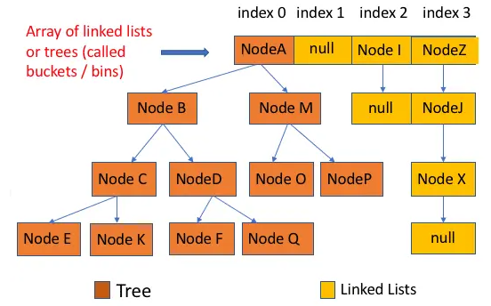

## 类的属性

~~~java
public class HashMap<K,V> extends AbstractMap<K,V> implements Map<K,V>, Cloneable, Serializable {
    // 序列号
    private static final long serialVersionUID = 362498820763181265L;
    // 默认的初始容量是16
    static final int DEFAULT_INITIAL_CAPACITY = 1 << 4;
    // 最大容量
    static final int MAXIMUM_CAPACITY = 1 << 30;
    // 默认的填充因子
    static final float DEFAULT_LOAD_FACTOR = 0.75f;
    // 当桶(bucket)上的结点数大于这个值时会转成红黑树
    static final int TREEIFY_THRESHOLD = 8;
    // 当桶(bucket)上的结点数小于这个值时树转链表
    static final int UNTREEIFY_THRESHOLD = 6;
    // 桶中结构转化为红黑树对应的table的最小容量
    static final int MIN_TREEIFY_CAPACITY = 64;
    // 存储元素的数组，总是2的幂次倍
    transient Node<k,v>[] table;
    // 存放具体元素的集
    transient Set<map.entry<k,v>> entrySet;
    // 存放元素的个数，注意这个不等于数组的长度。
    transient int size;
    // 每次扩容和更改map结构的计数器
    transient int modCount;
    // 临界值(容量*填充因子) 当实际大小超过临界值时，会进行扩容
    int threshold;
    // 加载因子
    final float loadFactor;
}
~~~

loadFactor：加载因子。loadFactor 加载因子是控制数组存放数据的疏密程度，loadFactor 越趋近于 1，那么 数组中存放的数据(entry)也就越多，也就越密，也就是会让链表的长度增加，loadFactor 越小，也就是趋近于 0，数组中存放的数据(entry)也就越少，也就越稀疏。

loadFactor 太大导致查找元素效率低，太小导致数组的利用率低，存放的数据会很分散。loadFactor 的默认值为 0.75f 是官方给出的一个比较好的临界值。

给定的默认容量为 16，负载因子为 0.75。Map 在使用过程中不断的往里面存放数据，当数量达到了 16 * 0.75 = 12 就需要将当前 16 的容量进行扩容，而扩容这个过程涉及到 rehash、复制数据等操作，所以非常消耗性能。

threshold：threshold = capacity * loadFactor，当 Size>=threshold的时候，那么就要考虑对数组的扩增了，它是是否扩容数组的临界值

HashMap中的两种节点：Node和TreeNode：

~~~java
// 继承自 Map.Entry<K,V>
static class Node<K,V> implements Map.Entry<K,V> {
       final int hash;// 哈希值，存放元素到hashmap中时用来与其他元素hash值比较
       final K key;//键
       V value;//值
       // 指向下一个节点
       Node<K,V> next;
       Node(int hash, K key, V value, Node<K,V> next) {
            this.hash = hash;
            this.key = key;
            this.value = value;
            this.next = next;
        }
        public final K getKey()        { return key; }
        public final V getValue()      { return value; }
        public final String toString() { return key + "=" + value; }
        // 重写hashCode()方法
        public final int hashCode() {
            return Objects.hashCode(key) ^ Objects.hashCode(value);
        }

        public final V setValue(V newValue) {
            V oldValue = value;
            value = newValue;
            return oldValue;
        }
        // 重写 equals() 方法
        public final boolean equals(Object o) {
            if (o == this)
                return true;
            if (o instanceof Map.Entry) {
                Map.Entry<?,?> e = (Map.Entry<?,?>)o;
                if (Objects.equals(key, e.getKey()) &&
                    Objects.equals(value, e.getValue()))
                    return true;
            }
            return false;
        }
}
~~~

~~~java
static final class TreeNode<K,V> extends LinkedHashMap.Entry<K,V> {
        TreeNode<K,V> parent;  // 父
        TreeNode<K,V> left;    // 左
        TreeNode<K,V> right;   // 右
        TreeNode<K,V> prev;    // needed to unlink next upon deletion
        boolean red;           // 判断颜色
        TreeNode(int hash, K key, V val, Node<K,V> next) {
            super(hash, key, val, next);
        }
        // 返回根节点
        final TreeNode<K,V> root() {
            for (TreeNode<K,V> r = this, p;;) {
                if ((p = r.parent) == null)
                    return r;
                r = p;
       }
~~~

## 构造方法

HashMap 中有四个构造方法，它们分别如下： 

~~~java
    // 默认构造函数。
    public HashMap() {
        this.loadFactor = DEFAULT_LOAD_FACTOR; // all   other fields defaulted
     }

     // 包含另一个“Map”的构造函数
     public HashMap(Map<? extends K, ? extends V> m) {
         this.loadFactor = DEFAULT_LOAD_FACTOR;
         putMapEntries(m, false);//下面会分析到这个方法
     }

     // 指定“容量大小”的构造函数
     public HashMap(int initialCapacity) {
         this(initialCapacity, DEFAULT_LOAD_FACTOR);
     }

     // 指定“容量大小”和“加载因子”的构造函数
     public HashMap(int initialCapacity, float loadFactor) {
         if (initialCapacity < 0)
             throw new IllegalArgumentException("Illegal initial capacity: " + initialCapacity);
         if (initialCapacity > MAXIMUM_CAPACITY)
             initialCapacity = MAXIMUM_CAPACITY;
         if (loadFactor <= 0 || Float.isNaN(loadFactor))
             throw new IllegalArgumentException("Illegal load factor: " + loadFactor);
         this.loadFactor = loadFactor;
         this.threshold = tableSizeFor(initialCapacity);
     }
~~~

putMapEntries方法：

~~~java
final void putMapEntries(Map<? extends K, ? extends V> m, boolean evict) {
    int s = m.size();
    if (s > 0) {
        // 判断table是否已经初始化
        if (table == null) { // pre-size
            // 未初始化，s为m的实际元素个数
            float ft = ((float)s / loadFactor) + 1.0F;
            int t = ((ft < (float)MAXIMUM_CAPACITY) ?
                    (int)ft : MAXIMUM_CAPACITY);
            // 计算得到的t大于阈值，则初始化阈值
            if (t > threshold)
                threshold = tableSizeFor(t);
        }
        // 已初始化，并且m元素个数大于阈值，进行扩容处理
        else if (s > threshold)
            resize();
        // 将m中的所有元素添加至HashMap中
        for (Map.Entry<? extends K, ? extends V> e : m.entrySet()) {
            K key = e.getKey();
            V value = e.getValue();
            putVal(hash(key), key, value, false, evict);
        }
    }
}
~~~

## put方法

HashMap 只提供了 put 用于添加元素，putVal 方法只是给 put 方法调用的一个方法，并没有提供给用户使用。 

对 putVal 方法添加元素的分析如下：

* 如果定位到的数组位置没有元素 就直接插入。
* 如果定位到的数组位置有元素就和要插入的 key 比较，如果 key 相同就直接覆盖，如果 key 不相同，就判断 p 是否是一个树节点，如果是就调用e = ((TreeNode\<K,V>)p).putTreeVal(this, tab, hash, key, value)将元素添加进入。如果不是就遍历链表插入(插入的是链表尾部)。

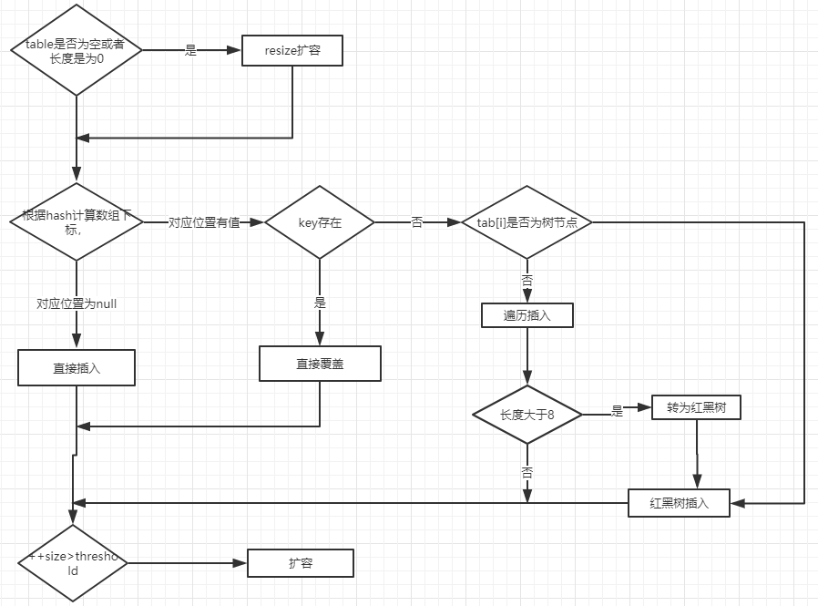

上图有两个小问题：

直接覆盖之后应该就会 return，不会有后续操作。参考 JDK8 HashMap.java 658 行。
当链表长度大于阈值（默认为 8）并且 HashMap 数组长度超过 64 的时候才会执行链表转红黑树的操作，否则就只是对数组扩容。参考 HashMap 的 treeifyBin() 方法。

~~~java
public V put(K key, V value) {
    return putVal(hash(key), key, value, false, true);
}

final V putVal(int hash, K key, V value, boolean onlyIfAbsent,
                   boolean evict) {
    Node<K,V>[] tab; Node<K,V> p; int n, i;
    // table未初始化或者长度为0，进行扩容
    if ((tab = table) == null || (n = tab.length) == 0)
        n = (tab = resize()).length;
    // (n - 1) & hash 确定元素存放在哪个桶中，桶为空，新生成结点放入桶中(此时，这个结点是放在数组中)
    if ((p = tab[i = (n - 1) & hash]) == null)
        tab[i] = newNode(hash, key, value, null);
    // 桶中已经存在元素
    else {
        Node<K,V> e; K k;
        // 比较桶中第一个元素(数组中的结点)的hash值相等，key相等
        if (p.hash == hash &&
            ((k = p.key) == key || (key != null && key.equals(k))))
                // 将第一个元素赋值给e，用e来记录
                e = p;
        // hash值不相等，即key不相等；为红黑树结点
        else if (p instanceof TreeNode)
            // 放入树中
            e = ((TreeNode<K,V>)p).putTreeVal(this, tab, hash, key, value);
        // 为链表结点
        else {
            // 在链表最末插入结点
            for (int binCount = 0; ; ++binCount) {
                // 到达链表的尾部
                if ((e = p.next) == null) {
                    // 在尾部插入新结点
                    p.next = newNode(hash, key, value, null);
                    // 结点数量达到阈值(默认为 8 )，执行 treeifyBin 方法
                    // 这个方法会根据 HashMap 数组来决定是否转换为红黑树。
                    // 只有当数组长度大于或者等于 64 的情况下，才会执行转换红黑树操作，以减少搜索时间。否则，就是只是对数组扩容。
                    if (binCount >= TREEIFY_THRESHOLD - 1) // -1 for 1st
                        treeifyBin(tab, hash);
                    // 跳出循环
                    break;
                }
                // 判断链表中结点的key值与插入的元素的key值是否相等
                if (e.hash == hash &&
                    ((k = e.key) == key || (key != null && key.equals(k))))
                    // 相等，跳出循环
                    break;
                // 用于遍历桶中的链表，与前面的e = p.next组合，可以遍历链表
                p = e;
            }
        }
        // 表示在桶中找到key值、hash值与插入元素相等的结点
        if (e != null) {
            // 记录e的value
            V oldValue = e.value;
            // onlyIfAbsent为false或者旧值为null
            if (!onlyIfAbsent || oldValue == null)
                //用新值替换旧值
                e.value = value;
            // 访问后回调
            afterNodeAccess(e);
            // 返回旧值
            return oldValue;
        }
    }
    // 结构性修改
    ++modCount;
    // 实际大小大于阈值则扩容
    if (++size > threshold)
        resize();
    // 插入后回调
    afterNodeInsertion(evict);
    return null;
}
~~~

对比一下 JDK1.7 put 方法的代码

对于 put 方法的分析如下：

* 如果定位到的数组位置没有元素 就直接插入。
* 如果定位到的数组位置有元素，遍历以这个元素为头结点的链表，依次和插入的 key 比较，如果 key 相同就直接覆盖，不同就采用头插法插入元素。

~~~java
public V put(K key, V value)
    if (table == EMPTY_TABLE) {
    inflateTable(threshold);
}
    if (key == null)
        return putForNullKey(value);
    int hash = hash(key);
    int i = indexFor(hash, table.length);
    for (Entry<K,V> e = table[i]; e != null; e = e.next) { // 先遍历
        Object k;
        if (e.hash == hash && ((k = e.key) == key || key.equals(k))) {
            V oldValue = e.value;
            e.value = value;
            e.recordAccess(this);
            return oldValue;
        }
    }

    modCount++;
    addEntry(hash, key, value, i);  // 再插入
    return null;
}
~~~

## get方法

get方法源码：

~~~java
public V get(Object key) {
    Node<K,V> e;
    return (e = getNode(hash(key), key)) == null ? null : e.value;
}

final Node<K,V> getNode(int hash, Object key) {
    Node<K,V>[] tab; Node<K,V> first, e; int n; K k;
    if ((tab = table) != null && (n = tab.length) > 0 &&
        (first = tab[(n - 1) & hash]) != null) {
        // 数组元素相等
        if (first.hash == hash && // always check first node
            ((k = first.key) == key || (key != null && key.equals(k))))
            return first;
        // 桶中不止一个节点
        if ((e = first.next) != null) {
            // 在树中get
            if (first instanceof TreeNode)
                return ((TreeNode<K,V>)first).getTreeNode(hash, key);
            // 在链表中get
            do {
                if (e.hash == hash &&
                    ((k = e.key) == key || (key != null && key.equals(k))))
                    return e;
            } while ((e = e.next) != null);
        }
    }
    return null;
}
~~~

get的时候首先去找对应的桶，如果只有一个节点则直接返回；如果多个节点分为在链表中取和在树中取两个方法。

## resize方法

进行扩容，会伴随着一次重新 hash 分配，并且会遍历 hash 表中所有的元素，是非常耗时的。在编写程序中，要尽量避免 resize。 

集合大小扩充为原来的2倍，重新hash分配：

~~~java
final Node<K,V>[] resize() {
    Node<K,V>[] oldTab = table;
    int oldCap = (oldTab == null) ? 0 : oldTab.length;
    int oldThr = threshold;
    int newCap, newThr = 0;
    if (oldCap > 0) {
        // 超过最大值就不再扩充了，就只好随你碰撞去吧
        if (oldCap >= MAXIMUM_CAPACITY) {
            threshold = Integer.MAX_VALUE;
            return oldTab;
        }
        // 没超过最大值，就扩充为原来的2倍
        else if ((newCap = oldCap << 1) < MAXIMUM_CAPACITY && oldCap >= DEFAULT_INITIAL_CAPACITY)
            newThr = oldThr << 1; // double threshold
    }
    else if (oldThr > 0) // initial capacity was placed in threshold
        newCap = oldThr;
    else {
        // signifies using defaults
        newCap = DEFAULT_INITIAL_CAPACITY;
        newThr = (int)(DEFAULT_LOAD_FACTOR * DEFAULT_INITIAL_CAPACITY);
    }
    // 计算新的resize上限
    if (newThr == 0) {
        float ft = (float)newCap * loadFactor;
        newThr = (newCap < MAXIMUM_CAPACITY && ft < (float)MAXIMUM_CAPACITY ? (int)ft : Integer.MAX_VALUE);
    }
    threshold = newThr;
    @SuppressWarnings({"rawtypes","unchecked"})
        Node<K,V>[] newTab = (Node<K,V>[])new Node[newCap];
    table = newTab;
    if (oldTab != null) {
        // 把每个bucket都移动到新的buckets中
        for (int j = 0; j < oldCap; ++j) {
            Node<K,V> e;
            if ((e = oldTab[j]) != null) {
                oldTab[j] = null;
                if (e.next == null)
                    newTab[e.hash & (newCap - 1)] = e;
                else if (e instanceof TreeNode)
                    ((TreeNode<K,V>)e).split(this, newTab, j, oldCap);
                else {
                    Node<K,V> loHead = null, loTail = null;
                    Node<K,V> hiHead = null, hiTail = null;
                    Node<K,V> next;
                    do {
                        next = e.next;
                        // 原索引
                        if ((e.hash & oldCap) == 0) {
                            if (loTail == null)
                                loHead = e;
                            else
                                loTail.next = e;
                            loTail = e;
                        }
                        // 原索引+oldCap
                        else {
                            if (hiTail == null)
                                hiHead = e;
                            else
                                hiTail.next = e;
                            hiTail = e;
                        }
                    } while ((e = next) != null);
                    // 原索引放到bucket里
                    if (loTail != null) {
                        loTail.next = null;
                        newTab[j] = loHead;
                    }
                    // 原索引+oldCap放到bucket里
                    if (hiTail != null) {
                        hiTail.next = null;
                        newTab[j + oldCap] = hiHead;
                    }
                }
            }
        }
    }
    return newTab;
}
~~~

# LinkedHashMap

以下内容都基于JDK1.8

LinkedHashMap 继承自 HashMap，在 HashMap 基础上，通过维护一条双向链表，解决了 HashMap 不能随时保持遍历顺序和插入顺序一致的问题。

在实现上，LinkedHashMap 很多方法直接继承自 HashMap，仅为维护双向链表覆写了部分方法。

LinkedHashMap 在上面结构的基础上，增加了一条双向链表，使得上面的结构可以保持键值对的插入顺序。同时通过对链表进行相应的操作，实现了访问顺序相关逻辑。其结构可能如下图：

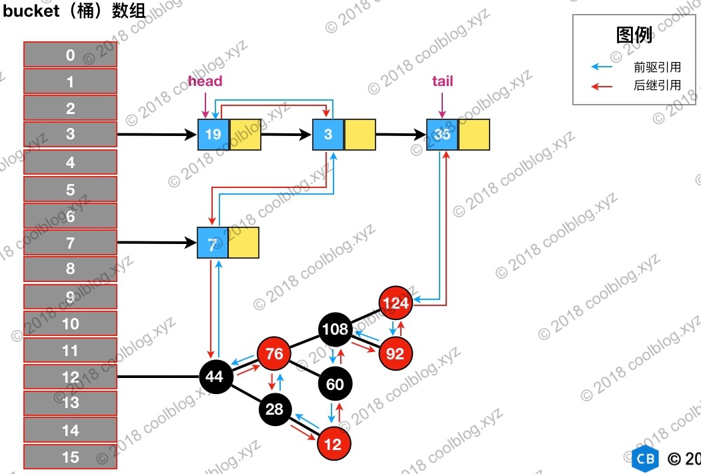

上图中，淡蓝色的箭头表示前驱引用，红色箭头表示后继引用。每当有新键值对节点插入，新节点最终会接在 tail 引用指向的节点后面。而 tail 引用则会移动到新的节点上，这样一个双向链表就建立起来了。

## Entry 的继承体系

继承体系结构图：

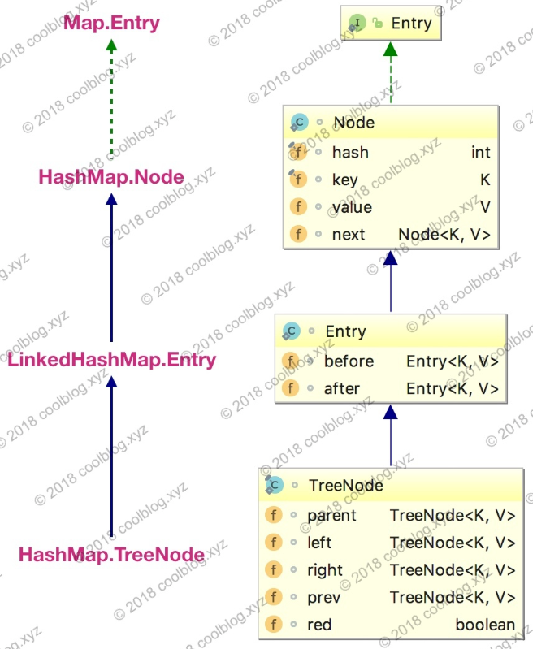

LinkedHashMap 内部类 Entry 继承自 HashMap 内部类 Node，并新增了两个引用，分别是 before 和 after。这两个引用的用途不难理解，也就是用于维护双向链表。

HashMap 的内部类 TreeNode 不继承它的了一个内部类 Node，却继承自 Node 的子类 LinkedHashMap 内部类 Entry。这里面的一个问题是：在普通的HashMap中，TreeNode并不需要组成链表的能力，为什么也要继承LinkedHashMap 内部类 Entry。原因是，一个实现较好的哈希表，Node是不太经常转为TreeNode的，也就是TreeNode的使用频率其实不高，如果TreeNode不继承LinkedHashMap 内部类 Entry，在LinkedHashMap中就要自己实现前后指针的功能了。

## 链表的建立

链表的建立过程是在插入键值对节点时开始的，初始情况下，让 LinkedHashMap 的 head 和 tail 引用同时指向新节点，链表就算建立起来了。随后不断有新节点插入，通过将新节点接在 tail 引用指向节点的后面，即可实现链表的更新。

LinkedHashMap 插入操作相关的代码：

~~~java
// HashMap 中实现
public V put(K key, V value) {
    return putVal(hash(key), key, value, false, true);
}

// HashMap 中实现
final V putVal(int hash, K key, V value, boolean onlyIfAbsent,
               boolean evict) {
    Node<K,V>[] tab; Node<K,V> p; int n, i;
    if ((tab = table) == null || (n = tab.length) == 0) {...}
    // 通过节点 hash 定位节点所在的桶位置，并检测桶中是否包含节点引用
    if ((p = tab[i = (n - 1) & hash]) == null) {...}
    else {
        Node<K,V> e; K k;
        if (p.hash == hash &&
            ((k = p.key) == key || (key != null && key.equals(k))))
            e = p;
        else if (p instanceof TreeNode) {...}
        else {
            // 遍历链表，并统计链表长度
            for (int binCount = 0; ; ++binCount) {
                // 未在单链表中找到要插入的节点，将新节点接在单链表的后面
                if ((e = p.next) == null) {
                    p.next = newNode(hash, key, value, null);
                    if (binCount >= TREEIFY_THRESHOLD - 1) {...}
                    break;
                }
                // 插入的节点已经存在于单链表中
                if (e.hash == hash &&
                    ((k = e.key) == key || (key != null && key.equals(k))))
                    break;
                p = e;
            }
        }
        if (e != null) { // existing mapping for key
            V oldValue = e.value;
            if (!onlyIfAbsent || oldValue == null) {...}
            afterNodeAccess(e);    // 回调方法，后续说明
            return oldValue;
        }
    }
    ++modCount;
    if (++size > threshold) {...}
    afterNodeInsertion(evict);    // 回调方法，后续说明
    return null;
}

// HashMap 中实现
Node<K,V> newNode(int hash, K key, V value, Node<K,V> next) {
    return new Node<>(hash, key, value, next);
}

// LinkedHashMap 中覆写
Node<K,V> newNode(int hash, K key, V value, Node<K,V> e) {
    LinkedHashMap.Entry<K,V> p =
        new LinkedHashMap.Entry<K,V>(hash, key, value, e);
    // 将 Entry 接在双向链表的尾部
    linkNodeLast(p);
    return p;
}

// LinkedHashMap 中实现
private void linkNodeLast(LinkedHashMap.Entry<K,V> p) {
    LinkedHashMap.Entry<K,V> last = tail;
    tail = p;
    // last 为 null，表明链表还未建立
    if (last == null)
        head = p;
    else {
        // 将新节点 p 接在链表尾部
        p.before = last;
        last.after = p;
    }
}
~~~

也就是说，put时节点生成和插入的动作putVal全都是在HashMap中实现的，LinkedHashMap 通过重写了newNode方法，在里面创建了节点，并插入了自己的链表中。

## 链表节点的删除

与插入操作一样，LinkedHashMap 删除操作相关的代码也是直接用父类的实现。在删除节点时，父类的删除逻辑并不会修复 LinkedHashMap 所维护的双向链表，这不是它的职责。

在删除及节点后，回调方法 afterNodeRemoval 会被调用。LinkedHashMap 覆写该方法，并在该方法中完成了移除被删除节点的操作。相关源码如下：

~~~java
// HashMap 中实现
public V remove(Object key) {
    Node<K,V> e;
    return (e = removeNode(hash(key), key, null, false, true)) == null ?
        null : e.value;
}

// HashMap 中实现
final Node<K,V> removeNode(int hash, Object key, Object value,
                           boolean matchValue, boolean movable) {
    Node<K,V>[] tab; Node<K,V> p; int n, index;
    if ((tab = table) != null && (n = tab.length) > 0 &&
        (p = tab[index = (n - 1) & hash]) != null) {
        Node<K,V> node = null, e; K k; V v;
        if (p.hash == hash &&
            ((k = p.key) == key || (key != null && key.equals(k))))
            node = p;
        else if ((e = p.next) != null) {
            if (p instanceof TreeNode) {...}
            else {
                // 遍历单链表，寻找要删除的节点，并赋值给 node 变量
                do {
                    if (e.hash == hash &&
                        ((k = e.key) == key ||
                         (key != null && key.equals(k)))) {
                        node = e;
                        break;
                    }
                    p = e;
                } while ((e = e.next) != null);
            }
        }
        if (node != null && (!matchValue || (v = node.value) == value ||
                             (value != null && value.equals(v)))) {
            if (node instanceof TreeNode) {...}
            // 将要删除的节点从单链表中移除
            else if (node == p)
                tab[index] = node.next;
            else
                p.next = node.next;
            ++modCount;
            --size;
            afterNodeRemoval(node);    // 调用删除回调方法进行后续操作
            return node;
        }
    }
    return null;
}

// LinkedHashMap 中覆写
void afterNodeRemoval(Node<K,V> e) { // unlink
    LinkedHashMap.Entry<K,V> p =
        (LinkedHashMap.Entry<K,V>)e, b = p.before, a = p.after;
    // 将 p 节点的前驱后后继引用置空
    p.before = p.after = null;
    // b 为 null，表明 p 是头节点
    if (b == null)
        head = a;
    else
        b.after = a;
    // a 为 null，表明 p 是尾节点
    if (a == null)
        tail = b;
    else
        a.before = b;
}
~~~

删除逻辑：

* 根据 hash 定位到桶位置
* 遍历链表或调用红黑树相关的删除方法
* 从 LinkedHashMap 维护的双链表中移除要删除的节点

假如我们要删除下图键值为 3 的节点：

根据 hash 定位到该节点属于3号桶，然后在对3号桶保存的单链表进行遍历。找到要删除的节点后，先从单链表中移除该节点。如下：

然后再双向链表中移除该节点：

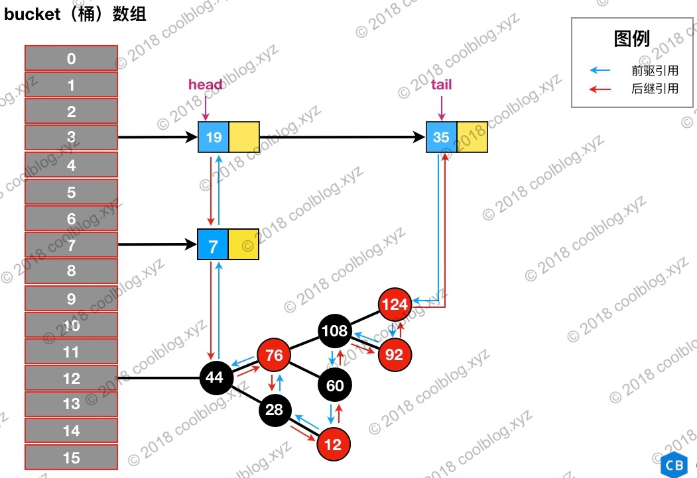

## 按访问顺序维护链表

默认情况下，LinkedHashMap 是按插入顺序维护链表。不过我们可以在初始化 LinkedHashMap，指定 accessOrder 参数为 true，即可让它按访问顺序维护链表。当我们调用get/getOrDefault/replace等方法时，只需要将这些方法访问的节点移动到链表的尾部，后续即可按照访问顺序遍历链表：

~~~java
// LinkedHashMap 中覆写
public V get(Object key) {
    Node<K,V> e;
    if ((e = getNode(hash(key), key)) == null)
        return null;
    // 如果 accessOrder 为 true，则调用 afterNodeAccess 将被访问节点移动到链表最后
    if (accessOrder)
        afterNodeAccess(e);
    return e.value;
}

// LinkedHashMap 中覆写
void afterNodeAccess(Node<K,V> e) { // move node to last
    LinkedHashMap.Entry<K,V> last;
    if (accessOrder && (last = tail) != e) {
        LinkedHashMap.Entry<K,V> p =
            (LinkedHashMap.Entry<K,V>)e, b = p.before, a = p.after;
        p.after = null;
        // 如果 b 为 null，表明 p 为头节点
        if (b == null)
            head = a;
        else
            b.after = a;

        if (a != null)
            a.before = b;
        /*
         * 这里存疑，父条件分支已经确保节点 e 不会是尾节点，
         * 那么 e.after 必然不会为 null，不知道 else 分支有什么作用
         */
        else
            last = b;

        if (last == null)
            head = p;
        else {
            // 将 p 接在链表的最后
            p.before = last;
            last.after = p;
        }
        tail = p;
        ++modCount;
    }
}
~~~

假设我们访问下图键值为3的节点，访问前结构为：

访问后，键值为3的节点将会被移动到双向链表的最后位置，其前驱和后继也会跟着更新。访问后的结构如下：

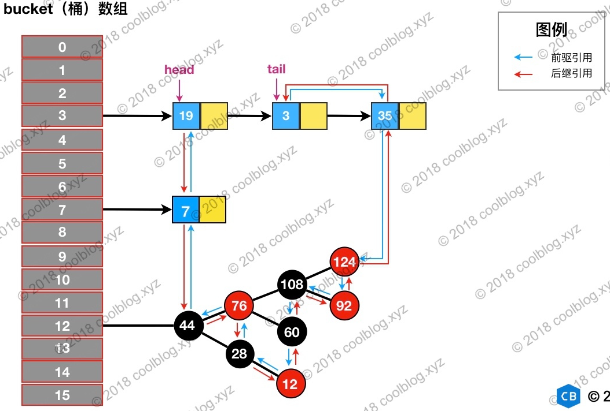

## 实现缓存

在插入元素时，会调用afterNodeInsertion方法：

~~~java
void afterNodeInsertion(boolean evict) { // possibly remove eldest
    LinkedHashMap.Entry<K,V> first;
    // 根据条件判断是否移除最近最少被访问的节点
    if (evict && (first = head) != null && removeEldestEntry(first)) {
        K key = first.key;
        removeNode(hash(key), key, null, false, true);
    }
}

// 移除最近最少被访问条件之一，通过覆盖此方法可实现不同策略的缓存
protected boolean removeEldestEntry(Map.Entry<K,V> eldest) {
    return false;
}
~~~

上面的代码就是就是通过一些条件，判断是否移除最近最少被访问的节点，默认是不移除的。

当我们基于 LinkedHashMap 实现缓存时，通过覆写removeEldestEntry方法可以实现自定义策略的 LRU 缓存。比如我们可以根据节点数量判断是否移除最近最少被访问的节点，或者根据节点的存活时间判断是否移除该节点等。本节所实现的缓存是基于判断节点数量是否超限的策略。在构造缓存对象时，传入最大节点数。当插入的节点数超过最大节点数时，移除最近最少被访问的节点。实现代码如下：

~~~java
public class SimpleCache<K, V> extends LinkedHashMap<K, V> {

    private static final int MAX_NODE_NUM = 100;

    private int limit;

    public SimpleCache() {
        this(MAX_NODE_NUM);
    }

    public SimpleCache(int limit) {
        // 必须指定按照访问顺序维护链表
        super(limit, 0.75f, true);
        this.limit = limit;
    }

    public V save(K key, V val) {
        return put(key, val);
    }

    public V getOne(K key) {
        return get(key);
    }

    public boolean exists(K key) {
        return containsKey(key);
    }

    /**
     * 判断节点数是否超限
     * @param eldest
     * @return 超限返回 true，否则返回 false
     */
    @Override
    protected boolean removeEldestEntry(Map.Entry<K, V> eldest) {
        return size() > limit;
    }
}
~~~

# ConcurrentHashMap

## JDK1.7

### 存储结构

Java 7 中 ConcurrentHashMap 的存储结构如上图，ConcurrnetHashMap 由很多个 Segment 组合，而每一个 Segment 是一个类似于 HashMap 的结构，所以每一个 HashMap 的内部可以进行扩容。但是 Segment 的个数一旦初始化就不能改变，默认 Segment 的个数是 16 个，你也可以认为 ConcurrentHashMap 默认支持最多 16 个线程并发。

Segment 的个数一但初始化就不能改变

### 初始化

无参构造中调用了有参构造：

~~~java
    /**
     * Creates a new, empty map with a default initial capacity (16),
     * load factor (0.75) and concurrencyLevel (16).
     */
    public ConcurrentHashMap() {
        this(DEFAULT_INITIAL_CAPACITY, DEFAULT_LOAD_FACTOR, DEFAULT_CONCURRENCY_LEVEL);
    }
~~~

无参构造中调用了有参构造，传入了三个参数的默认值，他们的值是 ：

~~~java
    /**
     * 默认初始化容量
     */
    static final int DEFAULT_INITIAL_CAPACITY = 16;

    /**
     * 默认负载因子
     */
    static final float DEFAULT_LOAD_FACTOR = 0.75f;

    /**
     * 默认并发级别
     */
    static final int DEFAULT_CONCURRENCY_LEVEL = 16;
~~~

有参构造函数的内部实现逻辑：

~~~java
@SuppressWarnings("unchecked")
public ConcurrentHashMap(int initialCapacity,float loadFactor, int concurrencyLevel) {
    // 参数校验
    if (!(loadFactor > 0) || initialCapacity < 0 || concurrencyLevel <= 0)
        throw new IllegalArgumentException();
    // 校验并发级别大小，大于 1<<16，重置为 65536
    if (concurrencyLevel > MAX_SEGMENTS)
        concurrencyLevel = MAX_SEGMENTS;
    // Find power-of-two sizes best matching arguments
    // 2的多少次方
    int sshift = 0;
    int ssize = 1;
    // 这个循环可以找到 concurrencyLevel 之上最近的 2的次方值
    while (ssize < concurrencyLevel) {
        ++sshift;
        ssize <<= 1;
    }
    // 记录段偏移量
    this.segmentShift = 32 - sshift;
    // 记录段掩码
    this.segmentMask = ssize - 1;
    // 设置容量
    if (initialCapacity > MAXIMUM_CAPACITY)
        initialCapacity = MAXIMUM_CAPACITY;
    // c = 容量 / ssize ，默认 16 / 16 = 1，这里是计算每个 Segment 中的类似于 HashMap 的容量
    int c = initialCapacity / ssize;
    if (c * ssize < initialCapacity)
        ++c;
    int cap = MIN_SEGMENT_TABLE_CAPACITY;
    //Segment 中的类似于 HashMap 的容量至少是2或者2的倍数
    while (cap < c)
        cap <<= 1;
    // create segments and segments[0]
    // 创建 Segment 数组，设置 segments[0]
    Segment<K,V> s0 = new Segment<K,V>(loadFactor, (int)(cap * loadFactor),
                         (HashEntry<K,V>[])new HashEntry[cap]);
    Segment<K,V>[] ss = (Segment<K,V>[])new Segment[ssize];
    UNSAFE.putOrderedObject(ss, SBASE, s0); // ordered write of segments[0]
    this.segments = ss;
}
~~~

Java 7 中 ConcurrnetHashMap 的初始化逻辑 ：

* 必要参数校验。
* 校验并发级别 concurrencyLevel 大小，如果大于最大值，重置为最大值。无参构造默认值是 16.
* 寻找并发级别 concurrencyLevel 之上最近的 2 的幂次方值，作为初始化容量大小，默认是 16。
* 记录 segmentShift 偏移量，这个值为【容量 = 2 的N次方】中的 N，在后面 Put 时计算位置时会用到。默认是 32 - sshift = 28.
* 记录 segmentMask，默认是 ssize - 1 = 16 -1 = 15.
* 初始化 segments[0]，默认大小为 2，负载因子 0.75，扩容阀值是 2*0.75=1.5，插入第二个值时才会进行扩容。

### put方法

查看put方法源码：

~~~java
/**
 * Maps the specified key to the specified value in this table.
 * Neither the key nor the value can be null.
 *
 * 
 The value can be retrieved by calling the <tt>get</tt> method
 * with a key that is equal to the original key.
 *
 * @param key key with which the specified value is to be associated
 * @param value value to be associated with the specified key
 * @return the previous value associated with <tt>key</tt>, or
 *         <tt>null</tt> if there was no mapping for <tt>key</tt>
 * @throws NullPointerException if the specified key or value is null
 */
public V put(K key, V value) {
    Segment<K,V> s;
    if (value == null)
        throw new NullPointerException();
    int hash = hash(key);
    // hash 值无符号右移 28位（初始化时获得），然后与 segmentMask=15 做与运算
    // 其实也就是把高4位与segmentMask（1111）做与运算
    int j = (hash >>> segmentShift) & segmentMask;
    if ((s = (Segment<K,V>)UNSAFE.getObject          // nonvolatile; recheck
         (segments, (j << SSHIFT) + SBASE)) == null) //  in ensureSegment
        // 如果查找到的 Segment 为空，初始化
        s = ensureSegment(j);
    return s.put(key, hash, value, false);
}

/**
 * Returns the segment for the given index, creating it and
 * recording in segment table (via CAS) if not already present.
 *
 * @param k the index
 * @return the segment
 */
@SuppressWarnings("unchecked")
private Segment<K,V> ensureSegment(int k) {
    final Segment<K,V>[] ss = this.segments;
    long u = (k << SSHIFT) + SBASE; // raw offset
    Segment<K,V> seg;
    // 判断 u 位置的 Segment 是否为null
    if ((seg = (Segment<K,V>)UNSAFE.getObjectVolatile(ss, u)) == null) {
        Segment<K,V> proto = ss[0]; // use segment 0 as prototype
        // 获取0号 segment 里的 HashEntry<K,V> 初始化长度
        int cap = proto.table.length;
        // 获取0号 segment 里的 hash 表里的扩容负载因子，所有的 segment 的 loadFactor 是相同的
        float lf = proto.loadFactor;
        // 计算扩容阀值
        int threshold = (int)(cap * lf);
        // 创建一个 cap 容量的 HashEntry 数组
        HashEntry<K,V>[] tab = (HashEntry<K,V>[])new HashEntry[cap];
        if ((seg = (Segment<K,V>)UNSAFE.getObjectVolatile(ss, u)) == null) { // recheck
            // 再次检查 u 位置的 Segment 是否为null，因为这时可能有其他线程进行了操作
            Segment<K,V> s = new Segment<K,V>(lf, threshold, tab);
            // 自旋检查 u 位置的 Segment 是否为null
            while ((seg = (Segment<K,V>)UNSAFE.getObjectVolatile(ss, u))
                   == null) {
                // 使用CAS 赋值，只会成功一次
                if (UNSAFE.compareAndSwapObject(ss, u, null, seg = s))
                    break;
            }
        }
    }
    return seg;
}
~~~

上面的源码分析了 ConcurrentHashMap 在 put 一个数据时的处理流程，下面梳理下具体流程。

* 计算要 put 的 key 的位置，获取指定位置的 Segment。

* 如果指定位置的 Segment 为空，则初始化这个 Segment.

  初始化 Segment 流程：

  * 检查计算得到的位置的 Segment 是否为null.
  * 为 null 继续初始化，使用 Segment[0] 的容量和负载因子创建一个 HashEntry 数组。
  * 再次检查计算得到的指定位置的 Segment 是否为null.
  * 使用创建的 HashEntry 数组初始化这个 Segment.
  * 自旋判断计算得到的指定位置的 Segment 是否为null，使用 CAS 在这个位置赋值为 Segment.

* Segment.put 插入 key,value 值。

初始化 Segment 的过程中，判断了多次Segment 是否为null，这是因为这时可能有其他线程进行了初始化操作

Segment.put方法 ：

~~~java
final V put(K key, int hash, V value, boolean onlyIfAbsent) {
    // 获取 ReentrantLock 独占锁，获取不到，scanAndLockForPut 获取。
    HashEntry<K,V> node = tryLock() ? null : scanAndLockForPut(key, hash, value);
    V oldValue;
    try {
        HashEntry<K,V>[] tab = table;
        // 计算要put的数据位置
        int index = (tab.length - 1) & hash;
        // CAS 获取 index 坐标的值
        HashEntry<K,V> first = entryAt(tab, index);
        for (HashEntry<K,V> e = first;;) {
            if (e != null) {
                // 检查是否 key 已经存在，如果存在，则遍历链表寻找位置，找到后替换 value
                K k;
                if ((k = e.key) == key ||
                    (e.hash == hash && key.equals(k))) {
                    oldValue = e.value;
                    if (!onlyIfAbsent) {
                        e.value = value;
                        ++modCount;
                    }
                    break;
                }
                e = e.next;
            }
            else {
                // first 有值没说明 index 位置已经有值了，有冲突，链表头插法。
                if (node != null)
                    node.setNext(first);
                else
                    node = new HashEntry<K,V>(hash, key, value, first);
                int c = count + 1;
                // 容量大于扩容阀值，小于最大容量，进行扩容
                if (c > threshold && tab.length < MAXIMUM_CAPACITY)
                    rehash(node);
                else
                    // index 位置赋值 node，node 可能是一个元素，也可能是一个链表的表头
                    setEntryAt(tab, index, node);
                ++modCount;
                count = c;
                oldValue = null;
                break;
            }
        }
    } finally {
        unlock();
    }
    return oldValue;
}
~~~

由于 Segment 继承了 ReentrantLock，所以 Segment 内部可以很方便的获取锁，put 流程就用到了这个功能：

* tryLock() 获取锁，获取不到使用 scanAndLockForPut 方法继续获取。这里就是获取 ReentrantLock 独占锁

* 计算 put 的数据要放入的 index 位置，然后获取这个位置上的 HashEntry 。

* 遍历 put 新元素，为什么要遍历？因为这里获取的 HashEntry 可能是一个空元素，也可能是链表已存在，所以要区别对待。

  如果这个位置上的 HashEntry 不存在：

  * 如果当前容量大于扩容阀值，小于最大容量，进行扩容。
  * 直接头插法插入。

  如果这个位置上的 HashEntry 存在：

  * 判断链表当前元素 key 和 hash 值是否和要 put 的 key 和 hash 值一致。一致则替换值
  * 不一致，获取链表下一个节点，直到发现相同进行值替换，或者链表表里完毕没有相同的。如果当前容量大于扩容阀值，小于最大容量，进行扩容。直接链表头插法插入。

* 如果要插入的位置之前已经存在，替换后返回旧值，否则返回 null.

scanAndLockForPut方法：

~~~java
private HashEntry<K,V> scanAndLockForPut(K key, int hash, V value) {
    HashEntry<K,V> first = entryForHash(this, hash);
    HashEntry<K,V> e = first;
    HashEntry<K,V> node = null;
    int retries = -1; // negative while locating node
    // 自旋获取锁
    while (!tryLock()) {
        HashEntry<K,V> f; // to recheck first below
        if (retries < 0) {
            if (e == null) {
                if (node == null) // speculatively create node
                    node = new HashEntry<K,V>(hash, key, value, null);
                retries = 0;
            }
            else if (key.equals(e.key))
                retries = 0;
            else
                e = e.next;
        }
        else if (++retries > MAX_SCAN_RETRIES) {
            // 自旋达到指定次数后，阻塞等到只到获取到锁
            lock();
            break;
        }
        else if ((retries & 1) == 0 &&
                 (f = entryForHash(this, hash)) != first) {
            e = first = f; // re-traverse if entry changed
            retries = -1;
        }
    }
    return node;
}
~~~

这个方法做的操作就是不断的自旋 tryLock() 获取锁。当自旋次数大于指定次数时，使用 lock() 阻塞获取锁。在自旋时顺表获取下 hash 位置的 HashEntry。

### 扩容rehash

ConcurrentHashMap 的扩容只会扩容到原来的两倍。老数组里的数据移动到新的数组时，位置要么不变，要么变为 index+ oldSize，参数里的 node 会在扩容之后使用链表头插法插入到指定位置。

~~~java
private void rehash(HashEntry<K,V> node) {
    HashEntry<K,V>[] oldTable = table;
    // 老容量
    int oldCapacity = oldTable.length;
    // 新容量，扩大两倍
    int newCapacity = oldCapacity << 1;
    // 新的扩容阀值 
    threshold = (int)(newCapacity * loadFactor);
    // 创建新的数组
    HashEntry<K,V>[] newTable = (HashEntry<K,V>[]) new HashEntry[newCapacity];
    // 新的掩码，默认2扩容后是4，-1是3，二进制就是11。
    int sizeMask = newCapacity - 1;
    for (int i = 0; i < oldCapacity ; i++) {
        // 遍历老数组
        HashEntry<K,V> e = oldTable[i];
        if (e != null) {
            HashEntry<K,V> next = e.next;
            // 计算新的位置，新的位置只可能是不便或者是老的位置+老的容量。
            int idx = e.hash & sizeMask;
            if (next == null)   //  Single node on list
                // 如果当前位置还不是链表，只是一个元素，直接赋值
                newTable[idx] = e;
            else { // Reuse consecutive sequence at same slot
                // 如果是链表了
                HashEntry<K,V> lastRun = e;
                int lastIdx = idx;
                // 新的位置只可能是不便或者是老的位置+老的容量。
                // 遍历结束后，lastRun 后面的元素位置都是相同的
                for (HashEntry<K,V> last = next; last != null; last = last.next) {
                    int k = last.hash & sizeMask;
                    if (k != lastIdx) {
                        lastIdx = k;
                        lastRun = last;
                    }
                }
                // ，lastRun 后面的元素位置都是相同的，直接作为链表赋值到新位置。
                newTable[lastIdx] = lastRun;
                // Clone remaining nodes
                for (HashEntry<K,V> p = e; p != lastRun; p = p.next) {
                    // 遍历剩余元素，头插法到指定 k 位置。
                    V v = p.value;
                    int h = p.hash;
                    int k = h & sizeMask;
                    HashEntry<K,V> n = newTable[k];
                    newTable[k] = new HashEntry<K,V>(h, p.key, v, n);
                }
            }
        }
    }
    // 头插法插入新的节点
    int nodeIndex = node.hash & sizeMask; // add the new node
    node.setNext(newTable[nodeIndex]);
    newTable[nodeIndex] = node;
    table = newTable;
}
~~~

### get方法

get 方法只需要两步：

* 计算得到 key 的存放位置。
* 遍历指定位置查找相同 key 的 value 值

~~~java
public V get(Object key) {
    Segment<K,V> s; // manually integrate access methods to reduce overhead
    HashEntry<K,V>[] tab;
    int h = hash(key);
    long u = (((h >>> segmentShift) & segmentMask) << SSHIFT) + SBASE;
    // 计算得到 key 的存放位置
    if ((s = (Segment<K,V>)UNSAFE.getObjectVolatile(segments, u)) != null &&
        (tab = s.table) != null) {
        for (HashEntry<K,V> e = (HashEntry<K,V>) UNSAFE.getObjectVolatile
                 (tab, ((long)(((tab.length - 1) & h)) << TSHIFT) + TBASE);
             e != null; e = e.next) {
            // 如果是链表，遍历查找到相同 key 的 value。
            K k;
            if ((k = e.key) == key || (e.hash == h && key.equals(k)))
                return e.value;
        }
    }
    return null;
}
~~~

## JDK1.8

### 存储结构

Java8 的 ConcurrentHashMap 相对于 Java7 来说变化比较大，不再是之前的 Segment 数组 + HashEntry 数组 + 链表，而是 Node 数组 + 链表 / 红黑树。当冲突链表达到一定长度时，链表会转换成红黑树。

### 初始化

主要是通过initTable 方法：

~~~java
/**
 * Initializes table, using the size recorded in sizeCtl.
 */
private final Node<K,V>[] initTable() {
    Node<K,V>[] tab; int sc;
    while ((tab = table) == null || tab.length == 0) {
        //　如果 sizeCtl < 0 ,说明另外的线程执行CAS 成功，正在进行初始化。
        if ((sc = sizeCtl) < 0)
            // 让出 CPU 使用权
            Thread.yield(); // lost initialization race; just spin
        else if (U.compareAndSwapInt(this, SIZECTL, sc, -1)) {
            try {
                if ((tab = table) == null || tab.length == 0) {
                    int n = (sc > 0) ? sc : DEFAULT_CAPACITY;
                    @SuppressWarnings("unchecked")
                    Node<K,V>[] nt = (Node<K,V>[])new Node<?,?>[n];
                    table = tab = nt;
                    sc = n - (n >>> 2);
                }
            } finally {
                sizeCtl = sc;
            }
            break;
        }
    }
    return tab;
}
~~~

从源码中可以发现 ConcurrentHashMap 的初始化是通过自旋和 CAS 操作完成的。里面需要注意的是变量 sizeCtl ，它的值决定着当前的初始化状态。

* -1 说明正在初始化
* -N 说明有N-1个线程正在进行扩容
* 表示 table 初始化大小，如果 table 没有初始化
* 表示 table 容量，如果 table　已经初始化。

### put方法

put方法：

~~~java
public V put(K key, V value) {
    return putVal(key, value, false);
}

/** Implementation for put and putIfAbsent */
final V putVal(K key, V value, boolean onlyIfAbsent) {
    // key 和 value 不能为空
    if (key == null || value == null) throw new NullPointerException();
    int hash = spread(key.hashCode());
    int binCount = 0;
    for (Node<K,V>[] tab = table;;) {
        // f = 目标位置元素
        Node<K,V> f; int n, i, fh;// fh 后面存放目标位置的元素 hash 值
        if (tab == null || (n = tab.length) == 0)
            // 数组桶为空，初始化数组桶（自旋+CAS)
            tab = initTable();
        else if ((f = tabAt(tab, i = (n - 1) & hash)) == null) {
            // 桶内为空，CAS 放入，不加锁，成功了就直接 break 跳出
            if (casTabAt(tab, i, null,new Node<K,V>(hash, key, value, null)))
                break;  // no lock when adding to empty bin
        }
        else if ((fh = f.hash) == MOVED)
            tab = helpTransfer(tab, f);
        else {
            V oldVal = null;
            // 使用 synchronized 加锁加入节点
            synchronized (f) {
                if (tabAt(tab, i) == f) {
                    // 说明是链表
                    if (fh >= 0) {
                        binCount = 1;
                        // 循环加入新的或者覆盖节点
                        for (Node<K,V> e = f;; ++binCount) {
                            K ek;
                            if (e.hash == hash &&
                                ((ek = e.key) == key ||
                                 (ek != null && key.equals(ek)))) {
                                oldVal = e.val;
                                if (!onlyIfAbsent)
                                    e.val = value;
                                break;
                            }
                            Node<K,V> pred = e;
                            if ((e = e.next) == null) {
                                pred.next = new Node<K,V>(hash, key,
                                                          value, null);
                                break;
                            }
                        }
                    }
                    else if (f instanceof TreeBin) {
                        // 红黑树
                        Node<K,V> p;
                        binCount = 2;
                        if ((p = ((TreeBin<K,V>)f).putTreeVal(hash, key,
                                                       value)) != null) {
                            oldVal = p.val;
                            if (!onlyIfAbsent)
                                p.val = value;
                        }
                    }
                }
            }
            if (binCount != 0) {
                if (binCount >= TREEIFY_THRESHOLD)
                    treeifyBin(tab, i);
                if (oldVal != null)
                    return oldVal;
                break;
            }
        }
    }
    addCount(1L, binCount);
    return null;
}
~~~

put方法步骤：

* 根据 key 计算出 hashcode 。
* 判断是否需要进行初始化。
* 即为当前 key 定位出的 Node，如果为空表示当前位置可以写入数据，利用 CAS 尝试写入，失败则自旋保证成功。
* 如果当前位置的 hashcode == MOVED == -1,则需要进行扩容。
* 如果都不满足，则利用 synchronized 锁写入数据。
* 如果数量大于 TREEIFY_THRESHOLD 则要执行树化方法，在 treeifyBin 中会首先判断当前数组长度≥64时才会将链表转换为红黑树。

### get方法

~~~java
public V get(Object key) {
    Node<K,V>[] tab; Node<K,V> e, p; int n, eh; K ek;
    // key 所在的 hash 位置
    int h = spread(key.hashCode());
    if ((tab = table) != null && (n = tab.length) > 0 &&
        (e = tabAt(tab, (n - 1) & h)) != null) {
        // 如果指定位置元素存在，头结点hash值相同
        if ((eh = e.hash) == h) {
            if ((ek = e.key) == key || (ek != null && key.equals(ek)))
                // key hash 值相等，key值相同，直接返回元素 value
                return e.val;
        }
        else if (eh < 0)
            // 头结点hash值小于0，说明正在扩容或者是红黑树，find查找
            return (p = e.find(h, key)) != null ? p.val : null;
        while ((e = e.next) != null) {
            // 是链表，遍历查找
            if (e.hash == h &&
                ((ek = e.key) == key || (ek != null && key.equals(ek))))
                return e.val;
        }
    }
    return null;
}
~~~

get 过程：

* 根据 hash 值计算位置。
* 查找到指定位置，如果头节点就是要找的，直接返回它的 value.
* 如果头节点 hash 值小于 0 ，说明正在扩容或者是红黑树，查找之。
* 如果是链表，遍历查找之。

Java8 中的 ConcurrentHashMap 使用的 Synchronized 锁加 CAS 的机制。结构也由 Java7 中的 Segment 数组 + HashEntry 数组 + 链表 进化成了 Node 数组 + 链表 / 红黑树，Node 是类似于一个 HashEntry 的结构。它的冲突再达到一定大小时会转化成红黑树，在冲突小于一定数量时又退回链表。

Synchronized 锁自从引入锁升级策略后，性能不再是问题