# String类型

在redis中除了少数用来打印日志信息的字符串，其他字符串都是以SDS的形式存储的，SDS的全称是simple dynamic string。

## SDS的定义

SDS的定义如下：

~~~c
struct sdshdr{
	//SDS保存的字符串的长度
	int len;
	//buf数组中未使用的字节数量
	int free;
	//用于保存字符串的字节数组，可能存在一部分未使用空间
	char buf[];
} sdshdr;
~~~

下图就是一个存有字符串Redis的SDS：

free值是5代表数组中有5个字节未被使用，数组中的字符串以空字符\0结尾，len值代表字符串的真正长度，不包括空字符。存在空字符的好处在于，这样处理后的SDS在底层和c字符串几乎一样，所以可以直接重用一部分C字符串函数库里面的函数。

## 与C字符串的对比

### 常数复杂度获取字符串长度

C字符串不记录长度信息，所以为了获取字符串长度就必须遍历整个字符串，这个操作的复杂度为ON，而SDS可以根据len字段立即获得字符串长度，这确保了获取字符串长度不会成为redis的性能瓶颈。

### 杜绝缓冲区溢出

C字符串不记录自身长度可能会导致缓冲区溢出的情况出现，比如在没有考虑分配空间的情况下对字符串进行拼接操作，新生成的字符串可能很大，大到覆盖了周围的有用数据。而SDS在修改时，首先会检查SDS的空间是否满足修改的要求，如果不满足的话会进行空间扩展，不会有溢出问题出现。

### 内存分配策略

C的字符串每次改变时，都会对保存字符串的数组进行一次内存重分配操作，如果是增长字符串就是重分配来扩展空间，这个过程可能产生缓冲区溢出；如果是缩短字符串就是重分配来缩小空间，如果不释放空间就会产生内存泄露。

内存重分配涉及系统调用，是一个比较耗时的操作，在一般的程序中，不频繁的内存重分配是可以接受的，但是在redis需要的速度比较严苛，为了克服这种缺陷，SDS通过free这个字段来降低内存分配的次数，主要从两个方面改善：

1、空间预分配：每次增加字符串长度的时候，SDS不会分配一个正好大小的字符数组，而是分配的稍大一点，以便未来的增长操作不会触发内存重分配。

如果修改SDS后，SDS的len小于1MB，那么此时SDS会分配与len相同的空闲空间，如修改后SDS的len是13字节，那么free也是13字节，整个SDS的buf数组实际长度是13+13+1=27字节。

如果修改SDS后，SDS的len大于等于1MB，那么程序会分配1MB的未使用空间。

2、惰性空间释放：当SDS执行缩短操作时，程序不立即使用内存重分配来回收缩短的字节，而是使用free将这些字节的数量记录下来，以备将来使用。SDS也有对应的API来释放真正的未使用空间，不用担心造成空间浪费。

### 二进制安全

C字符串中的字符必须符合某种编码，除了字符串的末尾外字符串内部不能有空字符，这使得C字符串只能保存文本数据。而redis中的SDS是二进制安全的，可以保存非文本数据，它保存的是一系列二进制数据，SDS通过检查len来判断字符串是否结束，所以没有空字符的限制。

### 总结：C字符串和SDS对比

# 链表

redis中的list类型有时会采用链表的形式存储。

链表的每一个节点定义如下：

~~~c
typedef struct listNode{
    //前置节点
	struct listNode *prev;
    //后置节点
	struct listNode *next;
    //节点的值
	void *value;
} listNode;
~~~

链表的整体定义如下：

~~~c
typedef struct list{
    //表头节点
	listNode *head;
    //表尾节点
	listNode *tail;
    //链表所包含的节点数量
	unsigned long len;
    //三个函数：分别是节点值复制函数、节点值释放函数、节点值对比函数
	void *(*dup)(void *ptr);
	void (*free)(void *ptr);
	int (*match)(void *ptr,void *key);
} list;
~~~

一个链表例子如下：

redis中的链表是一个双端无环链表，带有长度计数器，用void类型来保存节点值使链表可以保存多种不同类型的值。

# 字典

在redis中，整个数据库就是一个巨大的字典，所有的数据都有键来对应。hash类型有时也会采取字典来表示，字典中每一个键都是独一无二的。

## 定义

哈希表节点定义如下：

~~~c
typedef struct dictEntry{
    //键值对中的键
	void *key;
    //键值对中的值，可以是一个指针，或者uint64_t整数，或int64_t整数
	union{
		void *val;
		uint64_t u64;
		int64_t s64;
	} v;
    //指向下一个哈希表节点的指针，它的存在是为了应对哈希冲突的
	struct dicEntry *next;
} dictEntry;
~~~

哈希表定义：

~~~c
typedef struct dictht{
    //哈希表节点数组
	dicEntry **table;
    //哈希表的大小
	unsigned long size;
    //哈希表大小掩码，用于计算索引值，总是等于size-1
	unsigned long sizemask;
    //哈希表已有的节点数量
	unsigned long used;
} dictht;
~~~

下图表示一个两个相同键连接在一起的哈希表：

字典定义：

~~~c
typedef struct dict{
	//这两个字段都是为了多态设置的，对应处理不同类型的函数和参数
	dictType *type;
	void *privdata;
	//两个哈希表，一个是正在使用的，一个是为了rehash而用的
	dicht ht[2];
	//rehash索引，不进行rehash时值为-1
	int rehashidx;
}
~~~

下图表示一个没有进行rehash的字典：

## 哈希算法

当一个新的键值要添加到字典中时，需要首先调用type中的函数来计算hash值：

~~~c
hash = dict->type->hashFunction(key);
~~~

计算hash值的算法是MurmurHash2算法，它的特点在于即使输入有规律的键也会给出很好的随机分布性，且计算速度非常快。

然后hash值与掩码（size-1）相与，得到索引值：

~~~
index = hash & dict->ht[x].sizemask;
~~~

如果有两个或以上的键被分配到了哈希表数组的同一个索引上就会触发hash冲突，redis使用链地址法来解决hash冲突，将多个哈希节点连接在哈希节点数组的一个位置，为了速度考虑，redis总是将新节点添加到链表的表头位置，旧节点连接在后面。

## rehash算法

随着操作的不断执行，哈希表的负载因子可能会很高或者很低，为了保证它维持在合理的范围内，需要对哈希表的大小进行相应的扩展和收缩。这些扩展和收缩都可以通过执行rehash来完成，执行rehash的步骤如下：

1、为字典的ht[1]哈希表分配空间，如果是扩展操作，那么新哈希表大小为第一个大于等于ht[0].used*2（旧哈希表已经使用的部分乘2）的2的n次幂；如果是收缩操作，那么新哈希表大小为第一个大于等于ht[0].used的2的n次幂。（如原哈希表大小为4，现在要扩大，则扩大到8，因为8是大于等于4\*2的第一个2的n次幂）

2、将保存在ht[0]中的所有键值对都重新计算hash值和索引值，放入ht[1]中。

3、释放ht[0]的空间，将ht[1]设置为ht[0]，并在ht[1]处创建一个空白哈希表，为下一次rehash做准备。

## rehash的时机

当下列条件中的任何一个被满足时，程序会自动开始执行扩展：

1、服务器目前没有执行bgsave命令或bgrewriteaof命令，且哈希表的负载因子大于等于1.

2、服务器目前正在执行bgsave命令或者bgrewriteaof命令，且哈希表的负载因子大于等于5.

当执行bgsave命令或者bgrewriteaof命令时，redis需要创建当前服务器进程的子进程，尽可能避免在这个时候进行哈希表扩展操作。

当哈希表的负载因子小于0.1时，程序就会自动对哈希表执行收缩操作。

## 渐进式rehash

进行rehash时，从ht[0]中的数据移动到ht[1]中这个过程不是一次性完成的，而是分多次，渐进式完成的。

当哈希表中的数据量很大的时候，一次性进行rehash可能会造成服务器在一段时间内停止服务，所以redis采用渐进式rehash。

渐进式rehash的步骤如下：

1、rehash未开始时，字典的rehashidx字段值为-1，开始rehash后，该值被设置为0.

2、每次对字典执行增删改查操作时，程序除了执行指定的操作外，还会将ht\[0][rehashidx]位置的所有键值对都转移到ht[1]中，转移完成后rehashidx++。

3、随着操作的不断执行，最终所有的键值对都rehash完成，此时将rehashidx设置为-1，rehash结束。

由此可见，渐进式rehash把一次性的操作分散到每次增删改查，避免了卡顿。

在渐进式rehash期间，删除和更新的操作都同时在两个哈希表中进行，如果是查找操作会先在旧字典ht[0]中查找，找不到再去ht[1]中查找。如果是新增数据则会直接新增在ht[1]中。

# 跳跃表

## 概述

在redis中跳跃表是有序集合sorted set的底层实现之一。跳跃表通过在每个节点中维持多个指向其他节点的指针，从而达到快速访问节点的目的。支持平均OlogN、最坏ON复杂度的节点查找，还可以通过顺序性操作来批量处理节点。

redis的链表由两种结构组成，一个是结点zskiplistNode，一个是表zskiplist。下图为一个跳表例子：

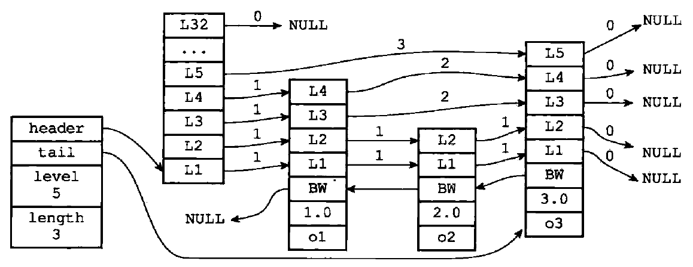

最左边就是一个zskiplist，它包括header（指向跳跃表的表头节点）、tail（指向跳跃表的表尾节点）、level（当前跳跃表的最大层数）、length（跳跃表的长度，也就是数据节点的数量）。

右侧是4个zskiplistNode，它有几个属性：

1、层level，也就是L1/L2/../L4等，每个层都有两个属性，分别是指针（指向表尾方向的其他节点）、跨度（记录跨度方向两点的距离），当从表头向表尾遍历跳表时，就会借助前进指针。

2、后退指针BW，它用来指向当前节点的前一个节点，在从表尾向表头遍历跳表时，就会借助后退指针。

3、分值：每个节点中的1.0、2.0、3.0。节点按照分值从小到大排列。

4、成员对象obj：o1、o2和o3，它是节点保存的值。

## 定义

zskiplistNode的定义如下：

~~~c
typedef struct zskiplistNode{
	//层
	struct zskiplistLevel{
        //前进指针
		struct zskiplistNode *forward;
        //跨度
		unsigned int span;
	} level[];
    //后退指针
	struct zskiplistNode *backward;
    //分值
	double score;
    //成员对象
	robj *obj;
} zskiplistNode;
~~~

每次生成一个新跳跃表节点的时候，程序都会自动生成一个介于1到32之间的值作为level数组的大小，这个大小就是层的高度，每一层的晋升概率是25%，这是一个更偏于扁平的跳表。

span跨度这个字段是为了计算某个元素的排位rank使用的，在查找某个节点的过程中，将沿途访问的所有层的跨度都累加起来，得到的结果就是目标节点在跳跃表中的排位。

obj是一个指向SDS的指针，在同一个跳表中，各节点保存的对象obj必须是唯一的，而分值score可以是相同的，分值相同的节点会按照对象obj的字典序大小来进行排序。

zskiplist的定义如下：

~~~c
typedef struct zskiplist{
    //表头节点和表尾节点
	structz zskiplistNode *header, *tail;
    //表中节点的数量
	unsigned long length;
    //表中层数最大的节点的层数
	int level;
} zskiplist;
~~~

# 整数集合intset

intset是set类型的底层实现之一，当set只包含整数值元素，且数量不多时就会采用intset形式存储。

intset是一种用于保存整数值的集合，它可以保存类型为int16_t、int32_t、int64_t的整数值，并且保证集合中不会出现重复元素。

## 定义

intset结构定义如下：

~~~java
typedef struct intset{
	//编码方式
	uint32_t encoding;
	//集合包含元素的数量
	uint32_t length;
	//保存元素的数组
	int8_t contents[];
}
~~~

contents是用来保存整数的，其中保存的数字从小到大排列，不含任何重复项。虽然contents被声明为int8_t，但是contents却不保存任何int8_t类型的值，它的真正类型取决于encoding的值，它可以保存类型为int16_t、int32_t、int64_t的整数值。

下图代表一个保存值类型为int16_t的，元素个数为5的intset，此时数组的大小是5*16=80位。

下图代表一个保存值类型为int64_t的，元素个数为4的intset，此时数组的大小是4*64=256位。

## 升级

当把一个新元素加入intset中时，如果intset当前的类型无法满足该类型所需要的空间时，intset就会执行升级操作。如当我们往intset中存入1、3、5时，此时intset底层存储的是int16_t类型，当我们存入一个很大的数，必须用int64_t类型表达的时候，此时contents数组保存的数值类型就会全部变为int64_t的。

升级的大致步骤如下：

1、根据元素的新类型，创造新的数组空间。

2、将底层数组的所有元素都转换为新类型，然后将转换后的元素移动到新数组中，在这个过程中保持有序性质不变。

3、最后将新元素添加到底层数组。

因为要添加的新值一定是突破原来类型的，所以它要么比现有的所有元素小，要么比现有的所有元素都大，所以新元素的位置一定是在数组的开头或者末尾。

升级的好处主要有两点：

1、通过底层类型的动态调整，我们可以将不同类型的数据放入redis中，而不必保持一种类型，灵活性很强。

2、节省空间。

值得注意的是，intset没有降级操作，即使引发升级的那个新元素被删除了，底层的编码方式还是保持不变。

# 压缩列表ziplist

ziplist是hash类型和list类型在底层的实现之一。当list中只包含少量元素，且元素要么是小整数要么是短字符串时，此时list底层就采用ziplist的方式存储。当hash只保存少量键值对，而且每个键值对要么是小整数要么是短字符串时，此时hash底层就采用ziplist存储。

## 列表定义

压缩列表是redis为了节约内存而开发的，是由连续内存块组成的顺序型数据结构，一个压缩列表包含多个entry，每个entry可以保存一个字节数组或者一个整数值。

下图代表压缩列表的各组成部分和详细说明：

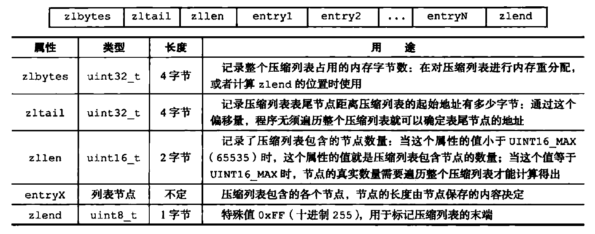

下图表示了一个压缩列表示例：

zlbytes的值是80，代表压缩列表的总长为80字节；zltail的值是60，代表从起始指针p开始偏移60，就能找到最后一个entry的位置；zllen的值是3，代表压缩列表有3个节点。

## entry定义

entry分为三个部分：

previous_entry_length以字节为单位记录了前一个节点的长度，如果前一个节点的长度小于254字节，那么该字段就占1字节的空间，前一节点的长度就保存在这个字节中；如果前一个节点的长度大于等于254字节，那么该字段的就占5字节的空间，其中属性的第一个字节被设置为0xFE，也就是十进制254，之后的四个字节则用于保存前一个节点的长度。压缩列表根据这个字段就可以很轻松的从表尾节点遍历到表头节点。

encoding属性记录了节点保存的数据类型和长度，entry可以保存字节数组和整数，encoding的具体含义和content中保存的值的关系如下：

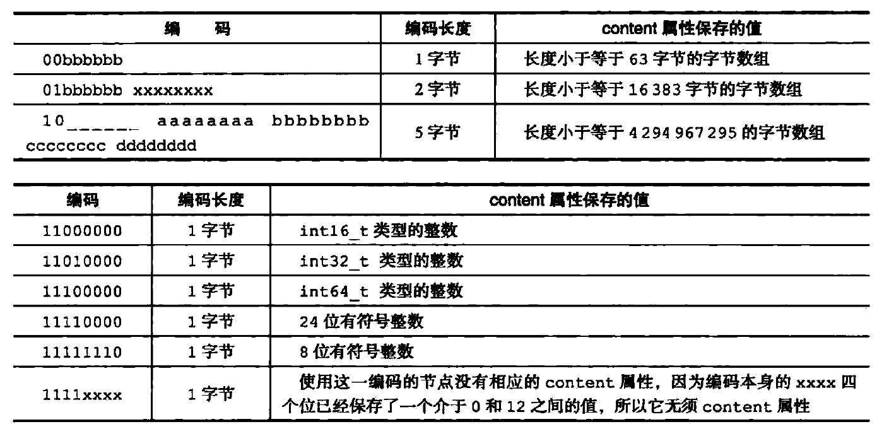

其中开头为11代表存的是整数，开头为00、01、10分别代表不同长度的字节数组，字节数组的具体长度由去掉前两位的编码来表示。如00001011中的00代表content中是一个长度小于等于63字节的字节数组，该数组的具体长度是001011，也就是11.

## 级联更新

级联更新是现有压缩列表构造的一个弊端。

这个弊端源于previous_entry_length属性的设定，这个属性可能占1字节，也可能占5字节，实际占用空间大小和前一个节点大小有关。如果在某个位置新插入一个较大的节点，或者删除一个大节点后的节点，可能就会导致后面节点的previous_entry_length属性由1字节变成5字节，而因为该属性的改变也会导致该entry大小的改变，从而可能引发该entry大于等于254字节，进而导致后面的entry大小继续改变。这个改变可能会波及到整个压缩列表，所以称之为级联更新。

级联更新在最坏情况下需要对压缩列表执行N次空间重分配操作，每次重分配的复杂度是ON，级联更新最坏复杂度为ON方。

虽然级联更新存在，但是出现概率很低，几乎可以忽略不计。

# 对象

redis中所有数据都是以对象的形式存在的，而不是直接使用之前提到过的各种数据结构，使用对象的好处主要有几点：

1、可以很方便的判断对象的类型，进而判断是否可以执行给定的命令。

2、一个类型可以使用不同的底层结构，切换起来很灵活，优化对象在不同场景下的使用效率。

3、基于对象系统，引入了内存回收机制和对象共享机制。

## 对象的类型和编码

redis中的对象定义如下：

~~~c
typedef struct redisObject{
	//类型
	unsigned type:4;
	//编码
	unsigned encoding:4;
	//指向底层数据结构的指针
	void *ptr;
	
	...
}
~~~

当我们在redis中定义了一个键值对时，我们此时是定义了两个对象，分别是键对象和值对象，在redis中，键对象中是字符串类型的。

type属性记录了对象的类型，如下表所示：

当我们对一个键执行type命令时，实际上返回的是值对象的类型：

~~~react
type msg
~~~
type命令的返回值如下：

encoding属性记录了对象所使用的编码，也就是对象使用的底层数据结构是什么，这个概念要和数据类型区分开来，因为一个类型的对象可能会有多种不同的编码方式。编码方式如下：

不同类型和编码的关系如下，每种类型的对象都至少使用了两种不同的编码：

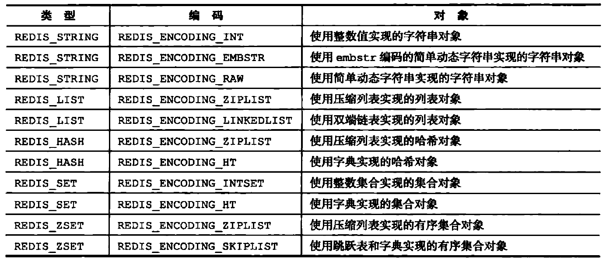

使用object encoding命令可以查看一个值对象的编码类型：

~~~
object encoding msg
~~~

该命令的返回值和编码类型的对应关系如下：

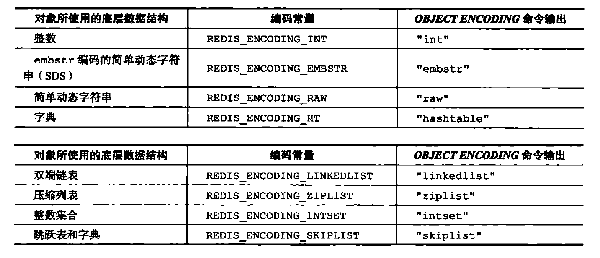

## 字符串对象

字符串对象不仅会单独存在，而且会在其他对象中被引用，字符串对象是redis五种类型的对象中唯一一个会被其他4种类型对象嵌套的对象。

### 编码方式

字符串对象的编码可以是int、embstr和raw。

当一个字符串对象保存的是整数值，且这个值可以用long类型来表示时，此时ptr就直接指向一个long类型的整数，此时的编码方式就是int。

如果一个字符串对象保存的是一个字符串值，且长度大于32字节，那么字符串对象将使用SDS来保存该值，此时的编码方式就是raw。

如果一个字符串对象保存的是一个字符串值，且长度小于等于32字节，那么字符串对象将使用embstr的方式来保存这个字符串值。embstr编码是一种用于保存短字符串的优化方式，它和SDS一样使用sdshdr类来表示字符串，但是和raw不同的是，embstr将对象和字符串放在一块连续的空间表示，而不是将其分开：

这种方式使得内存分配和释放变得更方便，而且速度更快。

值得注意的是，redis在存储小数时会先将其转换为字符串值，然后再保存，使用时也是先取出字符串，然后将其转换为小数。

### 编码的转换

对于int编码的字符串对象，如果我们执行了一些命令将其修改为非整数值，那么它就会转换编码为raw。

而redis没有设置对embstr的修改程序，embstr编码的字符串是只读的，当我们对这种编码的字符串做出任何修改命令时，都会导致其编码变为raw，然后再执行对应的修改命令。

### 字符串命令的实现

字符串命令在不同编码下的实现如下：

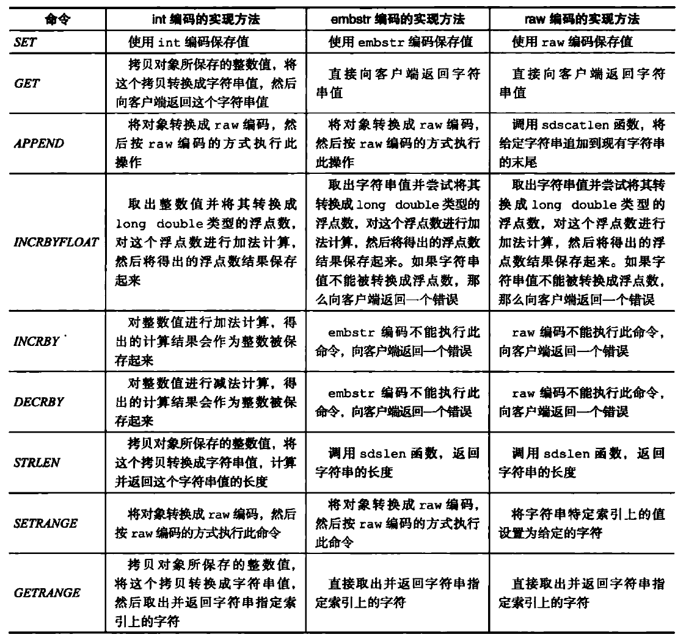

## 列表list对象

### 编码方式

对于list类型来说，redis可能使用压缩列表或者双端链表来实现，当元素较少时，使用紧凑的压缩列表速度较快且节约内存；当元素较多时，压缩列表的优势逐渐消失，redis转而使用更适合存储大量数据的双端链表来实现list类型。

使用压缩列表表示list时，压缩列表的每个entry表示list的一个元素：

使用链表表示list时，链表的每个节点都表示list的一个元素：

### 编码的转换

当list对象同时满足以下两个条件时就使用ziplist编码，否则就使用linkedlist：

1、列表对象保存的所有字符串元素的长度都小于64字节

2、列表对象保存的元素数量小于512个

这两个限值可以在配置文件中修改。

### 列表命令的实现

列表命令在不同编码下的实现如下：

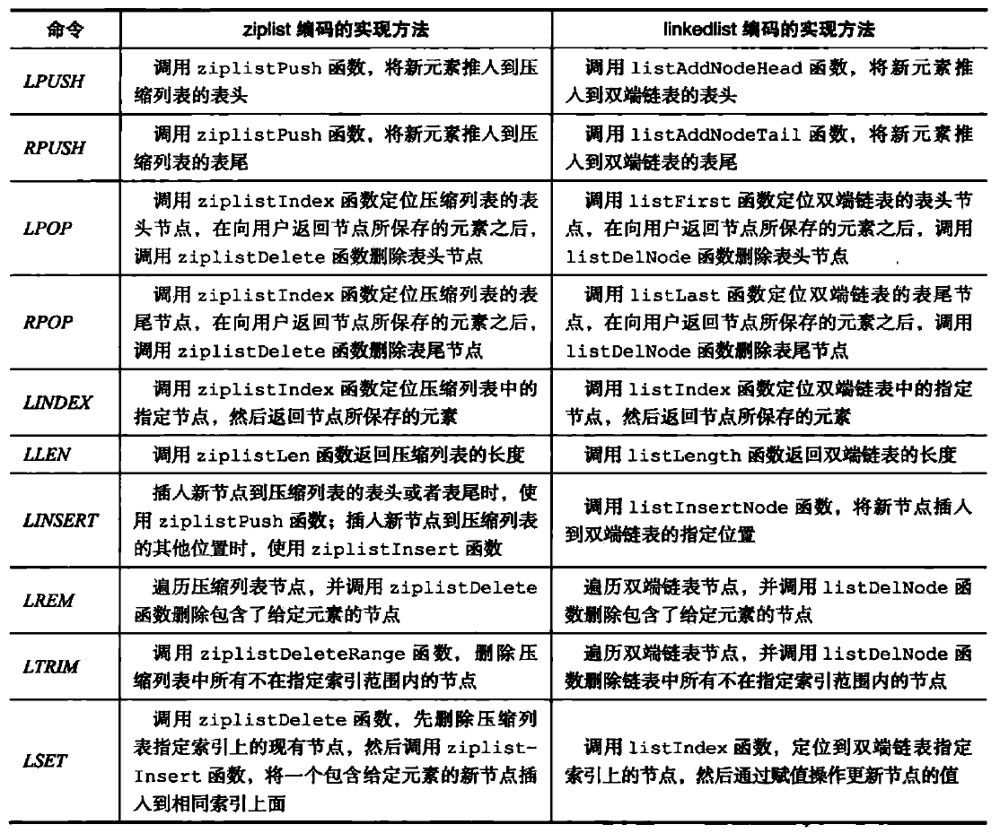

## 哈希对象

### 编码方式

hash对象的编码方式有ziplist和hashtable两种。

当hash对象采用压缩列表的形式表示时，插入一个键值对实际上是往压缩列表的表尾方向插入两个entry，保存键的entry在前，保存值的entry在后，具体实现如下图所示：

当hash对象采用hashtable的形式表示时，类似下图：

### 编码的转换

当哈希对象同时满足以下两个条件时，就会使用ziplist编码，否则使用hashtable：

1、哈希对象保存的键值对的键和值的字符串长度都小于64字节。

2、哈希对象保存的键值对数量小于512个。

这两个限值可以在配置文件中修改。

### 哈希命令的实现

哈希命令在不同编码下的实现如下：

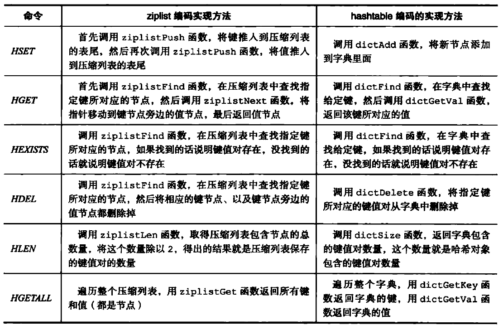

## 集合set对象

### 编码方式

set对象的编码方式有两种：intset和hashtable。

当set对象使用intset表示时，存储set中元素的就是intset的底层数组：

当set对象使用hashtable表示时，字典的每个哈希节点的键就是set中元素的值，哈希节点的值全部置为null：

### 编码的转换

当同时满足以下两个条件时，set对象使用intset存储，否则就使用hashtable：

1、set中保存的元素都是整数值。

2、set保存的元素数量不超过512个。（这个参数可以在配置文件中调整）

### 集合命令的实现

集合命令在不同编码下的实现：

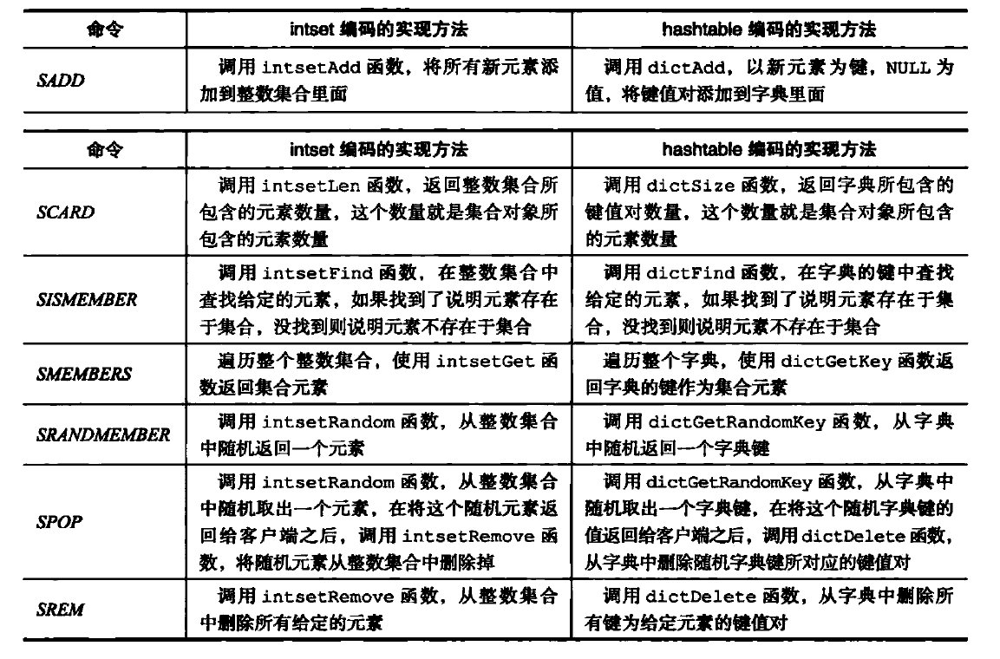

## 有序集合sorted set对象

### 编码方式

sorted set对象的编码方式有两种，分别是ziplist和skiplist。

当有序集合用ziplist来实现时，压缩列表用两个相邻的entry来表示成员member和分值score，且列表内的结合元素按分值从小到大进行排序，分值较小的被放置到靠近表头的方向：

当有序集合用skiplist来实现时，底层同时包含一个跳表和一个字典：

~~~c
typedef struct zset{
	zskiplist *zsl;
	dict *dict;
} zset;
~~~
跳表中的每个节点都保存了数据，其中节点的object属性保存了成员member，节点的score属性保存了分值，跳表主要用来完成范围型操作。字典的作用是建立成员member到分值score的映射，字典节点的键保存了元素的成员，值保存了元素的分值。

有序集合的skiplist编码之所以同时采取了两种底层表示方法，原因是redis要保持高效的操作，采取两种表示方法可以兼顾两者的优点，跳表适合执行范围型操作，而字典则用来支持根据成员查找分值，两种结构缺一不可，表示方法大致如下：

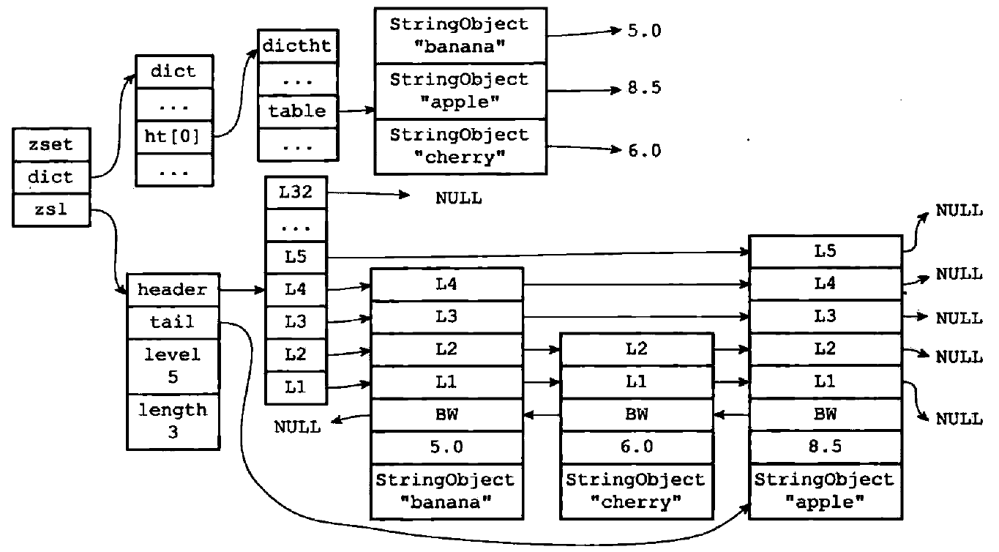

这里的底层虽然采取了两种结构，但是字典和跳表会共享元素的成员的分值，不会造成内存浪费。

### 编码的转换

当满足以下两个条件时，有序集合会采用ziplist编码，否则使用skiplist。

1、有序集合保存的元素数量小于128个。

2、有序集合保存的所有元素成员的长度都小于64字节。

### 有序集合命令的实现

有序集合命令在不同编码下的实现：

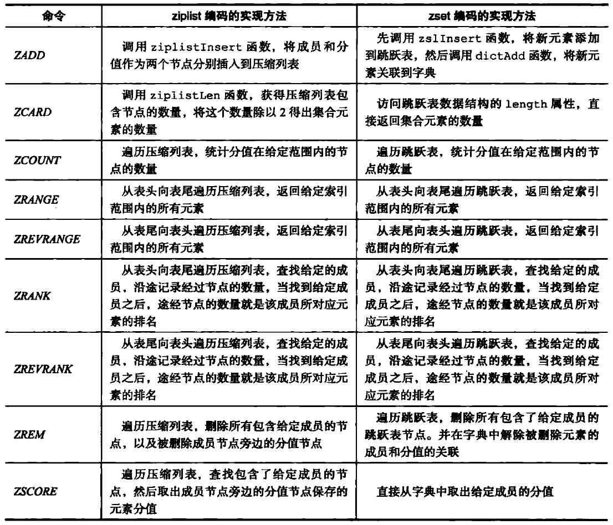

## 类型检查和多态命令

redis中的操作键的基本命令分为两种，第一种是可以对任何键都执行的命令，如del、rename等；第二种是只能对某一特定类型的键执行的命令，如set、get、hset、hget等。

在执行特定命令时需要进行类型检查，类型检查是通过redisObject类的type属性来实现的，如果检查合格则执行，如果不合格则报错。

在执行命令时涉及多态的概念，这里的多态有两个层次，第一个层次是命令可以处理不同类型的键，第二个层次是对于一个类型，命令可以根据编码的不同调整执行方式，类型和编码分别根据redisObject类的type和encoding属性来检查，如llen命令的执行：

## 内存回收和对象共享

redis建立了一个引用计数机制来完成内存回收。在redisObject类中有一个int属性refcount，它代表了引用当前对象的计数值，当创建一个新对象时，该值被置为1，当该值变为0时，对象所占用的内存会被释放。

redis通过refcount属性来完成对象共享功能，例如，如果同时让键A和键B都指向值为100的字符串对象，那么该字符串对象的refcount就是2，这样只要值一样，redis中只需要保存一份对象内存，只需要改变对象的refcount属性就行了。我们可以用object refcount命令来查看引用计数：

~~~
object refcount A
~~~
如果我们在检查引用计数之前设置A的值：

~~~
set A 100
~~~

那么引用计数则会返回2，这是因为除了键A以外，服务器程序也持有了该值对象。

目前redis会在初始化服务器时直接创建了0到9999的1万个字符串对象，当需要用到的时候直接使用这些共享对象，而不需要创建。（初始化创建共享字符串对象的数量可以通过配置文件来修改）

要注意的是redis目前只对字符串类型的对象实行共享操作，一些更复杂的对象因为检查是否相同消耗的时间太长，所以redis放弃了其他类型的对象共享。

## 对象的空转时长

redisObject有一个unsigned类型的属性lru，该属性记录了对象最后一次被命令程序访问的时间，用object idletime这个命令可以返回某个键的空转时长，空转时长等于当前时间减去键对象的lru的值。（object idletime命令不会刷新lru）

空转时长的重要应用是在redis的内存淘汰策略中被使用，有时空转时间较高的那部分键会优先被服务器释放。

# 数据库

## 服务器中的数据库

redis的数据都保存在服务器的redisServer结构中，它其中有一个redisDb类型的属性*db，它保存着服务器中所有的数据库，初始化服务器时，程序会根据redisServer结构中的int类型属性dbnum来决定创建多少个数据库，它的默认值是16，所以db会指向一个大小为16的数组，每个数组都是一个数据库，数据库的类型是redisDb。

~~~c
struct redisServer{
	//数据库数组
	redisDb *db;
	//数据库数量
	int dbnum;
	...
}
~~~

默认情况下redis客户端操作的是0号数据库，客户端可以通过select命令来切换数据库，如：

~~~
select 2
~~~

redis客户端中的关键结构是redisClient，它有一个指向redisDb的指针*db，表示当前客户端正在使用的数据库，select命令的本质就是调整该指针的指向。

切换完成后客户端会在输入符旁边提示当前所使用的目标数据库，当使用其他语言来操控redis时要注意切换数据库的问题，因为此时并没有任何提示信息来指示当前使用的是什么数据库，甚至也没有直接返回数据库号的命令，所以当执行重大命令时，如flushdb，最好先执行一个select命令，保证命令执行在正确的数据库。

redisDb中有一个dict类型的属性*dict，它保存了该数据库中的所有键值对，这个字典被称为键空间key space。

在执行命令时我们不仅需要读取和修改键空间的数据，还要对键空间进行额外的维护工作，如更新LRU时间、懒惰删除、记录脏数据信息、引发通知功能等。

## 生存时间和过期时间

### 相关命令

我们可以使用expire命令来设置键的生存时间：

~~~
expire key 5
~~~

设置完毕后5秒该键就会过期。pexpire和这个命令类似，但是是用毫秒作为单位的。

expireat命令可以给键以秒时间戳的方式设置一个过期时间：

~~~
expireat key 1377257300
~~~

pexpireat和这个命令类似，但是它是用毫秒时间戳为单位的。

expire、pexpire、expireat和pexpireat最终在底层都会执行pexpireat命令。

ttl命令和pttl命令可以返回一个键的剩余生存时间，分别以秒和毫秒位单位。

persist命令可以移除一个键的过期时间。

### 过期字典

redisDb结构的expires字典保存了数据库中所有键的过期时间，这个字典被称为过期字典。

过期字典的哈希节点有键和值，键是一个指针，指向键空间中的某个键对象，值就是一个long long类型的整数，这个整数保存了这个键对象的过期时间，它是一个毫秒精度的时间戳。

以上的命令都是通过检查过期字典的值来评价键对象是否过期的，persist命令可以在过期字典中查找给定的键，并且解除键和值在过期字典中的关联。

## 删除策略

在redis中一个键过期了通常不会立即删除，因为立即执行删除虽然可以尽快的释放内存，但是同一时间过期键很多的时候，会对CPU产生很大的压力，影响服务器的正常业务。redis采用定期删除和惰性删除相结合的方式来完成过期键的删除。

惰性删除的意思就是程序只有在取出键的时候才会对其进行过期检查，不会在无关的过期键上浪费时间，它非常节约CPU资源，但是容易导致运行一段时间后无内存可用，因此我们需要定期删除来辅助。

定期删除每隔一段时间就会执行一次删除过期键操作，通过控制删除的频率和执行时长来尽量避免对CPU的影响。

### 惰性删除的实现

在读写数据库的redis命令执行前都会调用懒惰删除的函数，如果键已经过期就会将其从数据库中删除，如果还未过期就不做处理。它就像一个过滤器，在命令真正执行之前，过滤掉过期的输入键。对应键是否存在，不同的命令也有不同的处理方式，调用懒惰删除expireIfNeeded函数的过程如下：

### 定期删除的实现

每当redis的服务器周期性操作serverCron函数执行时，就会调用定期删除的函数。

定期删除会在规定的时间内分多次遍历服务器中的各个数据库，从过期字典中默认抽查20个键，删除其中过期的键。

## 数据库通知

获取0号数据库中对message键执行的所有命令：

~~~
subscribe _ _keyspace@0_ _:message
~~~

执行后会持续监控对这个键执行的所有命令，第一个通常是订阅信息，第二个信息开始就是其他命令了。

这种关注某个键执行了什么命令的通知被称为键空间通知，还有一种通知关注某个命令被什么键执行了，这类通知被称为键事件通知，如获取0号数据库中所有执行del命令的键：

~~~
subscribe _ _keyevent@0_ _:del
~~~

结果中第一个通常是订阅信息，第二个信息开始就是执行该命令的键名了。

服务器可以配置发送什么类型的通知，以及监控的通知的键的类型等。

通知的实现是通过在各种命令的执行过程中进行判断，如果满足通知要求就调用通知函数。

# RDB持久化

redis中的内容可以通过RDB持久化保存在磁盘中，RDB文件是一个经过压缩的二进制文件，通过该文件可以还原生成该文件对应的redis数据库。RDB持久化可以通过命令手动执行，也可以根据配置定期执行。

## RDB文件的创建与载入

save命令和bgsave命令都可以生成RDB文件，前者会造成服务器进程的阻塞，在此期间服务器不能处理任何请求，后者不会造成阻塞，会派生出一个子进程来负责创建RDB文件。

在bgsave命令执行期间，客户端发送的save命令会被服务器拒绝，这是服务器在避免父进程和子进程同时进行磁盘写入产生竞争条件。且在bgsave命令执行期间，客户端发送的bgsave命令也会被拒绝，同样是为了避免产生竞争条件。

bgsave命令和bgrewriteaof两个命令不能同时执行：如果在执行bgsave的时候执行了bgrewriteaof，那么该命令会被延迟到bgsave执行完毕后执行；如果在执行bgrewriteaof的过程中客户端发送执行bgsave的请求，那么服务器会拒绝执行bgsave命令。这是因为服务器为了性能考虑，避免两个写入磁盘操作的命令执行。

RDB文件的载入是在服务器启动时自动执行的，redis没有专门用于载入RDB文件的命令，在载入过程中服务器会一直处于阻塞状态直到载入完成。因为AOF文件的更新频率较高，所以如果服务器开启了AOF持久化功能，那么服务器会优先使用AOF文件来还原数据库状态，如果没有开启AOF持久化功能，服务器才会使用RDB文件来还原数据库状态。

## 自动保存RDB文件

服务器可以通过在redis.conf文件中加入如下配置来设置自动保存RDB：

~~~
save 900 1
save 300 10
save 60 10000
~~~

表示服务器只要满足如下三个条件中的任意一个就会自动执行bgsave命令：

1、服务器在900秒之内对数据库进行了至少1次修改

2、服务器在300秒之内对数据库进行了至少10次修改

3、服务器在60秒之内对数据库进行了至少10000次修改

在redisServer结构中有一个saveparam类型的数组，该类型包含了save的保存条件，对应上面的两个参数：

~~~c
struct saveparam{
	//秒数
	time_t seconds;
	//修改数
	int changes;
};
~~~

在redisServer结构中维护着两个相关的属性：

~~~c
struct redisServer{
	//修改计数器
	long long dirty;
	//上一次执行保存的时间
	time_t lastsave;
}
~~~

当服务器每对数据库修改一次，dirty计数器就会加1。lastsave属性记录了服务器上次执行保存操作的日期时间戳。

在redis中有一个服务器周期性操作函数，它默认每隔100毫秒就会执行一次，它的其中一个功能就是检查save选项设置的条件是否满足。具体方法是遍历saveparam数组，相当于检查每一个save设置，根据lastsave计算得到距离上次保存操作的秒数，如果该数值大于save设置中的seconds，且修改器大于save设置中的changes，就执行besave命令。

## RDB文件结构

RDB文件结构大致如下：

REDIS是固定的5个字节，是RDB文件的标识。

db_version长4个字节，代表一个整数，它是RDB文件的版本号，这里介绍的是第6版RDB文件的结构，也就是0006

databases部分包括零个或多个数据库，如果一个数据库为空那么它就不会出现在这里。

EOF为1字节，标志着RDB文件正文内容的结束。

check_sum是一个8字节长的无符号整数，保存着一个校验和，它是程序通过计算签名四个部分的内容得出的，用于判断RDB文件是否完整。

### databases部分

如果服务器中的0号和3号数据库非空，那么服务器的RDB文件大致如下：

每个非空数据库的结构如下：

SELECTDB是一个1字节的常量，它代表一个新的数据库部分的开始。

db_number代表数据库号。

key_value_pairs保存了数据库中的所有键值对。

### key_value_pairs部分

这部分可能有两种结构，第一种是不带过期时间的键值对，第二种是带有过期时间的键值对。

不带过期时间的键值对结构如下：

TYPE记录了value的类型，是下面几种常量的其中一个：

每一种类型都代表了一种底层编码。

key总是一个字符串对象，value的类型根据TYPE的不同来解释。

带有过期时间的键值对结构如下：

EXPIRETIME_MS是一个长度为1字节的常量，它告知程序接下来将读入一个以毫秒为时间单位的过期时间。

ms是一个8字节长的带符号整数，记录着一个以毫秒位单位的时间戳。

### value部分

value部分的类型不同，保存方法也不同。

#### 字符串对象

TYPE的值如果后缀为STRING，那么value保存的就是字符串对象。

如果字符串对象的编码是REDIS_ENCODING_INT，说明对象中保存的是长度不超过32位的整数，此时应该这样表示：

REDIS_RDB_ENC_INT8代表编码方式为使用8位来保存整数，同样的有INT16、INT32。

如果字符串的编码是REDIS_ENCODING_RAW，说明对象保存的是字符串值，如果该字符串长度小于等于20字节，那么字符串会被原样保存；如果字符串长度大于20字节，会被压缩之后保存。（如果redis关闭了压缩功能，那么就只能无压缩）

无压缩的字符串分为两个部分保存，一个是字符串长度，一个是字符串本身：

压缩的字符串保存形式如下：

第一个字段是一个常量，代表该字符串已经被LZF算法压缩过了。

compressed_len是字符串被压缩后的长度，origin_len是字符串原来的长度，compressed_string是被压缩后的字符串。

#### 列表对象

TYPE的值如果后缀为LIST，那么value对应的就是一个REDIS_ENCODING_LINKEDLIST编码的列表对象，这种对象的结构如下：

第一个字段代表列表的长度，后面代表列表项，每一个列表项都是一个字符串对象。如下面就是一个包含三个元素的列表：

#### 集合对象

TYPE的值如果后缀是SET，那么value对应的就是一个REDIS_ENCODING_HT编码的集合对象，这种对象的结构如下：

第一个字段代表集合的大小，后面是各元素，每一个元素都是字符串对象，这种表示方式和列表很像。

#### 哈希表对象

TYPE的值如果后缀是HASH，那么value对应的就是一个REDIS_ENCODING_HT编码的哈希对象，这种对象的结构如下：

结构中的每个键值对都紧挨着，如下面就是一个包含两个键值对的哈希表：

#### 有序集合对象

TYPE的值如果后缀是ZSET，那么value就是一个REDIS_ENCODING_SKIPLIST编码的有序集合对象，这种对象结构如下：

每个元素的成员和分值都紧挨在一起，如下面就是带有两个元素的有序集合：

#### INTSET编码的集合

如果TYPE的值后缀为INTSET，那么value保存的就是整数集合对象，redis会先把整数集合转换为字符串对象，然后将字符串对象保存在RDB文件中。

#### ZIPLIST编码的列表、哈希表、有序集合

如果TYPE的值后缀为ZIPLIST，那么value保存的就是一个压缩列表对象，RDB文件会先把压缩列表转换成字符串对象，然后把字符串对象保存在RDB文件中。列表、哈希、有序集合三种类型都可以使用压缩列表在存储，所以在载入RDB文件的过程中，会根据不同的类型还原成对应的类型。

# AOF持久化

AOF持久化通过保存redis服务器执行的写命令来记录数据库状态的，因为redis中的命令请求协议是纯文本协议，所以AOF文件是一个纯文本文件，可以直接打开分析。在AOF文件中不仅有修改服务器的命令，默认还会有select命令来确定具体哪个数据库。

## AOF持久化的过程

AOF持久化的实现分为三个步骤：命令追加、文件写入、文件同步。

当AOF持久化功能处于开启状态时，服务器在执行完一个写命令之后，就会以协议的形式将写命令追加到服务器的AOF缓冲区，它是在redisServer类中的一个sds类型的缓冲区。

服务器每次结束一个事件循环之前，都会调用一个函数检查是否要将缓冲区中的内容写入和保存到AOF文件中，这个函数的行为和配置文件中关于AOF的设置有关，在redis.conf中，可以设置以下三种中的任一种：

~~~
appendfsync always
appendfsync everysec
appendfsync no
~~~

函数和对应配置产生的不同行为如下：

这里注意，文件的写入和同步是两个不同的操作，写入时会将数据暂时保存在一个内存缓冲区中，等到缓冲区被占满或者超过指定的期限才会真正写入磁盘中，这种做法提高了效率，但也带来了数据不安全的隐患，系统提供了fsync和fdatasync函数来强制让操作系统将缓冲区中的内容同步到磁盘上。

appendfsync的设置中，always让数据最安全，但是效率最低；no效率最高，但数据安全性较差；everysec比较折中，它也是默认设置。

## AOF文件的载入和数据还原

读取AOF文件并还原数据库状态的详细步骤如下：

1、创建一个不带网络连接的伪客户端，因为redis的命令只能是客户端发送给服务器的，现在要让一个AOF文件作为为客户端来执行其中的写命令。

2、把AOF文件中的命令逐个取出并执行，直到所有命令都处理完毕。

## AOF重写

随着服务器运行，AOF文件会越来越大，此时就需要进行AOF重写，新的AOF文件要比原来的文件要小。

AOF重写的原理很简单，就是读取当前服务器中的数据信息，然后将数据信息尽可能用一条命令来记录，用合并后的一条命令替代原来的多条命令。如对于一个包含六个元素的列表对象，之前可能是经过多次写命令才达到现在的状态，而现在只需要执行一条添加命令即可，当元素数量很多时，会自动执行多条添加指令。

redis在子进程中执行AOF重写，这样服务器进程就能在重写AOF期间继续处理其他请求，而且子进程会获得服务器进程的数据副本，避免使用锁的前提下保证数据的安全性。

子进程在进行AOF重写的时候，服务器还需要继续处理命令请求，redis服务器设置了AOF缓冲区和AOF重写缓冲区，每次都要把命令追加到这两个缓冲区，AOF缓冲区中的内容会根据配置写入和同步到现有的AOF文件，而当AOF重写完成后，子进程会向父进程发送一个信号，父进程执行以下工作：

1、将AOF重写缓冲区中的内容写入新AOF文件中。

2、将新AOF文件原子地覆盖现有的AOF文件。

整个AOF重写过程只有信号处理函数执行会对服务器进程造成阻塞，其他时候都不会造成阻塞。

# 事件

redis服务器是一个事件驱动程序，服务器需要处理以下两类事件：文件事件和时间事件。

文件事件是服务器对套接字操作的抽象，是服务器和客户端通信产生的操作；时间事件是服务器需要在给定的时间点执行的操作。

## 文件事件

文件事件处理器有四个组成部分，分别是套接字、I/O多路复用程序、文件事件分派器以及事件处理器：

I/O多路复用程序负责监听多个套接字，并向文件事件分派器传送产生了事件的套接字。在I/O多路复用程序向文件事件分派器传送套接字的过程中，是通过一个队列来完成的，所以尽管可能产生多个并发的文件事件，但是队列总是通过有序的、每次一个套接字的方式传送给文件事件分派器，然后对应的事件处理器处理完毕之后，I/O多路复用程序才会继续向文件事件分派器传送下一个套接字：

事件处理器中比较常用的几种包括：连接应答处理器（服务器初始化时会用到）、命令请求处理器、命令回复处理器。

## 时间事件

redis的时间事件分为以下两类：定时事件（指定的时间执行一次）和周期性事件（隔一段时间就执行一次）。

一个时间事件由以下三个属性组成：事件事件的全局ID（事件越新ID号越大）、记录了到达时间的毫秒时间戳when、时间处理器timeProc（事件处理时要执行的函数）。

如果时间处理器返回一个整数值，就说明该事件为周期性事件，这个整数值实际上就是周期，此时服务器会根据这个整数值对时间戳进行更新，让这个时间事件在一段时间后再次到达。

服务器将所有时间事件放在一个无序链表中，每当时间事件执行器执行时，它就遍历整个链表查找所有已达到的时间事件并执行响应的事件处理器：

这个链表会按照ID排序，无序指的是它不会按照when来排序，即使redis采用这种方式也不会有性能问题，因为redis服务器正常只有serverCron一个时间事件，在benchmark模式下也只使用两个时间事件，链表几乎退化成了指针。

将一个新的时间事件添加到服务器的函数为aeCreateTimeEvent，它接受一个毫秒数和一个时间处理器，意味着过了一段时间后执行对应的时间处理器。

### serverCron函数

它是redis最重要的一个时间事件，它的主要工作包括：

1、更新服务器的各类统计信息

2、清理数据库的过期键值对

3、关闭和清理连接失效的客户端

4、尝试进行AOF和RDB持久化

5、如果服务器是主服务器则会对从服务器进行定期同步

6、如果处于集群模式，它会对集群进行定期同步和连接测试

在redis2.6版本，serverCron函数每秒运行10次，平均每间隔100毫秒运行一次。可以通过修改配置文件中的hz选项来调整这个值。

## 事件的调度和执行

服务器需要同时对文件事件和时间事件两种事件进行调度，决定何时处理事件。

整个调度的过程可以用下列流程图表示：

redis服务器会计算具体现在最接近的时间事件，然后阻塞一定的时间，在阻塞的过程中如果有文件事件到达则处理该文件事件，处理结束后继续阻塞，直到预计的时间事件到达然后执行该时间事件。阻塞是为了避免服务器对时间事件进行频繁的轮询。

这些事件的处理都是同步、有序、原子地进行的，不会中途中断某事件，也不会对事件进行抢占，服务器会尽可能减少程序的阻塞时间。

有时会出现这样的情况，在预计的时间事件到达之前，会出现一个文件事件，执行这个文件事件稍微花了一些时间，导致时间事件比预计的要晚一些执行，如下面这种情况：

# 客户端

对于每个与服务器进行连接的客户端，服务器都为这些客户端建立了相应的redisClient结构，这个结构代表客户端状态，redis服务器状态结构的clients属性记录了所有与服务器连接的客户端的状态结构，它是一个链表，如一个服务器与三个客户端连接：

客户端状态包含的属性可以分为两类：一类是比较通用的属性，和特定功能基本不相关，一类是和特定功能相关的属性。这里主要介绍第一类属性。

## 客户端属性

### 套接字描述符

在redisClient中，int类型的fd代表对应客户端的套接字描述符。

如果fd是-1，代表该客户端为伪客户端，伪客户端处理的命令请求来源于AOF文件或Lua脚本，而不是网络。

如果fd是大于-1的整数，就代表该客户端为普通客户端。

执行下列命令可以列出所有连接到服务器的普通客户端：

~~~
client list
~~~

命令执行后会显示很多结果，包括每个服务器的fd（套接字描述符）、name（客户端名）、age（已经连接的秒数）、idle（空转秒数：距离客户端与服务器最后一次进行互动以来过去的秒数）

### 客户端名字

默认一个连接到服务器的客户端是没有名字的，需要执行下列命令来为客户端设置一个名字：

~~~
client setname 名
~~~

名字可以根据客户端的作用来自定义。

### 标志

标志属性是int类型的，名字为flags，它的值通常都是一个常量，标志属性记录了客户端的角色和客户端所处的状态，以下是一些flags属性的例子：

REDIS_MASTER代表客户端是一个主服务器。

REDIS_BLOCKED代表客户端正在被列表命令阻塞。

REDIS_MULTI | REDIS_DIRTY_CAS代表客户端正在执行事务，但事务的安全性已被破坏。

（这个值有时会用或来代表同时处于多个状态）

### 输入缓冲区

客户端的输入缓冲区是用来保存客户端发送的命令的，它的类型是sds，名字为querybuf。当客户端向服务器发送命令请求时，服务器的客户端状态的querybuf就会记录该命令的协议值，它最大不能超过1G，否则服务器就会关闭这个客户端。

### 命令和命令参数

服务器将命令请求保存在客户端状态的querybuf属性后，就会对命令内容进行分析，将分析得出的命令参数及命令参数个数保存在客户端的argv属性和argc属性，argv是一个数组类型，它的每一项都是一个字符串对象，其中第一项是要执行的命令，后面是命令的参数，而argc负责记录argv数组的长度。

如客户端发送的命令是set key value，那么argv和argc属性就分别是：

### 命令的实现函数

在得到上述属性后，服务器会根据argv[0]的值，在命令表中查找命令所对应的命令实现函数。

命令表是一个字典，输入一个SDS命令名称，就能找到一个redisCommand结构，客户端的cmd指针就会指向这个结构。至此，服务器的客户端状态已经拥有了命令参数信息、命令参数、执行命令对应的实现函数。

### 输出缓冲区

输出缓冲区用来装入服务器发回来的命令执行结果的。每个客户端都有两个输出缓冲区可用，一个是固定大小的缓冲区，一个是可变大小的缓冲区。

固定大小的缓冲区由一个名为REDIS_REPLY_CHUNK_BYTES的char数组和一个名为bufpos的int数组成，前者是一个大小为16KB的缓冲区，后者记录了该缓冲区中目前使用的字节数量。

当数组空间已经用完或者结果太大无法放入其中时，服务器就会开始使用可变大小缓冲区，可变大小缓冲区由一个reply链表组成，这个链表连接了多个字符串对象，可以保存非常长的结果。

### 身份验证

客户端状态有一个名为authenticated的int数，它用于记录客户端是否通过了验证。

如果该值是0，代表未通过验证，是1代表通过验证。如果未通过验证的客户端向服务器发送命令，那么除了auth外的所有命令服务器都会拒绝执行，只有客户端向服务器发送auth命令成功进行身份验证后，该值从0变成1，才能恢复正常。

默认只有在服务器启用了身份验证功能时才能使用，如果未启用该功能那么该值默认是0.

### 时间

客户端状态有几个和时间相关的属性：

ctime记录了创建客户端的时间、lastinteraction记录了客户端与服务器最后一次互动的时间、obuf_soft_limit_reached_time记录了输出缓冲区第一次达到软性限制soft limit的时间。

通过这三个时间，可以计算出客户端的存活时间age和空转时间idle。

## 客户端的创建和关闭

### 普通客户端的创建和关闭

客户端使用connect函数连接到服务器时，服务器就会调用连接事件处理器，为客户端建立相应的客户端状态，并将这个新的客户端状态添加到服务器状态结构clients链表的末尾。

普通客户端关闭的原因有多种：

1、客户端进程退出或被杀死

2、客户端向服务器发送了不符合协议格式的命令请求

3、对某个客户端执行client kill

4、如果用户为服务器设置了timeout配置选项，当客户端的空转时间超过timeout选项设置的值时，客户端将被关闭

5、客户端发送的命令请求超过了输入缓冲区的限制大小（默认为1GB），或命令回复超出了输出缓冲区的限制大小，客户端将被关闭

客户端的可变大小输出缓冲区理论上可以保存任意长的命令回复，为了避免回复过大，占用太多的服务器资源，服务器会时刻检查输出缓冲区的大小，相关的模式有两种：

1、硬性模式hard limit：如果输出缓冲区的大小超过了硬性模式规定的大小，那么服务器立即关闭客户端

2、软性模式soft limit：如果输出缓冲区的大小超过了软性模式规定的大小，但还没超过硬性模式限制，那么服务器将记录下obuf_soft_limit_reached_time，也就是达到软性限制的起始时间，然后继续监视客户端，如果在规定时间内不再超出软性限制那么客户端就不会被关闭，如果一直超出软性限制那么客户端就会被关闭。

在配置文件中可以设置硬性模式和软性模式的参数，以及针对的客户端类型：

~~~
不限制普通客户端的输出缓冲区：
client-output-buffer-limit normal 0 0 0
限制从服务器客户端：
client-output-buffer-limit slave 256mb 64mb 60
限制执行发布与订阅功能的客户端：
client-output-buffer-limit pubsub 32mb 8mb 60
~~~

### 其他客户端的创建和关闭

对于Lua脚本的伪客户端，服务器会在初始化时创建负责执行Lua脚本中包含的redis命令的伪客户端，关联在redisServer中的名为lua_client的redisClient类型中。它在服务器运行的整个生命周期都存在，直到服务器被关闭它才会被关闭。

服务器在载入AOF文件时，会创建对应的伪客户端，载入完成后关闭这个客户端。

# 服务器

## 命令的完整执行过程

以set key value为例，说明命令的完整执行过程。

### 发送命令请求

当用户在客户端中键入一个命令请求时，客户端会将这个命令请求转换成协议格式，然后通过连接到服务器的套接字，将协议格式的命令请求发送给服务器：

### 读取命令请求

连接套接字会因为客户端的写入而变得可读，服务器将调用命令请求处理器来执行：

1、将命令请求放入客户端状态的输入缓冲区中

2、对输出缓冲区中的内容进行分析，提出出参数赋值到客户端状态的argv属性和argc属性中

3、调用命令执行器来执行客户端指定的命令

### 执行命令：分4步

第一步：在命令表中查找argv[0]对应的命令，这是一个redisCommand结构，这个结构的各个主要属性如下：

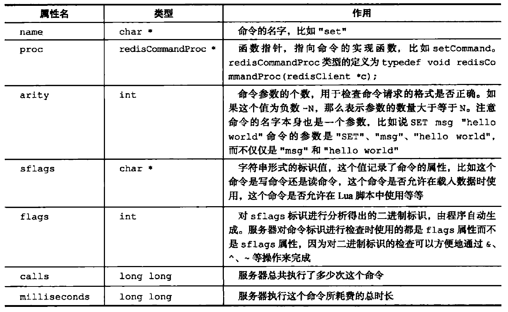

其中sflags是标识值，它的意义如下：

以get和set命令为例，它们在命令表中示意图如下：

查找到之后将客户端状态的cmd指针指向该redisCommand结构。因为命令表使用的是大小写无关查找算法，所以在redis中输入命令是不分大小写的，都能找到正确的redisCommand并执行。

第二步：执行预备操作。预备操作包括：

1、检查cmd指针是否为null，如果为null就不执行后续。

2、检查对应的redisCommand结构中的arity属性（命令参数个数），结合真实参数查看能否对应，如果参数不正确就不执行后续步骤。

3、检查客户端是否通过身份验证。

4、如果服务器打开了maxmemory功能，就需要在执行命令之前检查内存是否可用，必要时进行内存回收。

等等

第三步：调用命令的实现函数

此时服务器已经把将要执行命令的实现保存到了客户端状态的cmd属性中，并将命令的参数和参数个数分别保存到了argv和argc中。执行命令产生的命令回复会被保存在客户端状态的输出缓冲区中。

第四步：执行后续工作。主要包括：

1、如果服务器开启了慢查询日志功能，那么慢查询日志模块会检查是否需要为刚刚执行完的命令请求添加一条新的慢查询日志。

2、根据刚刚执行命令所耗费的时长，更新被执行命令的redisCommand结构的milliseconds属性，并将calls计数器加1.

3、如果服务器开启了AOF持久化功能，那么AOF持久化模块会将刚刚执行的命令请求写入到AOF缓冲区中。

4、如果有其他服务器正在复制当前服务器，那么服务器会将刚刚执行的命令传播给所有从服务器。

### 回复并打印

命令回复存入客户端状态的输出缓冲区后，通过套接字传送给客户端，命令回复发送完毕后回复处理器会清空客户端状态的输出缓冲区，为处理下一个命令请求做好准备。

客户端收到协议格式的命令回复之后，会转换成可读格式打印出来。

## serverCron函数的执行

redis中的serverCron函数默认每隔100毫秒就执行一次，接下来对它执行的操作进行比较完整的介绍。

### 更新服务器时间缓存

redis服务器状态中有unixtime和mstime两个属性，分别以秒级精度和毫秒级精度保存了当前的unix时间戳，serverCron函数默认会每次更新这两个属性，因为频繁获取系统时间需要执行系统调用，所以redis用这两个属性作为服务器时间缓存。

但是它们的精度并不高，因为默认是100毫秒更新一次的，所以服务器只在打印日志、更新服务器LRU时钟、决定是否执行持久化、计算服务器上线时间这类对时间精确度要求不高的功能上。

对于为键设置过期时间、添加慢查询日志这种需要高精确度时间的功能来说，redis还是会执行系统调用获得最准确的当前时间。

### 更新LRU时钟

服务器状态中还有一种时间缓存名为lruclock，每个对象都有一个lru属性，这个lru属性保存了对象最后一次被命令访问的时间，当服务器要计算一个键的空转时间时，就会用lruclock时间减去lru得到结果。

要求一个键的空转时间，需要执行以下命令：

~~~
object idletime key
~~~

serverCron函数默认10秒一次的频率更新lruclock，所以空转时间是一个模糊的估计值。

### 更新服务器每秒执行命令数

serverCron函数每100毫秒估计一次服务器在最近一秒钟内处理的命令请求数量，这个数量可以通过执行下列命令来查看：

~~~
info stats
~~~

然后会显示很多字段，其中的instantaneous_ops_per_sec字段就是服务器最近一秒内处理的命令请求数量。

redis服务器计算这个结果的逻辑如下：在redisServer结构中，有一个字段记录上一次抽样查询的时间，还有一个字段记录了上一次抽样时服务器已执行命令的数量，每次运行时都会根据这两个字段、服务器当前时间、服务器当前已执行的命令数量，做一个简单计算得出两次调用之间共处理了多少请求，然后将这个值平均到1秒，计算结果会被放入redisServer结构的一个环形数组中，这个环形数组的大小默认是16，每次执行查询时会循环遍历这个数组取平均值最后返回。所以综上所述，这个结果是一个估算值。

### 更新服务器内存峰值记录

服务器状态redisServer中的stat_peak_memory属性记录了服务器的内存峰值大小，每次执行serverCron函数时，该函数都会查看服务器当前使用的内存数量，然后更新这个最大值。

可以执行下列命令来查看内存峰值记录：

~~~
info memory
~~~

结果中的used_memory_peak和used_memory_peak_human就是服务器内存峰值。

### 处理sigterm信号

当服务器收到sigterm信号时，会打开服务器状态的shutdown_asap标识，让其变为1，每次serverCron函数运行时，都会对shutdown_asap标识进行检查，根据属性的值决定是否关闭服务器，如果是1就关闭。

服务器在收到sigterm信号并决定关闭服务器后，会先执行RDB持久化操作，然后再关闭。

### 管理客户端资源

serverCron函数每次执行都会调用clientsCron函数，这个函数会检查两个方面：

1、如果客户端和服务器之间的连接已经超时（很久都没有互动），那么程序释放这个客户端

2、如果客户端的输入缓冲区大小超过了一定的长度，那么程序会释放输入缓冲区，并重新创建一个默认大小的输入缓冲区，防止过大的输入缓冲区耗费了太多内存

### 管理数据库资源

serverCron函数每次执行都会调用databasesCron函数，这个函数会对服务器中一部分数据库进行检查，删除其中的过期键，有必要时还会进行字典收缩操作。

### 延迟执行bgrewriteaof

如果在执行bgsave的时候执行了bgrewriteaof，那么该命令会被延迟到bgsave执行完毕后执行。这个机制也是通过serverCron函数来实现的，具体做法是服务器状态有一个标识，这个标识记录了服务器是否延迟了bgrewriteaof命令，当serverCron函数执行时会检查这个标识，如果bgsave和bgrewriteaof都没有执行，且该标识为1，那么服务器就会执行bgrewriteaof命令。

### 检查持久化操作的运行状态

在服务器状态中有两个属性记录了执行bgsave和bgrewriteaof命令的子进程ID，如果服务器没有在执行这两个命令，那么这两个属性就会都被置为-1。每次执行serverCron函数时，程序都会检查这两个属性来确定持久化是否在进行。

1、如果这两个属性其中有一个不为-1，程序就会执行wait3函数，检查子进程是否有信号发到服务器进程，如果有信号到达说明新的RDB或AOF文件已经生成完毕，服务器需要进行文件替换操作。如果没有信号说明持久化未完成。

2、如果这两个属性都是-1，说明服务器此时没有进行持久化操作，此时服务器会检查是否有bgrewriteaof被延迟、检查启动持久化操作的条件是否满足、AOF重写条件是否满足，如果满足的话启动新的持久化操作。

### 将AOF缓冲区的内容写入AOF文件

如果服务器开启了AOF持久化操作，且AOF缓冲区里面有待写入的数据，那么serverCron函数会将AOF缓冲区的内容写入AOF文件。

### 关闭异步客户端

服务器会关闭那些输出缓冲区大小超出限制的客户端。

### 增加cronloops计数器的值

这个计数器是服务器状态的一个属性，记录了serverCron函数执行的次数，有些模块需要实现serverCron函数执行一定次数就需要执行的功能，这个时候就会用到cronloops计数器。

## 初始化服务器

初始化服务器分为几步：

1、初始化服务器状态结构redisServer

2、载入配置选项，我们可以执行下列命令载入配置文件：

~~~
redis-server redis.conf
~~~

如果没有手动配置，就会载入默认配置

3、初始化服务器数据结构，如clients链表、db数组、创建共享对象、开启监听端口

4、还原数据库状态：如果服务器启用了AOF持久化功能，那么服务器会用AOF文件来还原数据库状态，如果没有开启就会用RDB文件来还原。

# 复制

假设现在有两个redis服务器，地址分别为127.0.0.1：6379和127.0.0.1：12345，如果我们向服务器127.0.0.1：12345发送以下命令：

~~~
slaveof 127.0.0.1 6379
~~~

那么前者就是后者的主服务器，后者是前者的从服务器。进行复制中的主从服务器双方的数据库将保存相同的数据，这就是数据库状态一致。如果我们在主服务器中设置某个键的值或者删除某个键，从服务器也会进行相同的操作。

## 旧版本（2.8前）复制功能的实现

redis的复制功能分为同步和命令传播两个操作：

1、同步是将从服务器的数据库状态更新至主服务器当前所处的数据库状态

2、命令传播用于当主服务器的数据库状态被修改，导致主从服务器的数据库状态出现不一致时，让主从服务器的数据库重新回到一致状态。

### 同步

当服务器收到slaveof命令后，从服务器首先需要执行的就是同步操作，步骤如下：

1、从服务器向主服务器发送sync命令。

2、主服务器收到命令后，开始执行bgsave命令，在后台生成一个RDB文件，并使用一个缓冲区记录从现在开始执行的所有写命令。

3、主服务器bgsave命令执行完毕后，主服务器会将RDB文件发给从服务器，从服务器接收并载入这个文件，载入完成后主服务器将记录在缓冲区内的所有写命令发给从服务器，从服务器执行这些命令，将自己的数据库状态更新到主服务器当前的状态。

### 命令传播

当主从服务器两者达到一致状态后，主服务器执行写命令后，主从服务器状态不再一致，此时主服务器需要对从服务器执行命令传播操作，也就是主服务器会将自己执行的写命令发送给从服务器执行，当从服务器执行后主从服务器再次回到一致状态。

## 旧版新版复制功能对比

### 旧版复制功能的缺陷

在redis中从服务器对主服务器的复制可以分为以下两种情况：初次复制和断线后重新复制，对于前者来说旧版复制功能可以很好的完成，但是对于后者情况，旧版复制功能效率较低。

当主从服务器通过同步达到一致状态后，主服务器就通过命令传播来保持一致性，当断线发生后命令传播无法继续，重新连接后旧版复制功能会向主服务器发送sync命令，该命令会让主服务器把从同步完成开始到断线重连的所有写命令都转化成RDB文件发送给从服务器，但是其实根本不需要那么多，只需要传送断线发生后到断线重连这段时间的写命令即可。断线期间执行的写命令越少，效率浪费就越严重。

### 新版复制功能的实现

redis从2.8版本开始就用psync命令来代替sync命令，psync命令具有完整重同步和部分重同步两种模式：

1、完整重同步模式和sync命令的效果基本相同：主服务器创建并发送RDB文件，然后发送缓冲区记录的写命令。

2、部分重同步模式用于断线重连情况，主服务器可以将断开后到重连完期间的命令发送给从服务器，实现效率的提升（但是特殊情况下还是要发送RDB文件）

## 部分重同步的实现

部分重同步功能的实现依赖三个部分：主从服务器的复制偏移量、主服务器的复制积压缓冲区、服务器的运行ID。

### 复制偏移量

主服务器要实现断线重连后能精准的将断线到重连部分的写命令发送给从服务器，就必须通过一种机制来记录命令发送进度，主从服务器都会维护一个复制偏移量：主服务器每次向从服务器发送N个字节的数据时就将自己的复制偏移量加N，从服务器每次收到主服务器传播来的N个字节的数据时，也会将自己的复制偏移量加N。

如果主从服务器的偏移量不同说明两者处于不一致状态，当主服务器的偏移量比某个从服务器大的时候，就说明这个从服务器断线了，断线重连后从服务器向主服务器发送psync命令，将自己的复制偏移量报告给主服务器，主服务器经过对比就可以知道从服务器没有的是哪段写命令了。

### 复制积压缓冲区

复制积压缓冲区是主服务器维护的一个环形队列，当主服务器进行命令传播时会将发送给从服务器的写命令存入这个缓冲区内，缓冲区的大小是有限的，只会保存一部分最近传播的写命令。

当从服务器断线重连主服务器后，主服务器会根据从服务器发送过来的复制偏移量offset和缓冲区的情况决定接下来的操作：

1、如果offset之后的数据还存在复制积压缓冲区中，主服务器会进行部分重同步操作

2、如果offset之后的数据已经被覆盖掉，主服务器就会进行完整重同步操作

复制积压缓冲区默认大小为1MB，如果主服务器执行大量写命令，而断线时间又较长，就会导致无法进行部分重同步，效率浪费严重，所以复制积压缓冲区的大小要设置合理，可以根据断线时间估计值乘以每秒产生的写命令数据量来设置，缓冲区的大小可以通过配置文件的repl-backlog-size选项来设置。

### 服务器运行ID

每个redis服务器都有自己的ID，这个ID在服务器启动时自动生成。当从服务器对主服务器进行初次复制时，主服务器会将自己的ID传送给从服务器，从服务器会将这个ID保存起来。

当从服务器断线重连上一个主服务器时，从服务器向主服务器发送之前保存的ID，如果这个ID和主服务器ID是一个，那么主服务器就尝试进行部分重同步操作，如果不是一个，说明之前的主服务器和现在的不是一个，主服务器将进行完整重同步操作。

## psync命令的实现

psync命令调用细节：

从服务器根据不同情况发送psync命令的不同形式：

1、从服务器在开始一次新的复制时将向主服务器推送下列命令：

~~~
psync ? -1
~~~

代表主动请求主服务器进行完整重同步。

2、如果从服务器已经复制过某个主服务器，那么在开始一次新的复制时将向主服务器发送：

~~~
psync <ID> <offset>
~~~

ID就是上一次复制的服务器的运行ID，offset是从服务器当前的复制偏移量。

收到psync命令的主服务器会根据不同情况返回以下几种回复：

1、主服务器将与从服务器执行完整重同步操作：

~~~
+fullresync <ID> <offset>
~~~

同时将自己的运行ID和offset发送给从服务器，从服务器会将ID保存起来，将自己的偏移量初始化为offset。

2、主服务器将执行部分重同步操作：

~~~
+continue
~~~

主服务器将发送从服务器缺少的那部分写命令。

3、主服务器不能识别psync命令：

~~~
-err
~~~

这主要是因为主服务器的版本低于redis2.8，它识别不了psync命令，从服务器此时会向主服务器发送sync命令。

## slaveof的实现

当执行slaveof时可以让一个从服务器去复制一个主服务器：

~~~
slaveof 主服务器ip 端口
~~~

### 设置主服务器ip和端口

当从服务器收到slaveof命令时，从服务器就会设置服务器状态中的masterhost和masterport属性，分别代表主服务器的地址和端口。设置完成后从服务器会向发送slaveof命令的客户端返回OK，然后执行下列步骤。

### 建立套接字连接

从服务器根据ip地址和端口创建连向主服务器的套接字地址，如果套接字能成功连接到主服务器，从服务器会为这个套接字关联一个用于处理文件复制工作的文件事件处理器，这个处理器负责后续的接受RDB文件、接受写命令等。

主服务器接收套接字连接后，会为该套接字创建相应的客户端状态，主服务器会把从服务器看做一个连接到主服务器的客户端，此时他们的关系：

### 发送PING命令

从服务器成为主服务器的客户端之后，就会向主服务器发送一个ping命令，此时：

1、如果主服务器向从服务器返回了一个命令回复，但从服务器不能在规定的时限中读取回复内容，就证明网络连接状态不佳，此时从服务器断开并重新创建连向主服务器的套接字。

2、如果主服务器向从服务器返回一个错误，代表主服务器目前暂时没办法处理从服务器的命令请求，不能执行赋值操作。

3、主服务器回复PONG，代表网络连接正常，从服务器可以继续执行下列步骤。

### 身份验证

如果此时从服务器设置了masterauth选项，那么就要进行身份验证。如果从服务器配置的masterauth选项的值是10086，那么此时从服务器就会向主服务器发送命令：

~~~
auth 10086
~~~

此时：

1、主服务器的requirepass选项和10086相同，那么验证通过，如果不同则主服务器返回一个错误

2、如果主服务器没有设置requirepass选项，将返回一个no password is set错误

所有错误都会导致从服务器终止目前的复制工作，从创建套接字开始重新执行流程，直到身份通过或者从服务器放弃复制。

### 发送端口信息给主服务器

身份验证之后，从服务器会向主服务器发送：

~~~
replconf listening-port portnumber
~~~

portnumber就是从服务器的监听端口号。主服务器收到该命令后，会将该端口号存入对应客户端状态的slave_listening_port属性中，在主服务器执行：

~~~
info replication
~~~

时，就会打印其从服务器的端口号。

### 同步和命令传播

从服务器向主服务器发送psync命令，执行该命令后，主服务器也会成为从服务器的客户端，因为发送缓冲区内的写命令需要从服务器来接受。此时他们的关系：

完成同步后，主服务器会进行命令传播，把写命令持续的发送给从服务器。

## 心跳检测

在命令传播阶段，从服务器默认会以1秒一次的频率向主服务器发送：

~~~
replconf ack <offset>
~~~

其中offset是从服务器的复制偏移量。

### 检测网络连接状态

主服务器如果超过1秒没有收到来自从服务器的replconf ack命令，那么网络连接状态就出现问题了。

可以向主服务器发送以下命令查看连接状态：

~~~
info replication
~~~

打印结果中的slave：lag就代表距离上一次收到ack命令的秒数，正常应该在0和1之间跳动。

### min-slaves选项

如果我们向主服务器提供下列配置：

~~~
min-slaves-to-write 3
min-slaves-max-log 10
~~~

那么在从服务器数量少于3个，或者三个从服务器的延迟值lag都大于等于10秒时，主服务器将拒绝执行写命令。这个配置可以让主服务器在不安全的情况下不执行写命令。

### 检测命令丢失

因为网络故障，主服务器传播给从服务器的写命令可能会在半路丢失，在旧版本这种丢失是无法避免的，但是在新版本主服务器在心跳检测时可以对比两个复制偏移量，如果主服务器发现从服务器的复制偏移量比自己的要小，就从复制积压缓冲区中将最近的写命令取出，将从服务器缺少的写命令发送给从服务器。

# Sentinel

sentinel是redis高可用性的解决方案，一个或多个sentinel实例组成sentinel系统，它可以监视任意多个主服务器以及这些主服务器下的从服务器，当被监视的主服务器进入下线状态时（下线时长超过上限时），自动将下线服务器属下的某个从服务器升级为新的主服务器，如果原来下线的服务器重新上限，sentinel负责将新上线的服务器设置为一个从服务器。

## 启动和初始化sentinel

启动sentinel需要在dos下执行命令：

~~~
redis-sentinel /path/to/your/sentinel.conf
~~~

或：

~~~
redis-server /path/to/your/sentinel.conf --sentinel
~~~

### 初始化服务器

sentinel本质上就是一个特殊的redis服务器，所以启动sentinel的第一步就是初始化一个普通的redis服务器，sentinel在初始化的时候不会载入RDB或AOF文件，sentinel模式下redis服务器主要功能的使用情况如下：

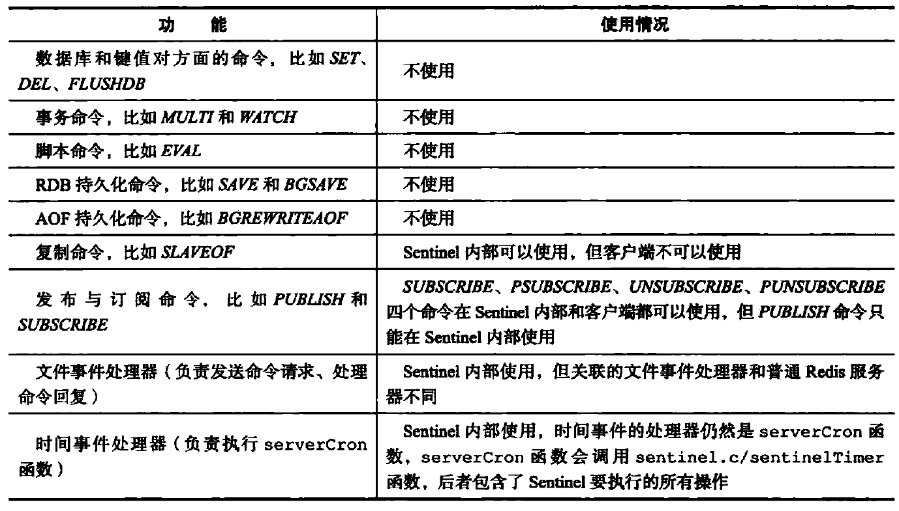

### 使用sentinel专用代码

sentinel内部运行的代码与普通redis服务器不同，比如命令表和普通服务器完全不同，因此很多命令在sentinel是执行不了的。能在客户端对sentinel执行的全部命令有：ping、sentinel、info、subscribe、unsubscribe、psubscribe、punsubscribe。

### 初始化sentinel状态结构

服务器内部会初始化一个sentinelState结构：

~~~c
struct sentinelState{
	//当前纪元
	uint64_t current_epoch;
	//保存了所有被sentinel监视的主服务器
	dict *masters;
	//是否进入了TILT模式
	int tilt;
	//目前正在执行的脚本数量
	int running_scripts;
	//进入TILT模式的时间
	mstime_t tilt_start_time;
	//最后一次执行时间处理器的时间
	mstime_t previous_time;
	//一个FIFO队列，包含了所有需要执行的用户脚本
	list *scripts_queue;
}sentinel;
~~~

### 初始化masters属性

masters是一个字典，输入一个被监视服务器的名字就能找到一个sentinelRedisInstance结构，它代表一个被sentinel监视的redis服务器实例，实例的一部分属性如下：

~~~
typedef struct sentinelRedisInstance{
	//标识值，记录了实例的类型，以及该实例的当前状态
	int flags;
	//实例的名字，主服务器的名字由用户在配置文件中设置，从服务器及sentinel的名字自动设置为ip:port
	char *name;
	//实例的运行ID
	char *runid;
	//配置纪元
	uint64_t config_epoch;
	//实例的地址，sentinelAddr包括ip和端口号
	sentinelAddr *addr;
	//实例无响应多少毫秒被判定为主观下线
	mstime_t down_after_period;
	//判定这个实例为客观下线需要的支持投票数量
	int quorum;
	//执行故障转移操作时，可以同时对新的主服务器进行同步的从服务器数量
	int parallel_syncs;
	//刷新故障迁移状态的最大时限
	mstime_t failover_timeout;
}sentinelRedisInstance;
~~~

masters字典的初始化是根据被载入的sentinel配置文件来进行的，如果配置文件如下：

那么对应的两个sentinelRedisInstance实例就如下（此时都是主服务器）：

### 创建连向主服务器的网络连接

对于每个被sentinel监视的主服务器来说，sentinel会创建两个连向主服务器的异步网络连接：

1、一个是命令连接，专门用于向主服务器发送命令，并接受命令回复

2、一个是订阅连接，专门用于订阅主服务器的\_sentinel\_:hello频道（这主要是因为redis发布与订阅功能中，被发送的信息都不会报存在服务器中，如果接受信息的客户端断线就会导致信息丢失，sentinel用一个专门的连接来接受该频道的信息）

下图就是一个sentinel向被它监视的两个主服务器创建命令连接和订阅连接：

## 获取主服务器信息

sentinel默认会以每10秒一次的频率通过命令连接向被监视的主服务器发送info命令，并通过分析info命令的回复来获取主服务器的当前信息。

通过分析主服务器返回的info命令回复，sentinel可以获取两个方面的信息：

1、主服务器的运行ID

2、主服务器属下所有从服务器的信息，包括ip和端口号

sentinel根据返回的信息对主服务器的实例结构进行更新，主服务器sentinelRedisInstance实例结构中有一个字段名为slaves，slaves是一个字典，记录了主服务器属下从服务器的名单，根据返回的信息就可以更新这个名单。输入从服务器名，即ip:port，就能找到对应的从服务器实例结构sentinelRedisInstance。

下图就是某个主服务器实例和它的从服务器实例的关系：

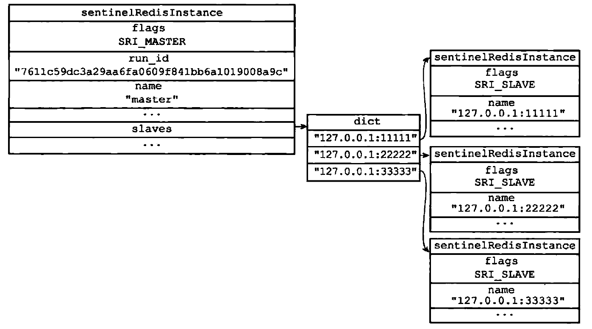

主从服务器对应的实例结构有一些不同：

1、主服务器实例结构中的flags属性是SRI_MASTER，从服务器实例结构中的flags属性是SRI_SLAVE。

2、主服务器实例结构中的name属性的值是用户根据配置文件设置的，从服务器实例结构中的name值是自动设置为ip:port的。

## 获取从服务器信息

sentinel会创建到从服务器的命令连接和订阅连接，这是通过获取主服务器的信息间接得到从服务器的信息从而建立联系的。创建命令连接后，sentinel默认每10秒一次的频率通过命令连接向从服务器发送info命令，根据从服务器的回复sentinel能获取以下信息：

服务器的运行ID、主服务器的ip和端口、主服务器的连接状态、从服务器的优先级和复制偏移量，根据这些信息sentinel会对从服务器的信息进一步更新。

## 向主服务器和从服务器发送信息

默认sentinel会以每两秒一次的频率，通过命令连接向所有被监视的主服务器和从服务器发送以下格式的命令：

~~~
publish _sentinel_:hello "<s_ip>,<s_port>,<s_runid>,<s_epoch>,<m_name>,<m_ip>,<m_port>,<m_epoch>"
~~~

这条命令向服务器的\_sentinel\_频道发送了一条信息，信息的内容由多个参数组成，其中以s开头的参数是记录sentinel本身的信息，包括ip、端口、运行ID、配置纪元。以m开头的参数是记录主服务器的信息，如果sentinel正在监视的是主服务器，那么就是它的信息，如果正在监视从服务器，那么这个信息就是它的主服务器的信息，包括主服务器名、ip、端口、配置纪元。

## 接受来自主服务器和从服务器的频道信息

当sentinel与一个主服务器或者从服务器建立起订阅连接后，sentinel就会通过订阅连接向服务器发送以下命令：

~~~
subscribe _sentinel_:hello
~~~

sentinel对\_sentinel\_:hello频道的订阅会一直持续到sentinel与服务器的连接断开为止。sentinel既通过命令连接向服务器的\_sentinel\_:hello频道发送消息，又通过订阅连接从服务器的\_sentinel\_:hello频道接受消息：

对于监视同一个服务器的多个sentinel，一个sentinel发送的信息会发送到对应频道，然后通过频道所有sentinel都会接受到这个信息：

一个sentinel从频道收到消息时，会对信息进行分析，提取出其中的sentinel ip地址、端口号、运行ID等，如果这个运行ID和自己的一样，说明这条消息是自己发的，此时sentinel会把消息丢弃，如果运行ID和自己的不同，说明这条消息是从监视同一个服务器的其他sentinel发来的，此时sentinel会把消息中的信息提取，然后更新实例结构的信息。

### 更新sentinels字典

在sentinel为某个它监视的主服务器建立的sentinelRedisInstance结构中，有一个sentinels属性，它是一个字典，保存了所有监视这个主服务器的sentinel（除了本sentinel的信息），输入一个sentinel名（格式为ip:port），就能得到一个对应sentinel的实例结构。

当一个sentinel接受到其他sentinel发来的消息时（通过频道），sentinel会从信息中分析两方面参数：

1、源sentinel的IP地址、端口号、运行ID和配置纪元

2、源sentinel正在监视的主服务器名、IP地址、端口号和配置纪元

根据信息中的主服务器参数，sentinel会在自己sentinel状态中的masters字典中找到对应主服务器的sentinelRedisInstance，然后根据信息中的sentinel参数，检查主服务器实例中的sentinels字典中有没有对应的源sentinel，如果不存在就新建一个，如果已经存在就更新其信息。

通过这样的机制，一个sentinel可以通过分析频道信息获知其他sentinel的存在，而且通过发送频道信息让其他sentinel知道自己的存在，这样用户在使用sentinel的时候不需要提供每个sentinel的地址信息，监视同一个服务器的多个sentinel可以自动发现对方。

### 创建连向其他sentinel的命令连接

当sentinel通过频道信息发现一个新sentinel时，不仅会为新sentinel在字典中创建对应的实例结构，还会创建一个连向新sentinel的命令连接，最终监视同一主服务器的多个sentinel将形成相互连接的网络：

通过命令连接相连的sentinel可以通过向其他sentinel发送命令请求来进行信息交换。注意sentinel之间只建立命令连接，不建立订阅连接，订阅连接存在的目的就是为了sentinel能相互已知，相互已知的多个sentinel只需要用命令来进行通信就够了。

## 检测主观下线状态

默认sentinel会以每秒一次的频率向所有与它创建了命令连接的实例（包括主服务器、从服务器、其他sentinel）发送ping命令，根据返回的命令回复判断实例是否在线。

返回的ping命令回复有几种形式：

1、有效回复：如+pong、-loading、-masterdown

2、无效回复：除了上面三种回复外的其他回复

sentinel配置文件中的down-after-milliseconds选项指定了sentinel判断实例进入主观下线所需的时间长度。如果一个实例在down-after-milliseconds毫秒内连续向sentinel返回无效回复，那么sentinel会修改这个实例对应的sentinelRedisInstance，在其中的flags标识值中打开SRI_S_DOWN选项，以此表示该实例已经进入主观下线状态。

一个主服务器被判定为主观下线状态后，对应的实例如下：

配置文件中的down-after-milliseconds不仅被sentinel用来判断主服务器的主观下线状态，还会被用于判断从服务器和sentinel，这是一个统一的下线标准。

如果多个sentinel设置的主观下线时长不同，那么时间设置的较少的那个sentinel认为某个服务器下线时，其他sentinel还认为其仍处于在线状态，这种情况下只有超过较大的时间设置，才会让多个sentinel同时判定其下线。

## 判定客观下线状态

对于主服务器来说，当sentinel从其他sentinel那里接受到足够数量的已下线判断后，就会判定主服务器客观下线，并对主服务器执行故障转移操作。

### 发出is-master-down-by-addr命令

sentinel会发出以下命令询问其他sentinel是否同意主服务器下线：

~~~
sentinel is-master-down-by-addr <ip> <port> <current_epoch> <runid>
~~~

其中的四个参数分别是主服务器ip、端口、sentinel当前的配置纪元、sentinel的运行ID或者\*（如果是ID的话这条命令就同时用于选举领头sentinel，如果是*代表这条命令仅代表检测主服务器的客观下线状态）

### 接受is-master-down-by-addr命令

当sentinel接受到is-master-down-by-addr命令后，会检查对应的主服务器是否已经下线，然后向源sentinel返回一个包含三个参数的Multi Bulk回复：

~~~
<down_state>
<leader_runid>
<leader_epoch>
~~~

分别代表对主服务器的检查结果（1代表主服务器已下线，0代表主服务器的未下线）、本sentinel的局部领头sentinel的ID（也可能是*，此时这条回复与选举无关）、本sentinel的局部领头sentinel的配置纪元。

### 接受is-master-down-by-addr命令的回复

sentinel在收到其他sentinel的命令回复后，会统计结果，当这一数量达到配置指定的判断主观下线需要的数量时，sentinel会将主服务器实例结构的flags属性的SRI_O_DOWN标识打开，表示主服务器已经进入客观下线状态：

这个配置在初始化时被载入的sentinel配置文件中，不同的sentinel判断客观下线的条件可能不同，这可能导致对于同一主服务器，不同的sentinel判断结果不同。

## 选举领头sentinel

当一个主服务器被判定为客观下线后，监视这个下线主服务器的各个sentinel会进行协商，选举出一个领头sentinel，并由领头sentinel对下线服务器执行故障转移操作。

选举的过程如下：

1、每个发现主服务器进入客观下线状态的sentinel都会要求其他sentinel将自己设置为局部领头sentinel，此时这个sentinel会向另一个sentinel发送sentinel is-master-down-by-addr命令，runid为*，代表要求目标sentinel将自己设置为局部领头。

2、设置局部领头的规则为先到先得，最先向目标sentinel发送要求设置的源sentinel会成为目标sentinel的局部领头sentinel，之后收到的所有要求设置的命令都会被拒绝。

目标sentinel收到sentinel is-master-down-by-addr命令后，会回复一个Multi Bulk回复：

~~~
<down_state>
<leader_runid>
<leader_epoch>
~~~

此时后两个参数就代表目标sentinel的局部领头运行ID、配置纪元。

3、当sentinel接受到回复后会检查配置纪元和自己的配置纪元是否相同（配置纪元其实就是一个计数器，每次进行领头选举后这个值都会增1，在一个配置纪元中所有sentinel都有一次将某个sentinel设置为局部领头sentinel的机会，局部领头一旦设置，在这个配置纪元中就不能再更改），如果相同就继续检查其中的ID和自己的是否相同，如果相同代表自己就是目标sentinel的局部领头。

4、如果某个sentinel被半数以上的sentinel设置成了局部领头，那么这个sentinel就会成为领头sentinel。如果在给定时限内没有一个sentinel被选举为领头，那么各个sentinel将在一段时间后重新选举，直到选出为止。

## 故障转移

选好了领头sentinel就会进行故障转移，具体步骤如下：

1、在已下线服务器属下的所有从服务器中，挑选出一个从服务器，选择的标准如下：

（1）删除从服务器列表中处于下线和断线的从服务器（保证从服务器可用）

（2）删除列表中最近5秒没有回复过领头sentinel的info命令的从服务器（保证从服务器最近成功通信）

（3）删除所有与已下线主服务器连接断开超过down-after-milliseconds*10毫秒的从服务器（保证没有过早的断开连接）

（4）优先选择优先级高的从服务器

（5）优先选择复制偏移量高的从服务器

（6）优先选择运行ID小的从服务器

2、对该从服务器发送以下命令：

~~~
slaveof no one
~~~

将这个从服务器转换成主服务器。领头sentinel发送该命令后会以每秒一次的频率向被升级的服务器发送info命令，观察命令回复中的role信息，当role从slave变为master时就代表升级成功了。

3、领头sentinel向已下线主服务器属下所有从服务器去复制新的主服务器，这个操作可以通过发送slave命令来实现。

4、在领头sentinel的已下线主服务器实例结构中更新它的状态，把它变成从服务器，待它重新上线后给它发送slave命令，让它复制新的主服务器。

# 集群

## 节点

### 启动集群

一个集群由多个节点组成，在刚开始的时候各个节点都是相互独立的，我们先以集群模式开启客户端：

~~~
redis-cli -c -h <host> -p <port>
~~~

然后执行下列命令就可以查看集群中的所有节点：

~~~
cluster nodes
~~~

可以看到目前集群只包含自己一个节点，在连接构建之前，独立节点的集群只有该节点一个。

我们要把各个独立的节点连接起来构成集群。连接各个节点的工作可以用下列命令来完成：

~~~
cluster meet <ip> <port>
~~~

假设现在有三个节点A（127.0.0.1：7000）、B（127.0.0.1：7001）、C（127.0.0.1：7002），我们用客户端连接A，然后向B发送：

~~~
cluster meet 127.0.0.1 7001
~~~

此时7000会给7001发送握手消息，然后7001响应握手，这样7001节点就会被添加到节点7000所在的集群，向7002发送类似的命令就能形成一个三节点集群：

redis服务器在启动时会根据配置文件中的cluster-enabled选项来决定是否开启服务器的集群模式，如果该值是yes就会开启集群模式。集群模式下的服务器被称为节点，节点和普通服务器很像，但是会执行集群模式下的各类方法，基本的数据结构如redisServer和redisClient还会使用，集群模式下会有一些特殊的数据结构，接下来就是这些特殊数据结构的介绍。

### 集群数据结构

每个节点都会使用clusterNode结构来记录自己的状态，并为集群中的所有其他节点都创建一个相应的clusterNode：

~~~c
struct clusterNode{
	//创建节点的时间
	mstime_t ctime;
	//节点的名字，由40个十六进制字符组成
	char name[REDIS_CLUSTER_NAMELEN];
	//节点标识
	int flags;
	//节点当前配置纪元
	uint64_t configEpoch;
	//节点的IP地址
	char ip[REDIS_IP_STR_LEN];
	//节点的端口号
	int port;
	//保存连接节点所需的有关信息
	clusterLink *link;
	...
};
~~~

clusterLink结构保存了连接节点所需的有关信息：

~~~c
typedef struct clusterLink{
	//连接的创建时间
	mstime_t ctime;
	//TCP套接字描述符
	int fd;
	//输出缓冲区，保存着等待发送给其他节点的消息
	sds sndbuf;
	//输入缓冲区，保存着从其他节点接受到的消息
	sds rcvbuf;
	//与这个连接相关联的节点，如果没有的话就为NULL
	struct clusterNode *node;
} clusterLink;
~~~

此外，每个节点都保存着一个clusterState结构，这个结构记录了当前节点的视角下集群的状态：

~~~c
typedef struct clusterState{
	//指向当前节点的指针
	clusterNode *myself;
	//集群当前的配置纪元，用于实现故障转移
	uint64_t currentEpoch;
	//集群当前的状态，是在线还是下线
	int state;
	//集群中至少处理着一个槽的节点的数量，当集群处于下线状态时为0
	int size;
	//集群节点名单，一个字典，键为节点名，值为节点对应的clusterNode
	dict *nodes;
} clusterState;
~~~

以前面的7000、7001、7002三个节点为例，下图展示了7000对应的clusterState结构，myself指针指向自己的clusterNode，同时nodes指向集群中所有node组成的字典，size为0代表当前集群还处于下线状态：

### cluster meet命令的实现

通过向A发送cluster meet命令可以将另一个节点B添加到A所在的集群，这个过程是通过握手来完成的。具体过程如下：

1、节点A为节点B创建一个clusterNode结构，并将该结构添加到自己的clusterState.nodes字典中，之后根据命令提供的IP和端口向节点B发送一条meet消息。

2、节点B收到meet消息，然后节点B为节点A创建一个clusterNode结构，然后将该结构添加到自己的clusterState.nodes字典中，然后节点B向A返回一条pong消息。

3、节点A收到pong消息，节点A会向B发送一条ping消息。握手完成，具体过程可以由下图表示：

之后节点A会将节点B的信息通过Gossip协议传播给集群中的其他节点，让其他节点和B握手，最终节点B就和集群中所有节点都建立联系。

## 槽指派

集群的整个数据库被分为16384个槽，数据库的每个键都属于某个槽，集群中的每个节点都可以处理0-16384个槽。当数据库中的16384个槽都有节点在处理时，集群处于上线状态，否则处于下线状态。

通过下列命令我们可以查看集群的基本信息：

~~~
cluster info
~~~

可以发现即使节点之间建立了联系，集群状态还是下线，需要执行槽指派命令才能让集群变为上线。

比如我们可以把槽0至5000指派给节点7000：

~~~
cluster addslots 0 1 2 3 4 ... 5000
~~~

当所有槽都指派完毕后集群就会变为上线状态。

### 记录槽的指派信息

槽的指派信息存储在两种数据结构中：

1、clusterNode中的slots数组，它是一个大小为16384的二进制数组，对应位置i如果为1代表该节点负责处理槽i，例如下图代表该节点处理槽0到槽7：

clusterNode中的numslots是一个int数，代表了该节点负责处理的槽数量。

节点除了会维护自己clusterNode中的slots数组，还会把这个数组通过消息发送给集群中的其他节点，其他节点收到消息后会更新对应节点的clusterNode，这样集群中的每个节点都知道整个集群槽的指派信息。

2、clusterState中的slots数组记录了所有槽的指派信息，它的每个数组项都指向一个clusterNode，代表i位置的槽由对应的clusterNode处理，如果指针指向null代表该槽没有被分配。

集群通过这两种方式保存槽指派信息，这样可以快速解决两类问题：

1、要知道槽i被指派给谁，只需要查看clusterState中的slots数组对应位置。

2、要知道对应节点负责管理哪些槽的时候，只需要查看clusterNode中的slots数组，clusterNode中的slots数组的存在解决了一个重要问题，那就是槽指派信息传播问题，如果要传播节点A的指派信息，只需要发送对应clusterNode中的slots数组即可。

### cluster addslots命令的实现

这个命令在指派槽信息时，必须保证槽没有被指派过，否则会报错，在执行命令的时候，需要将槽指派信息更新到之前提到的两种数据结构。

## 在集群中执行命令

集群进入上线状态后就可以执行命令了，当客户端向节点发送与数据库键相关的命令时，执行如下：

1、节点计算数据库键属于哪个槽，计算键名的CRC-16校验和，然后和16383相与，得到一个0-16383的槽号，使用下列命令可以查看对应的key在哪个槽：

~~~
cluster keyslot <key>
~~~

2、查看本节点的clusterState.slots，确定槽i是否属于当前节点负责，如果是就可以执行客户端的命令，如果不是节点会找到处理该槽的节点，然后给客户端返回一个moved错误：

~~~
moved <slot> <ip>:<port>
~~~

其中slot是键所在的槽。客户端收到moved错误后，会转向负责处理槽i的节点，并向目标节点重新发送命令。如果客户端和要转向的节点之间没有建立套接字连接，那么客户端会先创建连接再转向。

在集群模式下moved错误会被自动处理，但是在单机模式的客户端，客户端收到moved错误之后就会报错，不会自动转向。

### 节点数据库的特点

节点和单机服务器在数据库方面有一个区别是节点只能使用0号数据库。

节点还有一个特殊的数据结构是slots_to_keys，它是属于clusterState的一个跳表，用来保存槽和键之间的关系。该跳跃表的每一个分值都是槽号，成员是一个数据库键，每次更改数据库时都会维护这个跳表，有了这个数据结构就可以对某个或某些槽对应的数据库键进行批量操作，如下列命令：

~~~
cluster getkeysinslot <slot> <count>
~~~

会返回最多count个属于槽slot的数据库键，这个功能就是通过遍历这个跳表来完成的。

## 重新分片

redis集群的重新分片操作可以将已经指派给某个节点的槽改为指派给另一个节点，而且所有相关的键值对也会进行迁移，在重新分片操作进行的过程中，集群不需要下线，依然可以继续处理命令请求。

重新分片操作是由redis的集群管理软件redis-trib负责执行的，重新分片的步骤如下：

1、redis-trib对目标节点发送以下命令：

~~~
cluster setslot <slot> importing <source_id>
~~~

让目标节点准备好从源节点导入属于槽solt的键值对。

2、redis-trib对源节点发送以下命令：

~~~
cluster setslot <slot> migrating <target_id>
~~~

让源节点准备好将槽slot的键值对迁移到目标节点。

3、redis-trib对源节点发送以下命令：

~~~
cluster getkeysinslot <slot> <count>
~~~

获得最多count个属于槽slot的键名。

4、对上一步获得的键名，redis-trib都会向源节点发送一条命令：

~~~
migrate <target_ip> <target_port> <key_name> 0 <timeout>
~~~

来将键值对迁移到对应的节点。然后重复执行直到源节点槽对应的所有键值对都迁移完毕。

5、redis-trib会向集群中的任意一个节点发送以下命令：

~~~
cluster setslot <slot> node <target_id>
~~~

这一指派信息会通过消息发送至整个集群，最终集群中的所有节点都会知道槽slot已经指派给了目标节点。

## ASK错误

在重新分片期间会出现一种特殊情况：属于被迁移槽的一部分键保存在源节点，另一部分保存在目标节点，此时如果向源节点发送与键有关的命令，而命令要处理的键正好已经被迁移，源节点就会向客户端返回一个ask错误，指引客户端转向正在导入槽的目标节点，并再次发送命令。

和moved错误类似，在集群模式的客户端会自动处理这种错误，而在单机模式的客户端会报错且不能自动转向。（ask自动转向的功能可能不能实现）

转向发送命令之前，会向目标节点发送一个asking命令，之后再发送原本要执行的命令，这个asking命令的作用是打开发送该命令的客户端的REDIS_ASKING标识。常规情况下，如果一个命令和槽i相关，而槽i又不属于目标节点，目标节点会直接拒绝请求并返回一个moved错误，但是如果发送的客户端带有REDIS_ASKING标识，且查询数据结构发现正在迁移时，目标节点就会破例执行这个命令，执行一次命令后REDIS_ASKING标识就会被移除。

## 复制与故障转移

redis集群中的节点分为主节点和从节点，主节点负责处理槽，从节点是复制某个主节点的，用来进行故障转移，如果某个主节点进入下线状态，那么其下的某个从节点就会成为新的主节点。

### 设置从节点

给一个节点A发送命令：

~~~
cluster replicate <node_id>
~~~

就可以将节点A设置为目标节点的从节点，并开始对目标主节点进行复制。

节点A会在自己的clusterState.nodes字典中找到node_id对应的clusterNode结构，然后设置为自己的clusterState.myself.slaveof，记录下主节点的信息，并修改clusterState.myself.flags，关闭REDIS_NODE_MASTER，打开REDIS_NODE_SLAVE，设置自己从节点的身份。

建立完联系后，从节点就会向主节点发送slaveof命令进行复制。

一个节点称为从节点并开始复制某个主节点这一信息会通过消息发送给集群中其他的节点，最终集群都会知道某个从节点正在复制某个主节点，集群中的所有节点都会在代表主节点的clusterNode结构的slaves属性和numslaves属性中记录正在复制这个主节点的从节点名单。

### 故障检测

集群中的每个节点都会定期向集群中的其他节点发送PING消息，如果接受消息的节点没有在规定的时间内返回PONG，那么该节点就会被标记位疑似下线，也就是找到对应节点的clusterNode的flags属性，打开REDIS_NODE_PFAIL。

（集群中的每个节点默认每隔一秒从已知节点列表中随机选5个，然后对这5个中最长时间没有发送过PING消息的节点发送PING消息，以此来检测节点是否在线。当节点A最后一次收到B发送的PONG消息的时间，距离当前时间已经超过了节点A的cluster_node_timeout的一半，那么节点A会向B发送PING，以此来避免太久没有通信）

当节点A通过消息得知B认为C进入了疑似下线状态时，A会找到C对应的clusterNode，并将B提供的下线报告添加到该clusterNode的fail_reports链表中，这个链表记录所有其他节点对该节点的下线报告，每个下线报告如下：

~~~c
struct clusterNodeFailReport{
	//下线报告来自于哪个节点
	struct clusterNode *node;
	//最后一次从node收到下线报告的时间，系统用这个属性检查报告是否过期，如果和现在差太远报告会被删除
	mstime_t time;
}
~~~

如果一个集群中半数以上主节点都将某个主节点x标记位疑似下线，那么这个x会被标记位已下线，将x标记为已下线的节点会向集群广播一条关于主节点x的FAIL消息，收到消息的节点都会将x标记为已下线。

### 故障转移

当一个从节点发现自己正在复制的主节点进入了已下线状态，从节点就会开始进行故障转移，步骤如下：

1、原主节点下的所有从节点中会有一个从节点被选中，每个处理槽的主节点都有一次投票的机会，从节点会向集群广播一条cluster_type_failover_auth_request消息，要求主节点向它投票，第一个向主节点要求投自己的从节点会获得主节点的投票，此时主节点会向从节点返回一条cluster_type_failover_auth_ack消息，每个从节点都会统计自己的信息回复来确定有多少主节点支持自己，如果集群中有N个节点，那么投票数大于等于N/2+1的从节点会当选为新的主节点，如果在一个配置纪元中没有从节点能收集到足够的票数，那么集群就会进入新的配置纪元，然后再次进行选举直到选举完成。

2、被选中的从节点会执行下列命令，成为新的主节点：

~~~
slaveof no one
~~~

3、新的主节点会将下线主节点的槽指派全部转换为自己。

4、新主节点向集群广播一条PONG消息，让其他节点知道替换工作已完成。

## 消息

集群中的各个节点通过发送和接受消息message来进行通信，消息总共分为5种：

1、MEET消息：是cluster meet命令的回复消息，加入集群时响应使用。

2、PING消息：故障检测时使用。

3、PONG消息：作为MEET消息和PING消息的响应，而且一个节点可以通过广播PONG消息来刷新其他节点对本节点的认知，如故障转移后。

4、FAIL消息：标记已下线时广播使用。

5、PUBLISH消息：当节点收到一个publish命令时，节点会执行该命令，然后向集群广播PUBLISH消息，让其他节点都执行此publish命令。

每种消息都由消息头和消息正文组成，消息头记录了发送者的一些信息以及消息的关键信息。

