# 概念介绍

HTTP服务器：用于向浏览器返回静态HTML

Servlet容器：Servlet是运行在服务端的Java程序，但Servlet没有main方法，必须借助Servlet容器来实例化并调用Servlet

Tomcat就是一个HTTP服务器+Servlet容器，也称为Web容器，是一个简单的Web应用服务器

Web应用服务器：供向外发布Web资源的服务器软件，Web资源分为静态资源（HTML、图片、视频）和动态资源（代码动态控制逻辑）

Tomcat和浏览器的交互：


如果由HTTP服务器来寻找应该调用Java类的哪个方法，会造成HTTP服务器的代码和业务逻辑耦合，所以就由Servlet容器来加载和管理业务类，将请求转发到具体的Servlet，然后调用具体的Servlet方法，Servlet 接口和 Servlet 容器这一整套规范叫作 Servlet 规范：

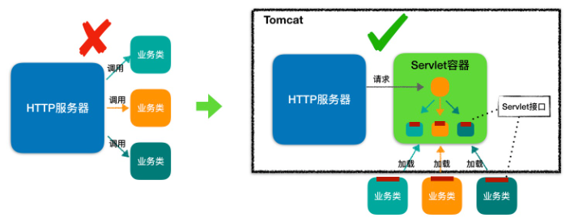

根据Servlet规范，Web应用程序应该保持下面的目录结构：

~~~
| -  MyWebApp
      | -  WEB-INF/web.xml        -- 配置文件，用来配置 Servlet 等
      | -  WEB-INF/lib/           -- 存放 Web 应用所需各种 JAR 包
      | -  WEB-INF/classes/       -- 存放你的应用类，比如 Servlet 类
      | -  META-INF/              -- 目录存放工程的一些信息
~~~

把Servlet类写好编译完之后放入classes，然后在web.xml中配置该Servlet，然后将整个应用文件夹MyWebApp拷贝到Tomcat的安装目录下的webapps 目录，然后启动Tomcat即可：

~~~
./bin/startup.sh
~~~

Servlet 容器在启动时会加载 Web 应用，并为每个 Web 应用创建唯一的 ServletContext 对象，ServletContext 持有所有 Servlet 实例

Cookie：本质上是保存在用户本地的文件，保存了用户的信息，用户可以对其进行修改

Session：本质上是服务器端一块专门用于存储用户信息的存储空间，保存了用户的状态，通过Cookie中携带的用户唯一标识来和用户请求对应起来

# 连接器

## 总览

### 概述

Tomcat的两个核心功能：

- 处理 Socket 连接，负责网络字节流与 Request 和 Response 对象的转化。
- 加载和管理 Servlet，以及具体处理 Request 请求。

Tomcat设计了两个核心组件：连接器（Connector）和容器（Container），前者负责对外交流，容器负责内部处理。

Tomcat 支持多种 I/O 模型和应用层协议：

Tomcat 支持的 I/O 模型有：

- NIO：非阻塞 I/O，采用 Java NIO 类库实现。
- NIO2：异步 I/O，采用 JDK 7 最新的 NIO2 类库实现。
- APR：采用 Apache 可移植运行库实现，是 C/C++ 编写的本地库。

Tomcat 支持的应用层协议有：

- HTTP/1.1：这是大部分 Web 应用采用的访问协议。
- AJP：用于和 Web 服务器集成（如 Apache）。
- HTTP/2：HTTP 2.0 大幅度的提升了 Web 性能。

Tomcat 为了实现支持多种 I/O 模型和应用层协议，一个容器可能对接多个连接器：

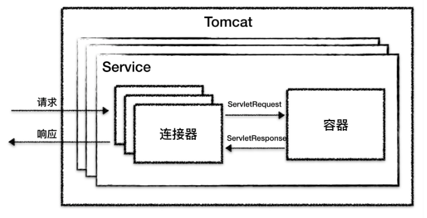

连接器和容器组装起来的整体被称为Service组件，一个Service 中有多个连接器和一个容器，连接器与容器之间通过标准的 ServletRequest 和 ServletResponse 通信。Tomcat内可以配置多个Service，可以实现通过不同的端口号来访问不同应用。

整个连接器的流程：

- 监听网络端口。
- 接受网络连接请求。
- 读取请求网络字节流。
- 根据具体应用层协议（HTTP/AJP）解析字节流，生成统一的 Tomcat Request 对象。
- 将 Tomcat Request 对象转成标准的 ServletRequest。
- 调用 Servlet 容器，得到 ServletResponse。
- 将 ServletResponse 转成 Tomcat Response 对象。
- 将 Tomcat Response 转成网络字节流。
- 将响应字节流写回给浏览器。

连接器有几个子模块：EndPoint、Processor 和 Adapter，EndPoint 负责提供字节流给 Processor，Processor 负责提供 Tomcat Request 对象给 Adapter，Adapter 负责提供 ServletRequest 对象给容器。

其中 Endpoint 和 Processor 放在一起抽象成了 ProtocolHandler 组件，它们负责I/O 模型和应用层协议，I/O 模型和应用层协议是可以自由组合的，观察ProtocolHandler 接口的继承体系就可以看出：

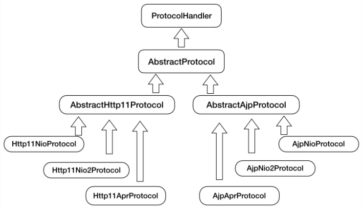

比如Http11NioProtocol：NIO + HTTP、AjpNioProtocol：NIO + AJP，三大组件的关系：


### ProtocolHandler

连接器用 ProtocolHandler 来处理网络连接和应用层协议，包含了 2 个重要部件：EndPoint 和 Processor

1、EndPoint

EndPoint 是通信端点，即通信监听的接口，它是用来实现TCP/IP协议的

EndPoint 是一个接口，对应的抽象实现类是 AbstractEndpoint，而 AbstractEndpoint 的具体子类，如NioEndpoint 和 Nio2Endpoint

内部又可以细分为两个组件：Acceptor 和 SocketProcessor

* Acceptor：用于监听 Socket 连接请求
* SocketProcessor：用于处理接收到的 Socket 请求，它实现了Runnable接口，它是被提交到线程池执行的，这个线程池叫Executor，在run方法里面，它会调用Processor 进行处理

2、Processor 

Processor 用来实现 HTTP 协议，接收来自 EndPoint 的 Socket，读取字节流解析成 Tomcat Request 和 Response 对象，并通过 Adapter 将其提交到容器处理。

Processor 是一个接口，它的抽象实现类 AbstractProcessor，具体实现有AJPProcessor、HTTP11Processor

### Adapter

由于协议不同，客户端发过来的请求信息也不尽相同，Tomcat 定义了自己的 Request 类来“存放”这些请求信息，这就是Tomcat Request，但是这个 Request 对象不是标准的 ServletRequest，也就意味着，不能用 Tomcat Request 作为参数来调用容器。

此时就需要Adapter，它是适配器模式的经典运用，连接器调用 CoyoteAdapter 的 Sevice 方法，传入的是 Tomcat Request 对象，CoyoteAdapter 负责将 Tomcat Request 转成 ServletRequest，再调用容器的 Service 方法。

连接器的组件图：

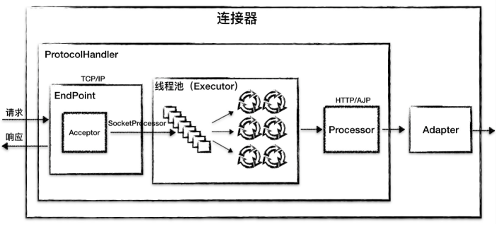

## NioEndpoint

Tomcat 的 NioEndPoint 组件实现了 I/O 多路复用模型。底层还是Java的 I/O 多路复用实现：Selector、Channel等

它包含几个重要的组件：LimitLatch、Acceptor、Poller、SocketProcessor 和 Executor。总体的工作过程：

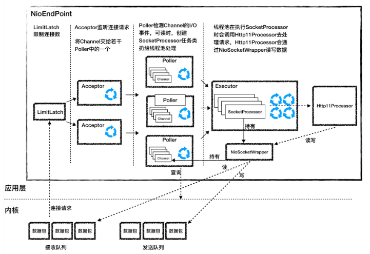

LimitLatch 是连接控制器，它负责控制最大连接数，NIO 模式下默认是 10000，达到这个阈值后，连接请求被拒绝。

Acceptor 跑在一个单独的线程里，它在一个死循环里调用 accept 方法来接收新连接，一旦有新的连接请求到来，accept 方法返回一个 Channel 对象，接着把 Channel 对象交给 Poller 去处理。

Poller 的本质是一个 Selector，也跑在单独线程里。Poller 在内部维护一个 Channel 数组，它在一个死循环里不断检测 Channel 的数据就绪状态，一旦有 Channel 可读，就生成一个 SocketProcessor 任务对象扔给 Executor 去处理。

Executor 就是线程池，负责运行 SocketProcessor 任务类，SocketProcessor 的 run 方法会调用 Http11Processor 来读取和解析请求数据。我们知道，Http11Processor 是应用层协议的封装，它会调用容器获得响应，再把响应通过 Channel 写出。

1、LimitLatch 

LimitLatch 用来控制连接个数，当连接数到达最大时阻塞线程，直到后续组件处理完一个连接后将连接数减 1，它是一个由AQS扩展来的同步工具：

~~~java
public class LimitLatch {
    private class Sync extends AbstractQueuedSynchronizer {
     
        @Override
        protected int tryAcquireShared() {
            long newCount = count.incrementAndGet();
            if (newCount > limit) {
                count.decrementAndGet();
                return -1;
            } else {
                return 1;
            }
        }
 
        @Override
        protected boolean tryReleaseShared(int arg) {
            count.decrementAndGet();
            return true;
        }
    }
 
    private final Sync sync;
    private final AtomicLong count;
    private volatile long limit;
    
    // 线程调用这个方法来获得接收新连接的许可，线程可能被阻塞
    public void countUpOrAwait() throws InterruptedException {
      sync.acquireSharedInterruptibly(1);
    }
 
    // 调用这个方法来释放一个连接许可，那么前面阻塞的线程可能被唤醒
    public long countDown() {
      sync.releaseShared(0);
      long result = getCount();
      return result;
   }
}
~~~

NIO 模式最大连接数下默认是 10000。

2、Acceptor 

Acceptor 实现了 Runnable 接口，它在一个死循环里调用 accept 方法来接收新连接，一旦有新的连接请求到来，accept 方法返回一个 Channel 对象，接着把 Channel 对象交给 Poller 去处理：

~~~java
serverSock = ServerSocketChannel.open();
serverSock.socket().bind(addr,getAcceptCount());
serverSock.configureBlocking(true);
~~~

其中ServerSocketChannel是一个端口对应多个的。bind方法的第二个参数就是操作系统的等待队列长度，可以通过 acceptCount 参数配置，默认是 100。到达最大连接数（LimitLatch限制）后操作系统底层还是会接收客户端连接，但用户层已经不再接收。操作系统级连接就是指在TCP三次握手建立连接的过程中，内核为每一个LISTEN状态的Socket维护的队列：

* SYN队列（半连接队列）：这些连接已经接到客户端SYN
* ACCEPT队列（全连接队列）：这些连接已经接到客户端的ACK，完成了三次握手，等待被accept系统调用取走

Acceptor负责从ACCEPT队列中取出连接，当Acceptor处理不过来时，连接就堆积在ACCEPT队列中，这个队列的长度就是操作系统等待队列的长度

ServerSocketChannel 被设置成阻塞模式，也就是说它是以阻塞的方式接收连接的

erverSocketChannel 通过 accept() 接受新的连接，accept() 方法返回获得 SocketChannel 对象，然后将 SocketChannel 对象封装在一个 PollerEvent 对象中，并将 PollerEvent 对象压入 Poller 的 Queue 里，这是个典型的生产者 - 消费者模式，Acceptor 与 Poller 线程之间通过 Queue 通信

3、Poller

Poller 本质是一个 Selector，它内部维护一个 Queue，这个 Queue 定义如下：

~~~java
private final SynchronizedQueue<PollerEvent> events = new SynchronizedQueue<>();
~~~

Poller 不断的通过内部的 Selector 对象向内核查询 Channel 的状态，一旦可读就生成任务类 SocketProcessor 交给 Executor 去处理。

Poller 的另一个重要任务是循环遍历检查自己所管理的 SocketChannel 是否已经超时，如果有超时就关闭这个 SocketChannel

4、SocketProcessor

它实现了 Runnable 接口，主要逻辑就是调用 Http11Processor 组件来处理请求，Http11Processor 读取 Channel 的数据来生成 ServletRequest 对象。

Http11Processor调用了SocketWrapper 的方法去读写数据，这是Tomcat使用不同的线程模型时，响应的Channel类也是不同的，比如有 AsynchronousSocketChannel 和 SocketChannel，Http11Processor为了屏蔽细节，并不直接读取Channel，而是借助SocketWrapper 去读取。

5、Executor

Executor 是 Tomcat 定制版的线程池，线程就是来执行SocketProcessor 的 run 方法，它是主要的工作线程。

Tomcat能并发快速处理大量请求的关键就是，合理设计线程模型让 CPU 忙起来，尽量不要让线程阻塞。NioEndpoint 要完成的三件事情：接收连接、检测 I/O 事件以及处理请求，都被区分到不同规模的线程去处理，各类线程的数量都可配

## Nio2Endpoint

NIO 和 NIO.2 最大的区别是，一个是同步一个是异步。异步最大的特点是：应用程序不需要自己去触发数据从内核空间到用户空间的拷贝，这里用触发这个词，是因为应用程序是不能访问内核空间的，因此数据拷贝肯定是由内核来做

同步：等待应用程序通过 Selector 来查询，当数据就绪后，应用程序再发起一个 read 调用，这时内核再把数据从内核空间拷贝到用户空间

异步：内核主动将数据拷贝到用户空间并通知应用程序

由此可见，异步的效率是高于同步的，因为异步模式下应用程序始终不会被阻塞

异步模式的工作流程：

* 应用程序在调用 read API 的同时通知内核：数据准备好了以后拷贝到哪个 Buffer，以及调用哪个回调函数去处理这些数据
* 内核接到这个 read 指令后，等待网卡数据到达，数据到了后，产生硬件中断，内核在中断程序里把数据从网卡拷贝到内核空间，接着做 TCP/IP 协议层面的数据解包和重组，再把数据拷贝到应用程序指定的 Buffer，最后调用应用程序指定的回调函数

Windows 的 IOCP 和 Linux 内核 2.6 的 AIO 都提供了异步 I/O 的支持，Java 的 NIO.2 API 就是对操作系统异步 I/O API 的封装

Nio2Endpoint涉及Java NIO.2 API，这里略->15

## AprEndpoint

Tomcat的启动日志中经常会出现提示信息，推荐安装APR库，可以提高系统性能。

APR（Apache Portable Runtime Libraries）是 Apache 可移植运行时库，它是用 C 语言实现的，其目的是向上层应用程序提供一个跨平台的操作系统接口库。Tomcat 可以用它来处理包括文件和网络 I/O，从而提升性能。

Tomcat 本身是 Java 编写的，为了调用 C 语言编写的 APR，需要通过 JNI 方式来调用。JNI（Java Native Interface） 是 JDK 提供的一个编程接口，它允许 Java 程序调用其他语言编写的程序或者代码库，其实 JDK 本身的实现也大量用到 JNI 技术来调用本地 C 程序库

AprEndpoint 是通过 JNI 调用 APR 本地库而实现非阻塞 I/O 的，AprEndpoint 的工作过程：

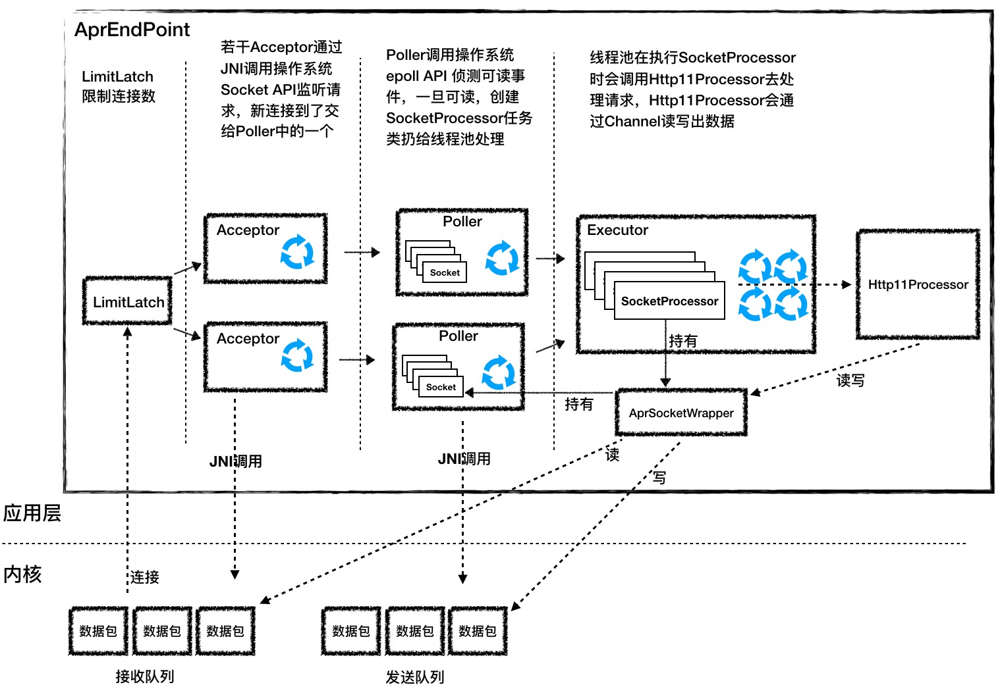

它跟 NioEndpoint 的图很像，从左到右有 LimitLatch、Acceptor、Poller、SocketProcessor 和 Http11Processor，只是 Acceptor 和 Poller 的实现和 NioEndpoint 不同。

1、Accpetor

它的功能就是监听连接，接收并建立连接。它的本质就是调用了四个操作系统 API：socket、bind、listen 和 accept。

Java通过JNI调用C语言的API，首先封装一个Java类，定义用native关键字修饰的方法：

~~~java
public class Socket {
  ...
  // 用 native 修饰这个方法，表明这个函数是 C 语言实现
  public static native long create(int family, int type,
                                 int protocol, long cont)
                                 
  public static native int bind(long sock, long sa);
  
  public static native int listen(long sock, int backlog);
  
  public static native long accept(long sock)
}
~~~

然后用C语言实现这些方法，例如bind函数就是这样实现的：

~~~c
// 注意函数的名字要符合 JNI 规范的要求
JNIEXPORT jint JNICALL 
Java_org_apache_tomcat_jni_Socket_bind(JNIEnv *e, jlong sock,jlong sa)
	{
	    jint rv = APR_SUCCESS;
	    tcn_socket_t *s = (tcn_socket_t *）sock;
	    apr_sockaddr_t *a = (apr_sockaddr_t *) sa;
	
        // 调用 APR 库自己实现的 bind 函数
	    rv = (jint)apr_socket_bind(s->sock, a);
	    return rv;
	}
~~~

函数名字要符合 JNI 的规范。C 语言有指针，Java 没有指针的概念，所以在 Java 中用 long 类型来表示指针

2、Poller

Acceptor 接收到一个新的 Socket 连接后，按照 NioEndpoint 的实现，它会把这个 Socket 交给 Poller 去查询 I/O 事件。AprEndpoint 也是这样做的，不过 AprEndpoint 的 Poller 并不是调用 Java NIO 里的 Selector 来查询 Socket 的状态，而是通过 JNI 调用 APR 中的 poll 方法，而 APR 又是调用了操作系统的 epoll API 来实现的

这里有个特别的地方是在 AprEndpoint 中，我们可以配置一个叫deferAccept的参数，它对应的是 TCP 协议中的TCP_DEFER_ACCEPT，设置这个参数后，当 TCP 客户端有新的连接请求到达时，TCP 服务端先不建立连接，而是再等等，直到客户端有请求数据发过来时再建立连接。这样的好处是服务端不需要用 Selector 去反复查询请求数据是否就绪。

这是一种 TCP 协议层的优化，不是每个操作系统内核都支持，因为 Java 作为一种跨平台语言，需要屏蔽各种操作系统的差异，因此并没有把这个参数提供给用户；但是对于 APR 来说，它的目的就是尽可能提升性能，因此它向用户暴露了这个参数。

除了使用了C语言以外，APR连接器还有下面几个关键的性能优化：

1、使用了本地内存

JVM 内存只是Java进程空间的一部分，除此之外进程空间内还有代码段、数据段、内存映射区、内核空间等。从 JVM 的角度看，JVM 内存之外的部分叫作本地内存，C 程序代码在运行过程中用到的内存就是本地内存中分配的：

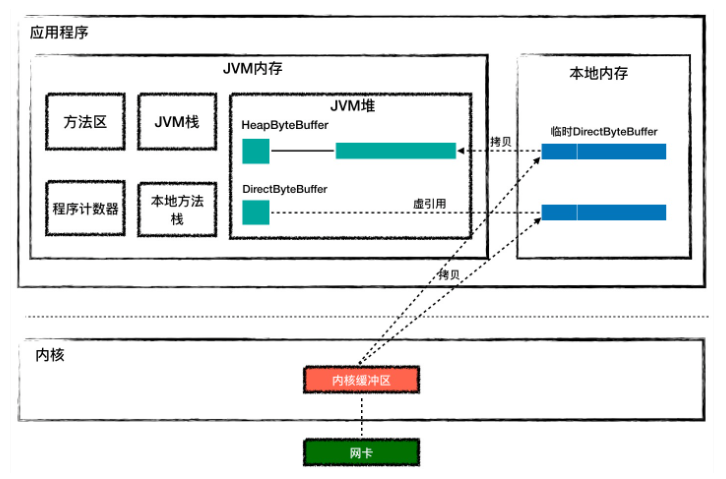

Tomcat 的 Endpoint 组件在接收网络数据时需要预先分配好一块 Buffer，所谓的 Buffer 就是字节数组byte[]，Java 通过 JNI 调用把这块 Buffer 的地址传给 C 代码，C 代码通过操作系统 API 读取 Socket 并把数据填充到这块 Buffer。Java NIO API 提供了两种 Buffer 来接收数据：HeapByteBuffer 和 DirectByteBuffer：

~~~java
// 分配 HeapByteBuffer
ByteBuffer buf = ByteBuffer.allocate(1024);
 
// 分配 DirectByteBuffer
ByteBuffer buf = ByteBuffer.allocateDirect(1024);
~~~

两种buffer的区别：

* HeapByteBuffer 对象本身在 JVM 堆上分配，并且它持有的字节数组byte[]也是在 JVM 堆上分配。如果使用它来接受网络数据的话，需要把数据从内核先拷贝到一个临时的本地内存，再从临时本地内存拷贝到 JVM 堆，而不是直接从内核拷贝到 JVM 堆上。这是因为数据从内核拷贝到 JVM 堆的过程中，JVM 可能会发生 GC，GC 过程中对象可能会被移动，Buffer 地址可能失效。如果经过本地内存中转的话，从本地内存到 JVM 堆的拷贝过程中 JVM 可以保证不做 GC（这个过程没有safepoint）
* DirectByteBuffer对象本身在JVM堆上，但它持有的字节数组是从本地内存中分配的。接受网络数据时，直接把字节数组的本地内存地址传递给C程序，C 程序会将网络数据从内核拷贝到这个本地内存，JVM 可以直接读取这个本地内存，这种方式比 HeapByteBuffer 少了一次拷贝

NioEndpoint 和 Nio2Endpoint 没有用DirectByteBuffer ，只有AprEndpoint 是通过 DirectByteBuffer 来接收数据的，这是因为本地内存不好管理，稳定性不好。Netty 就采用了本地内存池技术。

2、sendfile优化

对于一般的I/O场景，想要读取磁盘文件，将其发送到网络中，例如浏览器通过 Tomcat 来获取一个 HTML 文件，在这个过程中存在很多次的数据拷贝：

- 读取文件时，首先是内核把文件内容读取到内核缓冲区。
- 如果使用 HeapByteBuffer，文件数据从内核到 JVM 堆内存需要经过本地内存中转。
- 同样在将文件内容推入网络时，从 JVM 堆到内核缓冲区需要经过本地内存中转。
- 最后还需要把文件从内核缓冲区拷贝到网卡缓冲区。

这个过程有 6 次内存拷贝，并且 read 和 write 等系统调用将导致进程从用户态到内核态的切换，会耗费大量的 CPU 和内存资源：


Tomcat 的 AprEndpoint 通过操作系统层面的 sendfile 特性解决了这个问题，它将文件从磁盘写入Socket只需要两步：

第一步：将文件内容读取到内核缓冲区。

第二步：数据并没有从内核缓冲区复制到 Socket 关联的缓冲区，只有记录数据位置和长度的描述符被添加到 Socket 缓冲区中；接着把数据直接从内核缓冲区传递给网卡

## Executor组件

Tomcat 的线程池是一个定制版的 ThreadPoolExecutor。

首先Tomcat 的线程池可以实现三个关键参数的配置：任务队列长度、核心线程数和最大线程数

除此之外，Tomcat还在以下方面进行了扩展：

1、普通的ThreadPoolExecutor在任务队列满了之后，会去创建临时线程，直到总线程数到达最大值，然后执行拒绝策略。

而Tomcat 的线程池在总线程数到达最大值后，仍然尝试把任务继续添加到任务队列中，最后再尝试一把，因为这期间可能会有任务队列空闲出来。最后若队列满了再执行拒绝策略。具体代码实现：

~~~java
public class ThreadPoolExecutor extends java.util.concurrent.ThreadPoolExecutor {
  
  ...
  
  public void execute(Runnable command, long timeout, TimeUnit unit) {
      submittedCount.incrementAndGet();
      try {
          // 调用 Java 原生线程池的 execute 去执行任务
          super.execute(command);
      } catch (RejectedExecutionException rx) {
         // 如果总线程数达到 maximumPoolSize，Java 原生线程池执行拒绝策略
          if (super.getQueue() instanceof TaskQueue) {
              final TaskQueue queue = (TaskQueue)super.getQueue();
              try {
                  // 继续尝试把任务放到任务队列中去
                  if (!queue.force(command, timeout, unit)) {
                      submittedCount.decrementAndGet();
                      // 如果缓冲队列也满了，插入失败，执行拒绝策略。
                      throw new RejectedExecutionException("...");
                  }
              } 
          }
      }
}
~~~

原生的execute方法在总线程数达到最大值后会抛出RejectedExecutionException 异常，被Tomcat 线程池捕获到，继续向任务队列中添加。如果任务队列也满了，再执行拒绝策略。

2、定制的任务队列

上面的execute方法第一行会自增一个变量submittedCount，它代表提交到线程池，但还未执行完的任务个数。Tomcat 的任务队列 TaskQueue 扩展了 Java 中的 LinkedBlockingQueue，它默认是没有长度限制的，但自定义的任务队列在构造参数中给它传入了一个大小：

~~~java
public class TaskQueue extends LinkedBlockingQueue<Runnable> {
 
  public TaskQueue(int capacity) {
      super(capacity);
  }
  ...
}
~~~

这个 capacity 参数是通过 Tomcat 的 maxQueueSize 参数来设置的，但问题是默认情况下 maxQueueSize 的值是Integer.MAX_VALUE，等于没有限制。这样就带来一个问题：当前线程数达到核心线程数之后，再来任务的话线程池会把任务添加到任务队列，并且总是会成功，这样永远不会有机会创建新线程了。为了解决这个问题，TaskQueue 重写了 LinkedBlockingQueue 的 offer 方法，在合适的时机返回 false，返回 false 表示任务添加失败，这时线程池会创建新的线程：

~~~java
public class TaskQueue extends LinkedBlockingQueue<Runnable> {
 
  ...
   @Override
  // 线程池调用任务队列的方法时，当前线程数肯定已经大于核心线程数了
  public boolean offer(Runnable o) {
 
      // 如果线程数已经到了最大值，不能创建新线程了，只能把任务添加到任务队列。
      if (parent.getPoolSize() == parent.getMaximumPoolSize()) 
          return super.offer(o);
          
      // 执行到这里，表明当前线程数大于核心线程数，并且小于最大线程数。
      // 表明是可以创建新线程的，那到底要不要创建呢？分两种情况：
      
      //1. 如果已提交的任务数小于当前线程数，表示还有空闲线程，无需创建新线程
      if (parent.getSubmittedCount()<=(parent.getPoolSize())) 
          return super.offer(o);
          
      //2. 如果已提交的任务数大于当前线程数，线程不够用了，返回 false 去创建新线程
      if (parent.getPoolSize()<parent.getMaximumPoolSize()) 
          return false;
          
      // 默认情况下总是把任务添加到任务队列
      return super.offer(o);
  }
  
}
~~~

跟普通的任务队列的区别在于，还没运行完的任务数超过核心线程，但小于最大线程时，是优先创建线程的，而不是等到任务队列满了之后再去扩展线程。

实现了在任务队列的长度无限制的情况下，让线程池有机会创建新的线程

## Tomcat支持WebSocket

略 ->18

## 对象池技术

Tomcat 和 Jetty 都使用了对象池技术，一个 Java 对象用完之后把它保存起来，之后再拿出来重复使用，省去了对象创建、初始化和 GC 的过程。对象池技术是典型的以空间换时间的思路。

由于维护对象池本身也需要资源的开销，高并发下会因为争抢对象而竞争锁，不是所有场景都适合用对象池。如果你的 Java 对象数量很多并且存在的时间比较短，对象本身又比较大比较复杂，对象初始化的成本比较高，这样的场景就适合用对象池技术。比如 Tomcat 和 Jetty 处理 HTTP 请求的场景就符合这个特征，请求的数量很多，为了处理单个请求需要创建不少的复杂对象。

Tomcat 用 SynchronizedStack 类来实现对象池，它的关键代码：

~~~java
public class SynchronizedStack<T> {
 
    // 内部维护一个对象数组, 用数组实现栈的功能
    private Object[] stack;
 
    // 这个方法用来归还对象，用 synchronized 进行线程同步
    public synchronized boolean push(T obj) {
        index++;
        if (index == size) {
            if (limit == -1 || size < limit) {
                expand();// 对象不够用了，扩展对象数组
            } else {
                index--;
                return false;
            }
        }
        stack[index] = obj;
        return true;
    }
    
    // 这个方法用来获取对象
    public synchronized T pop() {
        if (index == -1) {
            return null;
        }
        T result = (T) stack[index];
        stack[index--] = null;
        return result;
    }
    
    // 扩展对象数组长度，以 2 倍大小扩展
    private void expand() {
      int newSize = size * 2;
      if (limit != -1 && newSize > limit) {
          newSize = limit;
      }
      // 扩展策略是创建一个数组长度为原来两倍的新数组
      Object[] newStack = new Object[newSize];
      // 将老数组对象引用复制到新数组
      System.arraycopy(stack, 0, newStack, 0, size);
      // 将 stack 指向新数组，老数组可以被 GC 掉了
      stack = newStack;
      size = newSize;
   }
}
~~~

SynchronizedStack 内部维护了一个对象数组，并且用数组来实现栈的接口：push 和 pop 方法，这两个方法分别用来归还对象和获取对象，有一个size来控制对象池的大小，当有需要时对数组进行扩容。实现简单，这样的实现相比ConcurrentLinkedQueue的好处：

* 用数组而不是链表来维护对象，可以减少结点维护的内存开销
* 只支持扩容不支持缩容，对象一旦诞生就不会被置空，也就不会被GC
* Tomcat 的最大同时请求数是有限制的，因此不需要担心对象的数量会无限膨胀

Jetty 中的对象池 ByteBufferPool，它本质是一个 ByteBuffer 对象池。当 Jetty 在进行网络数据读写时，不需要每次都在 JVM 堆上分配一块新的 Buffer，只需在 ByteBuffer 对象池里拿到一块预先分配好的 Buffer，这样就避免了频繁的分配内存和释放内存，这种设计你同样可以在高性能通信中间件比如 Mina 和 Netty 中看到。ByteBufferPool 是一个接口：

~~~java
public interface ByteBufferPool
{
    public ByteBuffer acquire(int size, boolean direct);
 
    public void release(ByteBuffer buffer);
}
~~~

接口中的两个方法：acquire 和 release 分别用来分配和释放内存，并且你可以通过 acquire 方法的 direct 参数来指定 buffer 是从 JVM 堆上分配还是从本地内存分配。ArrayByteBufferPool 是 ByteBufferPool 的实现类，我们先来看看它的成员变量和构造函数：

~~~java
public class ArrayByteBufferPool implements ByteBufferPool
{
    private final int _min;// 最小 size 的 Buffer 长度
    private final int _maxQueue;//Queue 最大长度
    
    // 用不同的 Bucket(桶) 来持有不同 size 的 ByteBuffer 对象, 同一个桶中的 ByteBuffer size 是一样的
    private final ByteBufferPool.Bucket[] _direct;
    private final ByteBufferPool.Bucket[] _indirect;
    
    //ByteBuffer 的 size 增量
    private final int _inc;
    
    public ArrayByteBufferPool(int minSize, int increment, int maxSize, int maxQueue)
    {
        // 检查参数值并设置默认值
        if (minSize<=0)//ByteBuffer 的最小长度
            minSize=0;
        if (increment<=0)
            increment=1024;// 默认以 1024 递增
        if (maxSize<=0)
            maxSize=64*1024;//ByteBuffer 的最大长度默认是 64K
        
        //ByteBuffer 的最小长度必须小于增量
        if (minSize>=increment) 
            throw new IllegalArgumentException("minSize >= increment");
            
        // 最大长度必须是增量的整数倍
        if ((maxSize%increment)!=0 || increment>=maxSize)
            throw new IllegalArgumentException("increment must be a divisor of maxSize");
         
        _min=minSize;
        _inc=increment;
        
        // 创建 maxSize/increment 个桶, 包含直接内存的与 heap 的
        _direct=new ByteBufferPool.Bucket[maxSize/increment];
        _indirect=new ByteBufferPool.Bucket[maxSize/increment];
        _maxQueue=maxQueue;
        int size=0;
        for (int i=0;i<_direct.length;i++)
        {
          size+=_inc;
          _direct[i]=new ByteBufferPool.Bucket(this,size,_maxQueue);
          _indirect[i]=new ByteBufferPool.Bucket(this,size,_maxQueue);
        }
    }
}
~~~

从上面的代码我们看到，ByteBufferPool 是用不同的桶（Bucket）来管理不同长度的 ByteBuffer，因为我们可能需要分配一块 1024 字节的 Buffer，也可能需要一块 64K 字节的 Buffer。ByteBuffer 又分为内存中的缓冲区和直接内存中的缓冲区，初始化完毕后，就会形成一个个桶，每个桶中的ByteBuffer长度不同：


而桶的内部用一个 ConcurrentLinkedDeque 来放置 ByteBuffer 对象的引用：

~~~java
private final Deque<ByteBuffer> _queue = new ConcurrentLinkedDeque<>();
~~~

 Buffer 的分配和释放过程，就是找到相应的桶，并对桶中的 Deque 做出队和入队的操作，而不是直接向 JVM 堆申请和释放内存：

~~~java
// 分配 Buffer
public ByteBuffer acquire(int size, boolean direct)
{
    // 找到对应的桶，没有的话创建一个桶
    ByteBufferPool.Bucket bucket = bucketFor(size,direct);
    if (bucket==null)
        return newByteBuffer(size,direct);
    // 这里其实调用了 Deque 的 poll 方法
    return bucket.acquire(direct);
        
}
 
// 释放 Buffer
public void release(ByteBuffer buffer)
{
    if (buffer!=null)
    {
      // 找到对应的桶
      ByteBufferPool.Bucket bucket = bucketFor(buffer.capacity(),buffer.isDirect());
      
      // 这里调用了 Deque 的 offerFirst 方法
  if (bucket!=null)
      bucket.release(buffer);
    }
}
~~~

设计对象池的关键：

* 对象池作为全局资源，高并发环境中多个线程可能同时需要获取对象池中的对象，因此多个线程在争抢对象时会因为锁竞争而阻塞。在设计对象池的时候，要尽量做到无锁化，如果内存足够大，可以考虑用线程本地（ThreadLocal）对象池，这样每个线程都有自己的对象池，线程之间互不干扰
* 对象池一般要有扩容和缩容的功能，对象池太小发挥不了作用，对象池太大的话可能有空闲对象，这些空闲对象会一直占用内存，造成内存浪费
* 防止内存泄漏，必要时需要主动清理，以 Java 的线程池 ThreadPoolExecutor 为例，它提供了 allowCoreThreadTimeOut 和 setKeepAliveTime 两种方法，可以在超时后销毁线程
* 对象在用完后，需要调用对象池的方法将对象归还给对象池。对象一旦归还给对象池，使用者就不能对它做任何操作了
* 对象池中的对象在再次使用时需要重置，否则会产生脏对象，脏对象可能持有上次使用的引用，导致内存泄漏等问题
* 向对象池请求对象时有可能出现的阻塞、异常或者返回 null 值，这些都需要我们做一些额外的处理，来确保程序的正常运行

## 高并发设计

高性能的评价标准：响应时间和每秒事务处理量（TPS）

资源高效利用的原则：

* 减少资源浪费。比如尽量避免线程阻塞，因为一阻塞就会发生线程上下文切换，就需要耗费 CPU 资源；再比如网络通信时数据从内核空间拷贝到 Java 堆内存，需要通过本地内存中转
* 当某种资源成为瓶颈时，用另一种资源来换取。比如缓存和对象池技术就是用内存换 CPU；数据压缩后再传输就是用 CPU 换网络

高性能和高并发设计要点：

* I/O和线程模型

  Tomcat 和 Jetty 都已经抛弃了传统的同步阻塞 I/O，采用了非阻塞 I/O 或者异步 I/O，目的是业务线程不需要阻塞在 I/O 等待上

  在线程模型上，连接请求由专门的 Acceptor 线程组处理；I/O 事件侦测也由专门的 Selector 线程组来处理；具体的协议解析和业务处理可能交给线程池（Tomcat），或者交给 Selector 线程来处理（Jetty）。分开之后就意味着解耦，并且可以根据实际情况合理设置各部分的线程数

* 减少系统调用

  系统调用是非常耗资源的一个过程，涉及 CPU 从用户态切换到内核态的过程

  比如在 Tomcat 和 Jetty 中，系统调用最多的就是网络通信操作了，一个 Channel 上的 write 就是系统调用，为了降低系统调用的次数，最直接的方法就是使用缓冲，当输出数据达到一定的大小才 flush 缓冲区。Tomcat 和 Jetty 的 Channel 都带有输入输出缓冲区

  Tomcat 和 Jetty 在解析 HTTP 协议数据时， 都采取了延迟解析的策略，HTTP 的请求体（HTTP Body）直到用的时候才解析，直到 Web 应用程序调用了 ServletRequest 对象的 getInputStream 方法或者 getParameter 方法时，Tomcat 才会去读取和解析 HTTP 请求体中的数据，省掉了一次I/O系统调用

* 对象池技术：用内存换CPU

* 零拷贝技术

* 高效的并发编程：减少锁的范围、用原子变量和CAS取代锁、合理使用并发容器、为了内存可见性使用volatile关键字

## Socket read 系统调用过程

下面详细讲述一次Socket read 系统调用过程

操作系统要运行一个可执行程序，首先要将程序文件加载到内存，然后 CPU 去读取和执行程序指令，而一个进程就是“一次程序的运行过程”，内核会给每一个进程创建一个名为task_struct的数据结构

Linux 给每个进程虚拟出一块很大的地址空间，比如 32 位机器上进程的虚拟内存地址空间是 4GB，从 0x00000000 到 0xFFFFFFFF。进程访问到了某个虚拟地址，如果这个地址还没有对应的物理内存页，就会产生缺页中断，分配物理内存，MMU（内存管理单元）会将虚拟地址与物理内存页的映射关系保存在页表中，再次访问这个虚拟地址，就能找到相应的物理内存页。每个进程的这 4GB 虚拟地址空间分布如下图所示：

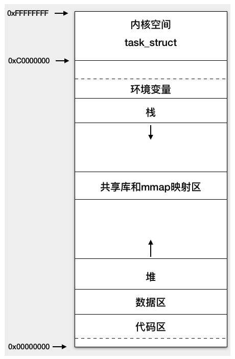

进程的虚拟地址空间总体分为用户空间和内核空间，这是基于安全上的考虑，用户程序只能访问用户空间，内核程序可以访问整个进程空间，并且只有内核可以直接访问各种硬件资源，比如磁盘和网卡。用户程序通过系统调用来访问硬件资源，系统调用可以理解为内核实现的函数，比如应用程序要通过网卡接收数据，会调用 Socket 的 read 函数：

~~~c
ssize_t read(int fd,void *buf,size_t nbyte)
~~~

CPU 在执行系统调用的过程中会从用户态切换到内核态，CPU 在用户态下执行用户程序，使用的是用户空间的栈，访问用户空间的内存；当 CPU 切换到内核态后，执行内核代码，使用的是内核空间上的栈。

用户空间上还有一个共享库和mmap映射区，Linux 提供了内存映射函数 mmap， 它可将文件内容映射到这个内存区域，用户通过读写这段内存，从而实现对文件的读取和修改（内核会负责将数据刷新到磁盘文件），无需通过 read/write 系统调用来读写文件，省去了用户空间和内核空间之间的数据拷贝，Java 的 MappedByteBuffer 就是通过它来实现的；用户程序用到的系统共享库也是通过 mmap 映射到了这个区域

开始提到的task_struct结构体本身是分配在内核空间，它的vm_struct成员变量保存了各内存区域的起始和终止地址，此外task_struct中还保存了进程的其他信息，比如进程号、打开的文件、创建的 Socket 以及 CPU 运行上下文等

在 Linux 中，线程是一个轻量级的进程，轻量级说的是线程只是一个 CPU 调度单元，因此线程有自己的task_struct结构体和运行栈区，但是线程的其他资源都是跟父进程共用的。

内核维护了一个可运行的进程队列，所有处于TASK_RUNNING状态的进程都会被放入运行队列中，排队使用 CPU 时间片，时间片用完重新调度 CPU。所谓调度就是在可运行进程列表中选择一个进程，再从 CPU 列表中选择一个可用的 CPU，将进程的上下文恢复到这个 CPU 的寄存器中，然后执行进程上下文指定的下一条指令：


而阻塞的本质就是将进程的task_struct移出运行队列，添加到等待队列，并且将进程的状态的置为TASK_UNINTERRUPTIBLE或者TASK_INTERRUPTIBLE，重新触发一次 CPU 调度让出 CPU

线程唤醒的过程：线程在加入到等待队列的同时向内核注册了一个回调函数，告诉内核我在等待这个 Socket 上的数据，如果数据到了就唤醒我。这样当网卡接收到数据时，产生硬件中断，内核再通过调用回调函数唤醒进程。唤醒的过程就是将进程的task_struct从等待队列移到运行队列，并且将task_struct的状态置为TASK_RUNNING，这样进程就有机会重新获得 CPU 时间片

这个过程中，内核还会将数据从内核空间拷贝到用户空间的堆上：


当 read 系统调用返回时，CPU 又从内核态切换到用户态，继续执行 read 调用的下一行代码，并且能从用户空间上的 Buffer 读到数据了


# 容器

## 层次结构

连接器处理 Socket 通信和应用层协议的解析，得到 Servlet 请求；而容器则负责处理 Servlet 请求

Tomcat 设计了 4 种容器，分别是 Engine、Host、Context 和 Wrapper。这 4 种容器不是平行关系，而是父子关系：


Tomcat通过这种分层的架构，使得Servlet容器具有很好的灵活性：

* 一个 Service 最多只能有一个 Engine，Engine 表示引擎，用来管理多个虚拟站点
* Host 代表的是一个虚拟主机，或者说一个站点，每个站点可以配置一个虚拟主机地址
* Context 表示一个 Web 应用程序，Wrapper 表示一个 Servlet，一个 Web 应用程序中可能会有多个 Servlet

它们在Tomcat的server.xml中可以找到对应的概念：

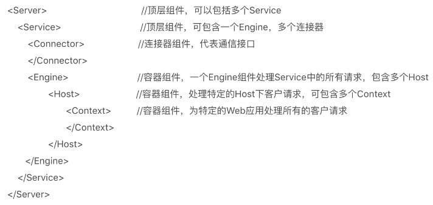

Tomcat 用组合模式来管理这些容器，所有容器组件都实现了 Container 接口（容器组件分为单容器对象Wrapper和组合容器对象Context、Host和Engine），Container 接口定义如下：

~~~java
public interface Container extends Lifecycle {
    public void setName(String name);
    public Container getParent();
    public void setParent(Container container);
    public void addChild(Container child);
    public void removeChild(Container child);
    public Container findChild(String name);
}
~~~

包含了子父关系、生命周期相关的API

## 请求定位Servlet的过程

Tomcat 是怎么确定请求是由哪个 Wrapper 容器里的 Servlet 来处理的呢？答案是，Tomcat 是用 Mapper 组件来完成这个任务的。

Mapper 组件的功能就是将用户请求的 URL 定位到一个 Servlet，Mapper 组件里保存了 Web 应用的配置信息，其实就是容器组件与访问路径的映射关系，比如 Host 容器里配置的域名、Context 容器里的 Web 应用路径，以及 Wrapper 容器里 Servlet 映射的路径，你可以想象这些配置信息就是一个多层次的 Map

例如有一个网购系统，有面向网站管理人员的后台管理系统，还有面向终端客户的在线购物系统。这两个系统跑在同一个 Tomcat 上，为了隔离它们的访问域名，配置了两个虚拟域名：manage.shopping.com和user.shopping.com，若有人访问http://user.shopping.com:8080/order/buy，则就会按照下图进行处理和解析：

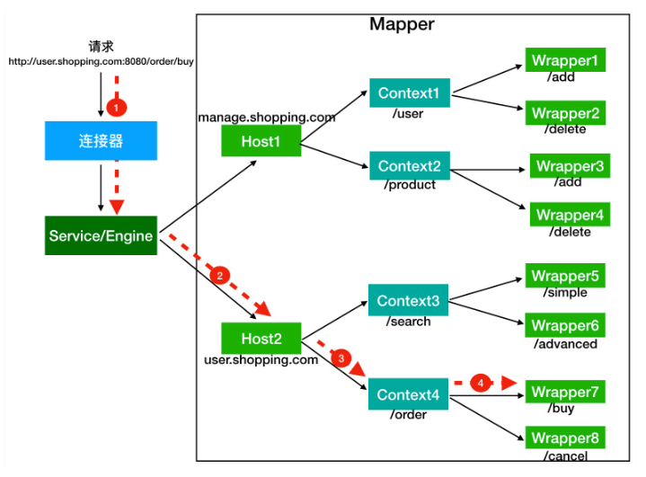

首先根据协议和端口号，选择Service和Engine。

Tomcat的每个连接器都监听不同的端口，比如 Tomcat 默认的 HTTP 连接器监听 8080 端口、默认的 AJP 连接器监听 8009 端口，上面的例子访问的是8080端口，因此它会被HTTP连接器接收，HTTP连接器所在的Service组件就确定了，它包含的Engine容器也确定了。

然后就是根据域名选择Host、根据URL路径找到Context和Wrapper。

不是只有 Servlet 才会去处理请求，实际上这个查找路径上的父子容器都会对请求做一些处理，在整个路径上都会处理一部分请求后，然后将请求继续传递给下层的容器

## Pipeline-Valve 管道

Pipeline-Valve 管道负责上述的具体调用过程，它是责任链模式。

Valve 表示一个处理点，比如权限认证和记录日志：

~~~java
public interface Valve {
  public Valve getNext();
  public void setNext(Valve valve);
  public void invoke(Request request, Response response)
}
~~~

invoke就是处理请求的，getNext和setNext可以看出多个Value其实是一个链表。

Pipeline 接口的定义：

~~~java‘
public interface Pipeline extends Contained {
  public void addValve(Valve valve);
  public Valve getBasic();
  public void setBasic(Valve valve);
  public Valve getFirst();
}
~~~

Pipeline 可以帮助维护Value链表，如addValve。getFirst和getBasic方法的作用如下图：

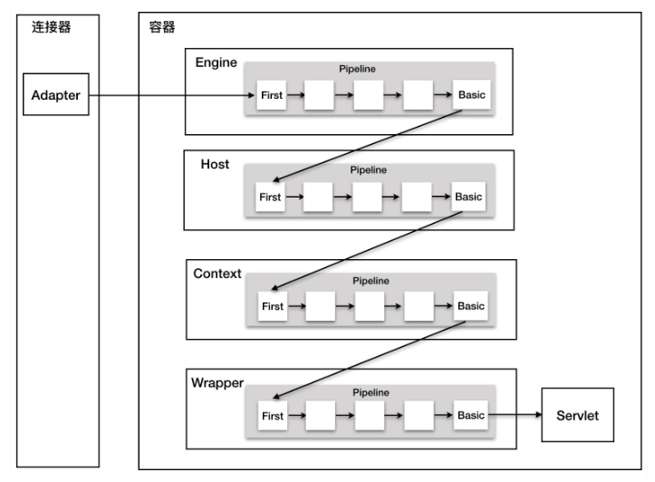

每个容器都有一个Pipeline 对象，只要触发这个 Pipeline 的第一个 Valve，这个容器里 Pipeline 中的 Valve 就都会被调用到。BasicValve 处于 Valve 链表的末端，它负责调用下层容器的 Pipeline 里的第一个 Valve。

Wrapper 容器的最后一个 Valve 会创建一个 Filter 链，并调用 doFilter() 方法，最终会调到 Servlet 的 service 方法。

Valve 和 Filter的区别是：

* Valve 是 Tomcat 的私有机制，与 Tomcat 的基础架构 /API 是紧耦合的。Servlet API 是公有的标准，所有的 Web 容器包括 Jetty 都支持 Filter 机制
* Valve 工作在 Web 容器级别，拦截所有应用的请求；Servlet Filter 工作在应用级别，只能拦截某个 Web 应用的所有请求


## 热部署和热加载

要在运行的过程中升级 Web 应用，如果你不想重启系统，实现的方式有两种：热加载和热部署

- 热加载的实现方式是 Web 容器启动一个后台线程，定期检测类文件的变化，如果有变化，就重新加载类，在这个过程中不会清空 Session ，一般用在开发环境。
- 热部署原理类似，也是由后台线程定时检测 Web 应用的变化，但它会重新加载整个 Web 应用。这种方式会清空 Session，比热加载更加干净、彻底，一般用在生产环境。

Tomcat使用Java的ScheduledThreadPoolExecutor来执行周期性的任务，其中任务类是ContainerBackgroundProcessor，它是一个 Runnable，同时也是 ContainerBase 的内部类，ContainerBase 是所有容器组件的基类，容器组件就包括前面提到的Engine、Host、Context 和 Wrapper 等

ContainerBackgroundProcessor 的实现：

~~~java
protected class ContainerBackgroundProcessor implements Runnable {
 
    @Override
    public void run() {
        // 请注意这里传入的参数是 " 宿主类 " 的实例
        processChildren(ContainerBase.this);
    }
 
    protected void processChildren(Container container) {
        try {
            //1. 调用当前容器的 backgroundProcess 方法。
            container.backgroundProcess();
            
            //2. 遍历所有的子容器，递归调用 processChildren，
            // 这样当前容器的子孙都会被处理            
            Container[] children = container.findChildren();
            for (int i = 0; i < children.length; i++) {
            // 这里请你注意，容器基类有个变量叫做 backgroundProcessorDelay，如果大于 0，表明子容器有自己的后台线程，无需父容器来调用它的 processChildren 方法。
                if (children[i].getBackgroundProcessorDelay() <= 0) {
                    processChildren(children[i]);
                }
            }
        } catch (Throwable t) { ... }
~~~

processChildren方法把自己的宿主类当做参数传入。在 processChildren 方法里，就做了两步：调用当前容器的 backgroundProcess 方法，以及递归调用子孙的 backgroundProcess 方法。请你注意 backgroundProcess 是 Container 接口中的方法，也就是说所有类型的容器都可以实现这个方法，在这个方法里完成需要周期性执行的任务。

这样的设计就意味着只要在顶层容器中启动一个后台线程，这个线程不但会执行容器的周期性任务，还会执行所有子容器的周期性任务。每个具体容器类如果有周期性任务要执行，就实现backgroundProcess 方法，否则就重用基类ContainerBase 的方法，ContainerBase的backgroundProcess 方法的实现：

~~~java
public void backgroundProcess() {
 
    //1. 执行容器中 Cluster 组件的周期性任务
    Cluster cluster = getClusterInternal();
    if (cluster != null) {
        cluster.backgroundProcess();
    }
    
    //2. 执行容器中 Realm 组件的周期性任务
    Realm realm = getRealmInternal();
    if (realm != null) {
        realm.backgroundProcess();
   }
   
   //3. 执行容器中 Valve 组件的周期性任务
    Valve current = pipeline.getFirst();
    while (current != null) {
       current.backgroundProcess();
       current = current.getNext();
    }
    
    //4. 触发容器的 " 周期事件 "，Host 容器的监听器 HostConfig 就靠它来调用
    fireLifecycleEvent(Lifecycle.PERIODIC_EVENT, null);
}
~~~

从上面的代码可以看到，不仅每个容器可以有周期性任务，每个容器中的其他通用组件，比如跟集群管理有关的 Cluster 组件、跟安全管理有关的 Realm 组件都可以有自己的周期性任务。容器中的 Valve 也可以有周期性任务，并且被 ContainerBase 统一处理。

在 backgroundProcess 方法的最后，还触发了容器的“周期事件”，它也是一种扩展机制，容器如果有自己的周期任务，就建立一个监听器来监听该事件，到时间会触发。

作为ContainerBase的具体子类，Context容器实现了它自己的backgroundProcess 方法，Tomcat的热加载就是在这里面完成的：

~~~java
public void backgroundProcess() {
 
    //WebappLoader 周期性的检查 WEB-INF/classes 和 WEB-INF/lib 目录下的类文件
    Loader loader = getLoader();
    if (loader != null) {
        loader.backgroundProcess();        
    }
    
    //Session 管理器周期性的检查是否有过期的 Session
    Manager manager = getManager();
    if (manager != null) {
        manager.backgroundProcess();
    }
    
    // 周期性的检查静态资源是否有变化
    WebResourceRoot resources = getResources();
    if (resources != null) {
        resources.backgroundProcess();
    }
    
    // 调用父类 ContainerBase 的 backgroundProcess 方法
    super.backgroundProcess();
}
~~~

Context 容器通过 WebappLoader 来做各种动作。WebappLoader 主要调用了Context容器的reload方法来实现热加载的，它完成了以下任务：

1. 停止和销毁 Context 容器及其所有子容器，子容器其实就是 Wrapper，也就是说 Wrapper 里面 Servlet 实例也被销毁了。
2. 停止和销毁 Context 容器关联的 Listener 和 Filter。
3. 停止和销毁 Context 下的 Pipeline 和各种 Valve。
4. 停止和销毁 Context 的类加载器，以及类加载器加载的类文件资源。
5. 启动 Context 容器，在这个过程中会重新创建前面四步被销毁的资源。

一个 Context 容器对应一个类加载器，类加载器在销毁的过程中会把它加载的所有类也全部销毁。Context 容器在启动过程中，会创建一个新的类加载器来加载新的类文件。Tomcat 的热加载默认是关闭的，你需要在 conf 目录下的 Context.xml 文件中设置 reloadable 参数来开启这个功能，像下面这样：

~~~xml
<Context reloadable="true"/>
~~~

热部署跟热加载的本质区别是，热部署会重新部署 Web 应用，原来的 Context 对象会整个被销毁掉，因此这个 Context 所关联的一切资源都会被销毁，包括 Session。热部署主要由Context的父容器Host来实现，它是通过监听周期事件来完成的（为了和上面的触发体系独立开），当周期事件出现后：

~~~java
public void lifecycleEvent(LifecycleEvent event) {
    // 执行 check 方法。
    if (event.getType().equals(Lifecycle.PERIODIC_EVENT)) {
        check();
    } 
}

protected void check() {
 
    if (host.getAutoDeploy()) {
        // 检查这个 Host 下所有已经部署的 Web 应用
        DeployedApplication[] apps =
            deployed.values().toArray(new DeployedApplication[0]);
            
        for (int i = 0; i < apps.length; i++) {
            // 检查 Web 应用目录是否有变化
            checkResources(apps[i], false);
        }
 
        // 执行部署
        deployApps();
    }
}
~~~

这里会检查 webapps 目录下的所有 Web 应用：

- 如果原来 Web 应用目录被删掉了，就把相应 Context 容器整个销毁掉。
- 是否有新的 Web 应用目录放进来了，或者有新的 WAR 包放进来了，就部署相应的 Web 应用。

## 打破双亲委托机制

Java的类加载，就是把class文件加载到JVM的方法区，并在JVM的堆区建立一个java.lang.Class对象的实例，它是业务类的模板，JVM通过这个模板来创建具体实例。

JVM 并不是在启动时就把所有的“.class”文件都加载一遍，而是程序在运行过程中用到了这个类才去加载。JVM 类加载是由类加载器来完成的，JDK 提供一个抽象类 ClassLoader，这个抽象类中定义了三个关键方法：

~~~java
public abstract class ClassLoader {
 
    // 每个类加载器都有个父加载器
    private final ClassLoader parent;
    
    public Class<?> loadClass(String name) {
  
        // 查找一下这个类是不是已经加载过了
        Class<?> c = findLoadedClass(name);
        
        // 如果没有加载过
        if( c == null ){
          // 先委托给父加载器去加载，注意这是个递归调用
          if (parent != null) {
              c = parent.loadClass(name);
          }else {
              // 如果父加载器为空，查找 Bootstrap 加载器是不是加载过了
              c = findBootstrapClassOrNull(name);
          }
        }
        // 如果父加载器没加载成功，调用自己的 findClass 去加载
        if (c == null) {
            c = findClass(name);
        }
        
        return c；
    }
    
    protected Class<?> findClass(String name){
       //1. 根据传入的类名 name，到在特定目录下去寻找类文件，把.class 文件读入内存
          ...
          
       //2. 调用 defineClass 将字节数组转成 Class 对象
       return defineClass(buf, off, len)；
    }
    
    // 将字节码数组解析成一个 Class 对象，用 native 方法实现
    protected final Class<?> defineClass(byte[] b, int off, int len){
       ...
    }
}
~~~

JVM 的类加载器是分层次的，它们有父子关系，每个类加载器都持有一个 parent 字段，指向父加载器（类加载器的父子关系不是通过继承来实现的，而是通过这个字段实现的）

几个重要的方法作用：

* defineClass 方法是个工具方法，它的职责是调用 native 方法把 Java 类的字节码解析成一个 Class 对象
* findClass 方法的主要职责就是找到“.class”文件，可能来自文件系统或者网络，找到后把“.class”文件读到内存得到字节码数组，然后调用 defineClass 方法得到 Class 对象
* loadClass是个public方法，它才是对外提供服务的接口，具体实现：首先检查这个类是不是已经被加载过了，如果加载过了直接返回，否则交给父加载器去加载，当父加载器在自己的加载范围内找不到时，才会交还给子加载器加载，这就是双亲委托机制

JDK中的加载器：


* BootstrapClassLoader 是启动类加载器，由 C 语言实现，用来加载 JVM 启动时所需要的核心类，比如rt.jar、resources.jar等。
* ExtClassLoader 是扩展类加载器，用来加载\jre\lib\ext目录下 JAR 包。
* AppClassLoader 是系统类加载器，用来加载 classpath 下的类，应用程序默认用它来加载类。
* 自定义类加载器，用来加载自定义路径下的类。

这些类加载器的工作原理是一样的，区别是它们的加载路径不同，也就是说 findClass 这个方法查找的路径不同。

双亲委托机制是为了保证一个 Java 类在 JVM 中是唯一的，假如你不小心写了一个与 JRE 核心类同名的类，比如 Object 类，双亲委托机制能保证加载的是 JRE 里的那个 Object 类，而不是你写的 Object 类。这是因为 AppClassLoader 在加载你的 Object 类时，会委托给 ExtClassLoader 去加载，而 ExtClassLoader 又会委托给 BootstrapClassLoader，BootstrapClassLoader 发现自己已经加载过了 Object 类，会直接返回，不会去加载你写的 Object 类。

如果要打破双亲委托机制，就需要重写 loadClass 方法，因为 loadClass 的默认实现就是双亲委托机制。

Tomcat 的自定义类加载器 WebAppClassLoader 打破了双亲委托机制，它首先自己尝试去加载某个类，如果找不到再代理给父类加载器，其目的是优先加载 Web 应用自己定义的类。

它findClass 方法的实现：

~~~java
public Class<?> findClass(String name) throws ClassNotFoundException {
    ...
    
    Class<?> clazz = null;
    try {
            //1. 先在 Web 应用目录下查找类 
            clazz = findClassInternal(name);
    }  catch (RuntimeException e) {
           throw e;
       }
    
    if (clazz == null) {
    try {
            //2. 如果在本地目录没有找到，交给父加载器去查找
            clazz = super.findClass(name);
    }  catch (RuntimeException e) {
           throw e;
       }
    
    //3. 如果父类也没找到，抛出 ClassNotFoundException
    if (clazz == null) {
        throw new ClassNotFoundException(name);
     }
 
    return clazz;
}
~~~

loadClass 方法的实现：

~~~java
public Class<?> loadClass(String name, boolean resolve) throws ClassNotFoundException {
 
    synchronized (getClassLoadingLock(name)) {
 
        Class<?> clazz = null;
 
        //1. 先在本地 cache 查找该类是否已经加载过
        clazz = findLoadedClass0(name);
        if (clazz != null) {
            if (resolve)
                resolveClass(clazz);
            return clazz;
        }
 
        //2. 从系统类加载器的 cache 中查找是否加载过
        clazz = findLoadedClass(name);
        if (clazz != null) {
            if (resolve)
                resolveClass(clazz);
            return clazz;
        }
 
        // 3. 尝试用 ExtClassLoader 类加载器类加载，为什么？
        ClassLoader javaseLoader = getJavaseClassLoader();
        try {
            clazz = javaseLoader.loadClass(name);
            if (clazz != null) {
                if (resolve)
                    resolveClass(clazz);
                return clazz;
            }
        } catch (ClassNotFoundException e) {
            // Ignore
        }
 
        // 4. 尝试在本地目录搜索 class 并加载
        try {
            clazz = findClass(name);
            if (clazz != null) {
                if (resolve)
                    resolveClass(clazz);
                return clazz;
            }
        } catch (ClassNotFoundException e) {
            // Ignore
        }
 
        // 5. 尝试用系统类加载器 (也就是 AppClassLoader) 来加载
            try {
                clazz = Class.forName(name, false, parent);
                if (clazz != null) {
                    if (resolve)
                        resolveClass(clazz);
                    return clazz;
                }
            } catch (ClassNotFoundException e) {
                // Ignore
            }
       }
    
    //6. 上述过程都加载失败，抛出异常
    throw new ClassNotFoundException(name);
}
~~~

前两步是从缓存中取，后面才是真正的加载动作：先用ExtClassLoader加载，然后在本地Web应用目录下查找并加载、最后由系统类加载器去加载（Class.forName的默认加载器就是系统类加载器），也就是说优先从JRE核心类中寻找，防止Web应用的类覆盖JRE的核心类，然后加载Web应用的类，最后再去加载其他位置的类

## 隔离Web应用

Tomcat 作为 Servlet 容器，它负责加载我们的 Servlet 类，此外它还负责加载 Servlet 所依赖的 JAR 包。并且 Tomcat 本身也是也是一个 Java 程序，因此它需要加载自己的类和依赖的 JAR 包。

Tomcat的类加载机制必须解决下面的问题：

1. 假如我们在 Tomcat 中运行了两个 Web 应用程序，两个 Web 应用中有同名的 Servlet，但是功能不同，Tomcat 需要同时加载和管理这两个同名的 Servlet 类，保证它们不会冲突，因此 Web 应用之间的类需要隔离。
2. 假如两个 Web 应用都依赖同一个第三方的 JAR 包，比如 Spring，那 Spring 的 JAR 包被加载到内存后，Tomcat 要保证这两个 Web 应用能够共享，也就是说 Spring 的 JAR 包只被加载一次，否则随着依赖的第三方 JAR 包增多，JVM 的内存会膨胀。
3. 跟 JVM 一样，我们需要隔离 Tomcat 本身的类和 Web 应用的类。

为了解决上面的问题，Tomcat设计了下面这种加载器体系：

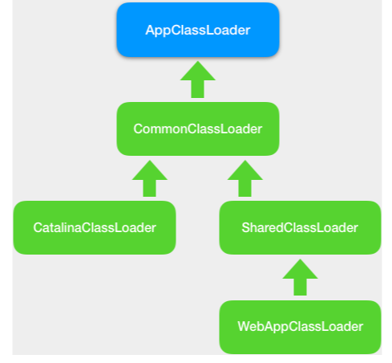

1、WebAppClassLoader：每个 Context 容器负责创建和维护一个 WebAppClassLoader 加载器实例。这样不同的加载器实例加载的类被认为是不同的类，即使它们的类名相同。它的作用是，不同Web 应用之间的类相互隔离。每个 Web 应用自己的 Java 类文件和依赖的 JAR 包，分别放在WEB-INF/classes和WEB-INF/lib目录下面

2、SharedClassLoader：不同Web应用之间也应该有共享的类，例如Spring，SharedClassLoader作为WebAppClassLoader的父加载器，专门来加载 Web 应用之间共享的类。如果 WebAppClassLoader 自己没有加载到某个类，就会委托父加载器 SharedClassLoader 去加载这个类。多个应用共享的 Java 类文件和 JAR 包，分别放在 Web 容器指定的共享目录下

3、CatalinaClassloader：为了隔离Tomcat 本身的类和 Web 应用的类，必须在SharedClassLoader同级定义一个新的类加载器，它就是CatalinaClassloader，专门来加载 Tomcat 自身的类

4、CommonClassLoader：用于加载Tomcat 和各 Web 应用之间需要共享一些类

在 JVM 的实现中有一条隐含的规则，默认情况下，如果一个类由类加载器 A 加载，那么这个类的依赖类也是由相同的类加载器加载。比如 Spring 作为一个 Bean 工厂，它需要创建业务类的实例，并且在创建业务类实例之前需要加载这些类，但根据之前的描述，Spring本身是SharedClassLoader 来加载的，Spring 又要去加载业务类，按照前面那条规则，加载 Spring 的类加载器也会用来加载业务类，但是业务类在 Web 应用目录下，不在 SharedClassLoader 的加载路径下。

为了解决这个问题，设计了一个线程上下文加载器的概念，这种类加载器保存在线程私有数据里，同一个线程使用一个类加载器。因此 Tomcat 为每个 Web 应用创建一个 WebAppClassLoarder 类加载器，并在启动 Web 应用的线程里设置线程上下文加载器，这样 Spring 在启动时就将线程上下文加载器取出来，用来加载 Bean：

~~~java
cl = Thread.currentThread().getContextClassLoader();
~~~

## 实现Servlet规范

### Servlet管理

Tomcat中，一个Context 容器需要管理多个 Servlet 实例。但 Context 容器并不直接持有 Servlet 实例，而是通过子容器 Wrapper 来管理 Servlet，Wrapper 是对Servlet的封装，它内部就有一个Servlet成员变量：

~~~java
protected volatile Servlet instance = null;
~~~

Wrapper 通过 loadServlet 方法来实例化 Servlet，loadServlet方法中，创建 Servlet 的实例，并且调用 Servlet 的 init 方法

~~~java
public synchronized Servlet loadServlet() throws ServletException {
    Servlet servlet;
  
    //1. 创建一个 Servlet 实例
    servlet = (Servlet) instanceManager.newInstance(servletClass);    
    
    //2. 调用了 Servlet 的 init 方法，这是 Servlet 规范要求的
    initServlet(servlet);
    
    return servlet;
}
~~~

为了加快系统的启动速度，Tomcat默认采用延迟加载的策略，不会在启动时调用loadServlet方法，除非把 Servlet 的loadOnStartup参数设置为true

虽然 Tomcat 在启动时不会创建 Servlet 实例，但是会创建 Wrapper 容器，等真正有请求来访问某个Servlet时，这个 Servlet 的实例才会被创建。

根据Tomcat 的 Pipeline-Valve 机制，每个容器组件都有自己的 Pipeline，每个 Pipeline 中有一个 Valve 链，并且每个容器组件有一个 BasicValve（基础阀）。Wrapper 作为一个容器组件，它也有自己的 Pipeline 和 BasicValve，Wrapper 的 BasicValve 叫StandardWrapperValve，就是它负责调用Servlet，当有请求到达这个Value时：

~~~java
public final void invoke(Request request, Response response) {
 
    //1. 实例化 Servlet
    servlet = wrapper.allocate();
   
    //2. 给当前请求创建一个 Filter 链
    ApplicationFilterChain filterChain =
        ApplicationFilterFactory.createFilterChain(request, wrapper, servlet);
 
   //3. 调用这个 Filter 链，Filter 链中的最后一个 Filter 会调用 Servlet
   filterChain.doFilter(request.getRequest(), response.getResponse());
 
}
~~~

### Filter管理

跟 Servlet 一样，Filter 也可以在web.xml文件里进行配置，不同的是，Filter 的作用域是整个 Web 应用，因此 Filter 的实例是在 Context 容器中进行管理的，Context 容器用 Map 集合来保存 Filter：

~~~java
private Map<String, FilterDef> filterDefs = new HashMap<>();
~~~

一个新的请求来了，就动态创建一个 FIlter 链，请求处理完了，Filter 链也就被回收了，Filter链对应的类：

~~~java
public final class ApplicationFilterChain implements FilterChain {
  
  //Filter 链中有 Filter 数组，这个好理解
  private ApplicationFilterConfig[] filters = new ApplicationFilterConfig[0];
    
  //Filter 链中的当前的调用位置
  private int pos = 0;
    
  // 总共有多少了 Filter
  private int n = 0;
 
  // 每个 Filter 链对应一个 Servlet，也就是它要调用的 Servlet
  private Servlet servlet = null;
  
  public void doFilter(ServletRequest req, ServletResponse res) {
        internalDoFilter(request,response);
  }
   
  private void internalDoFilter(ServletRequest req,
                                ServletResponse res){
 
    // 每个 Filter 链在内部维护了一个 Filter 数组
    if (pos < n) {
        ApplicationFilterConfig filterConfig = filters[pos++];
        Filter filter = filterConfig.getFilter();
 
        filter.doFilter(request, response, this);
        return;
    }
 
    servlet.service(request, response);
   
}
~~~

Filter 链中包括：Filter 对象的数组、Servlet实例。执行doFilter时，按顺序调用Filter的doFilter方法，最后调用Servlet 的 service 方法。

在Filter中的doFilter方法会调用Filter 链的 doFilter 方法，所以上面虽然没有循环，但是可以对整个链的Filter调用完成：

~~~java
public void doFilter(ServletRequest request, ServletResponse response,
        FilterChain chain){
        
          ...
          
          // 调用 Filter 的方法
          chain.doFilter(request, response);
      
      }
~~~

Filter 链跟 Tomcat 的 Pipeline-Valve 本质都是责任链模式。

### Listener管理

跟 Filter 一样，Listener 也是一种扩展机制，你可以监听容器内部发生的事件，主要有两类事件：

- 第一类是生命状态的变化，比如 Context 容器启动和停止、Session 的创建和销毁。
- 第二类是属性的变化，比如 Context 容器某个属性值变了、Session 的某个属性值变了以及新的请求来了等。

可以在web.xml配置或者通过注解的方式来添加监听器，在监听器里实现我们的业务逻辑。对于 Tomcat 来说，它需要读取配置文件，拿到监听器类的名字，实例化这些类，并且在合适的时机调用这些监听器的方法

Tomcat 是通过 Context 容器来管理这些监听器的。Context 容器将两类事件分开来管理，分别用不同的集合来存放不同类型事件的监听器：

~~~java
// 监听属性值变化的监听器
private List<Object> applicationEventListenersList = new CopyOnWriteArrayList<>();
 
// 监听生命事件的监听器
private Object applicationLifecycleListenersObjects[] = new Object[0];
~~~

剩下的事情就是触发监听器了，比如在 Context 容器的启动方法里，就触发了所有的 ServletContextListener：

~~~java
//1. 拿到所有的生命周期监听器
Object instances[] = getApplicationLifecycleListeners();
 
for (int i = 0; i < instances.length; i++) {
   //2. 判断 Listener 的类型是不是 ServletContextListener
   if (!(instances[i] instanceof ServletContextListener))
      continue;
 
   //3. 触发 Listener 的方法
   ServletContextListener lr = (ServletContextListener) instances[i];
   lr.contextInitialized(event);
}
~~~

需要注意的是，这里的 ServletContextListener 接口是一种留给用户的扩展机制，用户可以实现这个接口来定义自己的监听器，监听 Context 容器的启停事件。Spring 就是这么做的

## 异步Servlet

当Web 应用需要较长的时间来处理请求（比如数据库查询或者等待下游的服务调用返回），那么 Tomcat 线程一直不回收，会占用系统资源，在极端情况下会导致“线程饥饿”，也就是说 Tomcat 和 Jetty 没有更多的线程来处理新的请求

Servlet 3.0 中引入的异步 Servlet。主要是在 Web 应用里启动一个单独的线程来执行这些比较耗时的请求，而 Tomcat 线程立即返回，不再等待 Web 应用将请求处理完，这样 Tomcat 线程可以立即被回收到线程池，用来响应其他请求，降低了系统的资源消耗，同时还能提高系统的吞吐量

异步Servlet的在java中的实现：

~~~java
@WebServlet(urlPatterns = {"/async"}, asyncSupported = true)
public class AsyncServlet extends HttpServlet {
 
    //Web 应用线程池，用来处理异步 Servlet
    ExecutorService executor = Executors.newSingleThreadExecutor();
 
    public void service(HttpServletRequest req, HttpServletResponse resp) {
        //1. 调用 startAsync 或者异步上下文
        final AsyncContext ctx = req.startAsync();
 
       // 用线程池来执行耗时操作
        executor.execute(new Runnable() {
 
            @Override
            public void run() {
 
                // 在这里做耗时的操作
                try {
                    ctx.getResponse().getWriter().println("Handling Async Servlet");
                } catch (IOException e) {}
 
                //3. 异步 Servlet 处理完了调用异步上下文的 complete 方法
                ctx.complete();
            }
 
        });
    }
}
~~~

通过注解的方式来注册 Servlet，除了 @WebServlet 注解，还需要加上 asyncSupported=true 的属性，表明当前的 Servlet 是一个异步 Servlet。

重要的动作有两个：

* Request 对象的 startAsync 方法来拿到一个异步上下文 AsyncContext。这个上下文保存了请求和响应对象
* Web 应用需要开启一个新线程来处理耗时的操作，处理完成后需要调用 AsyncContext 的 complete 方法。目的是告诉 Tomcat，请求已经处理完成

虽然异步 Servlet 允许用更长的时间来处理请求，但是也有超时限制的，默认是 30 秒，如果 30 秒内请求还没处理完，Tomcat 会触发超时机制，向浏览器返回超时错误，如果这个时候你的 Web 应用再调用ctx.complete方法，会得到一个 IllegalStateException 异常。

1、startAsync 方法的解析

startAsync 方法其实就是创建了一个异步上下文 AsyncContext 对象，AsyncContext 对象的作用是保存请求的中间信息，比如 Request 和 Response 对象等上下文信息，保证Tomcat工作线程返回后，用户线程还能正常使用这些信息。

除了创建 AsyncContext 对象，startAsync 还需要完成一个关键任务，那就是告诉 Tomcat 当前的 Servlet 处理方法返回时，不要把响应发到浏览器。并且不能把 Request 对象和 Response 对象销毁，因为后面 Web 应用还要用呢

在 Tomcat 中，负责 flush 响应数据的是 CoyoteAdaptor，它还会销毁 Request 对象和 Response 对象

连接器是调用 CoyoteAdapter 的 service 方法来处理请求的，而 CoyoteAdapter 会调用容器的 service 方法，当容器的 service 方法返回时，CoyoteAdapter 判断当前的请求是不是异步 Servlet 请求，如果是，就不会销毁 Request 和 Response 对象，也不会把响应信息发到浏览器：

~~~java
public void service(org.apache.coyote.Request req, org.apache.coyote.Response res) {
    
   // 调用容器的 service 方法处理请求
    connector.getService().getContainer().getPipeline().
           getFirst().invoke(request, response);
   
   // 如果是异步 Servlet 请求，仅仅设置一个标志，
   // 否则说明是同步 Servlet 请求，就将响应数据刷到浏览器
    if (request.isAsync()) {
        async = true;
    } else {
        request.finishRequest();
        response.finishResponse();
    }
   
   // 如果不是异步 Servlet 请求，就销毁 Request 对象和 Response 对象
    if (!async) {
        request.recycle();
        response.recycle();
    }
}
~~~

当 CoyoteAdaptor 的 service 方法返回到 ProtocolHandler 组件时，ProtocolHandler 判断返回值，如果当前请求是一个异步 Servlet 请求，它会把当前 Socket 的协议处理者 Processor 缓存起来，将 SocketWrapper 对象和相应的 Processor 存到一个 Map 数据结构里：

~~~java
private final Map<S,Processor> connections = new ConcurrentHashMap<>();
~~~

之所以要缓存是因为这个请求接下来还要接着处理，还是由原来的 Processor 来处理，通过 SocketWrapper 就能从 Map 里找到相应的 Processor

2、complete 方法的解析

它主要就是把响应数据发送到浏览器，但不能由 Web 应用线程来做，而是生成一个新的 SocketProcessor 任务类，交给线程池处理（类似连接器中的 Endpoint 组件检测到有请求数据达到时，会创建一个 SocketProcessor 对象交给线程池去处理）。对于异步 Servlet 请求来说，相应的 Socket 和协议处理组件 Processor 都被缓存起来了，并且这些对象都可以通过 Request 对象拿到

异步Servlet的过程：

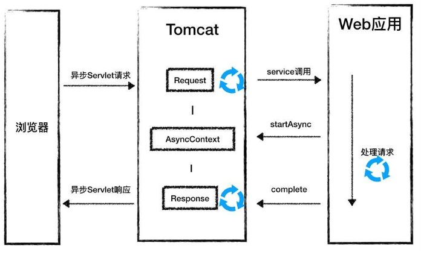

使用异步Servlet只是让Tomcat 的Web线程快速返回，让tomcat有机会接受更多的请求，并不能直接提升整个业务的吞吐量

## 嵌入式Web容器

为了方便开发和部署，Spring Boot 在内部启动了一个嵌入式的 Web 容器。

在 Tomcat 独立部署的模式下，我们通过 startup 脚本来启动 Tomcat，Tomcat 中的 Bootstrap 和 Catalina 会负责初始化类加载器，并解析server.xml和启动这些组件；在内嵌式的模式下，Bootstrap 和 Catalina 的工作就由 Spring Boot 来做了，Spring Boot 调用了 Tomcat 和 Jetty 的 API 来启动这些组件

为了支持多种 Web 容器，Spring Boot 对内嵌式 Web 容器进行了抽象，定义了WebServer接口：

~~~java
public interface WebServer {
    void start() throws WebServerException;
    void stop() throws WebServerException;
    int getPort();
}
~~~

各种 Web 容器比如 Tomcat 和 Jetty 需要去实现这个接口。

Spring Boot 还定义了一个工厂ServletWebServerFactory来创建 Web 容器，返回的对象就是上面提到的 WebServer：

~~~java
public interface ServletWebServerFactory {
    WebServer getWebServer(ServletContextInitializer... initializers);
}
~~~

ServletContextInitializer是ServletContext 的初始化器，用于 ServletContext 中的一些配置：

~~~java
public interface ServletContextInitializer {
    void onStartup(ServletContext servletContext) throws ServletException;
}
~~~

如果想在 Servlet 容器启动时做一些事情，比如注册你自己的 Servlet，可以实现一个 ServletContextInitializer，在 Web 容器启动时，Spring Boot 会把所有实现了 ServletContextInitializer 接口的类收集起来，统一调它们的 onStartup 方法。

为了支持对内嵌式 Web 容器的定制化，Spring Boot 还定义了WebServerFactoryCustomizerBeanPostProcessor接口，它是一个 BeanPostProcessor，它在 postProcessBeforeInitialization 过程中去寻找 Spring 容器中 WebServerFactoryCustomizer类型的 Bean，并依次调用 WebServerFactoryCustomizer接口的 customize 方法做一些定制化：

~~~java
public interface WebServerFactoryCustomizer<T extends WebServerFactory> {
    void customize(T factory);
}
~~~

### 内嵌式Web容器的创建和启动

Spring 的核心是一个 ApplicationContext，它的抽象实现类 AbstractApplicationContext实现了著名的refresh方法，它用来新建或者刷新一个 ApplicationContext，在 refresh 方法中会调用 onRefresh 方法。而AbstractApplicationContext 的子类可以重写这个方法 onRefresh 方法，来实现特定 Context 的刷新逻辑，因此 ServletWebServerApplicationContext 就是通过重写 onRefresh 方法来创建内嵌式的 Web 容器，具体创建过程是这样的：

~~~java
@Override
protected void onRefresh() {
     super.onRefresh();
     try {
        // 重写 onRefresh 方法，调用 createWebServer 创建和启动 Tomcat
        createWebServer();
     }
     catch (Throwable ex) {
     }
}
 
//createWebServer 的具体实现
private void createWebServer() {
    // 这里 WebServer 是 Spring Boot 抽象出来的接口，具体实现类就是不同的 Web 容器
    WebServer webServer = this.webServer;
    ServletContext servletContext = this.getServletContext();
    
    // 如果 Web 容器还没创建
    if (webServer == null && servletContext == null) {
        // 通过 Web 容器工厂来创建
        ServletWebServerFactory factory = this.getWebServerFactory();
        // 注意传入了一个 "SelfInitializer"
        this.webServer = factory.getWebServer(new ServletContextInitializer[]{this.getSelfInitializer()});
        
    } else if (servletContext != null) {
        try {
            this.getSelfInitializer().onStartup(servletContext);
        } catch (ServletException var4) {
          ...
        }
    }
 
    this.initPropertySources();
}
~~~

再来看看 getWebSever 具体做了什么，以 Tomcat 为例，主要调用 Tomcat 的 API 去创建各种组件：

~~~java
public WebServer getWebServer(ServletContextInitializer... initializers) {
    //1. 实例化一个 Tomcat，可以理解为 Server 组件。
    Tomcat tomcat = new Tomcat();
    
    //2. 创建一个临时目录
    File baseDir = this.baseDirectory != null ? this.baseDirectory : this.createTempDir("tomcat");
    tomcat.setBaseDir(baseDir.getAbsolutePath());
    
    //3. 初始化各种组件
    Connector connector = new Connector(this.protocol);
    tomcat.getService().addConnector(connector);
    this.customizeConnector(connector);
    tomcat.setConnector(connector);
    tomcat.getHost().setAutoDeploy(false);
    this.configureEngine(tomcat.getEngine());
    
    //4. 创建定制版的 "Context" 组件。
    this.prepareContext(tomcat.getHost(), initializers);
    return this.getTomcatWebServer(tomcat);
}
~~~

### 注册Servlet的方式

1、通过注解

在 Spring Boot 启动类上加上 @ServletComponentScan 注解后，使用 @WebServlet、@WebFilter、@WebListener 标记的 Servlet、Filter、Listener 就可以自动注册到 Servlet 容器中，无需其他代码：

~~~java
@SpringBootApplication
@ServletComponentScan
public class xxxApplication
{}

@WebServlet("/hello")
public class HelloServlet extends HttpServlet {}

~~~

2、ServletRegistrationBean

Spring Boot 也提供了 ServletRegistrationBean、FilterRegistrationBean 和 ServletListenerRegistrationBean 这三个类分别用来注册 Servlet、Filter、Listener。假如要注册一个 Servlet，可以这样做：

~~~java
@Bean
public ServletRegistrationBean servletRegistrationBean() {
    return new ServletRegistrationBean(new HelloServlet(),"/hello");
}
~~~

这段代码实现的方法返回一个 ServletRegistrationBean，并将它当作 Bean 注册到 Spring 中，因此你需要把这段代码放到 Spring Boot 自动扫描的目录中，或者放到 @Configuration 标识的类中。

3、启动时动态创建

还可以创建一个类去实现前面提到的 ServletContextInitializer 接口，并把它注册为一个 Bean，Spring Boot 会负责调用这个接口的 onStartup 方法：

~~~java
@Component
public class MyServletRegister implements ServletContextInitializer {
 
    @Override
    public void onStartup(ServletContext servletContext) {
    
        //Servlet 3.0 规范新的 API
        ServletRegistration myServlet = servletContext
                .addServlet("HelloServlet", HelloServlet.class);
                
        myServlet.addMapping("/hello");
        
        myServlet.setInitParameter("name", "Hello Servlet");
    }
 
}
~~~

### Web容器的定制

在 Spring Boot 2.0 中，我们可以通过两种方式来定制 Web 容器：

1、通过通用的 Web 容器工厂 ConfigurableServletWebServerFactory，来定制一些 Web 容器通用的参数：

~~~java
@Component
public class MyGeneralCustomizer implements
  WebServerFactoryCustomizer<ConfigurableServletWebServerFactory> {
  
    public void customize(ConfigurableServletWebServerFactory factory) {
        factory.setPort(8081);
        factory.setContextPath("/hello");
     }
}
~~~

2、通过特定 Web 容器的工厂比如 TomcatServletWebServerFactory 来进一步定制。下面的例子里，我们给 Tomcat 增加一个 Valve，这个 Valve 的功能是向请求头里添加 traceid，用于分布式追踪。TraceValve 的定义如下：

~~~java
class TraceValve extends ValveBase {
    @Override
    public void invoke(Request request, Response response) throws IOException, ServletException {
 
        request.getCoyoteRequest().getMimeHeaders().
        addValue("traceid").setString("1234xxxxabcd");
 
        Valve next = getNext();
        if (null == next) {
            return;
        }
 
        next.invoke(request, response);
    }
 
}
~~~

然后再将其添加到Tomcat中：

~~~java
@Component
public class MyTomcatCustomizer implements
        WebServerFactoryCustomizer<TomcatServletWebServerFactory> {
 
    @Override
    public void customize(TomcatServletWebServerFactory factory) {
        factory.setPort(8081);
        factory.setContextPath("/hello");
        factory.addEngineValves(new TraceValve() );
 
    }
}
~~~


# 设计架构

## LifeCycle和设计模式

用一张简化的类图表示各组件的层次关系：

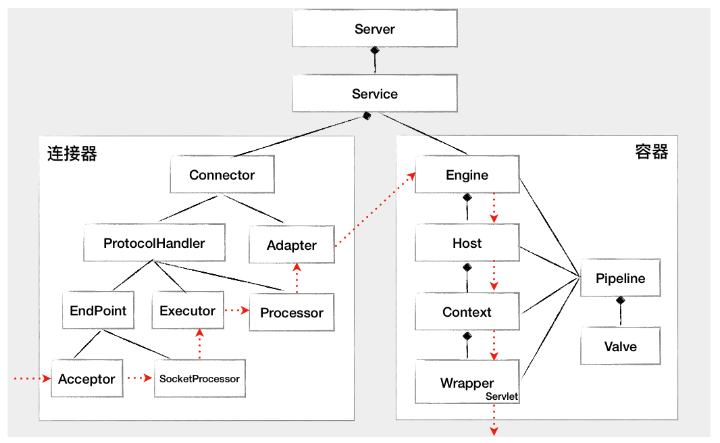

上面这张图描述了组件之间的静态关系，如果想让一个系统能够对外提供服务，我们需要创建、组装并启动这些组件；在服务停止的时候，我们还需要释放资源，销毁这些组件，因此这是一个动态的过程。Tomcat 需要动态地管理这些组件的生命周期

分析这些组件的关系，可以发现两个特点：

* 第一层关系是组件有大有小，大组件管理小组件，比如 Server 管理 Service，Service 又管理连接器和容器
* 第二层关系是组件有外有内，外层组件控制内层组件，比如连接器是外层组件，负责对外交流，外层组件调用内层组件完成业务功能。也就是说，请求的处理过程是由外层组件来驱动的

这两层关系决定了系统在创建组件时应该遵循一定的顺序：

* 第一个原则是先创建子组件，再创建父组件，子组件需要被“注入”到父组件中
* 第二个原则是先创建内层组件，再创建外层组件，内层组建需要被“注入”到外层组件

要设计这些组件的整体架构，需要找到系统的变化点和不变点。这里的不变点就是每个组件都要经历创建、初始化、启动这几个过程，这些状态以及状态的转化是不变的。而变化点是每个具体组件的初始化方法，也就是启动方法是不一样的

因此，我们把不变点抽象出来成为一个接口，这个接口跟生命周期有关，叫作 LifeCycle。LifeCycle 接口里应该定义这么几个方法：init()、start()、stop() 和 destroy()，每个具体的组件去实现这些方法。在父组件的 init() 方法里需要创建子组件并调用子组件的 init() 方法。同样，在父组件的 start() 方法里也需要调用子组件的 start() 方法，因此调用者可以无差别的调用各组件的 init() 方法和 start() 方法，这就是组合模式的使用，并且只要调用最顶层组件，也就是 Server 组件的 init() 和 start() 方法，整个 Tomcat 就被启动起来了

各个组件 init() 和 start() 方法的具体实现是复杂多变的，比如在 Host 容器的启动方法里需要扫描 webapps 目录下的 Web 应用，创建相应的 Context 容器，如果将来需要增加新的逻辑，直接修改 start() 方法？这样会违反开闭原则，为了增加系统的可扩展性，引入了事件的概念：

把组件状态的转变看作是一个事件，父组件的状态变化触发子组件，上层组件的初始化触发子组件的初始化，上层组件的启动触发子组件的启动，把直接修改方法就转换为了增加和删除监听器。这是组件生命周期过程中重要的扩展点

因此需要在LifeCycle中增加两个方法：添加监听器和删除监听器，并定义一个枚举表示组件有哪些状态，以及什么状态会触发什么事件：


Tomcat 定义一个基类 LifeCycleBase 来实现 LifeCycle 接口，把一些公共的逻辑放到基类中去，比如生命状态的转变与维护、生命事件的触发以及监听器的添加和删除等，而子类就负责实现自己的初始化、启动和停止等方法，这就是抽象基类。为了避免跟基类中的方法同名，我们把具体子类的实现方法改个名字，在后面加上 Internal：

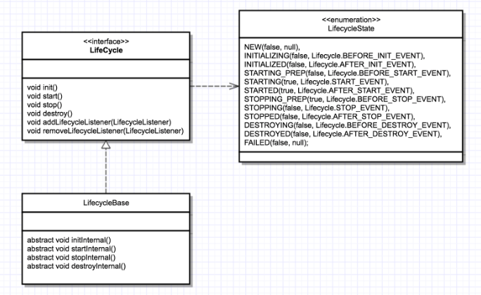

LifeCycleBase 实现了 LifeCycle 接口中所有的方法，还定义了相应的抽象方法交给具体子类去实现，这是典型的模板设计模式

LifeCycleBase 的 init() 方法实现：

~~~
@Override
public final synchronized void init() throws LifecycleException {
    //1. 状态检查
    if (!state.equals(LifecycleState.NEW)) {
        invalidTransition(Lifecycle.BEFORE_INIT_EVENT);
    }
 
    try {
        //2. 触发 INITIALIZING 事件的监听器
        setStateInternal(LifecycleState.INITIALIZING, null, false);
        
        //3. 调用具体子类的初始化方法
        initInternal();
        
        //4. 触发 INITIALIZED 事件的监听器
        setStateInternal(LifecycleState.INITIALIZED, null, false);
    } catch (Throwable t) {
      ...
    }
}
~~~

基本上就是触发监听器-调用子类方法的过程。注册监听器的时机有两种：

* Tomcat 自定义了一些监听器，这些监听器是父组件在创建子组件的过程中注册到子组件的。比如 MemoryLeakTrackingListener 监听器，用来检测 Context 容器中的内存泄漏，这个监听器是 Host 容器在创建 Context 容器时注册到 Context 中的
* 我们还可以在 server.xml 中定义自己的监听器，Tomcat 在启动时会解析 server.xml，创建监听器并注册到容器组件

Tomcat组件的总体类图：

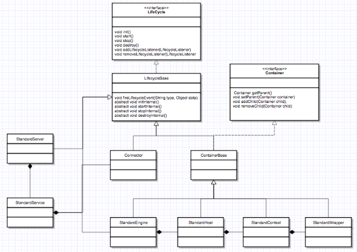

图中的 StandardServer、StandardService 等是 Server 和 Service 组件的具体实现类，它们都继承了 LifeCycleBase。

StandardEngine、StandardHost、StandardContext 和 StandardWrapper 是相应容器组件的具体实现类，因为它们都是容器，所以继承了 ContainerBase 抽象基类，而 ContainerBase 实现了 Container 接口，也继承了 LifeCycleBase 类，它们的生命周期管理接口和功能接口是分开的，这也符合设计中接口分离的原则

## 顶层组件的设计

我们可以通过 Tomcat 的 /bin 目录下的脚本 startup.sh 来启动 Tomcat，执行这个脚本后发生的事：

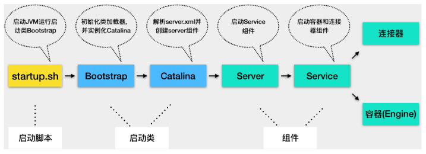

1.Tomcat 本质上是一个 Java 程序，因此 startup.sh 脚本会启动一个 JVM 来运行 Tomcat 的启动类 Bootstrap。

2.Bootstrap 的主要任务是初始化 Tomcat 的类加载器，并且创建 Catalina。

3.Catalina 是一个启动类，它通过解析 server.xml、创建相应的组件，并调用 Server 的 start 方法。

4.Server 组件的职责就是管理 Service 组件，它会负责调用 Service 的 start 方法。

5.Service 组件的职责就是管理连接器和顶层容器 Engine，因此它会调用连接器和 Engine 的 start 方法

1、Catalina 的启动：

~~~java
public void start() {
    //1. 如果持有的 Server 实例为空，就解析 server.xml 创建出来
    if (getServer() == null) {
        load();
    }
    //2. 如果创建失败，报错退出
    if (getServer() == null) {
        log.fatal(sm.getString("catalina.noServer"));
        return;
    }
 
    //3. 启动 Server
    try {
        getServer().start();
    } catch (LifecycleException e) {
        return;
    }
 
    // 创建并注册关闭钩子
    if (useShutdownHook) {
        if (shutdownHook == null) {
            shutdownHook = new CatalinaShutdownHook();
        }
        Runtime.getRuntime().addShutdownHook(shutdownHook);
    }
 
    // 用 await 方法监听停止请求
    if (await) {
        await();
        stop();
    }
}
~~~

它会解析server.xml，并把server.xml 里配置的各种组件一一创建出来，接着调用 Server 组件的 init 方法和 start 方法。

为了应对一些异常情况，比如通过Ctrl+C的方式关闭Tomcat时，需要在JVM关闭时做一些清理工作，如将缓存数据刷到磁盘上，或者清理一些临时文件。因此Catalina 在JVM中注册了一个关闭钩子，它其实就是一个线程，JVM 在停止之前会尝试执行这个线程的 run 方法：

~~~java
protected class CatalinaShutdownHook extends Thread {
 
    @Override
    public void run() {
        try {
            if (getServer() != null) {
                Catalina.this.stop();
            }
        } catch (Throwable ex) {
           ...
        }
    }
}
~~~

关闭钩子实际上执行了Server的stop方法，释放和清理所有的资源

2、Server组件

Server 组件的具体实现类是 StandardServer，它需要管理 Service 的生命周期，在内部维护了若干 Service 组件，它是以数组来保存的，下面的方法就是添加一个Service到Server中：

~~~java
@Override
public void addService(Service service) {
 
    service.setServer(this);
 
    synchronized (servicesLock) {
        // 创建一个长度 +1 的新数组
        Service results[] = new Service[services.length + 1];
        
        // 将老的数据复制过去
        System.arraycopy(services, 0, results, 0, services.length);
        results[services.length] = service;
        services = results;
 
        // 启动 Service 组件
        if (getState().isAvailable()) {
            try {
                service.start();
            } catch (LifecycleException e) {
                // Ignore
            }
        }
        // 触发监听事件
        support.firePropertyChange("service", null, service);
    }
}
~~~

当添加一个新的 Service 实例时，会创建一个新数组并把原来数组内容复制到新数组，这样做的目的其实是为了节省内存空间

Server 组件还有一个重要的任务是启动一个 Socket 来监听停止端口，这就是为什么你能通过 shutdown 命令来关闭 Tomcat。上面 Caralina 的启动方法的最后一行代码就是调用了 Server 的 await 方法，在 await 方法里会创建一个 Socket 监听 8005 端口，并在一个死循环里接收 Socket 上的连接请求，如果有新的连接到来就建立连接，然后从 Socket 中读取数据；如果读到的数据是停止命令“SHUTDOWN”，就退出循环，进入 stop 流程

3、Service组件

Service 组件的具体实现类是 StandardService，它内部维护了连接器和容器：

~~~java
public class StandardService extends LifecycleBase implements Service {
    // 名字
    private String name = null;
    
    //Server 实例
    private Server server = null;
 
    // 连接器数组
    protected Connector connectors[] = new Connector[0];
    private final Object connectorsLock = new Object();
 
    // 对应的 Engine 容器
    private Engine engine = null;
    
    // 映射器及其监听器
    protected final Mapper mapper = new Mapper();
    protected final MapperListener mapperListener = new MapperListener(this);

~~~

MapperListener的作用：用来实现热部署，当 Web 应用的部署发生变化时，Mapper 中的映射信息也要跟着变化，MapperListener 就是一个监听器，它监听容器的变化，并把信息更新到 Mapper 中，这是典型的观察者模式

它的启动方法：

~~~java
protected void startInternal() throws LifecycleException {
 
    //1. 触发启动监听器
    setState(LifecycleState.STARTING);
 
    //2. 先启动 Engine，Engine 会启动它子容器
    if (engine != null) {
        synchronized (engine) {
            engine.start();
        }
    }
    
    //3. 再启动 Mapper 监听器
    mapperListener.start();
 
    //4. 最后启动连接器，连接器会启动它子组件，比如 Endpoint
    synchronized (connectorsLock) {
        for (Connector connector: connectors) {
            if (connector.getState() != LifecycleState.FAILED) {
                connector.start();
            }
        }
    }
}
~~~

从启动方法可以看到，Service 先启动了 Engine 组件，再启动 Mapper 监听器，最后才是启动连接器。符合先启动内部组件，再启动外部组件的原则

4、Engine组件

它是容器的顶层组件，Engine 的子容器是 Host，所以它持有了一个 Host 容器的数组，这些功能都被抽象到了 ContainerBase 中，ContainerBase 中有这样一个数据结构：

~~~java
protected final HashMap<String, Container> children = new HashMap<>();
~~~

ContainerBase 用 HashMap 保存了它的子容器，并且 ContainerBase 还实现了子容器的“增删改查”，甚至连子组件的启动和停止都提供了默认实现，比如 ContainerBase 会用专门的线程池来启动子容器

容器组件最重要的功能是处理请求，而 Engine 容器对请求的“处理”，其实就是把请求转发给某一个 Host 子容器来处理，具体是通过 Valve 来实现的。每一个容器组件都有一个 Pipeline，而 Pipeline 中有一个基础阀（Basic Valve），而 Engine 容器的基础阀定义如下：

~~~java
final class StandardEngineValve extends ValveBase {
 
    public final void invoke(Request request, Response response)
      throws IOException, ServletException {
  
      // 拿到请求中的 Host 容器
      Host host = request.getHost();
      if (host == null) {
          return;
      }
  
      // 调用 Host 容器中的 Pipeline 中的第一个 Valve
      host.getPipeline().getFirst().invoke(request, response);
  }
  
}
~~~

请求到达 Engine 容器中之前，Mapper 组件已经对请求进行了路由处理，Mapper 组件通过请求的 URL 定位了相应的容器，并且把容器对象保存到了请求对象中，这就是为什么可以从请求中取到Host容器

## 线程模型

一般来说服务端程序有几个角色：Acceptor、Selector 和 Processor。

- Acceptor 负责接收新连接，也就是 accept；
- Selector 负责检测连接上的 I/O 事件，也就是 select；
- Processor 负责数据读写、编解码和业务处理，也就是 read、decode、process、encode、send

三个部分可能都属于一个线程，也可能属于不同的线程

对Netty来说，EventLoop 将 Selector 和 Processor 跑在同一个线程，一个 Channel 只能由一个 EventLoop 来处理，这就保证了任务执行的线程安全，并且用同一个线程来侦测 I/O 事件和读写数据，可以充分利用 CPU 缓存：

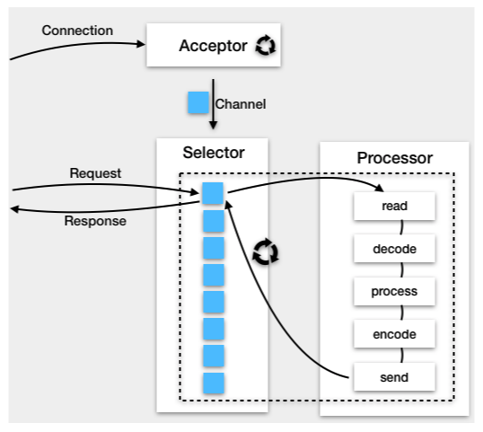

这样的线程模型要求Processor 中的任务能在短时间完成，否则会阻塞这个 EventLoop 上其他 Channel 的处理。因此在 Netty 中，可以设置业务处理和 I/O 处理的时间比率，超过这个比率则将任务扔到专门的业务线程池来执行，这一点跟 Jetty 的 EatWhatYouKill 线程策略类似

而Kafka和Tomcat，把 Selector 和 Processor 跑在不同的线程里，因为 Kafka 的业务逻辑大多涉及与磁盘读写，处理时间不确定，所以 Kafka 有专门的业务处理线程池来运行 Processor：

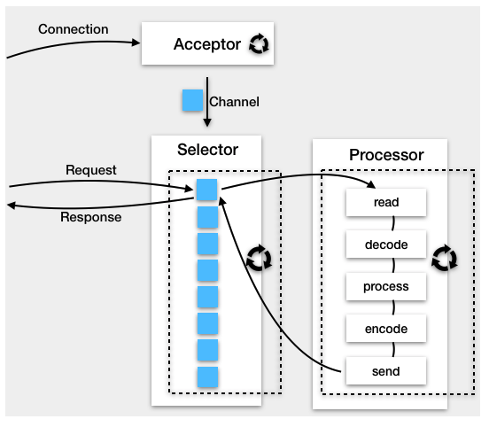

## 日志实现

日志模块作为一个通用的功能，在系统里通常会使用第三方的日志框架。Java 的日志框架有很多，比如：JUL（Java Util Logging）、Log4j、Logback、Log4j2、Tinylog 等。除此之外，还有 JCL（Apache Commons Logging）和 SLF4J 这样的“门面日志”。下面是 SLF4J 与日志框架 Logback、Log4j 的关系图：

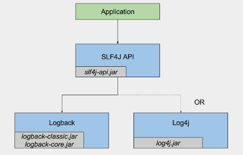

“门面日志”利用了设计模式中的门面模式思想，对外提供一套通用的日志记录的 API，而不提供具体的日志输出服务，如果要实现日志输出，需要集成其他的日志框架，比如 Log4j、Logback、Log4j2 等

这种门面模式的好处在于，记录日志的 API 和日志输出的服务分离开，代码里面只需要关注记录日志的 API，通过 SLF4J 指定的接口记录日志；而日志输出通过引入 JAR 包的方式即可指定其他的日志框架。当我们需要改变系统的日志输出服务时，不用修改代码，只需要改变引入日志输出框架 JAR 包

默认情况下，Tomcat 使用自身的 JULI 作为 Tomcat 内部的日志处理系统。JULI 的日志门面采用了 JCL；而 JULI 的具体实现是构建在 Java 原生的日志系统java.util.logging之上的

略 -》31

## Session管理

我们可以通过 Request 对象的 getSession 方法来获取 Session，并通过 Session 对象来读取和写入属性值。而 Session 的管理是由 Web 容器来完成的，主要是对 Session 的创建和销毁，除此之外 Web 容器还需要将 Session 状态的变化通知给监听者。

Session 管理还可以交给 Spring 来做，好处是与特定的 Web 容器解耦，Spring Session 的核心原理是通过 Filter 拦截 Servlet 请求，将标准的 ServletRequest 包装一下，换成 Spring 的 Request 对象，这样当我们调用 Request 对象的 getSession 方法时，Spring 在背后为我们创建和管理 Session

### Session创建

Tomcat 中主要由每个 Context 容器内的一个 Manager 对象来管理 Session。默认实现类为 StandardManager，它里面提供了一些方法：

* 添加和删除 Session 的方法
* load 和 unload 方法，它们的作用是分别是将 Session 持久化到存储介质和从存储介质加载 Session

当我们调用HttpServletRequest.getSession(true)时，这个参数 true 的意思是“如果当前请求还没有 Session，就创建一个新的”

HttpServletRequest 是一个接口，Tomcat 实现了这个接口，具体实现类是：org.apache.catalina.connector.Request，Tomcat 为了避免把一些实现细节暴露出来，还有基于安全上的考虑，定义了 Request 的包装类，叫作 RequestFacade：

~~~java
public class Request implements HttpServletRequest {}

public class RequestFacade implements HttpServletRequest {
  protected Request request = null;
  
  public HttpSession getSession(boolean create) {
     return request.getSession(create);
  }
}
~~~

因此我们拿到的 Request 类其实是 RequestFacade，RequestFacade 的 getSession 方法调用的是 Request 类的 getSession 方法：

~~~java
Context context = getContext();
if (context == null) {
    return null;
}
 
Manager manager = context.getManager();
if (manager == null) {
    return null;      
}
 
session = manager.createSession(sessionId);
session.access();
~~~

最后由StandardManager调用createSession方法，这个 createSession 方法定义在 父类ManagerBase 中：

~~~java
@Override
public Session createSession(String sessionId) {
    // 首先判断 Session 数量是不是到了最大值，最大 Session 数可以通过参数设置
    if ((maxActiveSessions >= 0) &&
            (getActiveSessions() >= maxActiveSessions)) {
        rejectedSessions++;
        throw new TooManyActiveSessionsException(
                sm.getString("managerBase.createSession.ise"),
                maxActiveSessions);
    }
 
    // 重用或者创建一个新的 Session 对象，请注意在 Tomcat 中就是 StandardSession
    // 它是 HttpSession 的具体实现类，而 HttpSession 是 Servlet 规范中定义的接口
    Session session = createEmptySession();
 
 
    // 初始化新 Session 的值
    session.setNew(true);
    session.setValid(true);
    session.setCreationTime(System.currentTimeMillis());
    session.setMaxInactiveInterval(getContext().getSessionTimeout() * 60);
    String id = sessionId;
    if (id == null) {
        id = generateSessionId();
    }
    session.setId(id);// 这里会将 Session 添加到 ConcurrentHashMap 中
    sessionCounter++;
    
    // 将创建时间添加到 LinkedList 中，并且把最先添加的时间移除
    // 主要还是方便清理过期 Session
    SessionTiming timing = new SessionTiming(session.getCreationTime(), 0);
    synchronized (sessionCreationTiming) {
        sessionCreationTiming.add(timing);
        sessionCreationTiming.poll();
    }
    return session
}
~~~

创建出来后 Session 会被保存到一个 ConcurrentHashMap 中：

~~~java
protected Map<String, Session> sessions = new ConcurrentHashMap<>();
~~~

Session 的具体实现类是 StandardSession，StandardSession 同时实现了javax.servlet.http.HttpSession和org.apache.catalina.Session接口，并且对程序员暴露的是 StandardSessionFacade 外观类，保证了 StandardSession 的安全，避免了程序员调用其内部方法进行不当操作

### 过期Session清理

容器组件会定期调用backgroundProcess方法进行一些后台逻辑的处理，在这个里面就进行了过期Session的处理，这个动作是有传递性的，子容器还会把这个动作传递给自己的子容器：

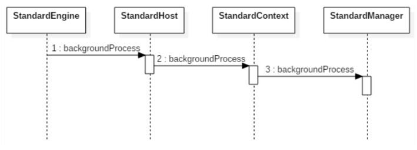

其中父容器会遍历所有的子容器并调用其 backgroundProcess 方法，而 StandardContext 重写了该方法：

~~~java
public void backgroundProcess() {
    // processExpiresFrequency 默认值为 6，而 backgroundProcess 默认每隔 10s 调用一次，也就是说除了任务执行的耗时，每隔 60s 执行一次
    count = (count + 1) % processExpiresFrequency;
    if (count == 0) // 默认每隔 60s 执行一次 Session 清理
        processExpires();
}
 
/**
 * 单线程处理，不存在线程安全问题
 */
public void processExpires() {
 
    // 获取所有的 Session
    Session sessions[] = findSessions();   
    int expireHere = 0 ;
    for (int i = 0; i < sessions.length; i++) {
        // Session 的过期是在 isValid() 方法里处理的
        if (sessions[i]!=null && !sessions[i].isValid()) {
            expireHere++;
        }
    }
}
~~~

backgroundProcess 由 Tomcat 后台线程调用，默认是每隔 10 秒调用一次，但是 Session 的清理动作不能太频繁，因为需要遍历 Session 列表，会耗费 CPU 资源，所以在 backgroundProcess 方法中做了取模处理，backgroundProcess 调用 6 次，才执行一次 Session 清理，也就是说 Session 清理每 60 秒执行一次

### Session事件通知

按照 Servlet 规范，在 Session 的生命周期过程中，要将事件通知监听者，Servlet 规范定义了 Session 的监听器接口：

~~~java
public interface HttpSessionListener extends EventListener {
    //Session 创建时调用
    public default void sessionCreated(HttpSessionEvent se) {
    }
    
    //Session 销毁时调用
    public default void sessionDestroyed(HttpSessionEvent se) {
    }
}
~~~

在Session的setId方法中，触发了这个监听器的事件。具体触发逻辑是：Tomcat 需要先创建 HttpSessionEvent 对象，然后遍历 Context 内部的 LifecycleListener，并且判断是否为 HttpSessionListener 实例，如果是的话则调用 HttpSessionListener 的 sessionCreated 方法进行事件通知：

~~~java
session.setId(id);
 
@Override
public void setId(String id, boolean notify) {
    // 如果这个 id 已经存在，先从 Manager 中删除
    if ((this.id != null) && (manager != null))
        manager.remove(this);
 
    this.id = id;
 
    // 添加新的 Session
    if (manager != null)
        manager.add(this);
 
    // 这里面完成了 HttpSessionListener 事件通知
    if (notify) {
        tellNew();
    }
}

public void tellNew() {
 
    // 通知 org.apache.catalina.SessionListener
    fireSessionEvent(Session.SESSION_CREATED_EVENT, null);
 
    // 获取 Context 内部的 LifecycleListener 并判断是否为 HttpSessionListener
    Context context = manager.getContext();
    Object listeners[] = context.getApplicationLifecycleListeners();
    if (listeners != null && listeners.length > 0) {
    
        // 创建 HttpSessionEvent
        HttpSessionEvent event = new HttpSessionEvent(getSession());
        for (int i = 0; i < listeners.length; i++) {
            // 判断是否是 HttpSessionListener
            if (!(listeners[i] instanceof HttpSessionListener))
                continue;
                
            HttpSessionListener listener = (HttpSessionListener) listeners[i];
            // 注意这是容器内部事件
            context.fireContainerEvent("beforeSessionCreated", listener);   
            // 触发 Session Created 事件
            listener.sessionCreated(event);
            
            // 注意这也是容器内部事件
            context.fireContainerEvent("afterSessionCreated", listener);
            
        }
    }
}
~~~

Session 的创建、销毁和事件通知相关的类：


Servlet 规范中定义了 HttpServletRequest 和 HttpSession 接口，Tomcat 实现了这些接口，但具体实现细节并没有暴露给开发者，因此定义了两个包装类，RequestFacade 和 StandardSessionFacade。

Tomcat 是通过 Manager 来管理 Session 的，默认实现是 StandardManager。StandardContext 持有 StandardManager 的实例，并存放了 HttpSessionListener 集合，Session 在创建和销毁时，会通知监听器。

综上，Session就是应用层面的对象，完全由应用控制生命周期。

## 集群通信

为了支持水平扩展和高可用，Tomcat 提供了集群部署的能力，但与此同时也带来了分布式系统的一个通用问题，那就是如何在集群中的多个节点之间保持数据的一致性，比如会话（Session）信息。但一般Session信息可以由外部存储管理，如redis，小的集群可以采用Tomcat原生方案。

略 -》33

# Jetty架构

## Tomcat和Jetty对比

如果系统的目标是资源消耗尽量少，并且对稳定性要求没有那么高，可以选择轻量级的 Jetty；如果你的系统是比较关键的企业级应用，建议还是选择 Tomcat 比较稳妥。

* Jetty 在吞吐量和响应速度方面稍有优势，并且 Jetty 消耗的线程和内存资源明显比 Tomcat 要少，这也恰好说明了 Jetty 在设计上更加小巧和轻量级的特点。配置简单，容易扩展
* Tomcat的优点是成熟稳定。

## 概述

Jetty 是 Eclipse 基金会的一个开源项目，和 Tomcat 一样，Jetty 也是一个“HTTP 服务器 + Servlet 容器”，并且 Jetty 和 Tomcat 在架构设计上有不少相似的地方。但同时 Jetty 也有自己的特点，主要是更加小巧，更易于定制化

简单来说，Jetty Server 就是由多个 Connector（连接器）、多个 Handler（处理器），以及一个线程池组成：


跟 Tomcat 一样，Jetty 也有 HTTP 服务器和 Servlet 容器的功能，因此 Jetty 中的 Connector 组件（生成ServletRequest和ServletResponse）和 Handler 组件分别来实现这两个功能，而这两个组件工作时所需要的线程资源都直接从一个全局线程池 ThreadPool 中获取

Jetty Server 可以有多个 Connector 在不同的端口上监听客户请求，而对于请求处理的 Handler 组件，也可以根据具体场景使用不同的 Handler。这样的设计提高了 Jetty 的灵活性：

* 需要支持 Servlet，则可以使用 ServletHandler
* 需要支持 Session，则再增加一个 SessionHandler等

为了启动和协调上面的核心组件工作，Jetty 提供了一个 Server 类来做这个事情，它负责创建并初始化 Connector、Handler、ThreadPool 组件，然后调用 start 方法启动它们

和Tomcat架构的区别：

* Jetty 中没有 Service 的概念，Tomcat 中的 Service 包装了多个连接器和一个容器组件，一个 Tomcat 实例可以配置多个 Service，不同的 Service 通过不同的连接器监听不同的端口；而 Jetty 中 Connector 是被所有 Handler 共享的
* Tomcat 中每个连接器都有自己的线程池，而在 Jetty 中所有的 Connector 共享一个全局的线程池

##Connector

Connector 的主要功能是对 I/O 模型和应用层协议的封装。I/O 模型方面，最新的 Jetty 9 版本只支持 NIO，因此 Jetty 的 Connector 设计有明显的 Java NIO 通信模型的痕迹。至于应用层协议方面，跟 Tomcat 的 Processor 一样，Jetty 抽象出了 Connection 组件来封装应用层协议的差异

服务端在 I/O 通信上主要完成了三件事情：监听连接、I/O 事件查询以及数据读写。因此 Jetty 设计了Acceptor、SelectorManager 和 Connection 来分别做这三件事情

1、Acceptor

Acceptor 用于接受请求，Jetty 有独立的 Acceptor 线程组用于处理连接请求。在 Connector 的实现类 ServerConnector 中，有一个\_acceptors的数组，在 Connector 启动的时候, 会根据_acceptors数组的长度创建对应数量的 Acceptor，而 Acceptor 的个数可以配置：

~~~java
for (int i = 0; i < _acceptors.length; i++)
{
  Acceptor a = new Acceptor(i);
  getExecutor().execute(a);
}
~~~

Acceptor 是 ServerConnector 中的一个内部类，同时也是一个 Runnable，Acceptor 线程是通过 getExecutor() 得到的线程池来执行的，前面提到这是一个全局的线程池。

Acceptor 通过阻塞的方式来接受连接：

~~~java
public void accept(int acceptorID) throws IOException
{
  ServerSocketChannel serverChannel = _acceptChannel;
  if (serverChannel != null && serverChannel.isOpen())
  {
    // 这里是阻塞的
    SocketChannel channel = serverChannel.accept();
    // 执行到这里时说明有请求进来了
    accepted(channel);
  }
}
~~~

accepted() 函数中会将 SocketChannel 设置为非阻塞模式，然后交给 Selector 去处理：

~~~java
private void accepted(SocketChannel channel) throws IOException
{
    channel.configureBlocking(false);
    Socket socket = channel.socket();
    configure(socket);
    // _manager 是 SelectorManager 实例，里面管理了所有的 Selector 实例
    _manager.accept(channel);
}
~~~

2、SelectorManager

Jetty 的 Selector 由 SelectorManager 类管理，而被管理的 Selector 叫作 ManagedSelector。SelectorManager 内部有一个 ManagedSelector 数组，真正干活的是 ManagedSelector。接着上面的方法继续：

~~~java
public void accept(SelectableChannel channel, Object attachment)
{
  // 选择一个 ManagedSelector 来处理 Channel
  final ManagedSelector selector = chooseSelector();
  // 提交一个任务 Accept 给 ManagedSelector
  selector.submit(selector.new Accept(channel, attachment));
}
~~~

这里创建一个任务 Accept 交给 ManagedSelector，ManagedSelector 在处理这个任务主要做了两步：

* 调用 Selector 的 register 方法把 Channel 注册到 Selector 上，拿到一个 SelectionKey：

  ~~~java
   _key = _channel.register(selector, SelectionKey.OP_ACCEPT, this);
  ~~~

* 创建一个 EndPoint 和 Connection，并跟这个 SelectionKey（Channel）绑在一起：

  ~~~java
  private void createEndPoint(SelectableChannel channel, SelectionKey selectionKey) throws IOException
  {
      //1. 创建 Endpoint
      EndPoint endPoint = _selectorManager.newEndPoint(channel, this, selectionKey);
      
      //2. 创建 Connection
      Connection connection = _selectorManager.newConnection(channel, endPoint, selectionKey.attachment());
      
      //3. 把 Endpoint、Connection 和 SelectionKey 绑在一起
      endPoint.setConnection(connection);
      selectionKey.attach(endPoint);
  }
  ~~~

  等对应的SelectionKey触发时，调用了绑定在 SelectionKey 上的 EndPoint 的方法，ManagedSelector 并没有调用直接 EndPoint 的方法去处理数据，而是通过调用 EndPoint 的方法返回一个 Runnable，然后把这个 Runnable 扔给线程池执行

3、Connection

这个 Runnable 是 EndPoint 的一个内部类，它会调用 Connection 的回调方法来处理请求。Jetty 的 Connection 组件类比就是 Tomcat 的 Processor，负责具体协议的解析，得到 Request 对象，并调用 Handler 容器进行处理。

例如HttpConnection，HttpConnection 并不会主动向 EndPoint 读取数据，而是向在 EndPoint 中注册一堆回调方法：

~~~java
getEndPoint().fillInterested(_readCallback);
~~~

上面这段代码的意思是告知EndPoint，数据到了你就调我这些回调方法 _readCallback 吧，Jetty 在应用层面模拟了异步 I/O 模型。在回调方法 _readCallback 里，会调用 EndPoint 的接口去读数据，读完后让 HTTP 解析器去解析字节流，HTTP 解析器会将解析后的数据，包括请求行、请求头相关信息存到 Request 对象里。Connection 调用 Handler 进行业务处理，Handler 会通过 Response 对象来操作响应流，向流里面写入数据，HttpConnection 再通过 EndPoint 把数据写到 Channel，这样一次响应就完成了：

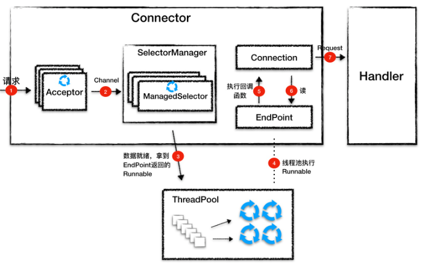

总的流程：

1、Acceptor 监听连接请求，当有连接请求到达时就接受连接，一个连接对应一个 Channel，Acceptor 将 Channel 交给 ManagedSelector 来处理。

2、ManagedSelector 把 Channel 注册到 Selector 上，并创建一个 EndPoint 和 Connection 跟这个 Channel 绑定，接着就不断地检测 I/O 事件。

3、I/O 事件到了就调用 EndPoint 的方法拿到一个 Runnable，并扔给线程池执行。

4、线程池中调度某个线程执行 Runnable。

5、Runnable 执行时，调用回调函数，这个回调函数是 Connection 注册到 EndPoint 中的。

6、回调函数内部实现，其实就是调用 EndPoint 的接口方法来读数据。

7、Connection 解析读到的数据，生成请求对象并交给 Handler 组件去处理。

## 线程策略

Jetty 在 Java 原生 Selector 的基础上封装了自己的 Selector，叫作 ManagedSelector。ManagedSelector 在线程策略方面做了大胆尝试，将 I/O 事件的侦测和处理放到同一个线程来处理，充分利用了 CPU 缓存并减少了线程上下文切换的开销

常规的 NIO 编程思路是，将 I/O 事件的侦测和请求的处理分别用不同的线程处理，优点是两个线程数都可以灵活调整，相互独立，但是也有缺点：

当 Selector 检测读就绪事件时，数据已经被拷贝到内核中的缓存了，同时 CPU 的缓存中也有这些数据了，如果用另一个线程去读，很有可能这个读线程使用另一个 CPU 核，而不是之前那个检测数据就绪的 CPU 核，这样 CPU 缓存中的数据就用不上了，并且线程切换也需要开销（CPU缓存速度大于内存）

基于上面的思路，因此 Jetty 的 Connector 做了一个大胆尝试，那就是用把 I/O 事件的生产和消费放到同一个线程来处理。两个任务由同一个线程来执行，如果执行过程中线程不阻塞，操作系统会用同一个 CPU 核来执行这两个任务，这样就能利用 CPU 缓存了。

ManagedSelector 的本质就是一个 Selector，负责 I/O 事件的检测和分发，Jetty 在 Java 原生的 Selector 上做了一些扩展，就变成了 ManagedSelector。

线程执行策略的关键类是 ExecutionStrategy 接口：

~~~java
public interface ExecutionStrategy
{
    // 只在 HTTP2 中用到，简单起见，我们先忽略这个方法。
    public void dispatch();
 
    // 实现具体执行策略，任务生产出来后可能由当前线程执行，也可能由新线程来执行
    public void produce();
    
    // 任务的生产委托给 Producer 内部接口，
    public interface Producer
    {
        // 生产一个 Runnable(任务)
        Runnable produce();
    }
}
~~~

我们看到 ExecutionStrategy 接口比较简单，它将具体任务的生产委托内部接口 Producer，而在自己的 produce 方法里来实现具体执行逻辑，也就是生产出来的任务要么由当前线程执行，要么放到新线程中执行

Jetty 提供了一些具体策略实现类：ProduceConsume、ProduceExecuteConsume、ExecuteProduceConsume 和 EatWhatYouKill。它们的区别是：

* ProduceConsume：任务生产者自己依次生产和执行任务，对应到 NIO 通信模型就是用一个线程来侦测和处理一个 ManagedSelector 上所有的 I/O 事件，后面的 I/O 事件要等待前面的 I/O 事件处理完，效率明显不高。

  通过图来理解，图中绿色表示检测生产一个任务，蓝色表示执行这个任务：

  

* ProduceExecuteConsume：任务生产者开启新线程来运行任务，这是典型的 I/O 事件侦测和处理用不同的线程来处理，缺点是不能利用 CPU 缓存，并且线程切换成本高。同样我们通过一张图来理解，图中的棕色表示线程切换。

  

* ExecuteProduceConsume：任务生产者自己运行任务，但是该策略可能会新建一个新线程以继续生产和执行任务。这种策略也被称为“吃掉你杀的猎物”，它来自狩猎伦理，认为一个人不应该杀死他不吃掉的东西，对应线程来说，不应该生成自己不打算运行的任务。它的优点是能利用 CPU 缓存，但是潜在的问题是如果处理 I/O 事件的业务代码执行时间过长，会导致线程大量阻塞和线程饥饿：

  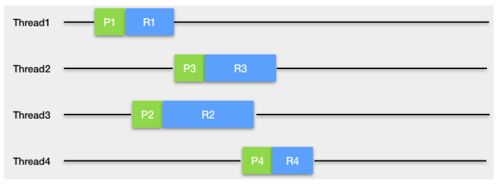

* EatWhatYouKill：这是 Jetty 对 ExecuteProduceConsume 策略的改良，在线程池线程充足的情况下等同于 ExecuteProduceConsume；当系统比较忙线程不够时，切换成 ProduceExecuteConsume 策略

  使用ExecuteProduceConsume策略时，这些线程有可能被业务代码阻塞，如果阻塞得多了，全局线程池中的线程自然就不够用了，最坏的情况是连 I/O 事件的侦测都没有线程可用了，会导致 Connector 拒绝浏览器请求。为了优化这种情况，Jetty 在很多线程的情况下，就执行 ProduceExecuteConsume 策略，I/O 侦测用专门的线程处理，I/O 事件的处理扔给线程池处理


## Handler

Connector 会将 Servlet 请求交给 Handler 去处理，Handler就是一个接口，它有一堆实现类：

~~~java
public interface Handler extends LifeCycle, Destroyable
{
    // 处理请求的方法
    public void handle(String target, Request baseRequest, HttpServletRequest request, HttpServletResponse response)
        throws IOException, ServletException;
    
    // 每个 Handler 都关联一个 Server 组件，被 Server 管理
    public void setServer(Server server);
    public Server getServer();
 
    // 销毁方法相关的资源
    public void destroy();
}
~~~

Handler 接口的定义非常简洁，主要就是用 handle 方法用来处理请求，跟 Tomcat 容器组件的 service 方法一样，它有 ServletRequest 和 ServeletResponse 两个参数。除此之外，这个接口中还有 setServer 和 getServer 方法，因为任何一个 Handler 都需要关联一个 Server 组件，也就是说 Handler 需要被 Server 组件来管理。一般来说 Handler 会加载一些资源到内存，因此通过设置 destroy 方法来销毁

Handler和它的子类们：

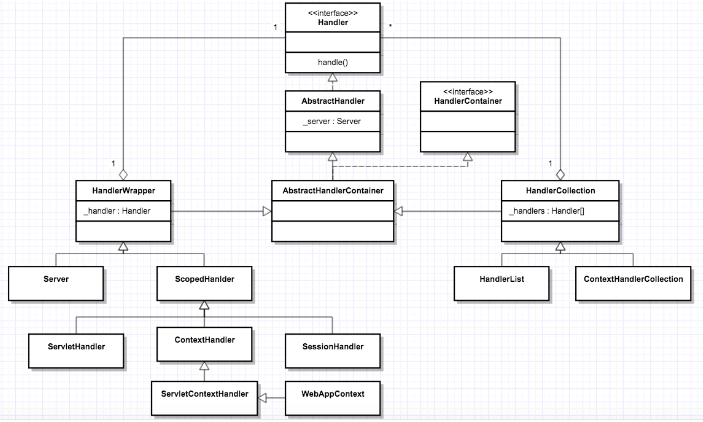

AbstractHandler：抽象实现类

AbstractHandlerContainer：名字里带Container的意思是这样的 Handler 里包含了其他 Handler 的引用，这样的引用是为了实现链式调用而存在的

AbstractHandlerContainer的两个子类：HandlerWrapper 和 HandlerCollection，这两个的区别是，HandlerWrapper 只包含一个其他 Handler 的引用，而 HandlerCollection 中有一个 Handler 数组的引用

HandlerWrapper的两个子类：Server 和 ScopedHandler，Server是Handler 模块的入口，需要将请求传递给其他 Handler 来处理；ScopedHandler实现了具有上下文信息”的责任链调用，Servlet 规范规定 Servlet 在执行过程中是有上下文的，这个机制就是通过ScopedHandler实现的

ScopedHandler 有一堆的子类，这些子类就是用来实现 Servlet 规范的，比如 ServletHandler、ContextHandler、SessionHandler、ServletContextHandler 和 WebAppContext

HandlerCollection：内部维护了多个Handler 的引用，这是因为Jetty 可能需要同时支持多个 Web 应用，比如 Server 中就有一个 HandlerCollection，Server 会根据用户请求的 URL 从数组中选取相应的 Handler 来处理，就是选择特定的 Web 应用来处理请求

Handler 有很多，但是本质上这些 Handler 分成三种类型：

* 第一种是协调 Handler，这种 Handler 负责将请求路由到一组 Handler 中去，比如上图中的 HandlerCollection，它内部持有一个 Handler 数组，当请求到来时，它负责将请求转发到数组中的某一个 Handler。
* 第二种是过滤器 Handler，这种 Handler 自己会处理请求，处理完了后再把请求转发到下一个 Handler，比如图上的 HandlerWrapper，它内部持有下一个 Handler 的引用。需要注意的是，所有继承了 HandlerWrapper 的 Handler 都具有了过滤器 Handler 的特征，比如 ContextHandler、SessionHandler 和 WebAppContext 等。
* 第三种是内容 Handler，说白了就是这些 Handler 会真正调用 Servlet 来处理请求，生成响应的内容，比如 ServletHandler。如果浏览器请求的是一个静态资源，也有相应的 ResourceHandler 来处理这个请求，返回静态页面

用 Jetty 来启动一个 Web 应用的过程：

```java
// 新建一个 WebAppContext，WebAppContext 是一个 Handler
WebAppContext webapp = new WebAppContext();
webapp.setContextPath("/mywebapp");
webapp.setWar("mywebapp.war");
 
// 将 Handler 添加到 Server 中去
server.setHandler(webapp);
 
// 启动 Server
server.start();
server.join();
```

一个WebAppContext 对应一个 Web 应用，Servlet 规范中有 Context、Servlet、Filter、Listener 和 Session 等，Jetty 要支持 Servlet 规范，就需要有相应的 Handler 来分别实现这些功能。因此，Jetty 设计了 3 个组件：ContextHandler、ServletHandler 和 SessionHandler 来实现 Servle 规范中规定的功能，而WebAppContext 本身就是一个 ContextHandler，另外它还负责管理 ServletHandler 和 SessionHandler

实现Servlet规范的几个重要的Handler：

* ContextHandler：会创建并初始化 Servlet 规范里的 ServletContext 对象，同时 ContextHandler 还包含了一组能够让你的 Web 应用运行起来的 Handler，比如ContextHandler 包含了一个或者多个 ServletHandler
* ServletHandler：它实现了 Servlet 规范中的 Servlet、Filter 和 Listener 的功能
* SessionHandler：用来管理 Session
* SecurityHandler 和 GzipHandler：这些 Handler 的功能分别是安全控制和压缩 / 解压缩

WebAppContext 会将这些 Handler 构建成一个执行链，通过这个链会最终调用到我们的业务 Servlet：

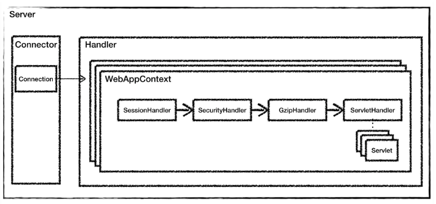

对比Tomcat，Jetty 的 Handler 组件和 Tomcat 中的容器组件是大致是对等的概念，Jetty 中的 WebAppContext 相当于 Tomcat 的 Context 组件，都是对应一个 Web 应用；而 Jetty 中的 ServletHandler 对应 Tomcat 中的 Wrapper 组件，它负责初始化和调用 Servlet，并实现了 Filter 的功能

通过自定义一些Handler添加到Jetty中，可以实现高度可定制化

## 链式调用

Tomcat 和 Jetty 的核心功能是处理请求，并且请求的处理者不止一个，因此 Tomcat 和 Jetty 都实现了责任链模式，其中 Tomcat 是通过 Pipeline-Valve 来实现的，而 Jetty 是通过 HandlerWrapper 来实现的。HandlerWrapper 中保存了下一个 Handler 的引用，将各 Handler 组成一个链表，像下面这样：

WebAppContext -> SessionHandler -> SecurityHandler -> ServletHandler

这样链中的 Handler 从头到尾能被依次调用，除此之外，Jetty 还实现了“回溯”的链式调用，那就是从头到尾依次链式调用 Handler 的方法 A，完成后再回到头节点，再进行一次链式调用，只不过这一次调用另一个方法 B。

方法A和方法B是由先后处理关系的，一次请求到达时，Jetty 需要先调用各 Handler 的初始化方法，之后再调用各 Handler 的请求处理方法，并且初始化必须在请求处理之前完成

略 -》29

## Jetty调优

Jetty 本身的调优，主要是设置不同类型的线程的数量，包括 Acceptor 和 Thread Pool

Acceptor 的个数 accepts 应该设置为大于等于 1，并且小于等于 CPU 核数。

Jetty 的任务队列非常重要，默认情况下，队列是无限的。因此，如果在高负载下超过 Web 应用的处理能力，Jetty 将在队列上积压大量待处理的请求。并且即使负载高峰过去了，Jetty 也不能正常响应新的请求，这是因为仍然有很多请求在队列等着被处理

对于一个高可靠性的系统，我们应该通过使用有界队列立即拒绝过多的请求（也叫快速失败）。队列的长度设置应该根据 Web 应用的处理速度而定，比如，如果 Web 应用每秒可以处理 100 个请求，当负载高峰到来，我们允许一个请求可以在队列积压 60 秒，那么我们就可以把队列长度设置为 60 × 100 = 6000，下面是配置示例：

~~~xml
<Configure id="Server" class="org.eclipse.jetty.server.Server">
    <Set name="ThreadPool">
      <New class="org.eclipse.jetty.util.thread.QueuedThreadPool">
        <!-- specify a bounded queue -->
        <Arg>
           <New class="java.util.concurrent.ArrayBlockingQueue">
              <Arg type="int">6000</Arg>
           </New>
      </Arg>
        <Set name="minThreads">10</Set>
        <Set name="maxThreads">200</Set>
        <Set name="detailedDump">false</Set>
      </New>
    </Set>
</Configure>
~~~

Jetty 的线程池中的线程数设置，跟 Tomcat 一样，可以根据实际压测来考虑，如果 I/O 越密集，线程阻塞越严重，那么线程数就可以配置多一些。通常情况，增加线程数需要更多的内存，因此内存的最大值也要跟着调整，所以一般来说，Jetty 的最大线程数应该在 50 到 500 之间。


# 优化

## 启动速度优化

1、清理不必要的Web应用

删除掉 webapps 文件夹下不需要的工程，一般是 host-manager、example、doc 等这些默认的工程

2、清理XML配置文件

Tomcat 在启动的时候会解析所有的 XML 配置文件，要尽量保持配置文件的简洁，需要解析的东西越少，速度自然就会越快

3、清理JAR

删除所有不需要的 JAR 文件，JVM 的类加载器在加载类时，需要查找每一个 JAR 文件，去找到所需要的类，如果删除了不需要的 JAR 文件，查找的速度就会快一些。Web 应用中的 lib 目录下不应该出现 Servlet API 或者 Tomcat 自身的 JAR，这些 JAR 由 Tomcat 负责提供。工程对 Servlet API 的依赖范围应该是provided

4、清理其他文件，如日志

5、禁用一些没有必要的功能：

* 禁止Tomcat TLD扫描，Tomcat 为了支持 JSP，在应用启动的时候会扫描 JAR 包里面的 TLD 文件，加载里面定义的标签库
* 关闭WebSocket支持
* 关闭JSP支持
* 禁止Servlet注解扫描

6、配置 Web-Fragment 扫描：Servlet 3.0 还引入了“Web 模块部署描述符片段”的web-fragment.xml，这是一个部署描述文件，可以完成web.xml的配置功能，可以通过该配置决定了哪些包应该扫描，哪些不需要扫描

6、并行启动多个Web应用：Tomcat 启动的时候，默认情况下 Web 应用都是一个一个启动的，等所有 Web 应用全部启动完成，Tomcat 才算启动完毕，但可以开启并行启动以优化速度

## JVM GC调优

对于 JVM GC 来说，如果你观察到 Tomcat 进程的 CPU 使用率比较高，并且在 GC 日志中发现 GC 次数比较频繁、GC 停顿时间长，这表明你需要对 GC 进行优化了。

CMS 和 G1 是时下使用率比较高的两款垃圾收集器，从 Java 9 开始，采用 G1 作为默认垃圾收集器，而 G1 的目标也是逐步取代 CMS

CMS 收集器将 Java 堆分为年轻代（Young）或年老代（Old）。这主要是因为有研究表明，超过 90％的对象在第一次 GC 时就被回收掉，但是少数对象往往会存活较长的时间。

CMS 还将年轻代内存空间分为幸存者空间（Survivor）和伊甸园空间（Eden）。新的对象始终在 Eden 空间上创建。一旦一个对象在一次垃圾收集后还幸存，就会被移动到幸存者空间。当一个对象在多次垃圾收集之后还存活时，它会移动到年老代。这样做的目的是在年轻代和年老代采用不同的收集算法，以达到较高的收集效率，比如在年轻代采用复制 - 整理算法（将存活的对象从一个区转移到另一个区域），在年老代采用标记 - 清理算法（让所有存活的对象向一端移动）。因此 CMS 将 Java 堆分成如下区域：


与 CMS 相比，G1 收集器有两大特点：

G1 可以并发完成大部分 GC 的工作，这期间不会“Stop-The-World”。
G1 使用非连续空间，这使 G1 能够有效地处理非常大的堆。此外，G1 可以同时收集年轻代和年老代。G1 并没有将 Java 堆分成三个空间（Eden、Survivor 和 Old），而是将堆分成许多（通常是几百个）非常小的区域。这些区域是固定大小的（默认情况下大约为 2MB）。每个区域都分配给一个空间。 G1 收集器的 Java 堆如下图所示：


图上的 U 表示“未分配”区域。G1 将堆拆分成小的区域，一个最大的好处是可以做局部区域的垃圾回收，而不需要每次都回收整个区域比如年轻代和年老代，这样回收的停顿时间会比较短。具体的收集过程是：

* 将所有存活的对象将从收集的区域复制到未分配的区域，比如收集的区域是 Eden 空间，把 Eden 中的存活对象复制到未分配区域，这个未分配区域就成了 Survivor 空间。理想情况下，如果一个区域全是垃圾（意味着一个存活的对象都没有），则可以直接将该区域声明为“未分配”。
* 为了优化收集时间，G1 总是优先选择垃圾最多的区域，从而最大限度地减少后续分配和释放堆空间所需的工作量。这也是 G1 收集器名字的由来——Garbage-First。

GC调优原则：每一次GC都回收尽可能多的对象

* 针对CMS收集器来说，最重要的是合理地设置年轻代和年老代的大小。年轻代太小的话，会导致频繁的 Minor GC，并且很有可能存活期短的对象也不能被回收，GC 的效率就不高。而年老代太小的话，容纳不下从年轻代过来的新对象，会频繁触发单线程 Full GC，导致较长时间的 GC 暂停，影响 Web 应用的响应时间

* 对于 G1 收集器来说，我不推荐直接设置年轻代的大小，这一点跟 CMS 收集器不一样，这是因为 G1 收集器会根据算法动态决定年轻代和年老代的大小。因此对于 G1 收集器，我们需要关心的是 Java 堆的总大小（-Xmx）

  此外 G1 还有一个较关键的参数是-XX:MaxGCPauseMillis = n，这个参数是用来限制最大的 GC 暂停时间，目的是尽量不影响请求处理的响应时间。G1 将根据先前收集的信息以及检测到的垃圾量，估计它可以立即收集的最大区域数量，从而尽量保证 GC 时间不会超出这个限制

实际场景中，应该用GCViewer工具打开GC日志，如果发现内存上下震荡频繁说明GC频繁，应该增大该区域或者堆的内存；如果发现内存缓慢增长，说明存在内存泄漏

## 监控性能

Tomcat 可以通过 JMX 将上述指标暴露出来的。JMX（Java Management Extensions，即 Java 管理扩展）是一个为应用程序、设备、系统等植入监控管理功能的框架，Tomcat 定义了一系列 MBean 来对外暴露系统状态，开启JMX的远程监听端口后，就可以用JConsole来连接这个端口了。

略 -> 35

还可以通过命令行来查看Tomcat的指标：

1、首先我们通过 ps 命令找到 Tomcat 进程，拿到进程 ID：

~~~shell
ps -ef | grep tomcat
~~~

2、查看进行状态的大致信息：

~~~bash
cat /proc/<pid>/status
~~~

3、监控进程CPU：

~~~bash
top -p <pid>
~~~

4、查看Tomcat的网络连接，比如 Tomcat 在 8080 端口上监听连接请求：

~~~bash
netstat -na | grep 8080
~~~

还可以分别统计处在“已连接”状态和“TIME_WAIT”状态的连接数：

~~~
netstat -na | grep ESTAB | grep 8080 | wc -l
netstat -na | grep TIME_WAIT | grep 8080 | wc -l
~~~

5、通过ifstat来查看网络流量，大致可以看出 Tomcat 当前的请求数和负载状况

~~~java
ifstat
~~~

## I/O 模型和线程池调优

### I/O模型的选择

I/O 调优实际上是连接器类型的选择，一般情况下默认都是 NIO，在绝大多数情况下都是够用的，除非你的 Web 应用用到了 TLS 加密传输，而且对性能要求极高，这个时候可以考虑 APR，因为 APR 通过 OpenSSL 来处理 TLS 握手和加 / 解密。OpenSSL 本身用 C 语言实现，它还对 TLS 通信做了优化，所以性能比 Java 要高

考虑选择NIO.2的场景：Tomcat 跑在 Windows 平台上，并且 HTTP 请求的数据量比较大，可以考虑 NIO.2。这是因为 Windows 从操作系统层面实现了真正意义上的异步 I/O，如果传输的数据量比较大，异步 I/O 的效果就能显现出来。而Linux 内核没有很完善地支持异步 I/O 模型，因此 JVM 并没有采用原生的 Linux 异步 I/O，而是在应用层面通过 epoll 模拟了异步 I/O 模型，可以这样理解，在 Linux 平台上，Java NIO 和 Java NIO.2 底层都是通过 epoll 来实现的，但是 Java NIO 更加简单高效

### 线程池调优

Tomcat 线程池中的关键参数：

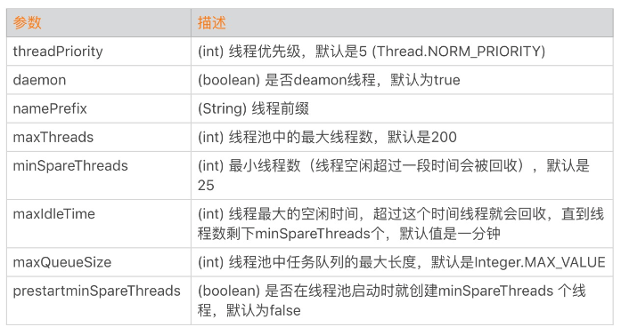

这里面最核心的就是如何确定 maxThreads 的值，如果这个参数设置小了，Tomcat 会发生线程饥饿，并且请求的处理会在队列中排队等待，导致响应时间变长；如果 maxThreads 参数值过大，同样也会有问题，因为服务器的 CPU 的核数有限，线程数太多会导致线程在 CPU 上来回切换，耗费大量的切换开销。

为了合理的设置最大线程数，应该采用利特尔法则（Little’s Law）进行分析。

利特尔法则：系统中的请求数 = 请求的到达速率 × 每个请求处理时间

假设一个单核服务器在接收请求：

- 如果每秒 10 个请求到达，平均处理一个请求需要 1 秒，那么服务器任何时候都有 10 个请求在处理，即需要 10 个线程。
- 如果每秒 10 个请求到达，平均处理一个请求需要 2 秒，那么服务器在每个时刻都有 20 个请求在处理，因此需要 20 个线程。
- 如果每秒 10000 个请求到达，平均处理一个请求需要 1 秒，那么服务器在每个时刻都有 10000 个请求在处理，因此需要 10000 个线程。

因此可以总结出一个公式：线程池大小 = 每秒请求数 × 平均请求处理时间。这是理想的情况，也就是说线程一直在忙着干活，没有被阻塞在 I/O 等待上，计入I/O等待的时间后，线程池大小的公式就应该是：

线程池大小 = （线程 I/O 阻塞时间 + 线程 CPU 时间 ）/ 线程 CPU 时间   （单核）

其中：线程 I/O 阻塞时间 + 线程 CPU 时间 = 平均请求处理时间

综上，几个影响线程数的因素：

* 请求处理时间越长，需要的线程数越多，但要在CPU核数承受范围内，如果线程太多了就会造成大量线程上下文切换
* 请求处理过程中，I/O 等待时间越长，需要的线程数越多
* 请求进来的速率越快，需要的线程数越多

实际情况下，需要先根据公式算出大概值，然后反复压测，直到增加线程数也不会提升性能为之，甚至 TPS 反而下降，那这个值可以认为是最佳线程数。

## 内存溢出分析

### 内存溢出场景

1、java.lang.OutOfMemoryError: Java heap space

JVM 无法在堆中分配对象时，会抛出这个异常，导致这个异常的原因可能有三种：内存泄漏、配置问题（堆太小）、finalize 方法的过度使用

finalize 方法的过度使用：如果我们想在 Java 类实例被 GC 之前执行一些逻辑，比如清理对象持有的资源，可以在 Java 类中定义 finalize 方法，这样 JVM GC 不会立即回收这些对象实例，而是将对象实例添加到一个叫“java.lang.ref.Finalizer.ReferenceQueue”的队列中，执行对象的 finalize 方法，之后才会回收这些对象。Finalizer 线程会和主线程竞争 CPU 资源，但由于优先级低，所以处理速度跟不上主线程创建对象的速度，因此 ReferenceQueue 队列中的对象就越来越多，最终会抛出 OutOfMemoryError。解决办法是尽量不要给 Java 类定义 finalize 方法。

2、java.lang.OutOfMemoryError: GC overhead limit exceeded

出现这种 OutOfMemoryError 的原因是，垃圾收集器一直在运行，但是 GC 效率很低，比如 Java 进程花费超过 98％的 CPU 时间来进行一次 GC，但是回收的内存少于 2％的 JVM 堆，并且连续 5 次 GC 都是这种情况，就会抛出 OutOfMemoryError

一般原因是内存泄漏或堆太小，还可以通过参数配置来告诉 JVM 无论如何也不要抛出这个异常，方法是配置-XX:-UseGCOverheadLimit，但是并不推荐这么做，因为这只是延迟了 OutOfMemoryError 的出现

3、java.lang.OutOfMemoryError: Requested array size exceeds VM limit

请求的数组大小超过 JVM 限制

4、java.lang.OutOfMemoryError: MetaSpace

JVM 元空间耗尽，解决办法是加大 MaxMetaSpaceSize 参数的值

5、java.lang.OutOfMemoryError: Request size bytes for reason. Out of swap space

当本地堆内存分配失败或者本地内存快要耗尽时，Java HotSpot VM 代码会抛出这个异常，VM 会触发“致命错误处理机制”，它会生成“致命错误”日志文件，其中包含崩溃时线程、进程和操作系统的有用信息。如果碰到此类型的 OutOfMemoryError，你需要根据 JVM 抛出的错误信息来进行诊断；或者使用操作系统提供的 DTrace 工具来跟踪系统调用，看看是什么样的程序代码在不断地分配本地内存。

6、java.lang.OutOfMemoryError: Unable to create native threads

尝试创建一个新的 Native Thread，需要同时分配一些内存给该线程，每一个 Native Thread 都有一个线程栈，线程栈的大小由 JVM 参数-Xss决定，线程创建失败就会抛出这个错误。

线程创建失败的原因：

* 内存大小限制，前面提到，Java 创建一个线程需要消耗一定的栈空间，并通过-Xss参数指定，这个值太小会导致栈空间过小，可能会导致 StackOverflowError，尤其是在递归调用的情况下；栈空间过大会占用过多内存，对于一个 32 位 Java 应用来说，用户进程空间是 4GB，内核占用 1GB，那么用户空间就剩下 3GB，因此它能创建的线程数大致可以通过这个公式算出来：

  ~~~
  Max memory（3GB） = [-Xmx] + [-XX:MaxMetaSpaceSize] + number_of_threads * [-Xss]
  ~~~

  不过对于 64 位的应用，由于虚拟进程空间近乎无限大，因此不会因为线程栈过大而耗尽虚拟地址空间，但仍受实际物理内存大小的限制

* ulimit限制，在 Linux 下执行ulimit -a，你会看到 ulimit 对各种资源的限制，其中一个max user processes就是一个进程能创建的最大线程数，可以修改这个参数：

  ~~~
  #ulimit -u 65535
  ~~~

* 参数sys.kernel.threads-max限制。这个参数限制操作系统全局的线程数，通过下面的命令可以查看它的值：

  ~~~
  cat /proc/sys/kernel/threads-max
  ~~~

  可以调整这个参数，方法是在/etc/sysctl.conf配置文件中，加入sys.kernel.threads-max = 999999

* 参数sys.kernel.pid_max限制，这个参数表示系统全局的 PID 号数值的限制，每一个线程都有 ID，ID 的值超过这个数，线程就会创建失败。跟sys.kernel.threads-max参数一样，我们也可以将sys.kernel.pid_max调大，方法是在/etc/sysctl.conf配置文件中，加入sys.kernel.pid_max = 999999。

### 问题定位

运行程序并打开 verbosegc，将 GC 的日志输出到 gc.log 文件中：

~~~bash
java -verbose:gc -Xloggc:gc.log -XX:+PrintGCDetails -jar mem-0.0.1-SNAPSHOT.jar
~~~

可以用jstat命令观察GC的过程：

~~~bash
jstat -gc 94223 2000 1000
~~~

94223 是程序的进程 ID，2000 表示每隔 2 秒执行一次，1000 表示持续执行 1000 次。下面是命令的输出：


其中每一列的含义是：

* S0C：第一个 Survivor 区总的大小；
* S1C：第二个 Survivor 区总的大小；
* S0U：第一个 Survivor 区已使用内存的大小；
* S1U：第二个 Survivor 区已使用内存的大小。
* 其中 E 代表 Eden，O 代表 Old，M 代表 Metadata；YGC 表示 Minor GC 的总时间，YGCT 表示 Minor GC 的次数；FGC 表示 Full GC。

可以用GCViewer 工具查看 GC 日志。

为了找到内存泄漏点，我们通过 jmap 工具生成 Heap Dump：

~~~bash
jmap -dump:live,format=b,file=94223.bin 94223
~~~

用 Eclipse Memory Analyzer 打开 Dump 文件，通过内存泄漏分析，得到分析报告，就能方便的定位到内存泄漏的点

## 拒绝连接问题

### 常见网络异常

1、java.net.SocketTimeoutException

指超时错误。超时分为连接超时和读取超时，连接超时是指在调用 Socket.connect 方法的时候超时，而读取超时是调用 Socket.read 方法时超时。请你注意的是，连接超时往往是由于网络不稳定造成的，但是读取超时不一定是网络延迟造成的，很有可能是下游服务的响应时间过长。

2、java.net.BindException: Address already in use: JVM_Bind

指端口被占用。当服务器端调用 new ServerSocket(port) 或者 Socket.bind 函数时，如果端口已经被占用，就会抛出这个异常。我们可以用netstat –an命令来查看端口被谁占用了，换一个没有被占用的端口就能解决。

3、java.net.ConnectException: Connection refused: connect

指连接被拒绝。当客户端调用 new Socket(ip, port) 或者 Socket.connect 函数时，可能会抛出这个异常。原因是指定 IP 地址的机器没有找到；或者是机器存在，但这个机器上没有开启指定的监听端口。

解决办法是从客户端机器 ping 一下服务端 IP，假如 ping 不通，可以看看 IP 是不是写错了；假如能 ping 通，需要确认服务端的服务是不是崩溃了。

4、java.net.SocketException: Socket is closed

指连接已关闭。出现这个异常的原因是通信的一方主动关闭了 Socket 连接（调用了 Socket 的 close 方法），接着又对 Socket 连接进行了读写操作，这时操作系统会报“Socket 连接已关闭”的错误。

5、java.net.SocketException: Connection reset/Connect reset by peer: Socket write error

指连接被重置。这里有两种情况，分别对应两种错误：第一种情况是通信的一方已经将 Socket 关闭，可能是主动关闭或者是因为异常退出，这时如果通信的另一方还在写数据，就会触发这个异常（Connect reset by peer）；如果对方还在尝试从 TCP 连接中读数据，则会抛出 Connection reset 异常。

为了避免这些异常发生，在编写网络通信程序时要确保：

- 程序退出前要主动关闭所有的网络连接。
- 检测通信的另一方的关闭连接操作，当发现另一方关闭连接后自己也要关闭该连接。

6、java.net.SocketException: Broken pipe

指通信管道已坏。发生这个异常的场景是，通信的一方在收到“Connect reset by peer: Socket write error”后，如果再继续写数据则会抛出 Broken pipe 异常，解决方法同上。

7、java.net.SocketException: Too many open files

指进程打开文件句柄数超过限制。当并发用户数比较大时，服务器可能会报这个异常。这是因为每创建一个 Socket 连接就需要一个文件句柄，此外服务端程序在处理请求时可能也需要打开一些文件。

你可以通过lsof -p pid命令查看进程打开了哪些文件，是不是有资源泄露，也就是说进程打开的这些文件本应该被关闭，但由于程序的 Bug 而没有被关闭。

如果没有资源泄露，可以通过设置增加最大文件句柄数。具体方法是通过ulimit -a来查看系统目前资源限制，通过ulimit -n 10240修改最大文件数。

### 网络参数调整

Tomcat 两个比较关键的参数：maxConnections 和 acceptCount

TCP 连接的建立过程：客户端向服务端发送 SYN 包，服务端回复 SYN＋ACK，同时将这个处于 SYN_RECV 状态的连接保存到半连接队列。客户端返回 ACK 包完成三次握手，服务端将 ESTABLISHED 状态的连接移入accept 队列，等待应用程序（Tomcat）调用 accept 方法将连接取走。这里涉及两个队列：

* 半连接队列：保存 SYN_RECV 状态的连接。队列长度由net.ipv4.tcp_max_syn_backlog设置。

* accept 队列：保存 ESTABLISHED 状态的连接。队列长度为min(net.core.somaxconn，backlog)。其中 backlog 是我们创建 ServerSocket 时指定的参数，最终会传递给 listen 方法：

  ~~~c
  int listen(int sockfd, int backlog);
  ~~~

其中这个backlog参数就是Tomcat中的acceptCount参数，默认值是100；而net.core.somaxconn默认值是128.

高并发情况下当 Tomcat 来不及处理新的连接时，这些连接都被堆积在 accept 队列中，而acceptCount参数可以控制 accept 队列的长度，超过这个长度时，内核会向客户端发送 RST，这样客户端会触发上文提到的“Connection reset”异常

net.core.somaxconn参数是操作系统参数，也是可以修改的，在/etc/sysctl.conf中增加一行net.core.somaxconn=2048，然后执行命令sysctl -p

Tomcat 中的maxConnections是指 Tomcat 在任意时刻接收和处理的最大连接数。当 Tomcat 接收的连接数达到 maxConnections 时，Acceptor 线程不会再从 accept 队列中取走连接，这时 accept 队列中的连接会越积越多。maxConnections 的默认值与连接器类型有关：NIO 的默认值是 10000，APR 默认是 8192

综上，Tomcat 的最大并发连接数等于maxConnections + acceptCount。如果 acceptCount 设置得过大，请求等待时间会比较长；如果 acceptCount 设置过小，高并发情况下，客户端会立即触发 Connection reset 异常

## 占用CPU过高问题

CPU 资源经常会成为系统性能的一个瓶颈，这其中的原因是多方面的，可能是内存泄露导致频繁 GC，进而引起 CPU 使用率过高；又可能是代码中的 Bug 创建了大量的线程，导致 CPU 上下文切换开销

定位占用CPU过高的问题的步骤：

1、确定占用CPU过高的进程：主要是使用top命令

2、查看占用CPU过高的线程：

~~~
#top -H -p 4361
~~~


可以确定占用CPU很高的线程名

3、查看对应线程在做什么

~~~bash
jstack 4361 > 4361.log
~~~

搜索线程名，找到当时线程的栈迹

当CPU 的上下文切换开销开销过大时，也会增加CPU占用，可以从vmstat 命令来查看一下操作系统层面的线程上下文切换活动：

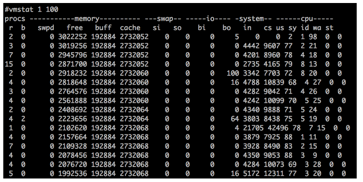

cs 那一栏表示线程上下文切换次数，in 表示 CPU 中断次数，这两个数字非常高就意味着线程上下文切切换消耗了大量 CPU

## 操作系统级调优

对于 Linux 操作系统调优来说，我们需要加大一些默认的限制值，这些参数主要可以在/etc/security/limits.conf中或通过sysctl命令进行配置

1、TCP缓冲区大小

TCP 的发送和接收缓冲区最好加大到 16MB，可以通过下面的命令配置：

~~~bash
 sysctl -w net.core.rmem_max = 16777216
 sysctl -w net.core.wmem_max = 16777216
 sysctl -w net.ipv4.tcp_rmem =“4096 87380 16777216”
 sysctl -w net.ipv4.tcp_wmem =“4096 16384 16777216”
~~~

2、TCP队列的大小

net.core.somaxconn控制 TCP 连接队列的大小，默认值为 128，在高并发情况下明显不够用，会出现拒绝连接的错误。但是这个值也不能调得过高，因为过多积压的 TCP 连接会消耗服务端的资源，并且会造成请求处理的延迟，给用户带来不好的体验。因此我建议适当调大，推荐设置为 4096。

~~~bash
 sysctl -w net.core.somaxconn = 4096
~~~

net.core.netdev_max_backlog用来控制 Java 程序传入数据包队列的大小，可以适当调大。

~~~
sysctl -w net.core.netdev_max_backlog = 16384
sysctl -w net.ipv4.tcp_max_syn_backlog = 8192
sysctl -w net.ipv4.tcp_syncookies = 1
~~~

3、端口

如果 Web 应用程序作为客户端向远程服务器建立了很多 TCP 连接，可能会出现 TCP 端口不足的情况。因此最好增加使用的端口范围，并允许在 TIME_WAIT 中重用套接字：

~~~bash
sysctl -w net.ipv4.ip_local_port_range =“1024 65535”
sysctl -w net.ipv4.tcp_tw_recycle = 1
~~~

4、文件句柄数

高负载服务器的文件句柄数很容易耗尽，这是因为系统默认值通常比较低，我们可以在/etc/security/limits.conf中为特定用户增加文件句柄数：

~~~
用户名 hard nofile 40000
用户名 soft nofile 40000
~~~

5、拥塞控制

Linux 内核支持可插拔的拥塞控制算法，如果要获取内核可用的拥塞控制算法列表，可以通过下面的命令：

~~~
sysctl net.ipv4.tcp_available_congestion_control
~~~

这里推荐将拥塞控制算法设置为 cubic：

~~~
sysctl -w net.ipv4.tcp_congestion_control = cubic
~~~


