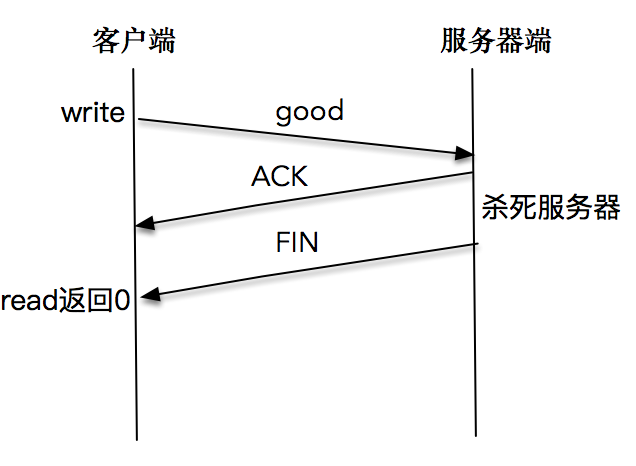
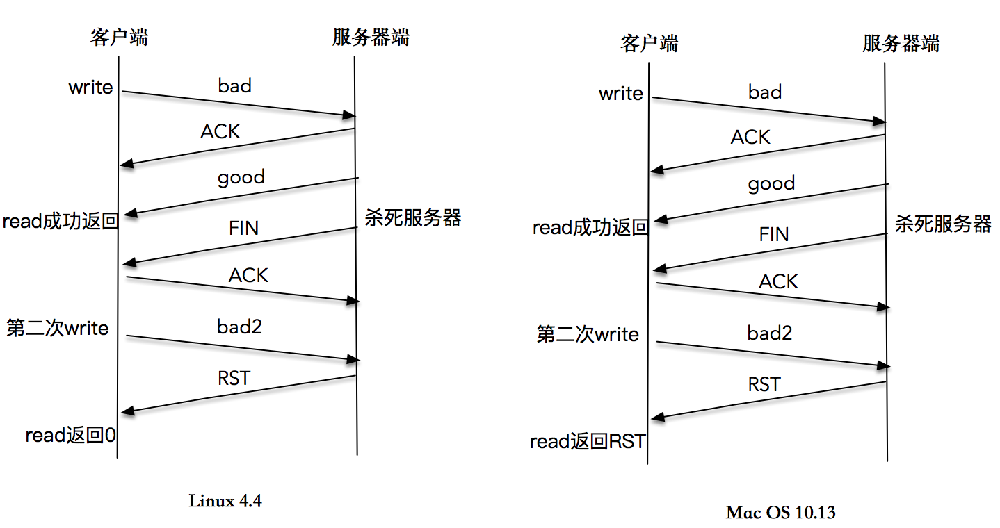
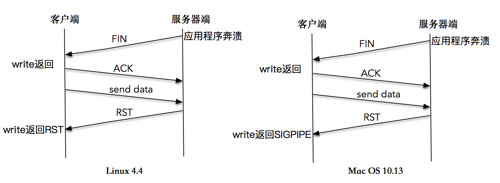
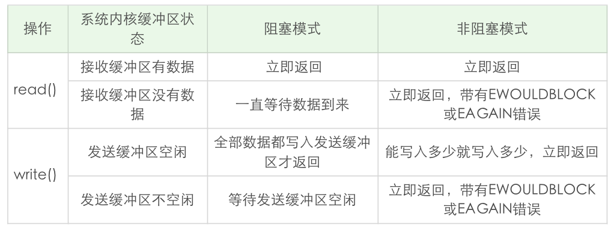
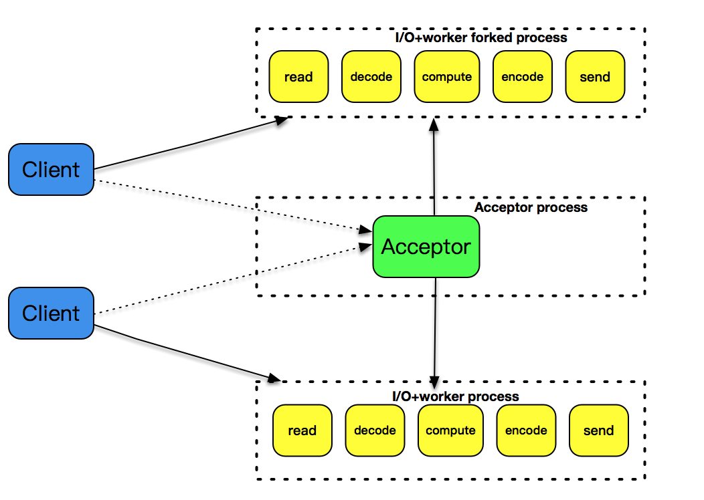
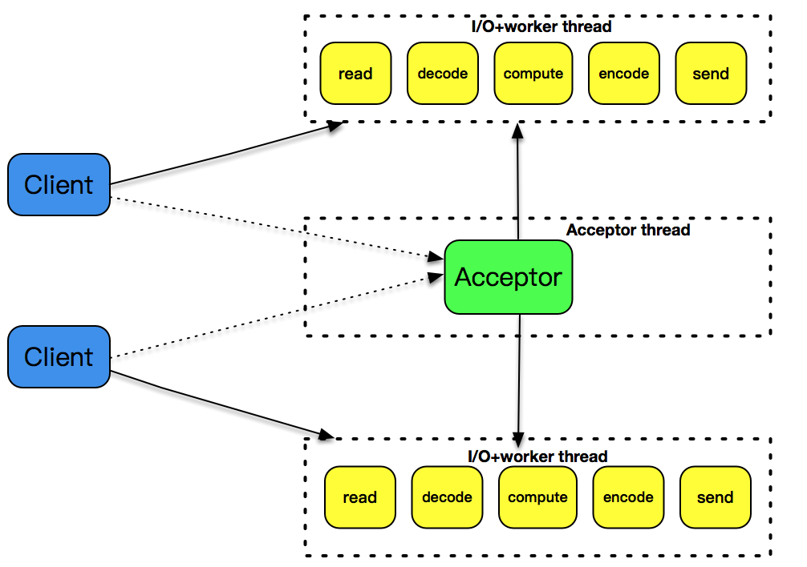
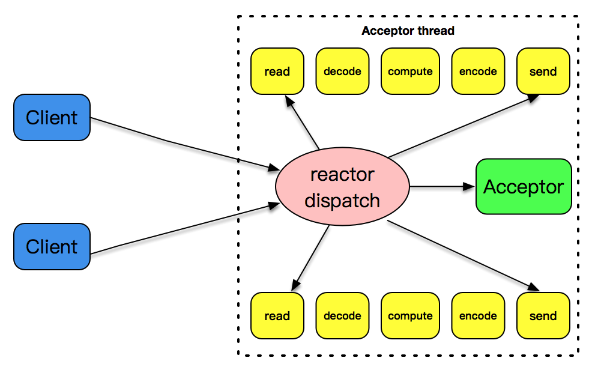
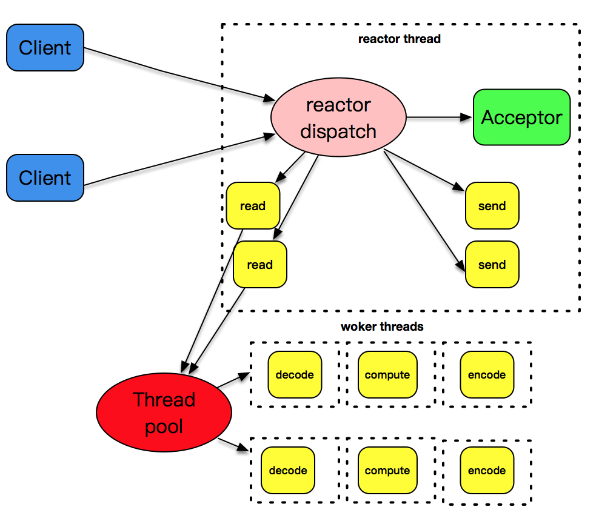
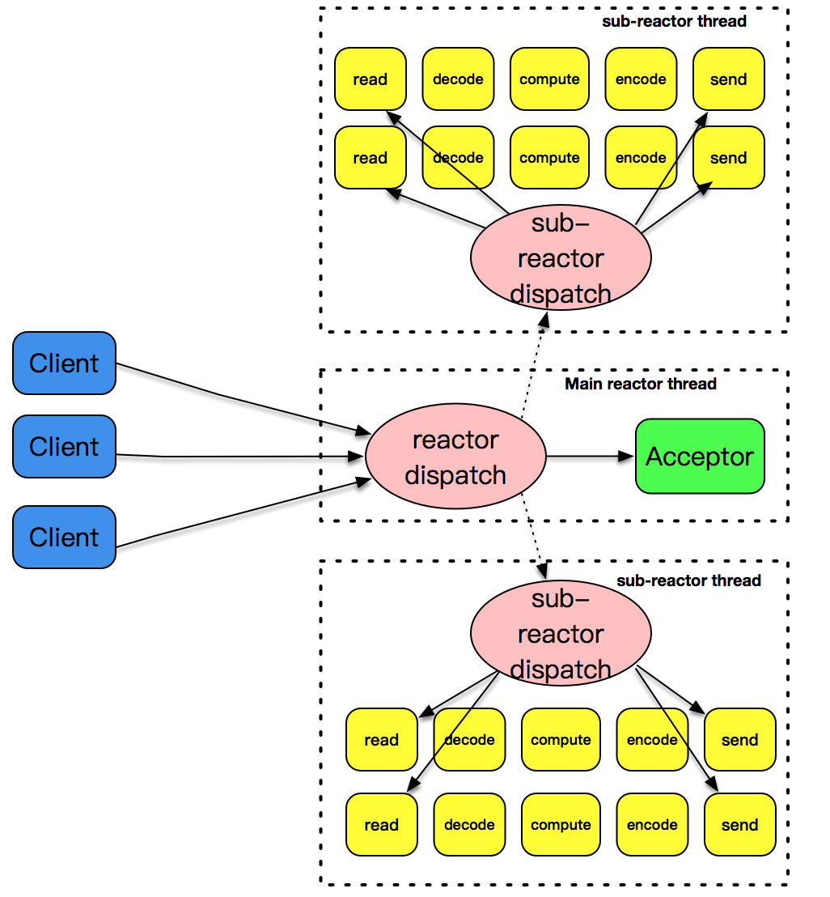
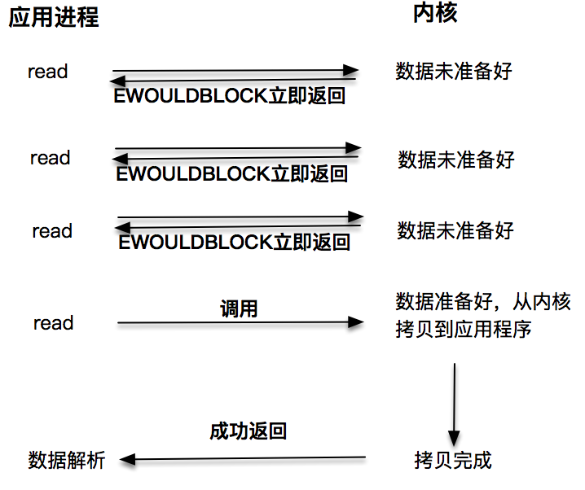

## TCP 的数据流特性

### 流式协议

在前面的案例中，那些使用单个客户端 - 服务器的例子，好像TCP 是一种应答形式的数据传输过程，比如发送端一次发送 network 和 program 这样的报文，在前面的例子中，我们看到的结果基本是这样的： 

~~~
发送端：network ----> 接收端回应：Hi, network
发送端：program -----> 接收端回应：Hi, program
~~~

这其实是一个假象，之所以会这样，是因为网络条件比较好，而且发送的数据也比较少。 

TCP数据是流式这个特性，可以从发送端和接收端来阐述：

1、发送端

在发送端，当我们调用 send 函数完成数据“发送”以后，数据并没有被真正从网络上发送出去，只是从应用程序拷贝到了操作系统内核协议栈中，至于什么时候真正被发送，取决于发送窗口、拥塞窗口以及当前发送缓冲区的大小等条件。也就是说，我们不能假设每次 send 调用发送的数据，都会作为一个整体完整地被发送出去。 

如果我们考虑实际网络传输过程中的各种影响，假设发送端陆续调用 send 函数先后发送 network 和 program 报文，那么实际的发送很有可能是这个样子的。 

第一种情况，一次性将 network 和 program 在一个 TCP 分组中发送出去，像这样： 

~~~
...xxxnetworkprogramxxx...
~~~

第二种情况，program 的部分随 network 在一个 TCP 分组中发送出去，像这样： 

TCP 分组 1： 

~~~
...xxxxxnetworkpro
~~~

TCP 分组 2： 

~~~
gramxxxxxxxxxx...
~~~

第三种情况，network 的一部分随 TCP 分组被发送出去，另一部分和 program 一起随另一个 TCP 分组发送出去，像这样：

TCP 分组 1： 

~~~
...xxxxxxxxxxxnet
~~~

TCP 分组 2： 

~~~
workprogramxxx...
~~~

实际上类似的组合可以枚举出无数种。不管是哪一种，核心的问题就是，我们不知道 network 和 program 这两个报文是如何进行 TCP 分组传输的。换言之，我们在发送数据的时候，不应该假设“数据流和 TCP 分组是一种映射关系”。 

2、接收端

接收端缓冲区保留了没有被取走的数据，随着应用程序不断从接收端缓冲区读出数据，接收端缓冲区就可以容纳更多新的数据。如果我们使用 recv 从接收端缓冲区读取数据，发送端缓冲区的数据是以字节流的方式存在的，无论发送端如何构造 TCP 分组，接收端最终收到的字节流总是像下面这样： 

~~~
xxxxxxxxxxxxxxxxxnetworkprogramxxxxxxxxxxxx
~~~

关于接收端字节流，有两点需要注意： 

* 第一，这里 netwrok 和 program 的顺序肯定是会保持的，也就是说，先调用 send 函数发送的字节，总在后调用 send 函数发送字节的前面，这个是由 TCP 严格保证的； 
* 第二，如果发送过程中有 TCP 分组丢失，但是其后续分组陆续到达，那么 TCP 协议栈会缓存后续分组，直到前面丢失的分组到达，最终，形成可以被应用程序读取的数据流。 

TCP的重传以及顺序机制保证了数据流的顺序。

### 网络字节排序

计算机最终保存和传输，用的都是 0101 这样的二进制数据，字节流在网络上的传输，也是通过二进制来完成的。 

从二进制到字节是通过编码完成的，比如著名的 ASCII 编码，通过一个字节 8 个比特对常用的西方字母进行了编码。 

这里有一个有趣的问题，如果需要传输数字，比如 0x0201，对应的二进制为 0000001000000001，那么两个字节的数据到底是先传 0x01，还是相反？ 

在计算机发展的历史上，对于如何存储这个数据没有形成标准。比如这里讲到的问题，不同的系统就会有两种存法：

* 一种是将 0x02 高字节存放在起始地址，这个叫做大端字节序（Big-Endian）。 
* 另一种相反，将 0x01 低字节存放在起始地址，这个叫做小端字节序（Little-Endian）。 

但是在网络传输中，必须保证双方都用同一种标准来表达，这就好比我们打电话时说的是同一种语言，否则双方不能顺畅地沟通。这个标准就涉及到了网络字节序的选择问题，对于网络字节序，必须二选一。我们可以看到网络协议使用的是大端字节序，我个人觉得大端字节序比较符合人类的思维习惯，你可以想象手写一个多位数字，从开始往小位写，自然会先写大位，比如写 12, 1234，这个样子。 

为了保证网络字节序一致，POSIX 标准提供了如下的转换函数： 

~~~c
uint16_t htons (uint16_t hostshort)
uint16_t ntohs (uint16_t netshort)
uint32_t htonl (uint32_t hostlong)
uint32_t ntohl (uint32_t netlong)
~~~

这里函数中的 n 代表的就是 network，h 代表的是 host，s 表示的是 short，l 表示的是 long，分别表示 16 位和 32 位的整数。 

这些函数可以帮助我们在主机（host）和网络（network）的格式间灵活转换。当使用这些函数时，我们并不需要关心主机到底是什么样的字节顺序，只要使用函数给定值进行网络字节序和主机字节序的转换就可以了。 例如如果碰巧我们的系统本身是大端字节序，和网络字节序一样，那么使用上述所有的函数进行转换的时候，结果都仅仅是一个空实现，直接返回。 

### 报文读取和解析

因为报文是以字节流的形式呈现给应用程序的，所以应用程序需要按照规则去解析。

这就要说到报文格式和解析了。报文格式实际上定义了字节的组织形式，发送端和接收端都按照统一的报文格式进行数据传输和解析，这样就可以保证彼此能够完成交流。 只有知道了报文格式，接收端才能针对性地进行报文读取和解析工作。 报文解析的工作就是要在知道报文格式的情况下，有效地对报文信息进行还原。 

报文格式最重要的是如何确定报文的边界。常见的报文格式有两种方法：

* 一种是发送端把要发送的报文长度预先通过报文告知给接收端； 
* 另一种是通过一些特殊的字符来进行边界的划分。 

这两个其实就是解决tcp的沾包分包的处理办法，粘包其实是数据报文的边界确定不清晰引起的解析错误的问题。

#### 显式编码报文长度

把要发送的报文长度预先通过报文告知接收端，报文格式是这样：

由图可以看出，这个报文的格式很简单，首先 4 个字节大小的消息长度，其目的是将真正发送的字节流的大小显式通过报文告知接收端，接下来是 4 个字节大小的消息类型，而真正需要发送的数据则紧随其后。 

发送端的程序如下：

~~~c
int main(int argc, char **argv) {
    if (argc != 2) {
        error(1, 0, "usage: tcpclient <IPaddress>");
    }

    int socket_fd;
    socket_fd = socket(AF_INET, SOCK_STREAM, 0);

    struct sockaddr_in server_addr;
    bzero(&server_addr, sizeof(server_addr));
    server_addr.sin_family = AF_INET;
    server_addr.sin_port = htons(SERV_PORT);
    inet_pton(AF_INET, argv[1], &server_addr.sin_addr);

    socklen_t server_len = sizeof(server_addr);
    int connect_rt = connect(socket_fd, (struct sockaddr *) &server_addr, server_len);
    if (connect_rt < 0) {
        error(1, errno, "connect failed ");
    }

    struct {
        u_int32_t message_length;
        u_int32_t message_type;
        char buf[128];
    } message;

    int n;

    while (fgets(message.buf, sizeof(message.buf), stdin) != NULL) {
        n = strlen(message.buf);
        message.message_length = htonl(n);
        message.message_type = 1;
        if (send(socket_fd, (char *) &message, sizeof(message.message_length) + sizeof(message.message_type) + n, 0) <
            0)
            error(1, errno, "send failure");

    }
    exit(0);
}
~~~

程序的 1-20 行是常规的创建套接字和地址，建立连接的过程。我们重点往下看，21-25 行就是图示的报文格式转化为结构体，29-37 行从标准输入读入数据，分别对消息长度、类型进行了初始化，注意这里使用了 htonl 函数将字节大小转化为了网络字节顺序，这一点很重要。最后我们看到 23 行实际发送的字节流大小为消息长度 4 字节，加上消息类型 4 字节，以及标准输入的字符串大小。 

下面给出的是服务器端的程序，和客户端不一样的是，服务器端需要对报文进行解析：

~~~c
static int count;

static void sig_int(int signo) {
    printf("\nreceived %d datagrams\n", count);
    exit(0);
}

int main(int argc, char **argv) {
    int listenfd;
    listenfd = socket(AF_INET, SOCK_STREAM, 0);

    struct sockaddr_in server_addr;
    bzero(&server_addr, sizeof(server_addr));
    server_addr.sin_family = AF_INET;
    server_addr.sin_addr.s_addr = htonl(INADDR_ANY);
    server_addr.sin_port = htons(SERV_PORT);

    int on = 1;
    setsockopt(listenfd, SOL_SOCKET, SO_REUSEADDR, &on, sizeof(on));

    int rt1 = bind(listenfd, (struct sockaddr *) &server_addr, sizeof(server_addr));
    if (rt1 < 0) {
        error(1, errno, "bind failed ");
    }

    int rt2 = listen(listenfd, LISTENQ);
    if (rt2 < 0) {
        error(1, errno, "listen failed ");
    }

    signal(SIGPIPE, SIG_IGN);

    int connfd;
    struct sockaddr_in client_addr;
    socklen_t client_len = sizeof(client_addr);

    if ((connfd = accept(listenfd, (struct sockaddr *) &client_addr, &client_len)) < 0) {
        error(1, errno, "bind failed ");
    }

    char buf[128];
    count = 0;

    while (1) {
        int n = read_message(connfd, buf, sizeof(buf));
        if (n < 0) {
            error(1, errno, "error read message");
        } else if (n == 0) {
            error(1, 0, "client closed \n");
        }
        buf[n] = 0;
        printf("received %d bytes: %s\n", n, buf);
        count++;
    }

    exit(0);

}
~~~

这个程序 1-41 行创建套接字，等待连接建立部分和前面基本一致。我们重点看 42-55 行的部分。45-55 行循环处理字节流，调用 read_message 函数进行报文解析工作，并把报文的主体通过标准输出打印出来。 

在read_message函数中用到了一个非常重要的函数：readn。readn 函数的语义是，读取报文预设大小的字节，readn 调用会一直循环，尝试读取预设大小的字节，如果接收缓冲区数据空，readn 函数会阻塞在那里，直到有数据到达。 

~~~c
size_t readn(int fd, void *buffer, size_t length) {
    size_t count;
    ssize_t nread;
    char *ptr;

    ptr = buffer;
    count = length;
    while (count > 0) {
        nread = read(fd, ptr, count);

        if (nread < 0) {
            if (errno == EINTR)
                continue;
            else
                return (-1);
        } else if (nread == 0)
            break;                /* EOF */

        count -= nread;
        ptr += nread;
    }
    return (length - count);        /* return >= 0 */
}
~~~

readn 函数中使用 count 来表示还需要读取的字符数，如果 count 一直大于 0，说明还没有满足预设的字符大小，循环就会继续。第 9 行通过 read 函数来服务最多 count 个字符。11-17 行针对返回值进行出错判断，其中返回值为 0 的情形是 EOF，表示对方连接终止。19-20 行要读取的字符数减去这次读到的字符数，同时移动缓冲区指针，这样做的目的是为了确认字符数是否已经读取完毕。 

有了 readn 函数作为基础，我们再看一下 read_message 对报文的解析处理： 

~~~c
size_t read_message(int fd, char *buffer, size_t length) {
    u_int32_t msg_length;
    u_int32_t msg_type;
    int rc;

    rc = readn(fd, (char *) &msg_length, sizeof(u_int32_t));
    if (rc != sizeof(u_int32_t))
        return rc < 0 ? -1 : 0;
    msg_length = ntohl(msg_length);

    rc = readn(fd, (char *) &msg_type, sizeof(msg_type));
    if (rc != sizeof(u_int32_t))
        return rc < 0 ? -1 : 0;

    if (msg_length > length) {
        return -1;
    }

    rc = readn(fd, buffer, msg_length);
    if (rc != msg_length)
        return rc < 0 ? -1 : 0;
    return rc;
}
~~~

在这个函数中，第 6 行通过调用 readn 函数获取 4 个字节的消息长度数据，紧接着，第 11 行通过调用 readn 函数获取 4 个字节的消息类型数据。第 15 行判断消息的长度是不是太大，如果大到本地缓冲区不能容纳，则直接返回错误；第 19 行调用 readn 一次性读取已知长度的消息体。 

然后我们依次启动作为报文解析的服务器一端，以及作为报文发送的客户端。我们看到，每次客户端发送的报文都可以被服务器端解析出来，在标准输出上的结果验证了这一点：

~~~bash
$./streamserver
received 8 bytes: network
received 5 bytes: good
~~~

~~~bash
$./streamclient
network
good
~~~

#### 特殊字符作为边界

另外一种报文格式就是通过设置特殊字符作为报文边界。HTTP 是一个非常好的例子：

HTTP 通过设置回车符、换行符作为 HTTP 报文协议的边界。 

下面的 read_line 函数就是在尝试读取一行数据，也就是读到回车符\r，或者读到回车换行符\r\n为止。这个函数每次尝试读取一个字节，第 9 行如果读到了回车符\r，接下来在 11 行的“观察”下看有没有换行符，如果有就在第 12 行读取这个换行符；如果没有读到回车符，就在第 16-17 行将字符放到缓冲区，并移动指针。 

~~~c
int read_line(int fd, char *buf, int size) {
    int i = 0;
    char c = '\0';
    int n;

    while ((i < size - 1) && (c != '\n')) {
        n = recv(fd, &c, 1, 0);
        if (n > 0) {
            if (c == '\r') {
                n = recv(fd, &c, 1, MSG_PEEK);
                if ((n > 0) && (c == '\n'))
                    recv(fd, &c, 1, 0);
                else
                    c = '\n';
            }
            buf[i] = c;
            i++;
        } else
            c = '\n';
    }
    buf[i] = '\0';

    return (i);
}
~~~
## TCP异常场景

### TCP的可靠性

TCP并不是一个完全可靠的协议，似乎从发送端来看，应用程序通过调用 send 函数发送的数据流总能可靠地到达接收端；而从接收端来看，总是可以把对端发送的数据流完整无损地传递给应用程序来处理。 事实上，如果我们对 TCP 传输环节进行详细的分析，就会发现上述论断是不正确的。 

从发送端和接收端两方面来叙述：

* 发送端通过调用 send 函数之后，数据流并没有马上通过网络传输出去，而是存储在套接字的发送缓冲区中，由网络协议栈决定何时发送、如何发送。 

  当对应的数据发送给接收端，接收端回应 ACK，存储在发送缓冲区的这部分数据就可以删除了。但是，发送端并无法获取对应数据流的 ACK 情况，也就是说，发送端没有办法判断对端的接收方是否已经接收发送的数据流，如果需要知道这部分信息，就必须在应用层自己添加处理逻辑，例如显式的报文确认机制。

* 从接收端来说，也没有办法保证 ACK 过的数据部分可以被应用程序处理，因为数据需要接收端程序从接收缓冲区中拷贝，可能出现的状况是，已经 ACK 的数据保存在接收端缓冲区中，接收端处理程序突然崩溃了，这部分数据就没有办法被应用程序继续处理。 

总结：tcp的可靠是指传输层tcp的可靠；而数据传输后总是需要用户态的程序处理，数据需要从内核拷贝到用户空间，这里，tcp协议无法保证用户态的发送者和接受者之间消息传递的可靠性。 

TCP 连接建立之后，能感知 TCP 链路的方式是有限的，一种是以 read 为核心的读操作，另一种是以 write 为核心的写操作。 

### 故障模式总结

在实际情景中，我们会碰到各种异常的情况。在这里我把这几种异常情况归结为两大类： 

可以分为两大类：

* 第一类，是对端无 FIN 包发送出来的情况； 
* 第二类是对端有 FIN 包发送出来。 

### 对端无FIN包发送

很多原因都会造成网络中断，在这种情况下，TCP 程序并不能及时感知到异常信息。 可以分为以下几种情况：

1、网络中的其他设备，如路由器发出一条 ICMP 报文，说明目的网络或主机不可达，这个时候通过 read 或 write 调用就会返回 Unreachable 的错误。 

在没有 ICMP 报文的情况下，TCP 程序并不能理解感应到连接异常。 

如果程序是阻塞在 read 调用上，那么很不幸，程序无法从异常中恢复。这显然是非常不合理的，不过，我们可以通过给 read 操作设置超时来解决。

2、在没有 ICMP 报文的情况下，如果程序先调用了 write 操作发送了一段数据流，接下来阻塞在 read 调用上。Linux 系统的 TCP 协议栈会不断尝试将发送缓冲区的数据发送出去，大概在重传 12 次、合计时间约为 9 分钟之后，协议栈会标识该连接异常，这时，阻塞的 read 调用会返回一条 TIMEOUT 的错误信息。如果此时程序还执着地往这条连接写数据，写操作会立即失败，返回一个 SIGPIPE 信号给应用程序。 

当系统突然崩溃，如断电时，网络连接上来不及发出任何东西。这里和通过系统调用杀死应用程序非常不同的是，没有任何 FIN 包被发送出来。 这种情况下：

1、这种情况和网络中断造成的结果非常类似，在没有 ICMP 报文的情况下，TCP 程序只能通过 read 和 write 调用得到网络连接异常的信息，超时错误是一个常见的结果。 

2、系统在崩溃之后又重启，当重传的 TCP 分组到达重启后的系统，由于系统中没有该 TCP 分组对应的连接数据，系统会返回一个 RST 重置分节，TCP 程序通过 read 或 write 调用可以分别对 RST 进行错误处理：

*  如果是阻塞的 read 调用，会立即返回一个错误，错误信息为连接重置（Connection Reset）。 
*  如果是一次 write 操作，也会立即失败，应用程序会被返回一个 SIGPIPE 信号。 

### 对端有FIN包发出

对端如果有 FIN 包发出，可能的场景是对端调用了 close 或 shutdown 显式地关闭了连接，也可能是对端应用程序崩溃，操作系统内核代为清理所发出的。从应用程序角度上看，无法区分是哪种情形。 

阻塞的 read 操作在完成正常接收的数据读取之后，FIN 包会通过返回一个 EOF 来完成通知，此时，read 调用返回值为 0。这里强调一点，收到 FIN 包之后 read 操作不会立即返回。你可以这样理解，收到 FIN 包相当于往接收缓冲区里放置了一个 EOF 符号，之前已经在接收缓冲区的有效数据不会受到影响。 

为了演示，编写了下面的服务器端和客户端程序：

~~~c
//服务端程序
int main(int argc, char **argv) {
    int connfd;
    char buf[1024];

    connfd = tcp_server(SERV_PORT);

    for (;;) {
        int n = read(connfd, buf, 1024);
        if (n < 0) {
            error(1, errno, "error read");
        } else if (n == 0) {
            error(1, 0, "client closed \n");
        }

        sleep(5);

        int write_nc = send(connfd, buf, n, 0);
        printf("send bytes: %zu \n", write_nc);
        if (write_nc < 0) {
            error(1, errno, "error write");
        }
    }

    exit(0);
}
~~~

服务端程序是一个简单的应答程序，在收到数据流之后回显给客户端，在此之前，休眠 5 秒，以便完成后面的实验验证。 

客户端程序从标准输入读入，将读入的字符串传输给服务器端： 

~~~c
//客户端程序
int main(int argc, char **argv) {
    if (argc != 2) {
        error(1, 0, "usage: reliable_client01 <IPaddress>");
    }

    int socket_fd = tcp_client(argv[1], SERV_PORT);
    char buf[128];
    int len;
    int rc;

    while (fgets(buf, sizeof(buf), stdin) != NULL) {
        len = strlen(buf);
        rc = send(socket_fd, buf, len, 0);
        if (rc < 0)
            error(1, errno, "write failed");
        rc = read(socket_fd, buf, sizeof(buf));
        if (rc < 0)
            error(1, errno, "read failed");
        else if (rc == 0)
            error(1, 0, "peer connection closed\n");
        else
            fputs(buf, stdout);
    }
    exit(0);
}
~~~

1、read 直接感知 FIN 包 

依次启动服务器端和客户端程序，在客户端输入 good 字符之后，迅速结束掉服务器端程序，这里需要赶在服务器端从睡眠中苏醒之前杀死服务器程序。 

屏幕上打印出：peer connection closed。客户端程序正常退出：

~~~bash
$./reliable_client01 127.0.0.1
$ good
$ peer connection closed
~~~

这说明客户端程序通过 read 调用，感知到了服务端发送的 FIN 包，于是正常退出了客户端程序：

注意如果我们的速度不够快，导致服务器端从睡眠中苏醒，并成功将报文发送出来后，客户端会正常显示，此时我们停留，等待标准输入。 

实际上收到FIN后，由内核进行相关处理，并不会通知到应用层，应用层只能： 1、使用write或者read进行操作时感知，相当于查询 2、使用epoll进行IO事件通知

2、通过 write 产生 RST，read 调用感知 RST 

依次启动服务器端和客户端程序，在客户端输入 bad 字符之后，等待一段时间，直到客户端正确显示了服务端的回应“bad”字符之后，再杀死服务器程序。客户端再次输入 bad2，这时屏幕上打印出”peer connection closed“。 

屏幕输出：

~~~bash
$./reliable_client01 127.0.0.1
$bad
$bad
$bad2
$peer connection closed
~~~

时序图：

在很多书籍和文章中，对这个程序的解读是，收到 FIN 包的客户端继续合法地向服务器端发送数据，服务器端在无法定位该 TCP 连接信息的情况下，发送了 RST 信息，当程序调用 read 操作时，内核会将 RST 错误信息通知给应用程序。这是一个典型的 write 操作造成异常，再通过 read 操作来感知异常的样例。 

在 Linux 4.4 内核上实验这个程序，多次的结果都是，内核正常将 EOF 信息通知给应用程序，而不是 RST 错误信息。 而在Max OS 10.13.6 上尝试这个程序，read 操作可以返回 RST 异常信息：

~~~bash
$./reliable_client01 127.0.0.1
$bad
$bad
$bad2
$read failed: Connection reset by peer (54)
~~~

3、向一个已关闭连接连续写，最终导致 SIGPIPE 

为了模拟这个过程，对服务器端程序和客户端程序都做了如下修改：

~~~c
nt main(int argc, char **argv) {
    int connfd;
    char buf[1024];
    int time = 0;

    connfd = tcp_server(SERV_PORT);

    while (1) {
        int n = read(connfd, buf, 1024);
        if (n < 0) {
            error(1, errno, "error read");
        } else if (n == 0) {
            error(1, 0, "client closed \n");
        }

        time++;
        fprintf(stdout, "1K read for %d \n", time);
        usleep(1000);
    }

    exit(0);
}
~~~

服务器端每次读取 1K 数据后休眠 1 秒，以模拟处理数据的过程。 

客户端程序在第 8 行注册了 SIGPIPE 的信号处理程序，在第 14-22 行客户端程序一直循环发送数据流：

~~~c
int main(int argc, char **argv) {
    if (argc != 2) {
        error(1, 0, "usage: reliable_client02 <IPaddress>");
    }

    int socket_fd = tcp_client(argv[1], SERV_PORT);

    signal(SIGPIPE, SIG_IGN);

    char *msg = "network programming";
    ssize_t n_written;

    int count = 10000000;
    while (count > 0) {
        n_written = send(socket_fd, msg, strlen(msg), 0);
        fprintf(stdout, "send into buffer %ld \n", n_written);
        if (n_written <= 0) {
            error(1, errno, "send error");
            return -1;
        }
        count--;
    }
    return 0;
}
~~~

如果在服务端读取数据并处理过程中，突然杀死服务器进程，我们会看到客户端很快也会退出，并在屏幕上打印出“Connection reset by peer”的提示：

~~~bash
$./reliable_client02 127.0.0.1
$send into buffer 5917291
$send into buffer -1
$send: Connection reset by peer
~~~

这是因为服务端程序被杀死之后，操作系统内核会做一些清理的事情，为这个套接字发送一个 FIN 包，但是，客户端在收到 FIN 包之后，没有 read 操作（这是区分上个例子和本例的关键），还是会继续往这个套接字写入数据。这是因为根据 TCP 协议，连接是双向的，收到对方的 FIN 包只意味着对方不会再发送任何消息。 在一个双方正常关闭的流程中，收到 FIN 包的一端将剩余数据发送给对面（通过一次或多次 write），然后关闭套接字。 

当数据到达服务器端时，操作系统内核发现这是一个指向关闭的套接字，会再次向客户端发送一个 RST 包，对于发送端而言如果此时再执行 write 操作，立即会返回一个 RST 错误信息。 

以上是在 Linux 4.4 内核上测试的结果。 

在很多书籍和文章中，对这个实验的期望结果不是这样的。大部分的教程是这样说的：在第二次 write 操作时，由于服务器端无法查询到对应的 TCP 连接信息，于是发送了一个 RST 包给客户端，客户端第二次操作时，应用程序会收到一个 SIGPIPE 信号。如果不捕捉这个信号，应用程序会在毫无征兆的情况下直接退出。 在 Max OS 10.13.6 上尝试这个程序，得到的结果确实如此：

~~~bash
#send into buffer 19 
#send into buffer -1 
#send error: Broken pipe (32)
~~~

Broken pipe的错误就是SIGPIPE 信号将进程进行回收

我们需要记得为 SIGPIPE 注册处理函数，通过 write 操作感知 RST 的错误信息，这样可以保证我们的应用程序在 Linux 4.4 和 Mac OS 上都能正常处理异常，不受不同内核版本的影响。

## 检查数据有效性

为了应对之前提到的各种异常场景，需要在程序中做好防御工作。 

### 对端的异常情况

之前已经初步接触到了一些防范对端异常的方法，比如，通过 read 等调用时，可以通过对 EOF 的判断，随时防范对方程序崩溃：

~~~c
int nBytes = recv(connfd, buffer, sizeof(buffer), 0);
if (nBytes == -1) {
    error(1, errno, "error read message");
} else if (nBytes == 0) {
    error(1, 0, "client closed \n");
}
~~~

这一个程序中的第 4 行，当调用 read 函数返回 0 字节时，实际上就是操作系统内核返回 EOF 的一种反映。如果是服务器端同时处理多个客户端连接，一般这里会调用 shutdown 关闭连接的这一端。 

不是每种情况都可以通过读操作来感知异常，比如，服务器完全崩溃，或者网络中断的情况下，此时，如果是阻塞套接字，会一直阻塞在 read 等调用上，没有办法感知套接字的异常。此时应该使用下列思路来解决：

1、给套接字的 read 操作设置超时，如果超过了一段时间就认为连接已经不存在。具体的代码片段如下： 

~~~c
struct timeval tv;
tv.tv_sec = 5;
tv.tv_usec = 0;
setsockopt(connfd, SOL_SOCKET, SO_RCVTIMEO, (const char *) &tv, sizeof tv);

while (1) {
    int nBytes = recv(connfd, buffer, sizeof(buffer), 0);
    if (nBytes == -1) {
        if (errno == EAGAIN || errno == EWOULDBLOCK) {
            printf("read timeout\n");
            onClientTimeout(connfd);
        } else {
            error(1, errno, "error read message");
        }
    } else if (nBytes == 0) {
        error(1, 0, "client closed \n");
    }
    ...
}
~~~

这个代码片段在第 4 行调用 setsockopt 函数，设置了套接字的读操作超时，超时时间为在第 1-3 行设置的 5 秒。关键之处在读操作返回异常的第 9-11 行，根据出错信息是EAGAIN或者EWOULDBLOCK，判断出超时，转而调用onClientTimeout函数来进行处理。 

这个处理方式虽然比较简单，却很实用，很多 FTP 服务器端就是这么设计的。连接这种 FTP 服务器之后，如果 FTP 的客户端没有续传的功能，在碰到网络故障或服务器崩溃时就会挂断。 

2、之前提到过的一个办法：在应用层添加对连接是否正常的检测。如果连接不正常，需要从当前 read 阻塞中返回并处理。 

3、利用多路复用技术自带的超时能力，来完成对套接字 I/O 的检查，如果超过了预设的时间，就进入异常处理：

~~~c
struct timeval tv;
tv.tv_sec = 5;
tv.tv_usec = 0;

FD_ZERO(&allreads);
FD_SET(socket_fd, &allreads);
for (;;) {
    readmask = allreads;
    int rc = select(socket_fd + 1, &readmask, NULL, NULL, &tv);
    if (rc < 0) {
      error(1, errno, "select failed");
    }
    if (rc == 0) {
      printf("read timeout\n");
      onClientTimeout(socket_fd);
    }
 ...   
}
~~~

这段代码使用了 select 多路复用技术来对套接字进行 I/O 事件的轮询，程序的 13 行是到达超时后的处理逻辑，调用onClientTimeout函数来进行超时后的处理。 

### 缓冲区处理

一个设计良好的网络程序，应该可以在随机输入的情况下表现稳定。 很多黑客程序，会针对性地构建出一定格式的网络协议包，导致网络程序产生诸如缓冲区溢出、指针异常的后果，影响程序的服务能力，严重的甚至可以夺取服务器端的控制权。

需要经常处理的一些关于缓冲区的问题：

* 缓冲区溢出：向缓冲区填充的数据，超过了原本缓冲区设置的大小限制，导致了数据覆盖了内存栈空间的其他合法数据。 
* 变长报文解析时，涉及到读取报文长度时，要对报文内容进行校验，两个不一定是一致的

# 高性能服务器

## select

之前设计了这样一个应用程序，该程序从标准输入接收数据输入，然后通过套接字发送出去，同时，该程序也通过套接字接收对方发送的数据流。 但是我们同时只能做一件事情：

* 我们可以使用 fgets 方法等待标准输入，但是一旦这样做，就没有办法在套接字有数据的时候读出数据； 
* 我们也可以使用 read 方法等待套接字有数据返回，但是这样做，也没有办法在标准输入有数据的情况下，读入数据并发送给对方。 

I/O 多路复用的设计初衷就是解决这样的场景。我们可以把标准输入、套接字等都看做 I/O 的一路，多路复用的意思，就是在任何一路 I/O 有“事件”发生的情况下，通知应用程序去处理相应的 I/O 事件，这样我们的程序就变成了“多面手”，在同一时刻仿佛可以处理多个 I/O 事件。 

使用I/O 复用以后，如果标准输入有数据，立即从标准输入读入数据，通过套接字发送出去；如果套接字有数据可以读，立即可以读出数据。 

select 函数就是这样一种常见的 I/O 多路复用技术，使用 select 函数，通知内核挂起进程，当一个或多个 I/O 事件发生后，控制权返还给应用程序，由应用程序进行 I/O 事件的处理。 虽然仍然是阻塞，但是可以在一个阻塞点处同时检测来自多个IO的事件。

这些 I/O 事件的类型非常多，比如： 

* 标准输入文件描述符准备好可以读。 
* 监听套接字准备好，新的连接已经建立成功。 
* 已连接套接字准备好可以写。 
* 如果一个 I/O 事件等待超过了 10 秒，发生了超时事件。 

### 使用方法

select 函数的声明：

~~~c
int select(int maxfd, fd_set *readset, fd_set *writeset, fd_set *exceptset, const struct timeval *timeout);

返回：若有就绪描述符则为其数目，若超时则为0，若出错则为-1
~~~

几个参数：

* maxfd 表示的是待测试的描述符基数，它的值是待测试的最大描述符加 1。 比如现在的 select 待测试的描述符集合是{0,1,4}，那么 maxfd 就是 5 

* 紧接着的是三个描述符集合，分别是读描述符集合 readset、写描述符集合 writeset 和异常描述符集合 exceptset，这三个分别通知内核，在哪些描述符上检测数据可以读，可以写和有异常发生。三个描述符集合中的每一个都可以设置成空，这样就表示不需要内核进行相关的检测。 

* 最后一个参数是 timeval 结构体时间： 

  ~~~c
  struct timeval {
    long   tv_sec; /* seconds */
    long   tv_usec; /* microseconds */
  };
  ~~~

   这个参数设置成不同的值，会有不同的可能： 

  * 第一个可能是设置成空 (NULL)，表示如果没有 I/O 事件发生，则 select 一直等待下去。 
  * 第二个可能是设置一个非零的值，这个表示等待固定的一段时间后从 select 阻塞调用中返回 
  * 第三个可能是将 tv_sec 和 tv_usec 都设置成 0，表示根本不等待，检测完毕立即返回。这种情况使用得比较少。 

可以利用如下的宏设置这些描述符集合：

~~~c
void FD_ZERO(fd_set *fdset);　　　　　　
void FD_SET(int fd, fd_set *fdset);　　
void FD_CLR(int fd, fd_set *fdset);　　　
int  FD_ISSET(int fd, fd_set *fdset);
~~~

我们可以这样想象，下面一个向量代表了一个描述符集合，其中，这个向量的每个元素都是二进制数中的 0 或者 1：

~~~c
a[maxfd-1], ..., a[1], a[0]
~~~

我们按照这样的思路来理解这些宏： 

* FD_ZERO 用来将这个向量的所有元素都设置成 0； 
* FD_SET 用来把对应套接字 fd 的元素，a[fd]设置成 1； 
* FD_CLR 用来把对应套接字 fd 的元素，a[fd]设置成 0； 
* FD_ISSET 对这个向量进行检测，判断出对应套接字的元素 a[fd]是 0 还是 1。 

其中 0 代表不需要处理，1 代表需要处理。 

实际上，很多系统是用一个整型数组来表示一个描述字集合的，一个 32 位的整型数可以表示 32 个描述字，例如第一个整型数表示 0-31 描述字，第二个整型数可以表示 32-63 描述字，以此类推。 

### 程序案例

下面是一个具体的程序例子，我们通过这个例子来理解 select 函数：

~~~c
int main(int argc, char **argv) {
    if (argc != 2) {
        error(1, 0, "usage: select01 <IPaddress>");
    }
    int socket_fd = tcp_client(argv[1], SERV_PORT);

    char recv_line[MAXLINE], send_line[MAXLINE];
    int n;

    fd_set readmask;
    fd_set allreads;
    FD_ZERO(&allreads);
    FD_SET(0, &allreads);
    FD_SET(socket_fd, &allreads);

    for (;;) {
        readmask = allreads;
        int rc = select(socket_fd + 1, &readmask, NULL, NULL, NULL);

        if (rc <= 0) {
            error(1, errno, "select failed");
        }

        if (FD_ISSET(socket_fd, &readmask)) {
            n = read(socket_fd, recv_line, MAXLINE);
            if (n < 0) {
                error(1, errno, "read error");
            } else if (n == 0) {
                error(1, 0, "server terminated \n");
            }
            recv_line[n] = 0;
            fputs(recv_line, stdout);
            fputs("\n", stdout);
        }

        if (FD_ISSET(STDIN_FILENO, &readmask)) {
            if (fgets(send_line, MAXLINE, stdin) != NULL) {
                int i = strlen(send_line);
                if (send_line[i - 1] == '\n') {
                    send_line[i - 1] = 0;
                }

                printf("now sending %s\n", send_line);
                size_t rt = write(socket_fd, send_line, strlen(send_line));
                if (rt < 0) {
                    error(1, errno, "write failed ");
                }
                printf("send bytes: %zu \n", rt);
            }
        }
    }

}
~~~

tcp_client方法建立的套接字都是大于等于3的，文件描述符中的0,1,2分别是in，out，error，是系统占用的，所以fd是从3开始的 （注意：FD最多1024个，这和源码中的位运算有关系，不是0-1023的fd会导致未定义的行为。 ）。假设fd是3，那么程序的 12 行通过 FD_ZERO 初始化了一个描述符集合，这个描述符读集合是空的： 

接下来程序的第 13 和 14 行，分别使用 FD_SET 将描述符 0，即标准输入，以及连接套接字描述符 3 设置为待检测： 

接下来的 16-51 行是循环检测，这里我们没有阻塞在 fgets 或 read 调用，而是通过 select 来检测套接字描述字有数据可读，或者标准输入有数据可读。比如，当用户通过标准输入使得标准输入描述符可读时，返回的 readmask 的值为： 

这个时候 select 调用返回，可以使用 FD_ISSET 来判断哪个描述符准备好可读了。如上图所示，这个时候是标准输入可读，37-51 行程序读入后发送给对端。 

如果是连接描述字准备好可读了，第 24 行判断为真，使用 read 将套接字数据读出。 

17-18行非常重要：

* 第 17 行是每次测试完之后，重新设置待测试的描述符集合。你可以看到上面的例子，在 select 测试之前的数据是{0,3}，select 测试之后就变成了{0}。 

  这是因为 select 调用每次完成测试之后，内核都会修改描述符集合，通过修改完的描述符集合来和应用程序交互，应用程序使用 FD_ISSET 来对每个描述符进行判断，从而知道什么样的事件发生。 

* 第 18 行则是使用 socket_fd+1 来表示待测试的描述符基数。切记需要 +1，这里传入描述符基数的原因就是后面程序要用到它去轮询多少位

### 套接字描述符就绪条件

当我们说 select 测试返回，某个套接字准备好可读，代表发生下面几种情况：

* 第一种情况是套接字接收缓冲区有数据可以读，如果我们使用 read 函数去执行读操作，肯定不会被阻塞，而是会直接读到这部分数据。 
* 第二种情况是对方发送了 FIN，使用 read 函数执行读操作，不会被阻塞，直接返回 0。 
* 第三种情况是针对一个监听套接字而言的，有已经完成的连接建立，此时使用 accept 函数去执行不会阻塞，直接返回已经完成的连接。 
* 第四种情况是套接字有错误待处理，使用 read 函数去执行读操作，不阻塞，且返回 -1。 

总结成一句话就是，内核通知我们套接字有数据可以读了，使用 read 函数不会阻塞。 

select 检测套接字可写，完全是基于套接字本身的特性来说的，具体来说有以下几种情况：

* 第一种是套接字发送缓冲区足够大，如果我们使用阻塞套接字进行 write 操作，将不会被阻塞，直接返回。 、
* 第二种是连接的写半边已经关闭，如果继续进行写操作将会产生 SIGPIPE 信号。 
* 第三种是套接字上有错误待处理，使用 write 函数去执行写操作，不阻塞，且返回 -1。 

总结成一句话就是，内核通知我们套接字可以往里写了，使用 write 函数就不会阻塞。 

## poll

select 有一个缺点，那就是所支持的文件描述符的个数是有限的。在 Linux 系统中，select 的默认最大值为 1024。 poll 函数可以突破文件描述符个数限制

### 使用方法

poll 是除了 select 之外，另一种普遍使用的 I/O 多路复用技术，和 select 相比，它和内核交互的数据结构有所变化，另外，也突破了文件描述符的个数限制。 

下面是 poll 函数的原型： 

~~~c
int poll(struct pollfd *fds, unsigned long nfds, int timeout); 
　　　
返回值：若有就绪描述符则为其数目，若超时则为0，若出错则为-1
~~~

这个函数里面输入了三个参数：

* 第一个参数是一个 pollfd 的数组。其中 pollfd 的结构如下： 

  ~~~c
  struct pollfd {
      int    fd;       /* file descriptor */
      short  events;   /* events to look for */
      short  revents;  /* events returned */
   };
  ~~~

  这个结构体由三个部分组成:

  * 首先是描述符 fd 

  * 然后是描述符上待检测的事件类型 events，注意这里的 events 可以表示多个不同的事件，具体的实现可以通过使用二进制掩码位操作来完成，例如，POLLIN 和 POLLOUT 可以表示读和写事件：

    ~~~c
    #define    POLLIN    0x0001    /* any readable data available */
    #define    POLLPRI   0x0002    /* OOB/Urgent readable data */
    #define    POLLOUT   0x0004    /* file descriptor is writeable */
    ~~~

  * revents 字段：和 select 非常不同的地方在于，poll 每次检测之后的结果不会修改原来的传入值，而是将结果保留在 revents 字段中，这样就不需要每次检测完都得重置待检测的描述字和感兴趣的事件。我们可以把 revents 理解成“returned events”。 

    events 类型的事件可以分为两大类：

    第一类是可读事件，有以下几种： 

    ~~~c
    #define POLLIN     0x0001    /* any readable data available */
    #define POLLPRI    0x0002    /* OOB/Urgent readable data */
    #define POLLRDNORM 0x0040    /* non-OOB/URG data available */
    #define POLLRDBAND 0x0080    /* OOB/Urgent readable data */
    ~~~

    一般我们在程序里面有 POLLIN 即可。套接字可读事件和 select 的 readset 基本一致，是系统内核通知应用程序有数据可以读，通过 read 函数执行操作不会被阻塞。 

    第二类是可写事件，有以下几种： 

    ~~~c
    #define POLLOUT    0x0004    /* file descriptor is writeable */
    #define POLLWRNORM POLLOUT   /* no write type differentiation */
    #define POLLWRBAND 0x0100    /* OOB/Urgent data can be written */
    ~~~

    一般我们在程序里面统一使用 POLLOUT。套接字可写事件和 select 的 writeset 基本一致，是系统内核通知套接字缓冲区已准备好，通过 write 函数执行写操作不会被阻塞。 

    以上两大类的事件都可以在“returned events”得到复用。还有另一大类事件，没有办法通过 poll 向系统内核递交检测请求，只能通过“returned events”来加以检测，这类事件是各种错误事件：

    ~~~c
    #define POLLERR    0x0008    /* 一些错误发送 */
    #define POLLHUP    0x0010    /* 描述符挂起*/
    #define POLLNVAL   0x0020    /* 请求的事件无效*/
    ~~~

* 第二个参数nfds 描述的是数组 fds 的大小，简单说，就是向 poll 申请的事件检测的个数。 

* 最后一个参数 timeout，描述了 poll 的行为：如果是一个 \<0 的数，表示在有事件发生之前永远等待；如果是 0，表示不阻塞进程，立即返回；如果是一个 >0 的数，表示 poll 调用方等待指定的毫秒数后返回。 

* 关于返回值，当有错误发生时，poll 函数的返回值为 -1；如果在指定的时间到达之前没有任何事件发生，则返回 0，否则就返回检测到的事件个数，也就是“returned events”中非 0 的描述符个数。 

poll 函数有一点非常好，如果我们不想对某个 pollfd 结构进行事件检测，可以把它对应的 pollfd 结构的 fd 成员设置成一个负值。这样，poll 函数将忽略这样的 events 事件，检测完成以后，所对应的“returned events”的成员值也将设置为 0。 

和 select 函数对比一下，我们发现 poll 函数和 select 不一样的地方就是，在 select 里面，文件描述符的个数已经随着 fd_set 的实现而固定，没有办法对此进行配置；而在 poll 函数里，我们可以控制 pollfd 结构的数组大小，这意味着我们可以突破原来 select 函数最大描述符的限制，在这种情况下，应用程序调用者需要分配 pollfd 数组并通知 poll 函数该数组的大小。 

### 程序案例

下面是一个基于 poll 的服务器程序，这个程序可以同时处理多个客户端连接，并且一旦有客户端数据接收后，同步地回显回去。这已经是一个颇具高并发处理的服务器原型了：

~~~c
#define INIT_SIZE 128

int main(int argc, char **argv) {
    int listen_fd, connected_fd;
    int ready_number;
    ssize_t n;
    char buf[MAXLINE];
    struct sockaddr_in client_addr;

    listen_fd = tcp_server_listen(SERV_PORT);

    //初始化pollfd数组，这个数组的第一个元素是listen_fd，其余的用来记录将要连接的connect_fd
    struct pollfd event_set[INIT_SIZE];
    event_set[0].fd = listen_fd;
    event_set[0].events = POLLRDNORM;

    // 用-1表示这个数组位置还没有被占用
    int i;
    for (i = 1; i < INIT_SIZE; i++) {
        event_set[i].fd = -1;
    }

    for (;;) {
        if ((ready_number = poll(event_set, INIT_SIZE, -1)) < 0) {
            error(1, errno, "poll failed ");
        }

        if (event_set[0].revents & POLLRDNORM) {
            socklen_t client_len = sizeof(client_addr);
            connected_fd = accept(listen_fd, (struct sockaddr *) &client_addr, &client_len);

            //找到一个可以记录该连接套接字的位置
            for (i = 1; i < INIT_SIZE; i++) {
                if (event_set[i].fd < 0) {
                    event_set[i].fd = connected_fd;
                    event_set[i].events = POLLRDNORM;
                    break;
                }
            }

            if (i == INIT_SIZE) {
                error(1, errno, "can not hold so many clients");
            }

            if (--ready_number <= 0)
                continue;
        }

        for (i = 1; i < INIT_SIZE; i++) {
            int socket_fd;
            if ((socket_fd = event_set[i].fd) < 0)
                continue;
            if (event_set[i].revents & (POLLRDNORM | POLLERR)) {
                if ((n = read(socket_fd, buf, MAXLINE)) > 0) {
                    if (write(socket_fd, buf, n) < 0) {
                        error(1, errno, "write error");
                    }
                } else if (n == 0 || errno == ECONNRESET) {
                    close(socket_fd);
                    event_set[i].fd = -1;
                } else {
                    error(1, errno, "read error");
                }

                if (--ready_number <= 0)
                    break;
            }
        }
    }
}
~~~

详细解释下这个程序：

* 一开始需要创建一个监听套接字，并绑定在本地的地址和端口上，这在第 10 行调用 tcp_server_listen 函数来完成。 

* 在第 13 行，我初始化了一个 pollfd 数组，并命名为 event_set，之所以叫这个名字，是引用 pollfd 数组确实代表了检测的事件集合。这里数组的大小固定为 INIT_SIZE，这在实际的生产环境肯定是需要改进的。 可以采用动态数组的方式。

* 监听套接字上如果有连接建立完成，也是可以通过 I/O 事件复用来检测到的。在第 14-15 行，将监听套接字 listen_fd 和对应的 POLLRDNORM 事件加入到 event_set 里，表示我们期望系统内核检测监听套接字上的连接建立完成事件。 

* 前面介绍 poll 函数时提到过，如果对应 pollfd 里的文件描述字 fd 为负数，poll 函数将会忽略这个 pollfd，所以我们在第 18-21 行将 event_set 数组里其他没有用到的 fd 统统设置为 -1。这里 -1 也表示了当前 pollfd 没有被使用的意思。 相当于初始化了一部分fd，只是暂未使用，留待以后使用。

* 下面我们的程序进入一个无限循环，在这个循环体内，第 24 行调用 poll 函数来进行事件检测。poll 函数传入的参数为 event_set 数组，数组大小 INIT_SIZE 和 -1。这里之所以传入 INIT_SIZE，是因为 poll 函数已经能保证可以自动忽略 fd 为 -1 的 pollfd，否则我们每次都需要计算一下 event_size 里真正需要被检测的元素大小；timeout 设置为 -1，表示在 I/O 事件发生之前 poll 调用一直阻塞。 

* 如果系统内核检测到监听套接字上的连接建立事件，就进入到第 28 行的判断分支。我们看到，使用了如 event_set[0].revent 来和对应的事件类型进行位与操作，这个技巧大家一定要记住，这是因为 event 都是通过二进制位来进行记录的，位与操作是和对应的二进制位进行操作，一个文件描述字是可以对应到多个事件类型的。 

  在这个分支里，调用 accept 函数获取了连接描述字。接下来，33-38 行做了一件事，就是把连接描述字 connect_fd 也加入到 event_set 里，而且说明了我们感兴趣的事件类型为 POLLRDNORM，也就是套接字上有数据可以读。在这里，我们从数组里查找一个没有没占用的位置，也就是 fd 为 -1 的位置，然后把 fd 设置为新的连接套接字 connect_fd。 

  如果在数组里找不到这样一个位置，说明我们的 event_set 已经被很多连接充满了，没有办法接收更多的连接了，这就是第 41-42 行所做的事情。 

  第 45-46 行是一个加速优化能力，因为 poll 返回的一个整数，说明了这次 I/O 事件描述符的个数，如果处理完监听套接字之后，就已经完成了这次 I/O 复用所要处理的事情，那么我们就可以跳过后面的处理，再次进入 poll 调用。 

* 接下来的循环处理是查看 event_set 里面其他的事件，也就是已连接套接字的可读事件。这是通过遍历 event_set 数组来完成的。 

  如果数组里的 pollfd 的 fd 为 -1，说明这个 pollfd 没有递交有效的检测，直接跳过；来到第 53 行，通过检测 revents 的事件类型是 POLLRDNORM 或者 POLLERR，我们可以进行读操作。在第 54 行，读取数据正常之后，再通过 write 操作回显给客户端；在第 58 行，如果读到 EOF 或者是连接重置，则关闭这个连接，并且把 event_set 对应的 pollfd 重置；第 61 行读取数据失败。 

  和前面的优化加速处理一样，第 65-66 行是判断如果事件已经被完全处理完之后，直接跳过对 event_set 的循环处理，再次来到 poll 调用。 

启动这个服务器程序，然后通过 telnet 连接到这个服务器程序。为了检验这个服务器程序的 I/O 复用能力，我们可以多开几个 telnet 客户端，并且在屏幕上输入各种字符串。可以看到，这两个客户端互不影响，每个客户端输入的字符很快会被回显到客户端屏幕上。一个客户端断开连接，也不会影响到其他客户端。

## 非阻塞I/O

非阻塞 I/O 配合 I/O 多路复用，是高性能网络编程中的常见技术。 

### 非阻塞的概念

阻塞I/O和非阻塞I/O的区别：

* 当应用程序调用阻塞 I/O 完成某个操作时，应用程序会被挂起，等待内核完成操作，感觉上应用程序像是被“阻塞”了一样。实际上，内核所做的事情是将 CPU 时间切换给其他有需要的进程，网络应用程序在这种情况下就会得不到 CPU 时间做该做的事情。 
* 非阻塞 I/O 则不然，当应用程序调用非阻塞 I/O 完成某个操作时，内核立即返回，不会把 CPU 时间切换给其他进程，应用程序在返回后，可以得到足够的 CPU 时间继续完成其他事情。 

不同I/O模型对应买书的场景：

* 阻塞I/O：去了书店，告诉老板（内核）你想要某本书，然后你就一直在那里等着，直到书店老板翻箱倒柜找到你想要的书，有可能还要帮你联系全城其它分店。注意，这个过程中你一直滞留在书店等待老板的回复，好像在书店老板这里"阻塞"住了。 
* 非阻塞 I/O ：去了书店，问老板有没你心仪的那本书，老板查了下电脑，告诉你没有，你就悻悻离开了。一周以后，你又来这个书店，再问这个老板，老板一查，有了，于是你买了这本书。注意，这个过程中，你没有被阻塞，而是在不断轮询。 
* I/O多路复用：为了解决轮询效率太低的问题，向老板提议：“老板，到货给我打电话吧，我再来付钱取书。”这就是前面讲到的 I/O 多路复用。 
* 异步 I/O ：再进一步，你连去书店取书也想省了，得了，让老板代劳吧，你留下地址，付了书费，让老板到货时寄给你，你直接在家里拿到就可以看了。 

### 读/写操作

如果套接字对应的接收缓冲区没有数据可读，在非阻塞情况下 read 调用会立即返回，一般返回 EWOULDBLOCK 或 EAGAIN 出错信息。在这种情况下，出错信息是需要小心处理，比如后面再次调用 read 操作，而不是直接作为错误直接返回。 

在之前阻塞I/O写的时候，write 函数返回的字节数，和输入的参数总是一样的。 其实这里返回字节数并不是没有必要的，而是为了非阻塞I/O准备的，在非阻塞 I/O 的情况下，如果套接字的发送缓冲区已达到了极限，不能容纳更多的字节，那么操作系统内核会尽最大可能从应用程序拷贝数据到发送缓冲区中，并立即从 write 等函数调用中返回。可想而知，在拷贝动作发生的瞬间，有可能一个字符也没拷贝，有可能所有请求字符都被拷贝完成，那么这个时候就需要返回一个数值，告诉应用程序到底有多少数据被成功拷贝到了发送缓冲区中，应用程序需要再次调用 write 函数，以输出未完成拷贝的字节。 

非阻塞 I/O 和阻塞 I/O 处理的方式是不一样的：

* 非阻塞 I/O 需要这样：拷贝→返回→再拷贝→再返回。 
* 而阻塞 I/O 需要这样：拷贝→直到所有数据拷贝至发送缓冲区完成→返回。 

不过在实战中，你可以不用区别阻塞和非阻塞 I/O，使用循环的方式来写入数据就好了。只不过在阻塞 I/O 的情况下，循环只执行一次就结束了。 

之前已经介绍了类似的实现，这就是writen函数的实现：

~~~c
/* 向文件描述符fd写入n字节数 */
ssize_t writen(int fd, const void * data, size_t n)
{
    size_t      nleft;
    ssize_t     nwritten;
    const char  *ptr;

    ptr = data;
    nleft = n;
    //如果还有数据没被拷贝完成，就一直循环
    while (nleft > 0) {
        if ( (nwritten = write(fd, ptr, nleft)) <= 0) {
           /* 这里EAGAIN是非阻塞non-blocking情况下，通知我们再次调用write() */
            if (nwritten < 0 && errno == EAGAIN)
                nwritten = 0;      
            else
                return -1;         /* 出错退出 */
        }

        /* 指针增大，剩下字节数变小*/
        nleft -= nwritten;
        ptr   += nwritten;
    }
    return n;
}
~~~

下面通过一张表来总结一下 read 和 write 在阻塞模式和非阻塞模式下的不同行为特性： 

read的对比：read 总是在接收缓冲区有数据时就立即返回，不是等到应用程序给定的数据充满才返回。当接收缓冲区为空时，阻塞模式会等待，非阻塞模式立即返回 -1，并有 EWOULDBLOCK 或 EAGAIN 错误。 

write的对比：阻塞模式下，write 只有在发送缓冲区足以容纳应用程序的输出字节时才返回；而非阻塞模式下，则是能写入多少就写入多少，并返回实际写入的字节数。 

阻塞模式下的 write 有个特例, 就是对方主动关闭了套接字，这个时候 write 调用会立即返回，并通过返回值告诉应用程序实际写入的字节数，如果再次对这样的套接字进行 write 操作，就会返回失败。失败是通过返回值 -1 来通知到应用程序的。 

### accept

在非阻塞的套接字上使用accept，也会有一些好处。先来说明阻塞套接字accept场景存在的一些问题：

为了说明这个问题，我们构建一个客户端程序，其中最关键的是，一旦连接建立，设置 SO_LINGER 套接字选项，把 l_onoff 标志设置为 1，把 l_linger 时间设置为 0。 目的是连接被关闭时，TCP 套接字上将会发送一个 RST。 

~~~c
struct linger ling;
ling.l_onoff = 1; 
ling.l_linger = 0;
setsockopt(socket_fd, SOL_SOCKET, SO_LINGER, &ling, sizeof(ling));
close(socket_fd);
~~~

服务器端使用 select I/O 多路复用，不过，监听套接字仍然是 blocking 的。如果监听套接字上有事件发生，休眠 5 秒，以便模拟高并发场景下的情形：

~~~c
if (FD_ISSET(listen_fd, &readset)) {
    printf("listening socket readable\n");
    sleep(5);
    struct sockaddr_storage ss;
    socklen_t slen = sizeof(ss);
    int fd = accept(listen_fd, (struct sockaddr *) &ss, &slen);
~~~

这里的休眠时间非常关键，这样，在监听套接字上有可读事件发生时，并没有马上调用 accept。由于客户端发生了 RST 分节，该连接被接收端内核从自己的已完成队列中删除了，此时再调用 accept，由于没有已完成连接（假设没有其他已完成连接），accept 一直阻塞，更为严重的是，该线程再也没有机会对其他 I/O 事件进行分发，相当于该服务器无法对其他 I/O 进行服务。 

如果我们将监听套接字设为非阻塞，上述的情形就不会再发生。只不过对于 accept 的返回值，需要正确地处理各种看似异常的错误，例如忽略 EWOULDBLOCK、EAGAIN 等。 

这个例子给我们的启发是，一定要将监听套接字设置为非阻塞的， 让服务器程序在极端情况下工作正常

### connect

在非阻塞 TCP 套接字上调用 connect 函数，会立即返回一个 EINPROGRESS 错误。 这个错误其实并非真的有问题，而是因为非阻塞必须立即返回。TCP 三次握手会正常进行，应用程序可以继续做其他初始化的事情。当该连接建立成功或者失败时，通过 I/O 多路复用 select、poll 等可以进行连接的状态检测。 

### 程序案例

下面是一个非阻塞 I/O 搭配 select 多路复用的例子：

~~~c
#define MAX_LINE 1024
#define FD_INIT_SIZE 128

char rot13_char(char c) {
    if ((c >= 'a' && c <= 'm') || (c >= 'A' && c <= 'M'))
        return c + 13;
    else if ((c >= 'n' && c <= 'z') || (c >= 'N' && c <= 'Z'))
        return c - 13;
    else
        return c;
}

//数据缓冲区
struct Buffer {
    int connect_fd;  //连接字
    char buffer[MAX_LINE];  //实际缓冲
    size_t writeIndex;      //缓冲写入位置
    size_t readIndex;       //缓冲读取位置
    int readable;           //是否可以读
};

struct Buffer *alloc_Buffer() {
    struct Buffer *buffer = malloc(sizeof(struct Buffer));
    if (!buffer)
        return NULL;
    buffer->connect_fd = 0;
    buffer->writeIndex = buffer->readIndex = buffer->readable = 0;
    return buffer;
}

void free_Buffer(struct Buffer *buffer) {
    free(buffer);
}

int onSocketRead(int fd, struct Buffer *buffer) {
    char buf[1024];
    int i;
    ssize_t result;
    while (1) {
        result = recv(fd, buf, sizeof(buf), 0);
        if (result <= 0)
            break;

        for (i = 0; i < result; ++i) {
            if (buffer->writeIndex < sizeof(buffer->buffer))
                buffer->buffer[buffer->writeIndex++] = rot13_char(buf[i]);
            if (buf[i] == '\n') {
                buffer->readable = 1;  //缓冲区可以读
            }
        }
    }

    if (result == 0) {
        return 1;
    } else if (result < 0) {
        if (errno == EAGAIN)
            return 0;
        return -1;
    }

    return 0;
}

int onSocketWrite(int fd, struct Buffer *buffer) {
    while (buffer->readIndex < buffer->writeIndex) {
        ssize_t result = send(fd, buffer->buffer + buffer->readIndex, buffer->writeIndex - buffer->readIndex, 0);
        if (result < 0) {
            if (errno == EAGAIN)
                return 0;
            return -1;
        }

        buffer->readIndex += result;
    }

    if (buffer->readIndex == buffer->writeIndex)
        buffer->readIndex = buffer->writeIndex = 0;

    buffer->readable = 0;

    return 0;
}

int main(int argc, char **argv) {
    int listen_fd;
    int i, maxfd;

    struct Buffer *buffer[FD_INIT_SIZE];
    for (i = 0; i < FD_INIT_SIZE; ++i) {
        buffer[i] = alloc_Buffer();
    }

    listen_fd = tcp_nonblocking_server_listen(SERV_PORT);

    fd_set readset, writeset, exset;
    FD_ZERO(&readset);
    FD_ZERO(&writeset);
    FD_ZERO(&exset);

    while (1) {
        maxfd = listen_fd;

        FD_ZERO(&readset);
        FD_ZERO(&writeset);
        FD_ZERO(&exset);

        // listener加入readset
        FD_SET(listen_fd, &readset);

        for (i = 0; i < FD_INIT_SIZE; ++i) {
            if (buffer[i]->connect_fd > 0) {
                if (buffer[i]->connect_fd > maxfd)
                    maxfd = buffer[i]->connect_fd;
                FD_SET(buffer[i]->connect_fd, &readset);
                if (buffer[i]->readable) {
                    FD_SET(buffer[i]->connect_fd, &writeset);
                }
            }
        }

        if (select(maxfd + 1, &readset, &writeset, &exset, NULL) < 0) {
            error(1, errno, "select error");
        }

        if (FD_ISSET(listen_fd, &readset)) {
            printf("listening socket readable\n");
            sleep(5);
            struct sockaddr_storage ss;
            socklen_t slen = sizeof(ss);
           int fd = accept(listen_fd, (struct sockaddr *) &ss, &slen);
            if (fd < 0) {
                error(1, errno, "accept failed");
            } else if (fd > FD_INIT_SIZE) {
                error(1, 0, "too many connections");
                close(fd);
            } else {
                make_nonblocking(fd);
                if (buffer[fd]->connect_fd == 0) {
                    buffer[fd]->connect_fd = fd;
                } else {
                    error(1, 0, "too many connections");
                }
            }
        }

        for (i = 0; i < maxfd + 1; ++i) {
            int r = 0;
            if (i == listen_fd)
                continue;

            if (FD_ISSET(i, &readset)) {
                r = onSocketRead(i, buffer[i]);
            }
            if (r == 0 && FD_ISSET(i, &writeset)) {
                r = onSocketWrite(i, buffer[i]);
            }
            if (r) {
                buffer[i]->connect_fd = 0;
                close(i);
            }
        }
    }
}
~~~

第 93 行，调用 fcntl 将监听套接字设置为非阻塞：

~~~c
fcntl(fd, F_SETFL, O_NONBLOCK);
~~~

第 121 行调用 select 进行 I/O 事件分发处理。 

131-142 行在处理新的连接套接字，注意这里也把连接套接字设置为非阻塞的。 

151-156 行在处理连接套接字上的 I/O 读写事件，这里我们抽象了一个 Buffer 对象，Buffer 对象使用了 readIndex 和 writeIndex 分别表示当前缓冲的读写位置。 

总结：非阻塞 I/O 可以使用在 read、write、accept、connect 等多种不同的场景，在非阻塞 I/O 下，使用轮询的方式引起 CPU 占用率高，所以一般将非阻塞 I/O 和 I/O 多路复用技术 select、poll 等搭配使用，在非阻塞 I/O 事件发生时，再调用对应事件的处理函数。这种方式，极大地提高了程序的健壮性和稳定性，是 Linux 下高性能网络编程的首选。 

select，poll，epoll是io多路复用技术，是操作系统提供的检测io事件是否就绪的方法，当然我们可以不用操作系统提供的方法而自己去写一个轮训，但是轮训会加重cpu负载。 当我们调用fcntl将套接字配置为非阻塞后，在该套接字上后续的accept，read，write操作都将变为非阻塞。

## epoll

下面这张图，来自 The Linux Programming Interface(No Starch Press)。这张图直观地为我们展示了 select、poll、epoll 几种不同的 I/O 复用技术在面对不同文件描述符大小时的表现差异：

从图中可以明显地看到，epoll 的性能是最好的，即使在多达 10000 个文件描述的情况下，其性能的下降和有 10 个文件描述符的情况相比，差别也不是很大。而随着文件描述符的增大，常规的 select 和 poll 方法性能逐渐变得很差。 

### 三个关键API

epoll 可以说是和 poll 非常相似的一种 I/O 多路复用技术，epoll 通过监控注册的多个描述字，来进行 I/O 事件的分发处理。不同于 poll 的是，epoll 不仅提供了默认的 level-triggered（条件触发）机制，还提供了性能更为强劲的 edge-triggered（边缘触发）机制。 

使用 epoll 进行网络程序的编写，需要三个步骤，分别是 epoll_create，epoll_ctl 和 epoll_wait。 

1、epoll_create

~~~c
int epoll_create(int size);
int epoll_create1(int flags);
        返回值: 若成功返回一个大于0的值，表示epoll实例；若返回-1表示出错
~~~

epoll_create() 方法创建了一个 epoll 实例，从 Linux 2.6.8 开始，参数 size 被自动忽略，但是该值仍需要一个大于 0 的整数。这个 epoll 实例被用来调用 epoll_ctl 和 epoll_wait，如果这个 epoll 实例不再需要，比如服务器正常关机，需要调用 close() 方法释放 epoll 实例，这样系统内核可以回收 epoll 实例所分配使用的内核资源。 

关于这个参数 size，在一开始的 epoll_create 实现中，是用来告知内核期望监控的文件描述字大小，然后内核使用这部分的信息来初始化内核数据结构，在新的实现中，这个参数不再被需要，因为内核可以动态分配需要的内核数据结构。我们只需要注意，每次将 size 设置成一个大于 0 的整数就可以了。 

epoll_create1() 的用法和 epoll_create() 基本一致，如果 epoll_create1() 的输入 flags 为 0，则和 epoll_create() 一样，内核自动忽略。 它可以增加如 EPOLL_CLOEXEC 的额外选项，和fork有关。

2、epoll_ctl 

~~~c
int epoll_ctl(int epfd, int op, int fd, struct epoll_event *event);
        返回值: 若成功返回0；若返回-1表示出错
~~~

在创建完 epoll 实例之后，可以通过调用 epoll_ctl 往这个 epoll 实例增加或删除监控的事件。函数 epll_ctl 有 4 个入口参数。 

几个关键参数：

* 第一个参数 epfd 是刚刚调用 epoll_create 创建的 epoll 实例描述字，可以简单理解成是 epoll 句柄。 

* 第二个参数表示增加还是删除一个监控事件，它有三个选项可供选择： 

  * EPOLL_CTL_ADD： 向 epoll 实例注册文件描述符对应的事件； 
  * EPOLL_CTL_DEL：向 epoll 实例删除文件描述符对应的事件； 
  * EPOLL_CTL_MOD： 修改文件描述符对应的事件。 

* 第三个参数是注册的事件的文件描述符，比如一个监听套接字。 

* 第四个参数表示的是注册的事件类型，并且可以在这个结构体里设置用户需要的数据，其中最为常见的是使用联合结构里的 fd 字段，表示事件所对应的文件描述符：

  ~~~c
  typedef union epoll_data {
       void        *ptr;
       int          fd;
       uint32_t     u32;
       uint64_t     u64;
   } epoll_data_t;

   struct epoll_event {
       uint32_t     events;      /* Epoll events */
       epoll_data_t data;        /* User data variable */
   };
  ~~~

  这里和poll类似，也是使用mask的事件类型，重点看一下这几种事件类型： 

  * EPOLLIN：表示对应的文件描述字可以读； 
  * EPOLLOUT：表示对应的文件描述字可以写； 
  * EPOLLRDHUP：表示套接字的一端已经关闭，或者半关闭； 
  * EPOLLHUP：表示对应的文件描述字被挂起； 
  * EPOLLET：设置为 edge-triggered，默认为 level-triggered。 

3、epoll_wait 

~~~c
int epoll_wait(int epfd, struct epoll_event *events, int maxevents, int timeout);
  返回值: 成功返回的是一个大于0的数，表示事件的个数；返回0表示的是超时时间到；若出错返回-1.
~~~

epoll_wait() 函数类似之前的 poll 和 select 函数，调用者进程被挂起，在等待内核 I/O 事件的分发。 

几个入参：

* 第一个参数是 epoll 实例描述字，也就是 epoll 句柄。 
* 第二个参数返回给用户空间需要处理的 I/O 事件，这是一个数组，数组的大小由 epoll_wait 的返回值决定，这个数组的每个元素都是一个需要待处理的 I/O 事件，其中 events 表示具体的事件类型，事件类型取值和 epoll_ctl 可设置的值一样，这个 epoll_event 结构体里的 data 值就是在 epoll_ctl 那里设置的 data，也就是用户空间和内核空间调用时需要的数据。 
* 第三个参数是一个大于 0 的整数，表示 epoll_wait 可以返回的最大事件值。 
* 第四个参数是 epoll_wait 阻塞调用的超时值，如果这个值设置为 -1，表示不超时；如果设置为 0 则立即返回，即使没有任何 I/O 事件发生。 

### 程序案例

下面是一个基于epoll的服务器端程序：

~~~c
#include "lib/common.h"

#define MAXEVENTS 128

char rot13_char(char c) {
    if ((c >= 'a' && c <= 'm') || (c >= 'A' && c <= 'M'))
        return c + 13;
    else if ((c >= 'n' && c <= 'z') || (c >= 'N' && c <= 'Z'))
        return c - 13;
    else
        return c;
}

int main(int argc, char **argv) {
    int listen_fd, socket_fd;
    int n, i;
    int efd;
    struct epoll_event event;
    struct epoll_event *events;

    listen_fd = tcp_nonblocking_server_listen(SERV_PORT);

    efd = epoll_create1(0);
    if (efd == -1) {
        error(1, errno, "epoll create failed");
    }

    event.data.fd = listen_fd;
    event.events = EPOLLIN | EPOLLET;
    if (epoll_ctl(efd, EPOLL_CTL_ADD, listen_fd, &event) == -1) {
        error(1, errno, "epoll_ctl add listen fd failed");
    }

    /* Buffer where events are returned */
    events = calloc(MAXEVENTS, sizeof(event));

    while (1) {
        n = epoll_wait(efd, events, MAXEVENTS, -1);
        printf("epoll_wait wakeup\n");
        for (i = 0; i < n; i++) {
            if ((events[i].events & EPOLLERR) ||
                (events[i].events & EPOLLHUP) ||
                (!(events[i].events & EPOLLIN))) {
                fprintf(stderr, "epoll error\n");
                close(events[i].data.fd);
                continue;
            } else if (listen_fd == events[i].data.fd) {
                struct sockaddr_storage ss;
                socklen_t slen = sizeof(ss);
                int fd = accept(listen_fd, (struct sockaddr *) &ss, &slen);
                if (fd < 0) {
                    error(1, errno, "accept failed");
                } else {
                    make_nonblocking(fd);
                    event.data.fd = fd;
                    event.events = EPOLLIN | EPOLLET; //edge-triggered
                    if (epoll_ctl(efd, EPOLL_CTL_ADD, fd, &event) == -1) {
                        error(1, errno, "epoll_ctl add connection fd failed");
                    }
                }
                continue;
            } else {
                socket_fd = events[i].data.fd;
                printf("get event on socket fd == %d \n", socket_fd);
                while (1) {
                    char buf[512];
                    if ((n = read(socket_fd, buf, sizeof(buf))) < 0) {
                        if (errno != EAGAIN) {
                            error(1, errno, "read error");
                            close(socket_fd);
                        }
                        break;
                    } else if (n == 0) {
                        close(socket_fd);
                        break;
                    } else {
                        for (i = 0; i < n; ++i) {
                            buf[i] = rot13_char(buf[i]);
                        }
                        if (write(socket_fd, buf, n) < 0) {
                            error(1, errno, "write error");
                        }
                    }
                }
            }
        }
    }

    free(events);
    close(listen_fd);
}
~~~

解释一下这个程序的细节：

* 程序的第 23 行调用 epoll_create0 创建了一个 epoll 实例。 
* 28-32 行，调用 epoll_ctl 将监听套接字对应的 I/O 事件进行了注册，这样在有新的连接建立之后，就可以感知到。注意这里使用的是 edge-triggered（边缘触发）。 
* 35 行为返回的 event 数组分配了内存。 
* 主循环调用 epoll_wait 函数分发 I/O 事件，当 epoll_wait 成功返回时，通过遍历返回的 event 数组，就直接可以知道发生的 I/O 事件。 
* 第 41-46 行判断了各种错误情况。 
* 第 47-61 行是监听套接字上有事件发生的情况下，调用 accept 获取已建立连接，并将该连接设置为非阻塞，再调用 epoll_ctl 把已连接套接字对应的可读事件注册到 epoll 实例中。这里我们使用了 event_data 里面的 fd 字段，将连接套接字存储其中。 
* 第 63-84 行，处理了已连接套接字上的可读事件，读取字节流，编码后再回应给客户端。 

启动该服务器后，再启动几个 telnet 客户端，可以看到有连接建立情况下，epoll_wait 迅速从挂起状态结束；并且套接字上有数据可读时，epoll_wait 也迅速结束挂起状态，这时候通过 read 可以读取套接字接收缓冲区上的数据。 

### ET & LT

对于 edge-triggered 和 level-triggered， 官方的说法是一个是边缘触发，一个是条件触发。 

后面用这个程序来说明一下这两者之间的不同：

在这两个程序里，即使已连接套接字上有数据可读，我们也不调用 read 函数去读，只是简单地打印出一句话。 

第一个程序我们设置为 edge-triggered，即边缘触发。开启这个服务器程序，用 telnet 连接上，输入一些字符，我们看到，服务器端只从 epoll_wait 中苏醒过一次，就是第一次有数据可读的时候：

~~~bash
服务器启动
$./epoll02
epoll_wait wakeup
epoll_wait wakeup
get event on socket fd == 5
~~~

~~~bash
$telnet 127.0.0.1 43211
Trying 127.0.0.1...
Connected to 127.0.0.1.
Escape character is '^]'.
asfafas
~~~

第二个程序我们设置为 level-triggered，即条件触发。然后按照同样的步骤来一次，观察服务器端，这一次我们可以看到，服务器端不断地从 epoll_wait 中苏醒，告诉我们有数据需要读取：

~~~bash
$./epoll03
epoll_wait wakeup
epoll_wait wakeup
get event on socket fd == 5
epoll_wait wakeup
get event on socket fd == 5
epoll_wait wakeup
get event on socket fd == 5
epoll_wait wakeup
get event on socket fd == 5
...
~~~

这就是两者的区别：

* 条件触发的意思是只要满足事件的条件，比如有数据需要读，就一直不断地把这个事件传递给用户，但是应用程序可以不立刻处理该事件，下次调用epoll_wait还会报告该事件，直到被处理。 （select和poll应该都是条件触发）
* 边缘触发的意思是只有第一次满足条件的时候才触发，之后就不会再传递同样的事件了。应用程序必须立即处理该事件，必须一次性将数据读完  

一般我们认为，边缘触发的效率比条件触发的效率要高，这一点也是 epoll 的杀手锏之一。 

poll和epoll其中一个重要的差异在于：epoll返回的是有事件发生的数组,而poll返回的是准备好的个数,每次poll函数返回都要遍历注册的描述符结合数组 尤其是数量越大遍历次数就越多，这个差异导致了两者的性能差异。

### epoll的性能分析

epoll 的性能比poll 或者 select 好的原因：

* 第一个角度是事件集合。在每次使用 poll 或 select 之前，都需要准备一个感兴趣的事件集合，系统内核拿到事件集合，进行分析并在内核空间构建相应的数据结构来完成对事件集合的注册。而 epoll 则不是这样，epoll 维护了一个全局的事件集合，通过 epoll 句柄，可以操纵这个事件集合，增加、删除或修改这个事件集合里的某个元素（poll/select每次调用都有事件集合的创建以及用户态到内核态的拷贝）。要知道在绝大多数情况下，事件集合的变化没有那么的大，这样操纵系统内核就不需要每次重新扫描事件集合，构建内核空间数据结构（epoll不需要每次构建监听列表）。 

* 第二个角度是就绪列表。每次在使用 poll 或者 select 之后，应用程序都需要扫描整个感兴趣的事件集合，从中找出真正活动的事件，这个列表如果增长到 10K 以上，每次扫描的时间损耗也是惊人的。事实上，很多情况下扫描完一圈，可能发现只有几个真正活动的事件。而 epoll 则不是这样，epoll 返回的直接就是活动的事件列表，应用程序减少了大量的扫描时间。 

* 边缘触发：如果某个套接字有 100 个字节可以读，边缘触发（edge-triggered）和条件触发（level-triggered）都会产生 read ready notification 事件，如果应用程序只读取了 50 个字节，边缘触发就会陷入等待；而条件触发则会因为还有 50 个字节没有读取完，不断地产生 read ready notification 事件。 

  在条件触发下（level-triggered），如果某个套接字缓冲区可以写，会无限次返回 write ready notification 事件，在这种情况下，如果应用程序没有准备好，不需要发送数据，一定需要解除套接字上的 ready notification 事件，否则就会陷入无限循环。

  一个常见的问题：在ET的情况下，write ready notification只会在套接字可写的时候通知一次的话，那个时候应用还没准备好数据，等到应用准备好数据时，却又没有通知了，会不会导致数据滞留发不出去？ 答案是不会，可以在循环中再次注册write ready的事件

## C10K问题

随着互联网的蓬勃发展，一个非常重要的问题摆在计算机工业界面前。这个问题就是如何使用最低的成本满足高性能和高并发的需求。这个问题在过去可能不是一个严重的问题，但是在 2000 年前后，互联网用户的人数井喷，如果说之前单机服务的用户数量还保持在一个比较低的水平，比如说只有上百个用户，那么在互联网逐渐普及的情况下，服务于成千上万个用户就将是非常普遍的情形。

于是，C10K 问题应运而生。C10K 问题是这样的：如何在一台物理机上同时服务 10000 个用户？这里 C 表示并发，10K 等于 10000。得益于操作系统、编程语言的发展，在现在的条件下，普通用户使用 Java Netty、Libevent 等框架或库就可以轻轻松松写出支持并发超过 10000 的服务器端程序，甚至于经过优化之后可以达到十万，乃至百万的并发，但在二十年前，突破 C10K 问题可费了不少的心思，是一个了不起的突破。 

要想解决 C10K 问题，就需要从几个层面上来统筹考虑：

* 操作系统层面要能同时支持1w个连接

* 应用程序如何和操作系统配合，感知 I/O 事件发生，并调度处理在上万个套接字上的 I/O 操作？阻塞 I/O、非阻塞 I/O问题
* 应用程序如何分配进程、线程资源来服务上万个连接？

现在大家又把目光放到了更有挑战性的C10M问题，即单机处理千万级并发，就不只是增加物理资源，或者优化内核和应用程序可以解决的问题了，这需要软硬结合、绕过协议栈处理网络包等优化方式。

### 操作系统层面

1、文件句柄

通过前面的介绍，我们知道每个客户连接都代表一个文件描述符，一旦文件描述符不够用了，新的连接就会被放弃，产生如下的错误： 

~~~
Socket/File:Can't open so many files
~~~

在 Linux 下，单个进程打开的文件句柄数是有限制的，没有经过修改的值一般都是 1024：

~~~bash
$ulimit -n
1024
~~~

这意味着最多可以服务的连接数上限只能是 1024。不过，我们可以对这个值进行修改，比如用 root 权限修改 /etc/sysctl.conf 文件，使得系统可以支持 10000 个描述符上限：

~~~
fs.file-max = 10000
net.ipv4.ip_conntrack_max = 10000
net.ipv4.netfilter.ip_conntrack_max = 10000
~~~

2、系统内存

每个 TCP 连接都需要占用一定的发送缓冲区和接收缓冲区。 

这里有一段 shell 代码，分别显示了在 Linux 4.4.0 下发送缓冲区和接收缓冲区的值：

~~~bash
$cat   /proc/sys/net/ipv4/tcp_wmem
4096  16384  4194304
$ cat   /proc/sys/net/ipv4/tcp_rmem
4096  87380  6291456
~~~

这三个值分别表示了最小分配值、默认分配值和最大分配值。按照默认分配值计算，一万个连接需要的内存消耗为： 

~~~
发送缓冲区： 16384*10000 = 160M bytes
接收缓冲区： 87380*10000 = 880M bytes
~~~

当然，我们的应用程序本身也需要一定的缓冲区来进行数据的收发，为了方便，我们假设每个连接需要 128K 的缓冲区，那么 1 万个链接就需要大约 1.2G 的应用层缓冲。 

这样，我们可以得出大致的结论，支持 1 万个并发连接，内存并不是一个巨大的瓶颈。 

3、网络带宽

假设 1 万个连接，每个连接每秒传输大约 1KB 的数据，那么带宽需要 10000 x 1KB/s x8 = 80Mbps。这在今天的动辄万兆网卡的时代简直小菜一碟。 

### 编程模型

阻塞 I/O、非阻塞 I/O + 进程/线程使用方式，共同构成了解决C10K问题的几种方案：

1、阻塞 I/O + 进程 

这种方式最为简单直接，每个连接通过 fork 派生一个子进程进行处理，因为一个独立的子进程负责处理了该连接所有的 I/O，所以即便是阻塞 I/O，多个连接之间也不会互相影响。 

这个方法虽然简单，但是效率不高，扩展性差，资源占用率高。 

下面的伪代码描述了使用阻塞 I/O，为每个连接 fork 一个进程的做法： 

~~~c
do{
   accept connections
   fork for conneced connection fd
   process_run(fd)
}
~~~

2、阻塞 I/O + 线程

进程模型占用的资源太大，幸运的是，还有一种轻量级的资源模型，这就是线程。 

通过为每个连接调用 pthread_create 创建一个单独的线程，也可以达到上面使用进程的效果：

~~~c
do{
   accept connections
   pthread_create for conneced connection fd
   thread_run(fd)
}while(true)
~~~

因为线程的创建是比较消耗资源的，况且不是每个连接在每个时刻都需要服务，因此，我们可以预先通过创建一个线程池，并在多个连接中复用线程池来获得某种效率上的提升：

~~~c
create thread pool
do{
   accept connections
   get connection fd
   push_queue(fd)
}while(true)
~~~

3、非阻塞 I/O + readiness notification + 单线程 

应用程序其实可以采取轮询的方式来对保存的套接字集合进行挨个询问，从而找出需要进行 I/O 处理的套接字，像给出的伪码一样，其中 is_readble 和 is_writeable 可以通过对套接字调用 read 或 write 操作来判断：

~~~c
for fd in fdset{
   if(is_readable(fd) == true){
     handle_read(fd)
   }else if(is_writeable(fd)==true){
     handle_write(fd)
   }
}
~~~

但这个方法有一个问题，如果这个 fdset 有一万个之多，每次循环判断都会消耗大量的 CPU 时间，而且极有可能在一个循环之内，没有任何一个套接字准备好可读，或者可写。 

既然这样，CPU 的消耗太大，那么干脆让操作系统来告诉我们哪个套接字可以读，哪个套接字可以写。在这个结果发生之前，我们把 CPU 的控制权交出去，让操作系统来把宝贵的 CPU 时间调度给那些需要的进程，这就是 select、poll 这样的 I/O 分发技术。 

于是，程序就长成了这样： 

~~~c
do {
    poller.dispatch()
    for fd in registered_fdset{
         if(is_readable(fd) == true){
           handle_read(fd)
         }else if(is_writeable(fd)==true){
           handle_write(fd)
     }
}while(ture)
~~~

但是，这样的方法需要每次 dispatch 之后，对所有注册的套接字进行逐个排查，效率并不是最高的。如果 dispatch 调用返回之后只提供有 I/O 事件或者 I/O 变化的套接字，这样排查的效率不就高很多了么？这就是前面我们讲到的 epoll 设计。 

于是，基于 epoll 的程序就长成了这样： 

~~~c
do {
    poller.dispatch()
    for fd_event in active_event_set{
         if(is_readable_event(fd_event) == true){
           handle_read(fd_event)
         }else if(is_writeable_event(fd_event)==true){
           handle_write(fd_event)
     }
}while(ture)
~~~

Linux 是互联网的基石，epoll 也就成为了解决 C10K 问题的钥匙。FreeBSD 上的 kqueue，Windows 上的 IOCP，Solaris 上的 /dev/poll，这些不同的操作系统提供的功能都是为了解决 C10K 问题。 

4、非阻塞 I/O + readiness notification + 多线程 

前面的做法是所有的 I/O 事件都在一个线程里分发，如果我们把线程引入进来，可以利用现代 CPU 多核的能力，让每个核都可以作为一个 I/O 分发器进行 I/O 事件的分发。 

这就是所谓的主从 reactor 模式。基于 epoll/poll/select 的 I/O 事件分发器可以叫做 reactor，也可以叫做事件驱动，或者事件轮询（eventloop）。 

涉及netty的三种模型，常用的是主从reacter模型，分别由eventloopgroup线程池来处理连接和IO事件，底层就是epoll。 

5、异步 I/O+ 多线程 

异步非阻塞 I/O 模型是一种更为高效的方式，当调用结束之后，请求立即返回，由操作系统后台完成对应的操作，当最终操作完成，就会产生一个信号，或者执行一个回调函数来完成 I/O 处理。 这就涉及到了 Linux 下的 aio 机制

## 阻塞I/O+进程模型

### 父进程和子进程

进程是程序执行的最小单位，一个进程有完整的地址空间、程序计数器等，如果想创建一个新的进程，使用函数 fork 就可以：

~~~c
pid_t fork(void)
返回：在子进程中为0，在父进程中为子进程ID，若出错则为-1
~~~

使用这个函数难以理解的地方在于，虽然我们的程序调用 fork 一次，它却在父、子进程里各返回一次。在调用该函数的进程（即为父进程）中返回的是新派生的进程 ID 号，在子进程中返回的值为 0。想要知道当前执行的进程到底是父进程，还是子进程，只能通过返回值来进行判断。 

fork 函数实现的时候，实际上会把当前父进程的所有相关值都克隆一份，包括地址空间、打开的文件描述符、程序计数器等，就连执行代码也会拷贝一份（实际上创建进程是copy on write机制。代码段是不会拷贝一份的，是和父进程共享的），新派生的进程的表现行为和父进程近乎一样，就好像是派生进程调用过 fork 函数一样。为了区别两个不同的进程，实现者可以通过改变 fork 函数的栈空间值来判断，对应到程序中就是返回值的不同。 

这样就形成了编程范式： 

~~~c
if(fork() == 0){
  do_child_process(); //子进程执行代码
}else{
  do_parent_process();  //父进程执行代码
}
~~~

当一个子进程退出时，系统内核还保留了该进程的若干信息，比如退出状态。这样的进程如果不回收，就会变成僵尸进程。在 Linux 下，这样的“僵尸”进程会被挂到进程号为 1 的 init 进程上。所以，由父进程派生出来的子进程，也必须由父进程负责回收，否则子进程就会变成僵尸进程。僵尸进程会占用不必要的内存空间，如果量多到了一定数量级，就会耗尽我们的系统资源。 

有两种方式可以在子进程退出后回收资源，分别是调用 wait 和 waitpid 函数：

~~~c
pid_t wait(int *statloc);
pid_t waitpid(pid_t pid, int *statloc, int options);
~~~

函数 wait 和 waitpid 都可以返回两个值：

* 一个是函数返回值，表示已终止子进程的进程 ID 号 
* 另一个则是通过 statloc 指针返回子进程终止的实际状态。这个状态可能的值为正常终止、被信号杀死、作业控制停止等。 

两者的区别：

* 如果没有已终止的子进程，而是有一个或多个子进程在正常运行，那么 wait 将阻塞，直到第一个子进程终止。 
* waitpid 可以认为是 wait 函数的升级版，它的参数更多，提供的控制权也更多。pid 参数允许我们指定任意想等待终止的进程 ID，值 -1 表示等待第一个终止的子进程。options 参数给了我们更多的控制选项。 

处理子进程退出的方式一般是注册一个信号处理函数，捕捉信号 SIGCHLD 信号，然后再在信号处理函数里调用 waitpid 函数来完成子进程资源的回收。SIGCHLD 是子进程退出或者中断时由内核向父进程发出的信号，默认这个信号是忽略的。所以，如果想在子进程退出时能回收它，需要像下面一样，注册一个 SIGCHLD 函数：

~~~c
signal(SIGCHLD, sigchld_handler);　　
~~~

### 程序案例

假设有两个客户端，服务器初始监听在套接字 lisnted_fd 上。当第一个客户端发起连接请求，连接建立后产生出连接套接字，此时，父进程派生出一个子进程：

* 在子进程中，使用连接套接字和客户端通信，因此子进程不需要关心监听套接字，只需要关心连接套接字； 
* 父进程则相反，将客户服务交给子进程来处理，因此父进程不需要关心连接套接字，只需要关心监听套接字。 

这种进程模型充分利用了cpu多核的能力，能同时与多个客户端进行通信。

 下面完整的一个基于该进程模型的服务器端程序：

~~~c
#include "lib/common.h"

#define MAX_LINE 4096

char rot13_char(char c) {
    if ((c >= 'a' && c <= 'm') || (c >= 'A' && c <= 'M'))
        return c + 13;
    else if ((c >= 'n' && c <= 'z') || (c >= 'N' && c <= 'Z'))
        return c - 13;
    else
        return c;
}

void child_run(int fd) {
    char outbuf[MAX_LINE + 1];
    size_t outbuf_used = 0;
    ssize_t result;

    while (1) {
        char ch;
        result = recv(fd, &ch, 1, 0);
        if (result == 0) {
            break;
        } else if (result == -1) {
            perror("read");
            break;
        }

        if (outbuf_used < sizeof(outbuf)) {
            outbuf[outbuf_used++] = rot13_char(ch);
        }

        if (ch == '\n') {
            send(fd, outbuf, outbuf_used, 0);
            outbuf_used = 0;
            continue;
        }
    }
}

void sigchld_handler(int sig) {
    while (waitpid(-1, 0, WNOHANG) > 0);
    return;
}

int main(int c, char **v) {
    int listener_fd = tcp_server_listen(SERV_PORT);
    signal(SIGCHLD, sigchld_handler);
    while (1) {
        struct sockaddr_storage ss;
        socklen_t slen = sizeof(ss);
        int fd = accept(listener_fd, (struct sockaddr *) &ss, &slen);
        if (fd < 0) {
            error(1, errno, "accept failed");
            exit(1);
        }

        if (fork() == 0) {
            close(listener_fd);
            child_run(fd);
            exit(0);
        } else {
            close(fd);
        }
    }

    return 0;
}
~~~

对程序的解释：

* 程序的 48 行注册了一个信号处理函数，用来回收子进程资源。函数 sigchld_handler，在一个循环体内调用了 waitpid 函数，以便回收所有已终止的子进程。这里选项 WNOHANG 用来告诉内核，即使还有未终止的子进程也不要阻塞在 waitpid 上。注意这里不可以使用 wait，因为 wait 函数在有未终止子进程的情况下，没有办法不阻塞。 
* 程序的 58-62 行，通过判断 fork 的返回值为 0，进入子进程处理逻辑。按照前面的讲述，子进程不需要关心监听套接字，故而在这里关闭掉监听套接字 listen_fd，之后调用 child_run 函数使用已连接套接字 fd 来进行数据读写。第 63 行，进入的是父进程处理逻辑，父进程不需要关心连接套接字，所以在这里关闭连接套接字。 
* 从父进程派生出的子进程，同时也会复制一份描述字，也就是说，连接套接字和监听套接字的引用计数都会被加 1，而调用 close 函数则会对引用计数进行减 1 操作，这样在套接字引用计数到 0 时，才可以将套接字资源回收。所以，这里的 close 函数非常重要，缺少了它们，就会引起服务器端资源的泄露。 
* child_run 函数中，通过一个 while 循环来不断和客户端进行交互，依次读出字符之后，进行了简单的转码，如果读到回车符，则将转码之后的结果通过连接套接字发送出去。这样的回显方式，显得比较有“交互感”。 

启动服务器后，再启动两个 telnet 客户端，连接到 43211 端口，每次通过标准输入和服务器端传输一些数据，我们看到，服务器和客户端的交互正常。 客户端退出，服务器端也在正常工作，此时如果再通过 telnet 建立新的连接，客户端和服务器端的数据传输也会正常进行。 

使用阻塞 I/O 和进程模型，为每一个连接创建一个独立的子进程来进行服务，是一个非常简单有效的实现方式，这种方式可能很难满足高性能程序的需求，但好处在于实现简单。在实现这样的程序时，我们需要注意两点： 

* 要注意对套接字的关闭梳理； 
* 要注意对子进程进行回收，避免产生不必要的僵尸进程。 

## 阻塞I/O+线程模型

线程（thread）是运行在进程中的一个“逻辑流”，现代操作系统都允许在单进程中运行多个线程。线程由操作系统内核管理。每个线程都有自己的上下文（context），包括一个可以唯一标识线程的 ID（thread ID，或者叫 tid）、栈、程序计数器、寄存器等。在同一个进程中，所有的线程共享该进程的整个虚拟地址空间，包括代码、数据、堆、共享库等。 实际上，每个进程一开始都会产生一个线程，一般被称为主线程，主线程可以再产生子线程。

在同一个进程下，线程上下文切换的开销要比进程小得多。 线程上下文切换的开销主要是让程序计数器、寄存器载入新场景的值。

POSIX 线程是现代 UNIX 系统提供的处理线程的标准接口。POSIX 定义的线程函数大约有 60 多个，这些函数可以帮助我们创建线程、回收线程。接下来我们先看一个简单的例子程序：

~~~c
int another_shared = 0;

void thread_run(void *arg) {
    int *calculator = (int *) arg;
    printf("hello, world, tid == %d \n", pthread_self());
    for (int i = 0; i < 1000; i++) {
        *calculator += 1;
        another_shared += 1;
    }
}

int main(int c, char **v) {
    int calculator;

    pthread_t tid1;
    pthread_t tid2;

    pthread_create(&tid1, NULL, thread_run, &calculator);
    pthread_create(&tid2, NULL, thread_run, &calculator);

    pthread_join(tid1, NULL);
    pthread_join(tid2, NULL);

    printf("calculator is %d \n", calculator);
    printf("another_shared is %d \n", another_shared);
}
~~~

thread_helloworld 程序中，主线程依次创建了两个子线程，然后等待这两个子线程处理完毕之后终止。每个子线程都在对两个共享变量进行计算，最后在主线程中打印出最后的计算结果。 

程序的第 18 和 19 行分别调用了 pthread_create 创建了两个线程，每个线程的入口都是 thread_run 函数，这里我们使用了 calculator 这个全局变量，并且通过传地址指针的方式，将这个值传给了 thread_run 函数。当调用 pthread_create 结束，子线程会立即执行，主线程在此后调用了 pthread_join 函数等待子线程结束。 

运行该程序的结果：

~~~bash
$./thread-helloworld
hello, world, tid == 125607936 
hello, world, tid == 126144512 
calculator is 2000 
another_shared is 2000 
~~~

主要线程函数：

* pthread_create：创建一个线程 

* pthread_exit ：终止线程：父线程会等待其他所有的子线程终止，之后父线程自己终止 

* pthread_cancel ：主动终止一个子线程

* pthread_join ：回收已终止线程的资源，当调用 pthread_join 时，主线程会阻塞，直到对应 tid 的子线程自然终止。和 pthread_cancel 不同的是，它不会强迫子线程终止。 

* pthread_detach：一个线程的重要属性是可结合的，或者是分离的。 一个可结合的线程是能够被其他线程杀死和回收资源的；而一个分离的线程不能被其他线程杀死或回收资源。一般来说，默认的属性是可结合的。 

  pthread_detach 函数可以分离一个线程。在高并发服务器中，每个连接都由一个线程单独处理，在这种情况下，服务器程序并不需要对每个子线程进行终止，这样的话，每个子线程可以在入口函数开始的地方，把自己设置为分离的，这样就能在它终止后自动回收相关的线程资源了，就不需要调用 pthread_join 函数了。 

设计服务器时，每次有新的连接到达后，创建一个新线程来处理它，但是如果并发连接过多，就会引起线程的频繁创建和销毁。虽然线程切换的上下文开销不大，但是线程创建和销毁的开销却是不小的。 

我们可以使用预创建线程池的方式来进行优化。在服务器端启动时，可以先按照固定大小预创建出多个线程，当有新连接建立时，往连接字队列里放置这个新连接描述字，线程池里的线程负责从连接字队列里取出连接描述字进行处理：

这个程序的关键是连接字队列的设计，因为这里既有往这个队列里放置描述符的操作，也有从这个队列里取出描述符的操作。 为此需要引入两个重要的概念，一个是锁 mutex，一个是条件变量 condition。 

这样优化后，和前面的程序相比，线程创建和销毁的开销大大降低，但因为线程池大小固定，又因为使用了阻塞套接字，肯定会出现有连接得不到及时服务的场景。 

## I/O多路复用+poll单线程

之前分别使用了fork 进程和 pthread 线程来处理多并发，这两种技术使用简单，但是性能却会随着并发数的上涨而快速下降，并不能满足极端高并发的需求。 为了解决这个问题，需要采用I/O事件分发。

事件驱动的好处是占用资源少，效率高，可扩展性强，是支持高性能高并发的不二之选。 事件驱动最常见的例子就是GUI 编程，一个无限循环的事件分发线程在后台运行，一旦用户在界面上产生了某种操作，例如点击了某个 Button，或者点击了某个文本框，一个事件会被产生并放置到事件队列中，这个事件会有一个回调函数，事件分发线程的任务，就是为每个发生的事件找到对应的事件回调函数并执行它。这样，一个基于事件驱动的 GUI 程序就可以完美地工作了。 

之前已经提到，通过使用 poll、epoll 等 I/O 分发技术，可以设计出基于套接字的事件驱动程序，从而满足高性能、高并发的需求。 

事件驱动模型，也被叫做反应堆模型（reactor），或者是 Event loop 模型。这个模型的核心有两点：

* 第一，它存在一个无限循环的事件分发线程，或者叫做 reactor 线程、Event loop 线程。这个事件分发线程的背后，就是 poll、epoll 等 I/O 分发技术的使用。 
* 第二，所有的 I/O 操作都可以抽象成事件，每个事件必须有回调函数来处理。acceptor 上有连接建立成功、已连接套接字上发送缓冲区空出可以写、通信管道 pipe 上有数据可以读，这些都是一个个事件，通过事件分发，这些事件都可以一一被检测，并调用对应的回调函数加以处理。 

### 线程模型设计

任何一个网络程序，所做的事情可以总结成下面几种： 

* read：从套接字收取数据； 
* decode：对收到的数据进行解析； 
* compute：根据解析之后的内容，进行计算和处理； 
* encode：将处理之后的结果，按照约定的格式进行编码； 
* send：最后，通过套接字把结果发送出去。

这几个过程和套接字最相关的是 read 和 send 这两种。 

总结一下已经学过的几种支持多并发的网络编程技术：

1、fork

我们可以使用 fork 来创建子进程，为每个到达的客户连接服务。这张图很好地解释了这个设计模式，可想而知的是，随着客户数的变多，fork 的子进程也越来越多，即使客户和服务器之间的交互比较少，这样的子进程也不能被销毁，一直需要存在。使用 fork 的方式处理非常简单，它的缺点是处理效率不高，fork 子进程的开销太大：

2、pthread

之前使用了pthread_create 创建子线程，因为线程是比进程更轻量级的执行单位，所以它的效率相比 fork 的方式，有一定的提高。但是，每次创建一个线程的开销仍然是不小的，因此，引入了线程池的概念，预先创建出一个线程池，在每次新连接达到时，从线程池挑选出一个线程为之服务，很好地解决了线程创建的开销。但是，这个模式还是没有解决空闲连接占用资源的问题，如果一个连接在一定时间内没有数据交互，这个连接还是要占用一定的线程资源，直到这个连接消亡为止：

3、single reactor thread 

事件驱动模式是解决高性能、高并发比较好的一种模式。 下面这张图解释了这种设计模式，一个 reactor 线程上同时负责分发 acceptor 的事件、已连接套接字的 I/O 事件：

事件驱动，不需要分配固定的资源，仅仅使用几个线程就可以支持上万的连接，每个线程的利用率得到了最大提升。 

epoll反应堆模型，和直接epoll的区别：

*  直接epoll就在一个线程里面触发事件并处理
*  epoll Reactor模型是触发事件后，将事件封装并发送到工作线程去处理

还有一个典型的误区，reactor 线程无限循环并不是简单轮询，轮询是消耗cpu时间的，这里是系统提供的事件驱动，看似在无限循环，其实这个时候cpu被调度干其他事了，当真正有事件发生，cpu又会被切换回来，所以效率很高。 

4、single reactor thread + worker threads 

上述的设计模式有一个问题：和 I/O 事件处理相比，应用程序的业务逻辑处理是比较耗时的，比如 XML 文件的解析、数据库记录的查找、文件资料的读取和传输、计算型工作的处理等，这些工作相对而言比较独立，它们会拖慢整个反应堆模式的执行效率。 

所以，将这些 decode、compute、enode 型工作放置到另外的线程池中，和反应堆线程解耦，是一个比较明智的选择。反应堆线程只负责处理 I/O 相关的工作，业务逻辑相关的工作都被裁剪成一个一个的小任务，放到线程池里由空闲的线程来执行。当结果完成后，再交给反应堆线程，由反应堆线程通过套接字将结果发送出去：

### 单线程的 reactor 处理

下面是一个自定义的网络编程框架。使用这个网络编程框架的样例程序如下： 

~~~c
#include <lib/acceptor.h>
#include "lib/common.h"
#include "lib/event_loop.h"
#include "lib/tcp_server.h"

char rot13_char(char c) {
    if ((c >= 'a' && c <= 'm') || (c >= 'A' && c <= 'M'))
        return c + 13;
    else if ((c >= 'n' && c <= 'z') || (c >= 'N' && c <= 'Z'))
        return c - 13;
    else
        return c;
}

//连接建立之后的callback
int onConnectionCompleted(struct tcp_connection *tcpConnection) {
    printf("connection completed\n");
    return 0;
}

//数据读到buffer之后的callback
int onMessage(struct buffer *input, struct tcp_connection *tcpConnection) {
    printf("get message from tcp connection %s\n", tcpConnection->name);
    printf("%s", input->data);

    struct buffer *output = buffer_new();
    int size = buffer_readable_size(input);
    for (int i = 0; i < size; i++) {
        buffer_append_char(output, rot13_char(buffer_read_char(input)));
    }
    tcp_connection_send_buffer(tcpConnection, output);
    return 0;
}

//数据通过buffer写完之后的callback
int onWriteCompleted(struct tcp_connection *tcpConnection) {
    printf("write completed\n");
    return 0;
}

//连接关闭之后的callback
int onConnectionClosed(struct tcp_connection *tcpConnection) {
    printf("connection closed\n");
    return 0;
}

int main(int c, char **v) {
    //主线程event_loop
    struct event_loop *eventLoop = event_loop_init();

    //初始化acceptor
    struct acceptor *acceptor = acceptor_init(SERV_PORT);

    //初始tcp_server，可以指定线程数目，如果线程是0，就只有一个线程，既负责acceptor，也负责I/O
    struct TCPserver *tcpServer = tcp_server_init(eventLoop, acceptor, onConnectionCompleted, onMessage,
                                                  onWriteCompleted, onConnectionClosed, 0);
    tcp_server_start(tcpServer);

    // main thread for acceptor
    event_loop_run(eventLoop);
}
~~~

这个程序的 main 函数部分只有几行, 下面是对应的解释：

* 第 49 行创建了一个 event_loop，即 reactor 对象，这个 event_loop 和线程相关联，每个 event_loop 在线程里执行的是一个无限循环，以便完成事件的分发。 
* 第 52 行初始化了 acceptor，用来监听在某个端口上。 
* 第 55 行创建了一个 TCPServer，创建的时候可以指定线程数目，这里线程是 0，就只有一个线程，既负责 acceptor 的连接处理，也负责已连接套接字的 I/O 处理。这里比较重要的是传入了几个回调函数，分别对应了连接建立完成、数据读取完成、数据发送完成、连接关闭完成几种操作，通过回调函数，让业务程序可以聚焦在业务层开发。 
* 第 57 行开启监听。 
* 第 60 行运行 event_loop 无限循环，等待 acceptor 上有连接建立、新连接上有数据可读等。 

运行这个服务器程序，开启两个 telnet 客户端，我们看到服务器端的输出如下： 

~~~bash
$./poll-server-onethread
[msg] set poll as dispatcher
[msg] add channel fd == 4, main thread
[msg] poll added channel fd==4
[msg] add channel fd == 5, main thread
[msg] poll added channel fd==5
[msg] event loop run, main thread
[msg] get message channel i==1, fd==5
[msg] activate channel fd == 5, revents=2, main thread
[msg] new connection established, socket == 6
connection completed
[msg] add channel fd == 6, main thread
[msg] poll added channel fd==6
[msg] get message channel i==2, fd==6
[msg] activate channel fd == 6, revents=2, main thread
get message from tcp connection connection-6
afadsfaf
[msg] get message channel i==2, fd==6
[msg] activate channel fd == 6, revents=2, main thread
get message from tcp connection connection-6
afadsfaf
fdafasf
[msg] get message channel i==1, fd==5
[msg] activate channel fd == 5, revents=2, main thread
[msg] new connection established, socket == 7
connection completed
[msg] add channel fd == 7, main thread
[msg] poll added channel fd==7
[msg] get message channel i==3, fd==7
[msg] activate channel fd == 7, revents=2, main thread
get message from tcp connection connection-7
sfasggwqe
[msg] get message channel i==3, fd==7
[msg] activate channel fd == 7, revents=2, main thread
[msg] poll delete channel fd==7
connection closed
[msg] get message channel i==2, fd==6
[msg] activate channel fd == 6, revents=2, main thread
[msg] poll delete channel fd==6
connection closed
~~~

这里自始至终都只有一个 main thread 在工作，可见，单线程的 reactor 处理多个连接时也可以表现良好。 

## 主从 reactor 模式

在之前的解决方案中，reactor 反应堆同时分发 Acceptor 上的连接建立事件和已建立连接的 I/O 事件。 

这种模式，在发起连接请求的客户端非常多的情况下，有一个地方是有问题的，那就是单 reactor 线程既分发连接建立，又分发已建立连接的 I/O，有点忙不过来，在实战中的表现可能就是客户端连接成功率偏低。 

为了应用多核多路 CPU，可以将acceptor 上的连接建立事件和已建立连接的 I/O 事件分离，形成所谓的主 - 从 reactor 模式。 

主 - 从这个模式的核心思想：主反应堆线程只负责分发 Acceptor 连接建立，已连接套接字上的 I/O 事件交给 sub-reactor 负责分发。其中 sub-reactor 的数量，可以根据 CPU 的核数来灵活设置。 

比如一个四核 CPU，我们可以设置 sub-reactor 为 4。相当于有 4 个身手不凡的反应堆线程同时在工作，这大大增强了 I/O 分发处理的效率。而且，同一个套接字事件分发只会出现在一个反应堆线程中，这会大大减少并发处理的锁开销：

主反应堆线程一直在感知连接建立的事件，如果有连接成功建立，主反应堆线程通过 accept 方法获取已连接套接字，接下来会按照一定的算法选取一个从反应堆线程，并把已连接套接字加入到选择好的从反应堆线程中。 

主反应堆线程唯一的工作，就是调用 accept 获取已连接套接字，以及将已连接套接字加入到从反应堆线程中。 

### 增加worker threads模式

如果说主 - 从 reactor 模式解决了 I/O 分发的高效率问题，那么 work threads 就解决了业务逻辑和 I/O 分发之间的耦合问题。把这两个策略组装在一起，就是实战中普遍采用的模式。大名鼎鼎的 Netty，就是把这种模式发挥到极致的一种实现。不过要注意 Netty 里面提到的 worker 线程，其实就是我们这里说的从 reactor 线程，并不是处理具体业务逻辑的 worker 线程。 

下面贴的一段代码就是常见的 Netty 初始化代码，这里 Boss Group 就是 acceptor 主反应堆，workerGroup 就是从反应堆。而处理业务逻辑的线程，通常都是通过使用 Netty 的程序开发者进行设计和定制，一般来说，业务逻辑线程需要从 workerGroup 线程中分离，以便支持更高的并发度：

~~~java
public final class TelnetServer {
    static final int PORT = Integer.parseInt(System.getProperty("port", SSL? "8992" : "8023"));

    public static void main(String[] args) throws Exception {
        //产生一个reactor线程，只负责accetpor的对应处理
        EventLoopGroup bossGroup = new NioEventLoopGroup(1);
        //产生一个reactor线程，负责处理已连接套接字的I/O事件分发
        EventLoopGroup workerGroup = new NioEventLoopGroup(1);
        try {
           //标准的Netty初始，通过serverbootstrap完成线程池、channel以及对应的handler设置，注意这里讲bossGroup和workerGroup作为参数设置
            ServerBootstrap b = new ServerBootstrap();
            b.group(bossGroup, workerGroup)
             .channel(NioServerSocketChannel.class)
             .handler(new LoggingHandler(LogLevel.INFO))
             .childHandler(new TelnetServerInitializer(sslCtx));

            //开启两个reactor线程无限循环处理
            b.bind(PORT).sync().channel().closeFuture().sync();
        } finally {
            bossGroup.shutdownGracefully();
            workerGroup.shutdownGracefully();
        }
    }
}
~~~

这张图解释了主 - 从反应堆下加上 worker 线程池的处理模式：

主 - 从反应堆跟上面介绍的做法是一样的。和上面不一样的是，这里将 decode、compute、encode 等 CPU 密集型的工作从 I/O 线程中拿走，这些工作交给 worker 线程池来处理，而且这些工作拆分成了一个个子任务进行。encode 之后完成的结果再由 sub-reactor 的 I/O 线程发送出去。 

下面是主从reactor模式的一个例子：

~~~c
#include <lib/acceptor.h>
#include "lib/common.h"
#include "lib/event_loop.h"
#include "lib/tcp_server.h"

char rot13_char(char c) {
    if ((c >= 'a' && c <= 'm') || (c >= 'A' && c <= 'M'))
        return c + 13;
    else if ((c >= 'n' && c <= 'z') || (c >= 'N' && c <= 'Z'))
        return c - 13;
    else
        return c;
}

//连接建立之后的callback
int onConnectionCompleted(struct tcp_connection *tcpConnection) {
    printf("connection completed\n");
    return 0;
}

//数据读到buffer之后的callback
int onMessage(struct buffer *input, struct tcp_connection *tcpConnection) {
    printf("get message from tcp connection %s\n", tcpConnection->name);
    printf("%s", input->data);

    struct buffer *output = buffer_new();
    int size = buffer_readable_size(input);
    for (int i = 0; i < size; i++) {
        buffer_append_char(output, rot13_char(buffer_read_char(input)));
    }
    tcp_connection_send_buffer(tcpConnection, output);
    return 0;
}

//数据通过buffer写完之后的callback
int onWriteCompleted(struct tcp_connection *tcpConnection) {
    printf("write completed\n");
    return 0;
}

//连接关闭之后的callback
int onConnectionClosed(struct tcp_connection *tcpConnection) {
    printf("connection closed\n");
    return 0;
}

int main(int c, char **v) {
    //主线程event_loop
    struct event_loop *eventLoop = event_loop_init();

    //初始化acceptor
    struct acceptor *acceptor = acceptor_init(SERV_PORT);

    //初始tcp_server，可以指定线程数目，这里线程是4，说明是一个acceptor线程，4个I/O线程，没一个I/O线程
    //tcp_server自己带一个event_loop
    struct TCPserver *tcpServer = tcp_server_init(eventLoop, acceptor, onConnectionCompleted, onMessage,
                                                  onWriteCompleted, onConnectionClosed, 4);
    tcp_server_start(tcpServer);

    // main thread for acceptor
    event_loop_run(eventLoop);
}
~~~

注意到callback里面处理的是一个buffer，我们希望框架可以对应用程序封装掉套接字读和写的部分，转而提供的是针对缓冲区对象的读和写操作。这样一来，从套接字收取数据、处理异常、发送数据等操作都被类似 buffer 这样的对象所封装和屏蔽，应用程序所要做的事情就会变得更加简单，从 buffer 对象中可以获取已接收到的字节流再进行应用层处理，比如这里通过调用 buffer_read_char 函数从 buffer 中读取一个字节。 

另外一方面，框架也必须对应用程序提供套接字发送的接口，接口的数据类型类似这里的 buffer 对象，可以看到，这里先生成了一个 buffer 对象，之后将编码后的结果填充到 buffer 对象里，最后调用 tcp_connection_send_buffer 将 buffer 对象里的数据通过套接字发送出去。 

这个样例的特殊之处是：在创建 TCPServer 时，线程的数量设置不再是 0，而是 4。这里线程是 4，说明是一个主 acceptor 线程，4 个从 reactor 线程，每一个线程都跟一个 event_loop 一一绑定。 

这个框架没有考虑到worker线程的部分，这部分其实应该是应用程序自己来设计考虑。网络编程框架通过回调函数暴露了交互的接口，这里应用程序开发者完全可以在 onMessage 方法里面获取一个子线程来处理 encode、compute 和 encode 的工作，像下面的示范代码一样：

~~~c
//数据读到buffer之后的callback
int onMessage(struct buffer *input, struct tcp_connection *tcpConnection) {
    printf("get message from tcp connection %s\n", tcpConnection->name);
    printf("%s", input->data);
    //取出一个线程来负责decode、compute和encode
    struct buffer *output = thread_handle(input);
    //处理完之后再通过reactor I/O线程发送数据
    tcp_connection_send_buffer(tcpConnection, output);
    return 
~~~

这里框架帮我们屏蔽掉了底层读取的细节，应用程序是不关心用poll或者用epoll的。

## 异步I/O

梳理一下阻塞、非阻塞、同步、异步的概念：

1、第一种是阻塞 I/O。阻塞 I/O 发起的 read 请求，线程会被挂起，一直等到内核数据准备好，并把数据从内核区域拷贝到应用程序的缓冲区中，当拷贝过程完成，read 请求调用才返回。接下来，应用程序就可以对缓冲区的数据进行数据解析。 

2、第二种是非阻塞 I/O。非阻塞的 read 请求在数据未准备好的情况下立即返回，应用程序可以不断轮询内核，直到数据准备好，内核将数据拷贝到应用程序缓冲，并完成这次 read 调用。注意，这里最后一次 read 调用，获取数据的过程，是一个同步的过程。这里的同步指的是内核区域的数据拷贝到缓冲区的这个过程。 

每次让应用程序去轮询内核的 I/O 是否准备好，是一个不经济的做法，因为在轮询的过程中应用进程啥也不能干。于是，像 select、poll 这样的 I/O 多路复用技术就隆重登场了。通过 I/O 事件分发，当内核数据准备好时，再通知应用程序进行操作。这个做法大大改善了应用进程对 CPU 的利用率，在没有被通知的情况下，应用进程可以使用 CPU 做其他的事情，这里轮询内核I/O是否准备好的操作，丢给内核去做了，这就是第三种方式

注意，这里 read 调用，获取数据的过程，也是一个同步的过程。 

3、基于非阻塞 I/O 的多路复用，它和前面两个一样，都是同步调用的，因为同步调用、异步调用的说法，是对于获取数据的过程而言的，前面几种最后获取数据的 read 操作调用，都是同步的，在 read 调用时，内核将数据从内核空间拷贝到应用程序空间，这个过程是在 read 函数中同步进行的，如果内核实现的拷贝效率很差，read 调用就会在这个同步过程中消耗比较长的时间。 

4、异步I/O：当我们发起 aio_read 之后，就立即返回，内核自动将数据从内核空间拷贝到应用程序空间，这个拷贝过程是异步的，内核自动完成的，和前面的同步操作不一样，应用程序并不需要主动发起拷贝动作。 

Linux 下对异步操作的支持非常有限：aio 系列函数是由 POSIX 定义的异步操作接口，可惜的是，Linux 下的 aio 操作，不是真正的操作系统级别支持的，它只是由 GNU libc 库函数在用户空间借由 pthread 方式实现的，而且仅仅针对磁盘类 I/O，套接字 I/O 不支持。 

和 Linux 不同，Windows 下实现了一套完整的支持套接字的异步编程接口，这套接口一般被叫做 IOCompletetionPort(IOCP)。 这样，就产生了基于 IOCP 的所谓 Proactor 模式。 

和 Reactor 模式一样，Proactor 模式也存在一个无限循环运行的 event loop 线程，但是不同于 Reactor 模式，这个线程并不负责处理 I/O 调用，它只是负责在对应的 read、write 操作完成的情况下，分发完成事件到不同的处理函数。 

无论是 Reactor 模式，还是 Proactor 模式，都是一种基于事件分发的网络编程模式。Reactor 模式是基于待完成的 I/O 事件，而 Proactor 模式则是基于已完成的 I/O 事件，两者的本质，都是借由事件分发的思想，设计出可兼容、可扩展、接口友好的一套程序框架。

