# 软件工程

## 个人技术流程

### 单元测试

单元测试的完成步骤：

1、设置数据

2、使用被测试类型的功能

3、比较实际结果和预期结果

代码覆盖报告（Code Coverage Report）记录测试代码覆盖率，要达到100%才算测试完整。

好的单元测试标准：

1、单元测试应该在最基本的功能或参数上验证程序的正确性

2、单元测试必须由程序的作者或熟悉程序代码的人来写

3、单元测试过后机器状态保持不变（及时处理临时生成的文件）

4、单元测试的速度要快

5、单元测试应该产生可重复、一致的结果（不推荐单元测试中加入生成随机数，因为很难重复这种错误）

6、独立性：单元测试的运行结果不依赖其他测试（可以通过人为构造数据避开不稳定模块来测试）

7、单元测试应该覆盖所有代码路径（100%代码覆盖率不等同100%的正确性，代码覆盖率处理不了“应该写但没有写”这种错误、处理不了程序运行速度低的问题、处理不了多线程的同步问题。覆盖率包括函数的覆盖、语句的覆盖、分支的覆盖、条件的覆盖）

8、单元测试应该集成到自动测试的框架中（以便每日构建之后及时测试然后处理错误）

9、单元测试必须和产品代码一起保存和维护（以免单元测试滞后造成低效率）

### 回归测试

一个测试用例在旧版本能通过，但是在新版本测试用例失败，这就是倒退（Regression），这样的倒退可能是由功能的正常变化引起的，那么此时测试用例的基准（Baseline）就要修改。

修复了一个bug后要做一个回归测试（Regression Test），这是为了验证新的代码确实修复了缺陷，同时要验证新的代码有没有破坏模块的现有功能。

有时在项目的最后稳定阶段，需要所有人都参加全面的测试工作，把所有以前发现并修复的bug都找出来一个一个验证，确保没有这些问题没有复发，这就是一个大规模的回归测试。

### 效能分析工具

主要有两种分析方法：

1、抽样（Sampling）：程序运行时，工具时不时查看程序在运行在哪个位置，据此得到程序运行的大致时间分布，优点是不需要改动程序，运行较快，可以很快找到瓶颈，但是不能得到精确的数据。

2、代码注入：将检测的代码加入函数中精确测量，这一方法的缺点是程序的运行时间会大大加长，注入的代码可能会应该真实程序的运行情况。

一般情况下可以先用抽样的方法找到效能瓶颈所在，然后再对特定的模块用代码注入的方法进行测试。最后找到运行速度慢的位置，定位问题然后改进。注意也要避免不经分析的盲目优化。

### 个人开发流程Personal Software Process，PSP

软件工程师在接到一个工作后的任务清单：

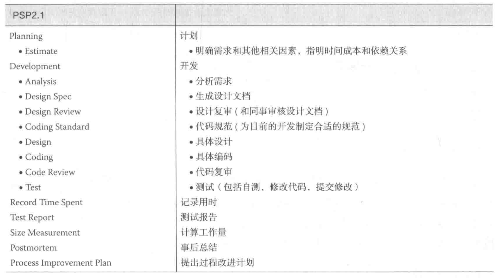

工程师一般要在需求分析和测试阶段花费很多的时间，测试的时间基本和具体编码时间相当。

软件的设计原则有很多，如单一职责原则（Single Responsibility Principle）、开放-封闭原则（Open-Close Principle），使用这些原则的前提应该是需求的变化，如果不用考虑任何变化，那么多数的设计原则都是累赘。

## 软件工程师的成长

软件系统绝大部分模块都是由个人开发或维护的，这些单个的成员被称为Individual Contributor（IC）。

初级软件工程师的成长主要包括以下几个方面：开发相关知识、软件设计思想、实际成果和相关行业经验。

### 工作量和质量的衡量因素

软件开发的工作量和质量如何保证？PSP认为由以下几种因素影响：

1、项目大小

2、项目花费时间

3、质量，也就是交付时的缺陷数，这里分为提交给测试人员时的缺陷数和最终发布时的缺陷数（也有人认为re-work返工次数也可以代表质量，但是一般来说返工次数和质量没有直接联系）

4、每个任务交付情况，包括完成任务的平均时间和标准方差，两者相比交付时间稳定也很重要

### 软件工程师的思维误区

1、分析麻痹：悲观导致无法修复复杂问题

2、不分主次：总想完美的达成目标，而不是先拿出一个比较好的方案

3、过早优化：无视全局的情况下对局部进行优化导致花费大量时间

4、过早泛化（Premature Generalization）：过早的做了大量的抽象，总是想着处理所有类似的问题，导致花费大量时间

### 提高技能和三区域理论

提高技能的关键：通过不断的练习，把低层次的问题都解决了，变成不用经过大脑的自动操作（舒适区），然后再来解决需要脑力解决的问题（学习区），逐步达到更高层次（恐慌区），类似教育理论中三个区域的理论：

## 两人合作

### 代码风格规范

代码风格的原则是：简明、易读、无二义性，具体包括以下几个方面：

1、缩进：最好用4个空格，因为编辑工具可以设置一个tab键为几个空格，如果设置被修改的话会影响阅读体验。

2、行宽：80个字符（以前），现在随着硬件升级可以提高到100个字符

3、括号：选择最清晰的程序结构：

~~~c
if(condition)
{
	DoSomething();
}
else
{
	DoSomethingElse();
}
~~~

4、不要把多条语句放在一行，不要把多个变量的定义放在一行

5、命名：对于不区分变量类型的语言来说，命名中要有变量类型让人一眼看出来变量是什么类型，避免可能的错误，这就是匈牙利命名法，一些强类型的语言中就没有必要在命名中加入变量类型。命名一定要避免过多的描述，能从上下文得到的信息就无需写在变量名中（如Employee类的姓名变量可以简单的起名为name，而不是employeeName），避免过多的形容词，如state、data等。

6、下划线的使用：各公司标准不同

7、大小写：类的所有单词首字母都大写，即Pascal风格；变量名和函数名除了第一个单词以外的所有单词首字母都大写，即Camel风格。常量全部字母都大写，单词间用下划线隔开。函数名可以用动词或动宾组合来命名。

8、注释：注释不要解释程序是怎么做的（how），而应该介绍程序做了什么（what）、为什么这样做（why），以及需要特别注意的地方。注释也要根据程序的修改而不断更新，一个误导的注释比没有注释更糟糕。

### 代码设计规范

函数设计时遵循的最重要的原则是：只做一件事，而且要做好。

面向对象编程的几个原则。

### 代码复审

代码复审的三种形式：自我复审、同伴复审、团队复审

代码复审的目的：

1、找出代码的错误，如不能通过编译的代码、不符合团队规范的代码

2、找出逻辑错误

3、找出算法错误，如算法优化不够，边界条件没有处理好

4、发现潜在的错误和回归性错误

5、提出可能改进的地方

6、互相传授经验，熟悉项目各部分的代码

代码复审的步骤：

1、代码首先要通过编译、完成自测

2、通过文件差异分析工具对比代码

3、由开发者讲述修改的前因后果，由复审者提出问题或意见，复审者不必亲自调查每一件事，开发者有义务作出详尽的解答，或者确保这些问题得到处理。

不仅仅要提出实际的问题，还要把眼光放远，问一些这样的问题：

（1）修改后别的功能会受到影响吗？有没有别的成员需要告知？还有别的地方需要类似的修改吗？

（2）有没有留下足够的说明和注释？

（3）导致问题的根本原因是什么？如何能自动避免这样的问题出现？

注意在项目开发的早期无需计较一些细枝末节。

4、双方达成复审的结果，结果包括发现致命问题打回去、有一些小问题但可以先同意、放行。

5、代码复审后，开发者应该把错误整理出来防止再犯。

代码复审的核查表：

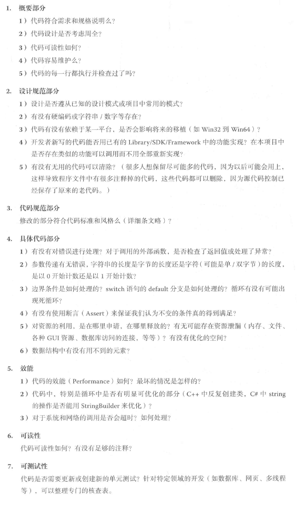

### 结对编程

结对编程就是一种无时无刻不在代码复审的工作方法，也就是一对程序员共同工作，坐在一台电脑前。结对编程有两个角色：驾驶员Driver控制键盘输入、领航员Navigator起到领航和提醒作用。

结对编程中通过随时的代码复审和交流，程序各方面的质量取决于水平较高的那一位，这样就能提升程序的质量，如果运用得当，结对编程可以取得更高的投入产出比。

结对编程最关键的是如何发挥领航员的作用。

不是所有情况都适合结对编程，如需要长期独立钻研的处于探索阶段的项目、后期维护时、测试需要很长时间时等。

### 两人合作的不同阶段和技巧

两人合作的各个阶段：

1、萌芽阶段：刚刚认识，很有礼貌，避免冲突和容易引起争论的观点，彼此不了解

2、磨合阶段：开始有观点上的冲突

3、规范阶段：彼此逐渐了解，许多事情达成一致

4、创造阶段：彼此很了解，可以高效率的共同工作

5、解体阶段：如果磨合过多可能会散伙

影响对方的几种方式：

合作的关键是如何正确的给予反馈，评价别人有几种层次：

最外层的是行为与后果，中间层的是习惯与动机，最内层的是本质与固有属性。

加入某人在项目的源代码中使用了tab缩进，这和团队规定的代码规范相违背，他的同伴可以这样提意见：

1、行为与后果：我注意到你用的是tab缩进，我们当初指定规范说好了用4个空格，如果个别人使用了不同风格，以后大家阅读和修改代码时就很不方便，对工作有影响。

2、习惯与动机：你怎么又搞tab缩进？这都第几次了？你是对大家的决议不满吗？

3、本质和固有属性：你太没脑子了，我们之前决定的编码风格你怎么都听不进去！你只想着你自己的方便，你们xx学院出来的学生怎么都这么没有团队精神！

很显然，一旦攻击深入到核心，被攻击方就难以做出回应，合作的关键在于提供他人容易接受的反馈，这里推荐一个“三明治”办法：

1、首先做好铺垫，强调双方的共同点，从团队共同的愿景讲起，让对方觉得自己处于安全的环境

2、然后再提出建设性的意见，不要提以前的事，也不要做评价下结论，应该多展望未来的结果，强调过去虽然做的不够，但是我们将来可以做的更好，一般不要贸然深入到中间层和最内层，着重反馈行为与后果。

3、鼓励对方把工作做好。

上例中，对团队成员的反馈应该这样进行：

1、做好铺垫：我觉得你这几段代码写的很快，解决问题的思路也不错，和以前比大有进步

2、提出意见：我注意到你用的是tab缩进，我们当初指定规范说好了用4个空格，如果个别人使用了不同风格，以后大家阅读和修改代码时就很不方便，对工作有影响。

3、鼓励对方：你这几段代码还是很关键的，要好好做，既然已经做了很多工作，那就再进一步，留下高质量的代码。

## 团队和流程

### 软件团队的模式

#### 一窝蜂模式Chaos Team

一个欢乐而随意的团队模式，员工没有明确的分工，大家一起追逐和解决一个突然出现的问题。

#### 主治医师模式Chief Programmer Team

这样的软件团队中，有首席程序员，他负责处理主要模块的设计和编码，其他成员从各种角度支持他的工作。

#### 明星模式（Super-star Model）

这种模式就是主治医师模式运用到极致的模式，在这里明星的光芒盖过了团队其他人的总和。

#### 社区模式（Community Model）

社区一般都有很多志愿者参与，每个人参与自己感兴趣的项目，贡献力量。社区不意味着随意，成功的社区项目有很严格的代码复审和质量控制。

#### 业余剧团模式（Amateur Theater Team）

在这样的团队中，每个人会挑选不同的角色，下一个项目中这些人也许会换一个完全不同的角色类型。每个人在团队中听从一个中央指挥的安排。一般这种模式会出现在培训等业余的环境中，但是在竞争性比较强的团队中不会存在完美的民主氛围。

#### 秘密团队（Skunk Work Team）

这种秘密状态开发的好处是团队内部有极大的自由，没有外界的干扰（介绍项目、听从指示等），一般这样的团队拥有独特的使命，往往能够发挥超高的效率完成看似不可能的任务。

#### 特工团队（SWAT）

这样的团队由一些有特殊技能的专业人士组成，负责解决一些棘手又紧迫的问题，如安全性服务团队。

#### 交响乐团模式（Orchestra）

当某个软件处于稳定成长阶段时，很多的开发团队就会采用这种模式，该模式下的各成员各司其职，负责的部分各不相同，而且每个成员专门处理类似的问题，大家都很专业，由指挥统领全局。

#### 爵士乐模式（Jazz Band）

与交响乐团相比，该模式的成员职责不固定，不专门处理类似的问题，没有统一的指挥，各自即兴发挥。这种模式强调个性化的表达，强有力的互动。

#### 功能团队模式（Feature Team）

很多开发团队采用这种模式，每个小组内具备不同能力，负责不同部分的同事们平等协作，共同完成一个功能。

#### 官僚模式（Bureaucratic Model）

这种模式出现于大机构的组织架构，几个人报告给一个小头目，几个小头目再汇报给上一级。这种模式成员之间不仅有技术方面的合作，还有组织上的领导关系，因为团队不同难以绩效评估，导致很多无谓的算计。

### 开发流程

#### 写了再改模式（Code-and-Fix）

通常出现在一窝蜂团队模式，不需要准备太多，大家上来就写代码，写不出来就改，也许能改好，当面临只用一次的程序或某些演示程序时，这个方法是有用的。

#### 瀑布模型（Waterfall Model）

这个模型是从其他成熟行业，如建筑工程，借用来的，这些“硬”行业的产品一旦大规模生产，要再返回去修改就非常困难，这个模型就描述了这种单向的、不可逆的生产过程。

这种单向的模型局限性很大，温斯顿指出在设计大型系统时，应该同时完成相邻步骤的回溯，解决上一阶段未能解决的问题：

温斯顿还指出要让产品成功，最好把这个模型走两遍，先有一个模拟版本，在此基础上收集反馈，改进各个步骤，并交付一个最终的版本：

他也提到在该模型中文档的重要性，如下列几种文档：

这种模型在软件工程实践中的局限性在于：

1、软件生产过程中各步骤之间是分离的

2、回溯修改很难甚至不可能，但是实际开发中回溯需要时时回溯

3、最终产品直到最后才出现，但是软件的客户，甚至软件工程师本人都需要尽早知道产品的原型并试用

当出现下列情况时，也可以采用瀑布模型：

1、产品的定义非常稳定，产品的正确性非常重要，需要每一步的验证

2、产品模块之间的输入输出定义稳定

3、团队成员很熟悉使用的技术

4、负责各步骤的子团队分属不同的机构，或在不同的地理位置，不可能做到频繁交流

#### 瀑布模型的各种变形

生鱼片模型，这种模型的各相邻模块像生鱼片那样部分重叠，解决了各步骤之间分离的缺点：

子瀑布模型，它解决了各子系统之间进度不一，技术要求不同，需要区别对待的问题：

该模型的缺点时最终测试难度大，且没有解决最终产品最后出现的问题。

#### 统一流程RUP

统一流程Rational Unified Process把软件开发的各个阶段整合在一个统一的框架中。要完成一个复杂的软件项目，团队的各种成员要在不同阶段做不同的事情，这些不同类型的工作在RUP中叫做规程（Discipline）或者工作流（Workflow），各阶段工作如下：

1、业务建模Business Modeling：它用精确的语言（通常是UML）把用户的活动描述出来，这个工作流的结果通常是用例（Use Case）

2、需求：分析软件系统要提供的功能，功能有什么约束条件，如何验证功能满足了用户需求

3、分析和设计：设计系统，包括有什么子系统、模块以及它们之间的关系

4、实现：按照计划开发出组件，然后搭建可执行的系统

5、测试

6、部署：生成最终版本并将软件分发给用户

7、配置和变更管理：负责管理各阶段产生的各种工作结果，要记录修改人员、修改原因、修改时间等属性

8、项目管理：负责平衡各种可能产生冲突的目标，管理风险，克服各种约束

9、环境：向软件开发组织提供软件开发环境，包括各种工具

RUP把软件开发分为几个阶段，一个阶段的结束称为一个里程碑（Milestone）每个阶段内可能有几次迭代，这样就能比较灵活的完成任务，这样的阶段有4个：

1、初始阶段：分析软件系统大致的构成，大致的成本和预算、系统风险、系统与外部系统的边界。该阶段完成后项目会达到生命周期目标（Lifecycle Objective）里程碑。

2、细化阶段：建立健全体系结构、编制项目计划，为项目建立支持环境、创建开发案例、创建模板并准备工具。该阶段完成后项目会达到生命周期（Lifecycle Architecture）里程碑

3、构造阶段：团队开发出所有的功能集，并经过各种测试验证，构造阶段结束后项目会到达初始功能（Initial Operational）里程碑，此时的产品版本也被称为beta版

4、交付阶段：此时团队工作的重点是确保软件能满足最终用户的实际需求，交付阶段可以有迭代（beta1、beta2），根据用户的反馈不断的完善调整。该阶段结束后项目到达产品发布（Product Release）里程碑。

RUP驼峰图：

#### 老板驱动的流程（Boss-Driven Process）

这种模式下开发流程实际上是由行政领导主导，或直接由公司的老板推动的。这种模式可能会出现在软件团队未成熟的时期，也有可能是因为软件订单的获得不是靠技术，而是靠人脉。这种模式下，领导对许多技术细节都是外行，领导的权威影响了自由的交流和创造。

#### 渐进交付的流程（Evolution Delivery）、MVP和MBP

渐进交付这种模式比较接近于迭代式开发流程，当需求和架构基本明确后，软件团队进入了一个不断演进的循环中：

MVP（Minimum Viable Product）流程的核心是把产品最核心的功能用最小的成本实现出来，然后快速征求用户意见，这样就不至于拖了很久弄好第一版，结果用户没有购买意愿的尴尬局面。MVP的思想和渐进交付类似，但是它更强调用户的反馈。

MBP（Maximal Beautiful Product）是与MVP相对的一种模式，它把产品最全、最美的形态都展现出来，一举征服用户。

### TSP的原则

优秀的模式和流程都有一些共同点，这些共同点抽象总结为TSP（Team Software Process）原则：

1、使用妥善定义的流程，流程中的每一步都是可重复、可衡量结果的

2、团队中的各个成员对团队的目标、角色、产品都有统一的理解

3、尽量使用成熟的技术和做法

4、尽量收集数据，并利用这些数据来帮助团队做出理性的决定

5、制定切合实际的计划和承诺，团队计划要由负责具体执行的角色来定（而不是从上级而来）

6、增加团队的自我管理能力

7、专注于提高质量，争取在软件生命周期的早期发现问题，做全面而细致的设计工作

## 敏捷流程

### 敏捷的流程简介

敏捷流程是一系列价值观和方法论的集合，这种思想强调敏捷的做法更能带来价值：

敏捷开发的原则是：

1、尽早并持续地交付有价值的软件以满足客户需求

2、敏捷流程欢迎需求的变化，并利用这种变化来提高用户的竞争优势

3、经常发布可用的软件，发布间隔可以从几周到几个月，能短则短

4、业务人员和开发人员在项目开发过程中应该每天共同工作

5、以有进取心的人为项目核心，充分支持信任他们

6、无论团队内外，面对面的交流始终是最有效的沟通方式

7、可用的软件是衡量项目进展的主要指标

8、敏捷流程应能保持可持续的发展。领导、团队和用户应该能按照目前的步调持续合作下去

9、只有不断关注技术和设计，才能越来越敏捷

10、保持简明，要尽可能简化工作量

11、只有能自我管理的团队才能创造优秀的架构、需求和设计

12、时时总结如何提高团队效率，并付诸行动

以Scrum方法论为例，下图是敏捷流程图：

敏捷的步骤如下：

第一步：找出产品需要做的事情，也就是Product Backlog。产品负责人领导大家对backlog（待解决的工作）中的条目进行分析细化，每一项工作的时间估计单位为天

第二步：决定当前的冲刺Sprint需要解决的事情，也就是Sprint Backlog。整个产品的实现被划分为几个互相联系的冲刺，产品订单上的任务被细化成以小时为单位的任务，如果一个任务估计时间过长（如超过16小时），那么它就应该被进一步分解。订单上的任务是团队成员根据自己的情况来认领，充分发挥他们的能动性。

第三步：冲刺Sprint。冲刺阶段，外部人士不能直接打扰团队成员。一切交流只能通过Scrum大师（Scrum Master）来完成。有任何需求的改变都留待冲刺结束后再讨论，这一措施很好的平衡了交流和集中注意力的矛盾。

冲刺期间，团队通过每日例会（Scrum Meeting）来进行面对面的交流，大家依次报告昨日完成内容、今日预计要完成工作和遇到的问题。Scrum Master根据项目的情况，用简明的图表展现整个项目的进度，图表可以是燃尽图（Burn Down Chart），或者简单的看板图（Kanban）

下图为一个燃尽图：

上图表中从上到下三个时间分别为实际剩余时间、预估剩余时间、实际花费时间。由此图可知，最终完成的工作量是预计的1.5倍。

冲刺阶段是时间驱动（Time-boxed）的，时间一到就结束，有效的断了各种延期思想。

第四步：得到软件的一个增量版本，发布给用户，然后在此基础上又进一步计划增量的新功能和改进。

### 敏捷流程的问题

在第一步中，除了考虑任务和需求内容，还要考虑优先级和依赖关系，最后在backlog中体现这些关系。

在第二步中，把任务分解成一个一个可执行的冲刺任务时，会面临很多的实际问题，这些问题很难在短时间内解决，程序员会冒着风险先尝试实现，也许以后要返工。

在认领任务阶段，团队成员对某个任务都不感兴趣，没人认领这个任务，或者任务a依赖某个任务b的完成，而任务b无人认领，或者成员间认领任务的工作量不均。

在第三步中，每日例会很容易变成形式，也就是无人提出问题，发言没有内容。这里有几个建议解决这个问题：

1、说清楚任务的状态，与谁有关，做好之后交给谁了

2、说明完成这个任务还需要多少时间

每日例会开不起来怎么办？有些团队成员不在同一个时区工作，此时可以考虑用文档或其他辅助手段，没必要一定面对面。

在任务完成之后要面临很多繁琐的测试和兼容问题，功能看似快完成了，但往往要花费大量精力，敏捷流程中没有规定由何人来完成这些任务。

在软件项目中有一些比较艰难和底层的任务，谁来负责也没有明确规则。

在敏捷流程中，测试在冲刺中的工作形式还有待研究，考虑到测试在团队中的技术能力，很难让测试负起其他责任。

在第四步中，可能会出现一些未料到的情况，比如增量没有满足预先计划，在冲刺中发现了新问题，冲刺结束后如何放松？如何总结经验？这都是实际面临的问题。

### 敏捷的团队

Scrum Sprint能否成功实施的关键在于Scrum Master，一个好的Scrum Master能在两种语境（描述软件需求的商业语境，描述实现细节的技术语境）中自如的切换，他事实上是一个强有力的项目经理。

敏捷对团队的要求有自我管理、自我组织、多功能型：

1、自我管理：不是领导给你安排任务，而是自己挑选任务，而且冲刺结束后总结不足并改进

2、自我组织：以前做好自己的事情就可以了，现在每个人都要对项目负责，有人落后了还要帮助他改进，项目缺少某些资源还要主动顶上去

3、多功能型：每个人都全面负责各种工作，包括规格说明书、沟通、测试

### 敏捷总结

一些敏捷实践者的经验教训：

1、敏捷表明的是一些优先级，不必当做教条来做

2、Scrum Master不是一个官，而是一个没有行政权力的沟通者，他同时还要在团队中做具体的工作

3、在大型团队和复杂项目中，Scrum并没有完美的答案。

除了Scrum以外，敏捷Agile还包括很多方法论：

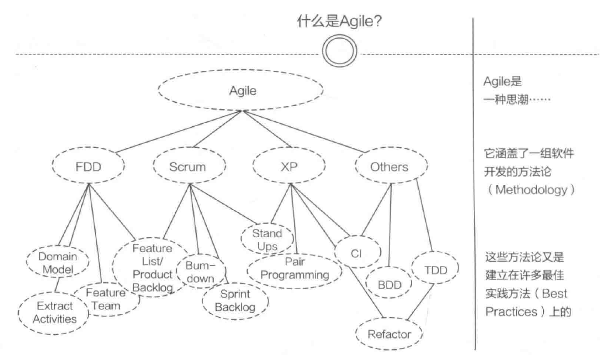

敏捷有它自己的适用范围：

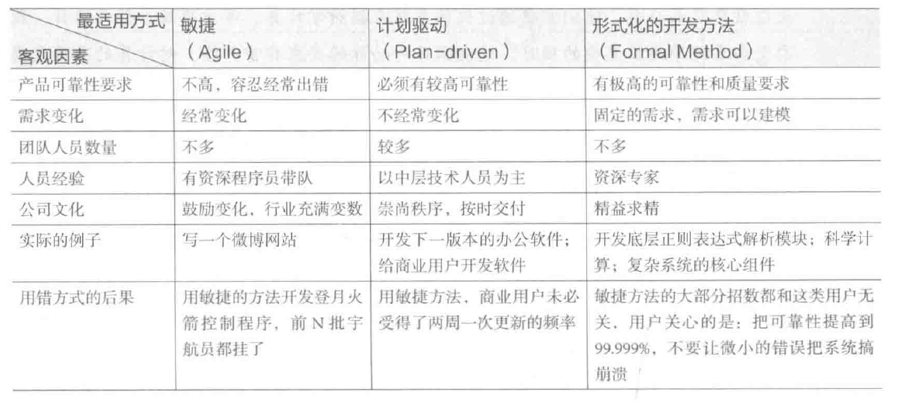

## 微软解决方案框架MSF

### 9个基本原则

MSF（Microsoft Solution Framework）是微软公司关于软件开发的思想和宣言，它有一套思想框架，包括9条基本原则：

1、推动信息共享与沟通（Foster open communications）

2、为共同的愿景而工作（Work toward a shared vision）

3、充分授权和信任（Empower team members）

4、各司其职，对项目共同负责（Establish clear accountability and shared responsibility）

5、交付增量的价值（Deliver incremental value）

6、保持敏捷，预期和适应变化（Stay agile, expect and adapt change）

7、投资质量（Invest in quality）

8、学习所有的经验（Learn from all experiences）

9、与顾客合作（Partner with internal and external customers）

#### 推动信息共享与沟通

这个原则就是所有信息都保留并公开，讨论要包括所有涉及的角色，决定要公开并告知所有人。

这种原则否认了原来“老板让你知道你就会知道”的思想，随着项目复杂度增加，没有这个原则是不行的。有些情况下拿不准是否要通知某些人员，宁可过分沟通，也不能不沟通。所有人的提交和修改都要保留不能删除，包括已经犯了的错误，留给大家去参考，达到问题及时解决的目的。

#### 为共同的愿景而工作

指定产品的目标，所有的工作朝着这个目标努力。如果搞不清楚项目的目标，或者每天的工作和目标无关，那么就是在做无用功。

#### 充分授权和信任

所有成员都应该能得到充分的授权，他们有权在职权范围内按照自己的承诺完成任务，同时他们也充分信任其他同事的承诺。

MSF团队模型是网状的，而不是层次结构，所以不能用命令来驱使。这样做的好处有两点：

1、被授权的人会承担起自己对项目的责任

2、每个人有充分的权利估计并决定自己的任务需要多久，让真正做这件事的人按照自己的估计去完成任务

作为一个组长，给组员充分授权后，他只要通过管理系统就能查看工作进展，在最关键的时候提供指导和帮助。

团队中充满了信任，这样每个人可以充分发挥他的特长，带领其他成员对项目的某一个方面进行改善。

#### 各司其职，对项目共同负责

团队中的每个角色都有自己的职责，如下表，如果出了问题这个角色就要负责任：

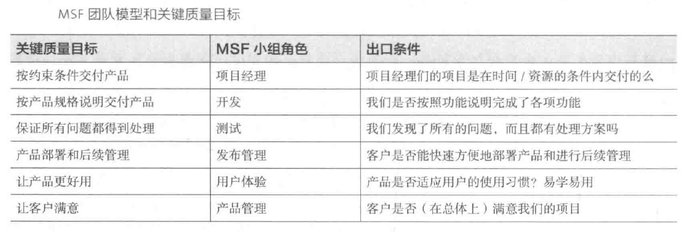

当要做一件事情，周围人有不少意见时，对此事负责任的角色要自己拿主意。

对于每一项任务，每个人都要明确几件事：谁负责？做什么？什么时候开始和结束？为什么是这样安排？什么情况下可以变更？

#### 重视商业价值，提供渐进的价值

要重视商业价值，将目标和商业价值联系起来。

#### 保持敏捷，预期和适应变化

我们是预期变化，而不是期望变化。适应需求的变化、技术的变化、人事的变动。

即使预期变化，每一个步骤的代码也要保持高质量。

#### 投资质量

我们希望用恰当的时间去提升质量，但是没有说质量第一，因为解决用户的问题第一。

#### 学习所有的经验

强调把经验总结出来和分享经验两个方面。MFS在每一个里程碑结束时都要做一个里程碑回顾，而不必等到项目结束后，因为大家对最近的成败都记忆犹新，能提供比较准确和全面的反馈。如果发现了错误，可以马上研究解决方案，在下一个里程碑中通过实践来验证。

#### 与顾客合作

项目的商业价值要由用户说了算，及早和用户沟通，通过讨论将模糊的需求共同变得具体。

### MSF团队模型

这种团队模型定义了小组同级成员的一些角色和职责：

任何一个角色无法实现其目标，都将危及整个项目，因此每个角色被认为是同等重要的。

有些问题目前不能得到完美的解决，但是可以提出一个让用户满意的方案。

讨论处理方案时，每个角色从自己的质量目标出发并对其负责，通过讨论共同决定方案，不要怕冲突和矛盾，这是对产品质量负责的态度，你要代表你角色的利益，如果你有充分的授权和信任，你就要直言不讳。

### MSF过程模型

下图是MSF过程模型的生命周期简图：

它把瀑布模型中基于里程碑的规划优势和螺旋模型中增量迭代的长处结合了起来。

MSF过程模型的基本元素是阶段和里程碑，团队用里程碑来检查工作是否结束和同步各个角色的进度，以此来确定当前阶段的目标是否已经实现。同时里程碑标志着各个阶段的结束，此时团队应该引导成员转移工作的重心，并鼓励队员以新的视角来看待下一个阶段的目标。

## 需求分析

### 需求的步骤和需求分类

找到软件需求的几个步骤：

1、获取和引导需求（Elicitation）

这一步骤也被称为需求捕捉，一方面很多时候用户描述不清或不愿意表达完整需求，一方面这些需求来源可能并不同，也许来自外界，也许来自软件企业本身，甚至来自技术团队本身，如技术性的需求，更好的了解用户行为而加上的收集信息需求（也被称为遥测技术Telemetry）

2、分析和定义需求（Analysis & Specification）

也就是需求的规整和量化，指定最后期限、优先级等

3、验证需求（Validation）

向利益相关者沟通，通过分析报告、技术原型、用户调查或演示等形式向他们验证这些需求的认知

4、在软件产品的生命周期中管理需求（Management）

面对一些变化我们要做出相应的调整，如需求变化、功能很难实现、有些功能不再重要、出现了一些捷径、相关法规的变化、外部合作伙伴的变化等。

对软件的需求，也可以从不同角度做下面的划分：

1、对产品功能性的需求：必须实现的功能

2、对产品开发过程的需求：开发过程必须满足某些约束条件，如产生某种文档、某个时间点达到某种状态、安全性核查等

3、非功能性需求：也称服务质量需求，比如要求高速度、高并发

4、综合需求：多模块多部门共同完成的需求

### 软件产品的利益相关者

一般包括以下几种：

1、用户：使用软件的人

2、客户：购买软件的人，不一定是直接用户

3、市场分析者：代表典型用户的需求，可能是市场部门的成员，或独立的市场分析人士

4、监管机构：软件需要复合行业和政策规定

5、系统/应用集成商：负责给客户提供咨询、服务、集成等工作，也可能会把客户的需求分解，交付给下一级的服务团队来完成

6、软件团队

7、软件工程师

很多时候软件开发工程师和用户相隔很多环节，如：

用户-客户-系统集成商-应用集成商-二级应用集成商-软件团队-工程师

### 获取用户需求——用户调研

用户调研有以下几种形式：

1、焦点小组（Focus Group）

找到一群目标用户的代表，加上其他利益相关者，大家一起讨论用户想要什么。缺点是很多人的情况下发表的意见不真实、可能出现表达能力强的人控制局面、讨论者对新事物不能提供有价值的想法、往往选择那些最符合自己利益的意见。这种形式也叫做推进会议（Facilitated Meetings）

2、深入面谈（In-depth Interview）

这通常是一对一的采访，效果取决于主持面谈的团队成员的能力，软件项目成员可以在一旁观察用户如何使用软件，也可以隐蔽在单向玻璃后，或通过录像观察。用户使用的软件不一定是自己公司开发的软件，也可以使用别的软件，找出此类软件的问题。

3、卡片分类（Card Sorting）

团队收集到的需求常常是杂乱无章的，此时我们可以把各种需求做成小卡片，然后通过讨论、定义、归类、排序来整理软件需求

4、用户调查问卷（User Survey）

设计调查问卷时有一些常见的错误：

（1）问题定义不准确

（2）使用含糊不清的词语

（3）提出一个让用户花很多时间才能回答上来的问题

（4）问题带有引导性的倾向

（5）问题涉及用户隐私、用户所在公司商业机密等

用户调查问卷的问题可以有如下方式：

（1）全开放式问题，也就是问答题

（2）二项选择题，回答是或否，但是了解情况不够深入

（3）多项选择

（4）顺位选择题，也就是有优先级的多选

5、用户日志研究（User Diary Study）

这一调研方式要求用户记录自己日常工作或生活中使用软件相关的行为，可以用文字描述或每天填表，也可以使用软件来跟踪，注意要保护用户的隐私

6、人类学调查（Ethnographic Study）

假装自己是目标用户，以目标用户的心理使用软件，或者长时间观察目标用户的使用情况和心理

7、眼动跟踪研究（Eye Tracking）

一般用来弄清楚用户浏览内容的规律

8、快速原型调研（Quick Prototype）

软件还未做好时，用一个纸张模型或木块模型让用户去使用和反馈

9、A/B测试

这种测试就是同时在技术上实现两套方案，然后收集数据来观察大家的喜好。这种方式运行成本较大、数据可能不会真实反应用户的情绪、难以摸清数据和用户心理的关系、用户可能反感

下图在四个维度区分了这些方式：

### 竞争性需求分析框架

讨论关于产品需求的创新想法时，经常需要多方面考虑问题，得到他人的信服，此时通过NABCD模型来分析是一个有效的方法。

1、N代表need，需求

主要回答产品解决了用户的什么需求，形式并不重要，解决痛点的方案才是关键

2、A代表approach，做法

也就是完成需求的具体做法

3、B代表Benefit，好处

能给用户带来什么好处？尤其是在用户已经有了其他解决方案的前提下

4、C代表competitors，竞争

产品市场有多大？有多少竞争者？先进入市场的产品有先发优势（First Mover Advantage），后进入市场的产品有种种不利的因素，当然也有后发优势（Second Mover Advantage），可以用一张图来表达产品需求情况：

这张图可以清晰的表达我方优势在哪里，我方劣势在哪里。

5、D代表delivery，推广

怎样把创新产品交到用户手中？是放到导航页面还是放在手机应用商店？需要做广告和公关活动吗？

有了NABCD模型，团队成员就可以用简明的语言把自己项目的特点说出来，这种简明的表达方式又叫电梯演说：

### 功能的定位和优先级

根据实际需求的特点，我们可以把功能分为

1、杀手功能（Core）/外围功能（Context），杀手功能就是产品的某个功能比其他产品好一个数量级，外围功能就是相对杀手功能的其他功能

2、必要需求（Mission Critical）/辅助需求（Enabling），必要需求就是缺少之后导致用户无法正常使用的需求，相对的就是辅助需求

这四个划分结合起来就组成了功能分析的四个象限：

对于不同的功能我们有以下几种策略：

1、维持：以最低成本维持此功能

2、抵消：快速的达到足够好，和竞争对手差不多

3、优化：花大力气做到行业最好

4、差异化：产生同类产品比不了的功能和优势

5、不做

对功能的位置不同，我们的策略也不同：

产品的各类功能和用户的满意度的关系也不一样，对于核心功能（如查询速度）来说，功能质量和用户满意度呈线性关系；对于基本功能（如稳定性）来说，投资超过一定程度用户满意度就不会上升了；对于让用户惊喜的功能，这些功能一旦出现就会给用户满意度带来增加，而且随着质量提高用户会非常满意这个产品。综上所述，各种投资的不同效果如下：

随着时间的推移，这些功能的属性也会发生变化，如核心功能演变成基本功能、惊喜功能变成核心功能等。

### 计划和估计

在开始估计之前，我们应该先分清楚几个概念：目标、估计和决心。目标是未必能实现的，估计是基于目前了解的情况规划的，决心是一个可能不会完成的保证。

合理估计的关键在于找出估计后面隐藏的种种假设，快速沟通达到意见一致的方法是找到一个主持人，然后主持几轮讨论，先确定大家对目标有统一的理解，然后每一轮统计估计结果，然后询问估计背后的前提假设，找到合理的假设，然后继续循环讨论。

提高估计能力的方法有参考前人的经验、快速原型法（找一两个人去探路）。

长期的实践过程中，软件工程师发现实际时间花费Y主要取决于两个因素，对某件事的估计时间X，以及他做过类似开发工作的次数N：Y=X±X/N，当一个人没有做过类似的开发工作时，实际花费时间会无穷大。当一个人做过一次类似开发工作时，实际花费时间范围是0到2X，如果员工一直在做类似的项目，那么变化的范围会越来越小，准确度也越来越高。

由上述公式可得，项目的复杂程度由需求的复杂程度和技术的复杂程度决定，下面的二维图表述了这些关系：

软件成本分析的经典模型CO-COMO全面描述了影响软件成本的各种因素：

上面的每一项都量化成一个因子，如果是完全在掌控中该因子就是1，如果完全不知道该因子就是10，软件项目所需时间Y会落在下面的范围中：

其中Y0是估计项目时间，F0到Fn是上文提到的各种因子。

在敏捷的开发流程中，团队一般不过分强调估计的价值，如果猜错了就调整项目进度，不要为了猜不准而停滞不前。快速交换意见得到粗粒度的估计，然后就进入实现阶段，经过一次里程碑后，再去回头看看估计和实际的差距，经过一两个里程碑，就可以估计的比较准确了。

### 分而治之WBS

WBS（work breakdown structure）分而治之是将大任务逐步分解成一个个小的具体的交付件。WBS分割的结果是一棵树，所有子节点都最终有一个根节点。每个节点展示的是结果，而不是过程。

WBS的一个例子：

如果文档是交付给客户，或者开发团队要付出很多人力来制作，就可以算在WBS中。

WBS描述了要交付的东西，这主要是给产品的接受方或利益相关者看的，具体为了完成结果所做的工作可以用开发团队比较熟悉的项目管理工具来描述任务。

有一些需要考虑、分析和探索的问题，花在这些问题上的时间都可称为技术研讨，短期的技术研讨应该在功能的设计阶段完成，不需要单独的交付成果。没有具体结果或报告的技术研讨，对公司基本是没有贡献的。

## 项目经理

### PM的定义和职责

PM有几种解释，包括Product Manager、Project Manager、Program Manager，在不同的行业和公司，他们的作用各不相同。本节主要讨论微软的项目经理Program Manager，它某种意义上是Project Manager和Product Manager的综合。

随着业务的发展和团队的壮大，有两个问题凸显出来：

1、团队成员之间的交流成本急剧增长

2、有很多开发和测试以外的事情，需要专人负责

PM做除了开发和测试之外的所有事情，一个PM在项目中的具体任务可能是：

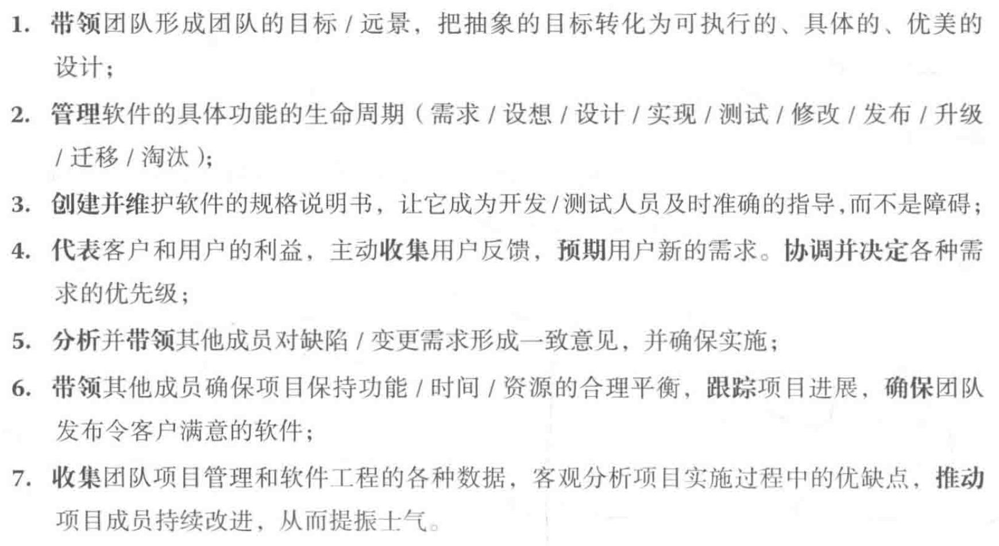

下表列出了Program Manager和Project Manager的区别：

为什么说PM和其他人不构成领导关系呢？这是因为我们认为号的产品设计是在平等讨论的基础上产生和完善的，好的PM要做规格说明书，凭自己的能力把用户的需求展现成其他成员能理解和执行的语言，从而赢得同伴的尊重。

PM最大的贡献就是带领团队达到最终的目标，并保持团队的平衡。

即使项目中全部都是程序员大牛，PM也不会因此失去作用，因为程序和软件是有区别的，个人的努力如果不能有节奏、有方向，那么最终大家的成果也不会很好。

PM的个人风格对产品有很大影响，有时PM在平等而反复的讨论折中得到关于产品的共识，这样的产品可能是中规中矩了无新意的，如果依靠PM的远见来主导产品，这样的产品可能大起大落，对于更多公司而言，不犯大错的产品是更重要的。

成为一个合格的PM，需要以下这些能力：

1、观察、理解和快速学习能力：要能理解用户，要体察成员的言外之意，要有同理心，要能理解菜鸟用户等

2、分析管理能力：管理很多事物的优先级再判断

3、一定的专业能力：能用工具表达内心的想法，要有销售能力、写代码能力、对心理和社会都要有广泛的了解

4、自省的能力：失败后的自我改进能力

### 高效的团队讨论

很多工程师对项目的会议效率不满，会议上充满矛盾的建议，甚至出现生气和抱怨。

会议的组织者应该在会议开始前就定义好目标具体是什么，并推进会议进程，总结会议记录要点。

如果一场会议中，会议的参与者想到哪里就说到哪里，各人的情绪也自由地发挥，这样的会议一定效率不高，我们应该把无序的活动逐步约束为有序的活动，然后让大家通过一系列思维活动来分析问题，在一个时间段内只做一类思维活动，思维活动有以下几种：

1、理清事实

在会议中，大家先把所有的事实列出来，把不是事实的部分清除

2、表达直觉和感情

在开会时，可以在事实理清之后，用几分钟的时间让大家充分表达情绪，并且不用说明自己情绪的理由

3、从乐观的角度分析问题

提出解决方案时，大家应该对别人的想法进行鼓励，给予乐观的反馈，鼓励时可以用“对方的建议+对，而且+自己的建议”这种句式

4、从悲观的角度分析问题

这个阶段应该指出具体思想的破绽，常用的句式是“对方的建议+好，但是+自己的建议”

5、从创意的角度分析问题

这样会议就可以变成：

会议结束后会形成一些共识，一些行动计划以及负责人。

对于会议中很多与主题不直接相关的观点，可以由专人把它放入“好主意停车场”，待时机成熟后再启动。

### PM和风险管理

在一个项目中，有很多风险，可以将其分成下面的类别：

风险会随着时间变化，有些小风险拖到项目后期可能成为大危机。

注意开发人员签入的代码有一些小问题，不能称之为风险，因为所有的代码都不可能是完美的，这是软件生命周期的正常事件。

应对风险有几个手段：

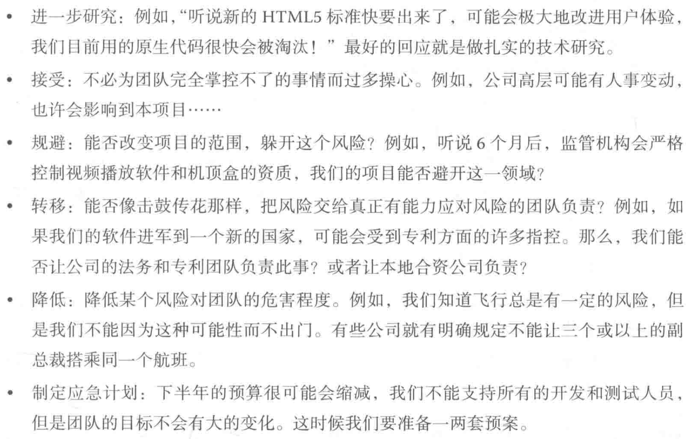

风险管理的水平也有多个层次：

第一层次：没有风险管理，应对危机没有预案，只能手忙脚乱的应对

第二层次：缓和并防止问题，对风险有一定的准备，能把问题缓和下来，且能动员大家一起想办法防止事故发生

第三层次：预计，从定性的猜测到定量的预计，有效的做准备

第四层次：把问题变为机会，从关注风险的负面影响转化为关注风险能否带来正面的机会，如移动设备时代到来后积极准备移动设备的开发获得成功。

## 典型用户场景

### 从典型用户到场景

在分析需求时，我们要重点考虑一些用户，而不是所有用户，否则就会浪费大量的时间。为此可以专门对一些典型用户进行分析，分析他们的身份、关注点、软件使用目的和方式、需求等。典型用户不是一个概念，应该是一个个活生生的人物。

典型的用户模板可以包括以下内容：

有了典型用户后，我们要和典型用户的代表交流，理解他们的工作方式和需要。然后对于每个典型用户，我们要分析他使用系统想要达到什么目标，对于每一个目标，列出达到目标所必须经历的过程，这就是场景。

编写场景时，针对每一个场景，我们要设计一个场景入口，接着描述典型用户在这个场景中所处的内部和外部环境，然后给场景划分优先级，按优先级排序写场景。

有了场景，下面就由架构设计师和各个模块的负责人一起，沿着模块的所属关系把场景划分开。例如登录场景，就可以分为UI层、逻辑层、数据库等。不同的任务会把一个场景编织起来，虽然有多个开发者参与这项工作，但是应该有一个开发者对整个场景负责。

场景的模板：

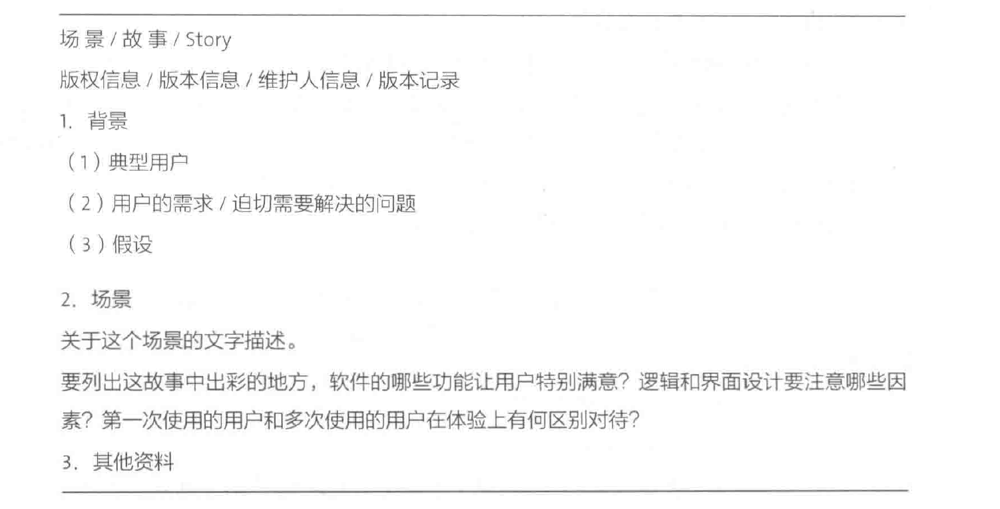

### 用例Use Case

和典型人物、典型场景类似，用例也是很常见的需求分析工具，用例有这样一些基本元素：

1、标题：描述用例要达到的目标

2、角色

3、主要成功场景

4、扩展场景：如一些意外情况和失败情况

用例强调用讲故事的方法来让团队人员对功能有统一的了解，突出具体的行动，而且是可验证的。可以通过完成用例来逐步构建系统。

User Case方法论也有其局限性，如不适合非交互式系统、故事的粒度没有统一标准、同时体现UI细节和保持故事简明性相互矛盾等。

### 规格说明书

全称Specification，简称Spec，分为以下两种：

1、软件功能说明书（Function Spec），主要用来说明软件的外部功能和用户的交互情况

2、软件技术说明书（Technical Spec），又叫设计文档，主要用来说明软件内部的设计规范

#### 功能说明书

它主要从用户的角度来描述软件，一般由PM或有经验的开发或测试人员编写，由质量保障成员（QA）来验证它的实现。

它的内容主要包括：

1、定义好相关的概念

2、规范好一些假设，如一个步骤必须前一个步骤成功

3、避免一些误解，界定一些边界条件

4、描述用户的使用过程

5、把副作用写好

6、服务质量的附加说明

软件公司的大部分人都不喜欢读文档，因此文档要写的生动一些，尽量用活生生的人物和故事，要多用图和表格，不要写长篇的文字。

Spec中要记录版本修订的时间和负责人，还要说明如何验证功能的描述，可以相互链接测试文档、项目任务。有任何改动应该事先参考Spec，事后修改Spec。

模板：

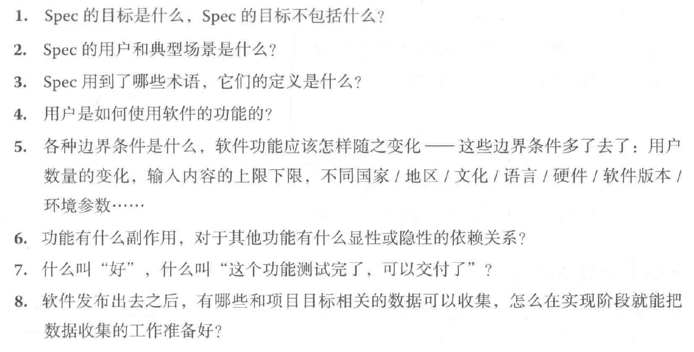

#### 技术说明书

又叫设计文档，设计时要满足一些设计原则，设计文档应该说明工程师的设计是如何体现下列原则的：

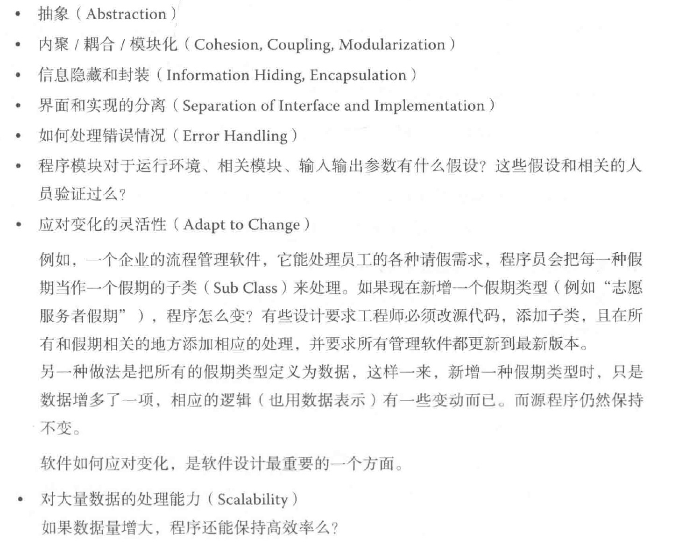

### 功能驱动的设计

如何才能把需求变成团队人员可以直接操作的开发工作？功能驱动的设计（Feature Driven Design，FDD）是针对这个问题的众多方法论之一，这个方法适用于团队成员对于需求没有切身体会的情景。

## 软件设计与实现

分析和设计有许多方法，比如以文字为主的文档、以图形为主的模型、用数学语言描述、注释加代码等。

### 图形建模和分析方法

#### 思维导图Mind Map

思维导图形式灵活，适用于很多鼓励探索、发散思维的场合，但是它的图形元素缺乏严格的语法和语义。

#### 实体关系图Entity Relationship Diagram

着重表达实体之间的联系时可以用实体关系图，例如：

我们可以将各种词汇来与ERD图中的元素对应起来：

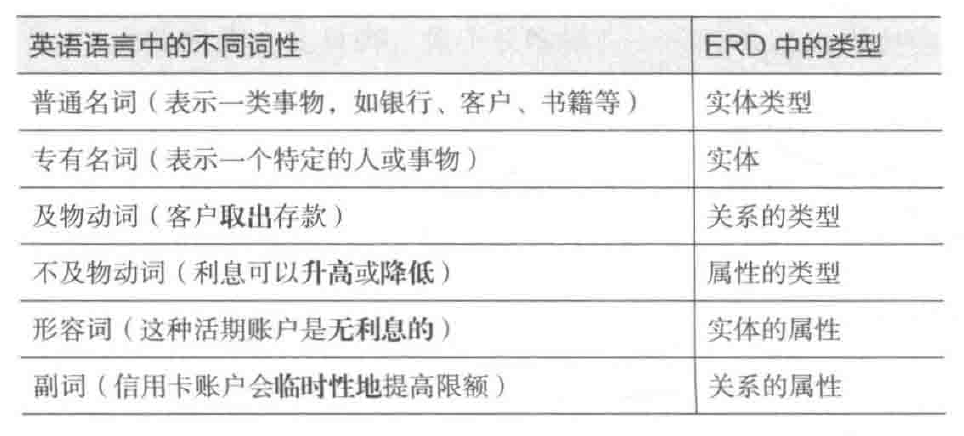

用例也有图形化的表示，也就是Use Case Diagram，UCD。用例图主要有下列几种元素：参与者、系统、用例和信息传递线。

#### 表达数据的流动Data Flow Diagram

关注数据在不同实体之间的流动时，可以用该图表述，以图书管理系统为例：

每个数据的操作还可以进一步细化，形成一个更低层次的DFD。

#### 表达控制流Flow Chart

也就是基本的流程图，此外还有有限状态自动机（Finite State Machine，FSM），它是由一组状态、一个起始状态、输入、将输入与现在状态转化为下一个状态的转换函数所构成。

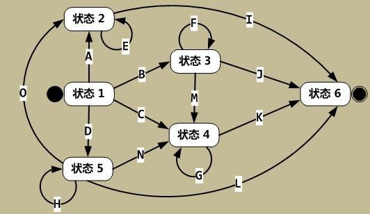

#### 统一表达方式UML

全称是Unified Modeling Language，UML使用了统一的表达方式来完成图形建模，是一个非常成熟的理论，但是对于它能否清楚的表达还有待争论。

### 从Spec到实现

一个开发人员拿到设计文档后，他会做下面几件事情：

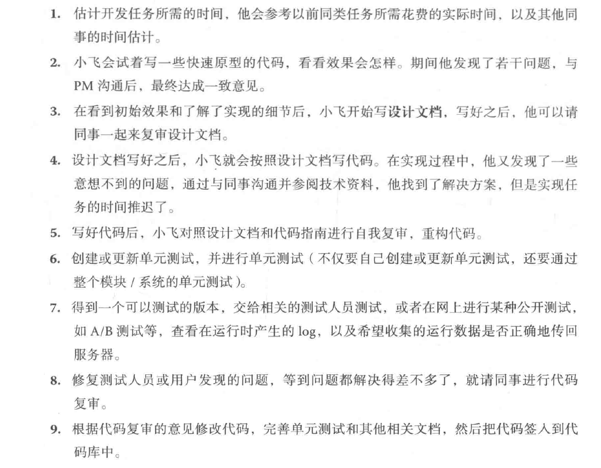

将开发人员的标准工作流程用图来表示：

### 开发阶段的日常管理

#### 闭门造车Leave Me Alone

有很多开发人员在工作中会出现忙了很久，却发现真正用在开发上的时间很少的情况，此时应该面对不同的任务或邮件，分优先级处理，分批查看和解决。

另外，不要主动查看测试人员发现了什么bug，而是经过会诊之后正式提交到你手上再行动，防止做无用功。这是因为开发人员在开发阶段最重要的任务就是完成规定的功能（有时在项目初期，可以不用等到集体会诊结束，开发和测试人员可以直接处理bug）

#### 每日构建Daily Build

编译时要产生debug版（调试版本，包含调试信息，不包括优化）和release版（发布版本，进行了各种优化，让用户更好的使用）。

构建时如果出现失败，就要分析构建失败的原因，然后对症下药，让做事不仔细的人慢下来，对于导致构建失败的成员，可以授予构建大师Build Master称号，他负责管理构件服务器，负责找错和调试，而且把该称号传递给下一个导致构建失败的成员，也可以进行罚款，设置一个构建基金。

#### 宽严问题

有时在修改完代码然后提交到服务器后，发现有人签入了与我的代码有关的新修改，导致版本冲突，如果再次本地编译并测试又会浪费大量时间，而且还有可能遭遇新的版本冲突，此时应该怎么办？

如果在签出一个文件时，加上一个防止别人签出的锁，就可以防止冲突。但是这样的锁多了可能又会导致死锁现象。因此面临这种问题时，团队一般有两种选择：

1、严格的规则和流程控制，这样做个人签入成功率很高，但是团队的进展会受到限制

2、宽松的规则和流程，每个人都可以随时签入签出，但是签入的成功率不高

此时要根据团队目前的情况来选择应对策略，选择时要注意，当团队成员的行为只是影响到个人时，就尽量放松，当其行为影响到整个团队时，就尽量严格。我们也可以公开固定的构建时间。下表就是构建宽严表：

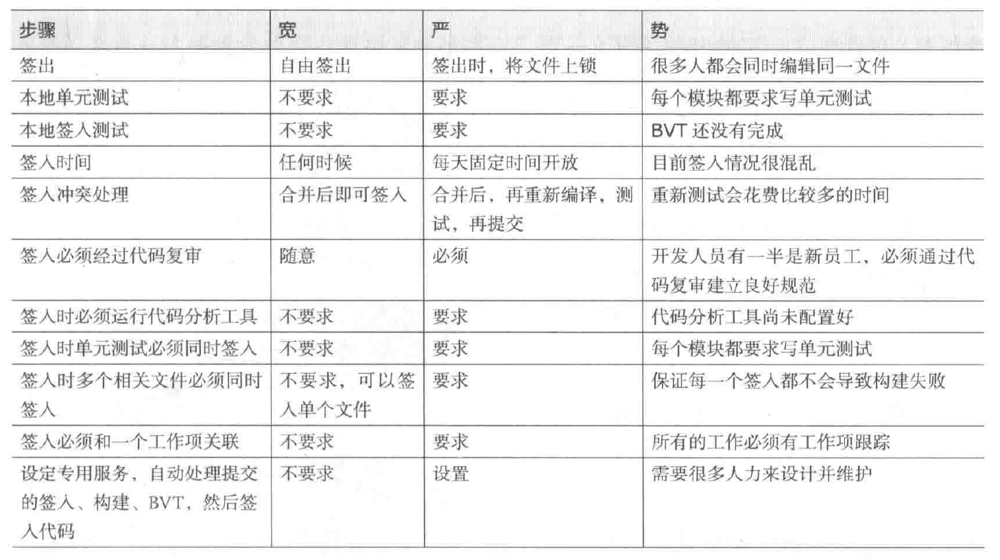

以某公司的具体开发流程为例，时间安排至关重要：

#### 小强地狱Bug Hell

随着项目进展，开发人员手上的bug数会越来越多，有些开发人员喜欢新功能全部实现后再修复bug，但是某些bug久久不修复可能导致的后果很严重，可能会重写一些功能，导致设计变更需求，也就是DCR。因此有这样一种方法可以避免这种情况，这就是小强地狱Bug Hell。

如果开发人员手中的bug达到某一规定值，那么这个人就被送入小强地狱，在地狱中，他唯一能做的就是修复bug，直到bug数低于此阈值，这个值通常由团队根据实际情况确定，注意开发人员同时入狱的人数最好不要超过50%，且阈值不宜频繁调整，可以在每天早上例会时宣布入狱和出狱名单。

## 用户体验

### 用户体验的要素

#### 用户的第一印象

软件第一次启动后，要给用户留下什么样的第一印象？用户界面不要设计的太复杂，用户很容易被弄晕。我们可以考虑用户的使用方式，考虑怎么让用户花少时间在对用户没有价值的部分，而把大部分时间花在有实际价值的部分。

#### 从用户的角度考虑问题

不要把问题从头到尾都按照设计人员的思维处理，否则要出大问题；用户需要帮助，但用户没那么笨，如划词功能没有必要翻译a这个单词；用户对选项对话框中的种种选择有很大的畏难情绪，而程序员却要千方百计增加高级选项。

#### 软件服务应该记住用户的选择

软件应该越用越简单，而不是越来越难，如office会把常用字体提到一个重要的位置。

#### 短期刺激和长期影响

如果用户看到一个非常炫酷的效果，可能就会给软件很高的评价，但是过一段时间后用户会开始思考，它给我们带来了什么其他的利益吗？软件的设计要能解决痛点，而不是仅仅只有效果。

#### 不让用户犯简单的错误

几个差别很大的按钮不要放到一起，这非常容易误操作；两个迥异的选项应该能让用户根据直觉选对，而不是仔细分辨，如type-C插头上下两端是一样的，完全避免了用户的误操作。

#### 用户体验和质量

有时需要牺牲质量去满足用户体验

#### 情感设计

诺尔曼阐明了设计的三个层次，以及对应的产品特性：

本能层次->外形、行为层次->使用的乐趣和效率、反思层次->自我形象、个人满足感、回忆

### 用户体验设计的步骤和目标

除了上述的三种设计层次外，用户体验设计的一个重要目标就是降低用户的认知阻力（Cognitive Friction），也就是用户对于软件界面的认知和实际结果的差异。如果认知阻力大，学习曲线就会比较陡，但是用户适应之后工作效率就会有较大的提升。

软件工程师往往以熟练掌握认知阻力大的工具而自豪，这对工程师的工作是有帮助的。但是大多数用户的心理是要躲避认知阻力，大部分人还是依赖传统和系统提供的指令，拒绝不熟悉的交互方式。

用户体验设计有下列几种步骤，这是一个迭代的过程，整个团队要在用户反馈的基础上进行再次调研、分析和实现。

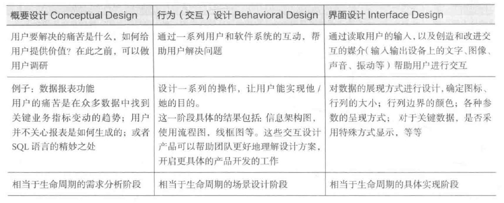

### 评价标准

对软件的用户界面有一些评价标准，总结如下：

1、尽快提供可感触的反馈

2、系统界面符合用户的现实惯例

3、用户有控制权

4、一致性和标准化，也就是软件中出现的用语前后要一致

5、适合各种类型的用户，我们没有必要为了将就初学者，就把操作摆放到最显眼的位置，交互设计的一个原则是，如果看似不明显的交互操作解释一次过后，就很容易理解，那么这就是一个好的设计

6、帮助用户识别、诊断并修复错误

7、有必要的提示和帮助文档

## 软件测试

测试的目的是为了用测试用例test case找到bug，测试用例集test suite是一组相关的测试用例。

bug可以分解为症状（Symptom）、程序错误（Fault）、根本原因（Root Cause）

### 测试的分类

#### 按测试设计的方法分类

测试可以按照测试设计的方法分为黑箱（Black Box）和白箱（White Box）

黑箱是指在设计测试的过程中把软件系统当做一个黑箱，无法了解或使用系统的内部结构及知识，即从软件的行为，而不是内部结构出发来设计测试。

白箱是指在设计测试的过程中，设计者可以看到软件系统的内部结构，并利用这一点来选择测试数据及具体的测试方式。

#### 按测试的目的分类

可以分为功能测试和非功能测试。

功能测试就是测试软件的基本功能，测试的具体种类如下：

为了测试非功能需求（Non-functional Requirement）和服务质量需求（Quality of Service Requirement），当基本功能完成之后还需要做非功能测试：

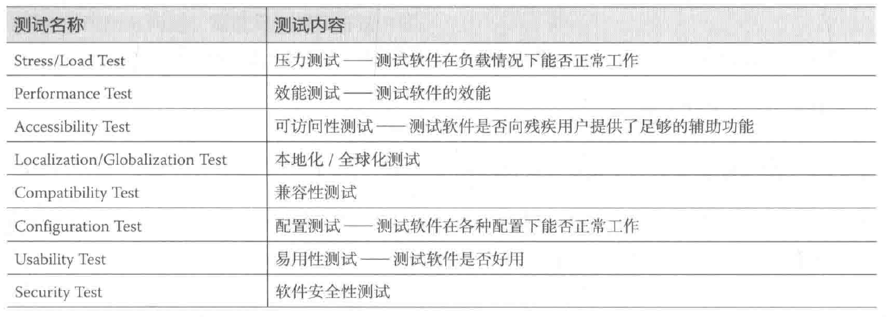

#### 按测试的时机和作用分类

在软件开发的过程中，不少测试起着烽火台的作用，它们告诉我们软件开发的流程是否顺畅，这些测试如下：

此外，根据不同的测试方法还分为以下几种：

### 具体的测试方法

之前我们提过单元测试、代码覆盖率测试和回归测试，除此之外还有很多测试方法。

#### 构建验证测试（Build Verification Test，BVT）

构建验证测试是指在一个构建完成之后，构建系统会自动运行一套测试，验证系统的基本功能。大多数情况下，这个测试是自动进行的。

在运行BVT之前，可以运行所有的单元测试，以保证系统的单元测试和程序员的单元测试版本一致。

通过BVT的构建可以成为可测（Testable），意思是团队可以用这一版本进行各种测试，因为它的基本功能都是可用的，反之通不过BVT的构建称为失败的构建（Failed，Rejected）

如果构建测试不能通过，那么自动测试框架会针对每一个失败的测试自动生成一个Bug，一般来说，这些Bug都有最高优先级，开发人员要首先处理。面对这些bug，我们可以选择：

1、找到导致失败的原因，如果原因很简单，程序员就可以立即修改并直接提交

2、找到导致失败的修改集，把此修改集剔出此版本，修正bug后再重新提交

3、在下一个构建前修正该bug

方法1和2都可以使今天的构建成为可测的，但有时各方面相互依赖，导致只能选择方法3.

#### 验收测试Acceptance Test

测试团队拿到一个可测的构建之后，就会按照测试计划来测试各自负责的模块和功能。测试时把支持的所有场景都列出来，然后按功能分类测试，如果测试成功，就在此场景标明成功，否则就标明失败，对场景的测试都完成后，就可以制作场景测试报告：

可以通过测试报告计算总的通过率。如果所有场景都能通过，则称构建可用，那么这一个版本就可以给用户使用了。

这样的测试就被称为验收测试，如果构建通过了这样的测试，这个构建就被团队接受了。但是注意构建可用不代表所有的功能都没问题，有些还没有定义的用户场景或者不按照规范操作的场景都有可能出现bug。

#### 探索式测试Ad hoc Test

也被称为Exploratory Test。这种测试是指为了某个特定目的而进行的测试，且就这一次，以后一般也不会重复测试。例如按计划是进行A模块的测试，但是测试人员灵机一动测试了另一个功能B。这种比较灵活的测试方法通常可以找到许多意外的bug。

探索式的测试流程是不可重复的，不能自动化。

#### 场景/集成/系统测试Scenario/Integration/System Test

在软件开发的一定阶段，我们要对一个软件进行全面和系统的测试，以保证软件的各个模块都能共同工作，这类测试就是系统/集成测试。

场景测试是以场景为驱动的测试，考虑用户在使用软件时的流程，模拟该流程。

当一个模块稳定的时候，就可以把它集成到系统，和整个系统一起测试，我们不要过早的进行集成测试，否则会多出很多Bug。

#### 伙伴测试Buddy Test

系统测试总是要等到适当的时机，而伙伴测试不会。当写好单元测试之后，开发人员就可以找一个测试人员作为伙伴，在签入新代码之前，开发人员做一个包含新模块的私人构建，测试人员在本地完成必要的回归、功能、继承、探索测试，发现问题直接和开发人员沟通，无需等待，解决后再正式签入代码。

这样的测试方式避免了整体系统稳定性的下降，也避免了层层会诊的成本。

#### 效能测试Performance Test

这是为了测试一些非功能需求和服务质量需求的测试。这里主要涉及两个概念：

1、设计负载，如每秒钟承受20次请求，还可以细化请求的种类，结合各类请求的发生频率，来制定更详尽的负载目标。

2、满意的服务质量，如在2秒内返回结果，有时写的操作时间要求可以放宽一些。

效能测试有对硬件的要求，每次测试都必须在相同机器和网络环境中，这样才能避免外部随机因素干扰。

在进行效能测试的过程中，可以得到系统效能和负载的一个对应关系，此时就可以看到能维持系统正常功能的最大负载是多少，如果负载足够大，或者过分大，那就形成了另外一种测试，也就是压力测试。

#### 压力测试Stress Test

压力测试要验证的问题是：软件在超过设计负载情况下是否能返回正常结果，没有严重的副作用或崩溃。

对于一个购物网站来说，所有请求都能在网络超时前返回，就可以认为正常，返回系统忙的提示也被认为是正常。但是如果在这个过程中导致有些请求执行了，有些没执行，或者数据丢失，那就是异常情况。

一般要模拟几十个小时的高负载才能认为系统通过测试，因为网络的负载是有时间性的。

在这个过程中可能会暴露一些问题，如内存泄露、死锁等。

#### 内部/外部公开测试Alpha/Beta Test

Alpha Test一般是指在团队之外、公司之内进行的测试；Beta Test指把软件交给公司外部的用户进行测试。

#### 易用性测试Usability Test

一般由可用性工程师来实行和主导。

#### Bug Bash

在某一天，所有测试人员，有时也会有开发人员，都放下手里的工作，大家一起找bug，然后结束时，统计并奖励找到最多和最厉害的bug的员工。

bug bash并不是乱点，而是有规划的，bug类型可以限定，可以有探索式的思路。

### 测试工作中的文档

在测试时，我们要制定测试计划，写测试设计说明书、测试用例、程序错误报告和测试报告：

#### 测试设计说明书TDS

TDS主要描述：

#### 测试用例Test Case

根据TDS来对每一个功能点测试时，需要用到测试用例，一个功能的所有测试用例称为这个功能的测试用例集。

在实际过程中，要把纷繁的情况总结成几种类型，如几种情形下的正确输入，错误输入要求提示正常等。

测试时需要注意测试边界值。

测试时可以采用Pair-wise和正交试验设计方法，也就是将可能导致bug的因素全部列出，然后两两组合的测试。研究表明，通常只有两个因素对某个bug起关键作用，因此这种方法在一定程度上是高效的。

#### 错误报告Bug Report

主要包括以下内容：

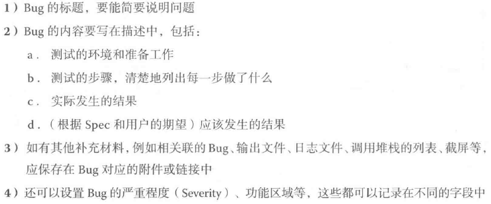

当开发人员修复了一个缺陷并签入代码后，一个新的构建就会包含这一个修复Bug Fix。测试人员要做的就是验证修复，验证是否已经无缺陷，或者查看是否引起其他问题。

在完成测试之后，测试人员就可以关闭缺陷报告，同时记录修复历史，有时还要将此bug做成一个测试用例，保证以后测试活动都会重新检测。

#### 测试报告Test Report

主要报告各个功能的测试结果，如多少测试用例通过、多少失败、多少未完成、发现多少测试用例之外的bug？这个报告能帮助我们从宏观上了解还有多少事情没有完成，各个功能的相对质量如何。

## 质量保障

### 软件质量、衡量及其因素

软件的质量=程序质量+软件工程的质量

程序的质量和具体的应用场景有关，可能是准确度、查询速度、并发度、国际化和安全化的质量。

软件工程的质量简单来说就是功能、成本、时间，包括软件开发的可见性（开发的软件能不能尽快演示）、风险控制、管理因素、交付质量、成本控制、内部质量的完成情况（如测试用例的数量、测试自动化的程度、每日构建的速度、自动部署系统的效率、代码覆盖率、文档的质量等）

衡量软件工程质量标准不同，其中一套比较成熟的理论是CMMI（Capacity Maturity Model Integrated，能力成熟度模型集成），实践表明，运用该模型管理项目，不仅降低了项目的成本，而且调高了项目的质量和按期完成率。

CMMI分为五个等级：初始级、管理级、明确级、量化管理级、优化级。每一个级别都是更高一级的基石。它可以用来衡量某个项目中的管理能力，也可以用来形容一个企业的成熟度。

要达到一定的软件质量，是要付出成本的，大概包括预防、评审、内部故障、外部故障、流程分析改进、提高职业技能、技术投资等。一个开发者一般每天只有很少的时间写新功能的代码，其他时间都耗在软件质量成本上了。

### 质量保障工作QA

QA和测试是不同的，QA是为了让软件达到事先定义的质量标准而进行的所有活动，包括测试工作。

所有人都可以参与QA的工作，但是最后要有一个角色对QA这件事负责。

软件开发过程中有下列几个问题容易产生疑惑：

1、有了专门的测试不代表开发人员就对质量不负责，因为测试人员不是最了解程序的人，开发者才是。开发人员自测时，要以独立的心态测试，而不是想着如何掩盖错误

2、分工之后，每个角色为了自己的绩效而优化，会出现局部最优而非全局最优的情况

3、测试并不完全负责测试，也要了解程序

4、分工要明确，每个角色都有他的责任

有些公司内部没有独立的测试角色，这是因为：

1、每个角色能力相对较强

2、全公司人员经常使用自己的产品，可以通过用户的反馈和实时状态分析需求，或者有专门的外部团队来寻找bug

团队应该这样培养和安排一个角色：

## 稳定和发布阶段

一个团队经历了计划、设计、开发等阶段，达到代码完成这一目标，似乎后面的事情是水到渠成的，但是软件生命周期的最后阶段往往就是最考验团队的，考验团队的项目管理水平、应变能力。

所有的软件公司都希望修正所有缺陷后再发布软件，但是这几乎是不可能的，只有优秀的软件公司才能找到一个平衡点，能够及时发布软件的同时及时修改软件中的问题。

说到质量时，我们不提全面质量管理，因为如果大家都将全面质量管理，则意味着我们的质量管理没有抓到点子上。

在最后的稳定和发布阶段，有一些常用的名词：

1、Alpha：指集成了主要功能的第一个试用版本，仅仅在内部使用，给外部用户使用的Alpha版本会起一个比较美的名字，如技术预览版（Technical Preview）

2、Beta：功能基本完备，稳定性也比Alpha要好，用户可以在实际工作中小范围使用

3、ZBB（Zero Bug Build）：某天的版本要把在这之前（例如48小时前）记录的Bug都解决掉

3、RC（Release Candidate）：发布候选版本，RC1/RC2。。直到RTM为止，版本间隔时间较短

4、RTM（Release To Manufacturer）：最终发布版本，会把最终的版本和相关的文件资料交给另一个团队去包装、刻制光盘。

5、RTW（Release To Web）：对于网络应用来说，我们需要依赖web来发布最终版本，一般会交给网站运营团队去管理，这样的发布也可以叫做RTO（Release To Operation），把软件提交到各个应用商店则可以成为Release To Store。

### 从代码完成到发布

从代码完成到最终发布软件的流程：

#### 会诊小组Triage Team

会诊小组是软件团队各个角色代表组成的小组，处理每一个影响产品发布的问题。

对于每一个bug，会诊小组会决定采取下面哪一个行动：修复/设计本来如此/不修复/推迟

随着项目进展和发布日期的接近，团队还要保证修改方案不会给产品带来负面的影响，这时会诊会议中开发者提交参加会诊的bug和修改方案，由会议决定是否同意修改方案。

提交参加会诊的bug和修改方案中，主要要报告的是：

会议讨论的结果有以下几种：

1、Must：必须修复，修复方案可行，相关的测试都通过

2、More info：需要更多信息，可能是缺陷的影响不明确，后果不明确，相关测试不完备或者解决方案有缺陷

3、No：不能接受，可能是推到下一个里程碑，可能是提出的解决方案不符合要求

4、Like：可能，但不一定必须修复，但是解决方案相对比较安全。这个属于一种中间状态，在相对简单的项目中可能没有这种状态，如果在当天的会诊中有Must，那么处于Like状态的修复就可以一起集成到代码库；如果没有Must，那么LIke就只能处于待命状态，直到出现Must为止，如果一直没有Must，那么这些修复就只能等到下一个里程碑了。这样做的好处是最终版本不会因为小问题而不断更新，消耗过多的测试资源。

此外，项目接近尾声时，达到Must的标准要越来越高，这样做可以放走一些无伤大雅的Bug，让项目能如期完成。在Alpha阶段，拿到一个bug可以马上修复，在Beta阶段就要得到大家的同意再修复，在RC（Release Candidate）阶段，一般要通过会诊来决定是否值得花时间。

如果修改方案被拒绝，也不意味着努力是白费的，可以将修改方案签入另外的源代码分支中。

#### 设计变更Design Change Request

当经过Alpha/Beta阶段，就会收到不少用户的反馈，原来的设计也有不少要改进的地方，此时就可以提出DCR。

提出DCR时，要指明问题在哪里，问题的影响，如果不修改会有什么后果，然后列出几种修改方案以及各种方案的优缺点和成本。

然后会诊DCR，按照影响和成本排序，根据现有资源，按照排序来重新设计。

#### ZBB

ZBB新的构建把已知的bug都解决掉，当团队修复了所有bug，下一个版本发布之后，测试人员和用户会有很多机会使用到新的功能和场景，此时bug数会以惊人的速度反弹，故ZBB又称为Zero Bug Bounce。系统要经历几次反弹，最后接近0.

在ZBB的定义中并不是追求bug数量绝对的0，因为bug是一直在新增的，而是处理一段时间前所有的bug，如处理掉48小时前出现的bug。

#### 回归测试

项目临近结束时，所有人员都要回归测试所有的bug，每个人都要帮助团队确保这些bug是被修复了，而且没有导致功能的回归。

#### 砍掉功能

来不及实现预期设计需求的处理方式就是取消掉一个功能。不能因为沉没成本而不舍得修改，不能因为以前花了成本，就要去以后一定要完成某个任务。

#### 逐步冻结

随着程序功能的完善，我们要让程序的各个方面有次序的冻结，这样才能把稳定的软件交给用户。一般来说，程序的人机交互界面最先开始冻结，不能再随意修改。当功能冻结后，bug都解决掉，然后在下一个版本前不要再碰于此功能相关的代码，如果有新的功能要加入就在源代码的基础上创建分支，让当前版本和将来版本工作分开进行。

### 渐进发布

在互联网时代，出现了一个产品同时对不同的目标用户用不同的频率来发布的情况，如小米公司的MIUI对几千人的荣誉内测组是一天一更新，对几百万开发组一周一更新，对几千万普通用户推出稳定版本。微软在windows10发布的过程中，也采用了同样的方式：

每日构建的测试用户群是金丝雀，早期矿工用金丝雀来检测瓦斯泄漏，说明金丝雀非常敏感。如果金丝雀用户能认定当前的windows通过了基本测试，那么这个版本就能推向更大的用户群。

### postmortem事后诸葛亮会议

一个里程碑结束的时候要组织会议讨论，会议的核心问题是如果可以重新来过，什么方面可以做的更好。多问几次为什么，找到问题的根源。

会议模板：

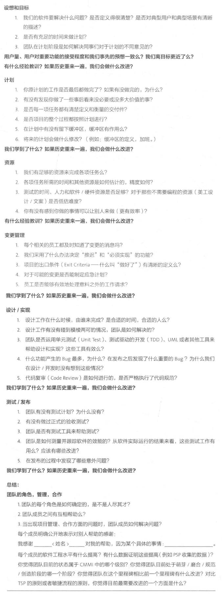

这个会议在进行的时候要保持会议轻松愉快的氛围，当大官的最好不要出现，让大家畅所欲言，即使出现，也要低调，不能为自己的行为辩护。坚持对事不对人，把重点放在改进，而不是挖旧账。让所有人都有充分发言的机会，记录改进意见并投票，最好执行票数最高的一些改进意见。

### 传说中的拐点

在软件项目中，有这样一个拐点存在，在这一点之前，新的bug产生的数量大于bug解决的数量，在这一点之后，bug解决数量大于bug新增的数量，bug曲线就向下移动。对于日期驱动型的项目来说，必须要控制这个拐点出现的时间，如果bug数量不断上升则无法保证以后bug会下降，此时就应该主动让拐点发生，如推迟一些bug、砍掉一些功能、升高bug的标杆等。

### 银弹之战

为了避免项目成员为了一些问题争执不休，可以采用银弹Silver Bullet，每个角色的代表在项目过程中可以使用有限次的“停止争论，按我说的办”的武器，也就是银弹。银弹一出大家就要听话，银弹的数量是受到限制的。

## 人和绩效

### 领导力

领导力有几个因素：设定目标、知人善任、带领团队成长、绩效管理。

#### 设定目标

好的目标有下面的特点SMART：

#### 知人善任

领导需要了解一个人的能力和动力。

能力包括知识、专业技能、职业技能三个方面；动力包括投入程度、热情程度、对团队目标的承诺等。动力低的人，无论能力高低，对团队的贡献都是非常有限的。

我们可以根据这二者的高和低，把团队成员分成四个象限：

处于不同象限的人，心理不一样，贡献不一样，对领导的期望也不一样，领导不能千篇一律的对待他们，而是要选择合适的时机，对不同的人施以不同的引导。

1、对第四象限的人：积极的初学者

在能力上对任务不太了解，没有经验，处于“我都不知道我不知道啥”的状态。在动力上很想学习，充满好奇心和热情，觉得学习新技能也不是太难，处于一种无知的乐观状态。

领导此时应该多提供能力上的帮助，肯定他们带来的可转化技能，设置SMART目标、优先级和检查点，循序渐进的学习计划；要限制自主性发挥，提供资料让他们学习，提供练习机会，或者做一对一的指导。

在动力方面要提醒他们为即将到来的困难做准备。经常检查并给予大量反馈。

2、对第三象限的人：迷惑的学习者

在能力上有一定的知识和技能，但是不知道如何前进，表现和进步并不是一贯优秀。在动力上有放弃的念头，害怕犯错误，处于知情的悲观状态。

领导此时应该在能力上提供机会提高技能，明确角色的定义，在动力上倾听他们的忧虑，分析他们的处境和前因后果，保证不放弃员工，鼓励他们不要放弃自己。

3、对第二象限的人：不爽的贡献者

在能力上有经验而且用实际成果证明了能力，给项目做出了实际的贡献。在动力上有时犹豫不决，有时觉得工作无聊或者对工作没有感情，如果没有适当的指导可能会产生价值危机，思考自己在团队的价值是什么，为什么辛苦的干活。

领导此时应该尽量让他们在拿手的领域发挥更多作用，增加交流的机会，让他们参与代码复审和设计复审。在动力方面倾听他们的看法和担忧，需要认可他们的成绩，同时要让目标更有挑战性一些。

4、对第一象限的人：自立且取得成就的人

在能力上公认是某领域的专家，在动力上自立自主，很自信同时能激励其他同事，达到知情的乐观状态。

领导此时应该在能力上让他们在相关领域做更多的学习和创新，在动力上要认可并重视他们的贡献，放手让他们发挥，给予更多的信任和自主权，给予更多的资源让他们发挥更大的作用。

#### 带领团队成长

团队合作分为多个阶段，平时大家似乎相安无事，但是一旦出现重大事件，就是对领导者智慧的考验了。

1、团队的第一个时期是萌芽阶段，在这个阶段大家刚开始互相认识，团队的目标没有达成一致，个人职责不清晰，成员非常依赖于团队领导的指导。

这个阶段大家都很有礼貌，每个人都想得到队友的接纳，试图避免冲突和容易引起挑战的观点，严重的问题不一定能够及时提出来讨论。

此时领导要带领团队弄清五个基础的问题：

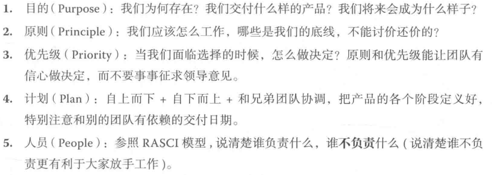

为了让团队能够应对后面的考验，领导要鼓励积极、公开的信息流动（如邮件、进度表、技术交流会等）。

在团队发展的初期，由于百废待兴，没有太多时间进行详细的讨论以达成共识，领导要快刀斩乱麻地做出一些重要的决定。

2、磨合阶段，大家开始讨论问题，出现冲突和竞争。磨合是一个团队成长的必经阶段，但是如果一个团队长期挣扎在磨合阶段，领导人要负最主要的责任。领导人要处理好的方面包括：

（1）信任：相信大家为了共同的目标前进，同事也会互相帮助，信任使团队效率变高，如可以让某个擅长某方面的人来帮助自己。敢于分享自己或自己团队中的薄弱环节。

（2）冲突：好的冲突，是基于信任的基础上直接对话，不要因为怕带入个人情绪而不让团队进行热烈的讨论。在团队中解决冲突主要可以用达成共识、投票、咨询几位专家、独裁、轮流做决定等。

（3）承诺：如果是团队讨论形成的决议，我就要去支持和执行，即使对我个人而言不是最优的情况。

（4）责任：按责任在保证质量的同时交付，同时也包括同事达不到团队标准时你也有责任去提醒。要培养一个负责任的团队文化，主要是领导者要展现出处理问题的态度。加强责任感的最好机会是周期性的目标检查会议。

（5）结果：保持明确的目标，时刻准备调整计划以实现目标。

3、规范阶段，此时团队成员们就角色、职责定义和流程都取得了比较一致的意见。此时团队成员之间进一步了解，彼此欣赏各自的能力和经验，在工作中相互支持并尊重各人的个性。团队的信心更足更有底气了。

同时团队做决定更有效率了，少部分相关人士就能直接做好决定，而不用请示领导。领导会把精力放在最难的问题上。做过的决定在一定时间内不会反复讨论。

此时领导不能每一件事都亲力亲为，一定要把精力投放到有价值的地方去。

4、创造阶段，这一阶段大家高度自治，目标统一，角色和职责能够自然的转换，没有人为此担心和发牢骚，所有人都能把大部分精力花在工作上。

此时领导要注意不能让团队成员过分自满，不重视与别的团队合作，不重视客户需求等。

#### 效能曲线和假团队

团队管理的效能曲线如下图：

警惕从工作组（乌合之众）过渡到真正团队时，可能出现假团队状态。

假团队状态下团队效率比工作组还低，此时领导对员工做表面工作，员工对领导虚情假意，私底下都不相信对方，也看不起对方。

### 猪、鸡和鹦鹉

在一片神奇的丛林中，一些动物决定合伙开一家早餐店，这些动物有猪、鸡和鹦鹉，其中具体分工如下：

猪提供猪肉、鸡提供鸡蛋、鹦鹉负责给团队其他成员建议、提供咨询等。这三种动物对于整个团队的投入程度是不同的，猪一旦创业失败就会把自己的固定利益赔进去，投入级别是全身心投入（Commited）；鸡能做重要的贡献，但是项目一旦失败，他们的生活还可以继续，投入级别是参与（Involved）；鹦鹉能提出很多建议，但是他们不执行，一旦项目失败，他们就会飞到另一个项目去，投入级别是围观（Bystander）。

人可以在n个地方做鸡、或者在m个地方做鹦鹉，但是不可能同时在两个地方做猪。在团队中，我们要分清成员对项目的投入属于哪一个级别，如果团队是一群猪，但是他们没办法做出重要贡献；如果是一群鸡，也许团队能和谐相处，但是没有高昂的斗志；如果是一群鹦鹉，大家只能不欢而散。

在遵循敏捷原则的团队中，一般有一个原则：重大决定由猪来定夺。在一些官僚层次驱动的项目中，往往会有一些鹦鹉来控制流程的关卡，他们对项目的具体情况不了解，做完决定往往拍拍翅膀飞走了。

在进行一些跨部门合作时，可以通过RASCI模型理清其中的角色：

项目的管理者要把每一个环节的RASCI都列出来，确保每一个环节都有且只有一个R。

### 绩效管理

绩效管理是软件工程中最具争议性的话题之一。关于绩效管理想法很多：

1、根据代码量计算：重构减少代码量导致贡献为负数？注释和空行如果也算贡献，那就没事写注释不编码了。如果根据目标码大小来计算，那所有的库都自己实现岂不是更好？

2、根据发现bug数评价测试：那么没人会愿意去找那些隐藏的较深的bug了

3、根据角色定位：所有鸡都会说自己是猪，所有鹦鹉都会说自己不是

4、根据工作时间：大家开始比谁走的晚

5、比资历：严重违反软件工程中赢者通吃的局面

虽然绩效管理的方法多种多样，但是必须要明确的是任何一种衡量方法都比完全不衡量要好。但是也要避免所有人都评优，这样会让优秀的人离开，团队在平庸中被淘汰。

有的公司实施过二维的评价体系：

将员工根据人员百分比评出最好的20%、中间的70%和需要改进的10%，结合每个人的目标和完成情况，得到最终的评价。有不少经理会抱怨评价带来的工作量变多，如果明确了员工是公司最宝贵的财产，多花一些时间又算的了什么呢。

公开刺激和闷声发财是两个互相对立的处理手段，公开刺激会直接给优秀员工发奖金而辞掉比较差的员工，闷声发财是绩效不做排序，直接按照绩效发工资。

工资并不是驱动的唯一手段，实践表明，纯粹的金钱奖励只对体力劳动或有明确规则的活动有效，在需要创造性思维的活动中，过多的奖金反而起到相反的效果，此时应该着重考察下面三种驱动因素：

1、自主性：能自己决定工作的部分内容

2、精通某个领域：在重要的领域做到更好

3、使命：工作由挑战性，工作的结果有意义

### 萝卜和白菜

有两位员工在项目中的表现截然不同，萝卜在一定时间内做更多的工作、但是也产生很多的bug，导致项目后期很多时间都用在修改bug上，但是因为写的内容多，其他人对他写的模块不是很熟悉，所以离开他不行，很多人认为他有突出贡献；白菜按期完成工作，产生很少的bug，在项目后期不仅早早解决自己的bug，还帮助其他同事完成任务，修复的缺陷不多。

这两个人到底谁高谁低，不同的领导有不同的看法，但是可以肯定的是如果团队中的萝卜工作速度过快，可能会给项目带来毁灭性的打击，此时要及时用小强地狱约束开发速度。

